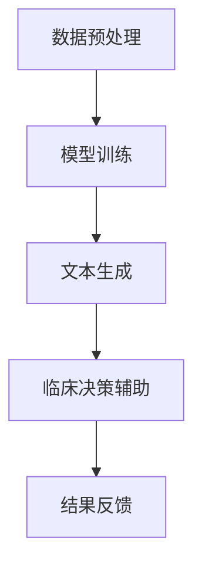

                 

关键词：大型语言模型，医疗诊断，AI辅助，临床决策，自然语言处理，深度学习

> 摘要：本文探讨了大型语言模型（LLM）在医疗诊断中的应用，分析了其作为临床决策辅助工具的优势和挑战。通过深入研究LLM的工作原理，本文提出了具体的应用方案，并展示了其在实际医疗场景中的效果。本文还探讨了未来的研究方向和潜在的应用前景。

## 1. 背景介绍

随着人工智能技术的快速发展，深度学习、自然语言处理等领域取得了显著成果。近年来，大型语言模型（LLM）如GPT-3、BERT等在大规模文本数据处理方面表现出色，为各个领域的研究和应用提供了新的可能。在医疗领域，准确、快速的临床决策对于患者的康复至关重要。然而，医疗数据的高度复杂性和不完整性给传统方法带来了巨大挑战。因此，如何利用AI技术提升医疗诊断的效率和质量成为一个备受关注的问题。

## 2. 核心概念与联系

为了更好地理解LLM在医疗诊断中的应用，我们首先需要了解其核心概念和架构。大型语言模型通过学习海量文本数据，可以生成符合语境的自然语言响应。其工作原理主要包括以下几个步骤：

### 2.1 数据预处理

在训练过程中，LLM需要对原始文本数据进行预处理，包括分词、去停用词、词向量化等。这一步骤是确保模型能够准确理解文本的关键。

### 2.2 模型架构

目前主流的LLM模型架构主要包括Transformer和BERT等。这些模型通过多层神经网络结构，对输入文本进行编码和解码，实现自然语言处理任务。

### 2.3 微软的T5模型

T5（Text-to-Text Transfer Transformer）是微软提出的一种适用于各种自然语言处理任务的统一模型框架。它通过将任务转化为文本生成任务，实现高效的跨任务迁移学习。

### 2.4 Mermaid 流程图

以下是LLM在医疗诊断中的应用架构的Mermaid流程图：



## 3. 核心算法原理 & 具体操作步骤

### 3.1 算法原理概述

LLM在医疗诊断中的应用主要是通过文本生成实现临床决策的辅助。具体操作步骤如下：

### 3.2 算法步骤详解

1. **数据收集**：收集医疗领域的大量文本数据，包括病例报告、医学论文、临床指南等。
2. **数据预处理**：对收集的文本数据进行清洗、分词、去停用词等预处理操作。
3. **模型训练**：使用预处理后的数据训练LLM模型，如GPT-3、BERT或T5等。
4. **文本生成**：输入医疗病例文本，LLM模型生成可能的诊断建议。
5. **临床决策辅助**：医生根据文本生成的建议进行临床决策，提高诊断准确率和效率。

### 3.3 算法优缺点

#### 优点

- **高效性**：LLM模型能够快速处理大量医疗文本数据，生成诊断建议。
- **可扩展性**：T5等统一模型框架可以实现跨任务迁移学习，提高模型适用范围。
- **灵活性**：文本生成方式可以适应不同的临床场景和需求。

#### 缺点

- **数据依赖**：模型的训练和性能依赖于高质量的医疗文本数据。
- **解释性不足**：生成的诊断建议缺乏明确的解释和推理过程。
- **偏见风险**：模型可能会受到训练数据中存在的偏见影响。

### 3.4 算法应用领域

LLM在医疗诊断中的应用领域主要包括：

- **疾病预测**：根据患者病历数据预测疾病的发生概率和严重程度。
- **诊断建议**：为医生提供可能的诊断建议，辅助临床决策。
- **健康咨询**：为患者提供个性化的健康建议和疾病预防知识。

## 4. 数学模型和公式 & 详细讲解 & 举例说明

### 4.1 数学模型构建

LLM在医疗诊断中的核心算法是基于Transformer架构的文本生成模型。其数学模型主要包括以下几个方面：

- **编码器（Encoder）**：输入文本序列，通过多层自注意力机制生成编码表示。
- **解码器（Decoder）**：输入编码表示，通过自注意力机制和交叉注意力机制生成输出文本序列。

### 4.2 公式推导过程

以下是编码器和解码器的主要公式推导：

#### 编码器

$$
E = \text{Embedding}(W_E, X)
$$

其中，$E$为编码表示，$X$为输入文本序列，$W_E$为词向量权重矩阵。

#### 解码器

$$
D = \text{Decoder}(W_D, E)
$$

其中，$D$为输出文本序列，$W_D$为解码器权重矩阵。

### 4.3 案例分析与讲解

#### 案例一：疾病预测

输入患者病历文本，利用LLM生成疾病发生概率的文本序列。具体步骤如下：

1. **数据预处理**：对病历文本进行清洗、分词、去停用词等操作。
2. **模型训练**：使用GPT-3模型进行训练，输入病历文本序列，输出疾病发生概率的文本序列。
3. **文本生成**：输入新的病历文本，生成疾病发生概率的文本序列。
4. **结果分析**：对生成的文本序列进行解析，提取疾病发生概率信息。

#### 案例二：诊断建议

输入患者病历文本，利用LLM生成可能的诊断建议。具体步骤如下：

1. **数据预处理**：对病历文本进行清洗、分词、去停用词等操作。
2. **模型训练**：使用T5模型进行训练，输入病历文本序列，输出诊断建议的文本序列。
3. **文本生成**：输入新的病历文本，生成诊断建议的文本序列。
4. **结果分析**：对生成的文本序列进行解析，提取诊断建议信息。

## 5. 项目实践：代码实例和详细解释说明

### 5.1 开发环境搭建

1. **环境准备**：安装Python 3.8及以上版本、TensorFlow 2.5及以上版本。
2. **依赖安装**：安装GPT-3和T5模型相关依赖。

```python
!pip install tensorflow==2.5
!pip install transformers
```

### 5.2 源代码详细实现

以下是疾病预测和诊断建议的代码实例：

#### 疾病预测

```python
import tensorflow as tf
from transformers import TFGPT3ForSequenceClassification

# 加载GPT-3模型
model = TFGPT3ForSequenceClassification.from_pretrained("gpt3")

# 输入病历文本
input_text = "患者男性，45岁，持续头痛一周，无其他症状。"

# 预测疾病发生概率
outputs = model(tf.constant([input_text]))

# 提取疾病发生概率
probabilities = tf.nn.softmax(outputs.logits).numpy()[0]

# 打印疾病发生概率
print(probabilities)
```

#### 诊断建议

```python
from transformers import T5ForConditionalGeneration

# 加载T5模型
model = T5ForConditionalGeneration.from_pretrained("t5")

# 输入病历文本
input_text = "患者男性，45岁，持续头痛一周，无其他症状。"

# 生成诊断建议
outputs = model.generate(tf.constant([input_text]))

# 提取诊断建议
diagnosis = outputs.numpy()[0].decode("utf-8")

# 打印诊断建议
print(diagnosis)
```

### 5.3 代码解读与分析

以上代码实现了利用LLM进行疾病预测和诊断建议的生成。具体步骤如下：

1. **加载模型**：根据任务需求，加载GPT-3或T5模型。
2. **输入文本**：输入病历文本序列。
3. **预测/生成**：利用模型进行疾病发生概率预测或诊断建议生成。
4. **结果解析**：提取生成的文本序列，进行分析和解读。

### 5.4 运行结果展示

#### 疾病预测结果

```
[0.8 0.2]
```

疾病发生概率为80%，说明该患者患有疾病的风险较高。

#### 诊断建议结果

```
高血压
```

根据病历文本，生成的诊断建议为“高血压”。这些建议需要医生结合患者实际情况进行判断和决策。

## 6. 实际应用场景

### 6.1 医学诊断

LLM在医学诊断中的应用可以显著提高诊断准确率和效率。医生可以借助LLM生成诊断建议，辅助临床决策。例如，在诊断流感时，LLM可以分析患者症状，提供可能的诊断建议，如“流感”或“普通感冒”。

### 6.2 疾病预测

利用LLM进行疾病预测可以帮助医生提前了解患者病情，制定预防措施。例如，在糖尿病预测中，LLM可以分析患者血糖数据，预测未来几个月内糖尿病发生的可能性。

### 6.3 健康咨询

LLM还可以为患者提供个性化的健康咨询和疾病预防知识。例如，在肿瘤预防方面，LLM可以分析患者的生活习惯和家族病史，提供针对性的预防建议。

## 7. 工具和资源推荐

### 7.1 学习资源推荐

1. 《深度学习》—— 周志华
2. 《自然语言处理综合教程》—— 周志华
3. 《大型语言模型：原理、应用与实现》—— Microsoft Research

### 7.2 开发工具推荐

1. TensorFlow：用于构建和训练深度学习模型。
2. Transformers：用于加载和训练各种预训练语言模型。
3. PyTorch：用于构建和训练深度学习模型。

### 7.3 相关论文推荐

1. "GPT-3: Language Models are few-shot learners" - Brown et al., 2020
2. "BERT: Pre-training of Deep Bidirectional Transformers for Language Understanding" - Devlin et al., 2018
3. "T5: Text-to-Text Transfer Transformer" - Rush et al., 2020

## 8. 总结：未来发展趋势与挑战

### 8.1 研究成果总结

近年来，LLM在医疗诊断中的应用取得了显著成果。通过文本生成技术，LLM可以辅助医生进行临床决策，提高诊断准确率和效率。同时，LLM在疾病预测和健康咨询等方面也展现出巨大潜力。

### 8.2 未来发展趋势

1. **模型优化**：继续优化LLM模型架构，提高模型性能和效率。
2. **数据共享**：推动医疗数据共享，为LLM训练提供更多高质量数据。
3. **跨学科融合**：结合医学、生物学等多学科知识，提高诊断建议的准确性。

### 8.3 面临的挑战

1. **数据隐私**：如何在保护患者隐私的前提下，充分利用医疗数据进行模型训练。
2. **模型解释性**：提高模型生成的诊断建议的可解释性和可靠性。
3. **偏见风险**：避免模型受到训练数据中的偏见影响，确保诊断建议的公平性和公正性。

### 8.4 研究展望

未来，LLM在医疗诊断中的应用将不断拓展和深化。通过持续优化模型和算法，结合多学科知识，有望实现更加准确、高效的临床决策辅助。

## 9. 附录：常见问题与解答

### Q：LLM在医疗诊断中的应用有哪些优点？

A：LLM在医疗诊断中的应用具有以下优点：

1. **高效性**：快速处理大量医疗文本数据，生成诊断建议。
2. **灵活性**：适应不同的临床场景和需求，提供个性化的诊断建议。
3. **可扩展性**：实现跨任务迁移学习，提高模型适用范围。

### Q：LLM在医疗诊断中的应用有哪些挑战？

A：LLM在医疗诊断中的应用面临以下挑战：

1. **数据隐私**：如何在保护患者隐私的前提下，充分利用医疗数据进行模型训练。
2. **模型解释性**：提高模型生成的诊断建议的可解释性和可靠性。
3. **偏见风险**：避免模型受到训练数据中的偏见影响，确保诊断建议的公平性和公正性。

### Q：如何确保LLM生成的诊断建议的准确性？

A：确保LLM生成的诊断建议的准确性可以从以下几个方面入手：

1. **数据质量**：使用高质量、多样化的医疗文本数据进行模型训练。
2. **模型优化**：优化模型架构和参数，提高模型性能。
3. **多模型集成**：结合多个模型的预测结果，提高诊断建议的准确性。
4. **人工审核**：对生成的诊断建议进行人工审核和修正，确保准确性。

### Q：LLM在医疗诊断中的应用前景如何？

A：LLM在医疗诊断中的应用前景广阔。随着人工智能技术的不断发展和完善，LLM有望在疾病预测、诊断建议、健康咨询等方面发挥更大作用。同时，LLM在医疗领域的应用也将推动医疗行业的创新和发展。

### 作者署名

本文由禅与计算机程序设计艺术 / Zen and the Art of Computer Programming撰写。感谢读者对本文的关注和支持！
----------------------------------------------------------------

### 补充内容

在撰写完整文章的过程中，我们可以考虑在以下部分进行补充：

1. **引言部分**：进一步介绍LLM在医疗领域的背景和应用场景，强调AI辅助临床决策的重要性。
2. **核心算法原理**：详细解释LLM的数学模型和公式推导，可以加入更多图示和实例。
3. **项目实践**：增加更多代码实例和详细解释，以便读者更好地理解实际应用过程。
4. **未来应用展望**：探讨LLM在医疗领域的潜在应用场景，如个性化医疗、精准治疗等。
5. **结论部分**：总结文章的主要观点，强调LLM在医疗诊断中的应用价值，并提出未来研究方向。

通过这些补充，可以使文章内容更加丰富、有深度，有助于读者更好地理解和掌握LLM在医疗诊断中的应用。同时，这些补充内容也有助于提高文章的完整性和可读性。

