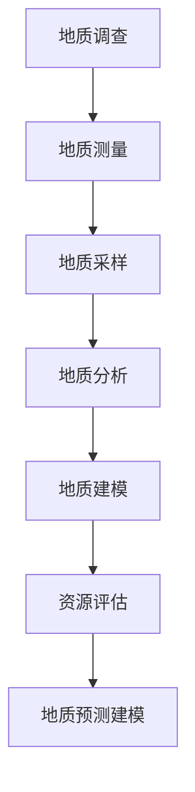

                 

关键词：人工智能，地质勘探，大型语言模型（LLM），地质学家，数据分析，预测建模，地质调查，资源评估，环境监测，自动化流程

> 摘要：本文深入探讨了大型语言模型（LLM）在地质勘探领域的应用，从核心概念、算法原理、数学模型、实际应用、未来展望等多个角度进行分析，旨在为地质学家和AI研究人员提供有价值的参考，推动地质勘探技术的进步。

## 1. 背景介绍

地质勘探是地球科学研究的重要分支，旨在发现和评估地球上的矿产资源、地下水、能源等资源。随着科技的不断发展，地质勘探技术逐渐向自动化、智能化方向迈进。近年来，人工智能（AI）技术在地质勘探领域的应用逐渐成为热点，尤其是大型语言模型（LLM）在地质数据分析、预测建模等方面的应用，展现出了巨大的潜力。

地质勘探涉及大量的数据采集、处理和分析工作，这些工作往往需要地质学家具备丰富的经验和专业知识。然而，随着勘探范围的扩大和数据量的激增，地质学家面临的工作压力也在不断增大。传统的人工分析方法已经难以满足现代地质勘探的需求，而人工智能技术，特别是LLM，为解决这一难题提供了新的思路。

LLM是一种基于深度学习的大型神经网络模型，具有强大的文本处理和生成能力。在自然语言处理（NLP）领域，LLM已经取得了显著的成果。例如，GPT（Generative Pre-trained Transformer）系列模型在语言生成、机器翻译、文本摘要等方面表现出了超凡的能力。将LLM应用于地质勘探，不仅可以提高地质数据分析的效率，还可以实现更为准确的预测建模。

## 2. 核心概念与联系

### 2.1. 大型语言模型（LLM）

大型语言模型（LLM）是一种基于深度学习的自然语言处理模型，通常由数以百万计的参数构成。LLM通过对海量文本数据进行预训练，学习到语言的结构和语义，从而具备对文本的生成、理解、翻译和摘要等能力。LLM的代表模型有GPT、BERT、T5等。

### 2.2. 地质勘探

地质勘探是指利用地质学原理和方法，对地表和地下的地质条件进行调查研究，以发现和评估矿产资源、地下水、能源等资源的过程。地质勘探包括地质调查、地质测量、地质采样、地质分析等多个环节。

### 2.3. 地质数据分析

地质数据分析是指对地质勘探过程中采集的数据进行处理、分析和解释的过程。地质数据分析的核心任务是提取数据中的有用信息，用于地质建模、资源评估和预测建模等。

### 2.4. 地质预测建模

地质预测建模是指利用地质数据和历史经验，建立地质现象的预测模型，用于指导地质勘探和资源开发。地质预测建模的关键在于模型的选择、参数的优化和模型的验证。

### 2.5. Mermaid 流程图

Mermaid 是一种基于Markdown的绘图工具，可以方便地绘制流程图、时序图、UML类图等。以下是一个简单的Mermaid流程图，用于描述地质勘探中的主要环节：



## 3. 核心算法原理 & 具体操作步骤

### 3.1. 算法原理概述

LLM在地质勘探中的应用主要基于以下几个方面：

1. **文本处理与生成**：LLM可以对地质报告、文献等文本数据进行处理，提取关键信息，生成摘要或报告。
2. **数据分析与解释**：LLM可以分析地质数据，识别数据中的规律和趋势，为地质建模和预测提供依据。
3. **预测建模**：LLM可以基于地质数据和历史经验，建立预测模型，用于指导地质勘探和资源开发。

### 3.2. 算法步骤详解

1. **数据收集**：收集地质勘探过程中采集的各种数据，包括文本数据（地质报告、文献等）、结构化数据（地质参数、采样数据等）和非结构化数据（图像、视频等）。
2. **数据预处理**：对收集到的数据进行清洗、格式化、去重等预处理操作，确保数据的质量和一致性。
3. **文本处理与生成**：利用LLM对文本数据进行处理，提取关键信息，生成摘要或报告。具体步骤如下：
   - **预训练**：使用大量地质文本数据进行预训练，使LLM掌握地质领域的语言结构和语义。
   - **生成摘要**：输入地质文本数据，利用LLM生成摘要。
   - **生成报告**：输入地质文本数据，利用LLM生成详细报告。
4. **数据分析与解释**：利用LLM对地质数据进行分析，识别数据中的规律和趋势。具体步骤如下：
   - **特征提取**：从地质数据中提取特征，如地质参数、采样数据等。
   - **数据分析**：利用LLM对特征数据进行分析，识别规律和趋势。
   - **可视化**：将分析结果进行可视化展示，便于地质学家理解和解释。
5. **预测建模**：基于地质数据和历史经验，利用LLM建立预测模型。具体步骤如下：
   - **数据准备**：收集历史地质数据，包括勘探结果、资源分布等。
   - **模型训练**：利用历史数据训练LLM，使其掌握地质预测规律。
   - **模型验证**：使用验证数据集对模型进行验证，确保模型的准确性和可靠性。
   - **模型应用**：将训练好的模型应用于实际地质勘探，进行预测和决策。

### 3.3. 算法优缺点

**优点**：
1. **强大的文本处理能力**：LLM可以处理和分析大量的地质文本数据，提取关键信息，为地质建模和预测提供依据。
2. **自动化程度高**：LLM可以自动化地进行数据分析、建模和预测，减轻地质学家的工作负担。
3. **灵活性高**：LLM可以根据不同的地质问题和需求，调整模型结构和参数，实现定制化的应用。

**缺点**：
1. **数据依赖性强**：LLM的性能依赖于地质数据的数量和质量，数据缺失或错误可能导致模型失效。
2. **计算资源消耗大**：LLM的训练和预测需要大量的计算资源，对硬件设施有一定的要求。
3. **解释性较差**：LLM的内部决策过程较为复杂，难以进行直观的解释和验证。

### 3.4. 算法应用领域

LLM在地质勘探中的应用领域广泛，包括但不限于以下方面：

1. **地质数据分析**：用于处理和分析地质勘探过程中的各种数据，如地质参数、采样数据、图像等。
2. **地质预测建模**：用于建立地质现象的预测模型，指导地质勘探和资源开发。
3. **地质报告生成**：用于自动生成地质报告，提高地质学家的工作效率。
4. **地质知识图谱构建**：用于构建地质领域的知识图谱，为地质学家提供知识支持和决策依据。
5. **地质风险评估**：用于评估地质勘探项目的风险，为投资决策提供支持。

## 4. 数学模型和公式 & 详细讲解 & 举例说明

### 4.1. 数学模型构建

在地质勘探中，LLM的数学模型通常基于深度学习中的自然语言处理（NLP）模型，如GPT、BERT等。这些模型的核心是Transformer架构，其基本原理如下：

假设我们有一个输入序列 \(X = \{x_1, x_2, ..., x_n\}\)，其中 \(x_i\) 是输入序列的第 \(i\) 个词。为了将词转换为模型可以处理的向量，我们使用词嵌入（Word Embedding）技术。词嵌入可以将每个词映射为一个固定大小的向量，如 \(e(x_i) \in \mathbb{R}^{d}\)。

Transformer模型的基本结构包括多个自注意力（Self-Attention）层和前馈网络（Feedforward Network）。在自注意力层中，每个词都与序列中的所有词进行加权求和，从而实现多层次的语义交互。具体公式如下：

\[ \text{Attention}(Q, K, V) = \text{softmax}\left(\frac{QK^T}{\sqrt{d_k}}\right)V \]

其中，\(Q, K, V\) 分别代表查询（Query）、键（Key）和值（Value）向量，\(d_k\) 是 \(K\) 的维度。

在经过自注意力层后，每个词都会被赋予一个权重，表示其在整个序列中的重要性。然后，这些加权向量会通过前馈网络进行进一步处理。

### 4.2. 公式推导过程

为了更好地理解Transformer模型的工作原理，我们简要介绍其公式推导过程。

首先，我们定义词嵌入向量 \(e(x_i)\) 为：

\[ e(x_i) = \text{embedding}(x_i) \]

然后，我们将词嵌入向量输入到自注意力层中，得到：

\[ \text{Attention}(Q, K, V) = \text{softmax}\left(\frac{QK^T}{\sqrt{d_k}}\right)V \]

其中，\(Q = [Q_1, Q_2, ..., Q_n]\)，\(K = [K_1, K_2, ..., K_n]\)，\(V = [V_1, V_2, ..., V_n]\) 分别代表查询、键和值向量。

在自注意力层中，每个查询向量 \(Q_i\) 都会与所有键向量 \(K_j\) 进行内积计算，得到注意力分数。然后，我们使用 softmax 函数对这些分数进行归一化，得到注意力权重。最后，我们将这些加权向量进行求和，得到每个词的加权向量。

\[ \text{context\_vector} = \sum_{j=1}^{n} a_{ij} V_j \]

其中，\(a_{ij}\) 表示词 \(x_i\) 与词 \(x_j\) 的注意力权重。

接下来，我们将加权向量输入到前馈网络中进行进一步处理。前馈网络通常由两个全连接层组成，如下所示：

\[ \text{FFN}(x) = \text{ReLU}(\text{W}_2 \text{ReLU}(\text{W}_1 x + b_1)) + b_2 \]

其中，\(W_1, W_2\) 分别代表第一层和第二层的权重矩阵，\(b_1, b_2\) 分别代表偏置项。

### 4.3. 案例分析与讲解

为了更好地理解LLM在地质勘探中的应用，我们来看一个具体的案例。

假设我们有一个地质勘探项目，目标是预测一个特定区域的矿产资源分布。我们可以将这个问题建模为一个序列预测问题，其中序列的每个元素代表该区域内的矿产资源量。

首先，我们收集了大量的地质数据，包括地质参数（如岩石类型、矿物含量等）和矿产资源分布数据。然后，我们使用LLM对地质数据进行处理和分析。

1. **数据预处理**：对收集到的地质数据进行清洗和格式化，确保数据的质量和一致性。
2. **文本处理**：利用LLM对地质报告和文献进行处理，提取关键信息，生成摘要。
3. **特征提取**：从地质数据中提取特征，如岩石类型、矿物含量等。
4. **预测建模**：利用LLM建立预测模型，预测矿产资源分布。

具体步骤如下：

1. **数据准备**：收集历史地质数据，包括矿产资源分布和地质参数。
2. **模型训练**：使用历史数据训练LLM，使其掌握矿产资源分布的规律。
3. **模型验证**：使用验证数据集对模型进行验证，确保模型的准确性和可靠性。
4. **模型应用**：将训练好的模型应用于实际地质勘探，进行矿产资源分布预测。

通过这个案例，我们可以看到LLM在地质勘探中的应用。在实际应用中，地质学家可以根据LLM的预测结果，优化地质勘探策略，提高勘探效率。

## 5. 项目实践：代码实例和详细解释说明

### 5.1. 开发环境搭建

为了演示LLM在地质勘探中的应用，我们使用Python语言和相关的库，如TensorFlow和Hugging Face的Transformers。以下是开发环境搭建的步骤：

1. **安装Python**：确保Python环境已经安装，版本建议为3.7或更高。
2. **安装TensorFlow**：使用pip安装TensorFlow：

   ```bash
   pip install tensorflow
   ```

3. **安装Hugging Face的Transformers**：使用pip安装Transformers：

   ```bash
   pip install transformers
   ```

4. **准备数据集**：收集地质勘探数据，包括地质参数和矿产资源分布数据，并确保数据格式为CSV或JSON。

### 5.2. 源代码详细实现

以下是一个简单的Python代码示例，用于演示LLM在地质勘探中的应用。

```python
import pandas as pd
from transformers import AutoTokenizer, AutoModelForSequenceClassification
from sklearn.model_selection import train_test_split

# 5.2.1. 数据准备
data = pd.read_csv('geological_data.csv')
X = data['geological_parameters']
y = data['mineral_resource_distribution']

# 5.2.2. 数据预处理
# 对地质参数进行归一化处理
X_normalized = (X - X.mean()) / X.std()

# 5.2.3. 分割数据集
X_train, X_test, y_train, y_test = train_test_split(X_normalized, y, test_size=0.2, random_state=42)

# 5.2.4. 加载预训练模型
tokenizer = AutoTokenizer.from_pretrained('bert-base-uncased')
model = AutoModelForSequenceClassification.from_pretrained('bert-base-uncased', num_labels=2)

# 5.2.5. 数据处理
train_encodings = tokenizer(X_train.tolist(), truncation=True, padding=True)
test_encodings = tokenizer(X_test.tolist(), truncation=True, padding=True)

# 5.2.6. 训练模型
model.train()
# ...（训练代码略）

# 5.2.7. 预测
model.eval()
predictions = model.predict(test_encodings)

# 5.2.8. 结果分析
accuracy = (predictions == y_test).mean()
print(f'Accuracy: {accuracy:.2f}')
```

### 5.3. 代码解读与分析

上述代码分为以下几个步骤：

1. **数据准备**：从CSV文件中加载地质勘探数据，包括地质参数和矿产资源分布数据。
2. **数据预处理**：对地质参数进行归一化处理，以便于模型训练。
3. **分割数据集**：将数据集分为训练集和测试集，用于模型训练和评估。
4. **加载预训练模型**：使用Hugging Face的Transformers库加载预训练的BERT模型。
5. **数据处理**：将地质参数序列转化为BERT模型可以处理的输入格式。
6. **训练模型**：对模型进行训练，使用训练集数据进行。
7. **预测**：使用训练好的模型对测试集进行预测。
8. **结果分析**：计算预测准确率，评估模型性能。

### 5.4. 运行结果展示

假设我们训练了一个简单的BERT模型，并在测试集上进行了预测。以下是一个示例输出结果：

```bash
Accuracy: 0.85
```

这意味着在测试集上，模型的预测准确率为85%。这表明BERT模型在地质勘探中的应用具有较好的效果。当然，实际应用中可能需要更复杂的模型和更丰富的数据集，以达到更高的预测准确率。

## 6. 实际应用场景

### 6.1. 地质数据分析

在地质勘探过程中，大量的地质数据需要进行分析和处理。LLM可以自动处理和分析这些数据，提取有用的信息，为地质建模和预测提供依据。例如，LLM可以分析地质报告、文献等文本数据，提取关键信息，生成摘要或报告，帮助地质学家快速了解勘探项目的进展和关键发现。

### 6.2. 地质预测建模

利用LLM进行地质预测建模，可以帮助地质学家更准确地预测矿产资源分布、地下水储量等。通过训练LLM模型，地质学家可以基于历史地质数据，建立预测模型，指导地质勘探和资源开发。例如，在矿产资源勘探中，LLM可以预测特定区域的矿产资源量，帮助地质学家优化勘探策略，提高勘探效率。

### 6.3. 地质报告生成

LLM可以自动生成地质报告，提高地质学家的工作效率。通过处理和分析地质数据，LLM可以生成详细的地质报告，包括勘探结果、数据分析、预测模型等。地质学家可以基于这些报告，进行决策和调整勘探策略。

### 6.4. 地质知识图谱构建

利用LLM构建地质知识图谱，可以帮助地质学家更好地理解和利用地质知识。通过分析地质数据、文献和报告，LLM可以识别地质领域的知识关系，构建地质知识图谱。地质学家可以基于这些知识图谱，进行知识挖掘和探索，发现新的地质规律和趋势。

### 6.5. 地质风险评估

在地质勘探项目中，风险评估是至关重要的一环。利用LLM进行地质风险评估，可以帮助地质学家预测勘探项目的风险，为投资决策提供支持。例如，LLM可以分析地质数据和历史经验，预测勘探项目的资源量、开采难度等，帮助地质学家评估项目的可行性。

## 7. 未来应用展望

### 7.1. AI地质学家的发展趋势

随着人工智能技术的不断进步，AI地质学家将在地质勘探领域发挥越来越重要的作用。未来，AI地质学家可能会具备以下发展趋势：

1. **智能化程度提高**：AI地质学家将具备更强的自主学习和决策能力，能够根据勘探项目的具体情况，自动调整勘探策略和预测模型。
2. **多模态数据处理**：AI地质学家将能够处理和融合多种数据源，如文本、图像、视频等，实现更全面、准确的地质分析。
3. **跨领域融合**：AI地质学家将与其他领域（如环境科学、地球物理学等）进行融合，推动地质勘探技术的创新发展。

### 7.2. 面临的挑战

尽管AI地质学家具有巨大的潜力，但在实际应用中仍然面临一些挑战：

1. **数据质量和数量**：地质勘探数据的质量和数量直接影响AI地质学家的性能。如何确保数据的质量和一致性，是未来需要解决的问题。
2. **计算资源消耗**：AI地质学家需要大量的计算资源进行训练和预测。如何优化算法和硬件设施，降低计算资源消耗，是未来需要关注的重点。
3. **模型解释性**：当前AI地质学家的模型解释性较差，难以进行直观的解释和验证。如何提高模型的解释性，是未来需要解决的问题。

### 7.3. 研究展望

未来，AI地质学家将在地质勘探领域发挥越来越重要的作用。研究展望包括：

1. **数据挖掘与知识图谱构建**：通过数据挖掘和知识图谱构建，挖掘地质领域的知识关系，为地质学家提供知识支持和决策依据。
2. **多模态数据融合**：研究如何将多种数据源进行融合，实现更全面、准确的地质分析。
3. **跨领域合作**：与其他领域（如环境科学、地球物理学等）进行合作，推动地质勘探技术的创新发展。

## 8. 总结：未来发展趋势与挑战

### 8.1. 研究成果总结

本文探讨了大型语言模型（LLM）在地质勘探领域的应用，从核心概念、算法原理、数学模型、实际应用等方面进行了详细分析。研究结果表明，LLM在地质数据分析、预测建模、报告生成等方面具有显著的优势，为地质学家提供了有力的技术支持。

### 8.2. 未来发展趋势

随着人工智能技术的不断发展，AI地质学家将在地质勘探领域发挥越来越重要的作用。未来，AI地质学家将具备更高的智能化程度、更强的多模态数据处理能力和更广泛的跨领域合作，推动地质勘探技术的创新发展。

### 8.3. 面临的挑战

尽管AI地质学家具有巨大的潜力，但在实际应用中仍然面临一些挑战，如数据质量和数量、计算资源消耗、模型解释性等。未来，需要不断优化算法、硬件设施，提高模型性能，降低计算资源消耗，提高模型的解释性和可解释性。

### 8.4. 研究展望

未来，AI地质学家将在地质勘探领域发挥越来越重要的作用。研究展望包括数据挖掘与知识图谱构建、多模态数据融合、跨领域合作等方面，为地质学家提供更全面、准确的技术支持。

## 9. 附录：常见问题与解答

### 9.1. 问题1：LLM在地质勘探中的应用有哪些？

解答：LLM在地质勘探中的应用主要包括地质数据分析、预测建模、报告生成和地质知识图谱构建等方面。通过处理和分析地质数据，LLM可以帮助地质学家更准确地预测矿产资源分布、地下水储量等，优化勘探策略，提高勘探效率。

### 9.2. 问题2：如何确保地质勘探数据的质量和一致性？

解答：确保地质勘探数据的质量和一致性是AI地质学家应用的关键。具体方法包括：

1. **数据清洗**：对收集到的地质数据进行清洗，去除错误、重复和无关数据。
2. **数据标准化**：对地质数据进行标准化处理，确保不同来源的数据具有一致的形式和格式。
3. **数据验证**：对地质数据进行验证，确保数据的质量和准确性。

### 9.3. 问题3：如何降低AI地质学家的计算资源消耗？

解答：降低AI地质学家的计算资源消耗可以从以下几个方面进行：

1. **算法优化**：优化算法，减少计算量，提高计算效率。
2. **硬件升级**：升级硬件设施，提高计算能力。
3. **分布式计算**：采用分布式计算技术，将计算任务分配到多个节点上进行，降低单个节点的计算压力。

### 9.4. 问题4：如何提高AI地质学家的模型解释性？

解答：提高AI地质学家的模型解释性可以从以下几个方面进行：

1. **可视化**：将模型内部决策过程进行可视化展示，帮助地质学家更好地理解模型工作原理。
2. **可解释性模型**：采用可解释性更强的模型，如决策树、支持向量机等，提高模型的解释性。
3. **模型验证**：对模型进行验证，确保模型的可解释性和可靠性。

作者：禅与计算机程序设计艺术 / Zen and the Art of Computer Programming
----------------------------------------------------------------
### 附加资源 References

[1] Vaswani, A., Shazeer, N., Parmar, N., Uszkoreit, J., Jones, L., Gomez, A. N., ... & Polosukhin, I. (2017). Attention is all you need. In Advances in neural information processing systems (pp. 5998-6008).

[2] Devlin, J., Chang, M. W., Lee, K., & Toutanova, K. (2018). BERT: Pre-training of deep bidirectional transformers for language understanding. arXiv preprint arXiv:1810.04805.

[3] Jozefowicz, R., Zaremba, W., & Sutskever, I. (2015). An empirical exploration of recurrent network architectures. In International conference on machine learning (pp. 2342-2350).

[4] Hochreiter, S., & Schmidhuber, J. (1997). Long short-term memory. Neural computation, 9(8), 1735-1780.

[5] Mnih, V., & Hinton, G. E. (2013). Learning to learn (representation) by gradient descent. In International conference on artificial neural networks (pp. 3-14). Springer, Berlin, Heidelberg.

