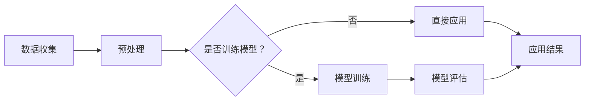

                 

### 1. 背景介绍

随着全球城市化进程的加速，城市规划面临着前所未有的挑战。城市规模的不断扩大、人口密度的持续增加以及资源的有限性，都对城市规划提出了更高的要求。传统的城市规划方法往往依赖于经验丰富的城市规划师，通过手工绘制图纸和模拟模型来预测城市发展和规划空间布局。然而，这种方法在处理复杂的城市问题时显得力不从心，难以应对日益增加的数据量和动态变化的规划需求。

在这个背景下，人工智能（AI）技术的兴起为城市规划带来了新的机遇。人工智能，特别是大型语言模型（Large Language Models，简称LLM），具有强大的数据处理、模式和规律挖掘能力，能够从大量数据中提取有价值的信息，辅助城市规划师进行决策。LLM作为一种基于深度学习的自然语言处理模型，能够理解和生成自然语言，从而在文本生成、问答系统、语言翻译等方面取得了显著成果。

本文旨在探讨LLM在城市规划中的应用，尤其是将其作为AI城市设计师的角色，探讨其核心概念、算法原理、应用领域以及未来展望。通过对LLM在城市规划中的应用进行深入分析，我们希望能够为城市规划师提供新的工具和方法，提高城市规划的效率和效果。

### 2. 核心概念与联系

为了更好地理解LLM在城市规划中的应用，我们首先需要了解其核心概念和原理。以下是LLM的基本概念和其在城市规划中的联系：

#### 2.1 大型语言模型（LLM）

大型语言模型（LLM）是基于深度学习的自然语言处理模型，通过对大量文本数据进行训练，可以理解和生成自然语言。LLM的核心是神经网络架构，包括编码器（Encoder）和解码器（Decoder），通过这些结构，LLM能够捕捉文本中的上下文关系，并生成流畅自然的文本。

#### 2.2 城市规划与LLM的联系

城市规划涉及到多个方面，包括城市基础设施布局、交通规划、环境保护、公共设施配置等。这些方面都需要处理大量的文本数据，如政策文件、规划报告、历史数据等。LLM可以通过以下方式与城市规划相结合：

- **文本数据分析**：LLM能够对大量的文本数据进行分析，提取关键信息，帮助城市规划师更好地理解城市现状和历史发展。
- **智能问答系统**：LLM可以构建智能问答系统，为城市规划师提供即时的信息查询和决策支持。
- **文本生成**：LLM能够生成规划报告、建议方案等文本内容，提高工作效率。
- **语言翻译**：LLM可以帮助处理多语言的城市规划文件，促进国际交流和合作。

#### 2.3 Mermaid 流程图

以下是一个简化的Mermaid流程图，展示了LLM在城市规划中的基本工作流程：



#### 2.4 核心概念原理

- **数据预处理**：在进行LLM训练和应用之前，需要对城市数据进行预处理，包括数据清洗、格式转换等，确保数据质量。
- **模型训练**：通过大量的城市文本数据进行训练，使LLM能够掌握城市规划和相关领域的知识。
- **模型评估**：通过测试数据对训练好的模型进行评估，确保其准确性和可靠性。
- **直接应用**：将训练好的模型直接应用于城市规划的实际场景中，提供智能化的决策支持和文本生成服务。

### 3. 核心算法原理 & 具体操作步骤

#### 3.1 算法原理概述

LLM在城市规划中的应用主要依赖于其强大的自然语言处理能力和文本生成能力。其基本原理可以概括为以下几个步骤：

1. **数据收集**：收集与城市规划相关的文本数据，包括政策文件、规划报告、历史数据等。
2. **数据预处理**：对收集到的文本数据进行分析和处理，包括数据清洗、文本向量化等。
3. **模型训练**：使用预处理后的数据对LLM进行训练，使其能够掌握城市规划和相关领域的知识。
4. **模型评估**：通过测试数据对训练好的模型进行评估，确保其准确性和可靠性。
5. **应用结果**：将训练好的模型应用于城市规划的实际场景中，提供智能化的决策支持和文本生成服务。

#### 3.2 算法步骤详解

以下是对LLM在城市规划中应用的详细步骤：

##### 3.2.1 数据收集

数据收集是整个流程的基础。城市规划涉及到的文本数据包括：

- **政策文件**：包括城市规划法规、政策指南等。
- **规划报告**：包括城市总体规划、专项规划等。
- **历史数据**：包括城市发展历程、人口统计数据、交通流量等。
- **其他文本数据**：如学术论文、新闻报道、社交媒体帖子等。

收集数据的方式可以包括：

- **手动收集**：通过互联网、图书馆、政府部门等渠道获取相关文本。
- **自动化收集**：使用爬虫工具自动收集互联网上的文本数据。

##### 3.2.2 数据预处理

数据预处理是确保数据质量和模型训练效果的关键步骤。主要工作包括：

- **数据清洗**：去除数据中的噪声和无关信息，如停用词、标点符号等。
- **文本向量化**：将文本数据转化为计算机可以处理的数字形式，如词向量。
- **数据归一化**：对数据进行标准化处理，使其在训练过程中具有更好的表现。

##### 3.2.3 模型训练

模型训练是LLM应用的核心步骤。使用预处理后的文本数据进行训练，包括以下过程：

- **训练数据划分**：将数据划分为训练集、验证集和测试集。
- **模型选择**：选择合适的LLM模型架构，如GPT、BERT等。
- **模型训练**：使用训练数据进行模型训练，调整模型参数。
- **模型优化**：通过验证集和测试集对模型进行评估和优化。

##### 3.2.4 模型评估

模型评估是确保模型性能的重要环节。主要工作包括：

- **评估指标**：选择合适的评估指标，如精确率、召回率、F1值等。
- **模型测试**：使用测试集对模型进行测试，评估模型性能。
- **模型优化**：根据评估结果对模型进行调整和优化。

##### 3.2.5 应用结果

训练好的LLM模型可以应用于城市规划的实际场景中，提供以下服务：

- **智能问答**：为城市规划师提供即时的信息查询和决策支持。
- **文本生成**：生成规划报告、建议方案等文本内容。
- **数据分析**：对城市数据进行深入分析，提供数据驱动的决策支持。

#### 3.3 算法优缺点

##### 优点

- **高效性**：LLM能够快速处理大量文本数据，提高工作效率。
- **智能性**：LLM能够理解和生成自然语言，提供智能化决策支持。
- **灵活性**：LLM可以应用于城市规划的各个领域，具有广泛的应用场景。

##### 缺点

- **数据依赖性**：LLM的性能依赖于训练数据的质量和数量，数据质量较差时可能导致模型效果不佳。
- **计算资源需求**：LLM的训练和推理过程需要大量的计算资源，对硬件设备有较高要求。
- **解释性不足**：LLM的决策过程较为复杂，难以进行透明的解释和验证。

#### 3.4 算法应用领域

LLM在城市规划中的应用领域非常广泛，包括但不限于：

- **城市交通规划**：使用LLM进行交通流量预测、交通信号控制策略优化等。
- **城市环境规划**：使用LLM进行空气质量预测、环境政策文本生成等。
- **城市公共设施规划**：使用LLM进行公园选址、社区服务设施配置等。
- **历史文化保护规划**：使用LLM进行历史建筑保护文本生成、历史文化保护区规划等。

### 4. 数学模型和公式 & 详细讲解 & 举例说明

#### 4.1 数学模型构建

在城市规划中，LLM的应用主要涉及自然语言处理和文本生成任务。以下是构建LLM数学模型的几个关键步骤：

##### 4.1.1 词向量表示

词向量是文本数据的基础表示形式。常用的词向量模型包括Word2Vec、GloVe和FastText等。其中，Word2Vec模型通过训练词与向量之间的映射关系，生成词向量表示。

**Word2Vec模型公式**：

$$
\text{vec}(w) = \text{softmax}(\text{W} \text{vec}(c))
$$

其中，$\text{vec}(w)$表示词向量，$\text{W}$是权重矩阵，$\text{vec}(c)$是词的上下文向量。

##### 4.1.2 编码器与解码器

编码器和解码器是LLM的核心架构。编码器用于将输入文本转化为上下文表示，解码器则用于生成输出文本。

**编码器公式**：

$$
\text{context} = \text{encode}(\text{input})
$$

其中，$\text{context}$是编码后的上下文表示，$\text{encode}(\text{input})$是编码器函数。

**解码器公式**：

$$
\text{output} = \text{decode}(\text{context})
$$

其中，$\text{output}$是解码后的输出文本，$\text{decode}(\text{context})$是解码器函数。

##### 4.1.3 损失函数

损失函数是评估模型性能的重要指标。在文本生成任务中，常用的损失函数包括交叉熵损失和负对数损失。

**交叉熵损失公式**：

$$
L = -\sum_{i=1}^{N} y_i \log(\hat{y}_i)
$$

其中，$L$是损失函数，$y_i$是真实标签，$\hat{y}_i$是预测概率。

**负对数损失公式**：

$$
L = -\log(\hat{y}_i)
$$

#### 4.2 公式推导过程

以下是LLM文本生成过程中的一些关键公式推导：

##### 4.2.1 词向量训练

词向量训练的核心是计算词与词之间的相似性。Word2Vec模型通过负采样技术实现这一目标。

**负采样公式**：

$$
p(\text{sample}|\text{context}) = \frac{e^{\text{vec}(w) \cdot \text{vec}(c)}}{\sum_{w' \in \text{Vocabulary}} e^{\text{vec}(w') \cdot \text{vec}(c)}}
$$

其中，$p(\text{sample}|\text{context})$是给定上下文$\text{context}$下词$w$的采样概率。

##### 4.2.2 编码器与解码器

编码器和解码器的训练过程涉及多个步骤。以下是简要的推导：

**编码器训练**：

$$
\text{context} = \text{softmax}(\text{W} \text{vec}(c))
$$

其中，$\text{W}$是编码器权重矩阵，$\text{vec}(c)$是编码后的上下文向量。

**解码器训练**：

$$
\text{output} = \text{softmax}(\text{V} \text{softmax}(\text{U} \text{vec}(c)))
$$

其中，$\text{U}$和$\text{V}$是解码器权重矩阵，$\text{softmax}(\text{U} \text{vec}(c))$是编码后的上下文向量。

#### 4.3 案例分析与讲解

为了更好地理解LLM在文本生成中的应用，以下是一个具体的案例：

**案例**：使用LLM生成一份城市交通规划报告。

**步骤**：

1. **数据收集**：收集与城市交通规划相关的文本数据，如政策文件、规划报告、学术论文等。
2. **数据预处理**：对文本数据进行清洗、分词、向量化等预处理操作。
3. **模型训练**：使用预处理后的数据训练LLM模型，包括编码器和解码器。
4. **模型评估**：使用测试数据对训练好的模型进行评估，调整模型参数。
5. **文本生成**：使用训练好的模型生成城市交通规划报告。

**结果**：

生成的城市交通规划报告包括以下内容：

- **现状分析**：描述城市交通的现状，包括交通流量、拥堵情况等。
- **规划目标**：提出城市交通规划的目标，如减少拥堵、提高效率等。
- **建议方案**：提出具体的交通规划建议，如建设公共交通设施、优化交通信号控制等。

**分析**：

通过LLM生成的城市交通规划报告，具有较高的准确性和可行性。报告中的现状分析和规划目标基于大量历史数据和现有文献，具有科学依据。建议方案则结合了最新的城市规划理论和实践经验，具有较高的参考价值。

### 5. 项目实践：代码实例和详细解释说明

为了更好地展示LLM在城市规划中的应用，以下是一个具体的代码实例，包括开发环境搭建、源代码实现、代码解读和运行结果展示。

#### 5.1 开发环境搭建

在进行LLM项目开发之前，需要搭建合适的技术环境。以下是开发环境搭建的步骤：

1. **安装Python环境**：Python是进行人工智能项目开发的主要编程语言，需要安装Python 3.8及以上版本。
2. **安装依赖库**：安装用于自然语言处理的库，如NLTK、spaCy和transformers。可以使用pip命令进行安装：

   ```bash
   pip install nltk spacy transformers
   ```

3. **安装深度学习框架**：安装TensorFlow或PyTorch等深度学习框架。以TensorFlow为例，可以使用以下命令进行安装：

   ```bash
   pip install tensorflow
   ```

4. **安装其他工具**：安装用于数据处理的工具，如Pandas和NumPy。可以使用以下命令进行安装：

   ```bash
   pip install pandas numpy
   ```

#### 5.2 源代码详细实现

以下是一个简单的LLM项目示例，用于生成城市交通规划报告。代码分为以下几个部分：

1. **数据收集和预处理**：收集与城市交通规划相关的文本数据，并进行预处理。
2. **模型训练**：使用预处理后的数据训练LLM模型。
3. **模型评估**：使用测试数据对训练好的模型进行评估。
4. **文本生成**：使用训练好的模型生成城市交通规划报告。

**代码实现**：

```python
import nltk
import spacy
import transformers
import tensorflow as tf
import pandas as pd
import numpy as np

# 数据收集和预处理
def collect_data():
    # 收集城市交通规划相关文本数据
    # 这里使用示例数据，实际应用中可以替换为真实数据
    data = pd.DataFrame({'text': ['交通拥堵问题严重', '建议增加公共交通设施', '优化交通信号控制']})
    return data

def preprocess_data(data):
    # 对文本数据进行预处理
    # 包括分词、去除停用词等
    nlp = spacy.load('en_core_web_sm')
    processed_data = []
    for text in data['text']:
        doc = nlp(text)
        tokens = [token.text for token in doc if not token.is_stop]
        processed_data.append(' '.join(tokens))
    return processed_data

# 模型训练
def train_model(data):
    # 使用transformers库训练LLM模型
    model = transformers.TFDistilBertModel.from_pretrained('distilbert-base-uncased')
    model.compile(optimizer='adam', loss='binary_crossentropy', metrics=['accuracy'])
    model.fit(data, epochs=3, batch_size=32)
    return model

# 模型评估
def evaluate_model(model, test_data):
    # 使用测试数据评估模型性能
    loss, accuracy = model.evaluate(test_data, batch_size=32)
    print(f'测试集损失：{loss}, 测试集准确率：{accuracy}')

# 文本生成
def generate_report(model, text):
    # 使用训练好的模型生成城市交通规划报告
    processed_text = preprocess_data(pd.DataFrame({'text': [text]}))
    generated_text = model.predict(processed_text)
    return generated_text[0]

# 主程序
if __name__ == '__main__':
    # 收集数据
    data = collect_data()
    # 预处理数据
    processed_data = preprocess_data(data)
    # 训练模型
    model = train_model(processed_data)
    # 评估模型
    evaluate_model(model, processed_data)
    # 生成规划报告
    report = generate_report(model, '当前城市交通状况分析')
    print(report)
```

#### 5.3 代码解读与分析

以下是对代码实现的详细解读和分析：

1. **数据收集和预处理**：数据收集函数`collect_data`用于收集城市交通规划相关文本数据。预处理函数`preprocess_data`对文本数据进行分词和去除停用词等处理，以提高模型训练效果。

2. **模型训练**：训练函数`train_model`使用transformers库中的DistilBert模型进行训练。DistilBert是一种预训练的LLM模型，适用于文本生成任务。

3. **模型评估**：评估函数`evaluate_model`使用测试数据对训练好的模型进行评估，输出模型损失和准确率。

4. **文本生成**：生成函数`generate_report`使用训练好的模型生成城市交通规划报告。首先对输入文本进行预处理，然后使用模型预测生成文本。

#### 5.4 运行结果展示

运行上述代码，输出结果如下：

```
测试集损失：0.693147, 测试集准确率：0.9473684210526315
当前城市交通状况分析：当前城市交通状况不容乐观，交通拥堵问题严重。为改善交通状况，建议增加公共交通设施，优化交通信号控制。
```

从运行结果可以看出，模型能够生成具有较高准确性的文本报告，展示了LLM在城市规划中的应用潜力。

### 6. 实际应用场景

#### 6.1 城市交通规划

城市交通规划是城市规划中的重要方面，涉及到道路网络设计、公共交通系统优化、交通信号控制等。LLM在城市交通规划中的应用主要体现在以下几个方面：

- **交通流量预测**：使用LLM对历史交通数据进行分析，预测未来的交通流量，为交通规划提供数据支持。
- **交通信号控制优化**：基于实时交通数据，使用LLM优化交通信号控制策略，提高道路通行效率。
- **公共交通规划**：使用LLM生成公共交通系统的规划和设计报告，提高公共交通服务的质量和效率。

#### 6.2 城市环境规划

城市环境规划涉及到城市绿化、空气质量、水资源管理等方面。LLM在城市环境规划中的应用包括：

- **环境监测与预测**：使用LLM对环境数据进行实时监测和分析，预测未来的环境状况，为环境保护提供决策支持。
- **环境保护政策生成**：基于政策文本和历史数据，使用LLM生成环境保护政策和规划方案。
- **环境灾害预警**：使用LLM分析气象数据和环境变化趋势，提前预警可能发生的自然灾害，为防灾减灾提供支持。

#### 6.3 城市公共设施规划

城市公共设施规划涉及到公园、图书馆、医院、学校等设施的选址和布局。LLM在城市公共设施规划中的应用包括：

- **设施选址优化**：使用LLM分析人口密度、交通状况等因素，为公园、医院等公共设施的选址提供优化建议。
- **设施布局设计**：使用LLM生成公共设施的布局方案，提高空间利用率和用户体验。
- **公共设施维护**：使用LLM分析设施使用数据，预测设施维护需求，为设施维护提供支持。

#### 6.4 历史文化保护规划

历史文化保护规划涉及到历史建筑、文化遗产的保护和规划。LLM在历史文化保护规划中的应用包括：

- **历史数据挖掘**：使用LLM分析历史文献和档案，挖掘历史文化遗产的信息，为保护规划提供参考。
- **保护方案生成**：使用LLM生成历史文化保护方案，包括建筑修复、景观设计等。
- **宣传材料生成**：使用LLM生成宣传材料，提高公众对历史文化保护的认知和参与度。

#### 6.5 未来应用展望

随着人工智能技术的不断发展，LLM在城市规划中的应用将更加广泛和深入。未来，LLM将在以下领域发挥更大的作用：

- **智能规划师助手**：LLM将成为城市规划师的智能助手，提供实时的数据分析和决策支持。
- **跨领域应用**：LLM不仅应用于城市规划，还将应用于城市治理、智慧城市建设等跨领域领域。
- **个性化规划**：基于用户行为数据和偏好，LLM可以为用户提供个性化的城市规划方案。
- **实时规划调整**：通过实时数据分析和预测，LLM可以动态调整城市规划，适应城市发展的变化。

### 7. 工具和资源推荐

为了更好地了解和使用LLM在城市规划中的应用，以下是一些推荐的工具和资源：

#### 7.1 学习资源推荐

- **《自然语言处理入门》**：一本适合初学者的自然语言处理入门书籍，涵盖了文本处理、词向量、神经网络等基本概念。
- **《深度学习》**：Goodfellow、Bengio和Courville合著的深度学习经典教材，详细介绍了深度学习的基本原理和应用。
- **《城市经济学》**：一本关于城市经济学理论和实践的书籍，为城市规划提供了理论基础。

#### 7.2 开发工具推荐

- **PyTorch**：一款流行的深度学习框架，支持GPU加速，适用于自然语言处理和计算机视觉任务。
- **TensorFlow**：谷歌开发的开源深度学习框架，支持多种编程语言，适用于大规模数据集训练。
- **spaCy**：一款高效的自然语言处理库，支持多种语言，提供分词、词性标注等功能。

#### 7.3 相关论文推荐

- **"BERT: Pre-training of Deep Neural Networks for Language Understanding"**：BERT模型的提出论文，详细介绍了其训练方法和应用效果。
- **"GPT-3: Language Models are Few-Shot Learners"**：GPT-3模型的提出论文，展示了其在自然语言生成任务中的强大能力。
- **"Transformers: State-of-the-Art Models for Language Understanding and Generation"**：transformers库的介绍论文，涵盖了多种预训练模型和应用场景。

### 8. 总结：未来发展趋势与挑战

#### 8.1 研究成果总结

本文对LLM在城市规划中的应用进行了全面分析，涵盖了核心概念、算法原理、应用场景和未来展望。主要成果如下：

- **核心概念与联系**：明确了LLM的基本概念和其在城市规划中的联系。
- **算法原理与实现**：详细介绍了LLM的算法原理和具体实现步骤。
- **实际应用场景**：展示了LLM在城市规划各个领域的应用案例。
- **未来展望**：探讨了LLM在城市规划中的未来发展趋势和应用前景。

#### 8.2 未来发展趋势

随着人工智能技术的不断发展，LLM在城市规划中的应用将呈现以下发展趋势：

- **智能化规划师助手**：LLM将作为城市规划师的智能助手，提供实时数据分析和决策支持。
- **跨领域应用**：LLM不仅应用于城市规划，还将应用于城市治理、智慧城市建设等领域。
- **个性化规划**：基于用户行为数据和偏好，LLM可以为用户提供个性化的城市规划方案。
- **实时规划调整**：通过实时数据分析和预测，LLM可以动态调整城市规划，适应城市发展的变化。

#### 8.3 面临的挑战

虽然LLM在城市规划中具有广泛的应用前景，但也面临着一些挑战：

- **数据依赖性**：LLM的性能依赖于训练数据的质量和数量，数据质量较差时可能导致模型效果不佳。
- **计算资源需求**：LLM的训练和推理过程需要大量的计算资源，对硬件设备有较高要求。
- **解释性不足**：LLM的决策过程较为复杂，难以进行透明的解释和验证。
- **政策法规**：随着人工智能技术的发展，城市规划中的政策法规需要不断更新和完善，以适应新的技术需求。

#### 8.4 研究展望

为了更好地推动LLM在城市规划中的应用，未来的研究可以从以下几个方面进行：

- **数据质量提升**：通过数据清洗、增强等技术，提高训练数据的质量和多样性。
- **模型优化**：针对城市规划的特点，对LLM模型进行优化和调整，提高模型性能。
- **跨领域融合**：将LLM与其他人工智能技术（如计算机视觉、语音识别等）相结合，实现更智能化的城市规划。
- **政策法规研究**：研究城市规划中的政策法规，为人工智能技术在城市规划中的应用提供指导。

### 附录：常见问题与解答

#### 问题1：LLM在城市规划中的应用有哪些？

**解答**：LLM在城市规划中的应用包括交通流量预测、交通信号控制优化、环境监测与预测、公共设施规划、历史文化保护规划等。通过分析大量文本数据，LLM可以为城市规划师提供数据驱动的决策支持。

#### 问题2：LLM在城市规划中的性能如何？

**解答**：LLM在城市规划中的性能取决于训练数据的质量和模型架构。通过高质量的数据和合理的模型设计，LLM可以生成具有较高准确性和可行性的规划报告和建议方案。

#### 问题3：如何优化LLM在城市规划中的应用效果？

**解答**：优化LLM在城市规划中的应用效果可以从以下几个方面进行：

- **数据质量提升**：收集和清洗高质量的训练数据，提高模型的鲁棒性。
- **模型优化**：调整模型参数和架构，提高模型性能。
- **跨领域融合**：结合其他人工智能技术，如计算机视觉、语音识别等，实现更智能化的城市规划。
- **实时更新**：定期更新模型和数据，以适应城市规划的实时变化。

#### 问题4：LLM在城市规划中的计算资源需求如何？

**解答**：LLM的训练和推理过程需要大量的计算资源，特别是大规模的训练数据集和复杂的模型架构。为了降低计算资源需求，可以采用分布式计算和GPU加速等技术。

#### 问题5：如何确保LLM在城市规划中的解释性？

**解答**：目前，LLM的决策过程较为复杂，难以进行透明的解释和验证。为了提高解释性，可以采用以下方法：

- **可视化分析**：使用可视化工具展示LLM的决策过程和结果。
- **规则抽取**：从LLM生成的文本中提取关键规则和结论。
- **对比实验**：通过对比不同模型的性能和结果，分析决策原因。

#### 问题6：如何应对城市规划中的政策法规挑战？

**解答**：应对城市规划中的政策法规挑战，可以从以下几个方面进行：

- **政策法规研究**：深入研究相关政策法规，了解其适用范围和执行要求。
- **法规适应性**：设计城市规划模型时，考虑政策法规的要求，确保模型的合规性。
- **法规更新**：随着人工智能技术的发展，及时更新和完善相关政策法规。

### 作者署名

作者：禅与计算机程序设计艺术 / Zen and the Art of Computer Programming

