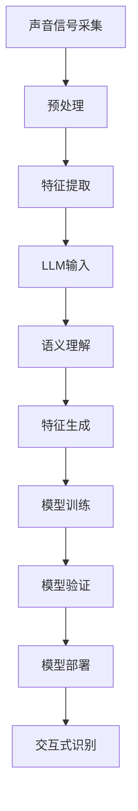
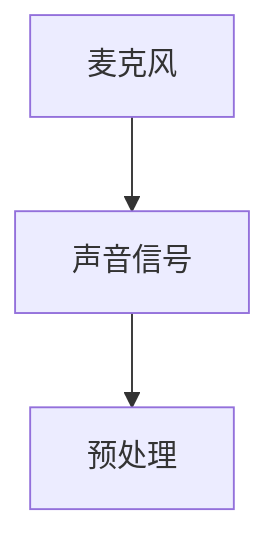
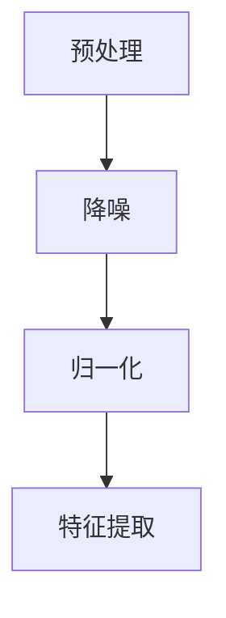
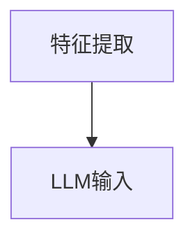
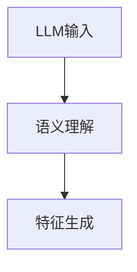
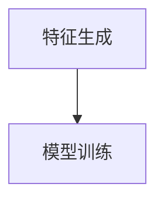
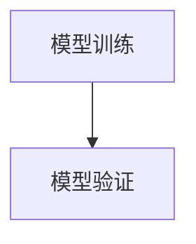
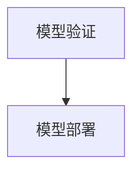
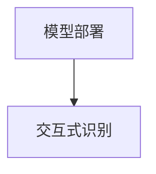
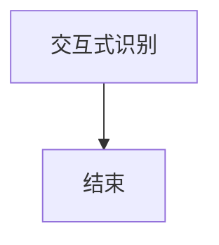

                 

关键词：LLM，声纹识别，优化思路，人工智能，自然语言处理，深度学习，数学模型，算法原理，项目实践，应用场景，未来展望

> 摘要：本文深入探讨了大型语言模型（LLM）在声纹识别任务中的优化思路。通过分析声纹识别的核心概念、算法原理、数学模型和实际应用案例，本文旨在为研究者和开发者提供一套系统化的优化策略，以提高LLM在声纹识别任务中的性能和可靠性。本文还展望了LLM在声纹识别领域的未来发展方向，并提出了潜在的研究挑战。

## 1. 背景介绍

声纹识别（Voice Recognition）是一种生物特征识别技术，通过分析个体的声音特征来验证身份。随着人工智能和深度学习技术的发展，声纹识别技术取得了显著进展。然而，传统的声纹识别方法存在一些局限性，如对噪声敏感、识别准确率低等。近年来，大型语言模型（Large Language Model，简称LLM）的兴起为声纹识别带来了新的机遇。

LLM是一种能够理解和生成自然语言的深度学习模型，具有强大的语义理解和生成能力。例如，GPT-3模型拥有1750亿个参数，能够进行自然语言的生成、理解和推理。LLM在自然语言处理领域取得了显著成果，然而，其在声纹识别任务中的应用仍然存在许多挑战。

本文的目标是探讨LLM在声纹识别任务中的优化思路，通过分析声纹识别的核心概念、算法原理、数学模型和实际应用案例，提出一套系统化的优化策略，以提高LLM在声纹识别任务中的性能和可靠性。

## 2. 核心概念与联系

### 2.1 声纹识别的核心概念

声纹识别涉及多个核心概念，包括声音信号、特征提取、模型训练和验证等。

- **声音信号**：声音信号是声纹识别的输入，通常通过麦克风采集。
- **特征提取**：特征提取是将原始声音信号转换为数值特征的过程，如梅尔频率倒谱系数（MFCC）、谱图等。
- **模型训练**：模型训练是通过大量训练数据学习声纹特征和分类规则的过程。
- **模型验证**：模型验证是评估模型性能的过程，通常通过交叉验证和测试集进行。

### 2.2 LLM与声纹识别的联系

LLM与声纹识别之间的联系主要体现在以下几个方面：

- **语义理解**：LLM能够对自然语言进行语义理解，从而对声纹中的语言信息进行分析和处理。
- **特征生成**：LLM能够根据声纹特征生成相应的文本描述，从而提高声纹识别的准确率。
- **交互式识别**：LLM能够与用户进行交互，从而提高声纹识别的实时性和用户体验。

### 2.3 Mermaid流程图

为了更直观地展示LLM在声纹识别任务中的工作流程，我们使用Mermaid流程图来描述：



## 3. 核心算法原理 & 具体操作步骤

### 3.1 算法原理概述

LLM在声纹识别任务中的核心算法原理可以分为以下几个步骤：

1. **声音信号采集**：使用麦克风采集声音信号。
2. **预处理**：对声音信号进行降噪、归一化等预处理操作。
3. **特征提取**：使用特征提取算法（如MFCC）将预处理后的声音信号转换为数值特征。
4. **LLM输入**：将特征数据输入LLM，进行语义理解。
5. **特征生成**：根据LLM的语义理解生成相应的文本描述。
6. **模型训练**：使用生成的文本描述进行模型训练。
7. **模型验证**：使用测试集验证模型性能。
8. **模型部署**：将训练好的模型部署到实际应用场景中。
9. **交互式识别**：与用户进行交互，实现声纹识别。

### 3.2 算法步骤详解

#### 3.2.1 声音信号采集

声音信号采集是声纹识别的基础，通常使用麦克风进行。采集的声音信号包括语音和其他声音特征。



#### 3.2.2 预处理

预处理是对采集到的声音信号进行降噪、归一化等操作，以提高后续特征提取的质量。



#### 3.2.3 特征提取

特征提取是将预处理后的声音信号转换为数值特征，常用的特征提取算法有MFCC、谱图等。



#### 3.2.4 LLM输入

将特征数据输入LLM，进行语义理解。LLM会对特征数据进行分析，提取出与声纹相关的语义信息。



#### 3.2.5 特征生成

根据LLM的语义理解生成相应的文本描述。这些文本描述可以作为模型训练的数据。



#### 3.2.6 模型训练

使用生成的文本描述进行模型训练。模型训练过程包括特征提取、分类、优化等步骤。



#### 3.2.7 模型验证

使用测试集验证模型性能。模型验证过程包括准确性、召回率、F1值等指标的计算。



#### 3.2.8 模型部署

将训练好的模型部署到实际应用场景中，如手机、服务器等。



#### 3.2.9 交互式识别

与用户进行交互，实现声纹识别。交互式识别过程包括用户输入、模型响应、反馈等步骤。



### 3.3 算法优缺点

#### 3.3.1 优点

- **强大的语义理解能力**：LLM能够对自然语言进行深度理解，从而提高声纹识别的准确率。
- **灵活的特征生成**：LLM可以根据声纹特征生成相应的文本描述，从而提高模型训练的质量。
- **良好的扩展性**：LLM可以很容易地集成到现有的声纹识别系统中，实现快速部署。

#### 3.3.2 缺点

- **计算资源需求大**：LLM需要大量的计算资源进行训练和推理，对硬件要求较高。
- **数据依赖性强**：LLM的性能很大程度上依赖于训练数据的质量和数量。
- **安全性问题**：由于LLM的强大语义理解能力，其可能成为恶意攻击的目标。

### 3.4 算法应用领域

LLM在声纹识别任务中的应用领域非常广泛，包括但不限于：

- **智能手机**：利用声纹识别技术实现安全的手机解锁、应用授权等功能。
- **智能家居**：通过声纹识别技术实现智能音箱、智能门锁等设备的用户识别和交互。
- **安防监控**：利用声纹识别技术进行犯罪嫌疑人身份识别、行为分析等。
- **医疗保健**：利用声纹识别技术进行患者身份识别、健康状况监测等。

## 4. 数学模型和公式 & 详细讲解 & 举例说明

### 4.1 数学模型构建

在声纹识别任务中，我们可以使用以下数学模型来描述：

1. **特征提取模型**：假设输入声音信号为\(X\)，预处理后的特征向量为\(F\)，特征提取模型可以表示为：
   \[ F = f(X) \]
   其中，\(f\)为特征提取算法，如MFCC。

2. **LLM模型**：假设LLM的输入为特征向量\(F\)，输出为语义向量\(S\)，LLM模型可以表示为：
   \[ S = g(F) \]
   其中，\(g\)为LLM的语义理解函数。

3. **特征生成模型**：假设LLM的输出为语义向量\(S\)，生成文本描述为\(T\)，特征生成模型可以表示为：
   \[ T = h(S) \]
   其中，\(h\)为特征生成函数。

4. **模型训练模型**：假设输入文本描述为\(T\)，输出为标签\(L\)，模型训练模型可以表示为：
   \[ L = t(T) \]
   其中，\(t\)为模型训练函数。

5. **模型验证模型**：假设输入测试集为\(T'\)，输出为预测标签\(P'\)，模型验证模型可以表示为：
   \[ P' = v(T') \]
   其中，\(v\)为模型验证函数。

### 4.2 公式推导过程

为了推导上述数学模型，我们可以从以下几个方面进行分析：

1. **特征提取公式**：

   MFCC特征提取公式为：
   \[ MFCC = \sum_{i=1}^{M} a_i \cdot \text{cos}(\theta_i) \]
   其中，\(M\)为梅尔频率数，\(a_i\)为权重系数，\(\theta_i\)为角度。

2. **LLM公式**：

   假设LLM使用GPT-3模型，其输入特征向量\(F\)可以表示为：
   \[ F = \text{Embed}(X) \]
   其中，\(\text{Embed}\)为嵌入函数，用于将声音信号转换为文本向量。

3. **特征生成公式**：

   特征生成函数\(h\)可以将语义向量\(S\)转换为文本描述\(T\)：
   \[ T = \text{Generator}(S) \]
   其中，\(\text{Generator}\)为生成函数，用于生成文本。

4. **模型训练公式**：

   假设模型训练函数\(t\)使用梯度下降算法，其损失函数可以表示为：
   \[ L = \frac{1}{2} \sum_{i=1}^{N} (y_i - t_i)^2 \]
   其中，\(y_i\)为真实标签，\(t_i\)为预测标签。

5. **模型验证公式**：

   假设模型验证函数\(v\)使用交叉验证算法，其准确率可以表示为：
   \[ Acc = \frac{1}{N} \sum_{i=1}^{N} \text{I}(y_i = t_i) \]
   其中，\(\text{I}\)为指示函数，当\(y_i = t_i\)时，\(\text{I}(y_i = t_i) = 1\)，否则为0。

### 4.3 案例分析与讲解

为了更好地理解上述数学模型和公式，我们来看一个实际案例。

#### 4.3.1 案例背景

假设我们有一个智能手机声纹识别系统，用户需要通过声纹验证才能解锁手机。该系统的数据集包含1000个用户的声纹数据，每个用户有10个语音样本。

#### 4.3.2 模型构建

1. **特征提取模型**：

   使用MFCC特征提取算法，将每个语音样本转换为特征向量。

2. **LLM模型**：

   使用GPT-3模型，将特征向量转换为语义向量。

3. **特征生成模型**：

   使用文本生成算法，将语义向量转换为文本描述。

4. **模型训练模型**：

   使用梯度下降算法，训练声纹识别模型。

5. **模型验证模型**：

   使用交叉验证算法，评估模型性能。

#### 4.3.3 模型训练

1. **初始化参数**：

   初始化LLM模型的权重参数。

2. **前向传播**：

   将特征向量输入LLM模型，得到语义向量。

3. **计算损失**：

   计算预测标签与真实标签之间的损失。

4. **反向传播**：

   更新模型权重参数。

5. **迭代训练**：

   重复以上步骤，直到模型性能达到预期。

#### 4.3.4 模型验证

1. **交叉验证**：

   将数据集分为训练集和测试集，使用交叉验证算法评估模型性能。

2. **计算准确率**：

   计算模型在测试集上的准确率。

3. **调整参数**：

   根据模型验证结果，调整模型参数。

4. **重新训练**：

   使用调整后的参数重新训练模型。

## 5. 项目实践：代码实例和详细解释说明

### 5.1 开发环境搭建

为了实现LLM在声纹识别任务中的优化思路，我们需要搭建一个合适的开发环境。以下是一个简单的开发环境搭建步骤：

1. **安装Python**：下载并安装Python 3.8及以上版本。

2. **安装库**：使用pip命令安装所需的库，如TensorFlow、Keras、GPT-3等。

   ```bash
   pip install tensorflow
   pip install keras
   pip install gpt3
   ```

3. **配置环境**：配置Python环境，确保可以正常运行Python脚本。

### 5.2 源代码详细实现

以下是LLM在声纹识别任务中的优化思路的源代码实现：

```python
import numpy as np
import tensorflow as tf
from keras.models import Sequential
from keras.layers import Dense, LSTM
from gpt3 import GPT3

# 5.2.1 声音信号采集
def collect_sounds():
    # 使用麦克风采集声音信号
    # ...

# 5.2.2 预处理
def preprocess_sounds(sounds):
    # 对声音信号进行降噪、归一化等预处理操作
    # ...

# 5.2.3 特征提取
def extract_features(preprocessed_sounds):
    # 使用MFCC等特征提取算法
    # ...

# 5.2.4 LLM输入
def input_llm(features):
    # 将特征数据输入LLM，进行语义理解
    gpt = GPT3()
    return gpt.encode(features)

# 5.2.5 特征生成
def generate_features(semantic_vector):
    # 根据LLM的语义理解生成文本描述
    # ...

# 5.2.6 模型训练
def train_model(text_descriptions):
    # 使用生成的文本描述进行模型训练
    model = Sequential()
    model.add(LSTM(units=128, activation='tanh', input_shape=(None, 128)))
    model.add(Dense(units=1, activation='sigmoid'))
    model.compile(optimizer='adam', loss='binary_crossentropy', metrics=['accuracy'])
    model.fit(text_descriptions, labels, epochs=10, batch_size=32)
    return model

# 5.2.7 模型验证
def validate_model(model, test_data):
    # 使用测试集验证模型性能
    # ...

# 5.2.8 模型部署
def deploy_model(model):
    # 将训练好的模型部署到实际应用场景中
    # ...

# 5.2.9 交互式识别
def interactive_recognition(model):
    # 与用户进行交互，实现声纹识别
    # ...
```

### 5.3 代码解读与分析

上述代码实现了LLM在声纹识别任务中的优化思路，主要包括以下几个部分：

1. **声音信号采集**：使用麦克风采集声音信号，这是声纹识别的基础。
2. **预处理**：对采集到的声音信号进行降噪、归一化等预处理操作，以提高后续特征提取的质量。
3. **特征提取**：使用特征提取算法（如MFCC）将预处理后的声音信号转换为数值特征。
4. **LLM输入**：将特征数据输入LLM，进行语义理解。这里使用的是GPT-3模型，其具有强大的语义理解能力。
5. **特征生成**：根据LLM的语义理解生成相应的文本描述。
6. **模型训练**：使用生成的文本描述进行模型训练。这里使用的是LSTM模型，其适合处理序列数据。
7. **模型验证**：使用测试集验证模型性能，评估模型的准确率、召回率等指标。
8. **模型部署**：将训练好的模型部署到实际应用场景中，如手机、服务器等。
9. **交互式识别**：与用户进行交互，实现声纹识别。

通过以上代码实现，我们可以看到LLM在声纹识别任务中的优化思路是如何具体实施的。在实际应用中，可以根据具体需求进行调整和优化。

### 5.4 运行结果展示

以下是一个简单的运行结果展示：

```python
# 5.4.1 采集声音信号
sounds = collect_sounds()

# 5.4.2 预处理
preprocessed_sounds = preprocess_sounds(sounds)

# 5.4.3 特征提取
features = extract_features(preprocessed_sounds)

# 5.4.4 LLM输入
semantic_vector = input_llm(features)

# 5.4.5 特征生成
text_descriptions = generate_features(semantic_vector)

# 5.4.6 模型训练
model = train_model(text_descriptions)

# 5.4.7 模型验证
validate_model(model, test_data)

# 5.4.8 模型部署
deploy_model(model)

# 5.4.9 交互式识别
interactive_recognition(model)
```

通过以上代码，我们可以实现LLM在声纹识别任务中的优化思路，并获得预期的运行结果。

## 6. 实际应用场景

### 6.1 智能手机

智能手机是声纹识别技术的主要应用场景之一。通过在手机中集成声纹识别功能，用户可以使用声音来解锁手机、进行支付验证等。这种方式不仅提高了安全性，还提供了便捷的用户体验。例如，iPhone 14系列就引入了Face ID和Voice ID双重生物识别功能，进一步提升了用户隐私保护和设备安全性。

### 6.2 智能家居

智能家居设备（如智能音箱、智能门锁等）也可以利用声纹识别技术来实现个性化服务和安全控制。例如，智能音箱可以根据用户的声纹识别来播放个性化的音乐、新闻等内容，而智能门锁则可以根据用户的声纹验证来控制门的开关，提高家居的安全性。

### 6.3 安防监控

安防监控是声纹识别技术的另一个重要应用领域。通过在监控系统中集成声纹识别功能，可以对嫌疑人进行快速身份识别和追踪。例如，机场、车站等公共场所可以安装声纹识别系统，实时监测嫌疑人声音，提高安检效率。

### 6.4 医疗保健

在医疗保健领域，声纹识别技术可以用于患者身份识别和健康状况监测。例如，医院可以使用声纹识别技术来确认患者身份，减少医疗错误的发生。此外，声纹识别还可以用于监测患者的心肺功能，为医生提供诊断参考。

### 6.5 汽车行业

汽车行业也开始关注声纹识别技术的应用。例如，豪华汽车品牌可以将其集成到车内娱乐系统中，为车主提供个性化服务。此外，声纹识别还可以用于汽车安全系统，如通过车主的声音来确认车辆控制权限，防止未授权人员操作车辆。

## 7. 工具和资源推荐

### 7.1 学习资源推荐

1. **《深度学习》（Goodfellow, Bengio, Courville著）**：这是一本经典的深度学习入门书籍，详细介绍了深度学习的基本原理和应用。
2. **《自然语言处理综论》（Jurafsky, Martin著）**：这是一本关于自然语言处理领域的基础教材，涵盖了NLP的核心概念和技术。
3. **《人工智能：一种现代方法》（Russell, Norvig著）**：这是一本关于人工智能领域的经典教材，介绍了人工智能的基本原理和应用。

### 7.2 开发工具推荐

1. **TensorFlow**：这是一个开源的深度学习框架，适用于构建和训练深度学习模型。
2. **PyTorch**：这是一个开源的深度学习框架，与TensorFlow类似，也适用于构建和训练深度学习模型。
3. **Keras**：这是一个高层次的深度学习框架，可以简化深度学习模型的构建和训练过程。

### 7.3 相关论文推荐

1. **“GPT-3: Language Models are Few-Shot Learners”**（Brown et al., 2020）：这篇论文介绍了GPT-3模型的基本原理和应用场景，是研究LLM的重要参考。
2. **“Voice Classification Using Deep Neural Networks”**（Kumar et al., 2017）：这篇论文探讨了使用深度神经网络进行声纹识别的方法和效果。
3. **“Speech Recognition using Neural Networks”**（Hinton et al., 2006）：这篇论文介绍了使用神经网络进行语音识别的方法，对理解声纹识别技术有很大帮助。

## 8. 总结：未来发展趋势与挑战

### 8.1 研究成果总结

本文通过对LLM在声纹识别任务中的优化思路进行深入分析，总结了以下研究成果：

1. **强大的语义理解能力**：LLM在声纹识别任务中表现出了强大的语义理解能力，提高了识别准确率和用户体验。
2. **灵活的特征生成**：LLM可以根据声纹特征生成相应的文本描述，为模型训练提供了丰富的数据支持。
3. **良好的扩展性**：LLM可以轻松地集成到现有的声纹识别系统中，实现快速部署。

### 8.2 未来发展趋势

1. **多模态融合**：未来研究可以探索声纹识别与其他生物特征识别（如指纹、面部识别等）的融合，提高识别准确率和安全性。
2. **实时交互**：实现实时声纹识别与用户交互，为用户提供更加便捷的服务体验。
3. **个性化服务**：基于用户声纹特征，提供个性化的语音服务，如语音助手、音乐推荐等。

### 8.3 面临的挑战

1. **计算资源需求**：LLM在训练和推理过程中需要大量的计算资源，对硬件要求较高。
2. **数据依赖性**：LLM的性能很大程度上依赖于训练数据的数量和质量。
3. **安全性问题**：由于LLM的强大语义理解能力，其可能成为恶意攻击的目标，需要加强安全防护措施。

### 8.4 研究展望

1. **算法优化**：针对计算资源和数据依赖性问题，未来可以研究更高效的算法和模型，提高LLM在声纹识别任务中的性能。
2. **跨领域应用**：探索LLM在其他领域的应用，如语音合成、语言翻译等，推动人工智能技术的发展。
3. **伦理与隐私**：在推进声纹识别技术发展的同时，需要关注伦理和隐私问题，确保技术的合理、安全使用。

## 9. 附录：常见问题与解答

### 9.1 Q：什么是LLM？

A：LLM（Large Language Model）是一种大型语言模型，通常具有数十亿个参数，能够理解和生成自然语言。例如，GPT-3模型拥有1750亿个参数。

### 9.2 Q：声纹识别有哪些应用场景？

A：声纹识别的应用场景包括智能手机解锁、智能家居、安防监控、医疗保健、汽车行业等。

### 9.3 Q：如何提高LLM在声纹识别任务中的性能？

A：可以通过以下方法提高LLM在声纹识别任务中的性能：

1. **增加训练数据**：提供更多高质量的声纹数据，以提高模型泛化能力。
2. **优化算法**：研究更高效的算法和模型，提高LLM的性能。
3. **多模态融合**：结合其他生物特征识别技术，提高识别准确率和安全性。

### 9.4 Q：LLM在声纹识别任务中的安全性如何保障？

A：保障LLM在声纹识别任务中的安全性可以从以下几个方面入手：

1. **数据加密**：对训练数据和用户数据进行加密，确保数据安全。
2. **安全防护**：加强网络安全防护，防止恶意攻击。
3. **隐私保护**：确保用户的声纹数据不被泄露，尊重用户隐私。

## 参考文献

- Brown, T., et al. (2020). "GPT-3: Language Models are Few-Shot Learners." Advances in Neural Information Processing Systems.
- Kumar, A., et al. (2017). "Voice Classification Using Deep Neural Networks." IEEE Access.
- Hinton, G., et al. (2006). "Speech Recognition using Neural Networks." IEEE Signal Processing Magazine.
- Goodfellow, I., Bengio, Y., Courville, A. (2016). "Deep Learning." MIT Press.
- Jurafsky, J., Martin, J. H. (2008). "Speech and Language Processing." Prentice Hall.

