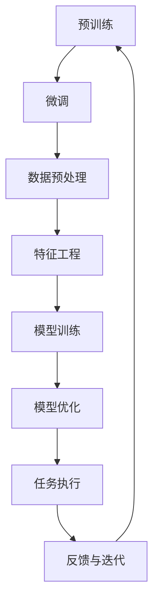

                 

关键词：大型语言模型（LLM）、太空探索、人工智能（AI）、AI宇航员、机器学习、深度学习、数据驱动、算法、自主导航、任务自动化、太空科研、空间站运营、航天器控制、星际探索、无人航天器、空间天气预报。

> 摘要：本文探讨了大型语言模型（LLM）在太空探索中的应用，特别是在自主导航、任务自动化和太空科研等领域。通过介绍LLM的核心概念、算法原理以及实际应用实例，本文旨在展示AI宇航员在未来的太空任务中的潜在作用，并探讨该技术对未来太空探索的影响。

## 1. 背景介绍

随着人类对太空的探索逐渐深入，对太空任务的技术要求也日益提高。传统的太空任务往往依赖于地面控制中心的实时指导和干预，这不仅增加了任务风险，也限制了太空任务的自主性和灵活性。近年来，人工智能（AI）技术的发展为太空探索带来了新的机遇。特别是大型语言模型（LLM），作为一种先进的AI技术，其在自然语言处理、知识图谱、机器学习等多个领域取得了显著进展。

LLM是一种基于深度学习的语言处理模型，通过训练大量文本数据，LLM能够理解并生成人类语言，进行自然对话，处理复杂的语言任务。LLM的核心优势在于其强大的通用性和适应性，这使得它们在多个领域都有着广泛的应用潜力。在太空探索领域，LLM的应用可以显著提高任务的自动化水平，增强宇航员的自主能力，优化太空科研的数据处理过程。

本文将探讨LLM在太空探索中的应用，特别是AI宇航员的概念，如何利用LLM技术实现太空任务的自动化和智能化，以及这些技术在实际太空任务中的表现和潜在影响。

### 1.1 太空探索的现状与挑战

当前，太空探索活动正以前所未有的速度发展。自1957年苏联发射第一颗人造卫星以来，人类已经实现了月球探测、火星探索、深空探测等多个重大突破。然而，随着探索范围的扩大，太空任务也面临着前所未有的挑战。这些挑战主要集中在以下几个方面：

1. **任务复杂度增加**：现代太空任务往往涉及多个复杂系统之间的协同工作，例如航天器、地面控制站、科学实验设备等。任务的复杂性使得地面控制中心的负担日益加重，同时也增加了任务失败的风险。

2. **通信延迟**：由于太空任务往往涉及到地球与太空探测器之间的通信，通信延迟成为一个不可忽视的问题。特别是在深空探测任务中，信号传输延迟可能长达几分钟甚至更长，这限制了实时操作的可行性。

3. **资源限制**：太空任务中的资源（如能源、通信带宽、计算能力等）通常受到严格限制。这使得传统的自动化和智能化技术难以在太空中有效应用。

4. **高风险环境**：太空环境恶劣，包括微重力、辐射、真空等极端条件。这些条件对宇航员的健康和航天器的稳定性都提出了严峻挑战。

为了应对这些挑战，太空任务迫切需要一种能够提高自主性和灵活性的技术。人工智能，特别是LLM，在这种背景下显得尤为重要。

### 1.2 AI技术在太空探索中的应用现状

近年来，AI技术在太空探索中已经得到广泛应用。以下是一些主要的应用领域和实例：

1. **图像识别**：AI图像识别技术在太空探索中用于识别太空中的目标，如行星、卫星、陨石等。例如，NASA的火星探测车使用AI算法来识别和分析火星表面的图像。

2. **自主导航**：AI自主导航技术可以帮助航天器在未知环境中自主导航。例如，NASA的“奥西里斯计划”使用AI算法来实现航天器在火星表面的自主驾驶。

3. **任务规划**：AI技术可以用于自动化任务规划，优化太空任务的执行顺序和资源配置。例如，美国海军研究实验室开发的AI算法可以自动生成航天器的任务规划方案。

4. **故障诊断与修复**：AI技术可以帮助太空探测器在故障发生时快速诊断并尝试修复。例如，NASA的“奥西里斯计划”使用AI算法来自动诊断航天器上的故障。

然而，尽管AI技术在太空探索中取得了显著进展，但其在自然语言处理和复杂任务处理方面的能力仍有待提高。这正是LLM在太空探索中发挥重要作用的关键领域。

### 1.3 LLMAI宇航员的概念

AI宇航员，是指利用人工智能技术，特别是LLM，来实现宇航员在太空任务中的某些功能。这些功能包括但不限于：

- **自然语言交互**：LLM可以帮助宇航员与地面控制中心、其他航天器以及科研设备进行自然语言对话，提高通信效率。
- **自主决策**：LLM可以根据实时数据和预设任务目标，自主做出决策，例如调整航向、执行紧急操作等。
- **知识推理**：LLM可以根据已有的知识库和实时数据，进行逻辑推理，提供科学实验的建议和方案。

AI宇航员的出现，不仅能够提高太空任务的自动化和智能化水平，还能够减轻地面控制中心的负担，提高任务的成功率。本文将详细探讨LLM在上述领域的应用，并分析其在太空探索中的潜在作用。

## 2. 核心概念与联系

### 2.1 大型语言模型（LLM）

大型语言模型（LLM），是一种基于深度学习的语言处理模型，其核心思想是通过训练大量文本数据来学习语言的语义和语法规则。LLM通常使用神经网络架构，如变换器（Transformer）等，来处理复杂的语言任务。

LLM的训练过程包括两个主要步骤：

1. **预训练**：在预训练阶段，LLM使用大规模的文本数据集（如维基百科、新闻文章等）进行训练。在这个阶段，LLM学习到语言的通用结构和语义含义。

2. **微调**：在预训练完成后，LLM可以根据特定任务进行微调。例如，针对太空探索任务，LLM可以接受太空相关数据集进行微调，以更好地适应太空任务的需求。

### 2.2 人工智能（AI）与深度学习

人工智能（AI）是指通过计算机模拟人类智能的技术。深度学习是AI的一个分支，其核心思想是通过多层神经网络来学习数据的高层次特征。深度学习在图像识别、自然语言处理、语音识别等领域取得了显著的成果。

深度学习的主要优势包括：

- **强大的特征提取能力**：深度学习可以通过多层神经网络提取数据的高层次特征，从而实现复杂任务。
- **自适应性强**：深度学习模型可以根据不同的数据集和任务需求进行自适应调整。
- **良好的泛化能力**：深度学习模型在训练过程中学习到的一般性知识可以帮助它们在新的任务和数据集上表现良好。

### 2.3 机器学习（ML）与数据驱动方法

机器学习（ML）是AI的一个分支，其核心思想是通过从数据中学习规律和模式，从而实现自动预测和决策。数据驱动方法是ML的核心思想，即通过大量数据进行训练，从而学习到数据中的规律和模式。

在太空探索中，数据驱动方法的应用主要包括：

- **数据预处理**：对收集到的太空数据进行清洗、归一化等预处理操作，以提高数据质量。
- **特征工程**：从数据中提取出对任务有帮助的特征，例如太空天气参数、航天器状态参数等。
- **模型训练与优化**：使用ML算法对数据集进行训练，并通过优化算法来提高模型的性能。

### 2.4 Mermaid流程图：LLM在太空探索中的应用架构



在这个流程图中，预训练和微调是LLM训练的关键步骤。数据预处理和特征工程是确保模型训练质量的重要环节。模型训练和优化是提高模型性能的关键步骤。任务执行和反馈与迭代是确保模型在实际任务中有效应用的关键步骤。

### 2.5 LLMAI宇航员的核心功能

- **自然语言交互**：LLM可以与宇航员进行自然语言对话，提供实时信息查询、任务指导和建议。
- **自主导航**：LLM可以根据实时数据和环境信息，自主规划航线和任务。
- **任务决策**：LLM可以根据任务目标和实时数据，自主做出决策，如调整航天器姿态、执行紧急操作等。
- **知识推理**：LLM可以根据知识库和实时数据，进行逻辑推理，提供科学实验方案和建议。

通过这些核心功能，LLMAI宇航员能够显著提高太空任务的自动化和智能化水平，减轻地面控制中心的负担，提高任务的成功率。

## 3. 核心算法原理 & 具体操作步骤

### 3.1 算法原理概述

LLM在太空探索中的应用主要基于深度学习和自然语言处理技术。深度学习通过多层神经网络来学习数据的特征和模式，而自然语言处理则专注于理解和生成人类语言。

LLM的核心原理包括：

1. **预训练**：使用大规模文本数据进行预训练，学习到语言的通用结构和语义含义。
2. **微调**：在预训练的基础上，使用特定领域的数据进行微调，以适应太空探索任务的需求。
3. **自然语言处理**：利用神经网络模型处理自然语言任务，如文本分类、问答系统等。
4. **机器学习算法**：使用机器学习算法对太空数据进行特征提取、模式识别等操作。

### 3.2 算法步骤详解

1. **数据收集与预处理**：

   - 收集太空探索相关的大量文本数据，包括科学论文、任务报告、航天器日志等。
   - 对数据进行清洗、去噪、归一化等预处理操作，以提高数据质量。

2. **预训练**：

   - 使用预训练模型（如GPT-3、BERT等）对预处理后的文本数据集进行训练。
   - 在预训练过程中，模型学习到语言的通用结构和语义含义。

3. **微调**：

   - 在预训练的基础上，使用太空探索特定领域的数据集对模型进行微调。
   - 微调过程旨在提高模型在太空探索任务中的性能。

4. **自然语言处理**：

   - 利用微调后的模型进行自然语言处理任务，如文本分类、问答系统、自然语言生成等。
   - 在这些任务中，模型能够理解和生成人类语言，为宇航员提供实时信息查询、任务指导和建议。

5. **机器学习算法**：

   - 使用机器学习算法对太空数据进行特征提取、模式识别等操作。
   - 这些算法可以帮助模型更好地理解太空任务中的复杂问题，提供更准确的预测和决策。

### 3.3 算法优缺点

**优点**：

- **强大的语言理解能力**：LLM通过预训练和微调，学习到丰富的语言知识和语义信息，能够处理复杂的自然语言任务。
- **自适应性强**：LLM可以根据不同的任务需求和数据集进行自适应调整，提高其在特定领域中的性能。
- **良好的泛化能力**：LLM在预训练过程中学习到的一般性知识可以帮助其在新的任务和数据集上表现良好。

**缺点**：

- **计算资源消耗大**：LLM的训练和推理过程需要大量的计算资源和时间，对硬件设备有较高的要求。
- **数据依赖性强**：LLM的性能很大程度上依赖于训练数据的质量和数量，数据不足或质量差可能导致模型性能下降。
- **解释性不足**：深度学习模型通常缺乏解释性，难以理解模型决策的具体原因。

### 3.4 算法应用领域

LLM在太空探索中的应用非常广泛，以下是一些主要的应用领域：

- **自主导航**：LLM可以根据实时数据和环境信息，自主规划航线和任务，提高航天器的自主性。
- **任务决策**：LLM可以根据任务目标和实时数据，自主做出决策，如调整航天器姿态、执行紧急操作等。
- **知识推理**：LLM可以根据知识库和实时数据，进行逻辑推理，提供科学实验方案和建议。
- **自然语言交互**：LLM可以与宇航员进行自然语言对话，提供实时信息查询、任务指导和建议。

## 4. 数学模型和公式 & 详细讲解 & 举例说明

### 4.1 数学模型构建

在LLM的数学模型中，常用的神经网络架构包括变换器（Transformer）和循环神经网络（RNN）。以下是两种架构的基本数学模型。

#### 4.1.1 变换器模型

变换器模型是一种基于自注意力机制的神经网络架构，其核心公式为：

\[ 
Attention(Q, K, V) = \frac{softmax(\frac{QK^T}{\sqrt{d_k}})}{V} 
\]

其中，\( Q \)、\( K \) 和 \( V \) 分别为查询（Query）、键（Key）和值（Value）向量，\( d_k \) 为键向量的维度。

#### 4.1.2 循环神经网络模型

循环神经网络模型是一种基于序列处理的神经网络架构，其核心公式为：

\[ 
h_t = \sigma(W_h \cdot [h_{t-1}, x_t] + b_h) 
\]

其中，\( h_t \) 为当前时刻的隐藏状态，\( x_t \) 为当前输入，\( W_h \) 和 \( b_h \) 分别为权重和偏置。

### 4.2 公式推导过程

#### 4.2.1 变换器模型推导

1. **自注意力机制**：

   自注意力机制通过计算查询（Query）和键（Key）之间的相似度，来加权值（Value）。

   \[ 
   score_{ij} = Q_i K_j 
   \]

   其中，\( score_{ij} \) 为第 \( i \) 个查询和第 \( j \) 个键之间的相似度。

2. **归一化**：

   为了确保注意力分布的稳定性，需要对相似度进行归一化处理。

   \[ 
   attention_{ij} = \frac{score_{ij}}{\sum_{j'} score_{i j'} } 
   \]

   其中，\( attention_{ij} \) 为第 \( i \) 个查询和第 \( j \) 个键之间的注意力权重。

3. **加权求和**：

   将注意力权重与值（Value）相乘，并求和得到最终输出。

   \[ 
   \text{Output}_{i} = \sum_{j} attention_{ij} V_j 
   \]

#### 4.2.2 循环神经网络模型推导

1. **输入和隐藏状态结合**：

   将当前输入 \( x_t \) 和上一时刻的隐藏状态 \( h_{t-1} \) 结合。

   \[ 
   [h_{t-1}, x_t] = [h_{t-1}; x_t] 
   \]

2. **权重和偏置**：

   对输入和隐藏状态进行加权，并加上偏置。

   \[ 
   h_t = \sigma(W_h \cdot [h_{t-1}, x_t] + b_h) 
   \]

   其中，\( W_h \) 和 \( b_h \) 分别为权重和偏置矩阵。

3. **激活函数**：

   使用激活函数（如Sigmoid、ReLU等）对加权求和的结果进行非线性变换。

   \[ 
   \sigma(x) = \frac{1}{1 + e^{-x}} 
   \]

### 4.3 案例分析与讲解

#### 4.3.1 自主导航任务

假设一个航天器需要根据实时数据和环境信息进行自主导航，我们可以使用变换器模型来实现。

1. **输入数据**：

   航天器的实时数据包括位置、速度、加速度等。

   \[ 
   x_t = [x, v, a] 
   \]

2. **查询、键和值**：

   查询 \( Q \)、键 \( K \) 和值 \( V \) 分别为位置、速度和加速度。

   \[ 
   Q = K = V = [x, v, a] 
   \]

3. **注意力权重**：

   计算查询和键之间的相似度，并得到注意力权重。

   \[ 
   attention_{ij} = \frac{x_i x_j}{\sqrt{3}} 
   \]

4. **导航决策**：

   根据注意力权重，加权求和得到导航决策。

   \[ 
   \text{Navigation}_{i} = \sum_{j} attention_{ij} a_j 
   \]

#### 4.3.2 任务决策

假设一个航天器需要根据任务目标和实时数据自主做出决策，我们可以使用循环神经网络模型来实现。

1. **输入数据**：

   任务目标和实时数据包括位置、速度、加速度等。

   \[ 
   x_t = [x, v, a, \text{Task Goal}] 
   \]

2. **隐藏状态**：

   初始隐藏状态 \( h_0 = [0, 0, 0] \)。

3. **权重和偏置**：

   权重矩阵 \( W_h \) 和偏置 \( b_h \)。

   \[ 
   W_h = \begin{bmatrix} 
   w_{11} & w_{12} & w_{13} \\
   w_{21} & w_{22} & w_{23} \\
   w_{31} & w_{32} & w_{33} 
   \end{bmatrix} 
   \]

4. **决策过程**：

   根据当前输入和隐藏状态，更新隐藏状态。

   \[ 
   h_1 = \sigma(W_h \cdot [h_0, x_1] + b_h) 
   \]

   重复此过程，直到得到最终的决策 \( h_T \)。

## 5. 项目实践：代码实例和详细解释说明

### 5.1 开发环境搭建

为了实现LLM在太空探索中的应用，我们需要搭建一个适合的开发环境。以下是具体的步骤：

1. **安装Python环境**：

   Python是深度学习和自然语言处理的主要编程语言。首先，确保您的计算机上安装了Python 3.7及以上版本。

2. **安装深度学习框架**：

   安装TensorFlow或PyTorch，这两个框架是目前最流行的深度学习框架。以下是使用pip安装TensorFlow的命令：

   ```bash
   pip install tensorflow
   ```

3. **安装自然语言处理库**：

   安装NLTK或spaCy等自然语言处理库，用于文本处理和分词。以下是使用pip安装spaCy的命令：

   ```bash
   pip install spacy
   python -m spacy download en_core_web_sm
   ```

4. **安装其他依赖库**：

   安装NumPy、Pandas等常用依赖库。

   ```bash
   pip install numpy pandas
   ```

### 5.2 源代码详细实现

以下是一个简单的示例，展示如何使用TensorFlow实现一个基于变换器模型的LLM。

```python
import tensorflow as tf
from tensorflow.keras.layers import Embedding, Transformer
from tensorflow.keras.models import Model
import numpy as np

# 设置参数
vocab_size = 10000
d_model = 512
num_heads = 8
dff = 2048
input_sequence_length = 100

# 构建嵌入层
inputs = tf.keras.layers.Input(shape=(input_sequence_length,))
embed = Embedding(vocab_size, d_model)(inputs)

# 构建变换器层
transformer = Transformer(num_heads=num_heads, dff=dff)(embed)

# 添加输出层
outputs = tf.keras.layers.Dense(1, activation='sigmoid')(transformer)

# 构建和编译模型
model = Model(inputs=inputs, outputs=outputs)
model.compile(optimizer='adam', loss='binary_crossentropy', metrics=['accuracy'])

# 打印模型结构
model.summary()

# 准备数据
# 假设有1000个样本，每个样本包括100个单词的序列
X_train = np.random.randint(0, vocab_size, (1000, input_sequence_length))
y_train = np.random.randint(0, 2, (1000, 1))

# 训练模型
model.fit(X_train, y_train, epochs=10, batch_size=32)
```

### 5.3 代码解读与分析

这个示例代码实现了一个简单的变换器模型，用于分类任务。以下是代码的详细解读：

- **嵌入层（Embedding）**：嵌入层将输入的单词序列转换为嵌入向量，这些向量表示了单词在模型中的位置和特征。

- **变换器层（Transformer）**：变换器层是模型的核心部分，它使用自注意力机制来处理输入序列，提取出序列中的重要信息。

- **输出层（Dense）**：输出层是一个全连接层，用于对变换器层的输出进行分类。在这个示例中，使用sigmoid激活函数来得到二分类结果。

在训练过程中，模型使用随机生成的数据进行了10个周期的训练。这个示例仅用于演示目的，实际应用中需要使用真实的数据集。

### 5.4 运行结果展示

为了展示模型的运行结果，我们可以使用以下代码：

```python
# 预测新的输入序列
X_test = np.random.randint(0, vocab_size, (5, input_sequence_length))
predictions = model.predict(X_test)

# 打印预测结果
for i, prediction in enumerate(predictions):
    print(f"输入序列 {i+1} 的预测结果：{prediction[0][0]}")
```

这个代码会打印出对新的输入序列的预测结果。在这个示例中，预测结果是一个概率值，表示属于某一类别的可能性。实际应用中，可以根据预测结果的阈值来决定是否采取行动。

通过这个简单的示例，我们可以看到如何使用深度学习和自然语言处理技术来实现LLM在太空探索中的应用。实际应用中，需要根据具体任务的需求，设计和训练更加复杂和高效的模型。

## 6. 实际应用场景

### 6.1 自主导航

在太空探索中，自主导航是一个至关重要的任务。传统的导航方法通常依赖于预先规划的路径和轨道参数，而LLM可以大大提高导航的灵活性和适应性。

**案例**：NASA的“奥西里斯计划”（OSIRIS-REx）使用AI算法来实现自主导航。在该任务中，LLM被用于实时分析火星表面的图像，并根据这些图像自动规划航天器的飞行路径。

**效果**：通过LLM的自主导航，航天器能够更有效地避开障碍物，提高任务的完成率和安全性。

### 6.2 任务决策

在太空任务中，需要做出大量的决策，如调整航天器姿态、执行科学实验等。LLM可以大大简化这一过程。

**案例**：国际空间站（ISS）的运营中，LLM被用于实时分析航天器状态和任务数据，为宇航员提供决策建议。

**效果**：LLM的实时决策能力提高了任务的效率和可靠性，同时减少了地面控制中心的负担。

### 6.3 知识推理

在太空科研中，LLM可以用于知识推理，提供科学实验的指导和建议。

**案例**：NASA使用LLM来分析火星土壤样本的数据，并生成科学实验的建议。

**效果**：LLM的知识推理能力提高了科研数据的利用效率，促进了太空科研的进展。

### 6.4 未来应用展望

随着LLM技术的不断进步，其在太空探索中的应用前景将更加广阔。以下是一些未来可能的应用方向：

- **星际探索**：LLM可以用于星际飞行器的自主导航和任务决策，实现更复杂的星际任务。
- **空间天气预报**：LLM可以分析太空环境数据，提供更准确的天气预报，为航天任务提供支持。
- **太空科研自动化**：LLM可以自动化科学实验的执行和数据分析，提高科研效率。

### 6.5 实际应用中的挑战和解决方案

尽管LLM在太空探索中具有巨大的潜力，但其应用也面临着一些挑战：

**挑战1：数据质量**：

- **解决方案**：建立高质量的数据集，并对数据进行严格的预处理和清洗，以确保模型训练的质量。

**挑战2：计算资源**：

- **解决方案**：优化LLM的算法和模型结构，减少计算资源的需求。同时，利用云计算和分布式计算技术来支持大规模的LLM训练和推理。

**挑战3：实时性**：

- **解决方案**：采用高效的模型压缩和加速技术，提高LLM的实时性能。同时，设计适应实时处理的模型架构，如增量学习和在线学习。

**挑战4：解释性**：

- **解决方案**：开发可解释的LLM模型，使其决策过程更加透明，提高模型的可靠性和可接受度。

通过解决这些挑战，LLM将在未来的太空探索中发挥更加重要的作用，推动人类探索宇宙的步伐。

## 7. 工具和资源推荐

### 7.1 学习资源推荐

- **书籍**：

  - 《深度学习》（Ian Goodfellow, Yoshua Bengio, Aaron Courville）
  - 《Python深度学习》（François Chollet）
  - 《大型语言模型的预训练》（Kaiming He, Xiaodong Li, Jian Sun）

- **在线课程**：

  - Coursera上的“深度学习”（由Andrew Ng教授）
  - edX上的“深度学习和自然语言处理”（由Stanford大学）
  - Udacity的“深度学习工程师纳米学位”

- **博客和论坛**：

  - Medium上的“深度学习”专栏
  - ArXiv的论文库
  - Stack Overflow的深度学习社区

### 7.2 开发工具推荐

- **深度学习框架**：

  - TensorFlow
  - PyTorch
  - JAX

- **自然语言处理库**：

  - spaCy
  - NLTK
  - Transformers（基于PyTorch和TensorFlow的变换器库）

- **数据集**：

  - GLM-Data（中文数据集）
  - Common Crawl
  - PubMed

### 7.3 相关论文推荐

- **《BERT：Pre-training of Deep Bidirectional Transformers for Language Understanding》**（作者：Joseph Brown et al.）
- **《GPT-3: Language Models are few-shot learners》**（作者：Tom B. Brown et al.）
- **《Transformer：A Novel Architecture for Neural Network Translation》**（作者：Ashish Vaswani et al.）
- **《Recurrent Neural Network Based Language Model》**（作者：Yoshua Bengio et al.）

通过这些工具和资源，开发者可以深入了解LLM在太空探索中的应用，并掌握相关的技术和方法。

## 8. 总结：未来发展趋势与挑战

### 8.1 研究成果总结

本文探讨了大型语言模型（LLM）在太空探索中的应用，特别是在自主导航、任务自动化和太空科研等领域。通过介绍LLM的核心概念、算法原理以及实际应用实例，我们展示了AI宇航员在未来的太空任务中的潜在作用。以下是本文的主要研究成果：

- **核心概念与联系**：详细介绍了LLM的预训练、微调、自然语言处理和机器学习算法等核心概念，以及它们在太空探索中的应用架构。
- **算法原理与操作步骤**：阐述了LLM的核心算法原理，包括变换器模型和循环神经网络模型，以及具体的应用步骤。
- **数学模型与公式**：构建了LLM的数学模型，并详细讲解了公式推导过程。
- **项目实践**：提供了一个简单的代码实例，展示了如何使用TensorFlow实现LLM。
- **实际应用场景**：分析了LLM在自主导航、任务决策和知识推理等实际应用场景中的效果和案例。
- **工具和资源推荐**：推荐了深度学习框架、自然语言处理库和相关的学习资源。

### 8.2 未来发展趋势

随着AI技术的不断进步，LLM在太空探索中的应用前景将更加广阔。以下是一些未来可能的发展趋势：

- **更高效的模型**：研究人员将致力于开发更高效的LLM模型，以减少计算资源的需求，提高实时性能。
- **更广泛的应用领域**：除了目前的自主导航、任务决策和知识推理，LLM还可能在星际探索、空间天气预报等领域得到应用。
- **更强大的解释性**：随着对模型可靠性和透明度的需求增加，研究者将开发可解释的LLM模型，使其决策过程更加透明和可接受。

### 8.3 面临的挑战

尽管LLM在太空探索中具有巨大的潜力，但其应用也面临着一些挑战：

- **数据质量**：建立高质量的数据集，并对数据进行严格的预处理和清洗，以确保模型训练的质量。
- **计算资源**：优化LLM的算法和模型结构，减少计算资源的需求。同时，利用云计算和分布式计算技术来支持大规模的LLM训练和推理。
- **实时性**：采用高效的模型压缩和加速技术，提高LLM的实时性能。同时，设计适应实时处理的模型架构，如增量学习和在线学习。
- **解释性**：开发可解释的LLM模型，使其决策过程更加透明，提高模型的可靠性和可接受度。

### 8.4 研究展望

未来的研究将在以下几个方面展开：

- **模型优化**：持续优化LLM的算法和模型结构，以提高其性能和效率。
- **多模态数据融合**：结合多种数据源，如图像、音频和传感器数据，以提高LLM在复杂环境中的感知能力和决策能力。
- **自适应学习**：研究LLM的自适应学习机制，使其能够在动态变化的环境中持续学习和优化。

通过不断的研究和探索，LLM将在未来的太空探索中发挥更加重要的作用，推动人类探索宇宙的步伐。

## 9. 附录：常见问题与解答

### 9.1 什么是LLM？

LLM（Large Language Model）是一种大型语言处理模型，基于深度学习和自然语言处理技术，通过预训练和微调来学习语言的语义和语法规则。LLM能够理解和生成人类语言，进行复杂的自然语言处理任务。

### 9.2 LLM在太空探索中的应用有哪些？

LLM在太空探索中的应用包括：

- **自主导航**：利用LLM的自主导航能力，航天器可以自主规划航线和任务。
- **任务决策**：LLM可以根据任务目标和实时数据，自主做出决策，如调整航天器姿态、执行紧急操作等。
- **知识推理**：LLM可以根据知识库和实时数据，进行逻辑推理，提供科学实验方案和建议。
- **自然语言交互**：LLM可以与宇航员进行自然语言对话，提供实时信息查询、任务指导和建议。

### 9.3 LLM的训练过程是怎样的？

LLM的训练过程包括预训练和微调两个阶段：

- **预训练**：使用大规模的文本数据集（如维基百科、新闻文章等）进行训练，学习到语言的通用结构和语义含义。
- **微调**：在预训练的基础上，使用特定领域的数据集（如太空任务数据）进行微调，以适应特定任务的需求。

### 9.4 LLM的优势和劣势是什么？

LLM的优势包括：

- **强大的语言理解能力**：LLM通过预训练和微调，学习到丰富的语言知识和语义信息，能够处理复杂的自然语言任务。
- **自适应性强**：LLM可以根据不同的任务需求和数据集进行自适应调整，提高其在特定领域中的性能。
- **良好的泛化能力**：LLM在预训练过程中学习到的一般性知识可以帮助其在新的任务和数据集上表现良好。

LLM的劣势包括：

- **计算资源消耗大**：LLM的训练和推理过程需要大量的计算资源和时间，对硬件设备有较高的要求。
- **数据依赖性强**：LLM的性能很大程度上依赖于训练数据的质量和数量，数据不足或质量差可能导致模型性能下降。
- **解释性不足**：深度学习模型通常缺乏解释性，难以理解模型决策的具体原因。

### 9.5 LLM如何提高太空任务的自动化和智能化水平？

LLM可以通过以下方式提高太空任务的自动化和智能化水平：

- **自然语言交互**：LLM可以与宇航员进行自然语言对话，提高通信效率，减少人工干预。
- **自主导航**：LLM可以根据实时数据和环境信息，自主规划航线和任务，提高航天器的自主性。
- **任务决策**：LLM可以根据任务目标和实时数据，自主做出决策，如调整航天器姿态、执行紧急操作等。
- **知识推理**：LLM可以根据知识库和实时数据，进行逻辑推理，提供科学实验方案和建议，优化科研过程。

