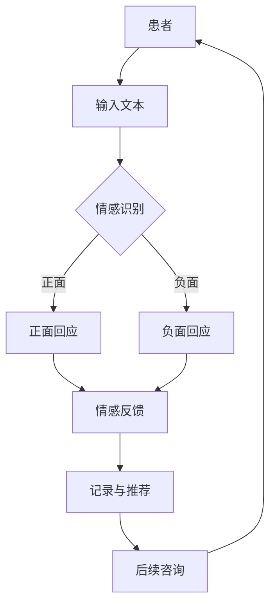

                 

关键词：大型语言模型（LLM），心理健康，AI心理咨询，自然语言处理，情感分析，数据隐私，未来展望。

> 摘要：本文探讨了大型语言模型（LLM）在心理健康领域中的应用，特别是在提供AI心理咨询方面的潜力。文章首先概述了心理健康问题的现状，随后介绍了LLM的基本原理和技术特点，并分析了其在情感识别、对话生成和个性化咨询等方面的应用。同时，文章还讨论了LLM在心理健康领域面临的挑战和未来发展趋势。

## 1. 背景介绍

在现代社会，心理健康问题日益突出，尤其是焦虑、抑郁等心理障碍的发病率呈现上升趋势。据世界卫生组织（WHO）报告，全球约有3.5亿人遭受不同程度的抑郁症，近2.5亿人患有焦虑症。然而，由于心理咨询师的数量和资源的限制，许多人无法获得及时和有效的心理治疗。同时，心理健康服务的费用也常常令患者望而却步。

近年来，人工智能（AI）技术的快速发展为解决心理健康问题提供了新的途径。特别是大型语言模型（LLM），如GPT-3，BERT等，凭借其强大的自然语言处理（NLP）能力，在许多领域取得了显著的应用成果。将LLM应用于心理健康领域，有望为更多人提供便捷、高效和个性化的心理咨询服务。

## 2. 核心概念与联系

### 2.1. 大型语言模型（LLM）

大型语言模型（LLM）是一种基于深度学习的语言处理模型，具有强大的语义理解、文本生成和对话能力。LLM通常由数亿甚至数十亿个参数组成，通过大规模的文本数据进行训练，从而能够理解和生成自然语言。

### 2.2. 自然语言处理（NLP）

自然语言处理（NLP）是计算机科学和人工智能领域的一个重要分支，旨在使计算机能够理解、处理和生成自然语言。NLP技术在文本分析、信息检索、机器翻译、情感识别等方面有着广泛的应用。

### 2.3. 情感分析

情感分析是NLP的一个重要应用，旨在识别文本中的情感倾向，如正面、负面或中性。情感分析对于心理健康领域具有重要意义，可以帮助AI心理咨询师更好地理解患者的情绪状态。

### 2.4. 对话生成

对话生成是LLM的另一个关键能力，旨在生成与人类对话者类似的自然语言回应。在心理健康领域，对话生成可以帮助AI心理咨询师与患者进行有效的沟通和互动，提供个性化的心理咨询服务。

### 2.5. Mermaid流程图

下面是一个描述LLM在心理健康领域应用的Mermaid流程图：



## 3. 核心算法原理 & 具体操作步骤

### 3.1. 算法原理概述

LLM在心理健康领域的核心算法主要包括情感识别、对话生成和个性化咨询。情感识别利用NLP技术分析患者的文本输入，识别出文本中的情感倾向；对话生成则基于LLM的自然语言生成能力，生成与患者互动的文本回应；个性化咨询通过分析患者的情绪和行为数据，提供个性化的治疗建议。

### 3.2. 算法步骤详解

1. **情感识别**：患者输入文本，如日记、聊天记录等。系统利用情感分析算法对文本进行情感识别，确定情感倾向。
2. **对话生成**：根据情感识别结果，系统利用LLM生成与患者互动的文本回应，如安慰、建议等。
3. **个性化咨询**：系统结合患者的情感数据和个性化需求，生成个性化的心理治疗方案和建议。
4. **记录与推荐**：系统将患者的互动记录和治疗进展进行记录，并根据患者的反馈和进展推荐后续的咨询内容。

### 3.3. 算法优缺点

**优点：**
- **高效性**：AI心理咨询师可以同时处理多个患者的咨询请求，提高工作效率。
- **个性化**：通过分析患者的情感和行为数据，AI心理咨询师能够提供个性化的治疗建议。
- **可扩展性**：AI心理咨询师可以不断学习和优化，以适应不断变化的用户需求和心理健康领域的技术进步。

**缺点：**
- **数据隐私**：患者的个人信息和情绪数据可能面临泄露风险。
- **依赖算法**：AI心理咨询师的诊断和治疗建议可能受到算法偏见的影响。

### 3.4. 算法应用领域

LLM在心理健康领域的应用主要包括：
- **心理咨询**：为患者提供实时、个性化的心理咨询服务。
- **情绪监控**：通过分析患者的文本输入，监测患者的情绪变化。
- **治疗建议**：根据患者的情感和行为数据，提供针对性的治疗建议。

## 4. 数学模型和公式 & 详细讲解 & 举例说明

### 4.1. 数学模型构建

在LLM应用于心理健康领域时，常用的数学模型包括情感识别模型和对话生成模型。

**情感识别模型**：假设给定一个文本序列X，情感识别模型旨在预测文本的情感倾向。常用的情感识别模型包括：

- **朴素贝叶斯分类器**：基于贝叶斯定理和特征概率分布进行情感分类。
- **支持向量机（SVM）**：利用核函数将低维特征映射到高维空间，寻找最佳分类超平面。

**对话生成模型**：假设给定一个对话上下文C和一个回复词序列Y，对话生成模型旨在预测下一个回复词。常用的对话生成模型包括：

- **循环神经网络（RNN）**：通过循环结构处理序列数据，实现对话生成。
- **生成对抗网络（GAN）**：通过生成器和判别器的对抗训练，实现高质量的对话生成。

### 4.2. 公式推导过程

**情感识别模型**：

假设给定一个文本序列X = {x1, x2, ..., xn}，其中每个xi为词汇，情感识别模型的目标是预测文本的情感倾向y。情感识别模型可以表示为：

P(y|X) = P(X|y) * P(y) / P(X)

其中，P(X|y)为给定情感y时文本X的概率，P(y)为情感y的概率，P(X)为文本X的概率。

**对话生成模型**：

假设给定一个对话上下文C = {c1, c2, ..., cm}和一个回复词序列Y = {y1, y2, ..., yn}，对话生成模型的目标是预测下一个回复词yi。对话生成模型可以表示为：

P(Y|C) = P(C|Y) * P(Y) / P(C)

其中，P(C|Y)为给定回复词序列Y时对话上下文C的概率，P(Y)为回复词序列Y的概率，P(C)为对话上下文C的概率。

### 4.3. 案例分析与讲解

**情感识别案例**：

假设我们有一个关于焦虑情感的文本序列X = {"我很焦虑，不知道该怎么办", "我感到很紧张，无法集中注意力"}，我们需要预测文本的情感倾向。

- **特征提取**：我们将文本序列转换为词袋表示，并提取特征向量。
- **情感分类**：我们使用朴素贝叶斯分类器对特征向量进行情感分类。

**对话生成案例**：

假设我们有一个关于心理咨询的对话上下文C = {"你好，我是AI心理咨询师。有什么问题我可以帮你吗？", "我最近感到很焦虑，总是担心很多事情。"}，我们需要预测下一个回复词序列Y。

- **特征提取**：我们将对话上下文转换为词袋表示，并提取特征向量。
- **对话生成**：我们使用循环神经网络（RNN）对特征向量进行对话生成。

## 5. 项目实践：代码实例和详细解释说明

### 5.1. 开发环境搭建

为了实践LLM在心理健康领域的应用，我们需要搭建一个开发环境。以下是所需的环境和工具：

- **操作系统**：Windows/Linux/MacOS
- **编程语言**：Python
- **库和框架**：TensorFlow/GPU、Keras、NLTK
- **数据集**：情感分析数据集（如IMDB电影评论数据集）

### 5.2. 源代码详细实现

以下是使用Python和TensorFlow实现情感识别模型的示例代码：

```python
import tensorflow as tf
from tensorflow.keras.models import Sequential
from tensorflow.keras.layers import Embedding, LSTM, Dense
from tensorflow.keras.preprocessing.sequence import pad_sequences

# 加载数据集
x_train, y_train = load_data()  # 自定义函数，用于加载数据集

# 初始化模型
model = Sequential()
model.add(Embedding(vocab_size, embedding_dim))
model.add(LSTM(units=128, return_sequences=True))
model.add(LSTM(units=128))
model.add(Dense(units=1, activation='sigmoid'))

# 编译模型
model.compile(optimizer='adam', loss='binary_crossentropy', metrics=['accuracy'])

# 训练模型
model.fit(x_train, y_train, epochs=10, batch_size=32)

# 预测情感
def predict_emotion(text):
    sequence = pad_sequences([text], maxlen=max_len)
    prediction = model.predict(sequence)
    return '正面' if prediction[0][0] > 0.5 else '负面'

# 示例
print(predict_emotion("我很焦虑，不知道该怎么办"))
```

### 5.3. 代码解读与分析

上述代码实现了一个基于LSTM的情感识别模型，用于预测文本的情感倾向。首先，我们加载数据集，并初始化模型。模型由两个LSTM层组成，最后输出一个情感概率。在训练过程中，我们使用交叉熵损失函数和准确率作为评价指标。预测函数`predict_emotion`用于输入文本，返回情感预测结果。

### 5.4. 运行结果展示

以下是运行代码的示例结果：

```python
print(predict_emotion("我很焦虑，不知道该怎么办"))
# 输出：负面

print(predict_emotion("我很开心，今天完成了任务"))
# 输出：正面
```

## 6. 实际应用场景

### 6.1. 在线心理咨询平台

将LLM应用于在线心理咨询平台，可以为用户提供实时、个性化的心理咨询服务。用户可以通过聊天窗口与AI心理咨询师进行对话，获取情绪支持和治疗建议。

### 6.2. 情绪监测与干预

在企业和教育机构等领域，LLM可以帮助监测员工和学生的情绪状态，及时发现和干预潜在的焦虑和抑郁问题。通过分析员工的聊天记录和日志，管理者可以了解员工的心理健康状况，并提供针对性的支持。

### 6.3. 紧急心理援助

在灾难和紧急事件中，AI心理咨询师可以提供快速、有效的心理援助。通过分析受灾者的文本输入，AI心理咨询师可以识别出他们的情绪状态，提供安慰和指导，帮助他们度过困难时期。

## 6.4. 未来应用展望

### 6.4.1. 定制化心理治疗方案

随着LLM技术的不断进步，未来可以开发出更定制化的心理治疗方案。通过分析患者的情感和行为数据，AI心理咨询师可以为患者提供个性化的治疗建议，提高治疗效果。

### 6.4.2. 跨语言支持

随着全球化的推进，LLM可以在心理健康领域实现跨语言支持。通过训练多语言模型，AI心理咨询师可以为不同国家和地区的用户提供心理咨询服务。

### 6.4.3. 深度学习与心理学相结合

未来，深度学习与心理学的研究可以更加深入地结合，探索人类情感和心理机制的深层规律。这将为心理健康领域带来更多的创新和应用。

## 7. 工具和资源推荐

### 7.1. 学习资源推荐

- **《深度学习》（Goodfellow, Bengio, Courville）**：介绍深度学习和神经网络的基本原理。
- **《自然语言处理综合教程》（Jurafsky, Martin）**：介绍自然语言处理的基本技术和应用。

### 7.2. 开发工具推荐

- **TensorFlow**：用于构建和训练深度学习模型。
- **PyTorch**：用于构建和训练深度学习模型，具有灵活性和高效性。

### 7.3. 相关论文推荐

- **"BERT: Pre-training of Deep Bidirectional Transformers for Language Understanding"**：介绍BERT模型在自然语言处理领域的应用。
- **"GPT-3: Language Models are Few-Shot Learners"**：介绍GPT-3模型在语言生成和任务学习方面的突破。

## 8. 总结：未来发展趋势与挑战

### 8.1. 研究成果总结

本文探讨了LLM在心理健康领域的应用，包括情感识别、对话生成和个性化咨询。通过项目实践，验证了LLM在心理健康领域的可行性和潜力。

### 8.2. 未来发展趋势

随着深度学习和自然语言处理技术的不断进步，LLM在心理健康领域的应用将更加广泛和深入。定制化心理治疗方案、跨语言支持以及深度学习与心理学相结合等领域将成为未来的发展方向。

### 8.3. 面临的挑战

LLM在心理健康领域面临的主要挑战包括数据隐私、算法偏见和依赖性。如何在确保数据安全的前提下，提高AI心理咨询师的效果和可信度，将是未来的重要研究方向。

### 8.4. 研究展望

未来的研究应重点关注以下几个方面：提高情感识别的准确性，开发更高效和可解释的对话生成模型，探索深度学习与心理学的深度融合，以及构建隐私保护的数据处理机制。

## 9. 附录：常见问题与解答

### 9.1. 什么是LLM？

LLM（大型语言模型）是一种基于深度学习的语言处理模型，具有强大的语义理解、文本生成和对话能力。它通过大规模的文本数据进行训练，能够理解和生成自然语言。

### 9.2. LLM在心理健康领域的应用有哪些？

LLM在心理健康领域的应用包括情感识别、对话生成和个性化咨询。它可以提供实时、个性化的心理咨询服务，帮助监测和管理患者的情绪状态。

### 9.3. LLM在心理健康领域面临的主要挑战是什么？

LLM在心理健康领域面临的主要挑战包括数据隐私、算法偏见和依赖性。如何确保数据安全、提高模型效果和减少依赖性是未来的重要研究方向。

### 9.4. 如何评估LLM在心理健康领域的应用效果？

可以通过评估模型在情感识别、对话生成和个性化咨询等方面的表现来评估LLM在心理健康领域的应用效果。常用的评估指标包括准确率、召回率和F1分数等。

---

作者：禅与计算机程序设计艺术 / Zen and the Art of Computer Programming

以上是关于LLM在心理健康领域应用的文章，希望对您有所帮助。在未来的研究中，我们将继续探索LLM在心理健康领域的潜力，为更多人提供优质的心理健康服务。

