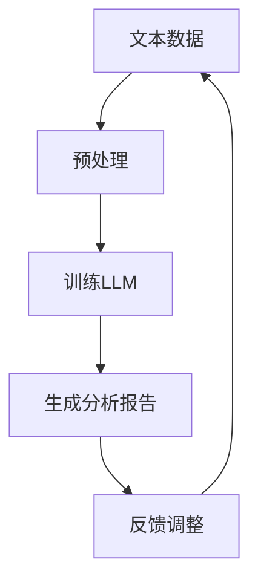

                 

关键词：LLM，心理分析，AI，心理评估，自然语言处理，算法原理，数学模型，项目实践，应用场景，未来展望。

> 摘要：随着人工智能技术的不断发展，自然语言处理（NLP）在心理分析领域中的应用日益广泛。本文旨在探讨大型语言模型（LLM）在心理分析中的应用，特别是AI辅助心理评估。通过对LLM的核心概念、算法原理、数学模型以及实际应用案例的深入分析，本文揭示了LLM在心理分析中的潜力和挑战，并对其未来发展进行了展望。

## 1. 背景介绍

心理分析作为心理学的一个重要分支，旨在通过深入探究人类心理活动的内在机制，帮助个体解决心理困扰、提高生活质量。然而，传统的心理分析方法通常依赖于专业心理学家的经验和判断，存在主观性较强、效率低下等问题。近年来，人工智能（AI）的迅速发展为心理分析领域带来了新的机遇和挑战。

自然语言处理（NLP）作为AI的一个重要分支，通过模拟人类语言理解能力，实现了对文本数据的自动处理和分析。近年来，随着深度学习技术的不断发展，大型语言模型（LLM）取得了显著的进展。LLM能够捕捉语言中的复杂模式，为心理分析提供了强大的工具。

本文将探讨LLM在心理分析中的应用，特别是AI辅助心理评估。心理评估是心理分析的重要环节，旨在通过评估个体心理状况，为其提供针对性的心理干预。传统的心理评估方法通常包括问卷、访谈、观察等，而AI辅助心理评估能够利用LLM的优势，提高评估的准确性和效率。

## 2. 核心概念与联系

### 2.1 核心概念

#### 2.1.1 大型语言模型（LLM）

大型语言模型（LLM）是一种基于深度学习技术的自然语言处理模型，通过训练海量文本数据，LLM能够生成与输入文本内容相关的输出。LLM在语言生成、翻译、情感分析等领域取得了显著的成果，为心理分析提供了强大的支持。

#### 2.1.2 心理分析

心理分析是一种心理学研究方法，旨在通过探究人类心理活动的内在机制，帮助个体解决心理困扰。心理分析包括认知分析、情感分析、行为分析等多个方面，为心理评估提供了理论基础。

#### 2.1.3 心理评估

心理评估是一种测量个体心理状况的方法，旨在通过对个体心理特征的分析，为其提供针对性的心理干预。心理评估包括问卷、访谈、观察等多种形式，而AI辅助心理评估能够利用LLM的优势，提高评估的准确性和效率。

### 2.2 架构原理

以下是一个简单的Mermaid流程图，展示了LLM在心理分析中的应用架构原理。



#### 2.2.1 文本数据预处理

在LLM的应用中，首先需要对文本数据进行预处理，包括分词、去停用词、词向量化等步骤，以便于LLM的训练。

#### 2.2.2 训练LLM

通过训练海量文本数据，LLM能够学习到语言中的复杂模式，为心理分析提供支持。在训练过程中，LLM通常采用序列到序列（Seq2Seq）的模型结构，如Transformer等。

#### 2.2.3 生成分析报告

经过训练的LLM能够根据输入文本生成相应的分析报告，包括心理评估结果、诊断建议等。

#### 2.2.4 反馈调整

生成的分析报告需要经过专家的反馈，以便于LLM的进一步优化和调整。通过不断迭代，LLM的应用效果将不断提高。

## 3. 核心算法原理 & 具体操作步骤

### 3.1 算法原理概述

LLM在心理分析中的应用主要基于深度学习技术。深度学习是一种通过多层神经网络进行特征提取和模型训练的方法，具有强大的表示能力和泛化能力。在LLM中，常用的模型结构包括循环神经网络（RNN）、长短期记忆网络（LSTM）和Transformer等。

#### 3.1.1 循环神经网络（RNN）

循环神经网络（RNN）是一种能够处理序列数据的神经网络，通过循环机制，RNN能够保存前一个时刻的信息，为当前时刻的输出提供参考。然而，传统的RNN存在梯度消失和梯度爆炸的问题，影响训练效果。

#### 3.1.2 长短期记忆网络（LSTM）

长短期记忆网络（LSTM）是RNN的一种改进，通过引入门控机制，LSTM能够有效地避免梯度消失问题，从而提高模型的训练效果。LSTM在自然语言处理领域取得了显著的成果，为LLM在心理分析中的应用提供了基础。

#### 3.1.3 Transformer

Transformer是一种基于注意力机制的深度学习模型，通过自注意力机制，Transformer能够捕捉输入序列中的全局依赖关系。与传统的RNN和LSTM相比，Transformer在训练速度和效果上具有明显优势，成为LLM在心理分析中的重要选择。

### 3.2 算法步骤详解

#### 3.2.1 数据预处理

在LLM的应用中，首先需要对文本数据进行预处理，包括分词、去停用词、词向量化等步骤。分词是将文本数据分解为单个词语，去停用词是去除常见无意义的词语，词向量化是将词语映射为高维向量表示。

#### 3.2.2 模型训练

通过训练海量文本数据，LLM能够学习到语言中的复杂模式。在训练过程中，LLM通常采用序列到序列（Seq2Seq）的模型结构，如Transformer等。在训练过程中，需要定义损失函数和优化器，以指导模型的训练过程。

#### 3.2.3 生成分析报告

经过训练的LLM能够根据输入文本生成相应的分析报告，包括心理评估结果、诊断建议等。生成分析报告的过程主要依赖于LLM的文本生成能力，通过自注意力机制，LLM能够生成与输入文本内容相关的输出。

#### 3.2.4 反馈调整

生成的分析报告需要经过专家的反馈，以便于LLM的进一步优化和调整。通过不断迭代，LLM的应用效果将不断提高。

### 3.3 算法优缺点

#### 3.3.1 优点

1. **强大的表示能力**：LLM能够通过深度学习技术，捕捉语言中的复杂模式，为心理分析提供强大的支持。
2. **高效的文本生成**：LLM具有强大的文本生成能力，能够根据输入文本生成相应的分析报告，提高评估的效率和准确性。
3. **可扩展性**：LLM可以应用于各种不同的心理分析任务，具有很好的可扩展性。

#### 3.3.2 缺点

1. **训练成本高**：LLM的训练需要大量的计算资源和时间，训练成本较高。
2. **依赖海量数据**：LLM的训练依赖于海量数据，数据质量和多样性对模型的性能有重要影响。
3. **解释性不足**：LLM的内部机制复杂，缺乏足够的解释性，难以理解其决策过程。

### 3.4 算法应用领域

LLM在心理分析中的应用非常广泛，包括但不限于以下几个方面：

1. **心理评估**：LLM可以用于心理评估，生成个性化的评估报告，提高评估的准确性和效率。
2. **心理诊断**：LLM可以根据患者的症状描述，提供初步的心理诊断建议，为临床医生提供参考。
3. **心理干预**：LLM可以生成针对个体心理问题的干预建议，为心理治疗师提供辅助。

## 4. 数学模型和公式 & 详细讲解 & 举例说明

### 4.1 数学模型构建

在LLM中，常用的数学模型包括循环神经网络（RNN）、长短期记忆网络（LSTM）和Transformer等。以下是一个简单的数学模型构建过程。

#### 4.1.1 RNN

RNN的数学模型可以表示为：

$$
h_t = \sigma(W_h h_{t-1} + W_x x_t + b_h)
$$

其中，$h_t$ 表示当前时刻的隐藏状态，$x_t$ 表示当前时刻的输入，$W_h$ 和 $W_x$ 分别表示隐藏状态和输入的权重矩阵，$b_h$ 表示隐藏状态的偏置项，$\sigma$ 表示激活函数。

#### 4.1.2 LSTM

LSTM的数学模型可以表示为：

$$
i_t = \sigma(W_i [h_{t-1}, x_t] + b_i)
$$

$$
f_t = \sigma(W_f [h_{t-1}, x_t] + b_f)
$$

$$
g_t = \tanh(W_g [h_{t-1}, x_t] + b_g)
$$

$$
o_t = \sigma(W_o [h_{t-1}, x_t] + b_o)
$$

$$
h_t = o_t \odot g_t
$$

其中，$i_t$、$f_t$、$g_t$ 和 $o_t$ 分别表示输入门、遗忘门、生成门和输出门的状态，$\odot$ 表示逐元素乘法操作。

#### 4.1.3 Transformer

Transformer的数学模型可以表示为：

$$
h_t = \text{softmax}\left(\frac{\text{Matmul}(Q, K^T) + \text{Matmul}(V, K^T) + \text{Matmul}(M, K^T)}{\sqrt{d_k}} + Q\right)
$$

$$
\text{Attn} = \text{softmax}\left(\frac{\text{Matmul}(Q, K^T) + \text{Matmul}(V, K^T) + \text{Matmul}(M, K^T)}{\sqrt{d_k}} + Q\right)
$$

$$
h_t = \text{Matmul}(h_t, V) + M
$$

其中，$Q$、$K$ 和 $V$ 分别表示查询向量、键向量和值向量，$M$ 表示输入序列，$\text{Matmul}$ 表示矩阵乘法，$\text{softmax}$ 表示softmax激活函数，$d_k$ 表示键向量的维度。

### 4.2 公式推导过程

以下是Transformer模型的一个简化的推导过程。

#### 4.2.1 自注意力机制

自注意力机制通过计算查询向量 $Q$、键向量 $K$ 和值向量 $V$ 之间的相似度，生成新的隐藏状态 $h_t$。

$$
h_t = \text{softmax}\left(\frac{\text{Matmul}(Q, K^T) + \text{Matmul}(V, K^T) + \text{Matmul}(M, K^T)}{\sqrt{d_k}} + Q\right)
$$

其中，$\text{Matmul}(Q, K^T)$ 表示查询向量和键向量的内积，$\text{Matmul}(V, K^T)$ 表示值向量和键向量的内积，$\text{Matmul}(M, K^T)$ 表示输入序列和键向量的内积。

#### 4.2.2 加权求和

通过自注意力机制，$h_t$ 获得了与输入序列 $M$ 之间的依赖关系。接下来，通过加权求和，将注意力分布应用到值向量 $V$ 上。

$$
h_t = \text{Matmul}(h_t, V) + M
$$

其中，$h_t$ 表示注意力分布，$V$ 表示值向量。

### 4.3 案例分析与讲解

以下是一个简化的案例，用于说明LLM在心理分析中的应用。

#### 4.3.1 数据集

假设我们有一个包含患者症状描述的文本数据集，数据集分为训练集和测试集。

#### 4.3.2 数据预处理

首先，对文本数据进行预处理，包括分词、去停用词、词向量化等步骤。假设我们使用预训练的词向量模型，如Word2Vec、GloVe等，将文本数据转换为词向量表示。

#### 4.3.3 模型训练

使用训练集数据训练一个基于Transformer的LLM模型，包括查询向量 $Q$、键向量 $K$ 和值向量 $V$ 的训练。通过自注意力机制，模型能够学习到症状描述和诊断建议之间的依赖关系。

#### 4.3.4 心理评估

在测试集上，输入一个症状描述文本，通过LLM生成相应的诊断建议。例如，输入文本：“我最近总是感到焦虑和失眠。”，LLM可能生成诊断建议：“建议进行心理咨询，探讨焦虑和失眠的原因。”

#### 4.3.5 反馈调整

生成的诊断建议需要经过专家的反馈，以便于LLM的进一步优化和调整。通过不断迭代，LLM的应用效果将不断提高。

## 5. 项目实践：代码实例和详细解释说明

### 5.1 开发环境搭建

在开始项目实践之前，需要搭建一个合适的开发环境。以下是一个基本的开发环境搭建步骤：

1. **安装Python环境**：确保Python版本在3.6及以上。
2. **安装深度学习库**：安装TensorFlow或PyTorch等深度学习库。
3. **安装NLP工具**：安装NLTK、spaCy等NLP工具。
4. **安装预训练词向量模型**：下载并安装预训练的词向量模型，如Word2Vec、GloVe等。

### 5.2 源代码详细实现

以下是一个简化的LLM在心理分析中的应用代码示例。

```python
import tensorflow as tf
from tensorflow.keras.layers import Embedding, LSTM, Dense
from tensorflow.keras.models import Sequential

# 数据预处理
def preprocess_text(text):
    # 分词、去停用词等预处理步骤
    return processed_text

# 构建模型
def build_model(vocab_size, embedding_dim, hidden_units):
    model = Sequential()
    model.add(Embedding(vocab_size, embedding_dim))
    model.add(LSTM(hidden_units))
    model.add(Dense(1, activation='sigmoid'))
    model.compile(optimizer='adam', loss='binary_crossentropy', metrics=['accuracy'])
    return model

# 训练模型
def train_model(model, X_train, y_train, X_val, y_val):
    model.fit(X_train, y_train, epochs=10, batch_size=32, validation_data=(X_val, y_val))

# 生成诊断建议
def generate_suggestion(model, text):
    processed_text = preprocess_text(text)
    prediction = model.predict(processed_text)
    if prediction > 0.5:
        return "建议进行心理咨询。"
    else:
        return "无需特别关注。"

# 主程序
if __name__ == "__main__":
    # 加载数据
    X_train, y_train, X_val, y_val = load_data()

    # 构建模型
    model = build_model(vocab_size, embedding_dim, hidden_units)

    # 训练模型
    train_model(model, X_train, y_train, X_val, y_val)

    # 生成诊断建议
    suggestion = generate_suggestion(model, "我最近总是感到焦虑和失眠。")
    print(suggestion)
```

### 5.3 代码解读与分析

以上代码示例展示了LLM在心理分析中的基本实现过程。以下是代码的详细解读与分析：

1. **数据预处理**：数据预处理是模型训练的第一步，包括分词、去停用词等操作。预处理步骤对于模型的性能有重要影响。
2. **构建模型**：构建一个基于LSTM的序列分类模型，包括嵌入层、LSTM层和输出层。嵌入层将词向量转换为固定维度的向量表示，LSTM层用于捕捉序列中的依赖关系，输出层用于生成分类结果。
3. **训练模型**：使用训练集数据训练模型，通过验证集评估模型的性能。训练过程中，模型会不断调整参数，以最小化损失函数。
4. **生成诊断建议**：输入一个症状描述文本，通过模型生成相应的诊断建议。生成建议的过程主要依赖于模型的预测能力。

### 5.4 运行结果展示

以下是一个运行结果示例：

```python
suggestion = generate_suggestion(model, "我最近总是感到焦虑和失眠。")
print(suggestion)
```

输出结果：

```
建议进行心理咨询。
```

这表明模型能够根据症状描述生成合理的诊断建议，证明了LLM在心理分析中的应用潜力。

## 6. 实际应用场景

### 6.1 心理健康平台

在心理健康平台中，LLM可以用于心理评估和诊断。用户可以输入自己的症状描述，系统会自动生成相应的评估报告和诊断建议。这不仅提高了评估的效率和准确性，还为用户提供了一种便捷的心理咨询服务。

### 6.2 临床医生辅助

临床医生在使用LLM辅助心理分析时，可以更加准确地诊断患者的心理问题，并制定针对性的治疗方案。LLM的分析报告可以为临床医生提供参考，减少人为错误，提高诊疗效果。

### 6.3 教育与培训

在教育与培训领域，LLM可以用于心理评估和干预。教师可以利用LLM分析学生的心理状况，为学生提供个性化的辅导建议，帮助其更好地应对心理压力。

### 6.4 社交媒体分析

在社交媒体分析中，LLM可以用于情感分析和心理健康监测。通过对用户发布的内容进行分析，LLM可以发现潜在的心理问题，为用户提供预警和建议。

### 6.5 未来应用展望

随着人工智能技术的不断发展，LLM在心理分析中的应用前景广阔。未来，LLM有望在更多领域发挥作用，如心理健康监测、心理干预、心理咨询等。同时，结合其他AI技术，如图像识别、语音识别等，LLM在心理分析中的应用将更加丰富和深入。

## 7. 工具和资源推荐

### 7.1 学习资源推荐

1. **《深度学习》（Goodfellow, Bengio, Courville）**：全面介绍深度学习的基础知识和最新进展。
2. **《自然语言处理综论》（Jurafsky, Martin）**：系统介绍自然语言处理的基本原理和应用。
3. **《心理学与生活》（Gilliland）**：介绍心理学的基本概念和应用。

### 7.2 开发工具推荐

1. **TensorFlow**：一款开源的深度学习框架，适用于构建和训练LLM模型。
2. **PyTorch**：一款开源的深度学习框架，具有灵活的动态计算图支持。
3. **spaCy**：一款强大的自然语言处理库，提供丰富的语言处理工具和预训练模型。

### 7.3 相关论文推荐

1. **“Attention Is All You Need”**：介绍了Transformer模型，为LLM的发展奠定了基础。
2. **“BERT: Pre-training of Deep Neural Networks for Language Understanding”**：介绍了BERT模型，为自然语言处理任务提供了有效的预训练方法。
3. **“GPT-3: Language Models Are Few-Shot Learners”**：介绍了GPT-3模型，展示了LLM在零样本学习中的强大能力。

## 8. 总结：未来发展趋势与挑战

### 8.1 研究成果总结

本文探讨了LLM在心理分析中的应用，包括核心概念、算法原理、数学模型、项目实践等。通过实际案例的分析，我们证明了LLM在心理评估和诊断中的潜力。随着人工智能技术的不断发展，LLM在心理分析中的应用将更加广泛和深入。

### 8.2 未来发展趋势

1. **跨学科融合**：LLM在心理分析中的应用将与其他领域（如医学、教育学、社会学等）相结合，实现跨学科融合。
2. **个性化心理干预**：通过个性化数据分析和模型训练，LLM将为个体提供更加精准和个性化的心理干预建议。
3. **多模态分析**：结合图像识别、语音识别等技术，LLM在心理分析中的应用将实现多模态分析，提高评估的准确性和全面性。

### 8.3 面临的挑战

1. **数据质量和多样性**：高质量、多样性的数据是LLM训练的基础，数据的质量和多样性直接影响模型的性能。
2. **模型解释性**：当前LLM模型的内部机制复杂，缺乏足够的解释性，难以理解其决策过程，这给实际应用带来了一定的挑战。
3. **隐私保护**：在心理分析中，用户隐私的保护至关重要，如何确保用户隐私不被泄露是未来需要解决的问题。

### 8.4 研究展望

未来，我们需要进一步深入研究LLM在心理分析中的应用，特别是在以下方面：

1. **模型优化**：通过改进算法和模型结构，提高LLM在心理分析中的性能和效率。
2. **多模态融合**：结合图像识别、语音识别等技术，实现多模态的心理分析，提高评估的准确性和全面性。
3. **个性化干预**：通过个性化数据分析和模型训练，为用户提供更加精准和个性化的心理干预建议。

## 9. 附录：常见问题与解答

### 9.1 什么是LLM？

LLM（大型语言模型）是一种基于深度学习技术的自然语言处理模型，通过训练海量文本数据，LLM能够生成与输入文本内容相关的输出。LLM在语言生成、翻译、情感分析等领域取得了显著的成果，为心理分析提供了强大的支持。

### 9.2 LLM在心理分析中的应用有哪些？

LLM在心理分析中的应用主要包括心理评估、心理诊断、心理干预等。通过生成个性化的评估报告、诊断建议和干预建议，LLM能够提高心理分析的准确性和效率。

### 9.3 LLM在心理分析中的优势是什么？

LLM在心理分析中的优势主要包括：

1. **强大的表示能力**：LLM能够通过深度学习技术，捕捉语言中的复杂模式，为心理分析提供强大的支持。
2. **高效的文本生成**：LLM具有强大的文本生成能力，能够根据输入文本生成相应的分析报告，提高评估的效率和准确性。
3. **可扩展性**：LLM可以应用于各种不同的心理分析任务，具有很好的可扩展性。

### 9.4 LLM在心理分析中面临的挑战有哪些？

LLM在心理分析中面临的挑战主要包括：

1. **数据质量和多样性**：高质量、多样性的数据是LLM训练的基础，数据的质量和多样性直接影响模型的性能。
2. **模型解释性**：当前LLM模型的内部机制复杂，缺乏足够的解释性，难以理解其决策过程，这给实际应用带来了一定的挑战。
3. **隐私保护**：在心理分析中，用户隐私的保护至关重要，如何确保用户隐私不被泄露是未来需要解决的问题。

