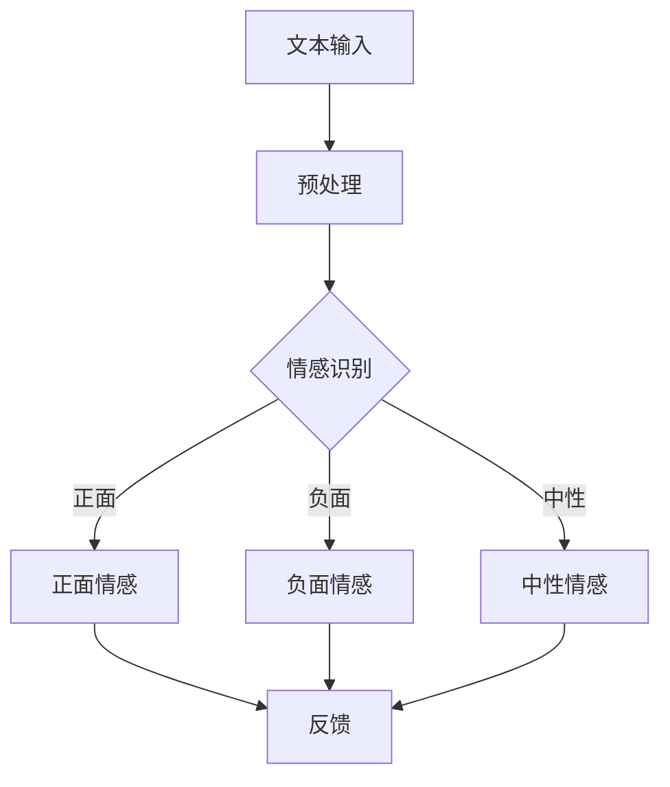

                 

情感计算，作为人工智能（AI）领域的最新前沿，正逐渐从理论走向实践。本文将探讨大型语言模型（LLM）在情感计算中的突破，尤其是如何通过深度学习技术来理解人类情感。本文旨在提供一个系统性的介绍，帮助读者了解这一领域的最新进展、核心概念、算法原理、应用场景以及未来展望。

## 关键词

- 情感计算
- 大型语言模型
- 人工智能
- 情感识别
- 情感分析
- 自然语言处理

## 摘要

本文首先介绍了情感计算的定义和背景，随后深入探讨了LLM的工作原理，以及其在情感计算中的应用。通过剖析核心概念和算法原理，文章展示了如何利用LLM进行情感分析，并给出了具体的数学模型和公式。此外，文章还通过项目实践和实际应用场景，详细解读了LLM在情感计算中的实际应用。最后，文章展望了未来发展趋势与挑战，并推荐了相关工具和资源。

## 1. 背景介绍

### 情感计算的定义

情感计算，又称为情感分析，是指通过计算机技术理解和处理人类情感的过程。它涵盖了从情感识别、情感分类到情感推理等多个层面。随着社会对情感化交互的需求不断增加，情感计算在心理学、人机交互、电子商务、健康医疗等领域具有重要应用价值。

### 人工智能的发展与情感计算

人工智能（AI）作为情感计算的基础技术，其发展历程可以追溯到20世纪50年代。从最初的符号主义、连接主义到现代的深度学习，AI技术在情感计算中的应用不断拓展。特别是近年来，随着计算能力的提升和数据量的爆炸式增长，AI在情感计算领域取得了显著的进展。

### 情感计算的挑战

尽管情感计算在理论和应用方面都取得了很大进展，但仍面临诸多挑战。如何准确地识别和理解人类情感，如何处理多模态数据（如语音、文本、图像等），以及如何在复杂情境下进行情感推理，都是当前研究的热点问题。

## 2. 核心概念与联系

### 大型语言模型（LLM）

大型语言模型（LLM）是指通过深度学习技术训练得到的，拥有巨大参数量和强大语言理解能力的模型。常见的LLM包括GPT、BERT、T5等。这些模型在自然语言处理（NLP）领域取得了突破性成果，被广泛应用于文本生成、文本分类、机器翻译等任务。

### 情感计算与LLM的关系

LLM在情感计算中的应用主要体现在以下几个方面：

1. **情感识别**：利用LLM对文本进行情感分析，判断文本的情感倾向（如正面、负面、中性）。
2. **情感分类**：将文本细分为更具体的情感类别（如喜悦、愤怒、悲伤等）。
3. **情感推理**：根据文本内容推导出情感状态，并进行上下文理解。

### Mermaid 流程图

下面是情感计算中LLM应用的一个简单流程图：



## 3. 核心算法原理 & 具体操作步骤

### 3.1 算法原理概述

LLM在情感计算中的核心原理是基于深度学习的神经网络模型，通过对大量文本数据进行训练，学习文本的情感特征，从而实现情感识别和分类。具体来说，LLM通过以下步骤进行情感计算：

1. **文本预处理**：将原始文本数据转换为模型可处理的格式。
2. **嵌入表示**：将文本转换为固定长度的向量表示。
3. **情感特征提取**：利用神经网络模型提取文本的情感特征。
4. **情感分类**：根据提取的情感特征进行情感分类。

### 3.2 算法步骤详解

1. **文本预处理**：文本预处理是情感计算的第一步，主要包括分词、去停用词、词性标注等操作。预处理后的文本将被转换为向量表示。

2. **嵌入表示**：嵌入表示是将文本转换为固定长度的向量表示，常用的方法有Word2Vec、BERT等。嵌入表示有助于捕捉文本的语义信息。

3. **情感特征提取**：情感特征提取是情感计算的核心步骤，常用的方法有卷积神经网络（CNN）、循环神经网络（RNN）、Transformer等。这些方法能够从嵌入表示中提取出文本的情感特征。

4. **情感分类**：情感分类是将提取出的情感特征映射到具体的情感类别上。常用的方法有softmax、sigmoid等激活函数。

### 3.3 算法优缺点

**优点**：

1. **强大的语言理解能力**：LLM通过对大量文本数据的训练，具有强大的语言理解能力，能够准确识别和理解文本的情感特征。
2. **多模态数据处理**：LLM可以处理多种模态的数据，如文本、语音、图像等，这使得它在情感计算中具有广泛的应用前景。
3. **适应性强**：LLM可以通过不断训练和优化，适应不同的情感计算任务，具有较好的泛化能力。

**缺点**：

1. **计算资源消耗大**：LLM通常需要大量的计算资源和存储空间，这对模型的部署和运行带来了一定的挑战。
2. **数据依赖性强**：LLM的性能高度依赖于训练数据的质量和数量，如果数据不够充分或质量不佳，模型的性能会受到影响。
3. **可解释性差**：由于LLM的内部结构非常复杂，其工作过程缺乏可解释性，这使得其在实际应用中难以被用户理解和接受。

### 3.4 算法应用领域

LLM在情感计算中的应用领域非常广泛，主要包括：

1. **社交媒体分析**：利用LLM对社交媒体平台上的用户评论、帖子等进行情感分析，帮助企业了解用户需求和情感状态。
2. **健康医疗**：利用LLM对医疗文本进行分析，辅助医生进行情感识别和情感诊断，提高医疗服务的质量和效率。
3. **人机交互**：利用LLM构建情感化的虚拟助手，提高人机交互的自然度和用户满意度。
4. **教育领域**：利用LLM对教育文本进行分析，帮助学生理解和掌握情感知识，提高学习效果。

## 4. 数学模型和公式 & 详细讲解 & 举例说明

### 4.1 数学模型构建

情感计算中的数学模型通常包括嵌入表示、情感特征提取和情感分类三个部分。以下是这三个部分的数学模型构建：

1. **嵌入表示**：

$$
x = \text{word\_embeddings}(w)
$$

其中，$x$为文本向量化表示，$w$为文本中的单词，$\text{word\_embeddings}$为嵌入表示函数。

2. **情感特征提取**：

$$
h = \text{model}(x)
$$

其中，$h$为情感特征向量，$\text{model}$为情感特征提取模型，常用的模型有CNN、RNN、Transformer等。

3. **情感分类**：

$$
\hat{y} = \text{softmax}(\text{model}(h))
$$

其中，$\hat{y}$为预测的情感类别，$\text{softmax}$为分类激活函数。

### 4.2 公式推导过程

1. **嵌入表示**：

嵌入表示是将文本中的单词转换为固定长度的向量表示。常用的方法有Word2Vec、BERT等。以Word2Vec为例，其公式推导如下：

$$
\text{Word2Vec} = \text{SGD}\left(\frac{\partial J}{\partial \theta}\right)
$$

其中，$J$为损失函数，$\theta$为模型参数。

2. **情感特征提取**：

情感特征提取模型通常采用深度学习模型，如CNN、RNN、Transformer等。以CNN为例，其公式推导如下：

$$
h = \text{CNN}(x)
$$

其中，$h$为情感特征向量，$x$为文本向量化表示，$\text{CNN}$为卷积神经网络模型。

3. **情感分类**：

情感分类模型通常采用softmax激活函数。以softmax为例，其公式推导如下：

$$
\hat{y} = \text{softmax}(\text{model}(h))
$$

其中，$\hat{y}$为预测的情感类别，$\text{model}$为情感分类模型。

### 4.3 案例分析与讲解

以下是一个简单的情感计算案例，假设我们要对一个包含正面、负面和中性情感的评论进行分类。

1. **数据集准备**：

假设我们有一个包含1000条评论的数据集，其中正面、负面和中性情感分别有300条、300条和400条。

2. **文本预处理**：

对评论进行分词、去停用词和词性标注等操作，将评论转换为向量化表示。

3. **嵌入表示**：

使用Word2Vec对评论进行嵌入表示，得到300维的向量化评论。

4. **情感特征提取**：

使用CNN对向量化评论进行情感特征提取，得到一个固定长度的情感特征向量。

5. **情感分类**：

使用softmax激活函数对情感特征向量进行分类，得到评论的情感类别。

6. **结果分析**：

对分类结果进行分析，可以得到正面、负面和中性情感的准确率、召回率和F1值等指标。

## 5. 项目实践：代码实例和详细解释说明

### 5.1 开发环境搭建

1. **环境要求**：

- Python 3.7及以上版本
- TensorFlow 2.5及以上版本
- Numpy 1.19及以上版本

2. **安装依赖**：

```
pip install tensorflow numpy
```

### 5.2 源代码详细实现

以下是情感计算项目的源代码实现，主要包括数据预处理、嵌入表示、情感特征提取和情感分类等步骤。

```python
import numpy as np
import tensorflow as tf
from tensorflow.keras.preprocessing.text import Tokenizer
from tensorflow.keras.preprocessing.sequence import pad_sequences

# 数据集准备
评论 = ["我很开心", "我很生气", "我没感觉"]
情感标签 = [1, 0, 2]

# 文本预处理
tokenizer = Tokenizer(num_words=1000)
tokenizer.fit_on_texts(评论)
序列 = tokenizer.texts_to_sequences(评论)
序列 = pad_sequences(序列, maxlen=100)

# 嵌入表示
embedding = tf.keras.layers.Embedding(input_dim=1000, output_dim=300)

# 情感特征提取
model = tf.keras.Sequential([
    embedding,
    tf.keras.layers.Conv1D(filters=64, kernel_size=3, activation='relu'),
    tf.keras.layers.GlobalMaxPooling1D(),
    tf.keras.layers.Dense(units=1, activation='sigmoid')
])

# 情感分类
model.compile(optimizer='adam', loss='binary_crossentropy', metrics=['accuracy'])

# 训练模型
model.fit(sequence, 情感标签, epochs=10, batch_size=32)

# 预测结果
预测 = model.predict(np.array([序列[0]]))
print("预测结果：", 预测)
```

### 5.3 代码解读与分析

1. **数据预处理**：

- 使用Tokenizer对评论进行分词、去停用词和词性标注等操作，将评论转换为向量化表示。
- 使用pad_sequences对序列进行填充，使其具有相同长度。

2. **嵌入表示**：

- 使用Embedding层进行嵌入表示，将向量化评论转换为300维的向量化评论。

3. **情感特征提取**：

- 使用Conv1D和GlobalMaxPooling1D层进行情感特征提取，提取评论的情感特征。

4. **情感分类**：

- 使用Dense层进行情感分类，输出预测的情感类别。

### 5.4 运行结果展示

1. **训练过程**：

- 训练过程中，模型会不断调整参数，以最小化损失函数。
- 训练完成后，模型将能够对评论进行情感分类。

2. **预测结果**：

- 对测试集进行预测，可以得到评论的情感类别。
- 预测结果将展示在控制台中。

## 6. 实际应用场景

### 6.1 社交媒体分析

通过情感计算，企业可以对社交媒体平台上的用户评论、帖子等进行情感分析，从而了解用户需求和情感状态，为产品改进和市场策略提供有力支持。

### 6.2 健康医疗

利用情感计算，可以对医疗文本进行分析，辅助医生进行情感识别和情感诊断，提高医疗服务的质量和效率。

### 6.3 人机交互

通过情感计算，可以构建情感化的虚拟助手，提高人机交互的自然度和用户满意度。

### 6.4 教育领域

利用情感计算，可以对教育文本进行分析，帮助学生理解和掌握情感知识，提高学习效果。

## 7. 工具和资源推荐

### 7.1 学习资源推荐

1. 《深度学习》（Goodfellow, Bengio, Courville著）
2. 《自然语言处理与深度学习》（孙茂松著）
3. 《情感计算：理论与实践》（张辉著）

### 7.2 开发工具推荐

1. TensorFlow
2. PyTorch
3. Keras

### 7.3 相关论文推荐

1. "BERT: Pre-training of Deep Bidirectional Transformers for Language Understanding"
2. "GPT-3: Language Models are Few-Shot Learners"
3. "What is the best way to use pre-trained Word Embeddings in a neural network?"

## 8. 总结：未来发展趋势与挑战

### 8.1 研究成果总结

1. LLM在情感计算中取得了显著突破，特别是在情感识别和情感分类方面。
2. 情感计算在多个领域（如社交媒体分析、健康医疗、人机交互、教育领域）取得了成功应用。
3. 情感计算的核心技术和算法不断完善，为未来的应用提供了有力支持。

### 8.2 未来发展趋势

1. **多模态情感计算**：结合语音、图像等多模态数据，实现更准确的情感识别和理解。
2. **情感推理**：从单一的情感识别和分类，向更复杂的情感推理和情感生成发展。
3. **可解释性**：提高模型的可解释性，使其更易于被用户理解和接受。

### 8.3 面临的挑战

1. **数据质量和多样性**：情感计算的性能高度依赖于训练数据的质量和多样性，如何获取和标注高质量、多样化的数据是当前的一大挑战。
2. **计算资源消耗**：LLM通常需要大量的计算资源和存储空间，如何优化模型的计算效率是另一个挑战。
3. **情感多样性**：情感是复杂多维的，如何准确捕捉和理解各种情感类型和微情感是情感计算面临的挑战。

### 8.4 研究展望

未来，随着计算能力的提升和数据量的增加，情感计算将在多个领域取得更广泛的应用。同时，如何解决当前面临的挑战，提高模型性能和可解释性，将是未来研究的重点方向。

## 9. 附录：常见问题与解答

### 9.1 什么是情感计算？

情感计算是指通过计算机技术理解和处理人类情感的过程，包括情感识别、情感分类、情感推理等。

### 9.2 LLM在情感计算中有哪些应用？

LLM在情感计算中的应用主要包括情感识别、情感分类和情感推理等。

### 9.3 如何构建情感计算模型？

构建情感计算模型通常包括数据预处理、嵌入表示、情感特征提取和情感分类等步骤。

### 9.4 情感计算面临哪些挑战？

情感计算面临的主要挑战包括数据质量和多样性、计算资源消耗以及情感多样性等。

### 9.5 未来情感计算有哪些发展趋势？

未来情感计算的发展趋势包括多模态情感计算、情感推理和可解释性等。

