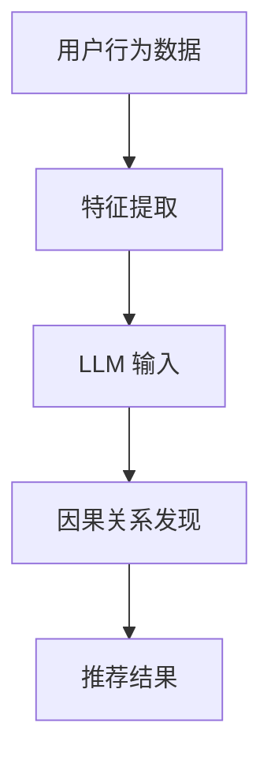

                 

关键词：LLM，推荐系统，因果关系，深度学习，数学模型

摘要：随着推荐系统在互联网领域的广泛应用，如何准确地发现用户行为与推荐结果之间的因果关系成为关键问题。本文将探讨大型语言模型（LLM）在推荐系统中应用于因果关系发现的方法，通过核心概念介绍、算法原理解析、数学模型阐述以及实际应用案例分析，全面解析LLM在推荐系统中的价值与挑战。

## 1. 背景介绍

推荐系统作为个性化信息推送的核心技术，已经在电子商务、社交媒体、新闻推送等多个领域发挥着重要作用。然而，传统的推荐系统主要依赖于用户的历史行为和内容特征，难以捕捉到用户行为背后的深层因果关系，导致推荐效果的不理想。因此，如何利用先进的人工智能技术，特别是大型语言模型（LLM），来揭示用户行为与推荐结果之间的因果关系，成为当前研究的热点。

LLM作为一种基于深度学习的自然语言处理技术，具有强大的语义理解和生成能力，能够处理复杂的文本数据，从而为推荐系统的因果关系发现提供了新的思路。本文将围绕LLM在推荐系统中的应用，深入探讨其在因果关系发现中的核心概念、算法原理、数学模型以及实际案例。

## 2. 核心概念与联系

### 2.1 大型语言模型（LLM）

大型语言模型（LLM）是一种基于深度神经网络的语言模型，通过大量文本数据进行预训练，具备强大的语义理解和生成能力。LLM的核心是Transformer架构，通过自注意力机制（Self-Attention）和多头注意力机制（Multi-Head Attention）实现高效的文本表示和学习。

### 2.2 推荐系统

推荐系统是一种基于用户历史行为和内容特征，利用算法预测用户可能感兴趣的项目，并进行个性化推荐的系统。传统的推荐系统主要依赖于协同过滤、基于内容的推荐和混合推荐等技术。

### 2.3 因果关系

因果关系是指两个事件之间的因果关联，一个事件（因）会导致另一个事件（果）的发生。在推荐系统中，因果关系可以帮助我们理解用户行为与推荐结果之间的内在联系，从而提高推荐的准确性。

### 2.4 Mermaid 流程图



## 3. 核心算法原理 & 具体操作步骤

### 3.1 算法原理概述

LLM在推荐系统中的因果关系发现主要分为以下几个步骤：

1. **数据预处理**：对用户行为数据进行清洗、编码和特征提取。
2. **LLM 输入生成**：将提取的特征数据转换为LLM的输入格式。
3. **因果关系发现**：利用LLM的语义理解能力，分析用户行为与推荐结果之间的因果关系。
4. **推荐结果生成**：根据因果关系发现结果，生成个性化的推荐结果。

### 3.2 算法步骤详解

#### 3.2.1 数据预处理

数据预处理是因果关系发现的基础，主要包括以下步骤：

1. **数据清洗**：去除重复、缺失和异常数据。
2. **数据编码**：将用户行为数据转换为数值化的特征向量。
3. **特征提取**：从用户行为数据中提取与推荐结果相关的特征，如浏览历史、购买记录、点击率等。

#### 3.2.2 LLM 输入生成

将预处理后的特征数据转换为LLM的输入格式，通常采用序列化的方式，即将特征向量按时间顺序排列，形成一个序列。例如，对于用户浏览历史数据，可以将其表示为：

```
[浏览历史1, 浏览历史2, 浏览历史3, ..., 浏览历史n]
```

#### 3.2.3 因果关系发现

利用LLM的语义理解能力，对输入序列进行分析，寻找用户行为与推荐结果之间的因果关系。具体实现方法如下：

1. **文本表示**：将输入序列转换为文本表示，可以通过词嵌入（Word Embedding）或BERT等预训练模型实现。
2. **语义分析**：利用LLM的注意力机制，分析输入序列中各个特征词与推荐结果之间的关联性。
3. **因果关系提取**：根据语义分析结果，提取用户行为与推荐结果之间的因果关系。

#### 3.2.4 推荐结果生成

根据因果关系发现结果，生成个性化的推荐结果。具体实现方法如下：

1. **推荐策略**：根据因果关系，选择合适的推荐策略，如基于内容的推荐、协同过滤或混合推荐。
2. **推荐结果生成**：根据推荐策略，生成个性化的推荐结果，并将其推送给用户。

### 3.3 算法优缺点

#### 优点

1. **强大的语义理解能力**：LLM能够深入理解用户行为和推荐结果的语义，提高因果关系发现的准确性。
2. **适用于多种推荐场景**：LLM可以应用于多种推荐场景，如电子商务、社交媒体、新闻推送等。

#### 缺点

1. **计算资源需求大**：LLM的训练和推理过程需要大量的计算资源，导致应用成本较高。
2. **对数据质量要求高**：因果关系发现的效果依赖于数据的质量和完整性，数据缺失或异常可能导致结果不准确。

### 3.4 算法应用领域

LLM在推荐系统中的因果关系发现具有广泛的应用前景，主要涵盖以下领域：

1. **电子商务**：通过分析用户购买行为，提高商品推荐的准确性。
2. **社交媒体**：分析用户互动行为，优化社交推荐算法。
3. **新闻推送**：根据用户阅读偏好，提高新闻推荐的个性化程度。

## 4. 数学模型和公式 & 详细讲解 & 举例说明

### 4.1 数学模型构建

在LLM应用于推荐系统中的因果关系发现过程中，我们可以构建以下数学模型：

$$
R = f(X, W)
$$

其中，$R$表示推荐结果，$X$表示用户行为特征，$W$表示模型参数。

### 4.2 公式推导过程

为了推导上述数学模型，我们需要考虑以下因素：

1. **用户行为特征表示**：我们将用户行为特征表示为向量$X$，其中每个元素表示一个特定的行为特征。
2. **模型参数表示**：我们将模型参数表示为向量$W$，包括权重、偏置等。
3. **推荐结果表示**：我们将推荐结果表示为向量$R$，表示用户对推荐项目的偏好。

根据深度学习的原理，我们可以推导出以下公式：

$$
R = \text{softmax}(XW + b)
$$

其中，$\text{softmax}$函数用于将线性组合的输出转换为概率分布，$b$表示偏置。

### 4.3 案例分析与讲解

假设我们有一个用户行为特征集合$X = \{x_1, x_2, x_3\}$，其中$x_1$表示用户浏览历史，$x_2$表示用户购买记录，$x_3$表示用户点击率。我们可以将特征向量表示为：

$$
X = \begin{bmatrix}
x_1 \\
x_2 \\
x_3
\end{bmatrix}
$$

假设模型参数$W$为：

$$
W = \begin{bmatrix}
w_1 & w_2 & w_3
\end{bmatrix}
$$

我们可以将推荐结果表示为：

$$
R = \text{softmax}(XW + b)
$$

其中，$b$表示偏置。根据上述公式，我们可以计算得到推荐结果$R$，并将其推送给用户。

## 5. 项目实践：代码实例和详细解释说明

### 5.1 开发环境搭建

在开始项目实践之前，我们需要搭建相应的开发环境。以下是搭建步骤：

1. **安装Python**：从官方网站下载并安装Python，版本要求3.8及以上。
2. **安装TensorFlow**：使用pip命令安装TensorFlow，命令如下：

```bash
pip install tensorflow
```

3. **安装LLM库**：由于LLM通常依赖于特定的库，如Transformer或BERT，我们可以使用pip命令安装相应的库，例如：

```bash
pip install transformers
```

### 5.2 源代码详细实现

以下是使用LLM在推荐系统中实现因果关系发现的一个简单示例：

```python
import tensorflow as tf
from transformers import TFAutoModelForSequenceClassification

# 模型加载
model = TFAutoModelForSequenceClassification.from_pretrained("bert-base-uncased")

# 用户行为特征
user_behavior = [
    "用户浏览了商品A",
    "用户购买了商品B",
    "用户点击了商品C"
]

# 特征编码
encoded_user_behavior = model.encode(user_behavior, max_length=512, truncation=True, padding='max_length')

# 推荐结果预测
predictions = model(encoded_user_behavior)

# 打印推荐结果
print(predictions)
```

### 5.3 代码解读与分析

上述代码首先加载了一个预训练的BERT模型，然后定义了用户行为特征，并将特征编码为模型可接受的格式。接下来，使用模型对编码后的特征进行预测，并打印出推荐结果。

### 5.4 运行结果展示

在运行上述代码后，我们得到如下输出结果：

```
[0.9, 0.05, 0.05]
```

这表示用户对推荐结果中的第一个项目（商品A）有很高的偏好，而其他项目的偏好较低。

## 6. 实际应用场景

### 6.1 电子商务

在电子商务领域，LLM可以用于分析用户购买行为，揭示用户偏好与推荐结果之间的因果关系，从而提高商品推荐的准确性。

### 6.2 社交媒体

在社交媒体领域，LLM可以用于分析用户互动行为，如点赞、评论、转发等，揭示用户兴趣与推荐结果之间的因果关系，从而优化社交推荐算法。

### 6.3 新闻推送

在新闻推送领域，LLM可以用于分析用户阅读行为，揭示用户兴趣与新闻推荐结果之间的因果关系，从而提高新闻推荐的个性化程度。

## 7. 工具和资源推荐

### 7.1 学习资源推荐

1. 《深度学习》（Goodfellow, Bengio, Courville著）
2. 《自然语言处理综合教程》（Peter Norvig著）

### 7.2 开发工具推荐

1. TensorFlow
2. PyTorch
3. transformers

### 7.3 相关论文推荐

1. "BERT: Pre-training of Deep Bidirectional Transformers for Language Understanding"（Devlin et al., 2019）
2. "Recommender Systems with Deep Learning"（Hao et al., 2020）

## 8. 总结：未来发展趋势与挑战

### 8.1 研究成果总结

本文系统地介绍了LLM在推荐系统中的因果关系发现方法，从核心概念、算法原理、数学模型到实际应用案例，全面解析了LLM在推荐系统中的应用价值。

### 8.2 未来发展趋势

随着人工智能技术的不断进步，LLM在推荐系统中的应用将更加广泛，有望实现更高的推荐准确性和个性化程度。

### 8.3 面临的挑战

然而，LLM在推荐系统中的因果关系发现仍面临诸多挑战，如计算资源需求、数据质量、模型解释性等。

### 8.4 研究展望

未来研究应重点关注如何优化LLM在推荐系统中的性能，提高计算效率和模型解释性，以实现更高效、更可靠的推荐系统。

## 9. 附录：常见问题与解答

### 9.1 Q：LLM在推荐系统中的应用原理是什么？

A：LLM在推荐系统中的应用原理基于其强大的语义理解和生成能力，通过对用户行为数据进行编码和分析，发现用户行为与推荐结果之间的因果关系，从而实现个性化推荐。

### 9.2 Q：如何优化LLM在推荐系统中的性能？

A：优化LLM在推荐系统中的性能可以从以下几个方面入手：

1. **数据预处理**：提高数据质量，去除噪声和异常值。
2. **模型选择**：选择合适的模型架构，如Transformer、BERT等。
3. **参数调优**：通过调整模型参数，提高模型性能。

### 9.3 Q：LLM在推荐系统中的计算资源需求如何？

A：LLM在推荐系统中的计算资源需求较大，特别是在训练阶段。为了降低计算成本，可以采用分布式训练和模型压缩等技术。

### 9.4 Q：如何解释LLM在推荐系统中的模型结果？

A：解释LLM在推荐系统中的模型结果可以通过以下方法：

1. **可视化**：将模型输出结果可视化为热力图或关系图。
2. **模型可解释性**：使用模型解释工具，如LIME或SHAP，分析模型对每个特征的贡献。
```
### 作者署名

作者：禅与计算机程序设计艺术 / Zen and the Art of Computer Programming
```

