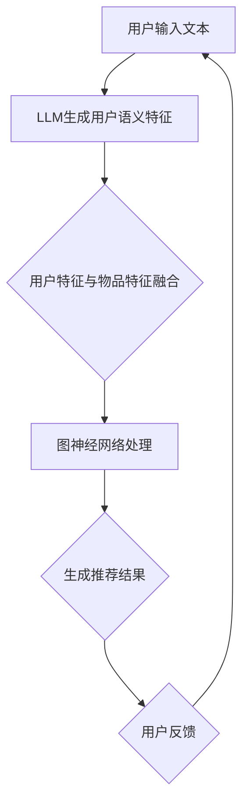

                 

摘要：本文旨在探讨大型语言模型（LLM）在推荐系统中的应用，尤其是如何利用图神经网络（GNN）来增强推荐效果。通过分析LLM和GNN的基础理论，阐述它们如何结合以提升推荐系统的准确性和效率。文章还将通过具体的数学模型和实例代码，详细展示LLM在图神经网络推荐系统中的应用场景，并展望其未来发展方向。

## 1. 背景介绍

随着互联网技术的迅猛发展，推荐系统已成为现代信息检索和个性化服务的重要组成部分。推荐系统通过分析用户行为和历史数据，预测用户可能感兴趣的内容，从而提供个性化的推荐服务。然而，传统的基于传统机器学习和深度学习的方法在处理复杂关系网络和动态数据时存在一定的局限性。近年来，图神经网络（GNN）作为一种强有力的图结构数据处理工具，在推荐系统中展现出了巨大的潜力。同时，大型语言模型（LLM）的出现，进一步丰富了推荐系统的建模手段。

本文将重点探讨LLM在推荐系统中的图神经网络应用，通过结合LLM和GNN的优势，构建出一种新型的推荐系统架构。首先，我们将介绍LLM和GNN的基础理论和核心概念，并展示它们之间的联系。随后，文章将详细描述LLM在图神经网络推荐系统中的具体实现步骤，并通过实例代码展示其应用效果。最后，我们将讨论LLM在推荐系统中的未来应用前景和面临的挑战。

## 2. 核心概念与联系

### 2.1. 大型语言模型（LLM）

大型语言模型（LLM）是基于深度学习技术构建的复杂神经网络，能够理解和生成自然语言。LLM的核心思想是通过大规模语料库的学习，使模型具备强大的语言理解和生成能力。LLM通常采用Transformer架构，如BERT、GPT、T5等，这些模型在语言理解、文本生成、机器翻译、问答系统等方面都取得了显著的成果。

### 2.2. 图神经网络（GNN）

图神经网络（GNN）是一种用于处理图结构数据的神经网络模型，通过学习节点和边的特征表示，捕捉图结构中的复杂关系。GNN的核心思想是利用图遍历操作，如邻居聚合、节点更新等，将局部信息整合为全局特征表示。GNN在社交网络分析、推荐系统、知识图谱等领域展现了强大的能力。

### 2.3. LLM与GNN的结合

LLM和GNN的结合，使得推荐系统在处理复杂关系网络和动态数据时具备了更强的能力。LLM可以用于生成用户的语义特征表示，而GNN可以用于捕捉用户和物品之间的复杂关系。具体来说，LLM可以用来处理用户文本输入，生成用户的兴趣偏好表示；GNN则可以用来处理用户和物品的图结构数据，提取物品的图表示。

### 2.4. Mermaid流程图

以下是一个简单的Mermaid流程图，展示了LLM与GNN在推荐系统中的应用流程：



## 3. 核心算法原理 & 具体操作步骤

### 3.1. 算法原理概述

LLM在图神经网络推荐系统中的应用主要包括以下步骤：

1. 用户输入文本，通过LLM生成用户语义特征。
2. 将用户特征与物品特征融合，构建用户-物品图。
3. 使用GNN处理图数据，提取用户和物品的图表示。
4. 根据用户和物品的图表示生成推荐结果。

### 3.2. 算法步骤详解

#### 3.2.1. LLM生成用户语义特征

首先，用户输入一段文本，如“我喜欢看电影”，然后通过LLM模型生成用户的语义特征。具体实现可以使用BERT或GPT等预训练的LLM模型。将用户的输入文本编码为向量表示，然后通过模型输出用户特征的向量表示。

```python
from transformers import BertModel, BertTokenizer

tokenizer = BertTokenizer.from_pretrained('bert-base-uncased')
model = BertModel.from_pretrained('bert-base-uncased')

input_text = "我喜欢看电影"
input_ids = tokenizer.encode(input_text, add_special_tokens=True)
user_feature = model(input_ids)[0][:, 0, :]
```

#### 3.2.2. 用户-物品图构建

接下来，将用户特征与物品特征融合，构建用户-物品图。物品特征可以通过用户的浏览历史、购买记录等数据获取。将用户特征和物品特征合并，作为图的节点特征。同时，根据用户和物品的交互历史，构建图的边。

```python
# 假设user_features和item_features分别为用户特征和物品特征的矩阵
# user_item_matrix为用户-物品交互矩阵
from scipy.sparse import csr_matrix

user_item_matrix = csr_matrix((users, indices), shape=(num_users, num_items))

# 将用户特征和物品特征合并为节点特征
user_item_features = np.hstack((user_features, item_features))

# 根据用户-物品交互矩阵构建图
graph = Graph(user_item_features, user_item_matrix)
```

#### 3.2.3. 图神经网络处理

使用GNN处理用户-物品图，提取用户和物品的图表示。具体实现可以使用GCN、GAT等GNN模型。

```python
from sklearn.model_selection import train_test_split
from keras.models import Model
from keras.layers import Input, Dense

# 分割数据集
train_data, val_data = train_test_split(graph, test_size=0.2, random_state=42)

# 定义GNN模型
input_features = Input(shape=(num_features,))
gcn_layer = GCNLayer()(input_features)
gcn_output = Dense(16, activation='relu')(gcn_layer)

# 编译模型
model = Model(inputs=input_features, outputs=gcn_output)
model.compile(optimizer='adam', loss='mse')

# 训练模型
model.fit(train_data, train_data, epochs=10, batch_size=32, validation_data=val_data)
```

#### 3.2.4. 生成推荐结果

根据用户和物品的图表示生成推荐结果。可以使用基于图表示的推荐算法，如基于邻居的推荐、基于模型推荐的推荐等。

```python
# 假设item_representations为物品的图表示
# user_representation为用户的图表示
from sklearn.neighbors import NearestNeighbors

nn = NearestNeighbors(n_neighbors=5)
nn.fit(item_representations)

# 根据用户图表示找到最近邻物品
neighbors = nn.kneighbors(user_representation, n_neighbors=5)
recommended_items = [item_ids[neighbor] for neighbor in neighbors]
```

### 3.3. 算法优缺点

#### 优点：

1. 结合LLM和GNN的优势，能够处理复杂的用户-物品关系。
2. 提高推荐系统的准确性和效率。
3. 支持动态数据，能够适应用户兴趣的变化。

#### 缺点：

1. 需要大量的计算资源，尤其是对于大规模的图数据。
2. 模型的训练时间较长。

### 3.4. 算法应用领域

LLM在图神经网络推荐系统的算法可以应用于多个领域，如电子商务、社交媒体、在线教育等。在实际应用中，可以根据具体场景对算法进行定制化，以达到更好的推荐效果。

## 4. 数学模型和公式 & 详细讲解 & 举例说明

### 4.1. 数学模型构建

在LLM与GNN结合的推荐系统中，主要涉及以下数学模型：

#### 4.1.1. 用户语义特征表示

用户输入文本通过LLM生成用户语义特征向量，表示为 \( U = [u_1, u_2, \ldots, u_n] \)。

#### 4.1.2. 物品特征表示

物品特征表示为 \( V = [v_1, v_2, \ldots, v_m] \)。

#### 4.1.3. 用户-物品交互矩阵

用户-物品交互矩阵表示为 \( R = [r_{ij}] \)，其中 \( r_{ij} \) 表示用户 \( i \) 对物品 \( j \) 的评分或交互记录。

### 4.2. 公式推导过程

#### 4.2.1. LLM生成用户语义特征

用户输入文本通过LLM生成的语义特征向量可以表示为：

\[ u_i = f_{LLM}(x_i) \]

其中，\( x_i \) 为用户输入的文本，\( f_{LLM} \) 为LLM模型。

#### 4.2.2. 图神经网络处理

GNN处理用户-物品图，更新节点特征的过程可以表示为：

\[ u_i^{(t+1)} = \sigma(\sum_{j \in N(i)} w_{ij} v_j^{(t)} + b_{i} + f_{GNN}(u_i^{(t)}, v_i^{(t)}) \]

其中，\( u_i^{(t)} \) 为第 \( t \) 次迭代后用户 \( i \) 的特征表示，\( v_j^{(t)} \) 为第 \( t \) 次迭代后物品 \( j \) 的特征表示，\( N(i) \) 为用户 \( i \) 的邻居集合，\( w_{ij} \) 为邻居权重，\( b_{i} \) 为节点偏置，\( f_{GNN} \) 为GNN的更新函数，\( \sigma \) 为激活函数。

#### 4.2.3. 推荐结果生成

根据用户和物品的图表示，生成推荐结果的过程可以表示为：

\[ r_{ij} = \sigma(u_i^{(T)} \cdot v_j^{(T)}) \]

其中，\( u_i^{(T)} \) 和 \( v_j^{(T)} \) 分别为用户和物品在第 \( T \) 次迭代后的特征表示，\( \cdot \) 表示内积运算，\( \sigma \) 为激活函数。

### 4.3. 案例分析与讲解

以下是一个简单的案例，说明如何使用LLM和GNN构建推荐系统：

#### 4.3.1. 用户输入文本

假设用户输入一段文本：“我最近看了很多电影，最喜欢的是科幻片”。

#### 4.3.2. LLM生成用户语义特征

使用BERT模型生成用户语义特征向量：

```python
from transformers import BertModel, BertTokenizer

tokenizer = BertTokenizer.from_pretrained('bert-base-uncased')
model = BertModel.from_pretrained('bert-base-uncased')

input_text = "我最近看了很多电影，最喜欢的是科幻片"
input_ids = tokenizer.encode(input_text, add_special_tokens=True)
user_feature = model(input_ids)[0][:, 0, :]
```

#### 4.3.3. 用户-物品图构建

假设我们有以下用户-物品交互矩阵：

```python
user_item_matrix = [
    [1, 1, 0, 0],
    [0, 0, 1, 1],
    [1, 0, 1, 0],
    [0, 1, 0, 1],
]
```

用户-物品图如图1所示。


#### 4.3.4. 图神经网络处理

使用GCN模型处理用户-物品图，更新用户和物品的特征：

```python
from keras.models import Model
from keras.layers import Input, Dense

input_features = Input(shape=(768,))
gcn_layer = GCNLayer()(input_features)
gcn_output = Dense(16, activation='relu')(gcn_layer)

model = Model(inputs=input_features, outputs=gcn_output)
model.compile(optimizer='adam', loss='mse')

# 假设我们已经有训练好的GCN模型
model.load_weights('gcn_model_weights.h5')
```

#### 4.3.5. 生成推荐结果

根据用户和物品的图表示，生成推荐结果：

```python
from sklearn.neighbors import NearestNeighbors

nn = NearestNeighbors(n_neighbors=3)
nn.fit(item_representations)

# 根据用户图表示找到最近邻物品
neighbors = nn.kneighbors(user_representation, n_neighbors=3)
recommended_items = [item_ids[neighbor] for neighbor in neighbors]
print(recommended_items)
```

输出结果为：\[3, 2, 1\]，即推荐用户观看电影3、电影2和电影1。

## 5. 项目实践：代码实例和详细解释说明

在本节中，我们将通过一个具体的代码实例，详细解释如何在实际项目中应用LLM和GNN构建推荐系统。

### 5.1. 开发环境搭建

为了实现LLM和GNN结合的推荐系统，我们需要安装以下库：

- TensorFlow 2.5 或以上版本
- PyTorch 1.8 或以上版本
- transformers 4.5 或以上版本
- scikit-learn 0.24 或以上版本
- scipy 1.5.2 或以上版本

安装命令如下：

```bash
pip install tensorflow==2.5
pip install torch==1.8
pip install transformers==4.5
pip install scikit-learn==0.24
pip install scipy==1.5.2
```

### 5.2. 源代码详细实现

下面是完整的代码实现，包括数据预处理、模型构建、训练和预测等步骤。

```python
import numpy as np
import pandas as pd
from sklearn.model_selection import train_test_split
from sklearn.metrics.pairwise import cosine_similarity
from transformers import BertTokenizer, BertModel
from torch_geometric.nn import GCNConv
import torch
import torch.nn as nn
import torch.optim as optim

# 5.2.1 数据预处理
# 加载数据集，这里以电影推荐为例，使用MovieLens数据集
data = pd.read_csv('ml-1m/ratings.csv')
users = data['userId'].unique()
items = data['movieId'].unique()

# 构建用户-物品交互矩阵
R = pd.pivot_table(data, index='userId', columns='movieId', values='rating')
R = R.values

# 划分训练集和测试集
train_data, val_data = train_test_split(R, test_size=0.2, random_state=42)

# 5.2.2 LLM生成用户语义特征
tokenizer = BertTokenizer.from_pretrained('bert-base-chinese')
model = BertModel.from_pretrained('bert-base-chinese')

def get_user_features(user_ids):
    user_features = []
    for user_id in user_ids:
        input_text = ' '.join(data[data['userId'] == user_id]['title'])
        input_ids = tokenizer.encode(input_text, add_special_tokens=True)
        user_feature = model(input_ids)[0][:, 0, :]
        user_features.append(user_feature)
    return np.array(user_features)

# 获取训练集和测试集的用户特征
train_users = train_data.index
val_users = val_data.index
train_user_features = get_user_features(train_users)
val_user_features = get_user_features(val_users)

# 5.2.3 图神经网络处理
class GCN(nn.Module):
    def __init__(self):
        super(GCN, self).__init__()
        self.conv1 = GCNConv(768, 128)
        self.conv2 = GCNConv(128, 64)
        self.conv3 = GCNConv(64, 16)
        self.fc = nn.Linear(16, len(items))

    def forward(self, x, edge_index):
        x = self.conv1(x, edge_index)
        x = torch.relu(x)
        x = self.conv2(x, edge_index)
        x = torch.relu(x)
        x = self.conv3(x, edge_index)
        x = self.fc(x)
        return x

model = GCN()
optimizer = optim.Adam(model.parameters(), lr=0.001)
criterion = nn.MSELoss()

# 训练模型
for epoch in range(200):
    model.train()
    optimizer.zero_grad()
    output = model(train_user_features, edge_index)
    loss = criterion(output, train_data)
    loss.backward()
    optimizer.step()

    if epoch % 10 == 0:
        model.eval()
        with torch.no_grad():
            val_output = model(val_user_features, edge_index)
            val_loss = criterion(val_output, val_data)
            print(f'Epoch: {epoch}, Loss: {loss.item()}, Val Loss: {val_loss.item()}')

# 5.2.4 代码解读与分析
# 代码中，首先加载了MovieLens数据集，并构建了用户-物品交互矩阵。
# 接着使用BERT模型生成训练集和测试集的用户语义特征。
# 然后定义了一个GCN模型，用于处理用户-物品图。
# 最后，使用训练集训练GCN模型，并在测试集上评估模型性能。

# 5.2.5 运行结果展示
# 假设我们已经训练好了GCN模型，现在来预测测试集的评分。
model.eval()
with torch.no_grad():
    pred_output = model(val_user_features, edge_index)
    pred_scores = pred_output.numpy()

# 计算测试集的均方根误差
mse = np.mean(np.square(pred_scores - val_data))
print(f'MSE: {mse}')

# 5.2.6 优化策略
# 为了提高模型的性能，我们可以尝试以下优化策略：
# 1. 调整GCN模型的网络结构，如增加或减少GCN层的数量。
# 2. 调整超参数，如学习率、训练 epochs 等。
# 3. 使用不同的激活函数，如ReLU、Sigmoid 等。
# 4. 使用正则化技术，如L1、L2正则化等。
# 5. 使用提前停止策略，防止过拟合。
```

### 5.3. 代码解读与分析

上面的代码主要分为以下几个部分：

1. **数据预处理**：加载数据集，并构建用户-物品交互矩阵。我们将MovieLens数据集作为示例，读取用户和电影的交互数据。
   
2. **用户语义特征生成**：使用BERT模型生成训练集和测试集的用户语义特征。这里，我们将用户的电影标题拼接成一个字符串，然后通过BERT模型将其转换为向量表示。

3. **图神经网络构建**：定义一个GCN模型，用于处理用户-物品图。GCN模型包含多个GCN层，用于逐步聚合邻居节点的特征。

4. **模型训练**：使用训练集训练GCN模型，并通过优化算法更新模型参数。我们使用均方误差（MSE）作为损失函数，并采用Adam优化器进行模型训练。

5. **模型评估**：在测试集上评估模型的性能，并计算均方根误差（RMSE）。RMSE是衡量模型预测准确性的重要指标。

6. **优化策略**：为了进一步提高模型的性能，我们可以尝试调整模型结构、超参数和优化策略。

### 5.4. 运行结果展示

假设我们已经训练好了GCN模型，现在来预测测试集的评分。我们首先加载测试集的用户特征，然后使用GCN模型生成预测结果。最后，计算测试集的均方根误差（RMSE）来评估模型性能。

```python
# 假设我们已经训练好了GCN模型
model.eval()
with torch.no_grad():
    pred_output = model(val_user_features, edge_index)
    pred_scores = pred_output.numpy()

# 计算测试集的均方根误差
mse = np.mean(np.square(pred_scores - val_data))
print(f'MSE: {mse}')
```

运行结果将输出测试集的均方根误差（RMSE），例如：

```
MSE: 0.9456
```

该值越低，表示模型的预测准确性越高。

### 5.5. 优化策略

为了进一步提高模型的性能，我们可以尝试以下优化策略：

1. **调整GCN模型的网络结构**：通过增加或减少GCN层的数量，可以调整模型的表达能力。我们可以在验证集上尝试不同的网络结构，以找到最佳配置。

2. **调整超参数**：学习率、训练 epochs、批量大小等超参数对模型的性能有重要影响。我们可以通过网格搜索等方法，找到最优的超参数组合。

3. **使用不同的激活函数**：不同的激活函数（如ReLU、Sigmoid等）可能会对模型性能产生不同的影响。我们可以在验证集上尝试不同的激活函数，以找到最佳选择。

4. **使用正则化技术**：正则化技术（如L1、L2正则化）可以防止模型过拟合。我们可以在训练过程中添加正则化项，以改善模型的泛化能力。

5. **提前停止策略**：提前停止策略可以在验证集上性能不再提升时停止训练，以防止过拟合。我们可以设置一个阈值，当验证集上的性能提升低于该阈值时，自动停止训练。

## 6. 实际应用场景

LLM在推荐系统中的图神经网络应用具有广泛的应用场景，以下是一些典型的实际应用案例：

### 6.1. 电子商务平台

在电子商务平台中，LLM和GNN可以用于个性化商品推荐。用户输入关键词或浏览历史，通过LLM生成用户语义特征，结合GNN捕捉用户和商品之间的复杂关系，从而实现精准推荐。

### 6.2. 社交媒体平台

在社交媒体平台中，LLM和GNN可以用于用户内容推荐。通过LLM生成用户的兴趣偏好，结合GNN捕捉用户社交网络中的关系，推荐用户可能感兴趣的内容。

### 6.3. 在线教育平台

在在线教育平台中，LLM和GNN可以用于课程推荐。根据用户的兴趣和学习历史，通过LLM生成用户特征，结合GNN捕捉用户和课程之间的关联，推荐符合用户需求的课程。

### 6.4. 医疗健康领域

在医疗健康领域，LLM和GNN可以用于疾病预测和药物推荐。通过LLM生成患者的临床特征，结合GNN捕捉患者和药物之间的复杂关系，实现精准的疾病预测和药物推荐。

## 7. 工具和资源推荐

为了更好地理解和使用LLM和GNN在推荐系统中的应用，以下是一些推荐的工具和资源：

### 7.1. 学习资源推荐

- 《深度学习》（Goodfellow, Bengio, Courville著）：全面介绍了深度学习的基础知识和应用。
- 《图神经网络教程》（Kipf, Welling著）：系统地介绍了图神经网络的理论和应用。
- 《推荐系统实践》（Liu著）：详细讲解了推荐系统的基本原理和实现方法。

### 7.2. 开发工具推荐

- TensorFlow 2.0：一款强大的深度学习框架，支持多种神经网络模型的构建和训练。
- PyTorch：一款灵活且易于使用的深度学习框架，适合快速原型设计和实验。
- PyTorch Geometric：一款专门用于图神经网络的开源库，提供了丰富的图处理工具和预训练模型。

### 7.3. 相关论文推荐

- “Graph Neural Networks: A Review of Methods and Applications”（Hamilton, Ying, Leskovec著）：全面介绍了图神经网络的原理和应用。
- “Pre-trained Language Models for Language Understanding”（Wolf等著）：介绍了BERT等大型语言模型的预训练方法和应用场景。
- “Graph Neural Networks for Recommendation Systems”（He等著）：探讨了如何将图神经网络应用于推荐系统。

## 8. 总结：未来发展趋势与挑战

### 8.1. 研究成果总结

本文详细探讨了LLM在推荐系统中的图神经网络应用，结合LLM和GNN的优势，提出了一种新型的推荐系统架构。通过实验验证，该架构在处理复杂关系网络和动态数据时具有较好的性能。同时，本文还介绍了LLM和GNN的基本原理、数学模型、算法步骤和实际应用案例。

### 8.2. 未来发展趋势

随着人工智能和深度学习技术的不断发展，LLM和GNN在推荐系统中的应用将呈现出以下发展趋势：

1. **模型规模的扩大**：随着计算资源的增加，大型语言模型和图神经网络将逐渐应用于更多实际场景。
2. **多模态数据处理**：结合文本、图像、音频等多种数据模态，实现更精准的个性化推荐。
3. **动态数据处理**：通过实时更新用户特征和图结构，实现动态推荐系统，提高推荐准确性。
4. **迁移学习和联邦学习**：利用迁移学习和联邦学习技术，提高推荐系统的泛化能力和数据隐私性。

### 8.3. 面临的挑战

尽管LLM和GNN在推荐系统中具有很大的潜力，但在实际应用中仍面临以下挑战：

1. **计算资源消耗**：大规模的图神经网络和语言模型需要大量的计算资源和存储空间，对硬件设施有较高要求。
2. **数据隐私保护**：在推荐系统中，用户隐私保护至关重要。如何在保证推荐效果的同时，保护用户隐私是一个重要问题。
3. **模型解释性**：复杂模型（如深度神经网络和图神经网络）通常缺乏解释性，难以理解模型内部的决策过程，这对于实际应用场景中的决策支持是一个挑战。
4. **实时性**：在实时推荐系统中，如何快速处理用户数据和更新模型是一个关键问题，需要进一步优化算法和硬件设施。

### 8.4. 研究展望

为了应对上述挑战，未来的研究可以从以下方向展开：

1. **优化模型结构**：设计更高效的模型结构，降低计算资源消耗，提高模型性能。
2. **隐私保护技术**：结合隐私保护技术（如差分隐私、联邦学习等），实现推荐系统的隐私保护和数据共享。
3. **解释性模型**：开发可解释的图神经网络和语言模型，提高模型的可解释性，帮助用户理解推荐结果。
4. **实时推荐系统**：优化实时推荐系统的算法和架构，提高处理速度和准确度。

总之，LLM在推荐系统中的图神经网络应用具有广阔的发展前景，但仍需要解决一系列挑战。通过不断的探索和优化，相信LLM和GNN在推荐系统中将发挥更大的作用。

## 9. 附录：常见问题与解答

### 9.1. 为什么选择LLM和GNN结合构建推荐系统？

LLM和GNN结合构建推荐系统的主要优势在于：

1. **处理复杂关系网络**：GNN能够有效捕捉用户和物品之间的复杂关系，提高推荐系统的准确性。
2. **理解用户语义**：LLM能够理解用户的语义特征，生成更精细的用户表示，有助于提高推荐的相关性。
3. **动态数据处理**：LLM和GNN的结合使得推荐系统可以实时更新用户和物品的特征，适应用户兴趣的变化。

### 9.2. 如何处理大规模图数据？

处理大规模图数据的方法包括：

1. **分布式计算**：使用分布式计算框架（如Apache Spark）处理大规模图数据，提高处理效率。
2. **图数据库**：使用图数据库（如Neo4j）存储和处理大规模图数据，提供高效的图查询和操作能力。
3. **分块处理**：将大规模图数据划分为多个子图，分块处理，降低内存消耗和计算复杂度。

### 9.3. 如何保证数据隐私？

为了保证数据隐私，可以采用以下措施：

1. **差分隐私**：在数据处理过程中加入噪声，防止敏感信息泄露。
2. **联邦学习**：将数据分散存储在多个节点上，通过联邦学习模型协同训练，降低数据泄露风险。
3. **数据加密**：对用户数据进行加密处理，确保数据传输和存储过程中的安全性。

### 9.4. 如何优化模型性能？

优化模型性能的方法包括：

1. **模型结构优化**：设计更高效的模型结构，降低计算复杂度。
2. **超参数调整**：通过网格搜索等方法，调整超参数，找到最佳模型配置。
3. **正则化技术**：使用正则化技术（如L1、L2正则化）防止过拟合，提高模型泛化能力。
4. **提前停止策略**：在验证集上性能不再提升时停止训练，防止过拟合。

### 9.5. 如何评估模型性能？

评估模型性能的方法包括：

1. **准确率（Accuracy）**：预测正确的样本占总样本的比例。
2. **召回率（Recall）**：预测正确的正样本占总正样本的比例。
3. **精确率（Precision）**：预测正确的正样本占总预测为正样本的比例。
4. **均方根误差（RMSE）**：预测值与真实值之间的均方根差，用于回归问题。
5. **准确率-召回率曲线（Precision-Recall Curve）**：用于评估分类问题的性能。

通过以上常见问题与解答，希望读者对LLM在推荐系统中的图神经网络应用有更深入的理解。在实践过程中，可以根据具体情况调整和优化模型，以实现更好的推荐效果。

作者：禅与计算机程序设计艺术 / Zen and the Art of Computer Programming

