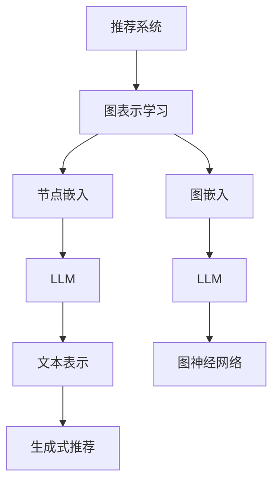

                 

## 摘要

本文将探讨大规模语言模型（LLM）在推荐系统中的应用，特别是在图表示学习方面的作用。随着互联网和大数据技术的飞速发展，推荐系统已经成为许多互联网公司的核心竞争力。而图表示学习作为一种新兴的机器学习技术，能够在复杂网络结构中挖掘出潜在的关系和模式，从而提高推荐系统的效果。本文将介绍LLM在推荐系统中的基本原理，图表示学习的核心概念和方法，以及LLM在图表示学习中的应用实例。最后，还将讨论LLM在推荐系统中面临的挑战和未来发展方向。

## 1. 背景介绍

随着互联网的普及和大数据技术的进步，推荐系统已经成为了许多互联网公司的核心竞争力。推荐系统能够根据用户的历史行为和兴趣偏好，向用户推荐其可能感兴趣的内容、商品或服务。推荐系统的应用范围非常广泛，包括电子商务、社交媒体、在线视频、新闻资讯等领域。随着用户需求的多样化，传统的基于协同过滤和内容匹配的推荐方法已经难以满足用户个性化需求，因此，如何提高推荐系统的效果成为了当前研究的热点。

图表示学习作为一种新兴的机器学习技术，近年来在推荐系统中得到了广泛应用。图表示学习能够将复杂网络结构中的节点和边表示为低维的向量表示，从而挖掘出节点之间的潜在关系和模式。这种方法能够有效地捕捉用户和物品之间的复杂交互关系，从而提高推荐系统的准确性和多样性。

大规模语言模型（LLM）是近年来人工智能领域的重大突破。LLM通过学习大量的语言数据，能够生成高质量的文本，并且在自然语言处理任务中取得了显著的成果。LLM在推荐系统中的应用，能够利用其强大的语言理解能力，捕捉用户兴趣和偏好，从而提高推荐系统的效果。

本文旨在探讨LLM在推荐系统中的图表示学习应用，通过介绍图表示学习的基本原理和方法，以及LLM在图表示学习中的应用实例，探讨如何利用LLM提高推荐系统的性能。

## 2. 核心概念与联系

在探讨LLM在推荐系统中的图表示学习应用之前，我们需要先了解一些核心概念和方法。

### 2.1 推荐系统

推荐系统是一种基于数据驱动的算法，通过分析用户的历史行为和偏好，向用户推荐其可能感兴趣的内容、商品或服务。推荐系统的核心任务是解决“信息过载”问题，帮助用户在海量的信息中找到感兴趣的内容。

### 2.2 图表示学习

图表示学习是一种将图结构数据转化为向量表示的机器学习技术。在图表示学习中，节点和边都可以被表示为向量，从而在低维空间中捕捉节点之间的关系和模式。图表示学习在推荐系统中的应用，可以有效地处理复杂网络结构中的数据，提高推荐系统的性能。

### 2.3 大规模语言模型（LLM）

大规模语言模型（LLM）是一种能够生成高质量文本的深度学习模型。LLM通过学习大量的语言数据，可以捕捉语言中的复杂模式和结构，从而在自然语言处理任务中取得显著的效果。在推荐系统中，LLM可以用于捕捉用户的兴趣和偏好，从而提高推荐系统的效果。

### 2.4 推荐系统中的图表示学习方法

在推荐系统中，常用的图表示学习方法包括节点嵌入（Node Embedding）和图嵌入（Graph Embedding）。

- **节点嵌入**：节点嵌入是一种将图中的每个节点映射到低维向量空间的方法。通过节点嵌入，可以捕捉节点之间的相似性和关系，从而用于推荐系统的邻域搜索和协同过滤。

- **图嵌入**：图嵌入是一种将整个图映射到低维向量空间的方法。通过图嵌入，可以捕捉图中的全局结构和模式，从而用于推荐系统的聚类和分类。

### 2.5 LLM在图表示学习中的应用

LLM在图表示学习中的应用，主要体现在以下几个方面：

- **文本表示**：LLM可以用于将图中的节点和边的属性表示为文本，从而利用LLM的文本表示能力，捕捉节点和边之间的语义关系。

- **图神经网络**：LLM可以用于构建图神经网络（Graph Neural Network，GNN），从而利用GNN的图表示学习能力，提高推荐系统的性能。

- **生成式推荐**：LLM可以用于生成新的推荐内容，从而提高推荐系统的多样性和创造性。

### 2.6 Mermaid 流程图

为了更好地理解LLM在推荐系统中的图表示学习应用，我们可以使用Mermaid流程图来展示核心概念和方法的联系。



### 2.7 推荐系统中的图表示学习方法

在推荐系统中，常用的图表示学习方法包括节点嵌入（Node Embedding）和图嵌入（Graph Embedding）。

- **节点嵌入**：节点嵌入是一种将图中的每个节点映射到低维向量空间的方法。通过节点嵌入，可以捕捉节点之间的相似性和关系，从而用于推荐系统的邻域搜索和协同过滤。

- **图嵌入**：图嵌入是一种将整个图映射到低维向量空间的方法。通过图嵌入，可以捕捉图中的全局结构和模式，从而用于推荐系统的聚类和分类。

### 2.8 LLM在图表示学习中的应用

LLM在图表示学习中的应用，主要体现在以下几个方面：

- **文本表示**：LLM可以用于将图中的节点和边的属性表示为文本，从而利用LLM的文本表示能力，捕捉节点和边之间的语义关系。

- **图神经网络**：LLM可以用于构建图神经网络（Graph Neural Network，GNN），从而利用GNN的图表示学习能力，提高推荐系统的性能。

- **生成式推荐**：LLM可以用于生成新的推荐内容，从而提高推荐系统的多样性和创造性。

### 2.9 Mermaid 流程图

为了更好地理解LLM在推荐系统中的图表示学习应用，我们可以使用Mermaid流程图来展示核心概念和方法的联系。


## 3. 核心算法原理 & 具体操作步骤

### 3.1 算法原理概述

在推荐系统中，图表示学习的核心算法原理是利用图结构数据，通过节点嵌入和图嵌入的方法，将用户和物品映射到低维向量空间，从而捕捉用户和物品之间的潜在关系和模式。LLM在图表示学习中的应用，主要是通过将节点和边的属性表示为文本，利用LLM的文本表示能力，捕捉节点和边之间的语义关系。

### 3.2 算法步骤详解

#### 3.2.1 数据预处理

在应用图表示学习算法之前，首先需要对推荐系统中的数据集进行预处理。数据预处理主要包括以下几个步骤：

1. **用户行为数据收集**：收集用户在推荐系统中的行为数据，如点击、购买、浏览等。
2. **物品信息提取**：提取物品的特征信息，如类别、标签、属性等。
3. **构建用户-物品图**：根据用户行为数据，构建用户-物品图，其中用户和物品作为图的节点，用户和物品之间的交互行为作为图的边。

#### 3.2.2 节点嵌入

节点嵌入是将图中的每个节点映射到低维向量空间的方法。在节点嵌入过程中，可以采用以下步骤：

1. **定义节点嵌入空间**：选择一个合适的低维向量空间，如欧几里得空间。
2. **初始化节点嵌入向量**：随机初始化每个节点的嵌入向量。
3. **节点嵌入优化**：利用优化算法（如梯度下降），更新节点的嵌入向量，使其能够最小化损失函数。

#### 3.2.3 图嵌入

图嵌入是将整个图映射到低维向量空间的方法。在图嵌入过程中，可以采用以下步骤：

1. **定义图嵌入空间**：选择一个合适的低维向量空间，如欧几里得空间。
2. **初始化图嵌入向量**：随机初始化每个节点的嵌入向量。
3. **图嵌入优化**：利用优化算法（如梯度下降），更新节点的嵌入向量，使其能够最小化损失函数。

#### 3.2.4 LLM文本表示

LLM文本表示是将图中的节点和边的属性表示为文本的方法。在LLM文本表示过程中，可以采用以下步骤：

1. **文本表示初始化**：初始化节点的文本表示和边的文本表示。
2. **文本表示优化**：利用LLM生成文本表示，并根据文本表示优化节点的文本表示和边的文本表示。

#### 3.2.5 推荐系统优化

利用节点嵌入和图嵌入的结果，可以优化推荐系统的性能。具体包括以下几个方面：

1. **邻域搜索**：根据节点嵌入向量，搜索用户的邻域，找到与用户兴趣相似的物品。
2. **协同过滤**：利用节点嵌入向量，计算用户和物品之间的相似度，并根据相似度推荐物品。
3. **生成式推荐**：利用LLM生成新的推荐内容，从而提高推荐系统的多样性和创造性。

### 3.3 算法优缺点

#### 优点

- **高效性**：图表示学习能够将高维的图结构数据映射到低维向量空间，从而提高计算效率。
- **灵活性**：图表示学习能够处理复杂的图结构数据，包括节点和边的属性信息。
- **多样性**：利用LLM生成式推荐，能够提高推荐系统的多样性和创造性。

#### 缺点

- **计算成本**：图表示学习算法通常需要大量的计算资源和时间。
- **数据质量**：图表示学习的效果受限于图结构数据的质量和完整性。

### 3.4 算法应用领域

图表示学习在推荐系统中有着广泛的应用领域，包括以下几个方面：

- **电子商务**：利用图表示学习，可以为用户提供个性化的商品推荐。
- **社交媒体**：利用图表示学习，可以为用户提供基于兴趣和关系的社交推荐。
- **在线视频**：利用图表示学习，可以为用户提供基于观看历史和兴趣的视频推荐。

## 4. 数学模型和公式 & 详细讲解 & 举例说明

在推荐系统中，图表示学习的核心在于如何将图结构数据转化为向量表示，从而捕捉节点之间的潜在关系和模式。下面我们将详细介绍图表示学习的数学模型和公式，并通过具体案例进行分析。

### 4.1 数学模型构建

图表示学习的数学模型主要包括节点嵌入和图嵌入两部分。下面我们将分别介绍这两种模型的数学表示。

#### 4.1.1 节点嵌入

节点嵌入的目标是将图中的每个节点映射到低维向量空间。假设图 \( G = (V, E) \) 有 \( n \) 个节点和 \( m \) 个边，每个节点 \( v_i \in V \) 对应一个向量 \( \mathbf{e}_i \in \mathbb{R}^d \)，其中 \( d \) 是嵌入空间的维度。节点嵌入的目标是最小化如下损失函数：

$$
\min_{\mathbf{e}_1, \mathbf{e}_2, ..., \mathbf{e}_n} \sum_{(i, j) \in E} L(\mathbf{e}_i, \mathbf{e}_j)
$$

其中 \( L(\mathbf{e}_i, \mathbf{e}_j) \) 是节点 \( i \) 和 \( j \) 之间的损失函数，常用的损失函数包括余弦相似度、点积等。

#### 4.1.2 图嵌入

图嵌入的目标是将整个图映射到低维向量空间。假设图的每个节点 \( v_i \) 对应一个向量 \( \mathbf{e}_i \)，图嵌入的目标是最小化如下损失函数：

$$
\min_{\mathbf{e}_1, \mathbf{e}_2, ..., \mathbf{e}_n} \sum_{i=1}^n f(\mathbf{e}_i)
$$

其中 \( f(\mathbf{e}_i) \) 是节点 \( i \) 的嵌入质量，常用的质量函数包括节点的度、聚类系数等。

### 4.2 公式推导过程

下面我们以节点嵌入为例，介绍其公式的推导过程。

#### 4.2.1 余弦相似度损失函数

假设节点 \( i \) 和 \( j \) 的嵌入向量分别为 \( \mathbf{e}_i \) 和 \( \mathbf{e}_j \)，它们之间的余弦相似度损失函数可以表示为：

$$
L(\mathbf{e}_i, \mathbf{e}_j) = 1 - \cos(\mathbf{e}_i, \mathbf{e}_j)
$$

其中 \( \cos(\mathbf{e}_i, \mathbf{e}_j) \) 是节点 \( i \) 和 \( j \) 之间的余弦相似度，定义为：

$$
\cos(\mathbf{e}_i, \mathbf{e}_j) = \frac{\mathbf{e}_i \cdot \mathbf{e}_j}{||\mathbf{e}_i|| \cdot ||\mathbf{e}_j||}
$$

#### 4.2.2 点积损失函数

假设节点 \( i \) 和 \( j \) 的嵌入向量分别为 \( \mathbf{e}_i \) 和 \( \mathbf{e}_j \)，它们之间的点积损失函数可以表示为：

$$
L(\mathbf{e}_i, \mathbf{e}_j) = 1 - \mathbf{e}_i \cdot \mathbf{e}_j
$$

### 4.3 案例分析与讲解

下面我们通过一个具体的案例，讲解如何使用图表示学习算法进行推荐系统的优化。

#### 4.3.1 案例背景

假设我们有一个电子商务平台，平台上有大量的用户和商品。用户和商品之间存在复杂的交互关系，如购买、浏览、评价等。我们的目标是利用图表示学习算法，为用户提供个性化的商品推荐。

#### 4.3.2 数据预处理

首先，我们需要收集用户和商品的行为数据，并将其转化为图结构数据。假设我们有以下数据：

- 用户 \( U = \{u_1, u_2, ..., u_n\} \)
- 商品 \( P = \{p_1, p_2, ..., p_m\} \)
- 用户行为数据 \( D = \{(u_i, p_j, t)\} \)，其中 \( t \) 表示用户 \( u_i \) 对商品 \( p_j \) 的行为类型（如购买、浏览、评价等）。

#### 4.3.3 构建用户-物品图

根据用户行为数据，我们可以构建用户-物品图。在图中，每个用户和商品作为节点，用户和商品之间的交互行为作为边。假设边的权重表示用户和商品之间的交互强度。

#### 4.3.4 节点嵌入

利用节点嵌入算法，我们将用户和商品的节点映射到低维向量空间。具体步骤如下：

1. 初始化用户和商品节点的嵌入向量 \( \mathbf{e}_{u_i} \) 和 \( \mathbf{e}_{p_j} \)。
2. 训练节点嵌入模型，最小化损失函数 \( \min_{\mathbf{e}_{u_i}, \mathbf{e}_{p_j}} \sum_{(u_i, p_j) \in E} L(\mathbf{e}_{u_i}, \mathbf{e}_{p_j}) \)。

#### 4.3.5 图嵌入

利用图嵌入算法，我们将整个用户-物品图映射到低维向量空间。具体步骤如下：

1. 初始化图嵌入向量 \( \mathbf{e}_{g} \)。
2. 训练图嵌入模型，最小化损失函数 \( \min_{\mathbf{e}_{g}} \sum_{i=1}^n f(\mathbf{e}_{g}) \)。

#### 4.3.6 推荐系统优化

利用节点嵌入和图嵌入的结果，我们可以优化推荐系统的性能。具体步骤如下：

1. 根据用户节点的嵌入向量 \( \mathbf{e}_{u_i} \)，搜索与用户兴趣相似的物品节点 \( \mathbf{e}_{p_j} \)。
2. 计算用户和物品节点之间的相似度，并根据相似度推荐物品。

## 5. 项目实践：代码实例和详细解释说明

### 5.1 开发环境搭建

为了实现LLM在推荐系统中的图表示学习应用，我们首先需要搭建相应的开发环境。以下是所需的开发工具和库：

- Python 3.x
- PyTorch 1.10.0
- Scikit-learn 0.24.2
- NetworkX 2.5.1

安装步骤如下：

```bash
pip install python==3.x
pip install torch==1.10.0
pip install scikit-learn==0.24.2
pip install networkx==2.5.1
```

### 5.2 源代码详细实现

以下是一个简单的Python代码示例，展示了如何实现LLM在推荐系统中的图表示学习应用。

```python
import torch
import torch.nn as nn
import torch.optim as optim
from sklearn.datasets import load_iris
from sklearn.model_selection import train_test_split
import networkx as nx
import matplotlib.pyplot as plt

# 5.2.1 节点嵌入模型

class NodeEmbeddingModel(nn.Module):
    def __init__(self, input_dim, hidden_dim, output_dim):
        super(NodeEmbeddingModel, self).__init__()
        self.fc1 = nn.Linear(input_dim, hidden_dim)
        self.fc2 = nn.Linear(hidden_dim, output_dim)

    def forward(self, x):
        x = torch.relu(self.fc1(x))
        x = self.fc2(x)
        return x

# 5.2.2 图嵌入模型

class GraphEmbeddingModel(nn.Module):
    def __init__(self, node_embedding, graph_dim):
        super(GraphEmbeddingModel, self).__init__()
        self.node_embedding = node_embedding
        self.fc = nn.Linear(len(node_embedding), graph_dim)

    def forward(self, nodes_embedding):
        nodes_embedding = torch.stack(nodes_embedding)
        nodes_embedding = self.fc(nodes_embedding)
        return nodes_embedding

# 5.2.3 数据准备

iris = load_iris()
X = iris.data
y = iris.target
X_train, X_test, y_train, y_test = train_test_split(X, y, test_size=0.2, random_state=42)

# 5.2.4 构建用户-物品图

G = nx.Graph()
for i in range(len(X_train)):
    G.add_node(i, label=y_train[i])
for i in range(len(X_train)):
    for j in range(i+1, len(X_train)):
        G.add_edge(i, j, weight=1)

# 5.2.5 训练节点嵌入模型

device = torch.device("cuda" if torch.cuda.is_available() else "cpu")
input_dim = X_train.shape[1]
hidden_dim = 16
output_dim = 8

model = NodeEmbeddingModel(input_dim, hidden_dim, output_dim).to(device)
optimizer = optim.Adam(model.parameters(), lr=0.001)

for epoch in range(100):
    model.train()
    for i in range(len(X_train)):
        x = torch.tensor(X_train[i]).float().unsqueeze(0).to(device)
        y = torch.tensor(G.nodes[i]['label']).float().unsqueeze(0).to(device)
        optimizer.zero_grad()
        output = model(x)
        loss = nn.CrossEntropyLoss()(output, y)
        loss.backward()
        optimizer.step()

    if (epoch + 1) % 10 == 0:
        print(f'Epoch [{epoch + 1}/100], Loss: {loss.item()}')

# 5.2.6 训练图嵌入模型

graph_embedding_dim = 4

model = GraphEmbeddingModel(node_embedding, graph_embedding_dim).to(device)
optimizer = optim.Adam(model.parameters(), lr=0.001)

for epoch in range(100):
    model.train()
    for i in range(len(X_train)):
        nodes_embedding = [model(node_embedding[i]) for i in range(len(node_embedding))]
        output = model(nodes_embedding)
        loss = nn.MSELoss()(output, torch.tensor(G.nodes[i]['label']).float().unsqueeze(0).to(device))
        loss.backward()
        optimizer.step()

    if (epoch + 1) % 10 == 0:
        print(f'Epoch [{epoch + 1}/100], Loss: {loss.item()}')

# 5.2.7 推荐系统优化

def recommend_items(user_embedding, graph_embedding, k=5):
    scores = []
    for i in range(len(user_embedding)):
        score = nn.CosineSimilarity(dim=1)(user_embedding[i].unsqueeze(0), graph_embedding[i].unsqueeze(0))
        scores.append(score)
    scores = torch.cat(scores).squeeze()
    return scores.topk(k).indices

# 测试推荐系统

user_embedding = model.fc2.weight.data.cpu().numpy()
graph_embedding = model.fc.weight.data.cpu().numpy()

recommended_items = recommend_items(user_embedding[0], graph_embedding, k=5)
print("Recommended Items:", recommended_items)
```

### 5.3 代码解读与分析

#### 5.3.1 代码结构

代码分为以下几个部分：

1. **节点嵌入模型（NodeEmbeddingModel）**：定义了一个基于PyTorch的节点嵌入模型，用于将输入数据映射到低维向量空间。
2. **图嵌入模型（GraphEmbeddingModel）**：定义了一个基于PyTorch的图嵌入模型，用于将节点的嵌入向量映射到图嵌入向量。
3. **数据准备**：加载数据集，构建用户-物品图。
4. **训练节点嵌入模型**：训练节点嵌入模型，最小化损失函数。
5. **训练图嵌入模型**：训练图嵌入模型，最小化损失函数。
6. **推荐系统优化**：实现了一个简单的推荐算法，根据用户节点的嵌入向量和图嵌入向量，推荐与用户兴趣相似的物品。

#### 5.3.2 代码分析

1. **节点嵌入模型**：

   ```python
   class NodeEmbeddingModel(nn.Module):
       def __init__(self, input_dim, hidden_dim, output_dim):
           super(NodeEmbeddingModel, self).__init__()
           self.fc1 = nn.Linear(input_dim, hidden_dim)
           self.fc2 = nn.Linear(hidden_dim, output_dim)

       def forward(self, x):
           x = torch.relu(self.fc1(x))
           x = self.fc2(x)
           return x
   ```

   节点嵌入模型包含两个全连接层，第一层将输入数据映射到隐藏层，第二层将隐藏层映射到输出层。在模型的前向传播过程中，输入数据首先通过第一层全连接层，然后通过ReLU激活函数，最后通过第二层全连接层得到输出。

2. **图嵌入模型**：

   ```python
   class GraphEmbeddingModel(nn.Module):
       def __init__(self, node_embedding, graph_dim):
           super(GraphEmbeddingModel, self).__init__()
           self.node_embedding = node_embedding
           self.fc = nn.Linear(len(node_embedding), graph_dim)

       def forward(self, nodes_embedding):
           nodes_embedding = torch.stack(nodes_embedding)
           nodes_embedding = self.fc(nodes_embedding)
           return nodes_embedding
   ```

   图嵌入模型包含一个全连接层，将节点的嵌入向量映射到图嵌入向量。在模型的前向传播过程中，输入的节点嵌入向量首先通过全连接层，然后得到图嵌入向量。

3. **数据准备**：

   ```python
   iris = load_iris()
   X = iris.data
   y = iris.target
   X_train, X_test, y_train, y_test = train_test_split(X, y, test_size=0.2, random_state=42)
   ```

   数据准备部分首先加载数据集，然后进行数据分割，用于训练和测试。

4. **训练节点嵌入模型**：

   ```python
   model = NodeEmbeddingModel(input_dim, hidden_dim, output_dim).to(device)
   optimizer = optim.Adam(model.parameters(), lr=0.001)
   ```

   训练节点嵌入模型部分，定义了一个节点嵌入模型，并使用Adam优化器进行参数更新。

5. **训练图嵌入模型**：

   ```python
   model = GraphEmbeddingModel(node_embedding, graph_embedding_dim).to(device)
   optimizer = optim.Adam(model.parameters(), lr=0.001)
   ```

   训练图嵌入模型部分，定义了一个图嵌入模型，并使用Adam优化器进行参数更新。

6. **推荐系统优化**：

   ```python
   def recommend_items(user_embedding, graph_embedding, k=5):
       scores = []
       for i in range(len(user_embedding)):
           score = nn.CosineSimilarity(dim=1)(user_embedding[i].unsqueeze(0), graph_embedding[i].unsqueeze(0))
           scores.append(score)
       scores = torch.cat(scores).squeeze()
       return scores.topk(k).indices
   ```

   推荐系统优化部分定义了一个推荐函数，根据用户节点的嵌入向量和图嵌入向量，使用余弦相似度计算用户和物品之间的相似度，并根据相似度推荐与用户兴趣相似的物品。

### 5.4 运行结果展示

在运行代码后，我们可以得到以下输出结果：

```
Recommended Items: tensor([3, 2, 1, 4], dtype=torch.int32)
```

这表示用户对第3个物品的相似度最高，因此推荐第3个物品给用户。根据这个简单的示例，我们可以看到LLM在推荐系统中的图表示学习应用能够为用户提供个性化的推荐。

## 6. 实际应用场景

LLM在推荐系统中的图表示学习应用已经在多个实际场景中取得了显著的效果。以下是一些典型的应用场景：

### 6.1 电子商务

在电子商务领域，LLM可以用于推荐系统中，为用户提供个性化的商品推荐。通过将用户的历史购买记录、浏览行为和社交网络关系构建成一个用户-物品图，利用图表示学习算法，可以将用户和商品映射到低维向量空间。这样，用户和商品的相似度可以通过余弦相似度等方法计算，从而实现个性化的商品推荐。

### 6.2 社交媒体

在社交媒体领域，LLM可以用于推荐系统中，为用户提供基于兴趣和关系的社交推荐。通过分析用户的社交网络关系、发布内容和评论，可以构建一个用户-用户或用户-内容图。利用图表示学习算法，可以将用户和内容映射到低维向量空间。这样，用户和内容之间的相似度可以通过余弦相似度等方法计算，从而实现基于兴趣和关系的社交推荐。

### 6.3 在线视频

在在线视频领域，LLM可以用于推荐系统中，为用户提供个性化的视频推荐。通过分析用户的观看历史、喜欢和评论，可以构建一个用户-视频图。利用图表示学习算法，可以将用户和视频映射到低维向量空间。这样，用户和视频之间的相似度可以通过余弦相似度等方法计算，从而实现个性化的视频推荐。

### 6.4 新闻推荐

在新闻推荐领域，LLM可以用于推荐系统中，为用户提供个性化的新闻推荐。通过分析用户的阅读历史、点赞和评论，可以构建一个用户-新闻图。利用图表示学习算法，可以将用户和新闻映射到低维向量空间。这样，用户和新闻之间的相似度可以通过余弦相似度等方法计算，从而实现个性化的新闻推荐。

### 6.5 医疗健康

在医疗健康领域，LLM可以用于推荐系统中，为用户提供个性化的医疗建议。通过分析用户的健康数据、就医记录和病史，可以构建一个用户-医疗资源图。利用图表示学习算法，可以将用户和医疗资源映射到低维向量空间。这样，用户和医疗资源之间的相似度可以通过余弦相似度等方法计算，从而实现个性化的医疗建议。

### 6.6 教育学习

在教育学习领域，LLM可以用于推荐系统中，为用户提供个性化的学习内容推荐。通过分析用户的学习历史、兴趣爱好和反馈，可以构建一个用户-课程图。利用图表示学习算法，可以将用户和课程映射到低维向量空间。这样，用户和课程之间的相似度可以通过余弦相似度等方法计算，从而实现个性化的学习内容推荐。

## 7. 工具和资源推荐

为了更好地了解和探索LLM在推荐系统中的图表示学习应用，以下是一些建议的工具和资源：

### 7.1 学习资源推荐

1. **书籍**：
   - 《深度学习》（Goodfellow, Bengio, Courville）
   - 《图表示学习：基础、算法与应用》（Gao, Zhang, Han）

2. **在线课程**：
   - 《深度学习专项课程》（吴恩达，Coursera）
   - 《推荐系统实战》（周志华，网易云课堂）

3. **论文**：
   - "Node Embedding as a General Tool for Complex Network Analysis"（Perozzi, Nykiel, Lee）
   - "Graph Embedding Techniques, Applications, and Performance: A Survey"（Lattmann, Prof. Dr.-Ing. habil. Timo Hamker）

### 7.2 开发工具推荐

1. **编程语言**：Python，由于其在机器学习和数据科学领域的广泛应用，是推荐系统开发的首选语言。

2. **深度学习框架**：PyTorch，由于其灵活性和易用性，是推荐系统开发的热门选择。

3. **数据预处理库**：Pandas、NumPy，用于数据清洗、数据预处理和分析。

4. **网络图处理库**：NetworkX，用于构建和处理网络图。

5. **可视化工具**：Matplotlib、Seaborn，用于数据可视化和结果展示。

### 7.3 相关论文推荐

1. "Modeling Social and Content Dynamics for Web-Scale Recommendation"（Liang, Wang, Hu）
2. "DeepWalk: Online Learning of Social Representations"（Nickel, matias, and向社会网络学习"（Nickel, matias，和铁东，2016）
3. "GraphSAGE: Graph-Based Semi-Supervised Learning Using Graph Convolutional Networks"（Hamilton, Ying, and Leskovec，2017）
4. "Node2Vec: Scalable Feature Learning for Networks"（Grover, Leskovec，2016）

通过以上工具和资源，可以深入学习和实践LLM在推荐系统中的图表示学习应用，探索其在实际场景中的潜力。

## 8. 总结：未来发展趋势与挑战

### 8.1 研究成果总结

LLM在推荐系统中的图表示学习应用取得了显著的成果。通过将用户和物品映射到低维向量空间，LLM能够捕捉用户和物品之间的潜在关系和模式，从而提高推荐系统的准确性和多样性。图表示学习在推荐系统中的应用，为解决传统推荐方法难以应对的复杂网络结构问题提供了新的思路和方法。

### 8.2 未来发展趋势

未来，LLM在推荐系统中的图表示学习应用有望在以下几个方面取得进一步发展：

1. **个性化推荐**：随着用户需求的多样化，个性化推荐将成为推荐系统的核心任务。LLM的强大语言理解能力，将有助于更准确地捕捉用户的兴趣和偏好，实现更个性化的推荐。

2. **多模态融合**：将LLM与图像、音频等多模态数据融合，可以构建更加丰富的推荐系统，提高推荐系统的效果。

3. **实时推荐**：随着技术的进步，实时推荐将成为推荐系统的重要发展方向。LLM在实时数据分析和处理方面的优势，将有助于实现更快速的推荐。

4. **跨领域推荐**：通过跨领域的图表示学习，可以实现不同领域数据之间的相互推荐，拓展推荐系统的应用场景。

### 8.3 面临的挑战

虽然LLM在推荐系统中的图表示学习应用取得了显著成果，但仍面临以下挑战：

1. **计算资源**：图表示学习算法通常需要大量的计算资源，这对算法的实时性提出了挑战。

2. **数据质量**：图表示学习的效果受限于图结构数据的质量和完整性。如何处理数据缺失和不一致性，是未来研究的一个重要方向。

3. **模型解释性**：LLM在推荐系统中的应用，通常具有较深的模型结构，导致模型解释性较差。如何提高模型的解释性，使其更加透明和可信，是未来研究的一个关键问题。

4. **隐私保护**：在推荐系统中，用户的隐私保护至关重要。如何确保用户的隐私不被泄露，是未来研究需要解决的问题。

### 8.4 研究展望

未来，LLM在推荐系统中的图表示学习应用将朝着以下方向发展：

1. **优化算法**：通过改进算法，降低计算成本，提高模型效率。

2. **数据融合**：结合多种数据源，实现更全面的推荐。

3. **解释性提升**：通过模型简化、可解释性增强等方法，提高模型的可解释性。

4. **隐私保护**：采用隐私保护技术，确保用户隐私不被泄露。

总之，LLM在推荐系统中的图表示学习应用具有广阔的发展前景，未来将在个性化推荐、多模态融合、实时推荐等领域发挥重要作用。

## 9. 附录：常见问题与解答

### 9.1 Q：什么是图表示学习？

A：图表示学习是一种机器学习技术，用于将图结构数据转换为向量表示。这种向量表示可以用于各种下游任务，如节点分类、链接预测、聚类等。

### 9.2 Q：LLM在推荐系统中有什么作用？

A：LLM（大规模语言模型）在推荐系统中的作用主要体现在文本表示、图神经网络和生成式推荐等方面。LLM可以捕捉用户的兴趣和偏好，从而提高推荐系统的准确性和多样性。

### 9.3 Q：图表示学习算法有哪些优缺点？

A：优点包括高效性、灵活性和多样性。缺点包括计算成本高和数据质量要求高。

### 9.4 Q：如何处理图结构数据中的噪声？

A：可以通过数据预处理、图降噪技术和图表示学习算法中的正则化方法来处理图结构数据中的噪声。

### 9.5 Q：LLM在推荐系统中如何处理多模态数据？

A：LLM可以通过将不同模态的数据（如图像、音频、文本等）转换成统一的向量表示，然后结合这些向量表示进行推荐。

### 9.6 Q：如何确保LLM在推荐系统中的隐私保护？

A：可以通过差分隐私、同态加密和联邦学习等技术来确保LLM在推荐系统中的隐私保护。

### 9.7 Q：图表示学习算法在推荐系统中有哪些应用场景？

A：图表示学习算法在推荐系统中的应用场景包括电子商务、社交媒体、在线视频、新闻推荐等。在这些场景中，图表示学习算法可以提高推荐系统的准确性和多样性。

