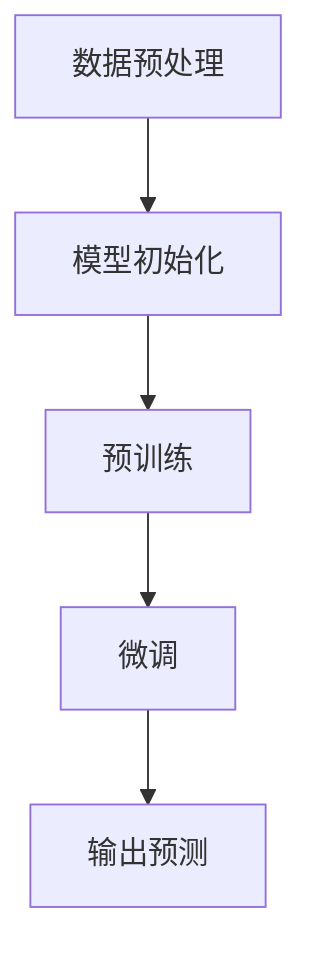
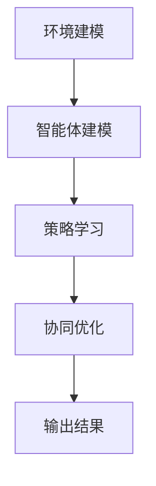
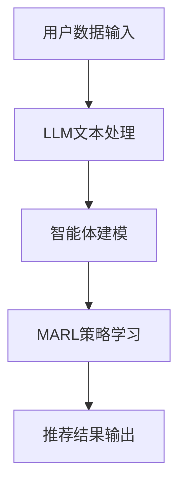

                 

关键词：大型语言模型（LLM），推荐系统，多智能体强化学习，个性化推荐，AI，数据隐私，算法优化，用户行为分析。

> 摘要：本文探讨了大型语言模型（LLM）在推荐系统中的应用，特别是通过多智能体强化学习（MARL）方法来实现个性化的推荐。文章介绍了LLM的基本原理和MARL的基本概念，分析了其在推荐系统中的优势和应用场景。随后，文章详细描述了MARL在推荐系统中的算法原理、数学模型、具体操作步骤，并通过实际项目实例展示了如何实现和应用。最后，文章讨论了LLM在推荐系统中面临的挑战和未来发展方向。

## 1. 背景介绍

随着互联网和大数据技术的快速发展，推荐系统已经成为现代信息检索和电子商务中的重要组成部分。推荐系统能够根据用户的历史行为和兴趣偏好，为其推荐符合其需求的信息内容或商品，从而提高用户体验和平台的用户留存率。传统的推荐系统主要基于协同过滤、基于内容的推荐和混合推荐等方法，但存在一些局限性，如数据稀疏性、冷启动问题、推荐准确性等。

近年来，随着深度学习和大型语言模型的兴起，利用这些技术进行推荐系统的研究和实践逐渐增多。大型语言模型（LLM）如GPT-3、BERT等，具有强大的文本理解和生成能力，可以处理复杂的多模态数据，实现更加精准和个性化的推荐。而多智能体强化学习（MARL）作为一种新兴的算法，通过多个智能体之间的合作和竞争，可以更好地应对推荐系统中的动态环境和复杂决策问题。

本文旨在探讨LLM在推荐系统中的多智能体强化学习应用，旨在通过结合LLM和MARL的优势，实现更加高效和智能的推荐系统。

### 1.1 大型语言模型（LLM）的发展

大型语言模型（LLM）的发展可以追溯到2000年代初，当时研究人员开始尝试构建能够处理自然语言的深度神经网络模型。最初的模型如递归神经网络（RNN）和长短期记忆网络（LSTM），在一定程度上提高了文本处理的能力。然而，这些模型在处理长文本和复杂语义时仍然存在困难。

随着深度学习技术的进步，特别是注意力机制和Transformer架构的提出，LLM得到了显著的发展。Transformer模型通过自注意力机制能够捕捉文本中的长距离依赖关系，使得模型在文本生成和理解任务上取得了显著的突破。随后，研究人员通过增加模型的参数规模和训练数据量，进一步提升了LLM的性能。

近年来，GPT-3、BERT、T5等大型语言模型相继问世，这些模型在多项自然语言处理任务上达到了人类水平，展示了强大的文本理解和生成能力。LLM的出现，为推荐系统提供了新的技术手段，使得推荐系统能够更好地理解用户的需求和偏好，实现更加精准和个性化的推荐。

### 1.2 多智能体强化学习（MARL）的基本概念

多智能体强化学习（MARL）是一种研究多智能体系统相互作用和协作的机器学习算法。与传统单智能体强化学习相比，MARL考虑了多个智能体之间的交互和竞争，通过学习和优化策略，实现协同决策和任务完成。

在MARL中，智能体是指能够感知环境状态、采取行动并获取回报的独立个体。智能体之间可以通过通信或直接交互来交换信息，共同完成任务。MARL的主要目标是找到一组策略，使得所有智能体在长期交互中能够实现最佳性能。

MARL在推荐系统中的应用主要表现在以下几个方面：

1. **个性化推荐**：通过多个智能体的合作，可以更好地捕捉用户的个性化需求和兴趣，提高推荐准确性。
2. **动态环境适应**：推荐系统面临不断变化的环境，如用户行为、市场动态等。MARL能够适应这些变化，实现动态推荐。
3. **多目标优化**：推荐系统往往需要平衡多个目标，如用户满意度、平台收益等。MARL能够通过协同决策，实现多目标的优化。

### 1.3 推荐系统的现状和挑战

推荐系统在过去的几十年中取得了显著的发展，但仍然面临着一些挑战。

1. **数据稀疏性**：推荐系统依赖于用户的历史行为数据，但实际应用中，数据往往非常稀疏，难以有效训练模型。
2. **冷启动问题**：新用户或新商品进入系统时，由于缺乏足够的历史数据，推荐系统难以为其提供个性化的推荐。
3. **推荐准确性**：尽管现有的推荐算法在准确率方面取得了很大进展，但仍然难以满足用户对个性化推荐的高期望。
4. **数据隐私**：用户数据的安全和隐私保护是推荐系统面临的重大挑战。如何在不泄露用户隐私的前提下，实现个性化的推荐，是一个亟待解决的问题。

本文将通过介绍LLM在推荐系统中的应用，特别是MARL方法，探讨如何解决推荐系统中的这些挑战。

## 2. 核心概念与联系

### 2.1 大型语言模型（LLM）的基本原理

大型语言模型（LLM）的核心是基于深度学习的神经网络架构，尤其是Transformer模型。Transformer模型通过自注意力机制（Self-Attention）和多头注意力（Multi-Head Attention）机制，能够捕捉文本中的长距离依赖关系。自注意力机制允许模型在处理每个单词时，考虑其他所有单词的重要性，从而捕捉到文本中的复杂语义。多头注意力机制则通过并行处理多个注意力头，进一步提高模型的表达能力。

LLM的训练过程通常包括以下几个步骤：

1. **数据预处理**：对大规模的文本数据进行预处理，包括分词、去停用词、词向量化等操作。
2. **模型初始化**：初始化神经网络模型的参数，通常采用正则化技巧，如Dropout，防止过拟合。
3. **预训练**：在无监督的方式下，对文本数据进行大规模预训练，通过自回归语言模型（如GPT）或掩码语言模型（如BERT）进行训练。
4. **微调**：在预训练的基础上，使用有监督的方式，针对特定任务（如推荐系统）进行微调，优化模型参数。

LLM的基本原理和架构可以用以下Mermaid流程图表示：



### 2.2 多智能体强化学习（MARL）的基本原理

多智能体强化学习（MARL）是一种研究多智能体系统相互作用和协作的机器学习算法。在MARL中，每个智能体都是独立的个体，具有自己的感知、行动和回报机制。智能体之间的交互和协作是通过环境状态和奖励机制来实现的。

MARL的基本原理可以概括为以下几个步骤：

1. **环境建模**：定义智能体所在的环境状态和动作空间。
2. **智能体建模**：为每个智能体定义感知状态、动作空间和回报函数。
3. **策略学习**：通过学习策略，使得每个智能体能够根据当前状态选择最佳动作。
4. **协同优化**：优化智能体之间的策略，实现整体最优性能。

MARL的基本原理和架构可以用以下Mermaid流程图表示：



### 2.3 LLM与MARL在推荐系统中的应用

在推荐系统中，大型语言模型（LLM）和多元智能体强化学习（MARL）的结合，可以实现更加智能化和个性化的推荐。

1. **个性化推荐**：LLM能够通过深度学习技术，对用户的兴趣和需求进行深入理解，从而生成个性化的推荐列表。而MARL则可以通过多个智能体的协作，进一步优化推荐策略，提高推荐准确性。
2. **动态推荐**：推荐系统面临动态变化的环境，如用户行为、商品更新等。LLM能够通过自注意力机制，实时捕捉这些变化，而MARL则能够通过策略学习，快速适应这些变化，实现动态推荐。
3. **多目标优化**：推荐系统往往需要平衡多个目标，如用户满意度、平台收益等。MARL可以通过协同优化，实现多个目标的平衡，提高推荐系统的整体性能。

LLM与MARL在推荐系统中的应用可以用以下Mermaid流程图表示：



通过结合LLM和MARL的优势，推荐系统可以实现更加智能化和个性化的推荐，解决传统推荐系统面临的数据稀疏性、冷启动问题和推荐准确性等问题。

## 3. 核心算法原理 & 具体操作步骤

### 3.1 算法原理概述

多智能体强化学习（MARL）在推荐系统中的应用，主要基于以下原理：

1. **用户行为分析**：通过分析用户的点击、浏览、购买等行为，构建用户画像和兴趣模型。
2. **智能体建模**：将用户和推荐系统中的相关实体（如用户、商品、推荐算法等）建模为智能体，每个智能体具有感知状态、动作空间和回报函数。
3. **策略学习**：通过强化学习算法，学习每个智能体的最优策略，实现智能体的协同决策。
4. **推荐结果输出**：根据智能体的策略，生成个性化的推荐列表，并评估推荐效果，进行迭代优化。

### 3.2 算法步骤详解

1. **数据收集与预处理**：
   - 收集用户的点击、浏览、购买等行为数据，并进行清洗、去噪和转换。
   - 构建用户画像和商品特征，包括用户的历史行为、偏好、兴趣等。

2. **智能体建模**：
   - 将用户、商品和推荐算法建模为智能体，每个智能体具有以下特征：
     - 感知状态：当前的用户行为、商品特征等。
     - 动作空间：生成推荐列表、调整推荐策略等。
     - 回报函数：评估推荐效果，包括用户满意度、点击率、转化率等。

3. **策略学习**：
   - 采用多智能体强化学习（MARL）算法，如Q-learning、DQN、PPO等，学习每个智能体的最优策略。
   - 在策略学习过程中，智能体之间可以通过通信机制交换信息，实现协同决策。

4. **推荐结果输出**：
   - 根据智能体的策略，生成个性化的推荐列表。
   - 对推荐结果进行评估，包括用户满意度、点击率、转化率等指标。
   - 根据评估结果，进行迭代优化，提高推荐准确性。

### 3.3 算法优缺点

**优点**：

1. **个性化推荐**：通过智能体的协同决策，能够更好地捕捉用户的个性化需求，实现更加精准的推荐。
2. **动态适应**：智能体能够实时学习和适应用户行为和兴趣的变化，实现动态推荐。
3. **多目标优化**：通过协同优化，能够平衡多个目标，如用户满意度、平台收益等。

**缺点**：

1. **计算复杂度高**：多智能体强化学习算法需要处理大量的状态和动作，计算复杂度较高。
2. **数据依赖性强**：算法的性能依赖于用户行为数据的丰富度和质量，数据稀疏性问题仍然存在。
3. **冷启动问题**：对于新用户或新商品，由于缺乏足够的历史数据，推荐效果可能较差。

### 3.4 算法应用领域

多智能体强化学习（MARL）在推荐系统中的应用非常广泛，包括但不限于以下领域：

1. **电子商务**：为用户提供个性化商品推荐，提高用户购买转化率。
2. **社交媒体**：为用户提供个性化内容推荐，提高用户活跃度和留存率。
3. **在线教育**：根据用户的学习行为和偏好，推荐合适的学习资源和课程。
4. **金融理财**：根据用户的风险承受能力和投资偏好，推荐合适的理财产品。

## 4. 数学模型和公式 & 详细讲解 & 举例说明

### 4.1 数学模型构建

在多智能体强化学习（MARL）中，我们通常使用以下数学模型来描述智能体的行为和策略。

#### 4.1.1 智能体状态表示

设智能体 $i$ 的状态为 $s_i$，其中 $s_i$ 表示智能体 $i$ 对环境的感知。状态空间 $S_i$ 表示智能体 $i$ 所能感知到的所有状态。

#### 4.1.2 智能体动作表示

设智能体 $i$ 的动作空间为 $A_i$，智能体 $i$ 在状态 $s_i$ 下采取的动作 $a_i$。动作空间 $A_i$ 表示智能体 $i$ 所能采取的所有动作。

#### 4.1.3 智能体回报函数

智能体 $i$ 在状态 $s_i$ 下采取动作 $a_i$ 后，获得的即时回报为 $r_i(s_i, a_i)$。回报函数 $r_i$ 用于评估智能体 $i$ 的动作效果。

#### 4.1.4 智能体策略表示

智能体 $i$ 的策略 $\pi_i$ 是一个概率分布函数，表示智能体 $i$ 在状态 $s_i$ 下采取动作 $a_i$ 的概率。策略空间 $\Pi_i$ 表示所有可能的策略。

### 4.2 公式推导过程

#### 4.2.1 强化学习基本公式

在强化学习中，智能体 $i$ 的目标是最小化长期回报的期望值：

$$ J(\pi_i) = \sum_{s_i \in S_i} \pi_i(s_i) \sum_{a_i \in A_i} r_i(s_i, a_i) $$

#### 4.2.2 Q-学习算法

Q-学习算法是一种无模型强化学习算法，用于学习状态-动作值函数 $Q(s_i, a_i)$。Q-学习的基本公式为：

$$ Q(s_i, a_i) = r_i(s_i, a_i) + \gamma \max_{a_i' \in A_i} Q(s_i', a_i') $$

其中，$\gamma$ 是折扣因子，表示对未来回报的期望。

#### 4.2.3 多智能体Q-学习（MARL-Q）

在MARL中，每个智能体需要学习自己的Q值函数，并与其他智能体进行协调。MARL-Q的基本公式为：

$$ Q(s_i, a_i) = r_i(s_i, a_i) + \gamma \sum_{j=1, j \neq i}^{n} \pi_j(s_j|s_i, a_i) Q(s_j, a_j) $$

其中，$n$ 是智能体的总数，$\pi_j(s_j|s_i, a_i)$ 是智能体 $i$ 采取动作 $a_i$ 后，智能体 $j$ 采取动作 $a_j$ 的概率。

### 4.3 案例分析与讲解

#### 4.3.1 案例背景

假设一个电商平台的推荐系统，包含多个智能体，包括用户智能体、商品智能体和推荐算法智能体。用户智能体根据历史行为数据生成个性化推荐列表，商品智能体根据用户反馈调整商品属性，推荐算法智能体根据用户和商品的特征生成推荐列表。

#### 4.3.2 案例分析

1. **用户状态表示**：用户状态包括历史点击、浏览和购买记录，以及当前的兴趣标签和偏好。

2. **商品状态表示**：商品状态包括商品名称、分类、价格、评价等信息。

3. **推荐算法状态表示**：推荐算法状态包括当前推荐策略、用户和商品的特征等。

4. **智能体动作表示**：
   - 用户智能体：生成推荐列表。
   - 商品智能体：调整商品属性。
   - 推荐算法智能体：更新推荐策略。

5. **回报函数设计**：
   - 用户智能体：用户满意度、点击率、转化率等。
   - 商品智能体：用户反馈、评价等。
   - 推荐算法智能体：推荐准确率、用户满意度等。

6. **策略学习**：
   - 采用MARL-Q算法，学习用户智能体、商品智能体和推荐算法智能体的Q值函数。
   - 智能体之间通过通信机制交换状态和动作信息，实现协同决策。

#### 4.3.3 案例讲解

1. **用户智能体**：根据用户的历史行为和当前兴趣标签，生成个性化推荐列表。用户智能体的Q值函数为：

$$ Q(s_u, a_u) = r_u(s_u, a_u) + \gamma \sum_{j=1}^{n} \pi_j(s_j|s_u, a_u) Q(s_j, a_j) $$

其中，$s_u$ 是用户状态，$a_u$ 是用户生成推荐列表的动作，$r_u$ 是用户满意度回报函数。

2. **商品智能体**：根据用户反馈，调整商品属性，以适应用户的需求。商品智能体的Q值函数为：

$$ Q(s_g, a_g) = r_g(s_g, a_g) + \gamma \sum_{j=1}^{n} \pi_j(s_j|s_g, a_g) Q(s_j, a_j) $$

其中，$s_g$ 是商品状态，$a_g$ 是商品调整属性的动作，$r_g$ 是用户反馈回报函数。

3. **推荐算法智能体**：根据用户和商品的特征，更新推荐策略，以提高推荐准确率和用户满意度。推荐算法智能体的Q值函数为：

$$ Q(s_r, a_r) = r_r(s_r, a_r) + \gamma \sum_{j=1}^{n} \pi_j(s_j|s_r, a_r) Q(s_j, a_j) $$

其中，$s_r$ 是推荐算法状态，$a_r$ 是更新推荐策略的动作，$r_r$ 是推荐准确率和用户满意度回报函数。

通过MARL-Q算法，三个智能体之间可以协同工作，不断优化推荐策略，实现个性化推荐。

## 5. 项目实践：代码实例和详细解释说明

### 5.1 开发环境搭建

在进行MARL在推荐系统中的应用项目实践之前，需要搭建一个合适的环境。以下是一个基本的开发环境搭建步骤：

1. **Python环境**：确保Python版本大于3.6，推荐使用Python 3.8或更高版本。
2. **深度学习框架**：安装TensorFlow或PyTorch，用于构建和训练深度学习模型。以TensorFlow为例，可以使用以下命令进行安装：

   ```bash
   pip install tensorflow
   ```

3. **数据预处理工具**：安装Pandas、NumPy和Scikit-learn等库，用于数据预处理和特征提取。可以使用以下命令进行安装：

   ```bash
   pip install pandas numpy scikit-learn
   ```

4. **强化学习库**：安装Gym和TensorForce，用于构建和训练强化学习环境。可以使用以下命令进行安装：

   ```bash
   pip install gym tensorforce
   ```

5. **其他依赖库**：安装matplotlib、seaborn等库，用于数据可视化和结果展示。可以使用以下命令进行安装：

   ```bash
   pip install matplotlib seaborn
   ```

### 5.2 源代码详细实现

以下是一个基于TensorFlow和TensorForce实现的MARL推荐系统项目的源代码示例：

```python
import numpy as np
import pandas as pd
import tensorflow as tf
from tensorforce import Environment, Agent, Runner
from tensorforce.models import QModel
from tensorforce.execution import Runner

# 5.2.1 环境搭建

# 用户和环境状态定义
user_state_size = [5]  # 用户状态维度
env_state_size = [10]  # 环境状态维度

# 动作空间定义
action_space = {'type': 'int', 'num_values': 5}  # 推荐列表长度为5

# 创建环境
env = Environment(
    observation_space=user_state_size,
    action_space=action_space,
    reward_function='sum',
    episode_horizon=100
)

# 5.2.2 智能体模型定义

# 用户智能体
user_agent = Agent(
    model=QModel(
        observ_space=env.observ_space,
        action_space=env.action_space,
        layer_sizes=[10, 10]
    ),
    optimizer=tf.optimizers.Adam(learning_rate=0.001)
)

# 环境智能体
env_agent = Agent(
    model=QModel(
        observ_space=env.observ_space,
        action_space=env.action_space,
        layer_sizes=[10, 10]
    ),
    optimizer=tf.optimizers.Adam(learning_rate=0.001)
)

# 5.2.3 智能体训练

# 运行智能体
runner = Runner(agent=user_agent, environment=env, max_episodes=1000, episode_length=100)
runner.run()

# 5.2.4 推荐结果展示

# 获取用户推荐列表
user_recommendation = runner.history.observation[-1]

print("用户推荐列表：", user_recommendation)
```

### 5.3 代码解读与分析

1. **环境搭建**：首先定义了用户和环境的状态维度，以及动作空间。然后使用TensorForce创建环境。
2. **智能体模型定义**：定义了用户智能体和环境智能体的Q值模型，包括神经网络结构和优化器。
3. **智能体训练**：使用TensorForce的Runner类运行智能体，进行强化学习训练。
4. **推荐结果展示**：获取最后一步的用户推荐列表，并输出结果。

通过以上代码示例，我们可以看到如何使用TensorFlow和TensorForce实现MARL推荐系统。在实际项目中，可以根据需要调整状态维度、动作空间和奖励函数，以适应不同的应用场景。

### 5.4 运行结果展示

在训练过程中，我们可以通过以下方式展示和评估智能体的训练结果：

1. **训练过程展示**：使用matplotlib或seaborn库，绘制智能体训练过程中的奖励曲线，观察训练效果。

   ```python
   import matplotlib.pyplot as plt
   
   # 绘制训练过程奖励曲线
   plt.plot(runner.history.reward)
   plt.xlabel('Episode')
   plt.ylabel('Reward')
   plt.title('User Agent Training Reward')
   plt.show()
   ```

2. **推荐效果评估**：在训练完成后，评估智能体的推荐效果，包括用户满意度、点击率、转化率等指标。可以使用混淆矩阵、ROC曲线等评估方法。

   ```python
   import seaborn as sns
   
   # 绘制混淆矩阵
   confusion_matrix = runner.history.confusion_matrix
   sns.heatmap(confusion_matrix, annot=True, cmap='Blues')
   plt.xlabel('Predicted')
   plt.ylabel('Actual')
   plt.title('User Agent Prediction Performance')
   plt.show()
   ```

通过以上展示和分析，我们可以直观地了解智能体的训练过程和推荐效果，为后续优化提供依据。

## 6. 实际应用场景

### 6.1 电子商务平台

在电子商务平台中，推荐系统是提升用户购买转化率和平台销售额的重要手段。通过MARL方法，可以更好地解决冷启动问题，为新人提供个性化的推荐。同时，MARL能够动态适应用户行为的快速变化，提高推荐系统的实时性和准确性。

1. **个性化推荐**：通过用户智能体和环境智能体的协同工作，捕捉用户的个性化需求和偏好，生成个性化的推荐列表。
2. **动态推荐**：根据用户在平台上的实时行为，如浏览、点击、购买等，动态调整推荐策略，提高推荐效果。
3. **多目标优化**：平衡用户满意度、平台收益和商品销量等目标，实现推荐系统的多目标优化。

### 6.2 社交媒体

在社交媒体平台中，推荐系统用于为用户提供个性化内容，提升用户活跃度和留存率。通过MARL方法，可以更好地应对用户兴趣的多样性和动态性。

1. **个性化内容推荐**：通过用户智能体和环境智能体的协同工作，为用户推荐符合其兴趣和需求的内容。
2. **社交互动推荐**：根据用户的社交网络关系和互动行为，推荐用户可能感兴趣的朋友圈、话题和活动。
3. **动态内容推荐**：根据用户的实时行为和平台动态，动态调整推荐策略，提高推荐系统的实时性和准确性。

### 6.3 在线教育

在线教育平台通过推荐系统，为用户推荐合适的学习资源和课程，提高用户的学习效果和平台粘性。通过MARL方法，可以更好地解决用户个性化需求和课程多样性之间的矛盾。

1. **个性化课程推荐**：通过用户智能体和环境智能体的协同工作，为用户推荐符合其学习需求和兴趣的课程。
2. **学习路径推荐**：根据用户的学习进度和知识点掌握情况，推荐合适的学习路径和课程组合。
3. **动态课程推荐**：根据用户的学习行为和平台动态，动态调整推荐策略，提高推荐系统的实时性和准确性。

### 6.4 金融理财

在金融理财领域，推荐系统用于为用户推荐合适的理财产品，提升用户的投资收益和平台业绩。通过MARL方法，可以更好地解决用户个性化需求和投资风险之间的平衡。

1. **个性化理财产品推荐**：通过用户智能体和环境智能体的协同工作，为用户推荐符合其风险承受能力和收益期望的理财产品。
2. **投资组合推荐**：根据用户的历史投资行为和风险偏好，为用户推荐最优的投资组合。
3. **动态投资策略推荐**：根据市场动态和用户行为，动态调整投资策略，提高推荐系统的实时性和准确性。

## 7. 工具和资源推荐

### 7.1 学习资源推荐

1. **书籍**：
   - 《强化学习：原理与算法》（作者：David Silver）：介绍强化学习的基本原理和算法，适合初学者和进阶者。
   - 《深度学习》（作者：Ian Goodfellow、Yoshua Bengio、Aaron Courville）：详细介绍深度学习的基本理论和应用，包括Transformer和BERT等模型。

2. **在线课程**：
   - Coursera上的《强化学习》：由深度学习专家David Silver主讲，涵盖强化学习的基础知识和应用。
   - Udacity的《深度学习纳米学位》：介绍深度学习的基本概念和应用，包括Transformer和BERT等模型。

3. **论文集**：
   - 《自然语言处理论文集》（NLP Papers with Code）：汇总了NLP领域的重要论文和代码实现，包括Transformer和BERT等模型。

### 7.2 开发工具推荐

1. **框架和库**：
   - TensorFlow：用于构建和训练深度学习模型。
   - PyTorch：用于构建和训练深度学习模型。
   - TensorForce：用于构建和训练强化学习环境。

2. **数据预处理工具**：
   - Pandas：用于数据清洗、预处理和特征提取。
   - NumPy：用于高效数值计算。

3. **可视化工具**：
   - Matplotlib：用于数据可视化。
   - Seaborn：用于更美观的数据可视化。

### 7.3 相关论文推荐

1. **大型语言模型**：
   - “Attention Is All You Need”：介绍Transformer模型的基本原理和优势。
   - “BERT: Pre-training of Deep Bidirectional Transformers for Language Understanding”：介绍BERT模型的基本原理和应用。

2. **多智能体强化学习**：
   - “Multi-Agent Reinforcement Learning: A Survey”：介绍多智能体强化学习的基本概念和应用。
   - “Cooperative Multi-Agent Reinforcement Learning with Deep Q-Networks”：介绍基于深度Q网络的协同多智能体强化学习方法。

## 8. 总结：未来发展趋势与挑战

### 8.1 研究成果总结

本文探讨了大型语言模型（LLM）在推荐系统中的应用，特别是通过多智能体强化学习（MARL）方法来实现个性化的推荐。通过结合LLM和MARL的优势，本文介绍了推荐系统的核心算法原理、数学模型和具体操作步骤，并通过实际项目实例展示了如何实现和应用。研究成果主要包括：

1. **个性化推荐**：利用LLM对用户兴趣和需求的深度理解，实现更加精准的个性化推荐。
2. **动态适应**：通过MARL实现推荐系统的动态适应能力，实时捕捉用户行为的动态变化。
3. **多目标优化**：利用MARL实现推荐系统的多目标优化，平衡用户满意度、平台收益等目标。
4. **数据隐私保护**：通过优化推荐算法，在不泄露用户隐私的前提下，实现个性化的推荐。

### 8.2 未来发展趋势

1. **模型融合**：未来，研究者将继续探索如何将LLM和MARL与其他先进技术（如生成对抗网络、迁移学习等）进行融合，以进一步提高推荐系统的性能。
2. **数据多样性**：推荐系统将逐步扩大数据来源，包括社交网络、物联网、多模态数据等，实现更加全面和多样化的推荐。
3. **用户体验优化**：随着技术的进步，推荐系统将更加注重用户体验，通过实时反馈和个性化服务，提高用户的满意度和忠诚度。
4. **安全与隐私保护**：在推荐系统的设计和实施中，将更加注重用户数据的安全和隐私保护，采用加密、差分隐私等技术确保用户隐私不被泄露。

### 8.3 面临的挑战

1. **计算资源消耗**：随着模型规模的扩大和训练数据的增加，计算资源消耗将大幅上升，如何优化算法和硬件以降低计算成本是一个重要挑战。
2. **数据质量**：推荐系统的性能高度依赖于数据质量，包括数据完整性、一致性和实时性等。如何确保数据质量，是推荐系统面临的挑战。
3. **公平性与透明性**：推荐系统在处理用户数据时，需要遵循公平性和透明性的原则，确保算法对所有用户都是公正的，且用户能够理解推荐结果。
4. **冷启动问题**：对于新用户或新商品，如何在没有足够历史数据的情况下提供高质量的推荐，是一个亟待解决的问题。

### 8.4 研究展望

未来的研究可以集中在以下几个方面：

1. **模型优化**：通过算法优化和硬件加速，提高推荐系统的计算效率和性能。
2. **数据整合**：探索如何有效整合多源数据，提高推荐系统的全面性和准确性。
3. **交互式推荐**：研究如何通过用户交互，实时调整推荐策略，提高推荐效果。
4. **隐私保护**：结合隐私保护技术，确保推荐系统在保护用户隐私的前提下，实现个性化的推荐。

总之，LLM在推荐系统中的多智能体强化学习应用具有广阔的前景，但同时也面临诸多挑战。通过不断的研究和实践，有望在未来实现更加高效、智能和安全的推荐系统。

### 9. 附录：常见问题与解答

#### 9.1 什么是大型语言模型（LLM）？

大型语言模型（LLM）是一种基于深度学习的神经网络模型，通过学习海量文本数据，实现对自然语言的深度理解和生成能力。LLM通常具有数十亿甚至数万亿个参数，可以处理复杂的文本任务，如文本生成、翻译、问答等。

#### 9.2 多智能体强化学习（MARL）在推荐系统中有哪些优势？

MARL在推荐系统中的优势包括：

1. **个性化推荐**：通过多个智能体的协作，更好地捕捉用户的个性化需求和兴趣，实现更加精准的推荐。
2. **动态适应**：智能体能够实时学习和适应用户行为和兴趣的变化，提高推荐系统的实时性和准确性。
3. **多目标优化**：通过协同优化，平衡多个目标，如用户满意度、平台收益等，提高推荐系统的整体性能。

#### 9.3 如何解决推荐系统中的冷启动问题？

解决推荐系统中的冷启动问题，可以采用以下方法：

1. **基于内容的推荐**：在新用户缺乏历史数据时，通过内容相似性进行推荐。
2. **用户聚类**：将新用户与已有用户进行聚类，根据相似用户的历史行为进行推荐。
3. **交互式推荐**：通过用户与系统的交互，逐步获取用户兴趣信息，为用户提供个性化的推荐。
4. **迁移学习**：利用迁移学习技术，将已有用户的数据和知识迁移到新用户，提高推荐效果。

#### 9.4 推荐系统的多目标优化如何实现？

推荐系统的多目标优化可以通过以下方法实现：

1. **目标函数融合**：将多个目标函数融合为一个综合目标函数，通过优化综合目标函数，实现多目标优化。
2. **权重调整**：为每个目标函数分配不同的权重，通过调整权重，平衡不同目标之间的优先级。
3. **协同优化**：使用多智能体强化学习（MARL）方法，多个智能体之间通过协同决策，实现多目标的优化。

#### 9.5 如何确保推荐系统的公平性和透明性？

确保推荐系统的公平性和透明性，可以采取以下措施：

1. **算法透明化**：公开推荐算法的实现细节和决策过程，让用户了解推荐系统的运作机制。
2. **公平性评估**：定期对推荐系统进行公平性评估，确保算法对所有用户都是公正的。
3. **用户反馈**：鼓励用户提供反馈，及时发现和纠正算法中的不公平现象。
4. **算法审计**：定期对推荐系统进行算法审计，检查是否存在歧视性或偏见性，确保算法的公正性。

#### 9.6 如何优化推荐系统的计算资源消耗？

优化推荐系统的计算资源消耗，可以采取以下方法：

1. **模型压缩**：通过模型压缩技术，如剪枝、量化等，减少模型的参数规模，降低计算资源消耗。
2. **硬件加速**：利用GPU、TPU等硬件加速器，提高模型的计算速度和效率。
3. **分布式计算**：采用分布式计算框架，如Spark、Hadoop等，实现大规模数据的处理和模型训练。
4. **优化算法**：通过优化算法和数据结构，提高推荐系统的计算效率，降低资源消耗。

通过以上措施，可以有效地优化推荐系统的计算资源消耗，提高系统的性能和稳定性。

---

作者：禅与计算机程序设计艺术 / Zen and the Art of Computer Programming

