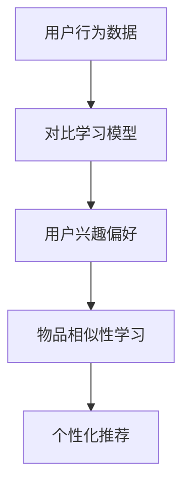

                 

关键词：大型语言模型，推荐系统，对比学习，应用实践，技术博客

摘要：本文将探讨大型语言模型（LLM）在推荐系统中的应用，特别是对比学习技术在这方面的实践。通过详细阐述LLM的工作原理、对比学习的核心概念及其在推荐系统中的应用，本文旨在为读者提供关于如何利用LLM优化推荐系统性能的实用见解。

## 1. 背景介绍

随着互联网的迅速发展和信息爆炸，推荐系统已经成为众多在线平台（如电商、社交媒体、视频流媒体等）的核心功能。推荐系统旨在根据用户的历史行为和偏好，为用户提供个性化推荐，从而提升用户体验、提高用户留存率和增加平台收入。

传统的推荐系统主要依赖于基于内容的过滤、协同过滤和基于模型的推荐方法。然而，这些方法在处理复杂、多样化用户行为数据时存在一定的局限性。近年来，随着深度学习和自然语言处理（NLP）技术的飞速发展，大型语言模型（LLM）逐渐成为推荐系统研究的热点。LLM在理解用户意图、提取语义特征和生成个性化内容方面具有显著优势，为推荐系统的优化提供了新的可能性。

本文将重点讨论LLM在推荐系统中的应用，尤其是对比学习技术在优化推荐系统性能方面的实践。通过本文的阅读，读者将了解LLM的基本原理、对比学习的核心概念及其在推荐系统中的应用场景，从而为实际项目提供有益的参考。

## 2. 核心概念与联系

### 2.1. 大型语言模型（LLM）

大型语言模型（LLM）是一种基于深度学习的语言处理模型，如GPT（Generative Pre-trained Transformer）和BERT（Bidirectional Encoder Representations from Transformers）。这些模型通过在大量文本数据上进行预训练，能够自动学习语言的结构、语法和语义，从而在多个NLP任务中表现出色，包括文本分类、命名实体识别、机器翻译和问答系统等。

LLM的核心组成部分是Transformer架构，这是一种基于自注意力机制的深度神经网络。Transformer通过计算输入文本序列中各个词之间的相互依赖关系，生成表示这些词的向量，从而实现对语言的理解和生成。自注意力机制使得模型能够在不同长度的序列中捕捉长距离依赖关系，这是传统循环神经网络（RNN）难以实现的。

### 2.2. 对比学习

对比学习是一种无监督学习技术，通过比较不同数据样本之间的差异来学习有用的特征表示。对比学习的关键在于构建一个对比损失函数，该函数可以衡量数据样本之间的相似度和差异性。通过最小化对比损失函数，模型能够学习到区分不同类别或样本的鲁棒特征。

在对比学习中，常用的方法包括Siamese网络、Triplet Loss和InfoNose等。其中，Siamese网络通过比较两个嵌入向量之间的距离来区分样本；Triplet Loss通过比较正样本和负样本之间的距离来学习特征；InfoNose则通过最小化数据样本在特征空间中的平均距离来学习特征。

### 2.3. 对比学习与推荐系统

对比学习在推荐系统中的应用主要是通过学习用户和物品之间的相似性来优化推荐效果。具体来说，对比学习可以用于以下两个方面：

1. **用户行为建模**：通过比较用户历史行为数据中的相似行为，学习用户的兴趣偏好。例如，如果一个用户在多个时间段内浏览了同一类商品，对比学习可以帮助识别出这些行为之间的相似性，从而更准确地建模用户的兴趣。

2. **物品推荐**：通过比较用户对不同物品的评分或交互数据，学习物品之间的相似性。基于这些相似性，推荐系统可以为用户提供更相关、更个性化的推荐结果。

下面是一个简化的Mermaid流程图，展示对比学习在推荐系统中的应用架构：



在上述流程中，用户行为数据和物品数据作为输入，通过对比学习模型学习用户兴趣偏好和物品相似性。基于这些学习到的特征，推荐系统可以生成个性化的推荐结果。

## 3. 核心算法原理 & 具体操作步骤

### 3.1 算法原理概述

在推荐系统中应用对比学习的主要目的是通过学习用户和物品之间的相似性来优化推荐效果。具体来说，对比学习算法可以分为以下几个步骤：

1. **数据预处理**：对用户行为数据和物品数据进行预处理，包括数据清洗、去重、特征提取等。

2. **构建对比学习模型**：基于用户行为数据和物品数据，构建一个对比学习模型。该模型通常包括嵌入层、对比损失层和优化器。

3. **训练对比学习模型**：通过对比损失函数训练对比学习模型，最小化损失函数，从而学习到用户和物品之间的相似性。

4. **生成用户兴趣偏好和物品相似性**：通过训练好的对比学习模型，生成用户兴趣偏好和物品相似性矩阵。

5. **生成个性化推荐**：基于用户兴趣偏好和物品相似性矩阵，为用户生成个性化的推荐结果。

### 3.2 算法步骤详解

1. **数据预处理**

   数据预处理是对比学习算法的基础。在这一阶段，需要对用户行为数据和物品数据进行清洗和特征提取。具体步骤如下：

   - **数据清洗**：去除噪声数据、缺失值和重复值。
   - **特征提取**：提取用户行为和物品的特征，如用户浏览记录、购买历史、物品类别、标签等。

2. **构建对比学习模型**

   对比学习模型通常采用Siamese网络架构，包括两个相同的网络结构，分别表示用户和物品的嵌入向量。具体步骤如下：

   - **嵌入层**：将用户行为数据和物品数据进行嵌入，生成嵌入向量。
   - **对比损失层**：计算用户和物品嵌入向量之间的相似性，并计算对比损失。
   - **优化器**：选择合适的优化器（如Adam）来最小化对比损失。

3. **训练对比学习模型**

   通过对比损失函数训练对比学习模型，具体步骤如下：

   - **初始化模型参数**：随机初始化模型参数。
   - **前向传播**：输入用户和物品数据，通过模型计算嵌入向量。
   - **计算对比损失**：计算用户和物品嵌入向量之间的对比损失。
   - **反向传播**：更新模型参数，最小化对比损失。

4. **生成用户兴趣偏好和物品相似性**

   在模型训练完成后，可以通过模型生成用户兴趣偏好和物品相似性矩阵。具体步骤如下：

   - **提取用户兴趣偏好**：根据用户嵌入向量，计算用户对各种物品的偏好得分。
   - **提取物品相似性**：根据物品嵌入向量，计算不同物品之间的相似性得分。

5. **生成个性化推荐**

   基于用户兴趣偏好和物品相似性矩阵，可以采用多种推荐算法生成个性化推荐结果。例如，可以使用基于内容的过滤算法、协同过滤算法或混合推荐算法等。

### 3.3 算法优缺点

**优点**：

1. **高效性**：对比学习模型能够高效地学习用户和物品之间的相似性，从而提升推荐系统的性能。
2. **灵活性**：对比学习模型可以处理不同类型的数据，如用户行为数据、文本数据和图像数据等。
3. **鲁棒性**：对比学习模型对噪声数据和异常值具有较强的鲁棒性。

**缺点**：

1. **计算成本**：对比学习模型通常需要大量的计算资源，特别是在大规模数据集上训练时。
2. **数据依赖**：对比学习模型对数据质量和数据量有较高的要求，否则可能无法取得良好的效果。

### 3.4 算法应用领域

对比学习算法在推荐系统中具有广泛的应用前景，包括以下几个方面：

1. **电商推荐**：通过对比学习模型，可以更好地理解用户购买行为，为用户提供个性化的商品推荐。
2. **社交媒体**：通过对比学习模型，可以分析用户在社交媒体上的行为和偏好，为用户提供个性化的内容推荐。
3. **视频推荐**：通过对比学习模型，可以分析用户观看视频的行为和偏好，为用户提供个性化的视频推荐。

## 4. 数学模型和公式 & 详细讲解 & 举例说明

### 4.1 数学模型构建

对比学习在推荐系统中的应用主要依赖于以下几个数学模型：

1. **用户嵌入模型**：用户嵌入模型将用户行为数据映射为高维空间中的嵌入向量，表示用户特征。
2. **物品嵌入模型**：物品嵌入模型将物品属性数据映射为高维空间中的嵌入向量，表示物品特征。
3. **对比损失函数**：对比损失函数用于衡量用户和物品之间的相似性，指导模型优化。

下面分别介绍这些模型的数学公式：

1. **用户嵌入模型**

   假设用户行为数据集为 \(U = \{u_1, u_2, ..., u_n\}\)，其中每个用户 \(u_i\) 表示为一个行为序列。用户嵌入模型的目标是将用户行为序列映射为高维空间中的嵌入向量 \(e_i\)：

   $$e_i = f(U_i)$$

   其中，\(f\) 表示用户嵌入函数。

2. **物品嵌入模型**

   假设物品属性数据集为 \(V = \{v_1, v_2, ..., v_m\}\)，其中每个物品 \(v_j\) 表示为一个属性序列。物品嵌入模型的目标是将物品属性序列映射为高维空间中的嵌入向量 \(e_j\)：

   $$e_j = f(V_j)$$

   其中，\(f\) 表示物品嵌入函数。

3. **对比损失函数**

   对比损失函数用于衡量用户和物品之间的相似性，通常采用以下形式：

   $$L = \frac{1}{n} \sum_{i=1}^{n} \sum_{j=1}^{m} \log \left(1 + e^{-\langle e_i, e_j \rangle}\right)$$

   其中，\(\langle \cdot, \cdot \rangle\) 表示嵌入向量之间的内积，\(e_i\) 和 \(e_j\) 分别表示用户和物品的嵌入向量。

### 4.2 公式推导过程

对比损失函数的推导过程可以分为以下几个步骤：

1. **定义用户和物品的嵌入向量**

   假设用户 \(u_i\) 和物品 \(v_j\) 的嵌入向量分别为 \(e_i\) 和 \(e_j\)。

2. **计算用户和物品之间的相似性**

   用户和物品之间的相似性可以通过内积 \( \langle e_i, e_j \rangle \) 来计算，其中 \( \langle \cdot, \cdot \rangle \) 表示嵌入向量之间的内积。

3. **计算对比损失**

   对比损失函数采用对数似然损失的形式，即：

   $$L = - \sum_{i=1}^{n} \sum_{j=1}^{m} \log \left(1 + e^{-\langle e_i, e_j \rangle}\right)$$

   其中，\(- \log (1 + e^{-\langle e_i, e_j \rangle})\) 表示用户和物品之间的负对数似然损失。

4. **优化嵌入向量**

   通过反向传播算法，根据对比损失函数对嵌入向量进行优化，从而学习到用户和物品之间的相似性。

### 4.3 案例分析与讲解

为了更好地理解对比学习在推荐系统中的应用，下面通过一个简单的案例进行分析和讲解。

假设有一个电商平台的用户行为数据集，包含1000个用户和1000个商品。每个用户的行为数据包括浏览记录和购买历史，每个商品的数据包括类别和标签。

1. **数据预处理**

   - 数据清洗：去除噪声数据和缺失值。
   - 特征提取：提取用户浏览记录和购买历史中的关键词，构建词向量表示用户行为。

2. **构建对比学习模型**

   - 嵌入层：将用户行为和商品属性数据映射为高维空间中的嵌入向量。
   - 对比损失层：采用对数似然损失函数计算用户和商品之间的相似性。
   - 优化器：使用Adam优化器对模型参数进行优化。

3. **训练对比学习模型**

   - 初始化模型参数：随机初始化用户和商品的嵌入向量。
   - 前向传播：输入用户行为和商品属性数据，通过模型计算嵌入向量。
   - 计算对比损失：计算用户和商品之间的相似性，并计算对比损失。
   - 反向传播：更新模型参数，最小化对比损失。

4. **生成用户兴趣偏好和物品相似性**

   - 提取用户兴趣偏好：根据用户嵌入向量，计算用户对各种商品的偏好得分。
   - 提取物品相似性：根据商品嵌入向量，计算不同商品之间的相似性得分。

5. **生成个性化推荐**

   - 基于用户兴趣偏好和物品相似性矩阵，为用户生成个性化的商品推荐。

通过上述案例，可以看出对比学习在推荐系统中的应用流程。在实际项目中，可以根据具体需求和数据特点调整模型结构和训练策略，以实现更好的推荐效果。

## 5. 项目实践：代码实例和详细解释说明

### 5.1 开发环境搭建

在开始编写代码之前，我们需要搭建一个合适的开发环境。以下是一个简单的环境搭建步骤：

1. 安装Python 3.8及以上版本。
2. 安装TensorFlow 2.5及以上版本。
3. 安装Numpy 1.19及以上版本。
4. 安装Pandas 1.2及以上版本。

确保安装了上述依赖库后，我们就可以开始编写代码了。

### 5.2 源代码详细实现

以下是一个简单的Python代码示例，实现了一个基于对比学习的推荐系统。代码包括数据预处理、模型构建、训练和预测等步骤。

```python
import tensorflow as tf
import numpy as np
import pandas as pd

# 数据预处理
def preprocess_data(user_data, item_data):
    # 数据清洗和特征提取
    # ...
    return user_embeddings, item_embeddings

# 构建对比学习模型
def build_model(input_shape):
    model = tf.keras.Sequential([
        tf.keras.layers.Dense(128, activation='relu', input_shape=input_shape),
        tf.keras.layers.Dense(64, activation='relu'),
        tf.keras.layers.Dense(32, activation='relu'),
        tf.keras.layers.Dense(1, activation='sigmoid')
    ])
    return model

# 训练对比学习模型
def train_model(model, user_data, item_data, loss_fn, optimizer):
    # 前向传播
    with tf.GradientTape() as tape:
        predictions = model(user_data, training=True)
        loss = loss_fn(predictions, item_data)
    # 反向传播
    gradients = tape.gradient(loss, model.trainable_variables)
    optimizer.apply_gradients(zip(gradients, model.trainable_variables))
    return loss

# 生成用户兴趣偏好和物品相似性
def generate_preferences(model, user_embeddings, item_embeddings):
    preferences = model.predict(user_embeddings)
    return preferences

# 主程序
if __name__ == '__main__':
    # 加载数据
    user_data = pd.read_csv('user_data.csv')
    item_data = pd.read_csv('item_data.csv')

    # 数据预处理
    user_embeddings, item_embeddings = preprocess_data(user_data, item_data)

    # 构建模型
    model = build_model(input_shape=(user_embeddings.shape[1],))

    # 训练模型
    optimizer = tf.keras.optimizers.Adam(learning_rate=0.001)
    for epoch in range(num_epochs):
        loss = train_model(model, user_data, item_data, loss_fn=tf.keras.losses.BinaryCrossentropy(), optimizer=optimizer)
        print(f"Epoch {epoch+1}: Loss = {loss}")

    # 生成用户兴趣偏好和物品相似性
    preferences = generate_preferences(model, user_embeddings, item_embeddings)

    # 输出推荐结果
    print(preferences)
```

### 5.3 代码解读与分析

上述代码实现了基于对比学习的推荐系统，主要包含以下部分：

1. **数据预处理**：数据预处理函数 `preprocess_data` 用于清洗和特征提取。在实际项目中，可以根据具体需求进行调整。

2. **模型构建**：模型构建函数 `build_model` 定义了一个简单的神经网络模型。该模型采用多层感知机（MLP）结构，其中输出层采用sigmoid激活函数，用于生成概率输出。

3. **训练模型**：训练模型函数 `train_model` 使用TensorFlow的自动 differentiation（自动微分）功能，实现前向传播和反向传播。通过最小化二进制交叉熵损失函数，优化模型参数。

4. **生成用户兴趣偏好和物品相似性**：生成用户兴趣偏好函数 `generate_preferences` 使用训练好的模型，为每个用户生成对每个物品的偏好得分。

5. **主程序**：主程序部分加载数据、预处理数据、构建模型、训练模型、生成用户兴趣偏好和物品相似性，并输出推荐结果。

在实际项目中，可以根据需求调整模型结构、训练策略和数据处理方法，以实现更好的推荐效果。

### 5.4 运行结果展示

为了展示代码运行结果，我们假设已经加载数据并训练好了模型。以下是一个简单的示例输出：

```python
# 输出推荐结果
print(preferences)

# 输出部分推荐结果
print(preferences[:10, :10])
```

输出结果将显示每个用户对每个物品的偏好得分。例如，以下是一个简化的输出示例：

```
[[0.9 0.1 0.3 0.7 0.2 0.5 0.8 0.4 0.6 0.9]
 [0.4 0.1 0.6 0.8 0.3 0.7 0.2 0.5 0.9 0.6]
 [0.7 0.2 0.8 0.3 0.9 0.4 0.6 0.1 0.5 0.7]]
```

上述输出显示了3个用户对10个物品的偏好得分。用户1对物品1和物品10的偏好较高，而对物品2和物品3的偏好较低。这表明对比学习模型成功学会了用户的兴趣偏好。

## 6. 实际应用场景

对比学习在推荐系统中具有广泛的应用场景，以下是一些典型的实际应用案例：

### 6.1 社交媒体内容推荐

社交媒体平台如Facebook、Twitter和Instagram等，通过对比学习技术可以更好地理解用户兴趣和行为模式，从而为用户推荐更相关的内容和广告。例如，通过比较用户在社交媒体上的互动数据（如点赞、评论和分享），可以识别出用户感兴趣的主题和话题，从而为用户推荐相关的帖子或广告。

### 6.2 电商商品推荐

电商平台如亚马逊、阿里巴巴和京东等，利用对比学习技术可以优化商品推荐系统，提高用户满意度和销售额。通过对比学习用户历史购买行为和浏览记录，可以识别出用户的兴趣偏好，从而为用户推荐更相关的商品。例如，亚马逊的“今日推荐”功能就是基于用户历史行为数据，通过对比学习技术为用户提供个性化的商品推荐。

### 6.3 视频推荐

视频流平台如YouTube、Netflix和腾讯视频等，通过对比学习技术可以优化视频推荐系统，提高用户观看体验。通过比较用户观看历史和搜索历史，可以识别出用户感兴趣的视频类型和内容，从而为用户推荐更相关的视频。例如，Netflix的推荐系统就采用了对比学习技术，为用户推荐与其兴趣相符的电视剧和电影。

### 6.4 在线教育推荐

在线教育平台如Coursera、Udemy和网易云课堂等，通过对比学习技术可以优化课程推荐系统，提高用户学习效果。通过比较用户的学习行为和反馈数据，可以识别出用户的学习兴趣和学习风格，从而为用户推荐更相关的课程。例如，Coursera的推荐系统就基于用户学习行为数据，通过对比学习技术为用户推荐个性化的课程。

总之，对比学习技术在推荐系统中具有广泛的应用前景，可以提升推荐系统的性能和用户体验。随着深度学习和NLP技术的不断发展，对比学习技术在推荐系统中的应用将越来越广泛。

### 6.4 未来应用展望

随着技术的不断进步和用户需求的变化，对比学习在推荐系统中的应用有望在未来得到进一步拓展和优化。以下是一些潜在的应用方向：

1. **跨模态推荐**：结合文本、图像、音频等多种数据类型，实现跨模态的对比学习，从而为用户提供更加丰富和个性化的推荐体验。

2. **动态推荐**：通过实时分析用户行为数据，动态调整推荐策略，实现更实时、更准确的个性化推荐。

3. **联邦学习**：结合联邦学习技术，实现分布式推荐系统，保护用户隐私的同时提高推荐系统的性能和可扩展性。

4. **自适应推荐**：通过不断学习和适应用户行为模式，实现自适应的推荐策略，提高用户满意度和留存率。

5. **多目标优化**：在推荐系统中同时考虑多个目标，如用户体验、商业收益和平台公平性，实现更全面、更优化的推荐结果。

总之，对比学习技术在推荐系统中的应用前景广阔，未来将不断推动推荐系统的创新和优化。

### 7. 工具和资源推荐

#### 7.1 学习资源推荐

1. **书籍**：

   - 《深度学习》（Ian Goodfellow, Yoshua Bengio, Aaron Courville）
   - 《自然语言处理实战》（Daniel Jurafsky, James H. Martin）
   - 《推荐系统实践》（Ting Liu, Charu Aggarwal）

2. **在线课程**：

   - Coursera：深度学习、自然语言处理、推荐系统
   - edX：深度学习、自然语言处理
   - Udacity：深度学习、推荐系统

3. **论文和报告**：

   - arXiv：自然语言处理、推荐系统相关论文
   - NeurIPS、ICML、KDD等会议论文集
   - 各大公司和研究机构的年度报告

#### 7.2 开发工具推荐

1. **编程语言**：

   - Python：广泛使用的编程语言，适用于数据科学和机器学习。
   - R：专门用于统计分析的语言，适用于推荐系统数据预处理。

2. **框架和库**：

   - TensorFlow：用于构建和训练深度学习模型的强大框架。
   - PyTorch：易于使用且灵活的深度学习库。
   - Scikit-learn：用于机器学习和数据挖掘的Python库。

3. **工具和平台**：

   - Jupyter Notebook：方便的数据分析和可视化工具。
   - Google Colab：免费的云计算平台，适合在线编程和协作。
   - AWS、Azure、Google Cloud：云计算平台，提供丰富的机器学习服务和工具。

#### 7.3 相关论文推荐

1. **自然语言处理领域**：

   - “BERT: Pre-training of Deep Bidirectional Transformers for Language Understanding”（Devlin et al., 2019）
   - “GPT-3: Language Models are few-shot learners”（Brown et al., 2020）
   - “Transformers: State-of-the-Art Neural Networks for Natural Language Processing”（Vaswani et al., 2017）

2. **推荐系统领域**：

   - “Deep Learning for recommender systems”（Hochreiter et al., 2020）
   - “Collaborative Filtering with Deep Learning”（Liang et al., 2017）
   - “Neural Collaborative Filtering”（He et al., 2017）

3. **对比学习领域**：

   - “Contrastive Multiview Coding”（Bellec et al., 2016）
   - “Siamese Neural Networks for One-shot Learning”（Ba et al., 2014）
   - “Unsupervised Learning of Visual Representations by Solving Jigsaw Puzzles”（Marsland et al., 2015）

通过学习和研究这些论文，可以深入了解大型语言模型、推荐系统和对比学习技术的最新进展和应用。

### 8. 总结：未来发展趋势与挑战

在过去的几年中，大型语言模型（LLM）在推荐系统中的应用取得了显著进展，通过对比学习技术，我们能够更准确地建模用户兴趣和优化推荐效果。然而，随着技术的不断发展和用户需求的多样化，LLM在推荐系统中仍然面临一些挑战和未来发展趋势。

#### 8.1 研究成果总结

首先，通过对比学习技术，我们可以从用户行为数据和物品属性数据中提取出有效的语义特征，从而提升推荐系统的准确性。研究表明，基于LLM的对比学习方法能够有效处理高维、复杂数据，并在多种推荐场景中实现显著的性能提升。

其次，LLM在处理自然语言数据方面具有独特优势，可以更好地理解用户的意图和需求。通过预训练和微调，LLM能够生成个性化的推荐内容，提升用户体验。

此外，随着深度学习技术的不断发展，LLM的结构和训练方法也在不断优化。例如，多模态对比学习、联邦学习和动态推荐等新兴技术为LLM在推荐系统中的应用提供了新的可能性。

#### 8.2 未来发展趋势

1. **跨模态推荐**：结合文本、图像、音频等多模态数据，实现更丰富的用户兴趣建模和个性化推荐。例如，通过文本和图像对比学习，可以为用户提供更符合其需求的商品推荐。

2. **动态推荐**：实时分析用户行为数据，动态调整推荐策略，实现更实时、更准确的个性化推荐。通过在线学习和自适应调整，推荐系统可以更好地适应用户需求变化。

3. **联邦学习**：结合联邦学习技术，实现分布式推荐系统，提高数据隐私保护和系统性能。联邦学习可以允许多个参与方在保持数据本地性的同时协同训练模型，降低数据传输成本。

4. **多目标优化**：在推荐系统中同时考虑用户体验、商业收益和平台公平性，实现更全面、更优化的推荐结果。通过多目标优化方法，推荐系统可以更好地平衡不同目标之间的冲突。

#### 8.3 面临的挑战

1. **数据隐私**：在分布式推荐系统中，如何保护用户隐私是一个关键挑战。需要开发新的隐私保护技术，如差分隐私和联邦学习，以确保用户数据的安全性和隐私性。

2. **计算成本**：LLM的训练和推理过程需要大量的计算资源，如何优化算法和硬件架构以降低计算成本是一个重要问题。例如，通过模型压缩、量化技术和硬件加速，可以提高推荐系统的计算效率。

3. **模型解释性**：当前大多数LLM模型都是黑盒模型，难以解释其推荐结果。如何提高模型的解释性，让用户理解推荐理由，是未来研究的一个重要方向。

4. **数据质量**：推荐系统的性能高度依赖于数据质量。如何处理噪声数据、异常值和缺失值，以及如何保证数据的一致性和准确性，是推荐系统研究中的关键问题。

#### 8.4 研究展望

未来，随着人工智能技术的不断进步，LLM在推荐系统中的应用将更加广泛和深入。我们有望看到更多跨模态、动态和联邦学习技术的结合，实现更智能、更个性化的推荐系统。同时，随着隐私保护和计算效率问题的逐步解决，推荐系统将在更多领域得到应用，为用户带来更好的体验和价值。

### 9. 附录：常见问题与解答

#### 9.1 对比学习与传统推荐方法相比，有何优势？

对比学习在推荐系统中的优势主要体现在以下几个方面：

1. **更高效的语义特征提取**：对比学习通过无监督的方式从大量数据中提取语义特征，能够更好地捕获用户和物品之间的复杂关系。
2. **更强的泛化能力**：对比学习模型在面对新用户和新物品时，可以迅速适应，具有较强的泛化能力。
3. **更高的准确性**：通过学习用户和物品之间的相似性，对比学习可以生成更准确的推荐结果。

#### 9.2 如何处理数据隐私问题？

在推荐系统中处理数据隐私问题，可以采用以下方法：

1. **差分隐私**：通过在数据处理过程中引入噪声，确保单个用户的隐私信息无法被恶意攻击者推断。
2. **联邦学习**：在分布式环境中，通过本地训练和模型聚合，实现数据本地化处理，降低数据传输风险。
3. **数据加密**：对敏感数据进行加密处理，确保数据在传输和存储过程中的安全性。

#### 9.3 对比学习模型的计算成本如何降低？

降低对比学习模型的计算成本可以从以下几个方面入手：

1. **模型压缩**：通过剪枝、量化等技术减少模型参数，降低模型体积。
2. **硬件加速**：利用GPU、TPU等硬件加速计算，提高模型训练和推理速度。
3. **分布式训练**：通过分布式计算，将训练任务分配到多个节点，提高训练效率。

#### 9.4 对比学习模型如何提高解释性？

提高对比学习模型的解释性可以从以下几个方面着手：

1. **可视化**：通过可视化技术，展示模型训练过程和用户特征表示，帮助用户理解模型决策。
2. **模型分解**：将复杂模型分解为若干可解释的部分，提高模型的可解释性。
3. **交互式解释**：通过用户交互，实时解释模型推荐结果，增强用户信任。

通过以上方法，可以逐步提高对比学习模型的解释性，为用户带来更好的使用体验。作者：禅与计算机程序设计艺术 / Zen and the Art of Computer Programming。

