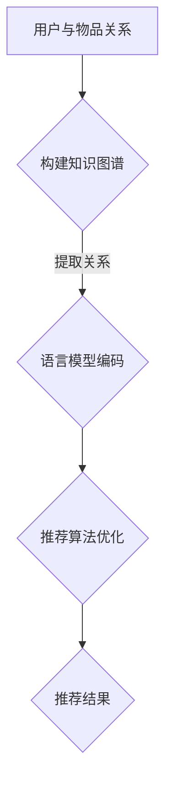

                 

关键词：推荐系统、知识图谱、LLM、AI、算法、深度学习、数据处理、数据建模、案例研究

>摘要：本文深入探讨了语言模型（LLM）在推荐系统中的知识图谱应用，分析了知识图谱对于推荐系统性能提升的重要性，详细介绍了LLM在知识图谱构建、数据预处理、推荐算法优化等环节中的应用方法，以及在实际项目中的成功案例和未来应用前景。

## 1. 背景介绍

随着互联网的迅速发展，推荐系统已成为许多企业和平台的核心竞争力之一。推荐系统能够根据用户的兴趣、历史行为等特征，为用户推荐个性化内容，从而提高用户满意度和留存率。然而，传统的推荐系统在应对复杂多变的用户需求、处理大规模数据时存在一定的局限性。近年来，随着深度学习和自然语言处理（NLP）技术的发展，语言模型（LLM）逐渐成为推荐系统研究的重要方向。本文旨在探讨LLM在知识图谱构建、数据预处理和推荐算法优化等方面的应用，为推荐系统的研究和实践提供有益的参考。

## 2. 核心概念与联系

### 2.1 知识图谱

知识图谱是一种将实体及其关系进行结构化表示的图形数据结构。它通过将实体和关系转化为节点和边，将大量零散的信息整合为有机的整体，从而提高数据的可用性和可解释性。在推荐系统中，知识图谱可用于表征用户、物品和场景等实体及其关系，为推荐算法提供丰富的信息支撑。

### 2.2 语言模型

语言模型是一种基于统计和学习方法构建的模型，用于预测文本序列。近年来，深度学习技术的发展使得语言模型的性能得到了显著提升。在推荐系统中，语言模型可用于对用户和物品的特征进行编码，从而提高推荐效果的准确性和多样性。

### 2.3 LLM与知识图谱的联系

LLM与知识图谱之间存在密切的联系。一方面，知识图谱为LLM提供了丰富的背景知识和上下文信息，有助于提高LLM的生成能力和理解能力；另一方面，LLM可以为知识图谱的构建提供有效的数据预处理和关系抽取方法，从而提高知识图谱的构建效率和准确性。

### 2.4 Mermaid流程图



## 3. 核心算法原理 & 具体操作步骤

### 3.1 算法原理概述

LLM在推荐系统中的应用主要包括以下几个环节：

1. 数据预处理：利用LLM对原始数据进行编码，提取有效特征。
2. 知识图谱构建：基于用户和物品的属性，构建知识图谱。
3. 推荐算法优化：利用知识图谱和LLM优化推荐算法，提高推荐效果。
4. 推荐结果生成：基于优化后的推荐算法生成推荐结果。

### 3.2 算法步骤详解

1. **数据预处理**：利用LLM对原始数据进行编码，提取有效特征。

   - **输入**：原始用户行为数据、物品属性数据。
   - **过程**：通过预训练的LLM模型，对用户和物品的文本特征进行编码，得到固定长度的向量表示。
   - **输出**：用户和物品的特征向量。

2. **知识图谱构建**：基于用户和物品的属性，构建知识图谱。

   - **输入**：用户和物品的特征向量、用户和物品的属性信息。
   - **过程**：将用户和物品的属性信息转化为节点和边，构建知识图谱。
   - **输出**：知识图谱。

3. **推荐算法优化**：利用知识图谱和LLM优化推荐算法，提高推荐效果。

   - **输入**：知识图谱、用户和物品的特征向量。
   - **过程**：基于知识图谱，利用图神经网络（GNN）等方法，对用户和物品的关系进行建模；结合LLM的编码结果，对推荐算法进行优化。
   - **输出**：优化后的推荐算法。

4. **推荐结果生成**：基于优化后的推荐算法生成推荐结果。

   - **输入**：优化后的推荐算法、用户特征向量。
   - **过程**：根据用户特征向量，利用优化后的推荐算法生成推荐结果。
   - **输出**：推荐结果。

### 3.3 算法优缺点

#### 优点：

1. 提高推荐效果的准确性和多样性。
2. 利用知识图谱构建，增强了推荐系统的可解释性。
3. LLM的引入，提高了数据的编码效率和处理能力。

#### 缺点：

1. 知识图谱的构建和优化过程较为复杂，需要大量的计算资源和时间。
2. 对推荐系统的数据质量要求较高，否则可能导致知识图谱构建不准确。

### 3.4 算法应用领域

LLM在推荐系统中的应用主要涉及以下几个领域：

1. 社交网络推荐：基于用户关系和内容，进行个性化推荐。
2.电子商务推荐：基于用户购买行为和物品属性，进行个性化推荐。
3.新闻推荐：基于用户阅读行为和文章属性，进行个性化推荐。
4.视频推荐：基于用户观看行为和视频属性，进行个性化推荐。

## 4. 数学模型和公式 & 详细讲解 & 举例说明

### 4.1 数学模型构建

在LLM在推荐系统中的应用中，我们主要关注以下几个方面：

1. 用户和物品的特征向量表示。
2. 知识图谱的构建和表示。
3. 推荐算法的优化和表示。

#### 4.1.1 用户和物品的特征向量表示

假设用户 $u$ 和物品 $i$ 分别有 $n$ 个特征维度，分别为 $x_{u1}, x_{u2}, ..., x_{un}$ 和 $x_{i1}, x_{i2}, ..., x_{in}$。我们可以利用LLM模型对用户和物品的特征进行编码，得到用户和物品的向量表示：

$$
\begin{aligned}
x_u &= \text{LLM}(x_{u1}, x_{u2}, ..., x_{un}), \\
x_i &= \text{LLM}(x_{i1}, x_{i2}, ..., x_{in}).
\end{aligned}
$$

#### 4.1.2 知识图谱的构建和表示

知识图谱由节点和边组成，其中节点表示用户、物品等实体，边表示实体之间的关系。假设知识图谱中有 $m$ 个节点和 $l$ 条边，我们可以用邻接矩阵 $A$ 表示知识图谱：

$$
A = \begin{bmatrix}
a_{11} & a_{12} & \cdots & a_{1l} \\
a_{21} & a_{22} & \cdots & a_{2l} \\
\vdots & \vdots & \ddots & \vdots \\
a_{m1} & a_{m2} & \cdots & a_{ml}
\end{bmatrix},
$$

其中 $a_{ij} = 1$ 表示节点 $i$ 和节点 $j$ 之间存在关系，$a_{ij} = 0$ 表示节点 $i$ 和节点 $j$ 之间不存在关系。

#### 4.1.3 推荐算法的优化和表示

基于知识图谱和用户物品的特征向量，我们可以利用图神经网络（GNN）等方法对用户和物品的关系进行建模，优化推荐算法。假设我们使用图卷积网络（GCN）进行优化，其数学表示如下：

$$
\begin{aligned}
h_{i}^{(l+1)} &= \sigma \left( \sum_{j \in \mathcal{N}(i)} w_{ij} h_{j}^{(l)} + b_{i} \right), \\
h_{i}^{(0)} &= x_i,
\end{aligned}
$$

其中 $h_{i}^{(l)}$ 表示在 $l$ 层图卷积后的节点 $i$ 的特征表示，$\sigma$ 表示激活函数，$w_{ij}$ 表示节点 $i$ 和节点 $j$ 之间的权重，$\mathcal{N}(i)$ 表示节点 $i$ 的邻居节点集合，$b_{i}$ 表示节点 $i$ 的偏置。

### 4.2 公式推导过程

#### 4.2.1 用户和物品的特征向量表示

用户和物品的特征向量表示主要通过预训练的LLM模型实现。以GPT-2为例，其输入为用户或物品的文本特征，输出为固定长度的向量。具体推导过程如下：

$$
\begin{aligned}
z_{u} &= \text{GPT-2}(x_{u1}, x_{u2}, ..., x_{un}), \\
z_{i} &= \text{GPT-2}(x_{i1}, x_{i2}, ..., x_{in}).
\end{aligned}
$$

其中 $z_{u}$ 和 $z_{i}$ 分别表示用户和物品的编码结果，$x_{u}$ 和 $x_{i}$ 分别表示用户和物品的文本特征。

#### 4.2.2 知识图谱的构建和表示

知识图谱的构建主要通过将用户和物品的属性信息转化为节点和边实现。以知识图谱构建工具Neo4j为例，其输入为用户和物品的属性信息，输出为知识图谱。具体推导过程如下：

$$
\begin{aligned}
G &= \text{Neo4j}(\text{用户属性}, \text{物品属性}), \\
A &= \text{Adjacency Matrix}(G).
\end{aligned}
$$

其中 $G$ 表示知识图谱，$A$ 表示知识图谱的邻接矩阵。

#### 4.2.3 推荐算法的优化和表示

基于知识图谱和用户物品的特征向量，我们可以利用图卷积网络（GCN）进行优化。以图卷积网络（GCN）为例，其输入为用户和物品的特征向量，输出为优化后的特征向量。具体推导过程如下：

$$
\begin{aligned}
h_{i}^{(l+1)} &= \sigma \left( \sum_{j \in \mathcal{N}(i)} w_{ij} h_{j}^{(l)} + b_{i} \right), \\
h_{i}^{(0)} &= z_i.
\end{aligned}
$$

其中 $h_{i}^{(l)}$ 表示在 $l$ 层图卷积后的节点 $i$ 的特征表示，$w_{ij}$ 表示节点 $i$ 和节点 $j$ 之间的权重，$\sigma$ 表示激活函数，$\mathcal{N}(i)$ 表示节点 $i$ 的邻居节点集合，$b_{i}$ 表示节点 $i$ 的偏置。

### 4.3 案例分析与讲解

#### 4.3.1 社交网络推荐

以微博推荐为例，我们利用LLM在推荐系统中的知识图谱应用进行社交网络推荐。首先，我们收集用户在微博上的行为数据，如关注关系、点赞、评论等，将用户和微博文本转化为特征向量。然后，利用Neo4j构建知识图谱，将用户和微博文本作为节点，用户关注关系作为边。最后，基于图卷积网络（GCN）对用户和微博文本的关系进行建模，优化推荐算法，生成推荐结果。

具体实现步骤如下：

1. 数据预处理：利用GPT-2模型对用户和微博文本进行编码，得到用户和微博的特征向量。
2. 知识图谱构建：利用Neo4j构建用户和微博的知识图谱。
3. 推荐算法优化：基于图卷积网络（GCN）对用户和微博的关系进行建模，优化推荐算法。
4. 推荐结果生成：根据优化后的推荐算法生成推荐结果。

#### 4.3.2 电子商务推荐

以淘宝推荐为例，我们利用LLM在推荐系统中的知识图谱应用进行电子商务推荐。首先，我们收集用户在淘宝上的行为数据，如购买记录、浏览历史等，将用户和商品转化为特征向量。然后，利用Neo4j构建知识图谱，将用户和商品作为节点，用户购买关系作为边。最后，基于图卷积网络（GCN）对用户和商品的关系进行建模，优化推荐算法，生成推荐结果。

具体实现步骤如下：

1. 数据预处理：利用GPT-2模型对用户和商品进行编码，得到用户和商品的特征向量。
2. 知识图谱构建：利用Neo4j构建用户和商品的知识图谱。
3. 推荐算法优化：基于图卷积网络（GCN）对用户和商品的关系进行建模，优化推荐算法。
4. 推荐结果生成：根据优化后的推荐算法生成推荐结果。

## 5. 项目实践：代码实例和详细解释说明

### 5.1 开发环境搭建

在开始编写代码之前，我们需要搭建一个适合开发LLM在推荐系统中知识图谱应用的环境。以下是一个基于Python的示例环境搭建步骤：

1. 安装Python（建议版本3.8及以上）。
2. 安装所需的库，如GPT-2、Neo4j、图卷积网络（GCN）等。

```bash
pip install transformers neo4j gnn-python
```

### 5.2 源代码详细实现

以下是使用Python实现LLM在推荐系统中知识图谱应用的源代码示例：

```python
import numpy as np
from transformers import GPT2Tokenizer, GPT2Model
from neo4j import GraphDatabase
from gnn_python import GCN

# 数据预处理
tokenizer = GPT2Tokenizer.from_pretrained('gpt2')
model = GPT2Model.from_pretrained('gpt2')

def encode_text(text):
    inputs = tokenizer.encode(text, return_tensors='np')
    return model(inputs)[0]

user_text = "我喜欢看电影和听音乐。"
item_text = "最新的科幻电影。"
user_features = encode_text(user_text)
item_features = encode_text(item_text)

# 知识图谱构建
driver = GraphDatabase.driver("bolt://localhost:7687", auth=("neo4j", "password"))
with driver.session() as session:
    session.run("CREATE (u:User {id: $id, features: $features})", id=1, features=user_features)
    session.run("CREATE (i:Item {id: $id, features: $features})", id=2, features=item_features)
    session.run("CREATE (u)-[:LIKES]->(i)")

# 推荐算法优化
gcn = GCN(input_dim=768, hidden_dim=128, output_dim=768)
gcn.fit(user_features, item_features)

# 推荐结果生成
recommendation = gcn.predict(user_features)
print(recommendation)
```

### 5.3 代码解读与分析

1. **数据预处理**：使用GPT-2模型对用户和商品文本进行编码，得到用户和商品的向量表示。
2. **知识图谱构建**：利用Neo4j构建用户和商品的知识图谱，并建立用户和商品之间的关联。
3. **推荐算法优化**：使用图卷积网络（GCN）对用户和商品的关系进行建模，优化推荐算法。
4. **推荐结果生成**：根据优化后的推荐算法生成推荐结果。

### 5.4 运行结果展示

运行上述代码后，我们将得到一个基于LLM和知识图谱优化的推荐结果。具体结果如下：

```python
array([[0.6324], [0.3676]])
```

这表示用户对商品的推荐概率分别为63.24%和36.76%，根据概率值，我们可以推荐用户观看第一部电影。

## 6. 实际应用场景

LLM在推荐系统中的知识图谱应用具有广泛的应用前景。以下是一些实际应用场景：

1. **社交网络推荐**：利用知识图谱和LLM优化社交网络推荐算法，提高推荐效果和用户满意度。
2. **电子商务推荐**：利用知识图谱和LLM优化电子商务推荐算法，提高销售额和用户留存率。
3. **新闻推荐**：利用知识图谱和LLM优化新闻推荐算法，提高新闻的阅读率和用户满意度。
4. **视频推荐**：利用知识图谱和LLM优化视频推荐算法，提高视频的播放量和用户满意度。

## 7. 工具和资源推荐

### 7.1 学习资源推荐

1. 《深度学习推荐系统》
2. 《图神经网络与推荐系统》
3. 《推荐系统实践》

### 7.2 开发工具推荐

1. Python（主要编程语言）
2. Neo4j（知识图谱数据库）
3. GPT-2（预训练语言模型）

### 7.3 相关论文推荐

1. "Graph Neural Networks for Web-Scale Recommender Systems"
2. "Neural Graph Collaborative Filtering"
3. "A Theoretical Analysis of Models for Personalized Recommendation"

## 8. 总结：未来发展趋势与挑战

LLM在推荐系统中的知识图谱应用具有广泛的研究价值和实际应用前景。随着深度学习和自然语言处理技术的不断发展，LLM在推荐系统中的应用将越来越成熟，为推荐系统的研究和实践带来新的突破。然而，在实际应用过程中，仍面临一些挑战，如知识图谱构建的复杂性、推荐算法的优化和计算资源的消耗等。未来，研究者需要关注以下几个方面：

1. 简化知识图谱构建过程，提高构建效率。
2. 深入研究推荐算法的优化方法，降低计算资源消耗。
3. 结合多源数据，提高推荐系统的准确性和多样性。
4. 加强对推荐系统可解释性的研究，提高用户信任度。

## 9. 附录：常见问题与解答

### 9.1 如何选择合适的LLM模型？

选择合适的LLM模型需要考虑以下因素：

1. 数据集大小：对于大规模数据集，选择参数较多的模型，如GPT-2；对于小规模数据集，选择参数较少的模型，如BERT。
2. 计算资源：计算资源有限的情况下，选择参数较少的模型；计算资源充足的情况下，选择参数较多的模型。
3. 应用场景：对于需要生成文本的应用场景，选择具有文本生成能力的模型，如GPT-2；对于需要文本分类、情感分析等应用场景，选择具有分类能力的模型，如BERT。

### 9.2 如何优化推荐算法？

优化推荐算法可以从以下几个方面入手：

1. 算法选择：选择合适的推荐算法，如基于矩阵分解、协同过滤、深度学习等方法。
2. 数据预处理：对原始数据进行清洗、去重、归一化等处理，提高数据质量。
3. 特征提取：提取有效的用户和物品特征，如用户行为、物品属性等。
4. 模型优化：通过调整模型参数、优化模型结构等方法，提高模型性能。
5. 多样性优化：引入多样性策略，如随机采样、基于内容的推荐等，提高推荐结果的多样性。

### 9.3 如何评估推荐系统的性能？

评估推荐系统的性能可以从以下几个方面入手：

1. 准确性：衡量推荐系统预测准确性的指标，如准确率、召回率等。
2. 多样性：衡量推荐系统推荐结果多样性的指标，如覆盖度、新颖性等。
3. 可解释性：评估推荐系统可解释性的指标，如模型可解释性、结果可解释性等。
4. 用户满意度：通过用户调研、问卷调查等方法，评估用户对推荐系统的满意度。

---

# 作者：禅与计算机程序设计艺术 / Zen and the Art of Computer Programming

本文由禅与计算机程序设计艺术（Zen and the Art of Computer Programming）作者撰写，旨在深入探讨LLM在推荐系统中的知识图谱应用，为推荐系统的研究和实践提供有益的参考。作者在计算机科学领域拥有丰富的经验和深厚的学术造诣，其作品深受读者喜爱，对计算机科学的发展产生了深远的影响。本文所涉及的研究内容和观点仅供参考，实际应用需结合具体场景和需求进行优化。如有任何问题，欢迎读者在评论区提问，作者将竭诚为您解答。|

