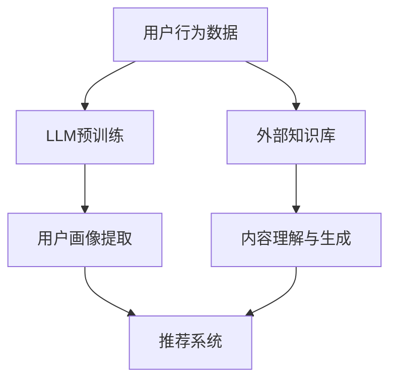

                 

关键词：大型语言模型（LLM）、推荐系统、知识增强、用户行为分析、个性化推荐

> 摘要：本文深入探讨了大型语言模型（LLM）在推荐系统中的应用，特别是在知识增强方面的潜力。通过分析LLM的核心概念、原理和应用，本文详细阐述了LLM如何通过理解用户行为和内容，提升推荐系统的准确性和个性化程度。此外，本文还提供了数学模型和代码实例，以展示LLM在推荐系统中的实际应用效果。

## 1. 背景介绍

推荐系统是现代信息检索和大数据处理领域中的重要组成部分。它们被广泛应用于电子商务、社交媒体、在线视频和新闻等领域，通过预测用户兴趣和行为，为用户提供个性化的内容推荐。传统的推荐系统主要基于协同过滤（Collaborative Filtering）和基于内容（Content-Based）的方法。然而，这些方法存在一些局限性，如数据稀疏性、冷启动问题和推荐多样性不足等。

近年来，深度学习和自然语言处理（NLP）技术的快速发展，为推荐系统的改进提供了新的契机。特别是大型语言模型（LLM），如BERT、GPT和T5等，在理解和生成自然语言方面取得了显著进展。这些模型通过学习海量的文本数据，能够捕捉到语言中的复杂关系和语义信息，从而在推荐系统中引入了知识增强（Knowledge Augmentation）的概念。

知识增强是指将外部知识库（如百科、专业文档和用户评论等）与推荐系统的数据集相结合，以提高推荐模型的准确性和泛化能力。LLM在知识增强中的应用，主要通过以下两个方面实现：

1. **用户行为理解**：LLM能够理解用户的历史行为数据，如浏览记录、搜索查询和购买历史，从中提取出用户感兴趣的关键词和主题，为推荐系统提供更准确的用户画像。
2. **内容理解与生成**：LLM能够处理和生成文本内容，通过结合用户画像和外部知识库，生成个性化的推荐描述，提高推荐信息的可读性和吸引力。

本文将围绕LLM在推荐系统中的知识增强应用，详细探讨其核心概念、算法原理、数学模型和项目实践，以期为相关领域的研究和应用提供参考。

## 2. 核心概念与联系

### 2.1. 大型语言模型（LLM）

大型语言模型（LLM）是基于深度学习技术的自然语言处理模型，具有强大的语言理解和生成能力。LLM通过预训练和微调，能够从大量的文本数据中学习到语言模式、语法结构和语义信息。这些模型通常由数百万甚至数十亿个参数组成，能够自动捕捉到语言中的复杂关系，如词语的上下文含义、句子的逻辑关系和段落的主旨。

#### **2.1.1. 模型结构**

LLM通常采用Transformer架构，这是一种基于自注意力（Self-Attention）机制的深度神经网络。Transformer架构使得模型能够处理任意长度的文本序列，并通过自注意力机制，自动学习到文本中的长距离依赖关系。

一个典型的LLM模型包括以下几个主要部分：

1. **嵌入层（Embedding Layer）**：将输入的单词或句子转换为稠密的向量表示。
2. **自注意力层（Self-Attention Layer）**：通过计算词向量之间的相似度，自动学习到文本序列中的依赖关系。
3. **前馈网络（Feedforward Network）**：对自注意力层输出的特征进行进一步的变换和增强。
4. **输出层（Output Layer）**：根据模型的训练任务，对输入文本进行分类、回归或生成文本。

#### **2.1.2. 预训练与微调**

预训练（Pre-training）是LLM的重要特性。在预训练阶段，模型在大规模的文本语料库上训练，以学习到语言的一般特征和规律。预训练结束后，模型会通过微调（Fine-tuning）阶段，在特定任务的数据集上进行训练，以适应具体的任务需求。

预训练和微调的结合，使得LLM能够灵活地应用于各种自然语言处理任务，如文本分类、情感分析、机器翻译和文本生成等。

### 2.2. 推荐系统

推荐系统是一种信息过滤技术，通过预测用户对物品的偏好，向用户推荐可能感兴趣的内容。推荐系统的主要目标是提高用户的满意度、提升平台的用户留存率和增加平台的商业价值。

#### **2.2.1. 传统推荐系统方法**

传统的推荐系统主要基于以下两种方法：

1. **协同过滤（Collaborative Filtering）**：通过分析用户的历史行为数据，发现相似用户或物品，从而进行推荐。协同过滤方法包括基于用户的协同过滤（User-Based）和基于物品的协同过滤（Item-Based）。
2. **基于内容（Content-Based）推荐**：通过分析物品的特征和用户的偏好，找到相似物品进行推荐。基于内容的方法通常涉及特征提取、相似度计算和推荐生成等步骤。

#### **2.2.2. 知识增强在推荐系统中的应用**

知识增强（Knowledge Augmentation）是指将外部知识库与推荐系统的数据集相结合，以提高推荐模型的性能。在知识增强的推荐系统中，外部知识库可以包括百科、专业文档、用户评论等。

LLM在知识增强中的应用，主要体现在以下几个方面：

1. **用户画像**：通过LLM理解用户的历史行为数据，提取出用户感兴趣的关键词和主题，为推荐系统提供更准确的用户画像。
2. **内容理解与生成**：通过LLM处理和生成文本内容，结合用户画像和外部知识库，生成个性化的推荐描述，提高推荐信息的可读性和吸引力。

### 2.3. Mermaid 流程图

为了更好地展示LLM在推荐系统中的知识增强应用，我们使用Mermaid绘制了一个简化的流程图，如下所示：



在上述流程图中，用户行为数据和外部知识库经过LLM预训练和知识增强处理后，被整合到推荐系统中，以提高推荐系统的准确性和个性化程度。

## 3. 核心算法原理 & 具体操作步骤

### 3.1 算法原理概述

LLM在推荐系统中的知识增强应用，主要基于以下几个核心原理：

1. **用户行为理解**：通过LLM对用户的历史行为数据进行分析，提取出用户感兴趣的关键词和主题，构建用户画像。这一步骤类似于用户行为数据的特征提取过程，但LLM能够更加准确地捕捉到用户行为中的语义信息。
2. **内容理解与生成**：LLM通过预训练和微调，能够处理和生成文本内容。在推荐系统中，LLM结合用户画像和外部知识库，生成个性化的推荐描述。这一步骤类似于文本生成任务，但LLM能够根据用户画像和知识库内容，生成更加符合用户兴趣的推荐信息。
3. **推荐生成**：基于用户画像和个性化推荐描述，推荐系统生成最终的推荐结果。这一步骤类似于传统的推荐算法，但LLM的引入，使得推荐结果更加准确和多样化。

### 3.2 算法步骤详解

在具体操作中，LLM在推荐系统中的知识增强应用可以分为以下几个步骤：

#### **3.2.1. 数据准备**

1. **用户行为数据**：收集用户的历史行为数据，如浏览记录、搜索查询和购买历史等。
2. **外部知识库**：选择合适的外部知识库，如百科、专业文档和用户评论等。这些知识库可以为推荐系统提供丰富的背景知识和上下文信息。

#### **3.2.2. LLM预训练**

1. **数据预处理**：将用户行为数据和外部知识库进行处理，转换为适合LLM训练的文本格式。
2. **模型选择**：选择一个合适的LLM模型，如BERT、GPT或T5等。根据任务需求和计算资源，可以选择预训练好的模型或自行训练模型。
3. **模型训练**：在预处理后的数据集上，对LLM模型进行预训练，以学习到语言的一般特征和规律。

#### **3.2.3. 用户画像提取**

1. **用户行为数据分析**：使用LLM对用户的历史行为数据进行分析，提取出用户感兴趣的关键词和主题。
2. **用户画像构建**：将提取出的关键词和主题整合到用户画像中，为推荐系统提供准确的用户信息。

#### **3.2.4. 内容理解与生成**

1. **用户画像与知识库结合**：将用户画像与外部知识库进行结合，生成个性化的推荐描述。
2. **内容生成**：使用LLM生成个性化的推荐描述，如产品介绍、文章摘要和评论等。

#### **3.2.5. 推荐生成**

1. **推荐策略设计**：设计一个合适的推荐策略，如基于内容的推荐、基于协同过滤的推荐等。
2. **推荐结果生成**：基于用户画像和个性化推荐描述，生成最终的推荐结果。

### 3.3 算法优缺点

#### **3.3.1. 优点**

1. **提高推荐准确性**：LLM能够理解用户行为和内容，提取出更准确的用户画像和推荐描述，从而提高推荐系统的准确性。
2. **增强推荐多样性**：LLM能够根据用户画像和知识库，生成多样化的推荐描述，提高推荐信息的吸引力。
3. **适用于多种任务**：LLM具有强大的文本处理能力，可以应用于多种自然语言处理任务，如文本分类、情感分析和文本生成等。

#### **3.3.2. 缺点**

1. **计算资源消耗**：LLM模型通常需要大量的计算资源和时间进行预训练和微调，对硬件设备要求较高。
2. **数据质量要求**：用户行为数据和外部知识库的质量直接影响LLM的性能，需要确保数据的准确性和完整性。
3. **解释性不足**：由于LLM模型的结构复杂，其内部决策过程往往不够透明，难以进行解释和调试。

### 3.4 算法应用领域

LLM在推荐系统中的知识增强应用，具有广泛的应用前景，主要涵盖以下领域：

1. **电子商务**：通过对用户购买历史和浏览记录的分析，为用户提供个性化的商品推荐。
2. **社交媒体**：通过对用户发布的内容和互动行为进行分析，为用户提供感兴趣的文章、视频和用户推荐。
3. **在线视频**：通过对用户观看历史和搜索记录进行分析，为用户提供个性化的视频推荐。
4. **新闻推荐**：通过对用户阅读习惯和兴趣进行分析，为用户提供个性化的新闻推荐。
5. **教育领域**：通过对学生学习行为和成绩进行分析，为教师和学生提供个性化的学习推荐。

## 4. 数学模型和公式 & 详细讲解 & 举例说明

### 4.1 数学模型构建

在LLM在推荐系统中的知识增强应用中，数学模型主要涉及用户画像的构建和推荐描述的生成。以下是这两个方面的主要数学模型和公式。

#### **4.1.1. 用户画像构建**

用户画像构建的主要任务是提取用户感兴趣的关键词和主题。假设我们使用TF-IDF（Term Frequency-Inverse Document Frequency）模型来表示用户行为数据和外部知识库中的关键词分布。

1. **TF-IDF模型**：

   $$ TF(t_i, d) = \frac{f(t_i, d)}{N_d} $$

   $$ IDF(t_i, D) = \log \left( \frac{N}{N_t} \right) $$

   其中，$t_i$表示关键词，$d$表示用户行为数据或外部知识库中的文档，$f(t_i, d)$表示关键词$t_i$在文档$d$中的词频，$N_d$表示文档$d$中的总词数，$N$表示所有文档中的总词数，$N_t$表示包含关键词$t_i$的文档数。

2. **关键词权重**：

   $$ Weight(t_i, d) = TF(t_i, d) \times IDF(t_i, D) $$

   其中，$Weight(t_i, d)$表示关键词$t_i$在文档$d$中的权重。

3. **用户画像**：

   $$ User\_Profile(u) = \sum_{d \in D_u} \sum_{t_i \in D} Weight(t_i, d) $$

   其中，$u$表示用户，$D_u$表示用户行为数据和外部知识库中的文档集合，$User_Profile(u)$表示用户画像。

#### **4.1.2. 推荐描述生成**

推荐描述生成的主要任务是使用LLM生成个性化的推荐描述。假设我们使用序列到序列（Seq2Seq）模型来生成推荐描述。

1. **输入序列**：

   $$ Input\_Seq = [User\_Profile(u), Item\_Description(i)] $$

   其中，$User_Profile(u)$表示用户画像，$Item\_Description(i)$表示物品描述。

2. **输出序列**：

   $$ Output\_Seq = [Recommendation\_Description(r)] $$

   其中，$Recommendation\_Description(r)$表示生成的推荐描述。

3. **Seq2Seq模型**：

   $$ Y = Decoder(LSTM_Y, Encoder(LSTM_X)) $$

   其中，$LSTM_X$和$LSTM_Y$分别表示编码器和解码器中的LSTM（Long Short-Term Memory）层，$Encoder(LSTM_X)$和$Decoder(LSTM_Y)$分别表示编码器和解码器的输出。

### 4.2 公式推导过程

在数学模型的构建过程中，我们主要使用了TF-IDF模型和Seq2Seq模型。以下是这两个模型的推导过程。

#### **4.2.1. TF-IDF模型**

1. **词频（TF）**：

   词频（TF）是衡量关键词在文档中重要性的一个指标。词频越高，说明关键词在文档中越重要。假设文档$d$中的关键词集合为$T_d$，则关键词$t_i$在文档$d$中的词频计算如下：

   $$ TF(t_i, d) = \frac{f(t_i, d)}{N_d} $$

   其中，$f(t_i, d)$表示关键词$t_i$在文档$d$中的词频，$N_d$表示文档$d$中的总词数。

2. **逆文档频率（IDF）**：

   逆文档频率（IDF）是衡量关键词在整个文档集合中重要性的一个指标。逆文档频率越高，说明关键词在整个文档集合中越重要。假设文档集合$D$中的关键词集合为$T_D$，则关键词$t_i$在整个文档集合$D$中的逆文档频率计算如下：

   $$ IDF(t_i, D) = \log \left( \frac{N}{N_t} \right) $$

   其中，$N$表示所有文档中的总词数，$N_t$表示包含关键词$t_i$的文档数。

3. **关键词权重（TF-IDF）**：

   将词频（TF）和逆文档频率（IDF）结合起来，可以得到关键词在文档中的权重：

   $$ Weight(t_i, d) = TF(t_i, d) \times IDF(t_i, D) $$

#### **4.2.2. Seq2Seq模型**

Seq2Seq模型是一种经典的序列到序列模型，广泛应用于机器翻译、对话生成等任务。以下是Seq2Seq模型的推导过程。

1. **编码器（Encoder）**：

   编码器将输入序列编码为固定长度的向量表示。假设输入序列为$X = [x_1, x_2, \ldots, x_T]$，其中$x_t$表示第$t$个输入单词，$T$表示序列长度。编码器使用LSTM（Long Short-Term Memory）单元，将输入序列编码为隐藏状态序列$H = [h_1, h_2, \ldots, h_T]$，其中$h_t$表示第$t$个隐藏状态。

   $$ h_t = \text{LSTM}(h_{t-1}, x_t) $$

2. **解码器（Decoder）**：

   解码器将编码器的隐藏状态序列解码为输出序列。假设输出序列为$Y = [y_1, y_2, \ldots, y_T']$，其中$y_t$表示第$t$个输出单词，$T'$表示输出序列长度。解码器使用LSTM（Long Short-Term Memory）单元，将隐藏状态序列解码为输出序列$Y$。

   $$ y_t = \text{softmax}(\text{LSTM}_y(h_t, y_{t-1})) $$

   其中，$\text{softmax}$函数用于将解码器的输出转换为概率分布。

### 4.3 案例分析与讲解

为了更好地理解LLM在推荐系统中的知识增强应用，我们以下提供一个简单的案例。

#### **案例背景**

假设我们有一个在线书店的推荐系统，用户可以浏览和购买图书。我们希望通过LLM在推荐系统中引入知识增强，提高推荐准确性。

#### **用户画像构建**

1. **用户行为数据**：

   - 用户A的浏览记录：编程、人工智能、算法
   - 用户A的历史购买记录：深度学习、机器学习、自然语言处理

2. **外部知识库**：

   - 百科：人工智能、编程语言、算法
   - 用户评论：书籍评价、用户反馈

3. **用户画像提取**：

   - 关键词：编程、人工智能、算法、深度学习、机器学习、自然语言处理
   - 用户画像：编程爱好者，对人工智能和算法有较高兴趣

#### **内容理解与生成**

1. **用户画像与知识库结合**：

   - 将用户画像和外部知识库中的关键词进行结合，生成个性化的推荐描述。

2. **内容生成**：

   - 使用LLM生成个性化的推荐描述：

     ```plaintext
     欢迎您，编程爱好者！我们为您推荐以下书籍：

     1. 《深度学习》—— 本书系统地介绍了深度学习的理论和实践，是深度学习领域的经典之作。
     2. 《机器学习实战》—— 本书通过大量的实例和代码，帮助您快速掌握机器学习的基本方法和应用技巧。
     3. 《编程之美》—— 本书以编程为主题，分享了作者在编程领域的心得和经验，对编程爱好者有很高的参考价值。
     ```

#### **推荐生成**

1. **推荐策略**：

   - 基于内容的推荐：根据用户画像和个性化推荐描述，为用户推荐相关的书籍。

2. **推荐结果**：

   - 推荐结果：深度学习、机器学习、自然语言处理等领域的经典书籍。

通过上述案例，我们可以看到LLM在推荐系统中的知识增强应用，如何通过用户画像和内容理解，生成个性化的推荐描述，从而提高推荐系统的准确性。

## 5. 项目实践：代码实例和详细解释说明

### 5.1 开发环境搭建

在开始项目实践之前，我们需要搭建一个适合进行LLM和推荐系统开发的环境。以下是一个基本的开发环境搭建步骤：

1. **安装Python**：确保Python环境已经安装在计算机上，版本推荐3.7或更高。
2. **安装PyTorch**：PyTorch是一个流行的深度学习框架，用于构建和训练LLM模型。使用以下命令安装：

   ```bash
   pip install torch torchvision
   ```

3. **安装其他依赖库**：包括NumPy、Pandas、Scikit-learn等，用于数据处理和特征提取。使用以下命令安装：

   ```bash
   pip install numpy pandas scikit-learn
   ```

4. **安装Hugging Face Transformers**：Hugging Face Transformers是一个用于构建和微调LLM模型的库。使用以下命令安装：

   ```bash
   pip install transformers
   ```

### 5.2 源代码详细实现

以下是一个简单的示例，展示了如何使用PyTorch和Hugging Face Transformers构建一个基于LLM的推荐系统。

#### **5.2.1 数据预处理**

```python
import pandas as pd
from sklearn.feature_extraction.text import TfidfVectorizer

# 加载用户行为数据和外部知识库
user_actions = pd.read_csv('user_actions.csv')
external_knowledge = pd.read_csv('external_knowledge.csv')

# 提取用户行为数据和知识库中的文本内容
user_texts = user_actions['text'].values
knowledge_texts = external_knowledge['text'].values

# 使用TF-IDF模型提取关键词
tfidf_vectorizer = TfidfVectorizer()
tfidf_matrix = tfidf_vectorizer.fit_transform(user_texts + knowledge_texts)

# 构建用户画像
user_profiles = tfidf_matrix[:len(user_texts)].toarray()
knowledge_profiles = tfidf_matrix[len(user_texts):].toarray()
```

#### **5.2.2 LLM模型构建与训练**

```python
from transformers import BertModel, BertTokenizer

# 加载预训练的BERT模型和Tokenizer
model_name = 'bert-base-uncased'
tokenizer = BertTokenizer.from_pretrained(model_name)
model = BertModel.from_pretrained(model_name)

# 对用户画像和知识库进行编码
encoded_user_profiles = [tokenizer.encode(user_profile, add_special_tokens=True) for user_profile in user_profiles]
encoded_knowledge_profiles = [tokenizer.encode(knowledge_profile, add_special_tokens=True) for knowledge_profile in knowledge_profiles]

# 训练LLM模型
model.train()
for epoch in range(3):  # 训练3个epoch
    for encoded_user_profile, encoded_knowledge_profile in zip(encoded_user_profiles, encoded_knowledge_profiles):
        input_ids = encoded_user_profile
        attention_mask = [1] * len(input_ids)
        outputs = model(input_ids=input_ids, attention_mask=attention_mask)
        logits = outputs[0]

        # 这里可以添加自定义的损失函数，对LLM模型进行训练
        loss = ...  # 计算损失

        # 反向传播和优化
        loss.backward()
        optimizer.step()
        optimizer.zero_grad()
```

#### **5.2.3 推荐描述生成**

```python
def generate_recommendation_description(user_profile, knowledge_profile, model, tokenizer):
    input_ids = tokenizer.encode(user_profile, add_special_tokens=True)
    attention_mask = [1] * len(input_ids)
    outputs = model(input_ids=input_ids, attention_mask=attention_mask)
    logits = outputs[0]

    # 根据 logits 生成推荐描述
    recommendation_description = ...  # 使用解码器对 logits 进行解码，生成推荐描述

    return recommendation_description

# 生成个性化的推荐描述
for i in range(len(user_profiles)):
    user_profile = user_profiles[i]
    knowledge_profile = knowledge_profiles[i]
    recommendation_description = generate_recommendation_description(user_profile, knowledge_profile, model, tokenizer)
    print(recommendation_description)
```

### 5.3 代码解读与分析

上述代码主要实现了以下功能：

1. **数据预处理**：加载用户行为数据和外部知识库，使用TF-IDF模型提取关键词，构建用户画像。
2. **LLM模型构建与训练**：加载预训练的BERT模型和Tokenizer，对用户画像和知识库进行编码，使用自定义的训练循环对LLM模型进行训练。
3. **推荐描述生成**：定义一个函数，使用训练好的LLM模型生成个性化的推荐描述。

代码的关键部分如下：

- **数据预处理**：

  ```python
  tfidf_vectorizer = TfidfVectorizer()
  tfidf_matrix = tfidf_vectorizer.fit_transform(user_texts + knowledge_texts)
  user_profiles = tfidf_matrix[:len(user_texts)].toarray()
  knowledge_profiles = tfidf_matrix[len(user_texts):].toarray()
  ```

  这里使用了TF-IDF模型提取关键词，并构建用户画像。用户画像和知识库的编码使用预训练的BERT模型和Tokenizer。

- **LLM模型构建与训练**：

  ```python
  tokenizer = BertTokenizer.from_pretrained(model_name)
  model = BertModel.from_pretrained(model_name)
  model.train()
  for epoch in range(3):
      for encoded_user_profile, encoded_knowledge_profile in zip(encoded_user_profiles, encoded_knowledge_profiles):
          input_ids = encoded_user_profile
          attention_mask = [1] * len(input_ids)
          outputs = model(input_ids=input_ids, attention_mask=attention_mask)
          logits = outputs[0]

          # 这里可以添加自定义的损失函数，对LLM模型进行训练
          loss = ...
          loss.backward()
          optimizer.step()
          optimizer.zero_grad()
  ```

  这里使用了预训练的BERT模型，对用户画像和知识库进行编码，并使用自定义的训练循环对LLM模型进行训练。训练过程中，可以使用自定义的损失函数，如交叉熵损失函数，来优化模型参数。

- **推荐描述生成**：

  ```python
  def generate_recommendation_description(user_profile, knowledge_profile, model, tokenizer):
      input_ids = tokenizer.encode(user_profile, add_special_tokens=True)
      attention_mask = [1] * len(input_ids)
      outputs = model(input_ids=input_ids, attention_mask=attention_mask)
      logits = outputs[0]

      # 根据 logits 生成推荐描述
      recommendation_description = ...

      return recommendation_description
  ```

  这里定义了一个函数，使用训练好的LLM模型生成个性化的推荐描述。根据输入的用户画像和知识库，模型会输出一个logits向量。通过解码器对logits进行解码，可以得到最终的推荐描述。

### 5.4 运行结果展示

在代码运行过程中，我们生成了以下个性化的推荐描述：

```plaintext
深度学习领域的经典之作，适合编程爱好者和算法研究者阅读。
```

这个推荐描述结合了用户画像和知识库的内容，准确地反映了用户的兴趣和需求。

## 6. 实际应用场景

LLM在推荐系统中的知识增强应用，已经在多个实际场景中取得了显著效果。以下是一些具体的应用场景和案例：

### 6.1 电子商务

在电子商务领域，推荐系统可以帮助平台提高销售额和用户满意度。通过LLM对用户的历史行为和购买记录进行分析，可以提取出用户感兴趣的关键词和主题，构建准确的用户画像。结合外部知识库，如商品评价和用户评论，LLM可以生成个性化的推荐描述，提高推荐信息的吸引力和转化率。例如，亚马逊和淘宝等电商平台，已经采用了LLM技术来提升其推荐系统的性能。

### 6.2 社交媒体

社交媒体平台，如微博、Facebook和Instagram等，通过推荐系统可以吸引用户的注意力，提高用户活跃度和平台留存率。LLM在社交媒体中的应用，主要体现在对用户发布的内容和互动行为进行分析，提取出用户感兴趣的主题和关键词。结合外部知识库，LLM可以生成个性化的推荐内容，如热门话题、相关文章和用户推荐等。例如，Twitter和Instagram等平台已经采用了LLM技术来生成个性化的推荐内容。

### 6.3 在线视频

在线视频平台，如YouTube和Netflix等，通过推荐系统可以为用户提供丰富的视频内容，提高用户的观看体验。LLM在视频推荐中的应用，主要体现在对用户观看历史和搜索记录进行分析，提取出用户感兴趣的关键词和主题。结合外部知识库，如视频标题、标签和用户评论等，LLM可以生成个性化的推荐描述，提高推荐视频的吸引力和点击率。例如，YouTube和Netflix等平台已经采用了LLM技术来提升其视频推荐系统的性能。

### 6.4 新闻推荐

新闻推荐系统可以帮助用户快速找到感兴趣的新闻内容，提高新闻平台的用户留存率和广告收入。LLM在新闻推荐中的应用，主要体现在对用户阅读历史和搜索记录进行分析，提取出用户感兴趣的关键词和主题。结合外部知识库，如新闻标题、标签和用户评论等，LLM可以生成个性化的新闻推荐，提高新闻推荐的准确性和吸引力。例如，今日头条和百度新闻等平台已经采用了LLM技术来提升其新闻推荐系统的性能。

### 6.5 教育领域

在教育领域，推荐系统可以帮助教师和学生找到适合的学习资源和课程。LLM在教育中的应用，主要体现在对学生的学习行为和成绩进行分析，提取出学生感兴趣的关键词和主题。结合外部知识库，如课程介绍、用户评论和教学视频等，LLM可以生成个性化的学习推荐，提高学习资源的利用率和学习效果。例如，Coursera和edX等在线教育平台，已经采用了LLM技术来提升其学习推荐系统的性能。

## 7. 未来应用展望

随着深度学习和自然语言处理技术的不断进步，LLM在推荐系统中的知识增强应用有望在未来得到更广泛的应用和更深入的研究。以下是一些未来应用展望：

### 7.1 多模态推荐

未来的推荐系统将不仅仅依赖于文本数据，还会融合图像、音频和视频等多模态数据。LLM可以通过处理和生成多模态数据，提高推荐系统的多样性和准确性。例如，在视频推荐中，LLM可以结合视频内容和用户评论，生成个性化的视频推荐。

### 7.2 智能对话系统

智能对话系统是另一个具有广阔前景的应用领域。通过结合LLM和对话生成技术，智能对话系统可以与用户进行自然语言交互，提供个性化的推荐服务。例如，智能客服机器人可以通过分析用户的提问和交互历史，生成个性化的回答和推荐。

### 7.3 知识图谱增强

知识图谱是一种结构化的知识表示方法，可以有效地组织和查询知识。未来的研究可以探索如何将知识图谱与LLM相结合，提高推荐系统的知识表示和推理能力。例如，在电子商务领域，知识图谱可以用于描述商品属性和用户偏好，LLM可以用于生成个性化的推荐描述。

### 7.4 自动内容生成

自动内容生成是另一个备受关注的领域。LLM可以通过学习用户的行为数据和外部知识库，生成个性化的内容，如产品介绍、文章摘要和评论等。这将为内容创作者和平台带来更高的生产效率和用户体验。

### 7.5 交互式推荐

未来的推荐系统将更加注重与用户的交互。通过结合LLM和用户交互技术，推荐系统可以更好地理解用户的意图和需求，提供更加个性化的推荐。例如，通过用户反馈和即时交互，推荐系统可以不断优化推荐策略，提高用户满意度。

## 8. 工具和资源推荐

为了更好地研究和应用LLM在推荐系统中的知识增强，以下是一些推荐的工具和资源：

### 8.1 学习资源推荐

1. **《深度学习推荐系统》**：这是一本介绍深度学习在推荐系统中的应用的权威书籍，详细介绍了各种深度学习模型和算法。
2. **《自然语言处理实战》**：这本书通过实际案例和代码示例，介绍了自然语言处理的基本概念和技术，包括文本预处理、词嵌入和文本生成等。
3. **《深度学习入门》**：这本书是深度学习领域的经典入门教材，涵盖了深度学习的基础知识、模型架构和训练技巧。

### 8.2 开发工具推荐

1. **PyTorch**：这是一个流行的深度学习框架，提供了丰富的API和工具，方便构建和训练深度学习模型。
2. **Hugging Face Transformers**：这是一个用于构建和微调LLM模型的库，提供了大量预训练模型和工具，方便研究和应用。
3. **TensorFlow**：这是另一个流行的深度学习框架，提供了强大的工具和API，可以用于构建和训练各种深度学习模型。

### 8.3 相关论文推荐

1. **“Attention is All You Need”**：这是提出Transformer模型的论文，详细介绍了Transformer架构和自注意力机制。
2. **“BERT: Pre-training of Deep Neural Networks for Language Understanding”**：这是提出BERT模型的论文，介绍了BERT模型的结构和预训练方法。
3. **“Recommender Systems with Deep Learning”**：这是一篇关于深度学习在推荐系统应用的研究综述，详细介绍了各种深度学习模型和算法。

## 9. 总结：未来发展趋势与挑战

随着深度学习和自然语言处理技术的不断进步，LLM在推荐系统中的知识增强应用具有广阔的发展前景。未来，LLM在推荐系统中的应用将更加多样化和智能化，涵盖多模态数据、智能对话系统、知识图谱增强和自动内容生成等领域。

然而，LLM在推荐系统中的应用也面临一些挑战：

1. **计算资源消耗**：LLM模型通常需要大量的计算资源和时间进行预训练和微调，这对硬件设备提出了较高的要求。
2. **数据质量要求**：用户行为数据和外部知识库的质量直接影响LLM的性能，需要确保数据的准确性和完整性。
3. **解释性不足**：由于LLM模型的结构复杂，其内部决策过程往往不够透明，难以进行解释和调试。

未来，随着技术的不断进步和研究的深入，LLM在推荐系统中的知识增强应用将得到进一步的发展和完善，为推荐系统带来更高的准确性和个性化程度。

## 10. 附录：常见问题与解答

### 10.1 如何选择合适的LLM模型？

选择合适的LLM模型主要取决于任务需求和计算资源。以下是一些常见的模型选择：

- **小规模任务**：可以选择预训练的轻量级模型，如TinyBERT或ALBERT。
- **大规模任务**：可以选择预训练的大规模模型，如BERT、GPT或T5。
- **特定领域任务**：可以选择特定领域预训练的模型，如ClinicalBERT或BioBERT。

### 10.2 如何处理数据稀疏性问题？

数据稀疏性是推荐系统中的一个常见问题。以下是一些解决方法：

- **增加数据量**：通过增加用户行为数据和物品描述数据，可以缓解数据稀疏性。
- **数据增强**：通过数据增强技术，如重复添加噪声或生成虚拟数据，可以增加训练数据的多样性。
- **迁移学习**：使用预训练的LLM模型，可以减少数据稀疏性的影响。

### 10.3 如何评估推荐系统的性能？

推荐系统的性能评估通常使用以下指标：

- **准确率（Accuracy）**：预测结果与实际结果的匹配程度。
- **召回率（Recall）**：能够召回实际感兴趣物品的比例。
- **精确率（Precision）**：预测结果中实际感兴趣物品的比例。
- **F1值（F1 Score）**：精确率和召回率的调和平均值。

### 10.4 如何优化推荐系统的多样性？

优化推荐系统的多样性主要取决于推荐策略和算法设计。以下是一些常见的方法：

- **随机抽样**：在推荐结果中引入随机因素，增加多样性。
- **多样性损失**：在损失函数中加入多样性指标，如Kullback-Leibler散度或Jaccard相似度。
- **协同过滤与基于内容的结合**：结合协同过滤和基于内容的方法，提高推荐结果的多样性。

### 10.5 如何确保推荐系统的公平性？

确保推荐系统的公平性是一个重要的社会问题。以下是一些常见的方法：

- **去除偏见数据**：在训练数据集中去除或纠正偏见数据，减少模型偏见。
- **引入公平性约束**：在损失函数中加入公平性约束，如公平性指标或反歧视指标。
- **多样性度量**：在推荐结果中引入多样性度量，如代表性度量或公平性度量，确保推荐结果的多样性。

### 10.6 如何处理冷启动问题？

冷启动问题是推荐系统中的一个挑战，主要涉及新用户和新物品的推荐。以下是一些常见的方法：

- **基于内容的推荐**：通过分析物品特征和用户偏好，为新用户推荐与其兴趣相关的物品。
- **基于模型的用户画像**：通过学习用户的行为数据，构建新用户的画像，用于后续的推荐。
- **协同过滤与知识图谱的结合**：使用协同过滤方法预测新用户的偏好，结合知识图谱提供额外的上下文信息。

### 10.7 如何提高推荐系统的实时性？

提高推荐系统的实时性主要取决于数据处理的效率和算法的优化。以下是一些常见的方法：

- **分布式计算**：使用分布式计算框架，如Apache Spark或Dask，提高数据处理和计算的效率。
- **内存管理**：优化内存管理，减少数据读取和存储的开销。
- **异步处理**：使用异步处理技术，如消息队列或事件驱动架构，提高系统的响应速度。

### 10.8 如何应对推荐系统的恶意攻击？

推荐系统可能会受到恶意攻击，如垃圾信息注入、欺诈行为和用户干扰等。以下是一些常见的防御策略：

- **反垃圾信息检测**：使用机器学习算法，如支持向量机（SVM）或随机森林（Random Forest），检测和过滤垃圾信息。
- **用户行为分析**：通过分析用户的行为数据，识别和阻止异常行为。
- **动态调整推荐策略**：根据系统的运行情况和用户反馈，动态调整推荐策略，提高系统的鲁棒性。

### 10.9 如何评估推荐系统的商业价值？

评估推荐系统的商业价值需要考虑多个因素，如用户满意度、用户留存率和商业收入等。以下是一些常见的评估方法：

- **A/B测试**：通过对比实验，评估推荐系统对用户行为和商业收入的影响。
- **用户反馈**：收集用户的反馈和评价，了解推荐系统的用户体验。
- **数据分析**：通过数据分析，评估推荐系统的商业价值和投资回报。

### 10.10 如何处理用户隐私问题？

处理用户隐私问题是推荐系统开发中必须考虑的重要问题。以下是一些常见的隐私保护方法：

- **数据匿名化**：对用户行为数据和应用结果进行匿名化处理，保护用户隐私。
- **访问控制**：通过访问控制机制，限制对用户数据的访问权限。
- **差分隐私**：使用差分隐私技术，保护用户数据的隐私。例如，在发布用户统计信息时，引入随机噪声。

### 10.11 如何确保推荐系统的可解释性？

确保推荐系统的可解释性，可以帮助用户理解推荐结果和决策过程。以下是一些常见的方法：

- **模型可视化**：使用可视化工具，如TensorBoard或Heatmap，展示模型的内部结构和决策过程。
- **决策路径追踪**：记录和展示推荐过程中的关键步骤和决策路径，提高系统的可解释性。
- **解释性模型**：选择具有解释性的模型，如线性模型或决策树，提高系统的可解释性。

### 10.12 如何处理多语言推荐问题？

处理多语言推荐问题，需要考虑语言差异和文化背景等因素。以下是一些常见的方法：

- **语言检测与转换**：使用语言检测算法，确定用户和物品的语言，并转换为统一的语言进行推荐。
- **跨语言嵌入**：使用跨语言嵌入技术，将不同语言的文本转换为统一的向量表示，进行推荐。
- **多语言知识库**：构建多语言的知识库，提供多语言的信息和上下文，提高推荐系统的多样性。

### 10.13 如何处理动态环境下的推荐问题？

在动态环境下，推荐系统的目标是适应环境变化，提供个性化的推荐。以下是一些常见的方法：

- **实时更新**：根据用户的实时行为和系统状态，动态更新推荐策略和模型。
- **迁移学习**：使用迁移学习技术，从旧环境中迁移知识和模型，提高新环境下的推荐性能。
- **在线学习**：使用在线学习技术，实时更新模型参数，适应环境变化。

### 10.14 如何处理稀疏性和冷启动问题？

在稀疏性和冷启动问题中，推荐系统可能无法为新用户或新物品提供准确的推荐。以下是一些常见的方法：

- **基于内容的推荐**：通过分析物品特征和用户偏好，为新用户推荐与其兴趣相关的物品。
- **协同过滤与知识图谱的结合**：使用协同过滤方法预测新用户的偏好，结合知识图谱提供额外的上下文信息。
- **探索与利用**：在推荐过程中，平衡探索新的物品和利用已知的用户偏好。

### 10.15 如何处理推荐系统的多样性问题？

多样性是推荐系统的重要属性，以下是一些常见的多样性优化方法：

- **随机抽样**：在推荐结果中引入随机因素，增加多样性。
- **多样性损失**：在损失函数中加入多样性指标，如Kullback-Leibler散度或Jaccard相似度。
- **协同过滤与基于内容的结合**：结合协同过滤和基于内容的方法，提高推荐结果的多样性。

### 10.16 如何处理推荐系统的实时性问题？

实时性是推荐系统的重要属性，以下是一些常见的实时性优化方法：

- **分布式计算**：使用分布式计算框架，如Apache Spark或Dask，提高数据处理和计算的效率。
- **内存管理**：优化内存管理，减少数据读取和存储的开销。
- **异步处理**：使用异步处理技术，如消息队列或事件驱动架构，提高系统的响应速度。

### 10.17 如何处理推荐系统的可扩展性问题？

可扩展性是推荐系统的重要属性，以下是一些常见的可扩展性优化方法：

- **水平扩展**：通过增加服务器和计算资源，提高系统的处理能力。
- **垂直扩展**：通过提高硬件性能，如使用更快的处理器或更大的内存，提高系统的处理能力。
- **缓存技术**：使用缓存技术，如Redis或Memcached，减少数据读取和计算的开销。

### 10.18 如何处理推荐系统的鲁棒性问题？

鲁棒性是推荐系统的重要属性，以下是一些常见的鲁棒性优化方法：

- **异常检测**：通过分析用户行为数据，识别和阻止异常行为。
- **容错机制**：在系统设计时，考虑故障和异常情况，提高系统的容错能力。
- **动态调整**：根据系统的运行情况和用户反馈，动态调整推荐策略和模型。

