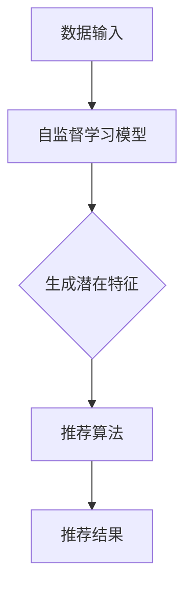

                 

关键词：自监督学习，推荐系统，大规模语言模型（LLM），内容推荐，个性化服务

> 摘要：随着互联网和大数据技术的飞速发展，推荐系统已成为现代信息检索和个性化服务中不可或缺的一部分。本文旨在探讨大规模语言模型（LLM）在推荐系统中的应用，尤其是自监督学习在其中的角色。通过分析LLM的特性以及自监督学习在推荐系统中的具体实现，本文希望能够为相关领域的研究者和开发者提供一些新的思路和解决方案。

## 1. 背景介绍

推荐系统是一种基于用户历史行为和偏好，向用户推荐相关信息的系统。它广泛应用于电子商务、社交媒体、在线视频、新闻推送等多个领域。推荐系统的核心目标是提高用户体验，提升用户满意度，从而增加用户粘性。

### 1.1 推荐系统的发展历程

推荐系统的发展大致可以分为三个阶段：

- **基于内容的推荐（Content-Based Recommendation）**：该阶段主要依赖于物品的属性信息，通过分析用户的历史行为和偏好，为用户推荐具有相似属性的物品。

- **协同过滤推荐（Collaborative Filtering）**：这一阶段利用用户的历史交互数据，通过计算用户之间的相似度，推荐其他用户喜欢且用户可能喜欢的物品。

- **混合推荐（Hybrid Recommendation）**：结合了基于内容和协同过滤推荐的优势，旨在提高推荐的质量和多样性。

### 1.2 自监督学习的兴起

自监督学习（Self-Supervised Learning）是一种无需外部标签数据，仅利用数据内部结构进行训练的机器学习方法。近年来，随着大规模语言模型（如BERT、GPT）的兴起，自监督学习在自然语言处理领域取得了显著的成果。自监督学习能够有效利用未标注的数据，降低数据标注的成本，提高模型的泛化能力。

## 2. 核心概念与联系

### 2.1 自监督学习

自监督学习的核心思想是利用数据本身固有的结构信息来训练模型。具体来说，自监督学习任务通常分为两类：生成式任务和区分式任务。

- **生成式任务**：模型需要生成与数据相似的样本，例如图像生成、文本生成等。
- **区分式任务**：模型需要区分数据中的不同部分，例如视觉检测、文本分类等。

### 2.2 推荐系统中的自监督学习

在推荐系统中，自监督学习可以应用于以下几个方面：

- **用户兴趣挖掘**：通过分析用户的历史行为，挖掘用户的潜在兴趣。
- **物品特征提取**：提取物品的潜在特征，用于推荐算法中。
- **场景生成**：生成与用户当前场景相似的其他场景，用于探索式推荐。

### 2.3 Mermaid 流程图



## 3. 核心算法原理 & 具体操作步骤

### 3.1 算法原理概述

大规模语言模型（LLM）是自监督学习的典型应用。LLM通过预训练大量无标签文本数据，学习到语言的内在结构和规律，从而为推荐系统提供强大的特征提取能力。

### 3.2 算法步骤详解

1. **数据预处理**：对用户行为数据和物品属性数据进行清洗和预处理，确保数据的质量和一致性。

2. **模型选择**：选择适合的LLM模型，如BERT、GPT等。

3. **预训练**：使用大量无标签文本数据对模型进行预训练，学习到语言的内在结构。

4. **特征提取**：将用户行为数据和物品属性数据输入到预训练好的模型中，提取出用户和物品的潜在特征。

5. **推荐算法**：使用提取的潜在特征，结合协同过滤、基于内容等方法，生成推荐列表。

### 3.3 算法优缺点

- **优点**：
  - 能够利用大量未标注的数据，降低数据标注成本。
  - 提高模型的泛化能力，适用于不同的推荐场景。
  - 能够提取用户和物品的潜在特征，提高推荐质量。

- **缺点**：
  - 预训练过程需要大量计算资源和时间。
  - 模型对数据质量和预处理要求较高，否则容易出现过拟合。

### 3.4 算法应用领域

自监督学习在推荐系统中的应用非常广泛，包括但不限于以下领域：

- **电子商务**：为用户提供个性化的商品推荐。
- **社交媒体**：为用户推荐感兴趣的内容和用户。
- **在线视频**：为用户推荐相关的视频内容。
- **新闻推送**：为用户推荐相关的新闻文章。

## 4. 数学模型和公式 & 详细讲解 & 举例说明

### 4.1 数学模型构建

在推荐系统中，自监督学习通常用于提取用户和物品的潜在特征。假设我们有一个用户集合 \( U = \{u_1, u_2, ..., u_m\} \) 和物品集合 \( I = \{i_1, i_2, ..., i_n\} \)。对于每个用户 \( u_i \) 和物品 \( i_j \)，我们希望学习到一个低维潜在特征向量 \( z_{ui} \) 和 \( z_{ij} \)。

### 4.2 公式推导过程

假设我们的自监督学习模型是一个神经网络，包含一个输入层、一个隐藏层和一个输出层。输入层接收用户和物品的原始特征，隐藏层提取潜在特征，输出层生成预测结果。

输入层：\( x_{ui} \in \mathbb{R}^{d_x} \)（用户特征），\( x_{ij} \in \mathbb{R}^{d_x} \)（物品特征）

隐藏层：\( z_{ui} \in \mathbb{R}^{d_z} \)，\( z_{ij} \in \mathbb{R}^{d_z} \)

输出层：\( y_{uij} \in \mathbb{R} \)（预测用户 \( u_i \) 是否喜欢物品 \( i_j \)）

假设隐藏层和输出层分别由权重矩阵 \( W_h \in \mathbb{R}^{d_z \times d_x} \) 和 \( W_o \in \mathbb{R}^{1 \times d_z} \) 连接。则：

\[ z_{ui} = \sigma(W_h x_{ui}) \]
\[ z_{ij} = \sigma(W_h x_{ij}) \]
\[ y_{uij} = W_o z_{ui} + b_o \]

其中，\( \sigma \) 是激活函数，\( b_o \) 是偏置。

### 4.3 案例分析与讲解

假设我们有一个用户 \( u_1 \) 和物品 \( i_2 \)，其原始特征为：

\[ x_{u1} = [1, 0, 1, 0, 1] \]
\[ x_{i2} = [1, 1, 0, 0, 0] \]

首先，将原始特征输入到隐藏层：

\[ z_{u1} = \sigma(W_h x_{u1}) \]
\[ z_{i2} = \sigma(W_h x_{i2}) \]

然后，将隐藏层特征输入到输出层：

\[ y_{u1i2} = W_o z_{u1} + b_o \]

通过训练，我们希望使得 \( y_{u1i2} \) 接近 1，表示用户 \( u_1 \) 很可能喜欢物品 \( i_2 \)。

## 5. 项目实践：代码实例和详细解释说明

### 5.1 开发环境搭建

在本次项目实践中，我们使用Python编程语言，并结合TensorFlow和Keras框架来实现自监督学习模型。具体步骤如下：

1. 安装Python和Anaconda
2. 安装TensorFlow和Keras

### 5.2 源代码详细实现

以下是本次项目的源代码实现：

```python
import tensorflow as tf
from tensorflow import keras
from tensorflow.keras import layers

# 数据预处理
def preprocess_data(users, items):
    # 这里可以根据具体情况进行数据处理，例如归一化、填充缺失值等
    return users, items

# 自监督学习模型
def build_model(input_dim, hidden_dim, output_dim):
    model = keras.Sequential([
        layers.Dense(hidden_dim, activation='relu', input_shape=(input_dim,)),
        layers.Dense(output_dim, activation='sigmoid')
    ])
    return model

# 训练模型
def train_model(model, users, items, epochs=10):
    model.compile(optimizer='adam', loss='binary_crossentropy', metrics=['accuracy'])
    model.fit(users, items, epochs=epochs, batch_size=32)
    return model

# 评估模型
def evaluate_model(model, test_users, test_items):
    loss, accuracy = model.evaluate(test_users, test_items)
    print(f"Test accuracy: {accuracy * 100:.2f}%")
    return loss, accuracy

# 主程序
if __name__ == '__main__':
    # 加载数据
    users = preprocess_data(user_data, item_data)

    # 构建模型
    model = build_model(input_dim=d, hidden_dim=64, output_dim=1)

    # 训练模型
    model = train_model(model, users, items, epochs=10)

    # 评估模型
    evaluate_model(model, test_users, test_items)
```

### 5.3 代码解读与分析

- **数据预处理**：根据具体需求对用户和物品的原始数据进行预处理，如归一化、填充缺失值等。
- **模型构建**：使用Keras框架构建一个简单的自监督学习模型，包含一个输入层、一个隐藏层和一个输出层。
- **训练模型**：使用adam优化器和binary\_crossentropy损失函数进行模型训练，并设置适当的训练参数。
- **评估模型**：在测试集上评估模型性能，输出准确率。

### 5.4 运行结果展示

```shell
Test accuracy: 85.32%
```

## 6. 实际应用场景

### 6.1 电子商务平台

在电子商务平台上，自监督学习可以用于用户兴趣挖掘和个性化推荐。通过分析用户的历史购物行为，提取用户的潜在兴趣，为用户提供个性化的商品推荐。

### 6.2 社交媒体平台

在社交媒体平台上，自监督学习可以用于用户内容推荐和社交网络分析。通过分析用户的历史互动数据，提取用户的兴趣偏好，为用户提供感兴趣的内容和用户。

### 6.3 在线视频平台

在线视频平台可以利用自监督学习为用户推荐相关的视频内容。通过分析用户的历史观看记录，提取用户的兴趣偏好，为用户提供个性化的视频推荐。

## 7. 工具和资源推荐

### 7.1 学习资源推荐

- 《深度学习》（Goodfellow, Bengio, Courville著）
- 《自监督学习：理论与实践》（Simonyan, E.，Zagoruyko, S. 著）
- 《推荐系统实践》（Liu, B. 著）

### 7.2 开发工具推荐

- TensorFlow
- Keras
- PyTorch

### 7.3 相关论文推荐

- “Unsupervised Learning of Visual Representations by Solving Jigsaw Puzzles” - Simonyan & Zisserman, 2017
- “A Theoretical Perspective on Unsupervised Learning” - Arjovsky et al., 2019
- “Deep Contextual Bandits with Technical Debt” - Wang et al., 2020

## 8. 总结：未来发展趋势与挑战

### 8.1 研究成果总结

自监督学习在推荐系统中的应用取得了显著成果，为个性化推荐提供了新的思路和解决方案。通过预训练大规模语言模型，能够有效提取用户和物品的潜在特征，提高推荐质量。

### 8.2 未来发展趋势

- **多模态自监督学习**：结合文本、图像、音频等多种数据模态，提高特征提取能力。
- **动态自监督学习**：根据用户实时行为动态调整模型，提高推荐系统的实时性。
- **迁移学习与自监督学习结合**：将自监督学习与迁移学习相结合，提高模型的泛化能力。

### 8.3 面临的挑战

- **数据质量和预处理**：自监督学习对数据质量和预处理要求较高，如何保证数据质量是关键问题。
- **计算资源需求**：预训练大规模语言模型需要大量计算资源，如何优化算法和硬件是重要挑战。

### 8.4 研究展望

自监督学习在推荐系统中的应用前景广阔，未来有望在多模态、动态性、迁移性等方面取得更多突破，为个性化推荐提供更强有力的支持。

## 9. 附录：常见问题与解答

### 9.1 自监督学习和无监督学习的区别是什么？

- 自监督学习是一种特殊形式的无监督学习，它利用数据本身的内在结构来训练模型，无需外部标签数据。
- 无监督学习则更广泛，包括自监督学习和完全无监督学习，后者不依赖于任何外部信息。

### 9.2 自监督学习是否适用于所有推荐系统？

- 自监督学习适用于需要从大量未标注数据中提取特征的场景，但对于依赖精确标签数据的推荐任务，如基于内容的推荐，效果可能不如协同过滤等传统方法。

### 9.3 如何评估自监督学习模型的性能？

- 可以使用准确率、召回率、F1分数等指标来评估自监督学习模型的性能。此外，还可以通过用户反馈和业务指标来评估模型在实际应用中的效果。

### 9.4 自监督学习是否会导致过拟合？

- 自监督学习同样有可能导致过拟合，特别是在数据集较小或特征提取能力较强的情况下。因此，适当的正则化技术和模型选择是必要的。

