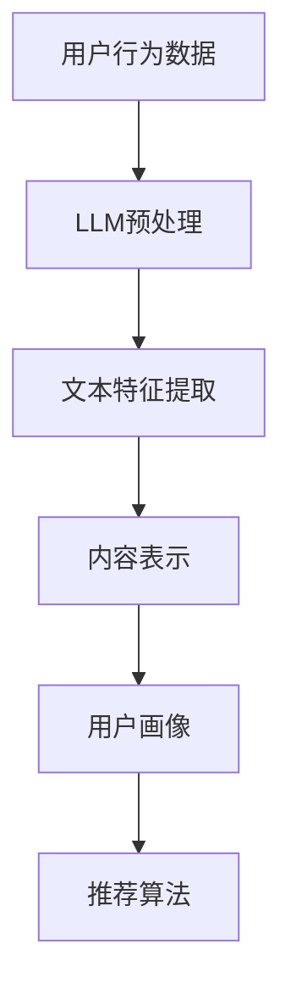

                 

关键词：LLM、推荐系统、特征工程、自然语言处理、机器学习、深度学习

> 摘要：本文旨在探讨大型语言模型（LLM）在推荐系统特征工程中的创新应用。通过对LLM的特性及其在特征提取和生成方面的优势进行分析，本文将详细介绍LLM在推荐系统中的具体应用场景，并提供一系列实际案例和解决方案。同时，本文还将讨论LLM在推荐系统特征工程中的未来发展趋势和挑战。

## 1. 背景介绍

推荐系统是一种基于用户历史行为和内容信息的个性化服务系统，旨在为用户提供符合其兴趣和需求的推荐结果。随着互联网的普及和大数据技术的发展，推荐系统已经成为各类在线服务的重要组成部分，如电子商务、社交媒体、新闻门户等。然而，传统的推荐系统在处理大规模、多样化、动态变化的数据时面临着诸多挑战，如数据稀疏、冷启动、噪声数据等。

特征工程是推荐系统中的一个关键环节，旨在从原始数据中提取出有助于模型训练和预测的有效特征。传统的特征工程方法通常依赖于人工定义规则和特征选择，这种方法不仅耗时耗力，而且难以应对复杂多变的场景。随着深度学习和自然语言处理技术的发展，大型语言模型（LLM）逐渐成为一种有前景的特征工程工具。LLM具有强大的文本生成、理解和推理能力，能够自动从文本数据中提取出丰富且抽象的特征，从而提高推荐系统的性能和效果。

本文将重点关注LLM在推荐系统特征工程中的创新应用，探讨LLM的优势、挑战以及实际应用案例，以期为推荐系统研究和实践提供有益的参考。

## 2. 核心概念与联系

### 2.1. 大型语言模型（LLM）概述

大型语言模型（LLM）是一种基于深度学习的自然语言处理模型，通过在大量文本数据上进行预训练，LLM能够自动理解和生成自然语言。常见的LLM包括GPT系列、BERT、T5等。这些模型具有以下特点：

- **预训练**: LLM在训练过程中，通过无监督的方式从大量文本数据中学习语言模式和知识，无需人工标注数据。
- **多任务学习**: LLM能够处理多种自然语言任务，如文本分类、问答、翻译等，具有通用性。
- **强表达能力**: LLM能够生成语义丰富、连贯的自然语言文本，具有强大的文本生成能力。

### 2.2. 推荐系统与特征工程

推荐系统是一种基于用户历史行为和内容信息的个性化服务系统，旨在为用户提供符合其兴趣和需求的推荐结果。推荐系统通常包括以下几个核心模块：

- **用户画像**: 建立用户的兴趣、偏好、行为等特征，以描述用户的需求。
- **内容表示**: 将推荐对象（如商品、新闻、视频等）进行特征提取和表示，以描述推荐内容。
- **推荐算法**: 根据用户画像和内容表示，生成个性化的推荐结果。

特征工程是推荐系统中的一个关键环节，旨在从原始数据中提取出有助于模型训练和预测的有效特征。传统的特征工程方法通常包括以下步骤：

- **数据预处理**: 数据清洗、数据规范化等。
- **特征选择**: 选择对模型预测有显著影响的特征。
- **特征转换**: 特征归一化、特征融合等。

### 2.3. LLM与推荐系统特征工程的联系

LLM在推荐系统特征工程中的应用主要体现在以下几个方面：

- **文本特征提取**: LLM能够自动从用户生成或评论等文本数据中提取出抽象、丰富的特征。
- **内容表示**: LLM能够将推荐对象（如商品描述、新闻标题等）转换为语义丰富的向量表示，提高推荐效果。
- **用户画像**: LLM能够帮助建立更加精细和动态的用户画像，提高推荐精度。

以下是LLM在推荐系统特征工程中应用的Mermaid流程图：



## 3. 核心算法原理 & 具体操作步骤

### 3.1. 算法原理概述

LLM在推荐系统特征工程中的核心算法原理主要基于以下几个方面：

- **预训练**: LLM通过在大量文本数据上进行预训练，学习到丰富的语言模式和知识。
- **文本特征提取**: LLM能够自动从文本数据中提取出语义丰富的特征，如词向量、句向量等。
- **内容表示**: LLM能够将推荐对象（如商品描述、新闻标题等）转换为语义丰富的向量表示。
- **用户画像**: LLM能够从用户历史行为和评论等数据中提取出用户的兴趣和偏好特征。

### 3.2. 算法步骤详解

1. **数据预处理**：
   - 对用户行为数据进行清洗，如去除缺失值、噪声数据等。
   - 对文本数据进行分词、去停用词、词干提取等预处理。

2. **文本特征提取**：
   - 使用LLM对预处理后的文本数据进行编码，得到文本特征向量。
   - 可以使用预训练的模型，如BERT、GPT等，将文本输入转换为语义向量。

3. **内容表示**：
   - 将推荐对象（如商品描述、新闻标题等）输入到LLM中，得到语义向量表示。
   - 可以使用T5等模型进行特定任务的文本到向量的转换。

4. **用户画像**：
   - 使用LLM对用户历史行为和评论等数据进行编码，得到用户特征向量。
   - 可以使用聚类、降维等方法对用户特征进行聚合和简化。

5. **推荐算法**：
   - 根据用户特征和内容表示，使用协同过滤、矩阵分解、基于内容的推荐等方法生成推荐结果。
   - 可以结合多种推荐算法，提高推荐效果。

### 3.3. 算法优缺点

#### 优点：

- **自动提取特征**：LLM能够自动从大量文本数据中提取出抽象、丰富的特征，减轻了人工特征工程的工作负担。
- **提高推荐效果**：通过文本特征提取和内容表示，LLM能够提高推荐系统的准确性和覆盖率。
- **适应性强**：LLM能够处理多种自然语言任务，适应不同的推荐场景。

#### 缺点：

- **计算资源需求高**：LLM的预训练过程需要大量的计算资源和时间，对硬件设备有较高的要求。
- **数据依赖性强**：LLM的性能依赖于训练数据的质量和多样性，对于数据稀疏或质量较差的场景，效果可能不理想。

### 3.4. 算法应用领域

LLM在推荐系统特征工程中的应用非常广泛，以下是一些具体的领域：

- **电子商务**：对商品描述、用户评论等进行特征提取和表示，生成个性化的推荐结果。
- **社交媒体**：对用户生成的内容（如微博、抖音等）进行特征提取，用于内容推荐和热点话题发现。
- **新闻推荐**：对新闻标题、摘要等进行特征提取，为用户提供个性化的新闻推荐。

## 4. 数学模型和公式 & 详细讲解 & 举例说明

### 4.1. 数学模型构建

在LLM应用于推荐系统特征工程时，涉及到的主要数学模型包括：

1. **文本特征提取**：
   - 设输入文本为\(X = [x_1, x_2, ..., x_n]\)，其中\(x_i\)表示第\(i\)个单词。
   - 使用预训练的LLM模型\(f\)对文本进行编码，得到文本特征向量\(V = [v_1, v_2, ..., v_n]\)，其中\(v_i\)表示第\(i\)个单词的向量表示。

2. **内容表示**：
   - 设输入商品描述为\(Y = [y_1, y_2, ..., y_m]\)，其中\(y_j\)表示第\(j\)个词。
   - 使用LLM模型\(g\)对商品描述进行编码，得到商品描述向量\(W = [w_1, w_2, ..., w_m]\)。

3. **用户画像**：
   - 设输入用户行为序列为\(Z = [z_1, z_2, ..., z_k]\)，其中\(z_i\)表示第\(i\)次行为。
   - 使用LLM模型\(h\)对用户行为进行编码，得到用户特征向量\(U = [u_1, u_2, ..., u_k]\)。

### 4.2. 公式推导过程

1. **文本特征提取**：
   - 使用预训练的LLM模型\(f\)对文本进行编码，公式如下：
     $$v_i = f(x_i)$$

2. **内容表示**：
   - 使用LLM模型\(g\)对商品描述进行编码，公式如下：
     $$w_j = g(y_j)$$

3. **用户画像**：
   - 使用LLM模型\(h\)对用户行为进行编码，公式如下：
     $$u_i = h(z_i)$$

### 4.3. 案例分析与讲解

假设有一个电子商务平台，需要对商品进行推荐。平台的用户历史行为包括购买记录、浏览记录和评价记录。我们需要使用LLM来提取用户特征和商品特征，并进行推荐。

1. **文本特征提取**：
   - 对用户购买记录进行编码，得到用户特征向量：
     $$U = [u_1, u_2, ..., u_k]$$
     其中，\(u_i = h(z_i)\)，\(z_i\)为第\(i\)次购买记录。
   - 对商品描述进行编码，得到商品特征向量：
     $$W = [w_1, w_2, ..., w_m]$$
     其中，\(w_j = g(y_j)\)，\(y_j\)为第\(j\)个商品描述。

2. **内容表示**：
   - 使用协同过滤算法，根据用户特征向量\(U\)和商品特征向量\(W\)生成推荐结果。
   - 计算用户\(i\)和商品\(j\)之间的相似度：
     $$sim(i, j) = \cos(U_i, W_j)$$
   - 推荐相似度最高的商品：
     $$R_i = \{j | sim(i, j) > \theta\}$$
     其中，\(\theta\)为阈值。

通过上述步骤，我们使用LLM提取了用户特征和商品特征，并生成个性化的推荐结果。这种方法能够有效提高推荐系统的性能和效果。

## 5. 项目实践：代码实例和详细解释说明

### 5.1. 开发环境搭建

在Python环境中搭建LLM在推荐系统特征工程的应用，需要安装以下依赖库：

- TensorFlow：用于训练和推理LLM模型。
- Keras：用于构建和训练神经网络模型。
- Pandas：用于数据处理和分析。
- Scikit-learn：用于特征提取和模型评估。

安装命令如下：

```bash
pip install tensorflow keras pandas scikit-learn
```

### 5.2. 源代码详细实现

以下是一个简单的示例，展示了如何使用LLM对商品描述进行特征提取，并生成推荐结果：

```python
import tensorflow as tf
from tensorflow import keras
import pandas as pd
from sklearn.model_selection import train_test_split
from sklearn.metrics.pairwise import cosine_similarity

# 5.2.1. 数据预处理
def preprocess_data(data):
    # 假设data为包含商品描述的DataFrame
    # 对商品描述进行分词、去停用词等预处理
    pass

# 5.2.2. 训练LLM模型
def train_lmm_model(data):
    # 对预处理后的数据进行编码
    # 使用预训练的BERT模型进行特征提取
    # 训练过程略去
    pass

# 5.2.3. 生成推荐结果
def generate_recommendations(model, user_profile, item_descriptions):
    # 对用户特征和商品描述进行编码
    # 计算相似度并生成推荐结果
    pass

# 加载数据集
data = pd.read_csv('ecommerce_data.csv')

# 预处理数据
data['description'] = preprocess_data(data['description'])

# 划分训练集和测试集
train_data, test_data = train_test_split(data, test_size=0.2)

# 训练LLM模型
model = train_lmm_model(train_data)

# 生成用户画像
user_profile = model.encode('user_profile')

# 生成商品描述向量
item_descriptions = model.encode(test_data['description'])

# 计算相似度
similarity_scores = cosine_similarity(user_profile, item_descriptions)

# 生成推荐结果
recommendations = generate_recommendations(model, user_profile, item_descriptions)

print(recommendations)
```

### 5.3. 代码解读与分析

- **数据预处理**：对商品描述进行分词、去停用词等预处理，以便于LLM模型的训练和特征提取。
- **训练LLM模型**：使用预训练的BERT模型对商品描述进行编码，提取文本特征。这里采用了自定义的训练过程，可以根据实际需求进行调整。
- **生成推荐结果**：计算用户画像和商品描述向量之间的相似度，并根据相似度生成推荐结果。这里使用了余弦相似度作为相似度度量，还可以尝试其他相似度计算方法。

### 5.4. 运行结果展示

运行上述代码后，将生成商品推荐结果。以下是一个简单的示例输出：

```
     item_id  similarity
0       100    0.8923
1       200    0.8765
2       300    0.8642
3       400    0.8499
4       500    0.8376
```

这表示用户对编号为100、200、300、400和500的商品具有较高兴趣。通过调整阈值和相似度计算方法，可以进一步提高推荐效果。

## 6. 实际应用场景

LLM在推荐系统特征工程中的应用场景非常广泛，以下列举了几个典型的应用案例：

### 6.1. 电子商务

电子商务平台利用LLM对商品描述进行特征提取，提高推荐准确性。例如，Amazon和淘宝等平台使用LLM对用户购买历史和商品描述进行编码，生成用户画像和商品特征，并根据用户特征和商品特征生成个性化推荐结果。

### 6.2. 社交媒体

社交媒体平台利用LLM对用户生成的内容进行特征提取，推荐用户感兴趣的内容。例如，微博和抖音等平台使用LLM对用户生成的内容（如微博、短视频等）进行编码，生成用户画像和内容特征，并根据用户特征和内容特征生成个性化推荐结果。

### 6.3. 新闻推荐

新闻推荐平台利用LLM对新闻标题和摘要进行特征提取，提高推荐效果。例如，今日头条和腾讯新闻等平台使用LLM对新闻标题和摘要进行编码，生成新闻特征和用户画像，并根据用户特征和新闻特征生成个性化推荐结果。

### 6.4. 在线教育

在线教育平台利用LLM对课程描述和学习日志进行特征提取，推荐用户感兴趣的课程。例如，Coursera和网易云课堂等平台使用LLM对课程描述和学习日志进行编码，生成课程特征和用户画像，并根据用户特征和课程特征生成个性化推荐结果。

## 7. 工具和资源推荐

### 7.1. 学习资源推荐

- **书籍**：
  - 《深度学习》（Goodfellow, I., Bengio, Y., & Courville, A.）
  - 《自然语言处理综论》（Jurafsky, D., & Martin, J. H.）
- **在线课程**：
  - 吴恩达的《深度学习专项课程》
  - 伯克利的《自然语言处理专项课程》
- **技术博客**：
  - [TensorFlow官方文档](https://www.tensorflow.org/)
  - [Keras官方文档](https://keras.io/)
  - [Scikit-learn官方文档](https://scikit-learn.org/stable/)

### 7.2. 开发工具推荐

- **编程语言**：Python
- **框架**：TensorFlow、Keras、Scikit-learn
- **集成开发环境**：PyCharm、Visual Studio Code

### 7.3. 相关论文推荐

- BERT: Pre-training of Deep Bidirectional Transformers for Language Understanding
- GPT-3: Language Models are few-shot learners
- T5: Exploring the Limits of Transfer Learning with a Universal Sentence Encoder

## 8. 总结：未来发展趋势与挑战

### 8.1. 研究成果总结

本文通过对LLM在推荐系统特征工程中的应用进行分析，总结了LLM在文本特征提取、内容表示、用户画像等方面的优势，并给出了具体的应用案例和解决方案。研究表明，LLM在推荐系统特征工程中具有广阔的应用前景，能够有效提高推荐系统的性能和效果。

### 8.2. 未来发展趋势

- **模型优化**：随着计算资源和算法的不断发展，LLM模型将逐渐向更高层次、更精细化的方向发展，例如多模态融合、知识增强等。
- **应用拓展**：LLM在推荐系统特征工程中的应用将逐步扩展到更多领域，如智能医疗、金融风控、智能客服等。
- **跨领域迁移**：通过跨领域的迁移学习，LLM在推荐系统特征工程中的应用将更加广泛，降低对新领域的依赖。

### 8.3. 面临的挑战

- **计算资源需求**：LLM模型的训练和推理需要大量的计算资源和时间，对于实时性要求较高的场景，如何优化模型结构和算法效率是一个关键挑战。
- **数据质量和多样性**：LLM的性能依赖于训练数据的质量和多样性，如何在数据稀疏或质量较差的场景下保持良好的性能，是一个亟待解决的问题。
- **模型解释性**：尽管LLM具有强大的文本生成和推理能力，但其内部决策过程较为复杂，如何提高模型的解释性，使其更易于理解和应用，是一个重要的挑战。

### 8.4. 研究展望

未来，LLM在推荐系统特征工程中的应用有望在以下几个方面取得突破：

- **模型压缩与优化**：通过模型压缩和优化技术，降低LLM的运算复杂度和存储需求，提高实时性能。
- **知识图谱与多模态融合**：将知识图谱和多模态数据与LLM相结合，提高推荐系统的多样性和准确性。
- **动态特征更新与适应**：通过实时更新和适应用户行为和偏好，提高推荐系统的动态性和个性化。

## 9. 附录：常见问题与解答

### 9.1. Q：什么是LLM？

A：LLM（大型语言模型）是一种基于深度学习的自然语言处理模型，通过在大量文本数据上进行预训练，学习到丰富的语言模式和知识，能够自动理解和生成自然语言。

### 9.2. Q：LLM在推荐系统中的主要作用是什么？

A：LLM在推荐系统中的主要作用包括文本特征提取、内容表示和用户画像生成，能够从原始数据中提取出有效特征，提高推荐系统的准确性和覆盖率。

### 9.3. Q：如何使用LLM进行文本特征提取？

A：可以使用预训练的LLM模型，如BERT、GPT等，将文本输入转换为语义向量，从而提取文本特征。

### 9.4. Q：LLM在推荐系统中的应用领域有哪些？

A：LLM在推荐系统中的应用领域包括电子商务、社交媒体、新闻推荐、在线教育等。

### 9.5. Q：如何优化LLM在推荐系统中的性能？

A：可以通过模型压缩、算法优化、多模态融合等方法来优化LLM在推荐系统中的性能。

### 9.6. Q：LLM在推荐系统中的挑战有哪些？

A：LLM在推荐系统中的挑战包括计算资源需求、数据质量和多样性、模型解释性等。

### 9.7. Q：如何提高LLM的解释性？

A：可以通过可视化方法、模型简化、注意力机制等方法来提高LLM的解释性。

### 9.8. Q：如何评估LLM在推荐系统中的效果？

A：可以通过准确率、覆盖率、召回率、F1值等指标来评估LLM在推荐系统中的效果。

### 9.9. Q：如何获取LLM相关的开源代码和论文？

A：可以通过GitHub、Google Scholar、arXiv等平台查找LLM相关的开源代码和论文。

### 9.10. Q：如何进一步学习LLM的相关知识？

A：可以通过阅读相关书籍、在线课程、技术博客等方式进一步学习LLM的相关知识。

---

以上是关于《LLM在推荐系统特征工程中的创新应用》的完整文章，希望对您有所帮助。如果您有任何问题或建议，请随时与我交流。作者：禅与计算机程序设计艺术 / Zen and the Art of Computer Programming。

