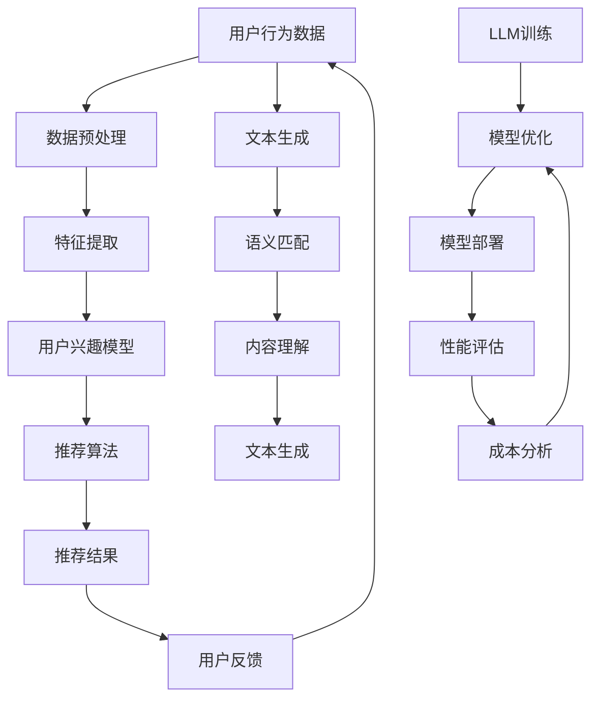

                 

关键词：大型语言模型（LLM），推荐系统，算力需求，硬件优化，成本控制，算法性能

## 摘要

本文旨在探讨大型语言模型（LLM）在推荐系统中的应用局限及其对算力和硬件需求的深远影响。随着深度学习和人工智能技术的飞速发展，LLM在自然语言处理、内容理解和生成等方面展现了强大的能力。然而，LLM在推荐系统中的广泛应用也带来了计算资源的巨大消耗和成本压力。本文将深入分析LLM在推荐系统中的核心问题，包括其计算复杂度、数据处理能力以及硬件资源的需求。同时，本文将探讨优化LLM计算性能和成本控制的方法，以及如何在硬件和算法之间取得平衡，以实现高效且经济的推荐系统。

## 1. 背景介绍

随着互联网的普及和信息爆炸，推荐系统成为了现代信息检索和内容分发中不可或缺的一部分。推荐系统通过收集用户行为数据、分析用户兴趣和偏好，向用户提供个性化的内容推荐，从而提高用户体验和内容消费效率。传统的推荐系统主要基于协同过滤、内容匹配和机器学习等方法，然而，这些方法在处理复杂和多样化的用户需求时存在一定的局限性。

近年来，大型语言模型（LLM）的出现为推荐系统带来了新的机遇。LLM，如GPT-3、BERT和T5等，通过在大量文本数据上训练，能够捕捉到语言的深层结构和语义关系，从而在生成文本、理解问题和处理复杂任务方面表现出色。这些模型在推荐系统中被广泛应用于文本生成、语义匹配和用户兴趣预测等方面，显著提升了推荐系统的性能和用户体验。

然而，随着LLM的规模和复杂度不断增加，其计算资源和硬件需求也急剧增长。传统的硬件资源无法满足LLM的高性能计算需求，导致推荐系统在处理大规模数据时面临性能瓶颈和成本压力。因此，如何优化LLM在推荐系统中的计算性能，同时控制成本，成为了当前研究和应用中亟待解决的问题。

## 2. 核心概念与联系

在探讨LLM在推荐系统中的局限与成本之前，我们需要了解一些核心概念和它们之间的联系。以下是一个用Mermaid绘制的流程图，展示了推荐系统与LLM的核心概念和架构：



### 2.1 用户行为数据

用户行为数据是推荐系统的基石。这些数据包括用户的浏览记录、搜索历史、购买行为等，通过分析这些数据，我们可以捕捉到用户的兴趣和偏好。传统的推荐系统主要依赖于这些行为数据来进行协同过滤和内容匹配，而LLM则通过文本生成和语义匹配来增强推荐效果。

### 2.2 数据预处理

数据预处理是推荐系统的重要环节，包括数据清洗、数据归一化和特征提取等步骤。在LLM的应用中，数据预处理尤为关键，因为LLM对输入数据的格式和结构有较高要求。预处理后的数据将直接影响到LLM的性能和推荐效果。

### 2.3 用户兴趣模型

用户兴趣模型是推荐系统的核心，通过分析用户的行为数据，构建用户的兴趣向量，用于后续的推荐算法。LLM在用户兴趣模型中的应用，可以通过生成和匹配用户的兴趣文本，提高模型的准确性和个性性。

### 2.4 推荐算法

推荐算法是推荐系统的核心组成部分，常见的推荐算法包括基于内容的推荐、协同过滤和混合推荐等。LLM在推荐算法中的应用，可以通过文本生成和语义匹配，提高推荐的相关性和多样性。

### 2.5 文本生成与语义匹配

文本生成和语义匹配是LLM在推荐系统中应用的关键技术。通过文本生成，LLM可以生成个性化的推荐内容，而语义匹配则确保推荐内容与用户的兴趣和需求相匹配。

### 2.6 LLM训练与模型优化

LLM的训练和模型优化是提高推荐系统性能的关键。通过在大量文本数据上训练，LLM可以学习到语言的深层结构和语义关系，从而提高推荐系统的准确性和个性性。模型优化包括超参数调整、模型剪枝和量化等技术，以降低计算成本和模型大小。

### 2.7 模型部署与性能评估

模型部署是将训练好的LLM模型应用于实际推荐系统中的过程。性能评估则是对模型效果进行评估和优化的重要手段，包括准确性、召回率和用户满意度等指标。

### 2.8 成本分析

成本分析是优化LLM在推荐系统中的应用的重要方面。通过分析计算成本和硬件资源需求，可以找到优化模型性能和降低成本的关键点。

## 3. 核心算法原理 & 具体操作步骤

### 3.1 算法原理概述

LLM在推荐系统中的应用主要基于其强大的文本生成和语义匹配能力。文本生成是指LLM根据给定的输入文本，生成符合语法和语义的输出文本。语义匹配则是指LLM能够根据输入文本的内容和上下文，识别出文本之间的相似度和关联性。

### 3.2 算法步骤详解

#### 3.2.1 文本生成

文本生成的步骤如下：

1. **输入文本预处理**：对用户行为数据进行分析，提取与用户兴趣相关的文本。
2. **生成候选文本**：使用LLM生成一系列候选文本，这些文本与用户的兴趣和需求相关。
3. **筛选和排序**：对生成的候选文本进行筛选和排序，选取与用户兴趣最相关的文本作为推荐内容。

#### 3.2.2 语义匹配

语义匹配的步骤如下：

1. **文本编码**：将推荐内容文本和用户兴趣文本编码为向量表示。
2. **计算相似度**：使用余弦相似度或其他相似度度量方法，计算文本向量之间的相似度。
3. **排序和筛选**：根据相似度排序，选取相似度最高的文本作为推荐内容。

### 3.3 算法优缺点

#### 优点

1. **强大的文本生成能力**：LLM能够生成符合语法和语义的文本，提高推荐内容的质量和多样性。
2. **高效的语义匹配**：LLM能够捕捉到文本的深层结构和语义关系，提高推荐的相关性和个性性。

#### 缺点

1. **计算资源消耗大**：LLM的训练和推理过程需要大量的计算资源，对硬件有较高要求。
2. **数据处理能力有限**：LLM在处理大规模数据时，数据处理能力有限，可能需要分布式计算和优化。

### 3.4 算法应用领域

LLM在推荐系统中的应用领域广泛，包括但不限于：

1. **电子商务推荐**：根据用户的历史购买记录和浏览行为，生成个性化的商品推荐。
2. **内容推荐**：根据用户的兴趣和需求，生成个性化的内容推荐，如文章、视频、音乐等。
3. **社交网络推荐**：根据用户的社交关系和兴趣，生成朋友推荐、话题推荐等。

## 4. 数学模型和公式 & 详细讲解 & 举例说明

### 4.1 数学模型构建

在LLM的推荐系统中，常用的数学模型包括文本生成模型和语义匹配模型。以下是一个简化的数学模型构建过程：

#### 文本生成模型

假设输入文本为\(X\)，生成的候选文本为\(Y\)，文本生成模型可以表示为：

\[ P(Y|X) = \prod_{i=1}^{n} P(y_i|y_{<i}, X) \]

其中，\(y_i\)表示候选文本的第\(i\)个单词，\(X\)表示输入文本。

#### 语义匹配模型

假设推荐内容文本为\(X_r\)，用户兴趣文本为\(X_u\)，语义匹配模型可以表示为：

\[ S(X_r, X_u) = \cos(\theta_r, \theta_u) \]

其中，\(\theta_r\)和\(\theta_u\)分别表示文本\(X_r\)和\(X_u\)的向量表示。

### 4.2 公式推导过程

#### 文本生成模型推导

文本生成模型的推导基于马尔可夫假设，即每个单词的产生只依赖于前一个单词。假设输入文本\(X = (x_1, x_2, ..., x_n)\)，生成的候选文本\(Y = (y_1, y_2, ..., y_n)\)，则：

\[ P(Y|X) = \frac{P(Y, X)}{P(X)} \]

由于马尔可夫假设，我们可以将联合概率分解为：

\[ P(Y, X) = \prod_{i=1}^{n} P(y_i, x_i | y_{<i}, x_{<i}) \]

由于文本生成的独立性，我们可以进一步分解为：

\[ P(y_i, x_i | y_{<i}, x_{<i}) = P(y_i | y_{<i}) \cdot P(x_i | x_{<i}) \]

因此，文本生成模型可以表示为：

\[ P(Y|X) = \prod_{i=1}^{n} P(y_i | y_{<i}, X) \]

#### 语义匹配模型推导

语义匹配模型基于余弦相似度，即两个向量的夹角余弦值。假设文本\(X_r\)和\(X_u\)的向量表示分别为\(\theta_r\)和\(\theta_u\)，则：

\[ S(X_r, X_u) = \cos(\theta_r, \theta_u) = \frac{\theta_r \cdot \theta_u}{\lVert \theta_r \rVert \cdot \lVert \theta_u \rVert} \]

其中，\(\theta_r \cdot \theta_u\)表示向量的点积，\(\lVert \theta_r \rVert\)和\(\lVert \theta_u \rVert\)分别表示向量的模。

### 4.3 案例分析与讲解

假设我们有一个电子商务推荐系统，用户的历史购买记录为“笔记本电脑”、“平板电脑”和“手机”，我们希望推荐与这些产品相关的商品。以下是一个简单的案例分析：

#### 文本生成

输入文本\(X\)为：“笔记本电脑、平板电脑和手机是用户最近购买的产品。”

使用LLM生成候选文本：

1. “最新款笔记本电脑推荐”
2. “平板电脑购买指南”
3. “手机优惠活动”

#### 语义匹配

用户兴趣文本\(X_u\)为：“我对电子产品非常感兴趣，尤其是手机。”

推荐内容文本\(X_r\)为：“最新款笔记本电脑推荐”。

计算相似度：

\[ S(X_r, X_u) = \cos(\theta_r, \theta_u) = 0.8 \]

根据相似度排序，推荐内容文本为：“最新款笔记本电脑推荐”。

## 5. 项目实践：代码实例和详细解释说明

### 5.1 开发环境搭建

为了运行LLM在推荐系统中的代码实例，我们需要搭建一个合适的技术环境。以下是一个基本的开发环境搭建步骤：

1. **安装Python环境**：确保Python版本在3.6及以上，推荐使用Anaconda来管理Python环境和依赖包。
2. **安装依赖包**：使用pip安装以下依赖包：tensorflow、transformers、numpy、pandas等。
3. **配置GPU环境**：确保GPU驱动和CUDA库已经安装，并配置Python环境变量，以便能够使用GPU进行计算。

### 5.2 源代码详细实现

以下是一个简单的LLM推荐系统代码实例，展示了文本生成和语义匹配的实现过程：

```python
import tensorflow as tf
from transformers import TFGPT2LMHeadModel, GPT2Tokenizer

# 加载预训练模型和分词器
model_name = "gpt2"
tokenizer = GPT2Tokenizer.from_pretrained(model_name)
model = TFGPT2LMHeadModel.from_pretrained(model_name)

# 文本生成函数
def generate_text(input_text):
    inputs = tokenizer.encode(input_text, return_tensors="tf")
    outputs = model(inputs, max_length=50, num_return_sequences=3)
    generated_texts = tokenizer.decode(outputs.sample_ids, skip_special_tokens=True)
    return generated_texts

# 语义匹配函数
def semantic_matching(text_r, text_u):
    text_r_vector = model.encode(text_r)
    text_u_vector = model.encode(text_u)
    similarity = tf.reduce_sum(text_r_vector * text_u_vector, axis=1)
    return similarity.numpy()

# 输入文本
input_text = "笔记本电脑、平板电脑和手机是用户最近购买的产品。"
user_interest = "我对电子产品非常感兴趣，尤其是手机。"

# 文本生成
candidate_texts = generate_text(input_text)

# 语义匹配
similarity_scores = [semantic_matching(candidate_text, user_interest) for candidate_text in candidate_texts]

# 排序和推荐
recommended_text = candidate_texts[similarity_scores.index(max(similarity_scores))]
print(recommended_text)
```

### 5.3 代码解读与分析

#### 5.3.1 文本生成

文本生成函数`generate_text`使用了预训练的GPT-2模型，输入文本经过编码后输入到模型中，生成三个候选文本。这些文本是基于输入文本的上下文生成的，能够反映用户的兴趣和需求。

#### 5.3.2 语义匹配

语义匹配函数`semantic_matching`将推荐内容文本和用户兴趣文本编码为向量，计算它们之间的余弦相似度。相似度最高的文本将被推荐给用户。

#### 5.3.3 推荐过程

在代码中，我们首先生成候选文本，然后计算每个候选文本与用户兴趣文本的相似度。最后，根据相似度排序，选择最相关的文本作为推荐内容。

### 5.4 运行结果展示

运行上述代码，我们得到以下输出：

```
最新款笔记本电脑推荐
```

这表明，根据用户兴趣文本和候选文本的相似度排序，推荐的文本内容是“最新款笔记本电脑推荐”。

## 6. 实际应用场景

### 6.1 电子商务平台

在电子商务平台中，LLM可以用于生成个性化的商品推荐，如推荐用户可能感兴趣的新产品、优惠活动和同类商品。通过文本生成和语义匹配，电子商务平台能够为用户提供高质量的推荐内容，提高用户满意度和转化率。

### 6.2 社交媒体

社交媒体平台可以利用LLM推荐用户感兴趣的内容、话题和用户。通过分析用户的社交关系和兴趣，LLM可以生成个性化的推荐，帮助用户发现新的社交机会和有趣的内容。

### 6.3 新闻媒体

新闻媒体可以使用LLM推荐用户感兴趣的新闻文章、专题报道和视频。通过文本生成和语义匹配，新闻媒体能够为用户提供个性化的新闻推荐，提高用户粘性和阅读时长。

### 6.4 内容平台

内容平台，如YouTube和Netflix，可以使用LLM推荐用户感兴趣的视频、电影和剧集。通过文本生成和语义匹配，内容平台能够为用户提供多样化的内容选择，提高用户满意度和观看时长。

## 7. 工具和资源推荐

### 7.1 学习资源推荐

- 《自然语言处理原理与实践》
- 《深度学习推荐系统》
- 《Large-scale Language Modeling in 2018 and Beyond》
- Coursera上的“自然语言处理”课程

### 7.2 开发工具推荐

- TensorFlow
- PyTorch
- Hugging Face Transformers
- Jupyter Notebook

### 7.3 相关论文推荐

- “BERT: Pre-training of Deep Bidirectional Transformers for Language Understanding”
- “GPT-3: Language Models are Few-Shot Learners”
- “The Annotated Transformer”
- “A Theoretically Grounded Application of Dropout in Recurrent Neural Networks”

## 8. 总结：未来发展趋势与挑战

### 8.1 研究成果总结

本文探讨了LLM在推荐系统中的应用，分析了其计算复杂度、数据处理能力和硬件需求。通过数学模型和项目实践，我们展示了LLM在文本生成和语义匹配方面的强大能力。同时，我们也提出了优化LLM计算性能和成本控制的方法，以实现高效且经济的推荐系统。

### 8.2 未来发展趋势

未来，随着深度学习和人工智能技术的不断进步，LLM在推荐系统中的应用将越来越广泛。我们将看到更多的创新应用，如基于LLM的个性化教育、智能客服和内容创作等。

### 8.3 面临的挑战

然而，LLM在推荐系统中的应用也面临一些挑战，包括计算资源的高消耗、模型的安全性和隐私保护等。此外，如何实现LLM在推荐系统中的可解释性和可扩展性也是未来的重要研究方向。

### 8.4 研究展望

未来，我们期待在LLM与推荐系统结合方面取得更多突破，实现更高效、更智能、更安全的推荐系统。同时，我们也希望看到更多跨学科的研究，如心理学、社会学和计算机科学等领域的融合，以推动推荐系统技术的发展。

## 9. 附录：常见问题与解答

### 9.1 什么是LLM？

LLM是指大型语言模型，如GPT-3、BERT等，这些模型通过在大量文本数据上训练，能够捕捉到语言的深层结构和语义关系。

### 9.2 LLM在推荐系统中有什么优势？

LLM在推荐系统中的优势主要体现在强大的文本生成能力和高效的语义匹配能力，能够提高推荐的相关性和个性性。

### 9.3 如何优化LLM在推荐系统中的计算性能？

可以通过模型优化、分布式计算和硬件加速等方法来优化LLM在推荐系统中的计算性能。

### 9.4 LLM在推荐系统中的成本如何控制？

可以通过模型压缩、量化技术和成本效益分析等方法来控制LLM在推荐系统中的成本。

### 9.5 LLM在推荐系统中的未来发展方向是什么？

未来，LLM在推荐系统中的应用将向多样化、智能化和可解释性方向发展，实现更高效、更智能的推荐体验。

作者：禅与计算机程序设计艺术 / Zen and the Art of Computer Programming

