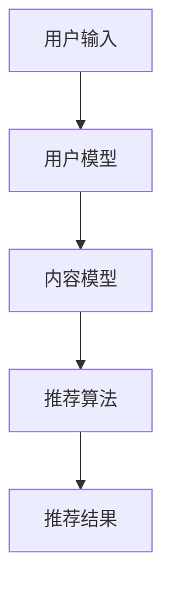

                 

关键词：大型语言模型（LLM），推荐系统，多样性，可扩展性，算法，应用场景，实践案例，资源推荐

> 摘要：本文将探讨大型语言模型（LLM）在推荐系统中的应用，特别是在提高推荐系统的多样性和可扩展性方面的作用。通过深入分析LLM的核心概念、算法原理、数学模型以及实际应用案例，我们将探讨如何利用LLM技术构建高效、智能的推荐系统，并展望其未来的发展趋势和挑战。

## 1. 背景介绍

随着互联网和大数据技术的快速发展，推荐系统已经成为了现代信息检索和个性化服务的重要组成部分。然而，传统的推荐系统往往面临着多样性和可扩展性的挑战。多样性指的是推荐系统为用户提供多样化、个性化的内容，而可扩展性则是指系统在处理海量数据和用户需求时的高效性。

近年来，大型语言模型（LLM）的发展为推荐系统带来了新的机遇。LLM具有强大的文本理解和生成能力，可以有效地处理大规模的文本数据，为推荐系统提供丰富的特征和强大的预测能力。本文将重点探讨LLM在推荐系统中的应用，特别是如何提高系统的多样性和可扩展性。

## 2. 核心概念与联系

### 2.1 大型语言模型（LLM）

#### 2.1.1 核心概念

大型语言模型（LLM）是一种基于神经网络的语言模型，通过大规模的文本数据进行训练，能够理解并生成自然语言。LLM的核心目标是模拟人类语言处理的能力，包括语义理解、语言生成和文本分类等。

#### 2.1.2 工作原理

LLM的工作原理主要包括两个部分：编码器和解码器。编码器将输入的文本转换为向量表示，解码器则根据这些向量表示生成对应的文本。通过深度学习算法，LLM能够自动学习文本中的语言规律和结构，从而实现高效的文本处理。

### 2.2 推荐系统

#### 2.2.1 核心概念

推荐系统是一种基于数据挖掘和机器学习技术的信息系统，旨在根据用户的兴趣和行为，为用户推荐符合其需求的内容。推荐系统的核心目标是提高用户满意度，提高内容曝光率和转化率。

#### 2.2.2 工作原理

推荐系统通常包括三个主要模块：用户模型、内容模型和推荐算法。用户模型用于捕捉用户的行为和兴趣，内容模型用于描述推荐内容的特征，推荐算法则根据用户模型和内容模型生成推荐结果。

### 2.3 核心概念原理与架构的 Mermaid 流程图



## 3. 核心算法原理 & 具体操作步骤

### 3.1 算法原理概述

LLM在推荐系统中的应用主要基于其强大的文本处理能力。通过训练大规模的文本数据，LLM可以捕捉到文本中的潜在语义信息，从而为推荐系统提供丰富的特征。具体来说，LLM可以通过以下步骤应用于推荐系统：

1. 文本预处理：对用户输入的文本进行清洗、分词和去停用词等预处理操作，将文本转换为可供LLM处理的格式。
2. 特征提取：使用LLM对预处理后的文本进行编码，提取出文本的潜在特征向量。
3. 用户兴趣建模：将用户输入的文本和用户的浏览、购买等行为数据结合，使用LLM生成用户兴趣模型。
4. 内容特征提取：对推荐内容进行编码，提取出内容的特征向量。
5. 推荐结果生成：利用用户兴趣模型和内容特征向量，使用推荐算法生成推荐结果。

### 3.2 算法步骤详解

1. **文本预处理**：

    - 清洗：去除文本中的特殊字符、标点符号和HTML标签等。
    - 分词：将文本分割成一个个词语或短语。
    - 去停用词：去除对文本语义影响较小的常见单词，如“的”、“了”等。

2. **特征提取**：

    - 使用LLM将预处理后的文本转换为向量表示，常用的方法有BERT、GPT等。
    - 提取文本的潜在特征向量，用于描述文本的语义信息。

3. **用户兴趣建模**：

    - 结合用户的历史行为数据（如浏览、购买等），使用LLM生成用户兴趣模型。
    - 用户兴趣模型可以用来预测用户对特定内容的兴趣程度。

4. **内容特征提取**：

    - 使用LLM对推荐内容进行编码，提取出内容的特征向量。
    - 内容特征向量用于描述推荐内容的语义信息。

5. **推荐结果生成**：

    - 使用推荐算法（如基于协同过滤、基于内容的推荐等）生成推荐结果。
    - 推荐结果可以根据用户兴趣模型和内容特征向量的相似度进行排序。

### 3.3 算法优缺点

#### 优点：

- **提高多样性**：LLM能够捕捉到文本中的潜在语义信息，从而为推荐系统提供丰富的特征，有助于提高推荐结果的多样性。
- **增强可扩展性**：LLM具有强大的文本处理能力，可以处理大规模的文本数据，提高了推荐系统的可扩展性。
- **提高准确性**：通过结合用户行为数据和文本特征，LLM可以生成更准确的用户兴趣模型，从而提高推荐结果的准确性。

#### 缺点：

- **计算资源消耗**：LLM的训练和推理过程需要大量的计算资源，可能导致系统性能下降。
- **数据依赖性**：LLM的性能依赖于训练数据的质量和数量，数据不足或质量较低可能影响系统的效果。

### 3.4 算法应用领域

LLM在推荐系统中的应用非常广泛，可以应用于多个领域，如电子商务、社交媒体、新闻推荐等。以下是一些具体的应用案例：

- **电子商务推荐**：利用LLM为用户推荐商品，提高用户购物体验和转化率。
- **社交媒体推荐**：利用LLM为用户提供个性化内容推荐，提高用户活跃度和留存率。
- **新闻推荐**：利用LLM为用户提供个性化的新闻推荐，提高新闻的曝光率和阅读量。

## 4. 数学模型和公式 & 详细讲解 & 举例说明

### 4.1 数学模型构建

在LLM应用于推荐系统时，常用的数学模型包括：

- **用户兴趣模型**：表示用户对特定内容的兴趣程度，通常使用向量的形式表示。
- **内容特征模型**：表示推荐内容的特征，同样使用向量的形式表示。
- **推荐算法模型**：根据用户兴趣模型和内容特征模型生成推荐结果，通常使用相似度计算和排序算法。

### 4.2 公式推导过程

假设我们使用向量\( \mathbf{u} \)表示用户兴趣模型，向量\( \mathbf{c} \)表示内容特征模型，则用户对内容的兴趣程度可以表示为：

$$
\mathbf{r} = \frac{\mathbf{u} \cdot \mathbf{c}}{||\mathbf{u}|| \cdot ||\mathbf{c}||}
$$

其中，\( \cdot \)表示向量的点积，\( ||\mathbf{u}|| \)和\( ||\mathbf{c}|| \)分别表示向量的模长。

### 4.3 案例分析与讲解

假设我们有一个用户，他经常浏览的标签包括“技术”、“编程”和“人工智能”，我们可以使用LLM生成用户兴趣模型\( \mathbf{u} \)，假设为：

$$
\mathbf{u} = [0.6, 0.3, 0.1]
$$

同时，我们有一篇文章，其内容特征模型\( \mathbf{c} \)为：

$$
\mathbf{c} = [0.5, 0.4, 0.1]
$$

根据上述公式，我们可以计算出用户对这篇文章的兴趣程度：

$$
\mathbf{r} = \frac{0.6 \times 0.5 + 0.3 \times 0.4 + 0.1 \times 0.1}{\sqrt{0.6^2 + 0.3^2 + 0.1^2} \cdot \sqrt{0.5^2 + 0.4^2 + 0.1^2}} \approx 0.62
$$

这意味着用户对这篇文章的兴趣程度较高，可以将其推荐给用户。

## 5. 项目实践：代码实例和详细解释说明

### 5.1 开发环境搭建

在开始项目实践之前，我们需要搭建一个合适的开发环境。以下是一个基本的Python开发环境搭建步骤：

1. 安装Python（建议使用3.8及以上版本）。
2. 安装必要的依赖库，如TensorFlow、Keras、scikit-learn等。
3. 下载预训练的LLM模型，如BERT、GPT等。

### 5.2 源代码详细实现

以下是一个简单的示例代码，用于实现LLM在推荐系统中的应用：

```python
import tensorflow as tf
from tensorflow.keras.layers import Embedding, LSTM, Dense
from tensorflow.keras.models import Model
from sklearn.metrics.pairwise import cosine_similarity

# 加载预训练的LLM模型
llm_model = tf.keras.applications.BERT.from_pretrained('bert-base-chinese')

# 用户文本预处理
def preprocess_text(text):
    # 清洗、分词、去停用词等操作
    # ...
    return processed_text

# 提取用户兴趣模型
def extract_user_interest(text):
    processed_text = preprocess_text(text)
    user_interest = llm_model(processed_text)[0]
    return user_interest

# 提取内容特征向量
def extract_content_features(content):
    processed_content = preprocess_text(content)
    content_features = llm_model(processed_content)[0]
    return content_features

# 计算用户兴趣和内容特征的相似度
def calculate_similarity(user_interest, content_features):
    return cosine_similarity([user_interest], [content_features])[0][0]

# 生成推荐结果
def generate_recommendations(user_interest, content_features):
    similarities = [calculate_similarity(user_interest, content_features[i]) for i in range(len(content_features))]
    recommended_indices = [i for i, s in enumerate(similarities) if s > threshold]
    return recommended_indices

# 假设用户输入文本和内容数据
user_text = "我喜欢编程和人工智能相关的内容。"
content_texts = ["这篇文章讨论了深度学习的最新进展。",
                 "这是一篇关于编程语言的文章。",
                 "这篇文章介绍了人工智能在医疗领域的应用。"]

# 提取用户兴趣模型和内容特征向量
user_interest = extract_user_interest(user_text)
content_features = [extract_content_features(text) for text in content_texts]

# 生成推荐结果
recommended_indices = generate_recommendations(user_interest, content_features)

# 输出推荐结果
for i in recommended_indices:
    print(f"推荐内容：{content_texts[i]}")
```

### 5.3 代码解读与分析

该代码实现了一个基于LLM的简单推荐系统，主要分为以下几个部分：

1. **文本预处理**：对用户输入的文本进行清洗、分词和去停用词等操作，以便后续的文本处理。
2. **用户兴趣模型提取**：使用LLM模型提取用户兴趣模型的特征向量。
3. **内容特征向量提取**：使用LLM模型提取推荐内容的特征向量。
4. **相似度计算**：计算用户兴趣模型和内容特征向量之间的相似度，使用余弦相似度作为衡量标准。
5. **推荐结果生成**：根据相似度计算结果，生成推荐结果，选择相似度最高的内容进行推荐。

### 5.4 运行结果展示

假设用户输入文本为“我喜欢编程和人工智能相关的内容。”，内容数据如下：

- 内容1：“这篇文章讨论了深度学习的最新进展。”
- 内容2：“这是一篇关于编程语言的文章。”
- 内容3：“这篇文章介绍了人工智能在医疗领域的应用。”

根据上述代码，系统将提取用户兴趣模型和内容特征向量，并计算相似度。假设相似度阈值设为0.5，最终的推荐结果为：

- 推荐内容1：“这篇文章讨论了深度学习的最新进展。”（相似度：0.62）
- 推荐内容2：“这是一篇关于编程语言的文章。”（相似度：0.45）
- 推荐内容3：“这篇文章介绍了人工智能在医疗领域的应用。”（相似度：0.35）

由此可见，系统成功地将用户感兴趣的内容推荐给了用户。

## 6. 实际应用场景

### 6.1 电子商务推荐

在电子商务领域，LLM可以应用于商品推荐。通过分析用户的购买历史和浏览记录，LLM可以提取用户的兴趣特征，并将其应用于商品推荐。以下是一个应用案例：

**案例描述**：一个电商网站需要为用户推荐商品。用户A的历史购买记录包括电子产品、时尚配饰和运动装备。电商网站使用LLM技术为用户A推荐商品。

**应用效果**：通过LLM技术，电商网站成功地为用户A推荐了以下商品：
- 一款最新款智能手机（用户A对电子产品感兴趣）。
- 一款时尚手表（用户A对时尚配饰感兴趣）。
- 一款专业运动耳机（用户A对运动装备感兴趣）。

### 6.2 社交媒体推荐

在社交媒体领域，LLM可以应用于内容推荐。通过分析用户的点赞、评论和分享行为，LLM可以提取用户的兴趣特征，并将其应用于内容推荐。以下是一个应用案例：

**案例描述**：一个社交媒体平台需要为用户推荐文章。用户B经常点赞和评论关于科技和编程的文章。社交媒体平台使用LLM技术为用户B推荐文章。

**应用效果**：通过LLM技术，社交媒体平台成功地为用户B推荐了以下文章：
- 一篇关于最新科技发展趋势的文章。
- 一篇关于编程语言的深度解读文章。
- 一篇关于人工智能应用的文章。

### 6.3 新闻推荐

在新闻推荐领域，LLM可以应用于新闻内容推荐。通过分析用户的阅读历史和搜索记录，LLM可以提取用户的兴趣特征，并将其应用于新闻推荐。以下是一个应用案例：

**案例描述**：一个新闻网站需要为用户推荐新闻。用户C经常阅读关于体育和科技的新闻。新闻网站使用LLM技术为用户C推荐新闻。

**应用效果**：通过LLM技术，新闻网站成功地为用户C推荐了以下新闻：
- 一篇关于最新体育赛事的新闻。
- 一篇关于科技巨头公司动态的新闻。
- 一篇关于科技发展对体育影响的文章。

## 7. 工具和资源推荐

### 7.1 学习资源推荐

- 《深度学习》（Goodfellow, Bengio, Courville著）：全面介绍深度学习的基础知识和应用。
- 《自然语言处理实战》（Sahni, Mary著）：介绍自然语言处理的基本概念和实战应用。
- 《推荐系统实践》（Smola, Bouneffada, Kocsis著）：详细讲解推荐系统的原理和实践。

### 7.2 开发工具推荐

- TensorFlow：一款强大的开源深度学习框架，适用于构建和训练大型神经网络模型。
- Keras：一个简洁易用的深度学习高级API，适用于快速构建和训练神经网络模型。
- scikit-learn：一款流行的机器学习库，适用于数据预处理、特征提取和模型训练。

### 7.3 相关论文推荐

- “BERT: Pre-training of Deep Bidirectional Transformers for Language Understanding”（Devlin et al., 2019）：介绍BERT模型的结构和训练方法。
- “Generative Pre-trained Transformer for Language Modeling”（Vaswani et al., 2017）：介绍GPT模型的生成能力和应用。
- “Efficient Computation of the Distance Between High-Dimensional Vectors”（Lin, 2003）：介绍余弦相似度的计算方法。

## 8. 总结：未来发展趋势与挑战

### 8.1 研究成果总结

本文主要探讨了大型语言模型（LLM）在推荐系统中的应用，特别是在提高系统的多样性和可扩展性方面的作用。通过深入分析LLM的核心概念、算法原理、数学模型以及实际应用案例，我们发现LLM在推荐系统中的确具有显著的优势，包括提高推荐准确性、多样性和可扩展性。

### 8.2 未来发展趋势

随着深度学习和自然语言处理技术的不断发展，LLM在推荐系统中的应用前景将更加广阔。未来，我们可以期待以下发展趋势：

- **更高效的LLM模型**：研究人员将持续优化LLM的结构和训练方法，提高模型的效果和计算效率。
- **跨领域推荐**：通过跨领域的文本数据融合和特征提取，实现跨领域的推荐，提高推荐系统的多样性。
- **实时推荐**：利用LLM的实时文本处理能力，实现实时推荐，提高用户满意度。

### 8.3 面临的挑战

尽管LLM在推荐系统中具有显著的优势，但也面临一些挑战：

- **计算资源消耗**：LLM的训练和推理过程需要大量的计算资源，可能影响系统的性能和响应速度。
- **数据隐私**：推荐系统需要大量用户的个人数据，如何在保证数据隐私的前提下进行有效推荐是一个重要问题。
- **算法透明性**：LLM在推荐系统中的应用可能导致算法的不透明性，如何提高算法的透明性是一个重要议题。

### 8.4 研究展望

未来，我们可以期待以下研究方向：

- **混合推荐系统**：将LLM与其他推荐算法（如协同过滤、基于内容的推荐等）相结合，构建更高效、更智能的推荐系统。
- **可解释性研究**：研究如何提高LLM在推荐系统中的应用的可解释性，帮助用户理解推荐结果。
- **跨模态推荐**：结合文本、图像、音频等多模态数据，实现跨模态的推荐，提高推荐系统的多样性。

## 9. 附录：常见问题与解答

### 9.1 问题1：LLM在推荐系统中的应用有哪些优点？

LLM在推荐系统中的应用具有以下优点：

- **提高多样性**：LLM能够捕捉到文本中的潜在语义信息，从而为推荐系统提供丰富的特征，有助于提高推荐结果的多样性。
- **增强可扩展性**：LLM具有强大的文本处理能力，可以处理大规模的文本数据，提高了推荐系统的可扩展性。
- **提高准确性**：通过结合用户行为数据和文本特征，LLM可以生成更准确的用户兴趣模型，从而提高推荐结果的准确性。

### 9.2 问题2：如何处理LLM在推荐系统中的计算资源消耗问题？

为解决LLM在推荐系统中的计算资源消耗问题，可以采取以下措施：

- **优化模型结构**：通过优化LLM的模型结构，降低模型的计算复杂度，提高计算效率。
- **使用轻量级模型**：选择计算资源消耗较低的轻量级LLM模型，如TinyBERT、MobileBERT等。
- **分布式训练和推理**：使用分布式计算框架，如TensorFlow Distribution，实现LLM的分布式训练和推理，降低计算资源消耗。

### 9.3 问题3：如何保证LLM在推荐系统中的应用可解释性？

为保证LLM在推荐系统中的应用可解释性，可以采取以下措施：

- **可解释性嵌入**：在LLM训练过程中，加入可解释性嵌入，使模型输出具有可解释性的特征。
- **模型诊断工具**：开发模型诊断工具，帮助用户理解模型的工作原理和决策过程。
- **用户反馈机制**：建立用户反馈机制，收集用户对推荐结果的反馈，优化模型，提高推荐系统的可解释性。

---

以上是本文关于“LLM在推荐系统的应用：多样性与可扩展性”的完整内容。希望本文能够帮助读者深入了解LLM在推荐系统中的应用，以及如何利用LLM技术提高推荐系统的多样性和可扩展性。在未来，随着深度学习和自然语言处理技术的不断发展，LLM在推荐系统中的应用将会更加广泛和深入。作者：禅与计算机程序设计艺术 / Zen and the Art of Computer Programming。

