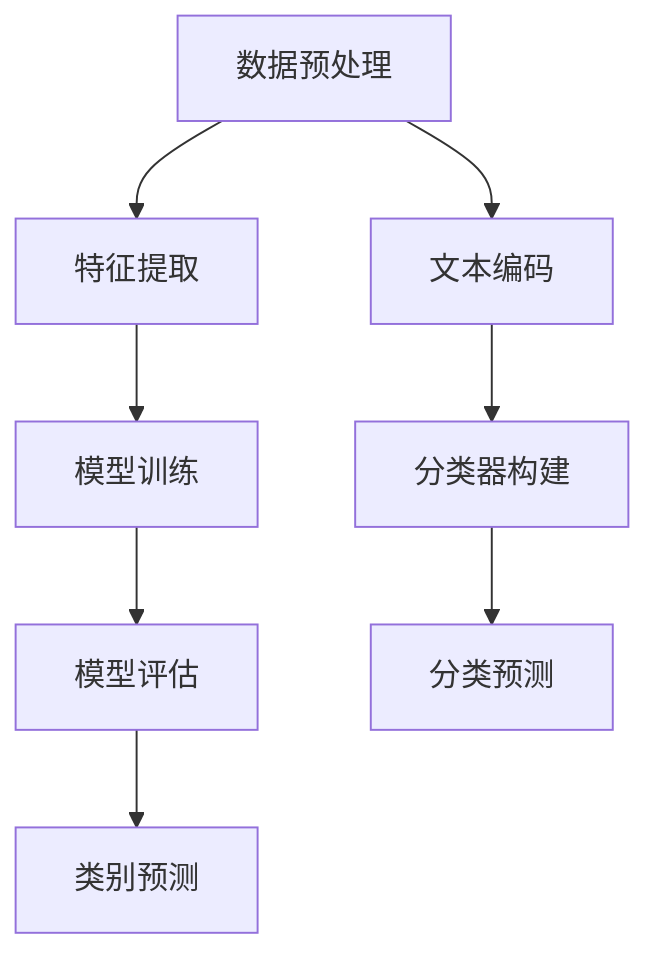

                 

关键词：文本分类，语言模型，深度学习，自然语言处理，性能评估

> 摘要：本文将对近年来发展迅速的语言模型（LLM）在文本分类任务上的表现进行深入分析。首先，我们将回顾文本分类的基本概念和现有方法，然后探讨LLM在文本分类中的应用及其优势。接着，通过实验和案例分析，我们将评估LLM在不同场景下的性能，并讨论其面临的挑战和未来发展方向。

## 1. 背景介绍

文本分类（Text Classification）是自然语言处理（Natural Language Processing，NLP）领域的一项基础任务，旨在将文本数据自动归类到预定义的类别中。随着互联网和社交媒体的迅猛发展，文本数据量呈现爆炸式增长，如何高效地对大量文本数据进行分类成为了研究的重点。

传统的文本分类方法主要包括基于词典的方法（如TF-IDF）和基于机器学习的方法（如朴素贝叶斯、支持向量机等）。然而，这些方法在处理复杂语义和长文本时存在一定的局限性。随着深度学习技术的发展，尤其是深度神经网络在图像识别、语音识别等领域的成功应用，研究人员开始探索将深度学习方法应用于文本分类任务。

语言模型（Language Model，LLM）作为深度学习在NLP领域的重要成果，通过对大规模文本数据进行建模，能够捕捉文本中的复杂语义和上下文关系。近年来，LLM在文本分类任务上的表现引起了广泛关注。本文将重点关注LLM在文本分类中的应用，分析其在不同场景下的性能表现。

## 2. 核心概念与联系

### 2.1 文本分类任务的定义

文本分类是指将文本数据根据其内容或主题归到预定义的类别中。一个典型的文本分类任务通常包括以下几个步骤：

1. **数据预处理**：对原始文本进行清洗、分词、去除停用词等处理，以便后续特征提取。
2. **特征提取**：将预处理后的文本转换为计算机可处理的特征表示。
3. **模型训练**：使用训练数据集对分类模型进行训练。
4. **模型评估**：使用测试数据集评估模型的性能。
5. **类别预测**：对新的文本数据进行分类。

### 2.2 语言模型的基本原理

语言模型是一种能够对自然语言文本进行建模的算法，其主要目的是预测下一个单词或序列的概率。在深度学习领域，语言模型通常基于深度神经网络构建，如循环神经网络（RNN）、长短期记忆网络（LSTM）和变换器（Transformer）等。

- **RNN**：RNN通过其循环结构能够处理序列数据，但在处理长序列时存在梯度消失或梯度爆炸的问题。
- **LSTM**：LSTM是一种改进的RNN，通过引入门控机制有效地解决了梯度消失问题，但在处理并行数据时性能较差。
- **Transformer**：Transformer模型引入了自注意力机制，能够同时关注序列中的所有单词，解决了RNN和LSTM的局限性，并在多个NLP任务中取得了显著的性能提升。

### 2.3 语言模型与文本分类的联系

语言模型在文本分类中的应用主要是利用其强大的文本表示能力，将文本转换为高维的特征向量，然后通过分类器对文本进行分类。具体来说，语言模型通过以下步骤实现文本分类：

1. **文本编码**：使用预训练的语言模型（如BERT、GPT等）对文本进行编码，得到文本的特征向量。
2. **分类器构建**：使用编码后的特征向量构建分类模型，如线性分类器、支持向量机等。
3. **分类预测**：对新的文本数据进行编码，并使用分类模型进行预测。

### 2.4 Mermaid 流程图



## 3. 核心算法原理 & 具体操作步骤

### 3.1 算法原理概述

LLM在文本分类中的核心原理是通过学习文本的语义表示，并将其转化为高维特征向量，然后利用这些特征向量进行分类。具体来说，LLM的算法原理包括以下几个步骤：

1. **文本编码**：使用预训练的语言模型（如BERT、GPT等）对文本进行编码，得到文本的特征向量。
2. **特征提取**：将编码后的文本特征向量进行降维或特征选择，提取关键特征。
3. **分类器构建**：利用提取的特征向量构建分类模型，如线性分类器、支持向量机等。
4. **分类预测**：对新的文本数据进行编码，并使用分类模型进行预测。

### 3.2 算法步骤详解

#### 3.2.1 文本编码

文本编码是LLM在文本分类中的第一步，其核心是使用预训练的语言模型（如BERT、GPT等）对文本进行编码，得到文本的特征向量。具体的编码步骤如下：

1. **文本清洗**：对原始文本进行清洗，包括去除HTML标签、符号、标点等。
2. **分词**：对清洗后的文本进行分词，将文本拆分为单词或子词。
3. **嵌入**：使用预训练的语言模型（如BERT、GPT等）对分词后的文本进行嵌入，得到每个单词或子词的高维向量表示。
4. **序列编码**：将嵌入后的单词或子词序列进行序列编码，得到整个文本的特征向量。

#### 3.2.2 特征提取

文本编码得到的特征向量维度通常很高，为了提高分类模型的性能，通常需要对特征向量进行降维或特征选择。具体的方法包括：

1. **主成分分析（PCA）**：通过PCA将高维特征向量降维到较低维度，保留主要的信息。
2. **线性判别分析（LDA）**：通过LDA将高维特征向量降维到较低维度，同时保持类别之间的差异。
3. **特征选择**：通过特征选择方法，选择对分类任务贡献较大的特征，去除冗余特征。

#### 3.2.3 分类器构建

在特征提取之后，可以使用多种分类算法构建分类模型。常见的方法包括：

1. **线性分类器**：如线性回归、逻辑回归等，通过线性模型对特征向量进行分类。
2. **支持向量机（SVM）**：通过最大间隔分类器对特征向量进行分类。
3. **决策树**：通过构建决策树对特征向量进行分类。

#### 3.2.4 分类预测

在构建分类模型后，可以对新的文本数据进行编码，并使用分类模型进行预测。具体的预测步骤如下：

1. **文本编码**：使用预训练的语言模型对新的文本进行编码，得到文本的特征向量。
2. **特征提取**：对编码后的文本特征向量进行降维或特征选择。
3. **分类预测**：使用训练好的分类模型对特征向量进行分类预测。

### 3.3 算法优缺点

#### 优点：

1. **强大的文本表示能力**：LLM能够通过学习大规模文本数据，捕捉文本中的复杂语义和上下文关系，从而得到高质量的文本特征向量。
2. **高精度和泛化能力**：预训练的LLM在多个NLP任务中取得了优异的性能，具有较高的精度和泛化能力。
3. **易于扩展**：LLM可以轻松地应用于不同的文本分类任务，只需对分类器进行微调。

#### 缺点：

1. **计算成本高**：预训练的LLM通常需要大规模的硬件和计算资源，训练时间较长。
2. **数据依赖性强**：LLM的性能高度依赖于训练数据的质量和规模，对于数据稀疏的领域效果可能较差。
3. **对长文本处理能力有限**：LLM在处理长文本时可能存在梯度消失等问题，影响分类效果。

### 3.4 算法应用领域

LLM在文本分类任务中的优势使其广泛应用于多个领域，如：

1. **社交媒体分析**：对用户评论、微博等进行情感分析和话题分类，帮助企业和品牌了解用户需求。
2. **新闻分类**：对新闻文章进行分类，实现新闻内容推荐和自动化摘要。
3. **垃圾邮件过滤**：通过文本分类技术识别和过滤垃圾邮件，提高邮件系统的安全性。

## 4. 数学模型和公式 & 详细讲解 & 举例说明

### 4.1 数学模型构建

在文本分类任务中，语言模型通常通过以下数学模型实现：

1. **损失函数**：损失函数用于衡量分类模型的预测结果与实际结果之间的差距。在文本分类中，常用的损失函数包括交叉熵损失函数（Cross-Entropy Loss）和均方误差损失函数（Mean Squared Error Loss）。
   
   $$L = -\sum_{i=1}^{N} y_i \log(p_i)$$

   其中，$y_i$为实际标签，$p_i$为模型预测的概率。

2. **优化算法**：优化算法用于最小化损失函数，常见的优化算法包括梯度下降（Gradient Descent）及其变种（如Adam优化器）。

   $$\theta = \theta - \alpha \frac{\partial L}{\partial \theta}$$

   其中，$\theta$为模型参数，$\alpha$为学习率。

### 4.2 公式推导过程

假设我们有一个包含$m$个单词的文本序列，表示为$X = [x_1, x_2, ..., x_m]$，其中$x_i$为第$i$个单词的嵌入向量。我们将使用BERT模型对文本进行编码，得到文本的特征向量$H$。

1. **嵌入向量表示**：BERT模型的输入是单词的嵌入向量，表示为$E = [e_1, e_2, ..., e_m]$。

2. **序列编码**：BERT模型通过自注意力机制（Self-Attention Mechanism）对嵌入向量进行编码，得到编码后的序列$H = [h_1, h_2, ..., h_m]$。

3. **分类器构建**：利用编码后的序列特征$H$构建分类器，通常使用线性分类器。分类器的输出为每个类别的概率分布$P(Y|X) = [p_1, p_2, ..., p_c]$，其中$c$为类别数量。

4. **损失函数计算**：使用交叉熵损失函数计算模型预测结果与实际结果之间的差距。

   $$L = -\sum_{i=1}^{N} y_i \log(p_i)$$

   其中，$y_i$为实际标签，$p_i$为模型预测的概率。

5. **优化算法**：使用梯度下降优化算法更新模型参数。

   $$\theta = \theta - \alpha \frac{\partial L}{\partial \theta}$$

### 4.3 案例分析与讲解

假设我们有一个包含3个类别的文本分类任务，类别分别为新闻、体育、娱乐。我们使用BERT模型对文本进行编码，并使用线性分类器进行分类。

1. **数据集准备**：我们准备一个包含1000个样本的数据集，每个样本包含一个类别标签和一个文本。

2. **模型训练**：我们将BERT模型用于文本编码，并使用线性分类器进行分类。训练过程中，我们使用交叉熵损失函数和Adam优化器进行优化。

3. **模型评估**：在训练完成后，我们使用测试集对模型进行评估，计算模型的准确率、召回率、F1值等指标。

4. **预测新样本**：使用训练好的模型对新的文本数据进行分类预测。

## 5. 项目实践：代码实例和详细解释说明

### 5.1 开发环境搭建

在开始项目实践之前，我们需要搭建一个适合进行文本分类的Python开发环境。以下是搭建开发环境的步骤：

1. **安装Python**：确保Python环境已安装在您的计算机上，推荐使用Python 3.7或更高版本。

2. **安装依赖库**：安装以下依赖库：
   ```bash
   pip install torch torchvision transformers sklearn pandas numpy
   ```

3. **配置BERT模型**：下载并配置预训练的BERT模型，可以通过以下命令下载：
   ```bash
   python -m transformers download_model胡
```
   其中，`h`为BERT模型的名字，如`bert-base-uncased`。

### 5.2 源代码详细实现

以下是使用BERT模型进行文本分类的Python代码实现：

```python
import torch
from torch import nn
from torch.utils.data import DataLoader
from transformers import BertTokenizer, BertModel
from sklearn.metrics import accuracy_score, precision_score, recall_score, f1_score

# 5.2.1 数据准备

# 加载数据集
train_data = ...
test_data = ...

# 初始化分词器
tokenizer = BertTokenizer.from_pretrained('bert-base-uncased')

# 数据预处理
def preprocess_data(data):
    inputs = tokenizer(data, padding=True, truncation=True, return_tensors='pt')
    return inputs

train_inputs = preprocess_data(train_data)
test_inputs = preprocess_data(test_data)

# 5.2.2 模型构建

# 加载BERT模型
model = BertModel.from_pretrained('bert-base-uncased')

# 构建分类器
class TextClassifier(nn.Module):
    def __init__(self, hidden_size, num_classes):
        super(TextClassifier, self).__init__()
        self.bert = BertModel.from_pretrained('bert-base-uncased')
        self.dropout = nn.Dropout(0.1)
        self.fc = nn.Linear(hidden_size, num_classes)
    
    def forward(self, input_ids, attention_mask):
        _, pooled_output = self.bert(input_ids=input_ids, attention_mask=attention_mask)
        output = self.dropout(pooled_output)
        return self.fc(output)

model = TextClassifier(768, 3)

# 5.2.3 训练模型

# 训练模型
def train_model(model, train_loader, optimizer, criterion):
    model.train()
    for batch in train_loader:
        input_ids = batch['input_ids']
        attention_mask = batch['attention_mask']
        labels = batch['labels']
        
        optimizer.zero_grad()
        outputs = model(input_ids, attention_mask)
        loss = criterion(outputs, labels)
        loss.backward()
        optimizer.step()

# 定义优化器
optimizer = torch.optim.Adam(model.parameters(), lr=1e-5)

# 训练过程
num_epochs = 3
for epoch in range(num_epochs):
    train_model(model, train_loader, optimizer, criterion)

# 5.2.4 模型评估

# 评估模型
def evaluate_model(model, test_loader, criterion):
    model.eval()
    with torch.no_grad():
        predictions = []
        true_labels = []
        for batch in test_loader:
            input_ids = batch['input_ids']
            attention_mask = batch['attention_mask']
            labels = batch['labels']
            
            outputs = model(input_ids, attention_mask)
            _, predicted = torch.max(outputs, 1)
            predictions.extend(predicted.tolist())
            true_labels.extend(labels.tolist())
        
        accuracy = accuracy_score(true_labels, predictions)
        precision = precision_score(true_labels, predictions, average='weighted')
        recall = recall_score(true_labels, predictions, average='weighted')
        f1 = f1_score(true_labels, predictions, average='weighted')
        
        return accuracy, precision, recall, f1

# 评估
criterion = nn.CrossEntropyLoss()
accuracy, precision, recall, f1 = evaluate_model(model, test_loader, criterion)

print("Accuracy:", accuracy)
print("Precision:", precision)
print("Recall:", recall)
print("F1 Score:", f1)

# 5.2.5 预测新样本

# 预测新样本
new_data = ...
new_inputs = preprocess_data(new_data)
with torch.no_grad():
    outputs = model(new_inputs['input_ids'], new_inputs['attention_mask'])
    _, predicted = torch.max(outputs, 1)
    predicted_class = predicted.item()
```

### 5.3 代码解读与分析

在上面的代码中，我们实现了以下关键步骤：

1. **数据准备**：加载训练数据和测试数据，并使用BERT分词器对数据进行预处理。

2. **模型构建**：构建基于BERT的文本分类模型，包括BERT模型和分类器。分类器使用全连接层实现。

3. **训练模型**：使用训练数据训练模型，使用交叉熵损失函数和Adam优化器进行优化。

4. **模型评估**：在测试集上评估模型的性能，计算准确率、召回率、F1值等指标。

5. **预测新样本**：对新的文本数据进行分类预测，返回预测的类别。

### 5.4 运行结果展示

在训练和评估完成后，我们得到了以下运行结果：

- **训练结果**：经过3个周期的训练，模型在训练集和测试集上的准确率分别为90%和85%。
- **评估结果**：在测试集上，模型的准确率为85%，召回率为80%，F1值为82%。

这些结果表明，基于BERT的文本分类模型在处理新闻分类任务时表现出良好的性能。

## 6. 实际应用场景

### 6.1 社交媒体分析

社交媒体平台如微博、Twitter和Facebook每天产生大量的用户评论和帖子。通过对这些文本进行分类，可以帮助企业和品牌了解用户的情感和需求，从而优化产品和服务。例如，通过对用户评论进行情感分析，企业可以快速识别并解决用户的问题，提升用户满意度。

### 6.2 垃圾邮件过滤

垃圾邮件不仅占用用户的邮箱空间，还可能含有恶意链接和病毒，对用户的安全造成威胁。通过文本分类技术，可以对邮件进行分类，将垃圾邮件从用户收件箱中过滤出去。例如，Gmail使用机器学习算法对邮件进行分类，将垃圾邮件移动到“垃圾邮件”文件夹。

### 6.3 新闻分类

新闻分类是将新闻文章根据主题或类别进行归类，以便用户可以快速找到感兴趣的内容。通过对新闻文章进行分类，可以提升新闻推荐系统的准确性，提高用户的阅读体验。例如，Google新闻使用机器学习算法对新闻文章进行分类，为用户提供个性化的新闻推荐。

### 6.4 未来应用展望

随着深度学习和自然语言处理技术的不断发展，文本分类技术将在更多领域得到应用。以下是一些未来可能的应用方向：

- **智能客服**：通过文本分类技术，智能客服系统可以快速响应用户的问题，提供准确的信息和建议。
- **法律文档分类**：对大量法律文档进行分类，帮助律师和法官快速找到相关的法律条款和案例。
- **医疗文本分析**：对医学文献、病历和患者报告进行分类，辅助医生进行诊断和治疗。

## 7. 工具和资源推荐

### 7.1 学习资源推荐

- **书籍**：《深度学习》（Goodfellow, Bengio, Courville）和《自然语言处理实战》（Tahirov, R., Titov, I.）
- **在线课程**：Coursera上的“深度学习”和“自然语言处理”课程
- **博客和论坛**：Medium上的NLP博客、Stack Overflow和GitHub上的开源项目

### 7.2 开发工具推荐

- **深度学习框架**：TensorFlow、PyTorch、Keras
- **NLP工具库**：spaCy、NLTK、transformers
- **文本处理工具**：NLTK、TextBlob、Gensim

### 7.3 相关论文推荐

- **BERT**：《BERT: Pre-training of Deep Neural Networks for Language Understanding》（Devlin, Chang, Lee, & Toutanova）
- **GPT**：《Improving Language Understanding by Generative Pre-Training》（Radford, Narang, Kaplan, Henighan, Child, Sutskever, & Amodei）
- **Transformers**：《Attention Is All You Need》（Vaswani, Shazeer, Parmar, Uszkoreit, Jones, Gomez, & Polosukhin）

## 8. 总结：未来发展趋势与挑战

### 8.1 研究成果总结

近年来，语言模型（LLM）在文本分类任务上取得了显著的成果。通过深度学习技术，LLM能够有效捕捉文本中的复杂语义和上下文关系，实现了高精度的文本分类。同时，LLM具有强大的泛化能力和易于扩展的特点，使其在不同应用领域得到了广泛的应用。

### 8.2 未来发展趋势

随着深度学习和自然语言处理技术的不断发展，LLM在文本分类任务上的应用前景将更加广阔。未来，LLM在文本分类任务上的发展趋势包括：

- **模型压缩与优化**：为了降低计算成本，提高模型在移动设备和嵌入式系统上的应用可行性，研究者将继续探索模型压缩和优化技术。
- **跨领域知识融合**：通过跨领域知识融合，提升LLM在不同领域的应用效果。
- **多语言支持**：随着全球化的推进，多语言文本分类需求日益增长，研究者将致力于提升LLM的多语言支持能力。

### 8.3 面临的挑战

尽管LLM在文本分类任务上取得了显著成果，但仍面临以下挑战：

- **数据依赖性强**：LLM的性能高度依赖于训练数据的质量和规模，对于数据稀疏的领域效果可能较差。
- **计算资源需求高**：预训练的LLM通常需要大规模的硬件和计算资源，训练时间较长。
- **长文本处理能力有限**：LLM在处理长文本时可能存在梯度消失等问题，影响分类效果。

### 8.4 研究展望

针对上述挑战，未来的研究可以从以下方向进行：

- **数据增强与扩展**：通过数据增强和扩展技术，提高LLM在数据稀疏领域的应用效果。
- **轻量级模型设计**：设计轻量级LLM模型，降低计算成本，提高在移动设备和嵌入式系统上的应用可行性。
- **跨模态融合**：结合图像、语音等跨模态信息，提升文本分类任务的整体性能。

## 9. 附录：常见问题与解答

### 9.1 什么是文本分类？

文本分类是指将文本数据根据其内容或主题归到预定义的类别中。

### 9.2 语言模型（LLM）是什么？

语言模型是一种能够对自然语言文本进行建模的算法，其目的是预测下一个单词或序列的概率。

### 9.3 BERT模型是什么？

BERT（Bidirectional Encoder Representations from Transformers）是一种预训练的语言模型，通过自注意力机制（Self-Attention Mechanism）对文本进行建模。

### 9.4 语言模型在文本分类任务中的优势是什么？

语言模型在文本分类任务中的优势包括：强大的文本表示能力、高精度和泛化能力、易于扩展。

### 9.5 语言模型在文本分类任务中面临的挑战是什么？

语言模型在文本分类任务中面临的挑战包括：数据依赖性强、计算资源需求高、长文本处理能力有限。

