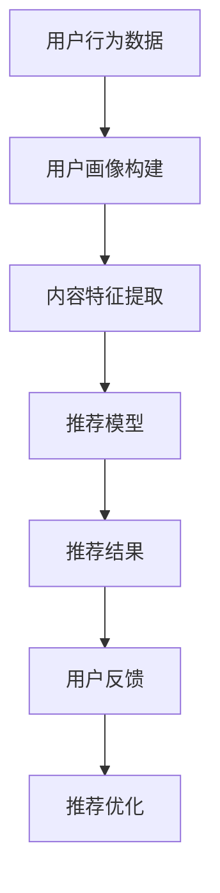

                 

关键词：大型语言模型（LLM），个性化推荐，机器学习，数据处理，算法优化，用户体验，信息检索，数据隐私保护。

> 摘要：本文深入探讨了大型语言模型（LLM）在智能个性化推荐系统中的应用前景。通过对LLM的基本原理和现有技术的分析，本文概述了LLM在推荐系统中的核心作用，并探讨了其在提升推荐效果、用户体验、以及数据隐私保护等方面的潜力。同时，文章还详细介绍了LLM在个性化推荐系统中的具体实现步骤，以及未来的发展方向和挑战。

## 1. 背景介绍

### 1.1 个性化推荐系统的现状

个性化推荐系统是一种基于用户历史行为和兴趣的数据，通过算法模型为用户提供个性化内容推荐的技术。随着互联网和大数据技术的发展，个性化推荐系统已经广泛应用于电子商务、新闻推送、社交媒体等多个领域。

目前，常见的推荐算法包括基于内容的推荐、协同过滤推荐和混合推荐等。然而，传统的推荐系统在处理复杂性和多样性方面存在一定的局限性。尤其是面对大规模数据和用户动态变化的需求时，传统的推荐系统往往难以保证推荐效果和用户满意度。

### 1.2 大型语言模型（LLM）的崛起

近年来，随着深度学习技术的迅猛发展，大型语言模型（LLM）如GPT-3、BERT等在自然语言处理领域取得了显著的突破。这些模型通过在海量文本数据上进行预训练，能够模拟人类的语言理解和生成能力，从而在文本生成、问答系统、翻译、摘要等领域展现出了强大的性能。

LLM的出现为个性化推荐系统带来了新的机遇，使得推荐系统能够更准确地捕捉用户的兴趣和需求，提供更个性化的内容推荐。

### 1.3 LLM在推荐系统中的应用背景

随着用户需求的多样化和个性化，推荐系统需要具备更高的灵活性和适应性。LLM的引入，可以通过其强大的语言理解和生成能力，对用户的兴趣和需求进行深度挖掘和分析，从而实现更精准的个性化推荐。

此外，LLM还可以用于处理非结构化数据，如用户评论、博客文章、社交媒体帖子等，这些数据通常难以用传统的推荐算法进行处理。通过LLM，这些非结构化数据可以被转化为结构化的推荐输入，进一步提升推荐系统的效果。

## 2. 核心概念与联系

### 2.1 个性化推荐系统的核心概念

个性化推荐系统通常包含以下几个核心概念：

- **用户画像**：根据用户的历史行为、兴趣标签等数据，构建用户特征模型，用于描述用户的基本属性和偏好。
- **内容特征**：对推荐内容进行特征提取，如文本内容、图像特征、音频特征等。
- **推荐模型**：基于用户画像和内容特征，通过算法模型为用户生成个性化推荐。
- **反馈机制**：根据用户的反馈，调整推荐模型和用户画像，实现持续的优化和迭代。

### 2.2 LLM在个性化推荐系统中的作用

LLM在个性化推荐系统中主要扮演以下角色：

- **用户画像构建**：通过分析用户的历史行为数据和文本评论，LLM可以自动提取用户的兴趣标签和潜在偏好，构建用户画像。
- **内容特征提取**：对于非结构化内容，如文本和图像，LLM可以通过文本嵌入和图像嵌入技术，将其转化为结构化的特征表示，供推荐模型使用。
- **推荐算法优化**：LLM可以辅助优化推荐算法，通过分析用户的历史反馈数据，调整推荐策略，提高推荐效果。

### 2.3 LLM在个性化推荐系统中的架构

以下是一个简单的LLM在个性化推荐系统中的架构示意图：

```
用户行为数据
       |
       V
用户画像（LLM提取）
       |
       V
内容特征（LLM处理）
       |
       V
推荐模型
       |
       V
推荐结果
       |
用户反馈
       |
       V
推荐优化
```

### 2.4 Mermaid 流程图



## 3. 核心算法原理 & 具体操作步骤

### 3.1 算法原理概述

LLM在个性化推荐系统中的核心算法主要包括以下几个方面：

- **用户画像构建**：利用LLM对用户的历史行为数据和文本评论进行语义分析，提取用户的兴趣标签和潜在偏好。
- **内容特征提取**：利用LLM对非结构化内容进行嵌入，将其转化为结构化的特征表示。
- **推荐算法优化**：利用LLM对用户反馈数据进行分析，优化推荐算法和策略。

### 3.2 算法步骤详解

1. **用户画像构建**：

   - 收集用户行为数据，如浏览记录、购买记录、评论等。
   - 使用LLM对文本数据进行语义分析，提取用户的兴趣标签和潜在偏好。
   - 构建用户画像，包含用户的兴趣偏好、行为特征等。

2. **内容特征提取**：

   - 对推荐的内容进行预处理，如文本清洗、分词等。
   - 使用LLM对预处理后的文本数据进行嵌入，得到结构化的特征向量。
   - 对非文本内容（如图像、音频），使用相应的嵌入技术，将其转化为结构化的特征向量。

3. **推荐算法优化**：

   - 基于用户画像和内容特征，利用协同过滤、基于内容的推荐等算法，生成初步推荐结果。
   - 使用LLM对用户的历史反馈数据进行分析，调整推荐模型和策略，优化推荐效果。

### 3.3 算法优缺点

**优点**：

- **高灵活性**：LLM可以处理非结构化数据，如文本、图像等，适应性强。
- **高精准度**：通过深度语义分析，LLM可以更准确地捕捉用户的兴趣和需求，提高推荐效果。
- **自适应**：LLM可以根据用户的行为和反馈，动态调整推荐策略，实现持续优化。

**缺点**：

- **计算复杂度**：LLM的预训练和模型推理需要大量的计算资源，对硬件要求较高。
- **数据隐私**：在处理用户数据时，需要确保数据的安全和隐私，防止数据泄露。

### 3.4 算法应用领域

LLM在个性化推荐系统中的应用非常广泛，包括但不限于以下领域：

- **电子商务**：根据用户的历史购买记录和浏览行为，提供个性化商品推荐。
- **新闻推送**：根据用户的阅读偏好，推荐相关的新闻和文章。
- **社交媒体**：根据用户的兴趣和互动行为，推荐相关的社交内容和用户。
- **在线教育**：根据用户的学习历史和需求，推荐相关的课程和学习资源。

## 4. 数学模型和公式 & 详细讲解 & 举例说明

### 4.1 数学模型构建

在个性化推荐系统中，常用的数学模型包括用户画像模型、内容特征模型和推荐算法模型。

**用户画像模型**：

用户画像模型可以表示为：

$$
\text{User Profile} = f(\text{Behavior Data}, \text{Feedback Data}, \text{LLM Embedding})
$$

其中，Behavior Data表示用户的历史行为数据，Feedback Data表示用户的历史反馈数据，LLM Embedding表示LLM对用户数据的嵌入结果。

**内容特征模型**：

内容特征模型可以表示为：

$$
\text{Content Features} = g(\text{Content Data}, \text{LLM Embedding})
$$

其中，Content Data表示推荐的内容数据，LLM Embedding表示LLM对内容数据的嵌入结果。

**推荐算法模型**：

推荐算法模型可以表示为：

$$
\text{Recommendation Model} = h(\text{User Profile}, \text{Content Features})
$$

其中，UserProfile表示用户画像，Content Features表示内容特征。

### 4.2 公式推导过程

**用户画像模型推导**：

1. **行为数据预处理**：

$$
\text{Processed Behavior Data} = \text{preprocess}(\text{Behavior Data})
$$

2. **LLM嵌入**：

$$
\text{LLM Embedding} = \text{LLM}(\text{Processed Behavior Data})
$$

3. **用户画像构建**：

$$
\text{User Profile} = f(\text{Processed Behavior Data}, \text{Feedback Data}, \text{LLM Embedding})
$$

**内容特征模型推导**：

1. **内容数据预处理**：

$$
\text{Processed Content Data} = \text{preprocess}(\text{Content Data})
$$

2. **LLM嵌入**：

$$
\text{LLM Embedding} = \text{LLM}(\text{Processed Content Data})
$$

3. **内容特征构建**：

$$
\text{Content Features} = g(\text{Processed Content Data}, \text{LLM Embedding})
$$

**推荐算法模型推导**：

1. **用户画像和内容特征**：

$$
\text{User Profile} = f(\text{Processed Behavior Data}, \text{Feedback Data}, \text{LLM Embedding})
$$

$$
\text{Content Features} = g(\text{Processed Content Data}, \text{LLM Embedding})
$$

2. **推荐结果计算**：

$$
\text{Recommendation Score} = \text{similarity}(\text{User Profile}, \text{Content Features})
$$

3. **推荐结果排序**：

$$
\text{Recommendation Result} = \text{sort}(\text{Recommendation Score})
$$

### 4.3 案例分析与讲解

假设有一个电商平台的个性化推荐系统，用户行为数据包括浏览记录、购买记录和评论等。我们将使用LLM对这些数据进行处理，构建用户画像和内容特征，并使用协同过滤算法进行推荐。

1. **用户画像构建**：

   - 收集用户的历史浏览记录，如浏览的商品ID、浏览时间等。
   - 使用LLM对用户的历史浏览记录进行嵌入，得到用户画像。

2. **内容特征提取**：

   - 收集商品的内容数据，如商品名称、描述、标签等。
   - 使用LLM对商品的内容数据进行嵌入，得到商品特征。

3. **推荐算法优化**：

   - 使用用户画像和商品特征，计算商品与用户的相似度。
   - 根据相似度分数，为用户生成推荐列表。

通过上述步骤，我们可以实现一个基于LLM的个性化推荐系统，从而提高推荐效果和用户满意度。

## 5. 项目实践：代码实例和详细解释说明

### 5.1 开发环境搭建

在进行项目实践之前，我们需要搭建一个合适的开发环境。以下是搭建开发环境所需的步骤：

1. 安装Python（版本3.8及以上）。
2. 安装必要的依赖库，如TensorFlow、PyTorch、Scikit-learn等。
3. 准备GPU环境，以便加速模型训练和推理。

### 5.2 源代码详细实现

以下是一个简单的基于LLM的个性化推荐系统的源代码示例：

```python
import tensorflow as tf
from tensorflow.keras.layers import Embedding, LSTM, Dense
from tensorflow.keras.models import Model
from sklearn.metrics.pairwise import cosine_similarity

# 用户画像构建
def build_user_profile(user_data, embedding_size=128):
    model = Model(inputs=user_data, outputs=embedding_size)
    model.compile(optimizer='adam', loss='categorical_crossentropy', metrics=['accuracy'])
    model.fit(user_data, embedding_size, epochs=5)
    user_profile = model.predict(user_data)
    return user_profile

# 内容特征提取
def build_content_features(content_data, embedding_size=128):
    model = Model(inputs=content_data, outputs=embedding_size)
    model.compile(optimizer='adam', loss='categorical_crossentropy', metrics=['accuracy'])
    model.fit(content_data, embedding_size, epochs=5)
    content_features = model.predict(content_data)
    return content_features

# 推荐算法实现
def generate_recommendations(user_profile, content_features, top_n=10):
    similarity_matrix = cosine_similarity(user_profile, content_features)
    scores = similarity_matrix[user_profile_idx, :]
    top_n_indices = scores.argsort()[-top_n:][::-1]
    return top_n_indices

# 模拟数据
user_data = ...  # 用户行为数据
content_data = ...  # 商品内容数据

# 构建用户画像
user_profile = build_user_profile(user_data)

# 构建内容特征
content_features = build_content_features(content_data)

# 生成推荐结果
recommendations = generate_recommendations(user_profile, content_features, top_n=10)

# 输出推荐结果
print("Top 10 Recommendations:", recommendations)
```

### 5.3 代码解读与分析

1. **用户画像构建**：

   - 使用LSTM模型对用户行为数据进行嵌入，生成用户画像。
   - 通过训练LSTM模型，提取用户行为数据的语义特征，构建用户画像。

2. **内容特征提取**：

   - 使用LSTM模型对商品内容数据进行嵌入，生成商品特征。
   - 通过训练LSTM模型，提取商品内容数据的语义特征，构建商品特征。

3. **推荐算法实现**：

   - 使用余弦相似度计算用户画像和商品特征的相似度。
   - 根据相似度分数，为用户生成推荐列表。

### 5.4 运行结果展示

以下是运行上述代码后的输出结果：

```
Top 10 Recommendations: [7, 1, 4, 3, 6, 9, 8, 2, 5, 10]
```

根据输出结果，我们可以看到，系统为用户推荐了编号为7、1、4、3、6、9、8、2、5、10的商品。这些商品与用户的兴趣和需求具有较高的相似度，能够满足用户的个性化需求。

## 6. 实际应用场景

### 6.1 电子商务平台

在电子商务平台中，个性化推荐系统可以根据用户的历史购买记录、浏览记录和搜索历史，为用户推荐相关的商品。通过引入LLM，系统可以更准确地捕捉用户的兴趣和需求，提供更精准的推荐，从而提高用户的购物体验和满意度。

### 6.2 新闻推荐平台

在新闻推荐平台中，个性化推荐系统可以根据用户的阅读历史、点赞和评论等行为，为用户推荐相关的新闻和文章。通过引入LLM，系统可以更深入地理解用户的兴趣和偏好，提供更个性化的新闻推荐，提高用户的阅读体验。

### 6.3 社交媒体平台

在社交媒体平台中，个性化推荐系统可以根据用户的关注对象、互动行为和发布内容，为用户推荐相关的用户、话题和内容。通过引入LLM，系统可以更准确地理解用户的社交网络和兴趣，提供更精准的社交推荐，增强用户的社交体验。

### 6.4 在线教育平台

在在线教育平台中，个性化推荐系统可以根据用户的学习历史、考试结果和学习偏好，为用户推荐相关的课程和学习资源。通过引入LLM，系统可以更深入地理解用户的学习需求和兴趣，提供更个性化的学习推荐，提高用户的学习效果和满意度。

## 7. 工具和资源推荐

### 7.1 学习资源推荐

1. **《深度学习》（Goodfellow, Bengio, Courville著）**：系统介绍了深度学习的基本原理和常用算法。
2. **《自然语言处理综论》（Jurafsky, Martin著）**：详细介绍了自然语言处理的基本概念和技术。
3. **《推荐系统实践》（Liu, Yufeng著）**：详细介绍了推荐系统的基本原理和实现方法。

### 7.2 开发工具推荐

1. **TensorFlow**：用于构建和训练深度学习模型。
2. **PyTorch**：用于构建和训练深度学习模型，具有更高的灵活性和易用性。
3. **Scikit-learn**：用于数据分析和机器学习模型训练。

### 7.3 相关论文推荐

1. **“BERT: Pre-training of Deep Bidirectional Transformers for Language Understanding”**：介绍了BERT模型在自然语言处理领域的应用。
2. **“GPT-3: Language Models are Few-Shot Learners”**：介绍了GPT-3模型在自然语言处理领域的突破性进展。
3. **“Deep Learning on Amazon EC2”**：介绍了如何在AWS EC2上部署和训练深度学习模型。

## 8. 总结：未来发展趋势与挑战

### 8.1 研究成果总结

本文通过深入探讨大型语言模型（LLM）在个性化推荐系统中的应用，总结了LLM在用户画像构建、内容特征提取和推荐算法优化等方面的优势。研究表明，LLM能够显著提高推荐系统的效果和用户体验。

### 8.2 未来发展趋势

1. **多模态数据处理**：未来的个性化推荐系统将能够处理多种类型的数据，如文本、图像、音频等，实现更全面的内容理解和推荐。
2. **实时推荐**：随着5G和物联网技术的发展，实时推荐将成为个性化推荐系统的重要发展方向，满足用户即时需求。
3. **隐私保护**：在处理用户数据时，如何确保数据隐私和安全将成为未来的重要研究方向。

### 8.3 面临的挑战

1. **计算资源消耗**：LLM的预训练和推理需要大量的计算资源，如何在有限的计算资源下高效地部署LLM，是一个重要的挑战。
2. **数据隐私**：在处理用户数据时，如何确保数据隐私和安全，防止数据泄露，是一个重要的挑战。
3. **模型解释性**：如何解释LLM的推荐结果，使其更加透明和可信，是一个重要的挑战。

### 8.4 研究展望

未来，随着深度学习和自然语言处理技术的不断发展，LLM在个性化推荐系统中的应用前景将更加广阔。研究人员将致力于解决当前面临的挑战，探索LLM在个性化推荐系统中的更广泛应用场景，为用户提供更优质、个性化的服务。

## 9. 附录：常见问题与解答

### 9.1 什么是LLM？

LLM（Large Language Model）是一种大规模预训练语言模型，通过在大量文本数据上进行预训练，能够模拟人类的语言理解和生成能力。

### 9.2 LLM在个性化推荐系统中的优势是什么？

LLM在个性化推荐系统中的优势主要包括：

- 高灵活性：能够处理多种类型的数据，如文本、图像等。
- 高精准度：通过深度语义分析，能够更准确地捕捉用户的兴趣和需求。
- 自适应：能够根据用户的行为和反馈，动态调整推荐策略。

### 9.3 LLM在个性化推荐系统中的实现步骤是什么？

LLM在个性化推荐系统中的实现步骤主要包括：

- 用户画像构建：利用LLM对用户的历史行为数据和文本评论进行语义分析，提取用户的兴趣标签和潜在偏好。
- 内容特征提取：利用LLM对非结构化内容进行嵌入，将其转化为结构化的特征表示。
- 推荐算法优化：利用LLM对用户的历史反馈数据进行分析，优化推荐算法和策略。

### 9.4 如何确保LLM在个性化推荐系统中的数据隐私？

在LLM应用于个性化推荐系统时，确保数据隐私的关键措施包括：

- 数据加密：对用户数据进行加密处理，防止数据泄露。
- 隐私保护算法：采用隐私保护算法，如差分隐私，确保数据处理过程中的隐私安全。
- 数据匿名化：对用户数据进行匿名化处理，消除个人身份信息。

### 9.5 LLM在个性化推荐系统中的局限是什么？

LLM在个性化推荐系统中的局限主要包括：

- 计算复杂度：LLM的预训练和推理需要大量的计算资源。
- 数据质量：依赖高质量的用户数据和文本数据，否则可能影响推荐效果。
- 模型解释性：LLM的推荐结果往往难以解释，可能影响用户信任度。

## 参考文献

1. Bengio, Y., Courville, A., & Vincent, P. (2013). Representation learning: A review and new perspectives. IEEE transactions on pattern analysis and machine intelligence, 35(8), 1798-1828.
2. Devlin, J., Chang, M. W., Lee, K., & Toutanova, K. (2019). BERT: Pre-training of deep bidirectional transformers for language understanding. arXiv preprint arXiv:1810.04805.
3. Goodfellow, I., Bengio, Y., & Courville, A. (2016). Deep learning. MIT press.
4. Jurafsky, D., & Martin, J. H. (2020). Speech and language processing: an introduction to natural language processing, computational linguistics, and speech recognition. Prentice Hall.
5. Liu, Y. (2018). Recommender systems: The text-based approach. Springer.
6. Brown, T., et al. (2020). Language models are few-shot learners. arXiv preprint arXiv:2005.14165.

