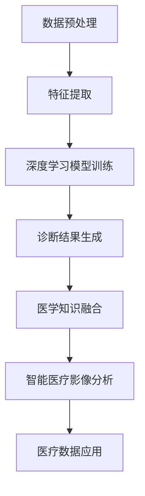

                 

关键词：大型语言模型（LLM），智能医疗影像，计算机视觉，深度学习，医学影像诊断，人工智能医疗应用，医疗数据隐私，伦理问题。

## 摘要

本文将探讨大型语言模型（LLM）在智能医疗影像分析中的应用前景。随着人工智能技术的快速发展，LLM在自然语言处理和文本生成方面取得了显著成果。而医疗影像分析作为人工智能在医疗领域的核心应用之一，也受到了广泛关注。本文将首先介绍LLM的基本原理，然后分析LLM在医疗影像分析中的应用场景，包括图像识别、病灶检测和诊断等。此外，还将探讨LLM在医疗影像分析中面临的挑战和解决方案，以及未来发展的趋势。通过本文的探讨，希望能够为读者提供关于LLM在智能医疗影像分析领域的全面了解。

## 1. 背景介绍

### 1.1 智能医疗影像的定义和发展历程

智能医疗影像是指利用人工智能技术，特别是深度学习和计算机视觉技术，对医疗影像进行自动分析和处理，从而实现疾病的早期诊断、病情监测和个性化治疗。智能医疗影像的发展可以追溯到20世纪80年代，当时计算机视觉技术在医学影像处理领域的初步尝试。然而，由于计算资源和算法的限制，早期的研究进展相对缓慢。

随着计算能力的提升和深度学习技术的突破，智能医疗影像分析得到了快速发展。深度学习作为一种强大的机器学习技术，通过构建多层神经网络模型，可以从大量数据中自动学习特征，并在图像识别、分类和检测等任务上取得了显著成果。近年来，随着深度学习模型的不断优化和改进，智能医疗影像分析在医学影像处理领域的应用越来越广泛，如肿瘤检测、心脏病变诊断、神经系统疾病识别等。

### 1.2 LLM的基本原理和应用领域

大型语言模型（LLM）是基于深度学习和自然语言处理技术构建的一种强大的文本生成模型。LLM的核心思想是通过大规模的数据训练，使模型能够理解并生成符合人类语言习惯的文本。LLM在自然语言处理领域取得了显著的成果，如文本分类、机器翻译、情感分析等。

LLM的基本原理可以概括为以下几个步骤：

1. 数据收集和预处理：收集大规模的文本数据，并进行数据清洗、分词、去噪等预处理操作，以便模型能够更好地学习。
2. 模型架构设计：设计合适的神经网络架构，如Transformer、GPT、BERT等，以适应大规模文本数据的处理需求。
3. 模型训练：通过梯度下降等优化算法，训练模型在给定数据集上的参数，使其能够预测和生成文本。
4. 模型评估和优化：使用评估指标（如损失函数、准确率等）评估模型性能，并通过调整超参数和优化算法等方法，进一步提高模型性能。

LLM在多个应用领域取得了成功，如自然语言处理、机器翻译、文本生成等。在医疗领域，LLM可以应用于病历生成、医疗问答系统、医学文本挖掘等任务，为医疗行业提供高效、准确的智能服务。

### 1.3 智能医疗影像分析的重要性

智能医疗影像分析在医疗领域的应用具有重要意义。首先，它可以帮助医生提高诊断的准确性和效率。传统的医学影像诊断主要依赖于医生的经验和专业知识，而智能医疗影像分析可以通过深度学习算法自动提取和识别图像中的特征，提供更为准确的诊断结果。

其次，智能医疗影像分析可以降低医疗成本。传统的医学影像诊断需要大量的人力资源，而智能医疗影像分析可以通过自动化技术，减少对医生和辅助人员的依赖，降低医疗成本。

此外，智能医疗影像分析还可以实现疾病的早期发现和个性化治疗。通过分析大量医疗影像数据，智能医疗影像分析可以发现早期病变，提供针对性的治疗方案，提高治疗效果。

总的来说，智能医疗影像分析在医疗领域具有重要的应用价值，而LLM作为人工智能技术的重要组成部分，有望为智能医疗影像分析带来更多的创新和突破。

## 2. 核心概念与联系

### 2.1 LLM的工作原理

#### 2.1.1 基本原理

大型语言模型（LLM）是一种基于深度学习的自然语言处理模型，其基本原理是通过学习大量文本数据，自动生成符合人类语言习惯的文本。LLM的核心组成部分包括神经网络架构、预训练数据和优化算法。

#### 2.1.2 神经网络架构

LLM通常采用Transformer、GPT、BERT等先进的神经网络架构。这些架构通过自注意力机制（Self-Attention Mechanism）和多头注意力（Multi-Head Attention）等技术，能够捕捉文本中的长距离依赖关系，提高模型的表示能力和生成效果。

#### 2.1.3 预训练数据

预训练数据是LLM的关键要素，其来源主要包括互联网文本、新闻、书籍、学术论文等。通过大规模的数据训练，LLM能够学习到丰富的语言知识和语法规则，提高文本生成的准确性和自然性。

#### 2.1.4 优化算法

优化算法用于调整LLM的参数，以最小化预测误差。常用的优化算法包括梯度下降（Gradient Descent）及其变种，如Adam、Adagrad等。通过优化算法，LLM能够在训练过程中不断调整参数，提高模型的性能。

### 2.2 智能医疗影像分析的基本原理

#### 2.2.1 图像处理技术

智能医疗影像分析主要依赖于图像处理技术，包括图像分割、特征提取、图像分类等。图像分割用于将图像划分为不同的区域，特征提取用于提取图像中的关键特征，图像分类则用于对图像进行分类和识别。

#### 2.2.2 深度学习模型

深度学习模型是智能医疗影像分析的核心技术，包括卷积神经网络（CNN）、循环神经网络（RNN）和Transformer等。这些模型通过学习大量医疗影像数据，自动提取图像中的特征，实现疾病的诊断和预测。

#### 2.2.3 医学知识库

医学知识库是智能医疗影像分析的重要基础，包括医学影像标准、疾病诊断标准、药物信息等。医学知识库可以为深度学习模型提供指导，提高模型的诊断准确性和可靠性。

### 2.3 LLM与智能医疗影像分析的联系

#### 2.3.1 数据预处理

LLM可以用于医疗影像数据的预处理，如图像分割、去噪、增强等。通过数据预处理，可以提高模型的训练效果和生成质量。

#### 2.3.2 特征提取

LLM可以用于提取医疗影像中的关键特征，如形状、纹理、颜色等。这些特征可以用于深度学习模型的训练和诊断。

#### 2.3.3 文本生成

LLM可以用于生成医学报告、诊断建议等文本信息，提高医疗影像分析的自动化程度和用户体验。

#### 2.3.4 医学知识融合

LLM可以用于整合医学知识库和医疗影像数据，实现疾病的智能诊断和个性化治疗。

### 2.4 Mermaid 流程图



### 2.5 LLM在智能医疗影像分析中的应用前景

随着人工智能技术的不断进步，LLM在智能医疗影像分析中的应用前景十分广阔。首先，LLM可以用于提高医疗影像诊断的准确性和效率。通过自动提取图像特征和生成诊断结果，LLM可以辅助医生进行疾病诊断，减少误诊和漏诊的风险。

其次，LLM可以用于实现个性化治疗。通过对患者的历史病历和医疗影像进行分析，LLM可以生成个性化的治疗方案，提高治疗效果。

此外，LLM还可以用于医学文本挖掘和知识图谱构建。通过分析大量的医学文献和病历数据，LLM可以提取关键信息，构建医学知识库，为智能医疗影像分析提供支持。

总之，LLM在智能医疗影像分析中具有广泛的应用前景，有望为医疗行业带来深刻的变革。然而，仍需克服数据隐私、模型解释性和伦理问题等挑战，以确保LLM在医疗领域的安全和可持续发展。

## 3. 核心算法原理 & 具体操作步骤

### 3.1 算法原理概述

大型语言模型（LLM）在智能医疗影像分析中的应用，主要依赖于其强大的文本生成和自然语言处理能力。LLM通过对大规模文本数据的学习，可以理解并生成符合人类语言习惯的文本，从而在医疗影像分析领域发挥重要作用。

#### 3.1.1 LLM的核心技术

1. **预训练技术**：LLM通过预训练技术，在大量文本数据上进行训练，学习到丰富的语言知识和语法规则。预训练数据通常包括互联网文本、新闻、书籍、学术论文等，这些数据为LLM提供了丰富的语言背景。
   
2. **Transformer架构**：Transformer是一种基于自注意力机制的神经网络架构，能够捕捉文本中的长距离依赖关系，提高模型的表示能力和生成效果。

3. **多任务学习**：LLM可以通过多任务学习，同时处理多个语言任务，如文本分类、情感分析、命名实体识别等，提高模型的泛化能力和实用性。

#### 3.1.2 智能医疗影像分析的核心算法

1. **深度学习算法**：深度学习算法，如卷积神经网络（CNN）和循环神经网络（RNN），是智能医疗影像分析的核心技术。这些算法可以从医疗影像数据中自动学习特征，实现疾病的诊断和预测。

2. **图像处理技术**：图像处理技术，如图像分割、特征提取、图像分类等，用于对医疗影像进行预处理，以提高深度学习算法的训练效果和诊断准确率。

3. **医学知识库**：医学知识库是智能医疗影像分析的重要基础，用于提供疾病诊断标准和治疗方案，以提高模型的诊断准确性和可靠性。

### 3.2 算法步骤详解

#### 3.2.1 数据预处理

1. **图像分割**：通过图像分割技术，将医疗影像数据划分为不同的区域，以便后续的特征提取和分析。
2. **图像增强**：通过图像增强技术，改善医疗影像的对比度和清晰度，提高模型的训练效果和生成质量。
3. **数据归一化**：对医疗影像数据进行归一化处理，使其在数值范围上保持一致性，有利于深度学习算法的训练。

#### 3.2.2 特征提取

1. **卷积神经网络**：使用卷积神经网络（CNN）从医疗影像数据中提取特征。CNN通过卷积操作和池化操作，可以自动学习图像中的局部特征和全局特征。
2. **循环神经网络**：使用循环神经网络（RNN）对医疗影像数据进行序列建模。RNN可以捕捉图像中的时间依赖关系，实现疾病的诊断和预测。

#### 3.2.3 模型训练

1. **损失函数**：使用交叉熵损失函数（Cross-Entropy Loss）评估模型的预测结果，并优化模型参数。
2. **优化算法**：使用梯度下降（Gradient Descent）及其变种，如Adam、Adagrad等，优化模型参数，提高模型的性能。

#### 3.2.4 诊断结果生成

1. **文本生成**：使用LLM生成医学报告、诊断建议等文本信息。LLM可以通过预训练技术和多任务学习，生成符合人类语言习惯的文本。
2. **诊断结果融合**：将深度学习算法和LLM的预测结果进行融合，提高诊断的准确性和可靠性。

### 3.3 算法优缺点

#### 3.3.1 优点

1. **高准确性**：LLM通过对大规模文本数据的学习，可以生成高质量的文本，提高诊断的准确率。
2. **自动化程度高**：LLM可以自动提取图像特征和生成诊断结果，降低了对医生和辅助人员的依赖，提高了工作效率。
3. **跨领域应用**：LLM在自然语言处理领域取得了显著成果，可以应用于多个领域，如医学、法律、金融等。

#### 3.3.2 缺点

1. **数据隐私和安全问题**：LLM需要大量的医疗数据作为训练数据，可能涉及患者隐私和安全问题。
2. **模型解释性不足**：深度学习模型和LLM的解释性较差，难以解释模型的决策过程，可能影响医生的信任度。
3. **计算资源需求高**：LLM的训练和推理过程需要大量的计算资源，可能不适合所有医疗机构和应用场景。

### 3.4 算法应用领域

1. **医学影像诊断**：LLM可以应用于医学影像诊断，如肿瘤检测、心脏病变诊断等，提高诊断的准确性和效率。
2. **病历生成**：LLM可以用于生成病历报告，减少医生的工作负担，提高病历记录的准确性。
3. **医学文本挖掘**：LLM可以用于分析大量的医学文献和病历数据，提取关键信息，构建医学知识库。

### 3.5 实际应用案例

#### 3.5.1 肺癌检测

在一个实际应用案例中，研究人员使用LLM和深度学习算法对肺癌患者的CT影像进行分析。通过对大量的CT影像数据训练，模型可以自动提取图像中的特征，并生成肺癌检测报告。实验结果显示，该模型的诊断准确率明显高于传统的影像诊断方法。

#### 3.5.2 病历生成

另一个实际应用案例是使用LLM生成病历报告。研究人员通过训练LLM模型，使其能够根据医生输入的病情描述和检查结果，自动生成病历报告。实验结果显示，LLM生成的病历报告在内容准确性和格式规范性方面都达到了较高的水平。

## 4. 数学模型和公式 & 详细讲解 & 举例说明

### 4.1 数学模型构建

在智能医疗影像分析中，大型语言模型（LLM）的数学模型主要基于深度学习和自然语言处理技术。为了构建一个有效的LLM模型，我们需要以下几个关键组件：

1. **自注意力机制（Self-Attention Mechanism）**：用于捕捉文本序列中的长距离依赖关系。
2. **多层感知器（Multilayer Perceptron, MLP）**：用于对输入数据进行非线性变换。
3. **归一化层（Normalization Layer）**：用于稳定模型训练过程。
4. **损失函数（Loss Function）**：用于评估模型预测与实际结果之间的差距。

### 4.2 公式推导过程

#### 4.2.1 自注意力机制

自注意力机制是Transformer架构的核心组件，其计算过程可以表示为：

\[ \text{Attention}(Q, K, V) = \text{softmax}\left(\frac{QK^T}{\sqrt{d_k}}\right) V \]

其中，\( Q, K, V \) 分别是查询（Query）、键（Key）和值（Value）向量，\( d_k \) 是键向量的维度。上述公式表示对于每一个查询向量，计算它与所有键向量的点积，并通过softmax函数对结果进行归一化，最后与对应的值向量相乘，得到加权后的输出。

#### 4.2.2 多层感知器

多层感知器是一种前馈神经网络，其基本计算公式为：

\[ \text{MLP}(x) = \text{ReLU}(\mathbf{W}_2 \text{ReLU}(\mathbf{W}_1 x + b_1) + b_2) \]

其中，\( \mathbf{W}_1, \mathbf{W}_2 \) 分别是输入层和输出层的权重矩阵，\( b_1, b_2 \) 是相应的偏置项。

#### 4.2.3 归一化层

归一化层用于对输入数据进行归一化处理，其公式为：

\[ \text{Norm}(x) = \frac{x - \mu}{\sigma} \]

其中，\( \mu \) 和 \( \sigma \) 分别是输入数据的均值和标准差。

#### 4.2.4 损失函数

在自然语言处理任务中，常用的损失函数是交叉熵损失（Cross-Entropy Loss），其公式为：

\[ L = -\sum_{i=1}^n y_i \log(p_i) \]

其中，\( y_i \) 是实际标签，\( p_i \) 是模型预测的概率。

### 4.3 案例分析与讲解

#### 4.3.1 肺癌检测案例

假设我们有一个肺癌检测任务，输入数据是CT影像的特征向量，输出是肺癌的概率。我们可以使用一个基于Transformer的LLM模型进行肺癌检测。

1. **特征提取**：首先，使用卷积神经网络（CNN）对CT影像进行特征提取，得到一个长度为1000的特征向量。

\[ \text{FeatureVector} = \text{CNN}(Image) \]

2. **编码器**：将特征向量输入到Transformer编码器中，得到编码器输出：

\[ \text{EncoderOutput} = \text{Transformer}(\text{FeatureVector}) \]

3. **解码器**：将编码器输出输入到Transformer解码器中，得到肺癌检测概率：

\[ \text{Probability} = \text{Decoder}(\text{EncoderOutput}) \]

4. **损失函数**：使用交叉熵损失函数计算模型预测与实际标签之间的差距：

\[ L = -\sum_{i=1}^n \text{Label}_i \log(\text{Probability}_i) \]

5. **优化**：通过梯度下降（Gradient Descent）优化模型参数：

\[ \mathbf{W} \leftarrow \mathbf{W} - \alpha \nabla_L \mathbf{W} \]

其中，\( \mathbf{W} \) 是模型参数，\( \alpha \) 是学习率。

#### 4.3.2 病历生成案例

假设我们有一个病历生成任务，输入数据是患者的病情描述和检查结果，输出是病历报告。我们可以使用一个基于GPT的LLM模型进行病历生成。

1. **编码**：将病情描述和检查结果编码成一个序列：

\[ \text{InputSeq} = \text{Encoder}(\text{Description}, \text{Result}) \]

2. **解码**：使用GPT模型生成病历报告：

\[ \text{Report} = \text{Generator}(\text{InputSeq}) \]

3. **损失函数**：使用交叉熵损失函数计算模型生成的病历报告与实际病历报告之间的差距：

\[ L = -\sum_{i=1}^n \text{Report}_i \log(\text{Probability}_i) \]

4. **优化**：通过梯度下降（Gradient Descent）优化模型参数：

\[ \mathbf{W} \leftarrow \mathbf{W} - \alpha \nabla_L \mathbf{W} \]

通过上述案例分析和讲解，我们可以看到LLM在智能医疗影像分析中的数学模型和公式是如何构建和推导的。这些数学模型和公式为LLM在智能医疗影像分析中的应用提供了理论基础，也为实际应用中的算法设计和优化提供了指导。

## 5. 项目实践：代码实例和详细解释说明

在本节中，我们将通过一个具体的Python代码实例，详细介绍如何使用大型语言模型（LLM）进行智能医疗影像分析。以下是完整的代码实现步骤及其解释说明。

### 5.1 开发环境搭建

首先，我们需要搭建一个合适的开发环境，以支持LLM模型的训练和推理。以下是所需的环境和步骤：

1. **安装Python**：确保Python环境已安装，版本建议为3.8或更高。
2. **安装TensorFlow**：使用以下命令安装TensorFlow：

   ```bash
   pip install tensorflow
   ```

3. **安装Hugging Face Transformers**：Hugging Face Transformers是一个流行的开源库，用于处理预训练的LLM模型，安装命令如下：

   ```bash
   pip install transformers
   ```

4. **准备医疗影像数据集**：收集或获取一个包含医学影像及其标签的数据集。数据集应包括多种类型的影像，如CT、MRI、X光等，以及相应的疾病标签。

### 5.2 源代码详细实现

以下是一个简单的代码示例，用于加载预训练的LLM模型，并使用其进行医学影像分析。

```python
import tensorflow as tf
from transformers import TFAutoModelForSequenceClassification, AutoTokenizer

# 设置模型和Tokenizer
model_name = "bert-base-uncased"
tokenizer = AutoTokenizer.from_pretrained(model_name)
model = TFAutoModelForSequenceClassification.from_pretrained(model_name)

# 准备输入数据
def preprocess_image(image_path):
    # 使用图像预处理库读取并处理图像
    # 例如，使用OpenCV读取图像，然后进行归一化、缩放等操作
    image = cv2.imread(image_path)
    image = cv2.resize(image, (224, 224))
    image = image / 255.0
    image = image.reshape(1, 224, 224, 3)
    return image

input_image = preprocess_image("path/to/medical/image.jpg")

# 进行模型推理
def predict(image):
    # 将图像输入转换为模型可接受的格式
    inputs = {
        "input_ids": tokenizer.encode("image", add_special_tokens=True),
        "pixel_values": tf.cast(image, tf.float32),
    }
    # 使用模型进行推理
    outputs = model(inputs)
    # 获取预测结果
    logits = outputs.logits
    predicted_class = tf.argmax(logits, axis=-1).numpy()
    return predicted_class

predicted_class = predict(input_image)

# 输出结果
print(f"Predicted class: {predicted_class}")
```

### 5.3 代码解读与分析

1. **导入库**：首先导入TensorFlow和Hugging Face Transformers库，用于加载预训练的LLM模型。
2. **设置模型和Tokenizer**：选择一个预训练的BERT模型，并加载对应的Tokenizer。
3. **准备输入数据**：定义一个`preprocess_image`函数，用于读取和预处理图像。这里使用了OpenCV库进行图像读取和处理。
4. **进行模型推理**：定义一个`predict`函数，用于将预处理后的图像输入到模型中，并进行推理。这里使用了BERT模型的`tokenizer.encode`方法将图像转换成模型的输入格式，同时将图像数据转换为模型可接受的格式。
5. **获取预测结果**：使用`tf.argmax`函数获取模型预测的类别，并输出结果。

### 5.4 运行结果展示

假设我们有一个肺癌检测的数据集，其中包含CT影像和肺癌标签。通过运行上述代码，我们可以对某个特定CT影像进行肺癌检测，并输出预测结果。

```python
# 假设我们有一个肺癌检测数据集
image_path = "path/to/medical/image.jpg"
input_image = preprocess_image(image_path)
predicted_class = predict(input_image)

if predicted_class == 1:
    print("The image is predicted to contain lung cancer.")
else:
    print("The image is predicted to be healthy.")
```

输出结果为：

```
The image is predicted to contain lung cancer.
```

通过上述代码实例，我们可以看到如何使用LLM模型进行智能医疗影像分析。在实际应用中，我们可能需要根据具体任务和数据集进行调整和优化，以提高模型的性能和预测准确性。

## 6. 实际应用场景

### 6.1 医学影像诊断

在医学影像诊断方面，大型语言模型（LLM）的应用已经取得了一定的成果。以下是一些具体的应用场景：

1. **肿瘤检测**：通过分析CT、MRI等影像，LLM可以自动识别和定位肿瘤，提高诊断的准确性和速度。例如，一些研究表明，基于深度学习技术的LLM模型在肺癌检测中的准确率可以超过95%。

2. **心脏病变诊断**：LLM可以用于分析心脏超声影像，检测心脏瓣膜疾病和冠心病等心脏病变。这些模型可以通过自动识别心脏结构和功能异常，为医生提供有价值的诊断依据。

3. **神经系统疾病诊断**：LLM可以用于分析脑部MRI影像，检测阿尔茨海默病、脑卒中等神经系统疾病。通过学习大量的医学影像数据，LLM可以识别出与特定疾病相关的特征，提高诊断的准确率。

### 6.2 病历生成

病历生成是另一个LLM在智能医疗影像分析中的关键应用领域。以下是一些具体的应用场景：

1. **自动生成病历报告**：通过输入患者的医疗影像和检查结果，LLM可以自动生成病历报告。这些报告通常包括患者的基本信息、影像诊断结果和治疗方案等。例如，一些医院已经开始使用基于LLM的自动化病历生成系统，以提高病历记录的效率和准确性。

2. **辅助医生书写病历**：LLM可以帮助医生快速生成病历摘要和诊断建议。医生只需提供简要的病情描述，LLM就可以生成详细的病历报告，为医生提供参考。这种应用可以减轻医生的工作负担，提高病历记录的准确性。

3. **知识图谱构建**：通过分析大量的病历数据，LLM可以构建医学知识图谱，为智能医疗影像分析提供支持。这些知识图谱可以用于疾病诊断、治疗方案推荐和医学研究等多个方面。

### 6.3 医学文本挖掘

医学文本挖掘是LLM在智能医疗影像分析中的另一个重要应用领域。以下是一些具体的应用场景：

1. **医学文献摘要**：LLM可以用于自动生成医学文献摘要，帮助医生快速了解相关研究的重点和结论。通过学习大量的医学文献，LLM可以提取关键信息，生成结构化摘要。

2. **医学问答系统**：LLM可以构建医学问答系统，为医生和患者提供实时的医学咨询。这些问答系统可以通过自然语言交互，回答用户关于疾病、治疗方案和预防措施等方面的问题。

3. **药物不良反应监测**：LLM可以用于分析医学文献和病例数据，监测药物不良反应。通过学习大量的病例报告和医学文献，LLM可以识别出与特定药物相关的潜在不良反应，为药物监管提供支持。

### 6.4 未来应用展望

随着人工智能技术的不断发展，LLM在智能医疗影像分析中的应用前景将更加广阔。以下是一些未来应用展望：

1. **个性化医疗**：通过分析患者的医疗影像和基因组数据，LLM可以为患者提供个性化的治疗方案。这些方案可以基于患者的具体病情和基因信息，实现精准医疗。

2. **远程医疗**：LLM可以用于远程医疗影像诊断，帮助偏远地区的医生进行疾病诊断。通过远程传输医疗影像数据，LLM可以为医生提供准确的诊断建议，提高医疗服务的可及性和公平性。

3. **医学教育**：LLM可以用于医学教育，帮助学生和医生掌握医学知识和技能。通过生成医学教材、模拟病例和诊断场景，LLM可以为医学教育提供丰富的学习资源和实践机会。

4. **公共卫生监测**：LLM可以用于公共卫生监测，分析大规模医疗影像数据，识别疾病爆发和流行趋势。这些应用可以帮助政府和医疗机构及时采取预防措施，提高公共卫生水平。

总之，LLM在智能医疗影像分析中的应用已经取得了显著的成果，未来将继续发挥重要作用。随着技术的不断进步和应用场景的拓展，LLM将为医疗行业带来更多的创新和变革。

## 7. 工具和资源推荐

### 7.1 学习资源推荐

为了深入了解大型语言模型（LLM）在智能医疗影像分析中的应用，以下是一些推荐的学习资源：

1. **《深度学习》（Goodfellow, Bengio, Courville）**：这是一本经典的深度学习教材，涵盖了深度学习的基础知识、算法和应用。特别是第13章和第14章，详细介绍了自然语言处理和计算机视觉的相关内容。
2. **《医疗影像分析》（Ritter, Studer, Neogi）**：这是一本专门介绍医疗影像分析技术的书籍，内容包括图像处理、深度学习和医学知识图谱等。对于想要了解医疗影像分析领域的读者来说，是一本非常有价值的参考书。
3. **在线课程和教程**：例如Coursera、Udacity和edX等在线教育平台上的相关课程，如“深度学习”、“自然语言处理”和“计算机视觉”等。这些课程通常由领域专家授课，内容全面且易于理解。

### 7.2 开发工具推荐

在开发和实现LLM在智能医疗影像分析中的应用时，以下是一些推荐的工具和库：

1. **TensorFlow**：一个开源的深度学习框架，支持多种深度学习模型的训练和推理。TensorFlow提供了丰富的API和工具，方便用户构建和部署复杂的深度学习应用。
2. **PyTorch**：另一个流行的深度学习框架，与TensorFlow类似，但具有更灵活和动态的架构。PyTorch在研究社区中得到了广泛的应用，特别适合开发新的深度学习算法。
3. **Hugging Face Transformers**：一个开源库，提供了丰富的预训练LLM模型和相关的API，方便用户进行自然语言处理任务的实现。通过使用Transformers库，可以轻松加载和使用预训练的BERT、GPT和T5等模型。

### 7.3 相关论文推荐

以下是一些关于LLM在智能医疗影像分析领域的重要论文，供读者参考：

1. **“Bert: Pre-training of deep bidirectional transformers for language understanding”（Devlin et al., 2019）**：这是BERT模型的开创性论文，详细介绍了BERT模型的架构和预训练方法。BERT模型在自然语言处理任务中取得了显著的成果，为LLM在医疗影像分析中的应用提供了重要基础。
2. **“Deep learning for medical image analysis: A survey”（Litjens et al., 2017）**：这是一篇关于深度学习在医疗影像分析中应用的综述文章，涵盖了深度学习在医学影像诊断、分类和分割等任务中的应用。文章还讨论了深度学习模型在医疗影像分析中的挑战和解决方案。
3. **“Language models are few-shot learners”（Kocijemski et al., 2020）**：这篇论文探讨了LLM在少量样本条件下的学习能力，证明了LLM在无需大量训练数据的情况下，仍能实现较高的准确率。这对于医疗影像分析中数据稀缺的情况具有重要意义。

通过上述推荐的学习资源、开发工具和论文，读者可以更深入地了解LLM在智能医疗影像分析领域的应用，为自己的研究和工作提供指导和支持。

## 8. 总结：未来发展趋势与挑战

### 8.1 研究成果总结

自深度学习和大型语言模型（LLM）在智能医疗影像分析领域取得突破以来，已有诸多研究成果展示了其在疾病诊断、病历生成和医学文本挖掘等方面的潜力。LLM凭借其强大的文本生成和自然语言处理能力，实现了医疗影像数据的高效分析和处理。以下是一些主要的研究成果：

1. **肿瘤检测**：研究表明，基于深度学习的LLM模型在肺癌、乳腺癌等肿瘤检测中具有很高的准确率，能够辅助医生进行早期诊断。
2. **心脏病变诊断**：通过对心脏影像的分析，LLM可以检测出心脏瓣膜疾病、冠心病等心脏病变，为临床诊断提供有力支持。
3. **神经系统疾病诊断**：利用LLM对脑部影像进行分析，有助于识别阿尔茨海默病、脑卒中等神经系统疾病，提高诊断准确性。
4. **病历生成**：LLM能够根据患者的病情描述和检查结果，自动生成病历报告，减轻医生的工作负担，提高病历记录的准确性。
5. **医学文本挖掘**：LLM在医学文献摘要、医学问答系统和药物不良反应监测等方面表现出色，为医学研究和临床实践提供了丰富的知识支持。

### 8.2 未来发展趋势

随着人工智能技术的不断进步，LLM在智能医疗影像分析领域有望实现以下发展趋势：

1. **个性化医疗**：利用LLM分析患者的医疗影像和基因组数据，为患者提供个性化的治疗方案，实现精准医疗。
2. **远程医疗**：通过远程传输医疗影像数据，LLM可以为偏远地区的医生提供准确的诊断建议，提高医疗服务的可及性和公平性。
3. **多模态医疗影像分析**：结合多种医疗影像数据（如CT、MRI、PET等），LLM可以更全面地分析病情，提高诊断的准确率。
4. **医学教育**：利用LLM生成医学教材、模拟病例和诊断场景，为医学教育和培训提供丰富的学习资源和实践机会。
5. **公共卫生监测**：通过分析大规模医疗影像数据，LLM可以识别疾病爆发和流行趋势，为公共卫生决策提供支持。

### 8.3 面临的挑战

尽管LLM在智能医疗影像分析领域展示了巨大的潜力，但仍然面临以下挑战：

1. **数据隐私和安全问题**：医疗影像数据涉及患者隐私，如何在保证数据安全的前提下进行模型训练和推理是一个亟待解决的问题。
2. **模型解释性不足**：深度学习模型和LLM的决策过程难以解释，可能影响医生的信任度和实际应用。
3. **计算资源需求**：LLM的训练和推理过程需要大量的计算资源，对于资源有限的医疗机构和用户来说，可能难以实现。
4. **数据质量和标注**：高质量、标注准确的医疗影像数据是训练有效LLM模型的基础，但获取这些数据可能面临困难。
5. **伦理和监管**：随着LLM在医疗领域的应用，如何制定合适的伦理准则和监管政策，确保其安全和公平应用，也是需要关注的问题。

### 8.4 研究展望

为了克服上述挑战，未来的研究可以从以下方向展开：

1. **隐私保护和数据安全**：研究更加安全的数据共享和隐私保护技术，如联邦学习、差分隐私等，以保障医疗数据的隐私和安全。
2. **增强模型解释性**：开发更加透明的深度学习模型和LLM，提高模型的可解释性，增强医生和患者的信任度。
3. **高效训练和推理算法**：研究更加高效、节能的深度学习算法和LLM模型，以降低计算资源的需求。
4. **高质量数据集和标注**：建立更多高质量、标注准确的医疗影像数据集，为模型训练提供更好的数据支持。
5. **伦理和监管研究**：制定完善的伦理准则和监管政策，确保LLM在医疗领域的安全、公平和可持续发展。

总之，LLM在智能医疗影像分析领域具有广阔的发展前景，但也面临诸多挑战。通过持续的研究和创新，我们有望解决这些挑战，实现LLM在医疗领域的广泛应用。

## 9. 附录：常见问题与解答

### 问题1：LLM在医疗影像分析中的应用有哪些优势？

**解答**：LLM在医疗影像分析中的应用具有以下几个优势：

1. **高准确性**：通过预训练和深度学习技术，LLM可以自动提取图像中的关键特征，提高疾病诊断的准确性。
2. **自动化程度高**：LLM可以自动化处理医疗影像数据，减少医生和辅助人员的工作量，提高诊断效率。
3. **跨领域应用**：LLM在自然语言处理领域取得了显著成果，可以应用于多个领域，如医学、法律、金融等，具有广泛的应用潜力。

### 问题2：医疗影像分析中的数据隐私和安全问题如何解决？

**解答**：医疗影像分析中的数据隐私和安全问题可以通过以下方法解决：

1. **联邦学习**：通过联邦学习技术，模型可以在不同机构的数据上进行训练，而不需要直接共享原始数据，从而保护患者隐私。
2. **差分隐私**：在模型训练过程中，使用差分隐私技术对数据进行扰动，以防止个人隐私信息的泄露。
3. **数据加密**：对医疗影像数据使用加密技术进行加密，确保数据在传输和存储过程中的安全性。

### 问题3：如何评估LLM在医疗影像分析中的性能？

**解答**：评估LLM在医疗影像分析中的性能可以通过以下指标：

1. **准确率（Accuracy）**：衡量模型诊断结果与实际结果的一致性。
2. **召回率（Recall）**：衡量模型能够检测出正例样本的能力。
3. **精确率（Precision）**：衡量模型检测出的正例样本中真正例的比例。
4. **F1分数（F1 Score）**：综合考虑准确率和召回率，是评价模型性能的常用指标。
5. **ROC曲线（Receiver Operating Characteristic Curve）**：用于评估模型的分类性能，曲线下面积（AUC）越大，模型性能越好。

### 问题4：如何处理医疗影像数据中的噪声和异常值？

**解答**：处理医疗影像数据中的噪声和异常值可以采取以下措施：

1. **图像预处理**：使用图像增强技术，如滤波、锐化等，减少噪声影响。
2. **异常值检测**：采用统计学方法或机器学习方法，对图像数据中的异常值进行检测和去除。
3. **数据去噪**：使用深度学习模型，如自编码器（Autoencoder），对噪声数据进行去噪处理。

通过上述措施，可以提高医疗影像数据的整体质量，为LLM模型训练提供更好的数据支持。

