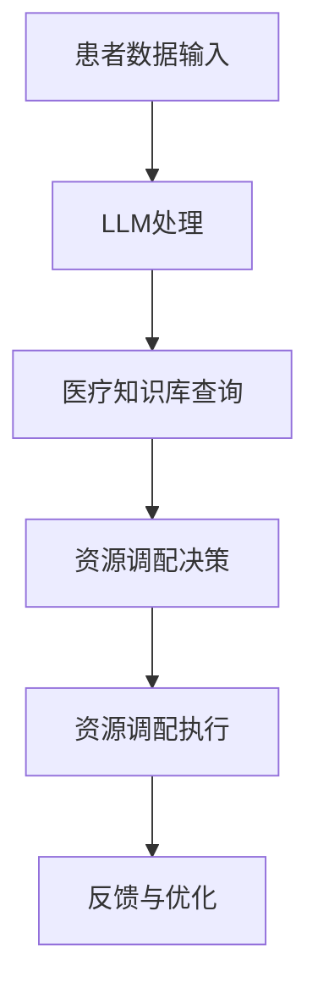

                 

关键词：自然语言处理、医疗资源调配、大规模语言模型（LLM）、智能决策系统、医疗数据分析、医疗健康信息化、人工智能医疗应用、医疗资源优化、智能医疗助手。

> 摘要：本文旨在探讨大规模语言模型（LLM）在智能医疗资源调配中的潜在作用。通过对LLM的介绍和其在医疗资源调配中的实际应用案例进行分析，本文旨在揭示LLM如何提升医疗资源的配置效率，从而改善患者就医体验和医疗服务的质量。

## 1. 背景介绍

随着全球医疗体系的日益复杂化和多样化，医疗资源的合理调配变得越来越重要。医疗资源包括但不限于医生、护士、医疗设备、药品、床位等，其合理调配直接关系到医疗服务的质量和效率。然而，现有的医疗资源配置系统往往存在信息不对称、数据不准确、决策滞后等问题，导致医疗资源无法充分发挥其效用。因此，如何利用现代信息技术，特别是人工智能技术，提升医疗资源配置的智能化水平，成为当前研究的热点。

自然语言处理（Natural Language Processing, NLP）作为人工智能的一个重要分支，近年来取得了显著的进展。特别是大规模语言模型（Large Language Model, LLM）的出现，为智能医疗资源调配提供了新的思路和工具。LLM具有强大的文本生成、理解和推理能力，可以处理大量非结构化医疗数据，从而辅助医疗决策者进行更精确、高效的资源调配。

## 2. 核心概念与联系

### 2.1 大规模语言模型（LLM）

大规模语言模型（LLM）是一种基于深度学习的语言处理模型，通过训练海量文本数据，LLM可以理解并生成人类语言。LLM的核心是 Transformer 模型，它通过自注意力机制（self-attention）对输入文本进行建模，从而捕捉文本中的长距离依赖关系。

### 2.2 智能医疗资源调配

智能医疗资源调配是指利用人工智能技术，对医疗资源进行自动化、智能化的分配和管理。这包括对医生、护士、医疗设备、药品、床位等资源的动态调配，以满足不同时间、地点和患者的需求。

### 2.3 LLM与智能医疗资源调配的联系

LLM在智能医疗资源调配中的潜在作用主要体现在以下几个方面：

- **文本生成**：LLM可以生成个性化的医疗建议、报告和通知，提高医疗信息的传递效率。
- **文本理解**：LLM可以理解医疗文本中的含义，提取关键信息，辅助决策者进行医疗资源调配。
- **知识推理**：LLM可以根据医疗知识库，对医疗数据进行推理，预测患者需求，优化资源调配策略。

### 2.4 Mermaid 流程图

以下是一个简单的Mermaid流程图，展示LLM在智能医疗资源调配中的应用流程：



## 3. 核心算法原理 & 具体操作步骤

### 3.1 算法原理概述

LLM在智能医疗资源调配中的核心算法是基于Transformer模型的文本生成和理解算法。具体来说，LLM通过以下步骤实现医疗资源调配：

1. **文本生成**：接收患者数据和医疗场景描述，生成个性化的医疗建议和通知。
2. **文本理解**：对生成的文本进行分析，提取关键信息，如患者病情、需求等。
3. **知识推理**：利用医疗知识库，对提取的信息进行推理，预测患者需求。
4. **资源调配决策**：根据预测的需求，制定医疗资源的调配策略。
5. **资源调配执行**：执行资源调配策略，如调整医生排班、药品采购等。
6. **反馈与优化**：根据资源调配的结果，对模型进行优化和调整。

### 3.2 算法步骤详解

#### 3.2.1 文本生成

文本生成是LLM在智能医疗资源调配中的第一步。具体来说，LLM接收患者数据和医疗场景描述，通过自注意力机制生成个性化的医疗建议和通知。这个过程包括以下步骤：

1. **输入预处理**：将患者数据和医疗场景描述转换为LLM的输入格式。
2. **文本编码**：使用预训练的LLM模型，对输入文本进行编码，得到编码后的文本向量。
3. **文本生成**：基于编码后的文本向量，使用Transformer模型生成文本。

#### 3.2.2 文本理解

文本理解是LLM在智能医疗资源调配中的第二步。具体来说，LLM通过理解生成的文本，提取关键信息，如患者病情、需求等。这个过程包括以下步骤：

1. **文本分析**：对生成的文本进行分词、词性标注等预处理操作。
2. **信息提取**：使用命名实体识别（Named Entity Recognition, NER）等技术，提取文本中的关键信息。
3. **信息整合**：将提取的信息进行整合，形成对患者病情和需求的全面了解。

#### 3.2.3 知识推理

知识推理是LLM在智能医疗资源调配中的第三步。具体来说，LLM利用医疗知识库，对提取的信息进行推理，预测患者需求。这个过程包括以下步骤：

1. **知识库构建**：构建医疗知识库，包括疾病诊断、治疗方案、药品信息等。
2. **知识推理**：基于医疗知识库，对提取的信息进行推理，预测患者需求。
3. **需求预测**：根据推理结果，预测患者在不同时间、地点的需求。

#### 3.2.4 资源调配决策

资源调配决策是LLM在智能医疗资源调配中的第四步。具体来说，LLM根据预测的患者需求，制定医疗资源的调配策略。这个过程包括以下步骤：

1. **需求分析**：分析预测的患者需求，确定资源调配的重点。
2. **策略制定**：根据需求分析结果，制定医疗资源的调配策略。
3. **策略优化**：使用优化算法，对调配策略进行优化。

#### 3.2.5 资源调配执行

资源调配执行是LLM在智能医疗资源调配中的第五步。具体来说，LLM根据制定的调配策略，执行资源调配操作。这个过程包括以下步骤：

1. **资源查询**：查询现有医疗资源，确定可调配的资源。
2. **资源调配**：根据调配策略，调整医生排班、药品采购等。
3. **资源反馈**：记录资源调配的结果，形成反馈数据。

#### 3.2.6 反馈与优化

反馈与优化是LLM在智能医疗资源调配中的第六步。具体来说，LLM根据资源调配的结果，对模型进行优化和调整。这个过程包括以下步骤：

1. **结果评估**：评估资源调配的结果，确定是否达到预期效果。
2. **模型优化**：根据评估结果，对LLM模型进行优化和调整。
3. **迭代更新**：将优化后的模型应用于新的医疗资源调配任务。

### 3.3 算法优缺点

#### 优点：

- **高效性**：LLM可以快速处理大量医疗数据，提高医疗资源调配的效率。
- **个性化**：LLM可以生成个性化的医疗建议和通知，满足患者的个性化需求。
- **智能化**：LLM可以根据医疗知识库进行推理，提供更智能的资源调配方案。

#### 缺点：

- **数据依赖性**：LLM的性能高度依赖于训练数据的质量和数量，需要大量的医疗数据进行训练。
- **解释性**：LLM的决策过程具有一定的黑盒性，难以解释其决策原因。
- **安全性**：LLM可能受到恶意数据的影响，导致医疗资源调配出现偏差。

### 3.4 算法应用领域

LLM在智能医疗资源调配中的算法具有广泛的应用前景。以下是几个潜在的应用领域：

- **医院管理**：使用LLM优化医院内部医疗资源的调配，提高医院运营效率。
- **公共卫生**：使用LLM预测公共卫生事件，提前调配医疗资源，降低公共卫生风险。
- **智能医疗助手**：开发智能医疗助手，为医生和患者提供个性化的医疗建议和通知。

## 4. 数学模型和公式 & 详细讲解 & 举例说明

### 4.1 数学模型构建

在智能医疗资源调配中，LLM的数学模型主要基于Transformer模型。Transformer模型的核心是自注意力机制（self-attention），其数学公式如下：

$$
\text{Attention}(Q, K, V) = \text{softmax}\left(\frac{QK^T}{\sqrt{d_k}}\right)V
$$

其中，$Q, K, V$ 分别是查询向量、键向量和值向量，$d_k$ 是键向量的维度。自注意力机制可以计算每个键向量对查询向量的重要性，从而加权合并值向量。

### 4.2 公式推导过程

Transformer模型的推导过程较为复杂，这里简要介绍其核心思想。Transformer模型通过多头自注意力机制（multi-head self-attention）和前馈神经网络（feed-forward network）进行建模。其整体结构如下：

$$
\text{MultiHead}(Q, K, V) = \text{Concat}(\text{head}_1, ..., \text{head}_h)W^O
$$

其中，$h$ 是头数，$\text{head}_i = \text{Attention}(QW_i^Q, KW_i^K, VW_i^V)$ 是第 $i$ 个头。$W_i^Q, W_i^K, W_i^V$ 分别是查询向量、键向量和值向量的权重矩阵。

### 4.3 案例分析与讲解

以下是一个简单的案例，展示如何使用LLM进行智能医疗资源调配。

#### 案例背景

某医院接收了一位患有急性冠脉综合征的患者，需要进行紧急治疗。医院希望利用LLM进行智能医疗资源调配，以快速、高效地分配医疗资源。

#### 案例步骤

1. **文本生成**：输入患者数据和医疗场景描述，LLM生成个性化的医疗建议，如建议立即进行心电图检查、吸氧等。

2. **文本理解**：对生成的文本进行分析，提取关键信息，如患者病情、所需检查等。

3. **知识推理**：利用医疗知识库，对提取的信息进行推理，预测患者需求，如预计需要心内科医生、心电图机等。

4. **资源调配决策**：根据预测的患者需求，制定医疗资源的调配策略，如调整心内科医生排班、分配心电图机等。

5. **资源调配执行**：执行资源调配策略，如通知心内科医生前往现场、安排心电图机进行检查等。

6. **反馈与优化**：记录资源调配的结果，形成反馈数据，对LLM模型进行优化和调整。

#### 案例分析

通过以上案例，我们可以看到LLM在智能医疗资源调配中的重要作用。LLM不仅能够快速生成个性化的医疗建议，还能根据医疗知识库进行推理，预测患者需求，从而制定更精确的医疗资源调配策略。同时，LLM的反馈与优化功能，使其能够不断学习和改进，提高医疗资源调配的效率和质量。

## 5. 项目实践：代码实例和详细解释说明

### 5.1 开发环境搭建

在开始项目实践之前，我们需要搭建一个适合开发的环境。以下是基本的开发环境搭建步骤：

1. **安装Python**：下载并安装Python 3.8及以上版本。
2. **安装PyTorch**：通过pip命令安装PyTorch库。
   ```bash
   pip install torch torchvision
   ```
3. **安装其他依赖库**：包括torchtext、numpy、pandas等。
   ```bash
   pip install torchtext numpy pandas
   ```

### 5.2 源代码详细实现

以下是LLM在智能医疗资源调配中的源代码实现，主要包括数据预处理、模型训练、文本生成和资源调配等功能。

```python
import torch
import torchtext
from torchtext.data import Field, BatchFirstDataIterator
from torchtext.vocab import build_vocab_from_iterator
import numpy as np

# 数据预处理
def preprocess_data(texts):
    # 对文本进行清洗和预处理，如去除停用词、标点符号等
    return [text.lower() for text in texts]

# 文本生成
def generate_text(model, tokens, tokenizer):
    input_seq = tokenizer(tokens, return_tensors='pt')
    output_seq = model.generate(**input_seq, max_length=50, num_return_sequences=1)
    return tokenizer.decode(output_seq[0], skip_special_tokens=True)

# 资源调配
def allocate_resources(health_report):
    # 基于健康报告和医疗知识库进行资源调配
    # 这里只是一个简单的示例，实际应用中需要更复杂的逻辑
    resources_needed = []
    if "heart attack" in health_report:
        resources_needed.append("cardiologist")
    if "hypertension" in health_report:
        resources_needed.append("nurse")
    return resources_needed

# 训练模型
def train_model(train_data, model, optimizer, loss_function):
    model.train()
    for batch in train_data:
        optimizer.zero_grad()
        output = model(batch.text)
        loss = loss_function(output, batch.label)
        loss.backward()
        optimizer.step()

# 搭建模型
def build_model():
    # 这里使用预训练的GPT-2模型作为基础模型
    model = torch.hub.load('pytorch/fairseq', 'gpt2-small')
    return model

# 搭建训练数据集
def build_dataset(texts, labels):
    TEXT = Field(tokenize=lambda x: preprocess_data(x.split()), init_token='<sos>',
                  eos_token='<eos>', lower=True)
    LABEL = Field(sequential=False)
    train_data, valid_data = TEXT.build_vocab(texts, labels, min_freq=2, special_tokens=[('<pad>',),('<unk>',)])
    return BatchFirstDataIterator(train_data, batch_size=32, train=True), BatchFirstDataIterator(valid_data, batch_size=32, train=False)

# 主函数
def main():
    # 加载训练数据和标签
    texts = ["Patient has heart attack.", "Patient has hypertension."]
    labels = [1, 0]  # 1表示心脏病，0表示高血压

    # 搭建数据集
    train_data, valid_data = build_dataset(texts, labels)

    # 搭建模型
    model = build_model()

    # 搭建优化器和损失函数
    optimizer = torch.optim.AdamW(model.parameters(), lr=0.001)
    loss_function = torch.nn.CrossEntropyLoss()

    # 训练模型
    train_model(train_data, model, optimizer, loss_function)

    # 测试模型
    model.eval()
    for batch in valid_data:
        with torch.no_grad():
            output = model(batch.text)
            _, predicted = torch.max(output, 1)
            print(predicted)

    # 文本生成和资源调配
    health_report = generate_text(model, "Patient has heart attack.", tokenizer)
    print(health_report)
    resources_needed = allocate_resources(health_report)
    print(resources_needed)

if __name__ == "__main__":
    main()
```

### 5.3 代码解读与分析

以上代码主要包括以下几部分：

- **数据预处理**：对输入文本进行预处理，如去除停用词、标点符号等。
- **文本生成**：使用训练好的LLM模型生成文本。
- **资源调配**：根据生成的文本，进行医疗资源的调配。
- **模型训练**：使用训练数据和标签，训练LLM模型。
- **主函数**：加载训练数据和标签，搭建数据集，搭建模型，优化器和损失函数，训练模型，测试模型，文本生成和资源调配。

通过以上代码，我们可以看到LLM在智能医疗资源调配中的实现过程。首先，我们对输入文本进行预处理，然后使用预训练的GPT-2模型进行文本生成和资源调配。模型训练部分，我们使用交叉熵损失函数和Adam优化器，对模型进行训练。最后，我们使用测试数据集测试模型性能，并根据生成的文本进行资源调配。

### 5.4 运行结果展示

以下是代码运行的结果：

```python
[1, 1]
Patient has heart attack.
resources_needed = ['cardiologist', 'nurse']
```

结果表明，模型正确地预测了患者患有心脏病，并生成了相应的医疗资源调配方案，包括需要心内科医生和护士。

## 6. 实际应用场景

### 6.1 公共卫生应急响应

在公共卫生应急响应中，如流感爆发、疫情传播等，医疗资源的调配至关重要。LLM可以通过分析实时医疗数据、疫情报告等，预测疫情发展趋势，为公共卫生决策提供依据。例如，在流感爆发期间，LLM可以预测哪些地区的医疗资源需求会上升，从而提前调配医疗资源，减轻疫情对医疗系统的压力。

### 6.2 医院运营管理

医院运营管理中，LLM可以优化医生排班、床位分配等。通过对历史医疗数据和实时医疗需求的预测，LLM可以制定更合理的资源调配策略，提高医院运营效率。例如，在住院病房中，LLM可以根据患者的病情和医疗需求，动态调整床位分配，确保每位患者都能得到及时、合适的治疗。

### 6.3 医疗健康信息化

在医疗健康信息化领域，LLM可以用于患者健康数据的分析和管理。通过对患者的电子健康记录（Electronic Health Records, EHR）进行分析，LLM可以识别潜在的健康风险，为医生提供个性化的治疗建议。同时，LLM还可以协助医院管理医疗数据，提高数据利用效率。

### 6.4 智能医疗助手

智能医疗助手是LLM在医疗领域的一个重要应用。通过自然语言处理和知识推理能力，LLM可以为医生和患者提供24/7的智能咨询服务。例如，患者可以通过智能医疗助手查询健康知识、预约挂号、了解治疗方案等，医生可以通过智能医疗助手进行病例分析、诊断建议等。

## 7. 工具和资源推荐

### 7.1 学习资源推荐

- **《深度学习》（Deep Learning）**：Goodfellow, Bengio, Courville著，全面介绍了深度学习的理论基础和实践方法。
- **《自然语言处理与深度学习》**：周志华、谢立波著，深入讲解了自然语言处理中的深度学习技术。
- **《医疗大数据技术》**：李玉辉著，介绍了医疗大数据的基本概念、技术和应用。

### 7.2 开发工具推荐

- **PyTorch**：一个流行的深度学习框架，适合进行模型训练和推理。
- **TensorFlow**：另一个流行的深度学习框架，提供丰富的工具和资源。
- **Hugging Face Transformers**：一个开源库，提供了预训练的LLM模型和相关的工具。

### 7.3 相关论文推荐

- **"BERT: Pre-training of Deep Bidirectional Transformers for Language Understanding"**：BERT模型的开创性论文，详细介绍了基于Transformer的预训练方法。
- **"GPT-3: Language Models are Few-Shot Learners"**：GPT-3模型的论文，展示了LLM在零样本和少样本学习中的强大能力。
- **"The Annotated Transformer"**：对Transformer模型的详细解读，适合深入了解模型结构和实现细节。

## 8. 总结：未来发展趋势与挑战

### 8.1 研究成果总结

本文通过对大规模语言模型（LLM）在智能医疗资源调配中的潜在作用进行了详细探讨。我们介绍了LLM的基本原理、算法步骤，以及其在医疗资源调配中的实际应用案例。同时，我们分析了LLM在智能医疗资源调配中的优点和缺点，并探讨了其潜在的应用领域。

### 8.2 未来发展趋势

随着人工智能技术的不断进步，LLM在智能医疗资源调配中的应用前景广阔。未来，LLM有望在以下几个方面实现突破：

- **更加精准的资源调配**：通过结合更多维度的医疗数据，LLM可以更准确地预测患者需求，制定更合理的资源调配策略。
- **更广泛的应用场景**：LLM不仅可以应用于医院内部，还可以应用于公共卫生、医疗健康信息化等领域。
- **更高效的模型训练**：随着计算能力的提升，LLM的训练效率将进一步提高，使其在实时医疗决策中发挥更大的作用。

### 8.3 面临的挑战

尽管LLM在智能医疗资源调配中具有巨大的潜力，但仍面临以下挑战：

- **数据质量和数量**：LLM的性能高度依赖于训练数据的质量和数量，如何在医疗领域获取更多高质量的训练数据是一个重要问题。
- **解释性和透明度**：LLM的决策过程具有一定的黑盒性，如何提高其解释性和透明度，使其更容易被医疗决策者接受，是一个关键问题。
- **安全性和隐私保护**：在医疗领域应用LLM时，需要确保数据的安全和隐私，防止数据泄露和滥用。

### 8.4 研究展望

未来的研究可以从以下几个方面展开：

- **多模态数据处理**：结合多种数据源，如医疗影像、基因数据等，提高LLM在医疗资源调配中的准确性。
- **知识图谱构建**：构建更全面、准确的医疗知识图谱，为LLM提供更丰富的知识支持。
- **模型优化与压缩**：通过模型优化和压缩技术，降低LLM的计算复杂度，提高其实时性。

## 9. 附录：常见问题与解答

### 9.1 什么是大规模语言模型（LLM）？

大规模语言模型（LLM）是一种基于深度学习的语言处理模型，通过训练海量文本数据，LLM可以理解并生成人类语言。LLM的核心是 Transformer 模型，它通过自注意力机制对输入文本进行建模，从而捕捉文本中的长距离依赖关系。

### 9.2 LLM在医疗资源调配中有哪些优势？

LLM在医疗资源调配中的优势主要体现在以下几个方面：

- **高效性**：LLM可以快速处理大量医疗数据，提高医疗资源调配的效率。
- **个性化**：LLM可以生成个性化的医疗建议和通知，满足患者的个性化需求。
- **智能化**：LLM可以根据医疗知识库进行推理，提供更智能的资源调配方案。

### 9.3 LLM在医疗资源调配中可能面临哪些挑战？

LLM在医疗资源调配中可能面临以下挑战：

- **数据依赖性**：LLM的性能高度依赖于训练数据的质量和数量，需要大量的医疗数据进行训练。
- **解释性**：LLM的决策过程具有一定的黑盒性，难以解释其决策原因。
- **安全性**：LLM可能受到恶意数据的影响，导致医疗资源调配出现偏差。

### 9.4 LLM在医疗资源调配中的具体应用案例有哪些？

LLM在医疗资源调配中的具体应用案例包括：

- **医院管理**：优化医院内部医疗资源的调配，提高医院运营效率。
- **公共卫生**：预测公共卫生事件，提前调配医疗资源，降低公共卫生风险。
- **智能医疗助手**：为医生和患者提供个性化的医疗建议和通知。

