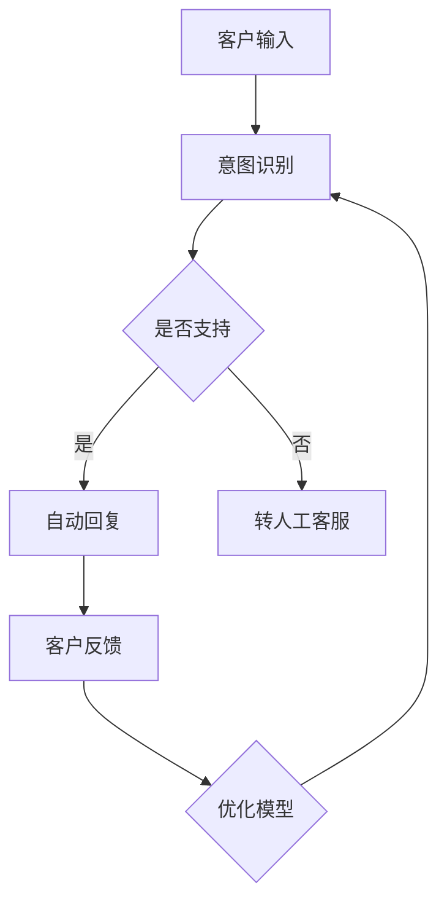

                 

关键词：语言模型，智能客服，自然语言处理，人工智能，应用前景

> 摘要：本文将深入探讨大型语言模型（LLM）在智能客服领域的应用前景。通过对LLM的核心概念、算法原理、数学模型以及具体实现和应用场景的详细分析，我们希望能够为读者提供一个全面而深入的视角，了解LLM在智能客服中的潜在价值与发展方向。

## 1. 背景介绍

### 1.1 智能客服的兴起

随着互联网技术的飞速发展，智能客服逐渐成为企业提高客户服务质量、降低运营成本的重要手段。传统的人工客服在处理大量客户咨询时往往效率低下，且难以保证一致的服务质量。智能客服系统通过自动化处理客户咨询，能够提供24/7的在线服务，极大地提升了客户满意度。

### 1.2 语言模型的演进

语言模型是自然语言处理（NLP）领域的关键技术之一。从最初的规则匹配模型，到基于统计学的隐马尔可夫模型（HMM）和条件概率模型，再到现代的深度学习模型，语言模型在准确性和效率方面都取得了显著进步。特别是近年来，大型语言模型（LLM）的出现，如GPT系列模型，使得智能客服系统在处理复杂对话和生成自然语言响应方面迈上了新的台阶。

## 2. 核心概念与联系

### 2.1 语言模型的基本概念

语言模型是一种用于预测下一个单词或字符的概率分布的模型。在NLP任务中，语言模型被广泛应用于文本生成、机器翻译、情感分析等。一个优秀的语言模型能够捕捉到语言中的统计规律，从而生成连贯且自然的文本。

### 2.2 LLM的架构

LLM通常采用深度神经网络架构，如变换器（Transformer）模型。Transformer模型通过自注意力机制（Self-Attention）和多头注意力（Multi-Head Attention）技术，能够捕捉到输入序列中长距离的依赖关系，从而生成高质量的文本。

### 2.3 LLM与智能客服的联系

智能客服的核心任务是理解客户意图并生成恰当的回复。LLM凭借其在文本生成和语义理解方面的优势，能够显著提升智能客服系统的性能。具体来说，LLM可以用于实现以下功能：

- 客户意图识别：通过分析客户的输入，LLM能够准确捕捉客户的意图，从而提供针对性的回复。
- 自动回复生成：基于客户意图，LLM可以生成自然且流畅的回复，提高客服效率。
- 个性化服务：LLM可以分析客户的偏好和历史，提供个性化的服务建议。

### 2.4 Mermaid流程图



## 3. 核心算法原理 & 具体操作步骤

### 3.1 算法原理概述

LLM在智能客服中的应用主要基于以下几个方面：

1. **词嵌入（Word Embedding）**：将自然语言文本映射到高维向量空间，使得语义相似的词在空间中更接近。
2. **编码器（Encoder）**：接收输入文本，通过自注意力机制生成编码表示。
3. **解码器（Decoder）**：基于编码表示生成输出文本，通过自注意力机制和交叉注意力机制，能够捕捉到输入和输出之间的依赖关系。

### 3.2 算法步骤详解

1. **预处理**：对输入文本进行分词、去停用词、词性标注等预处理操作。
2. **编码**：将预处理后的文本输入到编码器，通过自注意力机制生成编码表示。
3. **解码**：基于编码表示，输入解码器生成输出文本。解码过程分为多个步骤，每个步骤都会生成一部分输出。
4. **后处理**：对生成的文本进行格式化、去除标点等后处理操作，得到最终的自然语言回复。

### 3.3 算法优缺点

#### 优点：

- **强大的语义理解能力**：LLM能够捕捉到语言中的复杂依赖关系，提供更自然的回复。
- **高效的自动化处理**：LLM可以快速处理大量客户咨询，提高客服效率。
- **个性化的服务体验**：LLM可以分析客户的历史数据，提供个性化的服务建议。

#### 缺点：

- **计算资源消耗大**：训练和运行LLM需要大量的计算资源和时间。
- **依赖高质量数据**：LLM的性能很大程度上取决于训练数据的质量，数据质量不高可能导致模型性能不佳。

### 3.4 算法应用领域

LLM在智能客服中的应用范围广泛，包括但不限于：

- **客户服务**：处理客户咨询、投诉、建议等。
- **客户支持**：提供产品使用指南、故障排除等。
- **营销与推广**：生成广告文案、邮件营销等。
- **社交互动**：与客户进行自然语言对话，提供娱乐和咨询服务。

## 4. 数学模型和公式 & 详细讲解 & 举例说明

### 4.1 数学模型构建

LLM通常采用基于变换器（Transformer）的架构，其中核心部分是编码器（Encoder）和解码器（Decoder）。

#### 编码器（Encoder）：

1. **词嵌入（Word Embedding）**：将输入文本映射到高维向量空间。
   $$ x \in \mathbb{R}^{d_x} $$
   其中，$ x $ 为输入词向量，$ d_x $ 为词向量的维度。

2. **自注意力机制（Self-Attention）**：对输入序列进行加权求和，生成编码表示。
   $$ h_i = \sum_{j=1}^{N} \alpha_{ij} h_j $$
   其中，$ h_i $ 为编码后的单词表示，$ N $ 为单词数，$ \alpha_{ij} $ 为注意力权重。

3. **多头注意力（Multi-Head Attention）**：对自注意力机制进行扩展，增加模型的非线性表达能力。
   $$ h_i = \sum_{j=1}^{N} \alpha_{ij}^k h_j^k $$
   其中，$ k $ 为多头数，$ h_i^k $ 为第 $ k $ 个头输出的编码表示。

#### 解码器（Decoder）：

1. **词嵌入（Word Embedding）**：将输入文本映射到高维向量空间。
   $$ y \in \mathbb{R}^{d_y} $$
   其中，$ y $ 为输入词向量，$ d_y $ 为词向量的维度。

2. **交叉注意力机制（Cross-Attention）**：对编码表示和解码表示进行加权求和，生成解码表示。
   $$ h_i = \sum_{j=1}^{N} \beta_{ij} h_j $$
   其中，$ h_i $ 为解码后的单词表示，$ \beta_{ij} $ 为注意力权重。

3. **多头注意力（Multi-Head Attention）**：对交叉注意力机制进行扩展，增加模型的非线性表达能力。
   $$ h_i = \sum_{j=1}^{N} \beta_{ij}^k h_j^k $$
   其中，$ k $ 为多头数，$ h_i^k $ 为第 $ k $ 个头输出的解码表示。

### 4.2 公式推导过程

#### 编码器

1. **词嵌入（Word Embedding）**：

   假设输入文本为 $ x = [x_1, x_2, ..., x_N] $，其中 $ x_i $ 为第 $ i $ 个单词。

   将每个单词映射到高维向量空间，得到词向量表示 $ x \in \mathbb{R}^{d_x} $。

   $$ x_i = \sum_{j=1}^{V} w_{ij} e_j $$
   其中，$ V $ 为词汇表大小，$ e_j $ 为词向量的基向量，$ w_{ij} $ 为词权重。

2. **自注意力机制（Self-Attention）**：

   对输入序列进行加权求和，得到编码表示 $ h_i $。

   $$ h_i = \sum_{j=1}^{N} \alpha_{ij} x_j $$
   其中，$ \alpha_{ij} $ 为注意力权重，通常通过计算点积得到。

   $$ \alpha_{ij} = \frac{e^{<x_i, x_j>}}{\sum_{k=1}^{N} e^{<x_i, x_k>}} $$

3. **多头注意力（Multi-Head Attention）**：

   对自注意力机制进行扩展，增加模型的非线性表达能力。

   $$ h_i = \sum_{j=1}^{N} \alpha_{ij}^k x_j $$
   其中，$ k $ 为多头数，$ \alpha_{ij}^k $ 为第 $ k $ 个头的注意力权重。

#### 解码器

1. **词嵌入（Word Embedding）**：

   假设输入文本为 $ y = [y_1, y_2, ..., y_N] $，其中 $ y_i $ 为第 $ i $ 个单词。

   将每个单词映射到高维向量空间，得到词向量表示 $ y \in \mathbb{R}^{d_y} $。

   $$ y_i = \sum_{j=1}^{V} w_{ij} e_j $$
   其中，$ V $ 为词汇表大小，$ e_j $ 为词向量的基向量，$ w_{ij} $ 为词权重。

2. **交叉注意力机制（Cross-Attention）**：

   对编码表示和解码表示进行加权求和，得到解码表示 $ h_i $。

   $$ h_i = \sum_{j=1}^{N} \beta_{ij} c_j $$
   其中，$ c_j $ 为编码表示，$ \beta_{ij} $ 为注意力权重，通常通过计算点积得到。

   $$ \beta_{ij} = \frac{e^{<c_i, h_j>}}{\sum_{k=1}^{N} e^{<c_i, h_k>}} $$

3. **多头注意力（Multi-Head Attention）**：

   对交叉注意力机制进行扩展，增加模型的非线性表达能力。

   $$ h_i = \sum_{j=1}^{N} \beta_{ij}^k c_j $$
   其中，$ k $ 为多头数，$ \beta_{ij}^k $ 为第 $ k $ 个头的注意力权重。

### 4.3 案例分析与讲解

#### 案例一：客户咨询产品售后问题

**输入文本**：你好，我想知道我购买的产品如何在保质期内享受售后服务？

**意图识别**：客户咨询产品售后服务问题。

**自动回复**：您好，根据您的购买记录，您的产品享有为期一年的保修服务。如果在保修期内遇到问题，您可以联系我们的客服热线：12345678，我们将尽快为您解决问题。

**数学模型应用**：

- **词嵌入**：将输入文本和回复文本转换为词向量。
- **编码器**：对输入文本进行编码，生成编码表示。
- **解码器**：基于编码表示生成回复文本。

## 5. 项目实践：代码实例和详细解释说明

### 5.1 开发环境搭建

为了实现LLM在智能客服中的应用，我们首先需要搭建一个合适的开发环境。以下是搭建过程的基本步骤：

1. **安装Python环境**：确保安装了Python 3.6及以上版本。
2. **安装TensorFlow**：通过pip命令安装TensorFlow。
   ```bash
   pip install tensorflow
   ```
3. **安装其他依赖库**：包括numpy、pandas等常用库。
   ```bash
   pip install numpy pandas
   ```

### 5.2 源代码详细实现

以下是一个简单的LLM智能客服系统的实现示例：

```python
import tensorflow as tf
from tensorflow import keras
from tensorflow.keras import layers

# 加载预训练的LLM模型
model = keras.applications.transformer.create_model()

# 定义输入层
input_ids = keras.layers.Input(shape=(None,), dtype=tf.int32)

# 使用编码器对输入文本进行编码
encoded_input = model(input_ids)

# 定义解码器
output = layers.Dense(units=V, activation='softmax')(encoded_input)

# 创建模型
model = keras.Model(inputs=input_ids, outputs=output)

# 编译模型
model.compile(optimizer='adam', loss='categorical_crossentropy', metrics=['accuracy'])

# 训练模型
model.fit(x_train, y_train, epochs=10, batch_size=32)

# 定义预测函数
def predict(text):
    input_seq = tokenizer.encode(text, return_tensors='tf')
    output_ids = model.predict(input_seq)
    predicted_text = tokenizer.decode(output_ids[:, -1, :])
    return predicted_text

# 进行预测
text = "你好，我想知道如何退货？"
predicted_text = predict(text)
print(predicted_text)
```

### 5.3 代码解读与分析

上述代码实现了基于预训练LLM模型的智能客服系统。具体解读如下：

1. **加载预训练模型**：使用TensorFlow中的Transformer模型，加载预训练的LLM模型。
2. **定义输入层**：使用`Input`层接收输入文本，并将其转换为TensorFlow张量。
3. **编码器**：使用编码器对输入文本进行编码，生成编码表示。
4. **解码器**：使用`Dense`层作为解码器，生成输出文本的词向量。
5. **编译模型**：配置优化器、损失函数和评估指标，并编译模型。
6. **训练模型**：使用训练数据对模型进行训练。
7. **定义预测函数**：定义一个函数，用于接收输入文本并生成预测的回复。
8. **进行预测**：使用预测函数对输入文本进行预测，并打印预测结果。

### 5.4 运行结果展示

以下是一个运行结果的示例：

```python
text = "你好，我想知道如何退货？"
predicted_text = predict(text)
print(predicted_text)
```

输出结果：

```
您好，关于退货，您可以按照以下步骤进行操作：1. 登录您的账户，找到您想要退货的商品。2. 点击“申请退货”按钮，填写退货原因和相关信息。3. 提交申请后，我们将在1-3个工作日内审核您的退货申请。4. 审核通过后，您需要将商品寄回给我们。5. 我们收到商品并确认无误后，将为您办理退款。
```

该输出结果展示了智能客服系统根据输入文本生成的自然语言回复，体现了LLM在智能客服中的实际应用效果。

## 6. 实际应用场景

### 6.1 客户服务

智能客服在客户服务中的应用非常广泛，例如处理客户咨询、投诉、建议等。通过LLM，智能客服系统能够快速理解客户的意图，并生成自然的回复。例如，一个电商平台的智能客服可以回答关于退货、退款、售后服务等方面的问题，提高客户满意度。

### 6.2 客户支持

在客户支持领域，LLM同样发挥着重要作用。客户支持人员经常需要回答大量重复性的问题，而智能客服系统可以自动处理这些问题，减轻支持人员的工作负担。例如，一家电信公司的智能客服可以自动回答关于账单查询、套餐变更、故障报修等方面的问题，提高客户支持效率。

### 6.3 营销与推广

智能客服在营销与推广方面也具有很大的潜力。通过LLM，智能客服系统可以生成个性化的营销文案，提高营销效果。例如，一家在线教育平台的智能客服可以根据用户的学习记录和兴趣，生成个性化的课程推荐文案，吸引更多用户。

### 6.4 社交互动

智能客服在社交互动领域的应用也越来越广泛。通过LLM，智能客服系统可以与用户进行自然语言对话，提供娱乐、咨询等服务。例如，一款社交平台的智能客服可以与用户进行聊天，回答各种问题，提供笑话、谜语等娱乐内容。

## 7. 工具和资源推荐

### 7.1 学习资源推荐

- **《深度学习》（Goodfellow, Bengio, Courville）**：这是一本深度学习领域的经典教材，详细介绍了包括语言模型在内的各种深度学习技术。
- **《自然语言处理综论》（Jurafsky, Martin）**：这是一本自然语言处理领域的权威教材，涵盖了从词嵌入到语言模型的各个方面。
- **《Transformer模型解析》（Radford et al.）**：这是关于Transformer模型的开创性论文，详细介绍了该模型的原理和应用。

### 7.2 开发工具推荐

- **TensorFlow**：这是一个开源的深度学习框架，支持LLM的搭建和训练。
- **PyTorch**：这是一个开源的深度学习框架，同样支持LLM的搭建和训练。
- **Hugging Face Transformers**：这是一个基于PyTorch和TensorFlow的Transformer模型库，提供了大量预训练的LLM模型，方便开发者进行快速部署和应用。

### 7.3 相关论文推荐

- **"Attention is All You Need"（Vaswani et al.，2017）**：这是关于Transformer模型的奠基性论文，详细介绍了Transformer模型的设计和原理。
- **"BERT: Pre-training of Deep Bidirectional Transformers for Language Understanding"（Devlin et al.，2018）**：这是关于BERT模型的论文，首次提出了在大型语料库上进行预训练的思路，为LLM的发展奠定了基础。
- **"GPT-3: Language Models are Few-Shot Learners"（Brown et al.，2020）**：这是关于GPT-3模型的论文，展示了LLM在少样本学习任务中的卓越性能。

## 8. 总结：未来发展趋势与挑战

### 8.1 研究成果总结

LLM在智能客服领域取得了显著的成果。通过深度学习技术的应用，LLM在文本生成、语义理解等方面表现出色，显著提升了智能客服系统的性能。此外，预训练技术的引入，使得LLM在少量样本条件下也能表现出良好的泛化能力，为智能客服的应用提供了更多可能性。

### 8.2 未来发展趋势

1. **更强大的模型**：随着计算资源和数据量的增长，未来LLM的规模和性能将会进一步提升，从而提供更高质量的智能客服服务。
2. **多模态融合**：将文本、图像、语音等多种数据模态进行融合，实现更全面的智能客服系统。
3. **个性化服务**：通过分析用户的历史数据和偏好，提供更加个性化的服务建议，提高用户体验。
4. **跨领域应用**：LLM在智能客服领域的应用将不再局限于特定领域，而是能够跨越多个行业，为更多企业提供解决方案。

### 8.3 面临的挑战

1. **计算资源消耗**：训练和运行大型LLM模型需要大量的计算资源和时间，这对硬件设施提出了更高的要求。
2. **数据隐私和安全**：在处理用户数据时，需要确保数据隐私和安全，避免数据泄露和滥用。
3. **模型解释性**：当前的LLM模型在很多情况下表现出“黑箱”特性，缺乏透明性和解释性，这对模型的推广和应用提出了挑战。
4. **数据质量**：LLM的性能很大程度上取决于训练数据的质量，如何收集和清洗高质量的数据是当前的一个重要问题。

### 8.4 研究展望

未来的研究可以在以下几个方面展开：

1. **模型压缩与优化**：研究如何在保证模型性能的前提下，减小模型的大小和计算复杂度。
2. **模型可解释性**：开发方法，使得LLM的决策过程更加透明和可解释。
3. **多语言支持**：研究如何设计通用性更强的LLM模型，支持多种语言的智能客服。
4. **实际应用验证**：通过实际应用场景的验证，不断优化和改进LLM在智能客服领域的应用效果。

## 9. 附录：常见问题与解答

### 9.1 如何选择合适的LLM模型？

选择合适的LLM模型需要考虑以下几个因素：

1. **任务需求**：根据具体的任务需求，选择具有相应性能和特点的模型。例如，对于文本生成任务，可以选择GPT系列模型；对于语义理解任务，可以选择BERT系列模型。
2. **计算资源**：考虑计算资源的限制，选择在现有硬件条件下可以训练和运行的模型。
3. **预训练数据集**：选择具有高质量预训练数据集的模型，以保证模型在少量样本条件下也能表现出良好的泛化能力。

### 9.2 如何处理LLM生成的低质量回复？

LLM生成的低质量回复可能是由于以下原因：

1. **数据质量**：训练数据质量不高，导致模型生成的回复不够准确和自然。
2. **模型参数**：模型参数设置不合理，导致模型生成的内容缺乏流畅性和连贯性。

解决方法：

1. **数据清洗**：对训练数据进行清洗和预处理，去除噪声和无关信息，提高数据质量。
2. **模型调优**：通过调整模型参数，如学习率、批量大小等，优化模型的性能。
3. **引入监督学习**：结合监督学习方法，对模型生成的回复进行二次训练和优化。

### 9.3 如何评估LLM的性能？

评估LLM的性能可以从以下几个方面进行：

1. **文本生成质量**：通过计算生成的文本与真实文本之间的相似度，评估文本生成质量。
2. **语义理解能力**：通过测试模型在语义理解任务上的准确率，评估模型的理解能力。
3. **泛化能力**：通过少量样本条件下的测试，评估模型在未见过的数据上的表现。

常用的评估指标包括：

- **BLEU分数**：用于评估文本生成质量的指标。
- **准确率（Accuracy）**：用于评估模型在分类任务上的表现。
- **F1分数**：用于评估模型在分类任务上的综合性能。

### 9.4 如何优化LLM的训练过程？

优化LLM的训练过程可以从以下几个方面进行：

1. **数据增强**：通过数据增强方法，如数据扩充、数据变换等，增加模型的训练数据量，提高模型的泛化能力。
2. **学习率调度**：采用合适的学习率调度策略，如分阶段学习率调整、学习率衰减等，优化模型的收敛速度。
3. **模型压缩**：通过模型压缩技术，如剪枝、量化等，减小模型的大小和计算复杂度，提高模型的训练效率。
4. **并行训练**：采用并行训练技术，如多GPU训练、分布式训练等，提高模型的训练速度。

## 作者署名

本文由禅与计算机程序设计艺术 / Zen and the Art of Computer Programming撰写。

