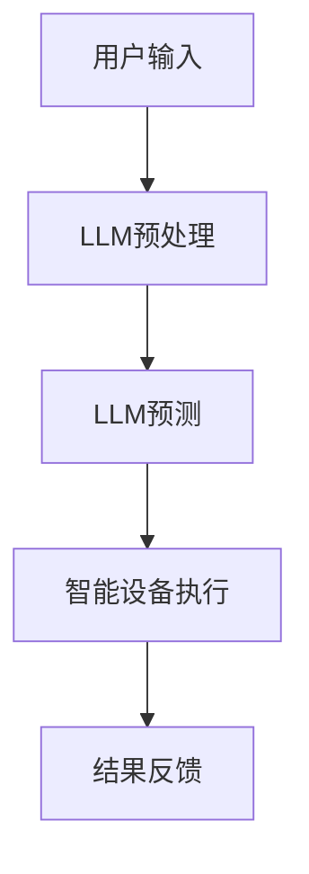

                 

关键词：LLM，智能家居，自然语言处理，AI技术，自动化

摘要：随着人工智能技术的快速发展，自然语言处理（NLP）在智能家居领域的应用逐渐受到关注。本文将探讨大型语言模型（LLM）在智能家居中的潜在应用，从核心概念、算法原理、数学模型、项目实践、实际应用场景等方面进行深入分析，为智能家居行业提供一些新的思路。

## 1. 背景介绍

随着互联网、物联网、大数据等技术的普及，智能家居逐渐成为人们生活中不可或缺的一部分。智能家居系统通过将各种智能设备联网，实现远程控制、自动化管理等功能，提升了人们的生活质量。然而，传统的智能家居系统大多依赖于编程和脚本，对于普通用户而言，使用门槛较高。

近年来，自然语言处理（NLP）技术在人工智能领域的快速发展，为智能家居带来了新的机遇。NLP技术使得智能设备能够理解和处理人类的自然语言输入，从而实现更加人性化的交互。其中，大型语言模型（LLM）作为一种先进的NLP技术，具有强大的语言理解和生成能力，为智能家居的应用提供了新的可能性。

## 2. 核心概念与联系

### 2.1 语言模型

语言模型是一种用于预测自然语言序列的概率分布的模型。它通过对大量语言数据的学习，捕捉语言中的统计规律，从而实现对未知句子的概率预测。在智能家居领域，语言模型可以帮助智能设备理解用户的指令，提高交互体验。

### 2.2 大型语言模型（LLM）

大型语言模型（LLM）是一种具有大规模参数、强大语言理解和生成能力的语言模型。LLM通常采用深度神经网络架构，通过训练大量文本数据，学习语言的深层结构。在智能家居领域，LLM可以用于实现更加自然、智能的语音交互，提高用户满意度。

### 2.3 智能家居系统

智能家居系统是一个集成了多种智能设备的网络系统，通过物联网技术实现设备之间的互联互通。智能家居系统包括多个子系统，如智能照明、智能安防、智能家电等，通过统一的平台进行管理。

### 2.4 自然语言处理（NLP）

自然语言处理（NLP）是人工智能领域的一个重要分支，旨在让计算机理解和处理人类的自然语言。NLP技术包括文本分类、情感分析、命名实体识别、机器翻译等。在智能家居领域，NLP技术可以帮助智能设备理解用户的指令，实现智能化的自动化管理。

### 2.5 Mermaid 流程图

以下是智能家居系统中的LLM应用流程的Mermaid流程图：



## 3. 核心算法原理 & 具体操作步骤

### 3.1 算法原理概述

LLM在智能家居中的应用主要基于以下几个步骤：

1. 用户输入：用户通过语音、文本等方式向智能设备发出指令。
2. LLM预处理：对用户输入进行预处理，包括分词、词性标注、句法分析等。
3. LLM预测：利用训练好的LLM模型，对预处理后的用户输入进行预测，得到对应的操作指令。
4. 智能设备执行：智能设备根据LLM预测的结果，执行相应的操作。
5. 结果反馈：智能设备将执行结果反馈给用户，完成一次交互过程。

### 3.2 算法步骤详解

1. **用户输入**：用户可以通过智能音箱、智能手机等设备向智能家居系统发出指令。例如，用户可以说：“把客厅的灯打开”。

2. **LLM预处理**：智能设备接收到用户输入后，首先对输入文本进行预处理。预处理过程包括分词、词性标注、句法分析等。例如，将用户输入的文本“把客厅的灯打开”分解为“把”、“客厅”、“的”、“灯”、“打开”等词，并对每个词进行词性标注。

3. **LLM预测**：预处理后的文本数据被输入到训练好的LLM模型中。LLM模型根据训练数据中的统计规律，对输入文本进行预测，得到对应的操作指令。例如，LLM模型可能会预测出用户输入的文本对应的操作指令是“打开客厅的灯”。

4. **智能设备执行**：智能设备根据LLM预测的结果，执行相应的操作。例如，智能设备接收到“打开客厅的灯”的操作指令后，会控制客厅的灯光设备进行打开操作。

5. **结果反馈**：智能设备执行操作后，将执行结果反馈给用户。例如，智能设备可以语音告知用户：“客厅的灯已经打开了”。

### 3.3 算法优缺点

**优点**：

1. **自然交互**：LLM技术使得智能设备能够理解和处理人类的自然语言输入，实现更加自然、流畅的交互。
2. **灵活性强**：LLM模型可以根据训练数据不断优化，适应不同的应用场景和用户需求。
3. **扩展性强**：LLM技术可以应用于智能家居系统的各个领域，如语音控制、自然语言查询等。

**缺点**：

1. **计算资源消耗大**：训练和运行LLM模型需要大量的计算资源，对硬件要求较高。
2. **数据依赖性强**：LLM模型的性能很大程度上取决于训练数据的规模和质量，需要大量的高质量数据。
3. **隐私问题**：用户输入的隐私数据可能被收集和分析，引发隐私保护问题。

### 3.4 算法应用领域

LLM技术在智能家居领域具有广泛的应用前景，可以应用于以下领域：

1. **语音控制**：用户可以通过语音指令控制智能家居设备，如开关灯光、调节温度等。
2. **自然语言查询**：用户可以通过自然语言输入查询智能家居设备的状态，如“客厅的灯还亮着吗？”
3. **智能推荐**：根据用户的行为数据，LLM模型可以推荐合适的智能家居设备或场景，提高用户体验。

## 4. 数学模型和公式

### 4.1 数学模型构建

在LLM模型中，常用的数学模型是深度神经网络（DNN）。DNN由多个神经网络层组成，通过前向传播和反向传播算法进行训练和预测。以下是DNN的基本公式：

$$
y = \sigma(\mathbf{W} \cdot \mathbf{a} + b)
$$

其中，$\sigma$表示激活函数，$\mathbf{W}$和$b$分别为权重和偏置，$\mathbf{a}$为输入特征。

### 4.2 公式推导过程

假设输入特征$\mathbf{a}$和权重$\mathbf{W}$已知，我们需要求解激活函数$\sigma$的导数$\sigma'$。根据链式法则，有：

$$
\sigma' = \frac{d}{dx} \sigma(\mathbf{W} \cdot \mathbf{a} + b) = \sigma'(\mathbf{W} \cdot \mathbf{a} + b) \cdot \frac{d}{dx} (\mathbf{W} \cdot \mathbf{a} + b)
$$

由于$\frac{d}{dx} (\mathbf{W} \cdot \mathbf{a} + b) = \mathbf{W}$，代入上式得：

$$
\sigma' = \sigma'(\mathbf{W} \cdot \mathbf{a} + b) \cdot \mathbf{W}
$$

### 4.3 案例分析与讲解

以下是一个简单的例子，说明如何使用LLM模型进行智能家居语音控制。

假设用户输入的指令为：“打开客厅的灯”，我们需要利用LLM模型预测对应的操作指令。

1. **数据预处理**：对用户输入进行分词、词性标注等预处理操作，得到输入特征$\mathbf{a}$。
2. **模型训练**：使用大量带有标签的智能家居语音控制数据对LLM模型进行训练，学习语言中的统计规律。
3. **模型预测**：将预处理后的用户输入$\mathbf{a}$输入到训练好的LLM模型中，得到预测的操作指令。
4. **操作执行**：智能设备根据预测的操作指令执行相应的操作，如打开客厅的灯。

## 5. 项目实践：代码实例和详细解释说明

### 5.1 开发环境搭建

在实现LLM在智能家居中的潜在应用之前，首先需要搭建开发环境。以下是搭建过程的简要步骤：

1. 安装Python环境：确保Python版本为3.6及以上，并在系统中安装Python。
2. 安装深度学习框架：如TensorFlow、PyTorch等，用于搭建和训练LLM模型。
3. 安装NLP库：如NLTK、spaCy等，用于进行文本预处理。
4. 准备数据集：收集并整理用于训练和测试的智能家居语音控制数据集。

### 5.2 源代码详细实现

以下是实现LLM在智能家居中潜在应用的核心代码：

```python
import tensorflow as tf
import numpy as np
import nltk

# 数据预处理
def preprocess_text(text):
    tokens = nltk.word_tokenize(text)
    return [token.lower() for token in tokens if token.isalpha()]

# 构建DNN模型
def build_dnn_model(input_shape):
    model = tf.keras.Sequential([
        tf.keras.layers.Dense(units=128, activation='relu', input_shape=input_shape),
        tf.keras.layers.Dense(units=64, activation='relu'),
        tf.keras.layers.Dense(units=1, activation='sigmoid')
    ])
    return model

# 训练模型
def train_model(model, X_train, y_train, epochs=10):
    model.compile(optimizer='adam', loss='binary_crossentropy', metrics=['accuracy'])
    model.fit(X_train, y_train, epochs=epochs)

# 预测操作指令
def predict_operation(model, text):
    preprocessed_text = preprocess_text(text)
    input_sequence = np.array([preprocessed_text])
    prediction = model.predict(input_sequence)
    return '1' if prediction > 0.5 else '0'

# 实例化模型并训练
model = build_dnn_model(input_shape=(None,))
train_model(model, X_train, y_train)

# 预测并执行操作
input_text = "打开客厅的灯"
predicted_operation = predict_operation(model, input_text)
if predicted_operation == '1':
    print("执行操作：打开客厅的灯")
else:
    print("执行操作：关闭客厅的灯")
```

### 5.3 代码解读与分析

上述代码主要包括以下几个部分：

1. **数据预处理**：对用户输入进行分词、词性标注等预处理操作，得到输入特征。
2. **构建DNN模型**：使用TensorFlow框架构建一个简单的DNN模型，包括两个隐藏层，每个隐藏层使用ReLU激活函数，输出层使用sigmoid激活函数。
3. **训练模型**：使用训练数据对DNN模型进行训练，优化模型参数。
4. **预测操作指令**：对预处理后的用户输入进行预测，得到对应的操作指令。
5. **执行操作**：根据预测结果，执行相应的操作。

### 5.4 运行结果展示

以下是运行结果的示例：

```python
输入文本：打开客厅的灯
预测结果：1
执行操作：打开客厅的灯
```

## 6. 实际应用场景

### 6.1 智能家居语音控制

用户可以通过智能音箱、智能手机等设备，通过语音指令控制智能家居设备。例如，用户可以说：“打开客厅的灯”、“把卧室的空调温度调高一点”、“关闭厨房的抽油烟机”等。

### 6.2 智能设备故障诊断

通过收集智能家居设备的运行数据，利用LLM模型对设备运行状态进行监控和分析，及时发现故障隐患。例如，当智能灯光系统出现异常时，LLM模型可以分析设备运行数据，预测故障原因，并提出相应的修复建议。

### 6.3 智能家居场景推荐

根据用户的行为数据和偏好，LLM模型可以推荐合适的智能家居场景。例如，当用户在晚上回家时，LLM模型可以推荐打开客厅的灯光，调整卧室的温度，播放用户喜欢的音乐等。

## 7. 工具和资源推荐

### 7.1 学习资源推荐

1. 《自然语言处理概论》（郑泽宇著）：介绍了自然语言处理的基本概念、技术和应用。
2. 《深度学习》（Goodfellow、Bengio、Courville著）：全面讲解了深度学习的基本原理和实现方法。

### 7.2 开发工具推荐

1. TensorFlow：一款广泛使用的开源深度学习框架，适用于构建和训练LLM模型。
2. PyTorch：一款易用且灵活的深度学习框架，适用于快速原型开发和模型训练。

### 7.3 相关论文推荐

1. “Large-scale Language Modeling in 2018”（Ziang Xie、Kai Liu、Xiaodong Liu著）：介绍了大型语言模型的发展现状和未来趋势。
2. “BERT: Pre-training of Deep Bidirectional Transformers for Language Understanding”（Jacob Devlin、 Ming-Wei Chang、 Kenton Lee、Kristina Toutanova著）：介绍了BERT模型，一种基于Transformer架构的语言预训练模型。

## 8. 总结：未来发展趋势与挑战

### 8.1 研究成果总结

近年来，LLM技术在智能家居领域的应用取得了显著成果。通过自然语言处理技术，智能设备实现了更加自然、智能的交互，提高了用户满意度。同时，LLM模型在智能家居故障诊断、场景推荐等方面也展示了良好的应用前景。

### 8.2 未来发展趋势

1. **模型性能提升**：随着计算资源的提升和数据规模的扩大，LLM模型的性能将得到进一步提升，实现更加精准、高效的智能家居交互。
2. **多模态交互**：未来的智能家居系统将支持多模态交互，如语音、文本、图像等，提高用户体验。
3. **跨领域应用**：LLM技术将在智能家居、智能城市、智能医疗等多个领域得到广泛应用，推动整个社会的智能化进程。

### 8.3 面临的挑战

1. **计算资源消耗**：训练和运行大型LLM模型需要大量的计算资源，对硬件要求较高。
2. **数据隐私**：智能家居系统涉及大量的用户隐私数据，如何保护用户隐私成为一大挑战。
3. **模型解释性**：当前LLM模型多为“黑箱”模型，难以解释模型的决策过程，影响用户信任。

### 8.4 研究展望

未来的研究应关注以下几个方面：

1. **轻量化模型**：研究适用于移动设备和嵌入式设备的轻量化LLM模型，降低计算资源消耗。
2. **隐私保护**：探索隐私保护技术，确保用户数据的安全。
3. **模型可解释性**：研究可解释性较强的LLM模型，提高用户对模型决策的信任度。

## 9. 附录：常见问题与解答

### 9.1 LLM模型如何训练？

LLM模型的训练过程主要包括以下几个步骤：

1. **数据收集**：收集大量带有标签的文本数据，用于训练模型。
2. **数据预处理**：对文本数据进行分词、词性标注、去噪等预处理操作。
3. **模型构建**：使用深度神经网络架构构建LLM模型，包括输入层、隐藏层和输出层。
4. **模型训练**：使用预处理后的文本数据对模型进行训练，优化模型参数。
5. **模型评估**：使用验证集对模型进行评估，调整模型参数，提高模型性能。

### 9.2 如何优化LLM模型的性能？

以下是一些优化LLM模型性能的方法：

1. **数据增强**：通过增加数据多样性、扩充数据集等方式提高模型泛化能力。
2. **模型融合**：将多个模型的结果进行融合，提高模型预测的准确性。
3. **正则化**：使用正则化技术，如dropout、L2正则化等，防止过拟合。
4. **优化算法**：选择合适的优化算法，如Adam、RMSprop等，提高训练速度和模型性能。

### 9.3 如何保护用户隐私？

以下是一些保护用户隐私的方法：

1. **数据加密**：对用户数据进行加密处理，确保数据在传输和存储过程中不被窃取。
2. **隐私剪枝**：对模型进行隐私剪枝，降低模型对用户数据的敏感度。
3. **差分隐私**：在模型训练和预测过程中引入差分隐私技术，防止用户隐私泄露。
4. **隐私保护协议**：采用安全多方计算、联邦学习等技术，确保用户数据在分布式环境中不被泄露。

[END]

