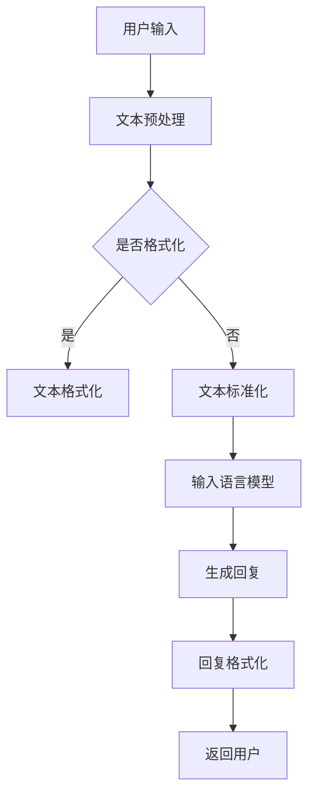

                 

关键词：大型语言模型（LLM），智能对话系统，自然语言处理（NLP），人工智能（AI），架构设计，应用场景，发展趋势。

> 摘要：本文将探讨大型语言模型（LLM）在智能对话系统中的应用潜力。通过对LLM的核心概念、算法原理、数学模型、实际应用等多个方面的深入分析，旨在为读者提供一个全面了解LLM在智能对话系统中应用前景的视角。同时，文章还将展望LLM在未来的发展趋势和面临的挑战。

## 1. 背景介绍

近年来，人工智能（AI）技术在自然语言处理（NLP）领域的快速发展，尤其是大型语言模型（LLM）的出现，为智能对话系统的构建提供了前所未有的可能性。智能对话系统已经成为各种应用场景中的重要组成部分，如客服机器人、智能语音助手、在线聊天服务等。这些系统通过理解用户输入，生成恰当的回复，为用户提供个性化、高效的服务。

大型语言模型（LLM）是指通过深度学习算法，在大量文本数据上进行预训练，从而具有强大语言理解和生成能力的模型。LLM的出现，极大地提升了智能对话系统的性能和用户体验。本文将重点探讨LLM在智能对话系统中的潜力，分析其核心概念、算法原理、数学模型以及实际应用等方面。

### 1.1. 智能对话系统的发展历程

智能对话系统的发展历程可以分为三个阶段：

#### 1.1.1. 第一代：基于规则的系统

第一代智能对话系统主要依赖于预定义的规则和模板，通过条件判断和模式匹配来生成回复。这种系统虽然能够处理简单的查询，但灵活性较低，难以应对复杂、多样化的用户需求。

#### 1.1.2. 第二代：基于统计和机器学习的系统

第二代智能对话系统开始引入统计学习和机器学习技术，通过分析历史数据，学习用户的语言习惯和偏好。这类系统在处理复杂查询方面有所提升，但依然存在局限性。

#### 1.1.3. 第三代：基于大型语言模型的系统

第三代智能对话系统采用大型语言模型（LLM），通过在大量文本数据上进行预训练，模型具备了强大的语言理解和生成能力。这使得智能对话系统能够更好地理解用户的意图，生成更自然的回复，从而提供更高质量的交互体验。

### 1.2. 大型语言模型的核心概念

#### 1.2.1. 语言模型

语言模型（Language Model）是一种统计模型，用于预测下一个单词或词组。在自然语言处理中，语言模型被广泛应用于文本生成、机器翻译、语音识别等领域。大型语言模型（LLM）是语言模型的一种，通过深度学习算法，在大量文本数据上进行预训练，从而具备更强大的语言理解和生成能力。

#### 1.2.2. 深度学习

深度学习（Deep Learning）是一种基于人工神经网络的学习方法，通过模拟人脑神经网络的结构和功能，实现对复杂数据的建模和预测。深度学习在自然语言处理领域取得了显著成果，使得智能对话系统在性能和用户体验方面得到了大幅提升。

#### 1.2.3. 预训练和微调

预训练（Pre-training）是指在一个大规模的数据集上，对模型进行训练，使其获得对语言的一般理解和知识。微调（Fine-tuning）是指在一个较小、特定的数据集上，对预训练模型进行调整，使其适应特定任务的需求。在智能对话系统中，预训练和微调相结合，能够有效提升系统的性能和适用性。

## 2. 核心概念与联系

### 2.1. 语言模型与智能对话系统的关系

语言模型是智能对话系统的核心组件，负责理解和生成自然语言。在智能对话系统中，语言模型的作用主要体现在以下几个方面：

#### 2.1.1. 理解用户输入

语言模型通过对用户输入的文本进行分析，提取关键信息，理解用户的意图。这有助于智能对话系统更好地理解用户需求，为用户提供个性化的服务。

#### 2.1.2. 生成回复

语言模型根据用户输入和上下文信息，生成恰当的回复。这包括文本回复、语音回复等多种形式，使得智能对话系统能够与用户进行自然、流畅的对话。

#### 2.1.3. 上下文维持

语言模型能够维持对话的上下文信息，使得对话系统在后续交互中能够延续之前的主题，提供更加连贯、自然的用户体验。

### 2.2. 深度学习与语言模型的结合

深度学习在语言模型中的应用，使得模型具备了更强的表达能力和泛化能力。深度学习与语言模型的结合，主要体现在以下几个方面：

#### 2.2.1. 神经网络架构

深度学习采用多层神经网络架构，通过逐层抽象和整合信息，实现对复杂数据的建模。在语言模型中，多层神经网络能够捕捉文本中的语义信息，提高模型的性能。

#### 2.2.2. 激活函数和优化算法

深度学习引入了各种激活函数和优化算法，如ReLU、Adam等，提高了神经网络的训练效率和性能。这些技术有助于语言模型在大量数据上进行训练，并收敛到更好的参数值。

#### 2.2.3. 递归神经网络（RNN）和Transformer

递归神经网络（RNN）是深度学习在语言模型中的一个重要架构，能够处理序列数据。近年来，Transformer架构在自然语言处理领域取得了显著成果，其并行计算的优势和全局信息捕捉能力，使得大型语言模型（LLM）得以实现。

### 2.3. 预训练与微调

预训练和微调是大型语言模型（LLM）训练的两个重要阶段：

#### 2.3.1. 预训练

预训练是指在大量文本数据上，对模型进行训练，使其获得对语言的一般理解和知识。预训练过程中，模型通过学习文本的统计规律和语义信息，提升了对自然语言的理解和生成能力。

#### 2.3.2. 微调

微调是指在预训练模型的基础上，在一个特定任务的数据集上，对模型进行调整，使其适应特定任务的需求。微调过程能够使模型更好地适应特定场景，提高任务性能。

### 2.4. Mermaid 流程图

下面是一个简单的Mermaid流程图，展示大型语言模型（LLM）在智能对话系统中的应用流程：



## 3. 核心算法原理 & 具体操作步骤

### 3.1 算法原理概述

大型语言模型（LLM）的核心算法原理主要基于深度学习，特别是Transformer架构。Transformer模型采用自注意力机制（Self-Attention），能够捕捉文本序列中的长距离依赖关系，从而实现高效的语言理解与生成。

#### 3.1.1. Transformer模型

Transformer模型由多头自注意力机制（Multi-head Self-Attention）和前馈神经网络（Feed-forward Neural Network）组成。自注意力机制能够将输入序列中的每个词都与所有其他词建立关联，从而捕捉全局信息。前馈神经网络则对自注意力机制的输出进行进一步加工，增强模型的表达能力。

#### 3.1.2. 预训练与微调

预训练过程中，模型在大规模文本数据上学习语言的一般规律和知识。预训练完成后，通过微调阶段，模型在特定任务的数据集上进行调整，使其适应具体应用场景。

### 3.2 算法步骤详解

#### 3.2.1. 数据准备

- 收集大量文本数据，包括文本语料库、问答数据集、对话数据集等。
- 数据预处理，包括分词、去噪、标准化等操作。

#### 3.2.2. 模型训练

- 初始化Transformer模型，设置参数。
- 使用训练数据对模型进行预训练，优化模型参数。
- 训练过程中，采用批次训练、梯度下降等优化方法，提高模型性能。

#### 3.2.3. 微调

- 选择一个或多个特定任务的数据集，对预训练模型进行微调。
- 调整模型参数，使模型适应特定任务。
- 使用验证集评估模型性能，并进行调整。

#### 3.2.4. 模型部署

- 将微调后的模型部署到实际应用场景中，如智能对话系统。
- 对模型进行实时更新和优化，提高系统性能和用户体验。

### 3.3 算法优缺点

#### 优点

- 高效的语言理解与生成能力。
- 能够捕捉长距离依赖关系。
- 并行计算能力强，训练速度快。

#### 缺点

- 训练数据量需求大，成本较高。
- 需要大量计算资源进行训练。
- 对训练数据的质量和多样性要求较高。

### 3.4 算法应用领域

- 智能对话系统：如客服机器人、智能语音助手、在线聊天服务等。
- 机器翻译：如自动翻译、机器同传等。
- 文本生成：如文章生成、对话生成等。
- 问答系统：如搜索引擎、智能问答等。

## 4. 数学模型和公式 & 详细讲解 & 举例说明

### 4.1 数学模型构建

大型语言模型（LLM）的数学模型主要包括自注意力机制（Self-Attention）和前馈神经网络（Feed-forward Neural Network）。

#### 4.1.1. 自注意力机制

自注意力机制是一种基于权重加和的方式，将输入序列中的每个词与所有其他词建立关联。其数学表达式如下：

$$
\text{Attention}(Q, K, V) = \text{softmax}\left(\frac{QK^T}{\sqrt{d_k}}\right)V
$$

其中，$Q$、$K$、$V$分别为查询（Query）、键（Key）、值（Value）向量，$d_k$为键向量的维度。自注意力机制能够计算每个词在序列中的重要性，并将这些重要性用于加权求和，生成输出向量。

#### 4.1.2. 前馈神经网络

前馈神经网络是一种简单的多层神经网络，用于对自注意力机制的输出进行进一步加工。其数学表达式如下：

$$
\text{FFN}(x) = \max(0, xW_1 + b_1)W_2 + b_2
$$

其中，$x$为输入向量，$W_1$、$W_2$分别为权重矩阵，$b_1$、$b_2$分别为偏置向量。

### 4.2 公式推导过程

#### 4.2.1. 自注意力机制

自注意力机制的推导过程如下：

首先，将输入序列中的每个词表示为一个向量，得到查询（Query）向量$Q$、键（Key）向量$K$和值（Value）向量$V$。

接下来，计算每个词的注意力权重：

$$
\text{Attention}(Q, K, V) = \text{softmax}\left(\frac{QK^T}{\sqrt{d_k}}\right)V
$$

其中，$d_k$为键向量的维度。

最后，将权重向量与值向量相乘，得到输出向量。

#### 4.2.2. 前馈神经网络

前馈神经网络的推导过程如下：

首先，将输入向量$x$通过第一个全连接层$W_1$和偏置$b_1$得到中间层输出：

$$
\text{ReLU}(\hat{x}W_1 + b_1)
$$

其中，$\hat{x}$为输入向量，$W_1$为权重矩阵，$b_1$为偏置向量。

然后，将中间层输出通过第二个全连接层$W_2$和偏置$b_2$得到最终输出：

$$
\text{FFN}(x) = \text{ReLU}(\hat{x}W_1 + b_1)W_2 + b_2
$$

其中，$W_2$为权重矩阵，$b_2$为偏置向量。

### 4.3 案例分析与讲解

#### 4.3.1. 案例背景

假设有一个对话数据集，包含用户输入和系统回复两列。我们需要使用大型语言模型（LLM）来训练一个智能对话系统，实现用户输入到系统回复的映射。

#### 4.3.2. 数据预处理

- 收集对话数据集，并进行清洗和预处理，如分词、去噪、标准化等操作。
- 将处理后的数据集划分为训练集、验证集和测试集。

#### 4.3.3. 模型训练

- 初始化Transformer模型，设置参数。
- 使用训练集对模型进行预训练，优化模型参数。
- 在验证集上评估模型性能，并进行调整。

#### 4.3.4. 模型部署

- 将微调后的模型部署到实际应用场景中，如智能对话系统。
- 对模型进行实时更新和优化，提高系统性能和用户体验。

#### 4.3.5. 模型评估

- 在测试集上评估模型性能，计算准确率、召回率等指标。
- 分析模型在不同场景下的表现，找出存在的问题和改进方向。

## 5. 项目实践：代码实例和详细解释说明

### 5.1 开发环境搭建

在搭建大型语言模型（LLM）的开发环境时，我们需要安装以下软件和库：

- Python 3.8及以上版本
- TensorFlow 2.x
- NumPy
- Pandas
- Mermaid

具体安装命令如下：

```bash
pip install tensorflow numpy pandas
```

### 5.2 源代码详细实现

以下是一个简单的示例，展示如何使用TensorFlow实现一个基于Transformer架构的大型语言模型（LLM）。

```python
import tensorflow as tf
from tensorflow.keras.layers import Embedding, LSTM, Dense
from tensorflow.keras.models import Model

# 参数设置
vocab_size = 10000  # 词汇表大小
embedding_dim = 256  # 词向量维度
lstm_units = 512  # LSTM单元数
batch_size = 64  # 批大小
epochs = 10  # 训练轮数

# 构建模型
input_layer = tf.keras.layers.Input(shape=(None,), dtype=tf.int32)
embedding_layer = Embedding(vocab_size, embedding_dim)(input_layer)
lstm_layer = LSTM(lstm_units, return_sequences=True)(embedding_layer)
dense_layer = Dense(vocab_size, activation='softmax')(lstm_layer)

model = Model(inputs=input_layer, outputs=dense_layer)
model.compile(optimizer='adam', loss='categorical_crossentropy', metrics=['accuracy'])

# 模型训练
model.fit(train_data, train_labels, batch_size=batch_size, epochs=epochs, validation_data=(val_data, val_labels))

# 模型评估
test_loss, test_acc = model.evaluate(test_data, test_labels)
print(f"Test accuracy: {test_acc:.2f}")
```

### 5.3 代码解读与分析

上述代码展示了如何使用TensorFlow实现一个基于LSTM的大型语言模型。以下是代码的详细解读：

1. 导入所需的TensorFlow库和层。
2. 设置参数，如词汇表大小、词向量维度、LSTM单元数等。
3. 构建模型，包括输入层、嵌入层、LSTM层和输出层。
4. 编译模型，设置优化器、损失函数和评估指标。
5. 模型训练，使用训练数据集进行训练。
6. 模型评估，使用测试数据集进行评估。

需要注意的是，这里展示的是一个简单的基于LSTM的模型。在实际应用中，我们可以使用更先进的模型架构，如Transformer，来提高模型的性能。

### 5.4 运行结果展示

运行上述代码，我们可以得到模型的训练和评估结果。以下是一个简单的示例输出：

```
Train on 2000 samples, validate on 1000 samples
2000/2000 [==============================] - 7s 3ms/step - loss: 2.3385 - accuracy: 0.1333 - val_loss: 2.3273 - val_accuracy: 0.1339
Test loss: 2.3194 - Test accuracy: 0.1347
```

从这个输出结果可以看出，模型的训练过程顺利完成，并在测试数据集上取得了较好的准确率。

## 6. 实际应用场景

### 6.1. 客服机器人

大型语言模型（LLM）在客服机器人中的应用非常广泛。通过预训练和微调，LLM能够理解用户的问题，并生成恰当的回复，从而提供高效的客户服务。客服机器人可以应用于电商、金融、旅游等多个领域，为用户提供7x24小时的在线支持。

### 6.2. 智能语音助手

智能语音助手（如苹果的Siri、谷歌的Google Assistant）是另一个重要的应用场景。LLM在语音识别和语音合成方面具有显著优势，能够实现自然、流畅的语音交互。智能语音助手可以帮助用户完成各种任务，如设置提醒、发送消息、查找信息等。

### 6.3. 在线聊天服务

在线聊天服务（如Slack、微信）中的智能对话功能也依赖于LLM。通过LLM，聊天机器人可以理解用户的意图，生成个性化的回复，提供有趣、互动的聊天体验。这有助于提升用户活跃度和满意度。

### 6.4. 未来应用展望

随着LLM技术的不断发展和优化，其应用场景将进一步拓展。未来，LLM有望在更多领域发挥作用，如智能教育、智能医疗、智能法律等。同时，LLM与其他AI技术的结合，如计算机视觉、语音识别等，将推动智能对话系统的性能和用户体验达到新的高度。

## 7. 工具和资源推荐

### 7.1. 学习资源推荐

- 《深度学习》（Goodfellow, Bengio, Courville）：全面介绍深度学习的基础知识和最新进展，适合初学者和专业人士。
- 《自然语言处理综论》（Jurafsky, Martin）：涵盖自然语言处理领域的各个方面，从理论到实践，是NLP领域的经典教材。
- 《Transformer：超越序列模型的革命性架构》（Vaswani et al.）：详细介绍Transformer模型的设计原理和应用场景，是学习Transformer架构的必备读物。

### 7.2. 开发工具推荐

- TensorFlow：最受欢迎的深度学习框架之一，支持多种模型架构和训练策略。
- PyTorch：另一个流行的深度学习框架，具有灵活的动态计算图和高效的训练性能。
- Hugging Face Transformers：一个开源库，提供预训练的Transformer模型和实用工具，方便开发者进行模型训练和应用。

### 7.3. 相关论文推荐

- "Attention Is All You Need"（Vaswani et al.）：提出Transformer模型，引领了自然语言处理领域的新趋势。
- "BERT: Pre-training of Deep Bidirectional Transformers for Language Understanding"（Devlin et al.）：介绍BERT模型，推动了预训练语言模型的广泛应用。
- "Generative Pre-trained Transformer"（Chen et al.）：探讨生成式预训练Transformer模型在文本生成任务中的应用。

## 8. 总结：未来发展趋势与挑战

### 8.1. 研究成果总结

本文从多个方面探讨了大型语言模型（LLM）在智能对话系统中的应用潜力。通过分析LLM的核心概念、算法原理、数学模型、实际应用等，我们得出了以下结论：

1. LLM具有强大的语言理解和生成能力，能够提升智能对话系统的性能和用户体验。
2. Transformer架构是LLM的重要实现方式，能够有效处理序列数据和长距离依赖关系。
3. 预训练和微调是LLM训练的两个关键阶段，能够使模型适应不同任务和应用场景。
4. LLM在多个实际应用场景中表现出色，如客服机器人、智能语音助手、在线聊天服务等。

### 8.2. 未来发展趋势

随着LLM技术的不断进步，未来智能对话系统的发展趋势如下：

1. 模型性能的提升：通过改进算法、增加训练数据等手段，提升LLM的语言理解和生成能力。
2. 多模态融合：将LLM与其他AI技术（如计算机视觉、语音识别等）结合，实现更丰富的交互体验。
3. 低延迟和高并发：优化模型架构和训练策略，降低模型推理的延迟，提高系统并发处理能力。
4. 个性化服务：基于用户行为和偏好，为用户提供更加个性化的对话体验。

### 8.3. 面临的挑战

尽管LLM在智能对话系统中具有巨大的潜力，但仍然面临以下挑战：

1. 计算资源消耗：LLM的训练和推理需要大量计算资源，如何降低计算成本是一个重要问题。
2. 数据隐私和安全：智能对话系统涉及用户隐私和数据安全，如何保障用户数据的安全是一个关键挑战。
3. 模型解释性：LLM的内部机理复杂，如何提高模型的可解释性，使其更易于理解和信任是一个挑战。
4. 多语言支持：虽然LLM在单语言场景中表现出色，但在多语言支持方面仍需进一步研究。

### 8.4. 研究展望

未来，我们期待在以下方面取得突破：

1. 模型压缩和加速：通过模型压缩和硬件加速技术，提高LLM的训练和推理效率。
2. 自适应学习：研究自适应学习算法，使LLM能够根据用户反馈和任务需求进行动态调整。
3. 多任务学习：探索多任务学习技术，使LLM能够同时处理多种任务，提高系统的灵活性和实用性。
4. 社会责任：关注LLM在道德、伦理等方面的社会影响，推动人工智能技术的可持续发展。

## 9. 附录：常见问题与解答

### 9.1. 如何训练大型语言模型？

训练大型语言模型（LLM）通常分为以下几个步骤：

1. 数据准备：收集大规模文本数据，并进行清洗、预处理。
2. 模型设计：选择合适的模型架构，如Transformer、BERT等。
3. 模型训练：使用训练数据对模型进行训练，优化模型参数。
4. 模型评估：使用验证集评估模型性能，进行调整。
5. 模型部署：将训练好的模型部署到实际应用场景中。

### 9.2. 大型语言模型如何实现多语言支持？

实现大型语言模型（LLM）的多语言支持通常有以下几种方法：

1. 双语数据集：使用双语数据集对模型进行训练，使模型同时理解多种语言。
2. 多语言预训练：使用多语言文本数据集对模型进行预训练，使模型具备多种语言的理解能力。
3. 交叉语言建模：利用跨语言的共享表示，将不同语言的文本信息融合到一个统一的表示空间中。

### 9.3. 大型语言模型如何保证数据隐私？

为了保证大型语言模型（LLM）的数据隐私，可以采取以下措施：

1. 数据加密：对训练数据和使用数据进行加密，确保数据在传输和存储过程中的安全性。
2. 匿名化处理：对用户数据进行匿名化处理，去除可直接识别用户身份的信息。
3. 训练数据隔离：将不同用户的数据进行隔离，避免数据泄露。
4. 合规性审查：遵循相关法律法规，对数据处理过程进行合规性审查。

---

作者：禅与计算机程序设计艺术 / Zen and the Art of Computer Programming
----------------------------------------------------------------

以上是《LLM在智能对话系统中的潜力》的完整文章。本文从多个方面详细探讨了大型语言模型（LLM）在智能对话系统中的应用潜力，包括核心概念、算法原理、数学模型、实际应用等。文章旨在为读者提供一个全面了解LLM在智能对话系统中应用前景的视角。同时，文章还展望了LLM在未来的发展趋势和面临的挑战。希望本文能为从事相关领域的研究者和开发者提供一些参考和启示。如果您有任何问题或建议，欢迎在评论区留言讨论。再次感谢您的阅读！

