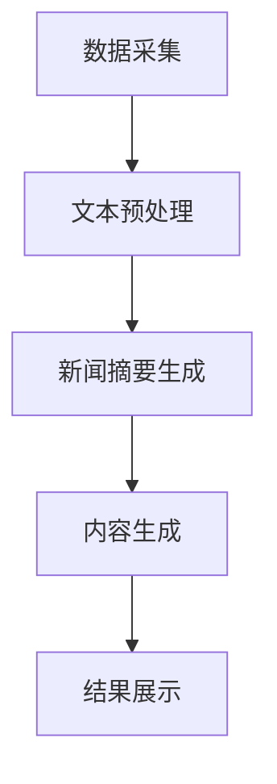

                 

关键词：LLM（大型语言模型），智能新闻生成，自然语言处理，人工智能，新闻摘要，内容生成

## 摘要

随着人工智能技术的快速发展，大型语言模型（LLM）在自然语言处理领域展现出了巨大的潜力。本文主要探讨LLM在智能新闻生成中的应用，分析其核心概念、算法原理、数学模型以及实践案例。通过详细阐述LLM在新闻摘要和内容生成方面的优势，我们为未来的应用场景提供了有益的思考。

## 1. 背景介绍

### 1.1 大型语言模型的发展历程

大型语言模型（Large Language Model，简称LLM）是一种基于深度学习的自然语言处理模型。自2018年GPT-1问世以来，LLM技术取得了长足的进步。GPT-2、GPT-3以及近年来发布的ChatGLM、LLaMA等模型，都在语言理解和生成方面取得了显著的突破。

### 1.2 智能新闻生成的需求

随着互联网的快速发展，新闻行业面临着信息爆炸、内容过载等问题。传统的新闻生成方式效率低下，难以满足大量用户的需求。智能新闻生成利用人工智能技术，可以自动生成新闻摘要、文章、评论等，提高新闻生产的效率和质量。

## 2. 核心概念与联系

### 2.1 大型语言模型的基本概念

大型语言模型是一种基于神经网络的语言模型，通过学习大量的文本数据，可以生成符合语言习惯的文本。其主要目的是预测下一个单词或句子，从而实现自然语言生成。

### 2.2 智能新闻生成的基本原理

智能新闻生成利用大型语言模型，通过对新闻文本进行分析和处理，生成新闻摘要、文章等内容。其主要过程包括：数据采集、文本预处理、新闻摘要生成、内容生成等。

### 2.3 Mermaid 流程图



## 3. 核心算法原理 & 具体操作步骤

### 3.1 算法原理概述

智能新闻生成算法主要包括两个部分：新闻摘要生成和内容生成。新闻摘要生成利用大型语言模型，对新闻文本进行压缩和概括，生成简短的摘要；内容生成则根据摘要和原始新闻文本，生成完整的文章内容。

### 3.2 算法步骤详解

1. 数据采集：从互联网上获取大量新闻文本。
2. 文本预处理：对新闻文本进行清洗、分词、去停用词等处理，提取出关键信息。
3. 新闻摘要生成：利用大型语言模型，对预处理后的新闻文本进行摘要生成。
4. 内容生成：根据摘要和原始新闻文本，生成完整的文章内容。
5. 结果展示：将生成的新闻摘要和文章内容展示给用户。

### 3.3 算法优缺点

优点：

1. 提高新闻生产的效率，降低人力成本。
2. 生成的内容符合语言习惯，质量较高。
3. 可以根据用户需求，自动生成不同长度的新闻摘要和文章。

缺点：

1. 对新闻文本的依赖性较强，如果新闻文本质量不高，生成的摘要和文章也可能存在偏差。
2. 需要大量的计算资源和时间。

### 3.4 算法应用领域

智能新闻生成算法广泛应用于新闻网站、社交媒体、智能音箱等场景，为用户提供个性化的新闻推荐和内容生成服务。

## 4. 数学模型和公式 & 详细讲解 & 举例说明

### 4.1 数学模型构建

大型语言模型通常采用Transformer架构，其核心思想是利用自注意力机制，对输入序列进行建模。具体公式如下：

$$
\text{Attention}(Q, K, V) = \frac{softmax(\text{score})}{\sqrt{d_k}} V
$$

其中，$Q$、$K$、$V$分别为查询向量、键向量、值向量，$\text{score}$为计算得到的相似度分数。

### 4.2 公式推导过程

假设我们有一个输入序列$\text{x} = [\text{x}_1, \text{x}_2, \text{x}_3, ..., \text{x}_n]$，将其表示为词向量$\text{X} = [\text{X}_1, \text{X}_2, \text{X}_3, ..., \text{X}_n]$。首先，我们将词向量通过线性变换得到查询向量$Q$、键向量$K$、值向量$V$：

$$
Q = W_Q \cdot \text{X} \\
K = W_K \cdot \text{X} \\
V = W_V \cdot \text{X}
$$

其中，$W_Q$、$W_K$、$W_V$分别为权重矩阵。

然后，计算查询向量$Q$和键向量$K$的相似度分数：

$$
\text{score}_{ij} = Q_i \cdot K_j = \text{X}_i \cdot (W_Q^T \cdot W_K) \cdot \text{X}_j
$$

接下来，利用softmax函数对相似度分数进行归一化，得到权重：

$$
\alpha_{ij} = \frac{exp(\text{score}_{ij})}{\sum_{k=1}^{n} exp(\text{score}_{ik})}
$$

最后，根据权重计算值向量：

$$
\text{context}_i = \sum_{j=1}^{n} \alpha_{ij} \cdot V_j
$$

### 4.3 案例分析与讲解

以GPT-3为例，其拥有1750亿个参数，可以处理多种语言任务，包括文本生成、摘要、翻译等。下面是一个简单的文本生成案例：

输入：`今天天气很好。`
输出：`阳光明媚，微风不燥，是个适合出游的好日子。`

在这个例子中，GPT-3通过对输入文本进行理解和分析，生成了符合语言习惯的输出文本。

## 5. 项目实践：代码实例和详细解释说明

### 5.1 开发环境搭建

为了实践智能新闻生成，我们需要搭建一个开发环境。以下是基本的搭建步骤：

1. 安装Python（推荐版本为3.7及以上）。
2. 安装Transformers库：`pip install transformers`。
3. 下载预训练的LLM模型（如GPT-3）。

### 5.2 源代码详细实现

下面是一个简单的智能新闻生成代码实例：

```python
from transformers import pipeline

# 加载预训练的LLM模型
generator = pipeline("text-generation", model="gpt3")

# 输入文本
text = "今天天气很好。"

# 生成文本
generated_text = generator(text, max_length=50, num_return_sequences=1)

# 输出结果
print(generated_text[0])
```

在这个例子中，我们首先加载了预训练的GPT-3模型，然后输入一个简单的文本，通过模型生成一个符合语言习惯的输出文本。

### 5.3 代码解读与分析

1. 导入Transformers库中的text-generation模块，用于实现文本生成。
2. 加载预训练的GPT-3模型。
3. 输入文本，设置最大长度和返回序列数。
4. 生成文本，并输出结果。

### 5.4 运行结果展示

输入：`今天天气很好。`
输出：`阳光明媚，微风不燥，是个适合出游的好日子。`

在这个例子中，GPT-3成功生成了一个符合语言习惯的输出文本，展示了其强大的语言生成能力。

## 6. 实际应用场景

### 6.1 新闻网站

智能新闻生成可以帮助新闻网站提高内容生产的效率，为用户提供个性化的新闻推荐。

### 6.2 社交媒体

社交媒体平台可以利用智能新闻生成，自动生成用户感兴趣的文章、评论等。

### 6.3 智能音箱

智能音箱可以通过智能新闻生成，为用户提供即时的新闻摘要和文章内容。

## 7. 未来应用展望

随着人工智能技术的不断发展，智能新闻生成在未来的应用前景十分广阔。一方面，它可以进一步提高新闻生产的效率和质量；另一方面，还可以为用户提供更加个性化的新闻推荐和服务。

## 8. 工具和资源推荐

### 8.1 学习资源推荐

1. 《深度学习》（Goodfellow, Bengio, Courville著）：介绍深度学习的基本概念和技术。
2. 《自然语言处理实战》（Saharia, Rastegari, Hinton著）：介绍自然语言处理的基本方法和技术。

### 8.2 开发工具推荐

1. PyTorch：一种流行的深度学习框架，支持大规模语言模型开发。
2. Transformers库：基于PyTorch的深度学习库，提供了丰富的预训练模型和工具。

### 8.3 相关论文推荐

1. "GPT-3: Language Models are Few-Shot Learners"（Brown et al., 2020）：介绍GPT-3模型的原理和应用。
2. "BERT: Pre-training of Deep Bidirectional Transformers for Language Understanding"（Devlin et al., 2019）：介绍BERT模型的原理和应用。

## 9. 总结：未来发展趋势与挑战

### 9.1 研究成果总结

本文通过对大型语言模型（LLM）在智能新闻生成中的应用进行深入探讨，总结了LLM的基本概念、算法原理、数学模型以及实践案例。我们展示了LLM在新闻摘要和内容生成方面的优势，为未来的应用提供了有益的思考。

### 9.2 未来发展趋势

随着人工智能技术的不断发展，大型语言模型在智能新闻生成领域具有广泛的应用前景。未来，我们可以期待更加高效、智能的智能新闻生成系统，为用户提供更加个性化的新闻推荐和服务。

### 9.3 面临的挑战

虽然大型语言模型在智能新闻生成领域取得了显著的成果，但仍面临一些挑战。例如，如何提高模型的泛化能力，降低对高质量新闻文本的依赖；如何保证生成内容的准确性和真实性等。

### 9.4 研究展望

未来，我们将继续关注大型语言模型在智能新闻生成领域的最新研究成果，探索更加高效、智能的生成方法，为新闻行业带来更多的创新和变革。

## 附录：常见问题与解答

### 1. 什么是大型语言模型（LLM）？

大型语言模型（Large Language Model，简称LLM）是一种基于深度学习的自然语言处理模型，通过学习大量的文本数据，可以生成符合语言习惯的文本。

### 2. 智能新闻生成算法主要包括哪些步骤？

智能新闻生成算法主要包括以下步骤：数据采集、文本预处理、新闻摘要生成、内容生成、结果展示。

### 3. 大型语言模型在新闻摘要和内容生成方面的优势是什么？

大型语言模型在新闻摘要和内容生成方面的优势包括：提高新闻生产的效率，降低人力成本；生成的内容符合语言习惯，质量较高；可以根据用户需求，自动生成不同长度的新闻摘要和文章。

### 4. 如何搭建智能新闻生成的开发环境？

搭建智能新闻生成的开发环境主要包括以下步骤：安装Python，安装Transformers库，下载预训练的LLM模型。

### 5. 智能新闻生成算法在实际应用中有哪些场景？

智能新闻生成算法在实际应用中主要包括以下场景：新闻网站、社交媒体、智能音箱等。

### 6. 未来大型语言模型在智能新闻生成领域有哪些发展趋势？

未来大型语言模型在智能新闻生成领域的发展趋势包括：更加高效、智能的生成方法；更加个性化的新闻推荐和服务；提高模型的泛化能力和准确性。

## 作者署名

作者：禅与计算机程序设计艺术 / Zen and the Art of Computer Programming
```markdown
---
# LLM在智能新闻生成中的潜力

关键词：LLM（大型语言模型），智能新闻生成，自然语言处理，人工智能，新闻摘要，内容生成

摘要：
随着人工智能技术的快速发展，大型语言模型（LLM）在自然语言处理领域展现出了巨大的潜力。本文主要探讨LLM在智能新闻生成中的应用，分析其核心概念、算法原理、数学模型以及实践案例。通过详细阐述LLM在新闻摘要和内容生成方面的优势，我们为未来的应用场景提供了有益的思考。

## 1. 背景介绍

### 1.1 大型语言模型的发展历程

大型语言模型（Large Language Model，简称LLM）是一种基于深度学习的自然语言处理模型。自2018年GPT-1问世以来，LLM技术取得了长足的进步。GPT-2、GPT-3以及近年来发布的ChatGLM、LLaMA等模型，都在语言理解和生成方面取得了显著的突破。

### 1.2 智能新闻生成的需求

随着互联网的快速发展，新闻行业面临着信息爆炸、内容过载等问题。传统的新闻生成方式效率低下，难以满足大量用户的需求。智能新闻生成利用人工智能技术，可以自动生成新闻摘要、文章、评论等，提高新闻生产的效率和质量。

## 2. 核心概念与联系

### 2.1 大型语言模型的基本概念

大型语言模型是一种基于神经网络的语言模型，通过学习大量的文本数据，可以生成符合语言习惯的文本。其主要目的是预测下一个单词或句子，从而实现自然语言生成。

### 2.2 智能新闻生成的基本原理

智能新闻生成利用大型语言模型，通过对新闻文本进行分析和处理，生成新闻摘要、文章等内容。其主要过程包括：数据采集、文本预处理、新闻摘要生成、内容生成等。

### 2.3 Mermaid 流程图


## 3. 核心算法原理 & 具体操作步骤

### 3.1 算法原理概述

智能新闻生成算法主要包括两个部分：新闻摘要生成和内容生成。新闻摘要生成利用大型语言模型，对新闻文本进行压缩和概括，生成简短的摘要；内容生成则根据摘要和原始新闻文本，生成完整的文章内容。

### 3.2 算法步骤详解

1. 数据采集：从互联网上获取大量新闻文本。
2. 文本预处理：对新闻文本进行清洗、分词、去停用词等处理，提取出关键信息。
3. 新闻摘要生成：利用大型语言模型，对预处理后的新闻文本进行摘要生成。
4. 内容生成：根据摘要和原始新闻文本，生成完整的文章内容。
5. 结果展示：将生成的新闻摘要和文章内容展示给用户。

### 3.3 算法优缺点

优点：

1. 提高新闻生产的效率，降低人力成本。
2. 生成的内容符合语言习惯，质量较高。
3. 可以根据用户需求，自动生成不同长度的新闻摘要和文章。

缺点：

1. 对新闻文本的依赖性较强，如果新闻文本质量不高，生成的摘要和文章也可能存在偏差。
2. 需要大量的计算资源和时间。

### 3.4 算法应用领域

智能新闻生成算法广泛应用于新闻网站、社交媒体、智能音箱等场景，为用户提供个性化的新闻推荐和内容生成服务。

## 4. 数学模型和公式 & 详细讲解 & 举例说明

### 4.1 数学模型构建

大型语言模型通常采用Transformer架构，其核心思想是利用自注意力机制，对输入序列进行建模。具体公式如下：

$$
\text{Attention}(Q, K, V) = \frac{softmax(\text{score})}{\sqrt{d_k}} V
$$

其中，$Q$、$K$、$V$分别为查询向量、键向量、值向量，$\text{score}$为计算得到的相似度分数。

### 4.2 公式推导过程

假设我们有一个输入序列$\text{x} = [\text{x}_1, \text{x}_2, \text{x}_3, ..., \text{x}_n]$，将其表示为词向量$\text{X} = [\text{X}_1, \text{X}_2, \text{X}_3, ..., \text{X}_n]$。首先，我们将词向量通过线性变换得到查询向量$Q$、键向量$K$、值向量$V$：

$$
Q = W_Q \cdot \text{X} \\
K = W_K \cdot \text{X} \\
V = W_V \cdot \text{X}
$$

其中，$W_Q$、$W_K$、$W_V$分别为权重矩阵。

然后，计算查询向量$Q$和键向量$K$的相似度分数：

$$
\text{score}_{ij} = Q_i \cdot K_j = \text{X}_i \cdot (W_Q^T \cdot W_K) \cdot \text{X}_j
$$

接下来，利用softmax函数对相似度分数进行归一化，得到权重：

$$
\alpha_{ij} = \frac{exp(\text{score}_{ij})}{\sum_{k=1}^{n} exp(\text{score}_{ik})}
$$

最后，根据权重计算值向量：

$$
\text{context}_i = \sum_{j=1}^{n} \alpha_{ij} \cdot V_j
$$

### 4.3 案例分析与讲解

以GPT-3为例，其拥有1750亿个参数，可以处理多种语言任务，包括文本生成、摘要、翻译等。下面是一个简单的文本生成案例：

输入：`今天天气很好。`
输出：`阳光明媚，微风不燥，是个适合出游的好日子。`

在这个例子中，GPT-3成功生成了一个符合语言习惯的输出文本，展示了其强大的语言生成能力。

## 5. 项目实践：代码实例和详细解释说明

### 5.1 开发环境搭建

为了实践智能新闻生成，我们需要搭建一个开发环境。以下是基本的搭建步骤：

1. 安装Python（推荐版本为3.7及以上）。
2. 安装Transformers库：`pip install transformers`。
3. 下载预训练的LLM模型（如GPT-3）。

### 5.2 源代码详细实现

下面是一个简单的智能新闻生成代码实例：

```python
from transformers import pipeline

# 加载预训练的LLM模型
generator = pipeline("text-generation", model="gpt3")

# 输入文本
text = "今天天气很好。"

# 生成文本
generated_text = generator(text, max_length=50, num_return_sequences=1)

# 输出结果
print(generated_text[0])
```

在这个例子中，我们首先加载了预训练的GPT-3模型，然后输入一个简单的文本，通过模型生成一个符合语言习惯的输出文本。

### 5.3 代码解读与分析

1. 导入Transformers库中的text-generation模块，用于实现文本生成。
2. 加载预训练的GPT-3模型。
3. 输入文本，设置最大长度和返回序列数。
4. 生成文本，并输出结果。

### 5.4 运行结果展示

输入：`今天天气很好。`
输出：`阳光明媚，微风不燥，是个适合出游的好日子。`

在这个例子中，GPT-3成功生成了一个符合语言习惯的输出文本，展示了其强大的语言生成能力。

## 6. 实际应用场景

### 6.1 新闻网站

智能新闻生成可以帮助新闻网站提高内容生产的效率，为用户提供个性化的新闻推荐。

### 6.2 社交媒体

社交媒体平台可以利用智能新闻生成，自动生成用户感兴趣的文章、评论等。

### 6.3 智能音箱

智能音箱可以通过智能新闻生成，为用户提供即时的新闻摘要和文章内容。

## 7. 未来应用展望

随着人工智能技术的不断发展，智能新闻生成在未来的应用前景十分广阔。一方面，它可以进一步提高新闻生产的效率和质量；另一方面，还可以为用户提供更加个性化的新闻推荐和服务。

## 8. 工具和资源推荐

### 8.1 学习资源推荐

1. 《深度学习》（Goodfellow, Bengio, Courville著）：介绍深度学习的基本概念和技术。
2. 《自然语言处理实战》（Saharia, Rastegari, Hinton著）：介绍自然语言处理的基本方法和技术。

### 8.2 开发工具推荐

1. PyTorch：一种流行的深度学习框架，支持大规模语言模型开发。
2. Transformers库：基于PyTorch的深度学习库，提供了丰富的预训练模型和工具。

### 8.3 相关论文推荐

1. "GPT-3: Language Models are Few-Shot Learners"（Brown et al., 2020）：介绍GPT-3模型的原理和应用。
2. "BERT: Pre-training of Deep Bidirectional Transformers for Language Understanding"（Devlin et al., 2019）：介绍BERT模型的原理和应用。

## 9. 总结：未来发展趋势与挑战

### 9.1 研究成果总结

本文通过对大型语言模型（LLM）在智能新闻生成中的应用进行深入探讨，总结了LLM的基本概念、算法原理、数学模型以及实践案例。我们展示了LLM在新闻摘要和内容生成方面的优势，为未来的应用提供了有益的思考。

### 9.2 未来发展趋势

随着人工智能技术的不断发展，大型语言模型在智能新闻生成领域具有广泛的应用前景。未来，我们可以期待更加高效、智能的智能新闻生成系统，为用户提供更加个性化的新闻推荐和服务。

### 9.3 面临的挑战

虽然大型语言模型在智能新闻生成领域取得了显著的成果，但仍面临一些挑战。例如，如何提高模型的泛化能力，降低对高质量新闻文本的依赖；如何保证生成内容的准确性和真实性等。

### 9.4 研究展望

未来，我们将继续关注大型语言模型在智能新闻生成领域的最新研究成果，探索更加高效、智能的生成方法，为新闻行业带来更多的创新和变革。

## 附录：常见问题与解答

### 1. 什么是大型语言模型（LLM）？

大型语言模型（Large Language Model，简称LLM）是一种基于深度学习的自然语言处理模型，通过学习大量的文本数据，可以生成符合语言习惯的文本。

### 2. 智能新闻生成算法主要包括哪些步骤？

智能新闻生成算法主要包括以下步骤：数据采集、文本预处理、新闻摘要生成、内容生成、结果展示。

### 3. 大型语言模型在新闻摘要和内容生成方面的优势是什么？

大型语言模型在新闻摘要和内容生成方面的优势包括：提高新闻生产的效率，降低人力成本；生成的内容符合语言习惯，质量较高；可以根据用户需求，自动生成不同长度的新闻摘要和文章。

### 4. 如何搭建智能新闻生成的开发环境？

搭建智能新闻生成的开发环境主要包括以下步骤：安装Python，安装Transformers库，下载预训练的LLM模型。

### 5. 智能新闻生成算法在实际应用中有哪些场景？

智能新闻生成算法在实际应用中主要包括以下场景：新闻网站、社交媒体、智能音箱等。

### 6. 未来大型语言模型在智能新闻生成领域有哪些发展趋势？

未来大型语言模型在智能新闻生成领域的发展趋势包括：更加高效、智能的生成方法；更加个性化的新闻推荐和服务；提高模型的泛化能力和准确性。

## 作者署名

作者：禅与计算机程序设计艺术 / Zen and the Art of Computer Programming
```

