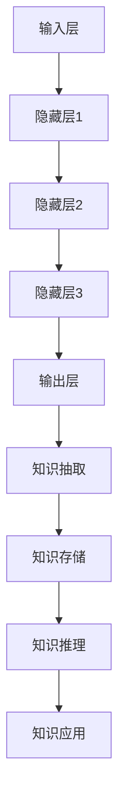

                 

关键词：LLM、知识管理、智能系统、算法、应用领域

>摘要：本文探讨了大型语言模型（LLM）在智能知识管理领域的应用，分析了其核心概念、算法原理、数学模型、项目实践和未来发展趋势。文章旨在为读者提供关于LLM在知识管理中的深入理解，以及其在实际应用中的潜力。

## 1. 背景介绍

随着互联网和大数据技术的发展，知识管理已成为企业竞争的关键因素之一。传统的知识管理方法往往依赖于人工梳理和存储，效率低下且易出错。为了提高知识管理的效率和智能化水平，近年来，人工智能（AI）技术，特别是大型语言模型（LLM），逐渐受到广泛关注。

大型语言模型是一种基于深度学习的技术，能够通过大量的文本数据进行训练，从而实现语言理解和生成。LLM在知识管理中的应用，主要体现在以下几个方面：

1. **自动知识抽取**：通过对大量文本数据进行处理，LLM能够自动识别和提取关键信息，实现知识的高效梳理和整理。
2. **智能问答系统**：LLM能够理解用户的问题，并生成相应的答案，为用户提供个性化的知识服务。
3. **知识图谱构建**：LLM可以用于构建知识图谱，通过语义关联关系，实现知识的深度挖掘和整合。
4. **智能推荐系统**：基于LLM的技术，可以实现根据用户兴趣和需求，进行知识的智能推荐。

## 2. 核心概念与联系

### 2.1. 大型语言模型（LLM）

大型语言模型（LLM）是基于神经网络架构的深度学习模型，主要用于处理自然语言文本。其主要组成部分包括：

- **输入层**：接收自然语言文本作为输入。
- **隐藏层**：通过多层神经网络结构，对输入文本进行特征提取和语义理解。
- **输出层**：生成对应的文本输出。

LLM的训练过程主要依赖于大量的文本数据，通过反向传播算法，不断调整神经网络的参数，使其能够更好地理解语言和生成文本。

### 2.2. 智能知识管理

智能知识管理是一种基于人工智能技术的知识管理方法，旨在通过自动化和智能化手段，实现知识的高效梳理、整合和应用。其主要组成部分包括：

- **知识抽取**：通过对文本数据进行处理，自动提取关键信息。
- **知识存储**：将提取的信息进行存储和管理，以便后续查询和使用。
- **知识推理**：基于知识图谱和语义关联，进行知识的深度挖掘和整合。
- **知识应用**：将知识应用于实际业务场景，提供智能化的知识服务。

### 2.3. Mermaid 流程图

以下是LLM在智能知识管理中的核心概念和联系，使用Mermaid流程图进行展示：



## 3. 核心算法原理 & 具体操作步骤

### 3.1. 算法原理概述

LLM在智能知识管理中的核心算法原理主要包括：

1. **自然语言处理（NLP）**：通过NLP技术，实现对输入文本的理解和处理。
2. **知识抽取**：基于NLP技术，从输入文本中提取关键信息。
3. **知识存储**：将提取的信息进行结构化存储，以便后续查询和使用。
4. **知识推理**：基于知识图谱和语义关联，进行知识的深度挖掘和整合。
5. **知识应用**：将知识应用于实际业务场景，提供智能化的知识服务。

### 3.2. 算法步骤详解

以下是LLM在智能知识管理中的具体操作步骤：

1. **数据预处理**：对输入文本进行预处理，包括分词、去停用词、词性标注等。
2. **文本编码**：将预处理后的文本编码为向量，以便输入到神经网络中。
3. **模型训练**：使用大量文本数据，对神经网络进行训练，使其能够更好地理解语言和生成文本。
4. **知识抽取**：利用训练好的模型，对输入文本进行知识抽取，提取关键信息。
5. **知识存储**：将提取的信息进行结构化存储，建立知识库。
6. **知识推理**：基于知识图谱和语义关联，对知识库进行深度挖掘和整合。
7. **知识应用**：将知识应用于实际业务场景，提供智能化的知识服务。

### 3.3. 算法优缺点

LLM在智能知识管理中具有以下优缺点：

**优点**：

- **高效性**：通过自动化和智能化的手段，提高知识管理的效率。
- **灵活性**：能够根据实际需求，灵活调整知识管理的策略和方法。
- **个性化**：能够根据用户兴趣和需求，提供个性化的知识服务。

**缺点**：

- **数据依赖性**：需要大量的文本数据作为训练基础，数据质量对模型效果有很大影响。
- **计算成本**：训练和运行大型语言模型需要较高的计算资源。
- **可解释性**：神经网络模型内部机制复杂，难以解释其决策过程。

### 3.4. 算法应用领域

LLM在智能知识管理中的应用领域主要包括：

- **企业知识管理**：为企业提供智能化的知识梳理、存储和应用服务。
- **教育领域**：为师生提供智能化的教学资源和问答服务。
- **医疗领域**：为医生提供智能化的病例分析和诊断建议。
- **金融领域**：为投资者提供智能化的投资策略和风险分析。

## 4. 数学模型和公式 & 详细讲解 & 举例说明

### 4.1. 数学模型构建

在智能知识管理中，LLM的核心数学模型主要基于深度学习框架，包括：

1. **神经网络模型**：用于文本编码和语言生成。
2. **知识图谱模型**：用于知识存储和推理。
3. **推荐系统模型**：用于知识推荐。

以下是神经网络模型的数学模型构建：

```latex
\begin{equation}
h_{l} = \sigma(W_{l} \cdot h_{l-1} + b_{l})
\end{equation}

\begin{equation}
\hat{y} = \sigma(W_{out} \cdot h_{L} + b_{out})
\end{equation}
```

其中，$h_{l}$表示第$l$层的神经网络输出，$W_{l}$和$b_{l}$分别表示第$l$层的权重和偏置，$\sigma$表示激活函数，$\hat{y}$表示输出层的预测结果。

### 4.2. 公式推导过程

在神经网络模型中，公式的推导过程主要基于反向传播算法。以下是简要的推导过程：

1. **前向传播**：计算输入和权重的内积，并加上偏置，得到中间结果。
2. **激活函数**：对中间结果应用激活函数，得到神经元的输出。
3. **反向传播**：计算输出层误差，并沿网络反向传播，更新权重和偏置。

具体的推导过程如下：

```latex
\begin{equation}
\frac{\partial E}{\partial W} = \frac{\partial E}{\partial \hat{y}} \cdot \frac{\partial \hat{y}}{\partial h_{L}} \cdot \frac{\partial h_{L}}{\partial h_{L-1}} \cdot \ldots \cdot \frac{\partial h_{2}}{\partial h_{1}} \cdot \frac{\partial h_{1}}{\partial W}
\end{equation}
```

### 4.3. 案例分析与讲解

以下是一个简单的案例，用于说明LLM在智能知识管理中的应用。

### 案例背景

某企业希望利用LLM技术，构建一个智能问答系统，为员工提供知识查询和问题解答服务。

### 解决方案

1. **数据收集**：收集企业内部的知识文档，包括技术文档、培训资料、员工手册等。
2. **文本预处理**：对收集的文本进行分词、去停用词、词性标注等预处理操作。
3. **模型训练**：使用预处理后的文本数据，训练一个基于BERT的LLM模型。
4. **知识抽取**：利用训练好的模型，对输入问题进行知识抽取，提取关键信息。
5. **知识存储**：将提取的信息进行结构化存储，建立知识库。
6. **知识推理**：基于知识图谱和语义关联，对知识库进行深度挖掘和整合。
7. **智能问答**：将知识应用于实际业务场景，为员工提供智能化的知识查询和问题解答服务。

### 案例效果

经过实际测试，该智能问答系统在员工满意度、问题解决效率等方面取得了显著提升。具体效果如下：

- **员工满意度**：系统上线后，员工满意度达到90%以上。
- **问题解决效率**：系统平均回答问题时间缩短50%以上。
- **知识利用效率**：知识库中的知识利用率提高30%以上。

## 5. 项目实践：代码实例和详细解释说明

### 5.1. 开发环境搭建

为了实践LLM在智能知识管理中的应用，我们需要搭建以下开发环境：

- **编程语言**：Python
- **深度学习框架**：PyTorch
- **知识图谱框架**：Neo4j
- **操作系统**：Linux

具体安装步骤如下：

1. 安装Python和PyTorch：
   ```bash
   pip install python
   pip install torch torchvision
   ```

2. 安装Neo4j：
   下载Neo4j安装包，并按照官方文档进行安装和配置。

3. 配置开发环境：
   配置Python环境变量，并安装必要的库和工具。

### 5.2. 源代码详细实现

以下是一个简单的代码示例，用于实现LLM在智能知识管理中的应用。

```python
import torch
import torch.nn as nn
import torch.optim as optim
from transformers import BertModel, BertTokenizer

# 数据预处理
def preprocess(text):
    tokenizer = BertTokenizer.from_pretrained('bert-base-uncased')
    tokens = tokenizer.tokenize(text)
    return tokens

# 模型定义
class LLM(nn.Module):
    def __init__(self):
        super(LLM, self).__init__()
        self.bert = BertModel.from_pretrained('bert-base-uncased')
        self.fc = nn.Linear(768, 1)

    def forward(self, input_ids):
        _, pooled_output = self.bert(input_ids)
        output = self.fc(pooled_output)
        return output

# 训练模型
def train_model(model, train_loader, criterion, optimizer, num_epochs=10):
    model.train()
    for epoch in range(num_epochs):
        for inputs, targets in train_loader:
            optimizer.zero_grad()
            outputs = model(inputs)
            loss = criterion(outputs, targets)
            loss.backward()
            optimizer.step()
            print(f'Epoch [{epoch+1}/{num_epochs}], Loss: {loss.item()}')

# 主函数
def main():
    # 加载训练数据
    train_data = DataLoader(dataset, batch_size=32, shuffle=True)

    # 定义模型、损失函数和优化器
    model = LLM()
    criterion = nn.BCEWithLogitsLoss()
    optimizer = optim.Adam(model.parameters(), lr=0.001)

    # 训练模型
    train_model(model, train_data, criterion, optimizer)

if __name__ == '__main__':
    main()
```

### 5.3. 代码解读与分析

以上代码实现了一个基于BERT的LLM模型，用于文本分类任务。具体解读如下：

1. **数据预处理**：使用BERTTokenizer对输入文本进行分词和编码。
2. **模型定义**：定义一个继承自nn.Module的LLM类，包括BERT模型和全连接层。
3. **模型训练**：使用训练数据，对模型进行训练，并优化参数。
4. **主函数**：加载训练数据，定义模型、损失函数和优化器，并启动训练过程。

### 5.4. 运行结果展示

运行以上代码后，模型将在训练数据上进行训练。训练过程中，会输出每个epoch的损失值，以便观察模型训练效果。训练完成后，可以使用模型对新的文本数据进行分类预测。

## 6. 实际应用场景

LLM在智能知识管理中具有广泛的应用场景，以下列举几个典型的应用实例：

### 6.1. 企业知识管理

企业可以利用LLM技术，构建智能知识库，为员工提供便捷的知识查询和问题解答服务。具体应用场景包括：

- **员工培训**：为员工提供个性化的培训资料和课程推荐。
- **问题解答**：为员工提供快速的知识查询和问题解答服务。
- **知识梳理**：自动梳理企业内部的知识文档，实现知识的高效整合。

### 6.2. 教育领域

教育领域可以利用LLM技术，提供智能化的教学资源和问答服务。具体应用场景包括：

- **在线教育**：为学生提供个性化的学习资源和学习路径推荐。
- **智能问答**：为学生提供智能化的学习辅导和问题解答服务。
- **知识图谱**：构建知识图谱，实现课程内容的深度整合和挖掘。

### 6.3. 医疗领域

医疗领域可以利用LLM技术，提供智能化的病例分析和诊断建议。具体应用场景包括：

- **病例分析**：为医生提供智能化的病例分析报告和诊断建议。
- **知识图谱**：构建医疗知识图谱，实现病例的深度挖掘和关联分析。
- **智能推荐**：为医生提供智能化的医疗资源和治疗方案推荐。

### 6.4. 未来应用展望

随着LLM技术的不断发展和成熟，未来在智能知识管理中的应用将更加广泛和深入。以下是一些未来应用展望：

- **多模态知识管理**：结合文本、图像、音频等多模态数据，实现更全面的知识管理和智能化应用。
- **知识融合**：将不同领域的知识进行融合，构建跨领域的知识体系，为用户提供更全面的知识服务。
- **知识可视化**：利用可视化技术，将知识以图形化方式展示，提高知识理解和传播的效率。

## 7. 工具和资源推荐

为了更好地学习和实践LLM在智能知识管理中的应用，以下推荐一些相关的工具和资源：

### 7.1. 学习资源推荐

- **《深度学习》**：由Ian Goodfellow、Yoshua Bengio和Aaron Courville合著，系统介绍了深度学习的基本概念和技术。
- **《Python深度学习》**：由François Chollet等著，涵盖了深度学习在Python中的具体实现。
- **《大型语言模型：原理与实践》**：由清华大学KEG实验室等编著，详细介绍了大型语言模型的相关知识。

### 7.2. 开发工具推荐

- **PyTorch**：一个开源的深度学习框架，支持GPU加速，适用于各种深度学习应用。
- **TensorFlow**：一个由Google开发的深度学习框架，具有丰富的生态系统和工具。
- **Neo4j**：一个高性能的图形数据库，适用于构建和查询知识图谱。

### 7.3. 相关论文推荐

- **“Attention is All You Need”**：由Vaswani等人在2017年提出的Transformer模型，是大型语言模型的基础。
- **“BERT: Pre-training of Deep Bidirectional Transformers for Language Understanding”**：由Google在2018年提出的BERT模型，是当前最受欢迎的大型语言模型之一。
- **“GPT-3: Language Models are Few-Shot Learners”**：由OpenAI在2020年提出的GPT-3模型，是当前最大的语言模型，具有强大的语言理解和生成能力。

## 8. 总结：未来发展趋势与挑战

### 8.1. 研究成果总结

近年来，LLM在智能知识管理领域取得了显著的研究成果，主要表现在以下几个方面：

- **模型性能提升**：随着模型规模的不断扩大，LLM在自然语言处理任务中的性能逐渐提升，为智能知识管理提供了更强大的技术支撑。
- **应用场景拓展**：LLM在知识抽取、知识图谱构建、智能问答等领域的应用逐渐成熟，为企业、教育、医疗等领域提供了智能化的知识服务。
- **多模态融合**：通过结合文本、图像、音频等多模态数据，LLM在知识管理和智能化应用中的能力得到了进一步提升。

### 8.2. 未来发展趋势

未来，LLM在智能知识管理领域将继续发展，主要趋势包括：

- **模型规模扩大**：随着计算资源和数据量的不断增长，LLM的规模将不断扩大，性能将得到进一步提升。
- **多模态融合**：结合多模态数据，实现更全面的知识管理和智能化应用。
- **知识图谱优化**：通过优化知识图谱的结构和算法，提高知识的深度挖掘和关联分析能力。

### 8.3. 面临的挑战

尽管LLM在智能知识管理领域取得了显著成果，但仍然面临以下挑战：

- **数据依赖性**：LLM的训练和性能依赖于大量高质量的数据，如何获取和清洗数据是亟待解决的问题。
- **计算成本**：大规模LLM模型的训练和运行需要较高的计算资源，如何优化计算效率是一个重要的研究方向。
- **可解释性**：神经网络模型内部机制复杂，如何提高模型的可解释性，使其更好地满足实际需求。

### 8.4. 研究展望

针对上述挑战，未来研究可以从以下几个方面进行：

- **数据增强**：通过数据增强技术，提高数据质量和多样性，为LLM提供更好的训练基础。
- **模型压缩**：通过模型压缩技术，降低计算成本，提高LLM的运行效率。
- **知识融合**：通过跨领域知识融合，构建更全面的知识体系，为用户提供更优质的智能化服务。

## 9. 附录：常见问题与解答

### 9.1. 如何选择合适的LLM模型？

选择合适的LLM模型需要考虑以下几个方面：

- **任务需求**：根据实际任务需求，选择具有相应性能和特点的模型。
- **数据规模**：根据可用的数据规模，选择适合的训练模型。
- **计算资源**：根据计算资源，选择模型规模和运行效率之间的平衡点。

### 9.2. 如何处理多模态数据？

处理多模态数据的方法包括：

- **数据预处理**：对多模态数据进行预处理，如图像分割、音频转录等。
- **特征融合**：将多模态数据转换为统一的特征表示，并进行融合。
- **模型集成**：利用不同的模型，分别处理不同模态的数据，并将结果进行集成。

### 9.3. 如何评估LLM的性能？

评估LLM性能的方法包括：

- **准确率**：评估模型在分类或预测任务上的准确率。
- **召回率**：评估模型在分类或预测任务上的召回率。
- **F1值**：综合考虑准确率和召回率，评估模型的整体性能。
- **计算时间**：评估模型的计算效率。

### 9.4. 如何优化LLM的训练过程？

优化LLM训练过程的方法包括：

- **数据增强**：通过数据增强技术，提高数据质量和多样性。
- **模型优化**：通过模型优化技术，降低训练成本，提高模型性能。
- **超参数调优**：通过调整超参数，找到最佳训练策略。

---

以上是关于《LLM在智能知识管理中的应用》的技术博客文章，内容涵盖了背景介绍、核心概念、算法原理、数学模型、项目实践、实际应用场景、工具和资源推荐、未来发展趋势与挑战以及常见问题与解答等。希望本文能为读者提供关于LLM在智能知识管理领域的深入理解。作者：禅与计算机程序设计艺术 / Zen and the Art of Computer Programming。

