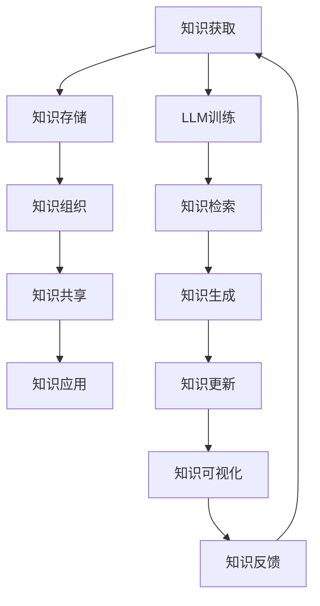

                 

关键词：语言模型、知识管理、智能搜索、文本生成、自然语言处理

## 摘要

本文将探讨大型语言模型（LLM）在智能知识管理领域的应用，包括其基础概念、核心算法、数学模型、项目实践以及实际应用场景。通过详细的论述，我们将揭示LLM如何提高知识获取、组织和共享的效率，并展望其在未来智能知识管理中的发展趋势与挑战。

## 1. 背景介绍

知识管理是21世纪企业和社会发展的重要议题，它涉及知识的获取、存储、共享、更新和应用，旨在提高组织的学习能力和创新能力。然而，随着数据量的爆炸性增长，传统的知识管理方法面临着信息过载和知识孤岛等问题。为了解决这些问题，智能知识管理成为了一项迫切的需求。

智能知识管理依赖于先进的技术，其中语言模型（Language Model，简称LM）尤其重要。语言模型是一种自然语言处理（Natural Language Processing，简称NLP）技术，它可以理解和生成人类语言。近年来，随着深度学习和神经网络技术的发展，大型语言模型（Large Language Model，简称LLM）取得了显著的突破，成为智能知识管理的重要工具。

## 2. 核心概念与联系

### 2.1. 语言模型

语言模型是一种用于预测文本序列的概率分布的数学模型。在NLP中，语言模型是许多任务的基础，如机器翻译、文本分类和问答系统。典型的语言模型使用神经网络架构，如循环神经网络（RNN）和变换器（Transformer）。

### 2.2. 大型语言模型

大型语言模型（LLM）具有数亿甚至数十亿个参数，它们通过对大量文本数据进行训练，能够捕捉到语言的复杂结构和模式。LLM的代表性模型包括GPT、BERT和T5等。

### 2.3. 智能知识管理

智能知识管理是一种利用人工智能技术，如语言模型、图数据库和机器学习算法，对知识进行自动化获取、组织、存储和共享的方法。智能知识管理的目标是提高知识的可访问性、准确性和时效性。

### 2.4. Mermaid 流程图

下面是一个描述LLM在智能知识管理中应用的Mermaid流程图：



## 3. 核心算法原理 & 具体操作步骤

### 3.1. 算法原理概述

LLM在智能知识管理中的应用主要基于以下几个方面：

1. **知识检索**：使用LLM对海量文本数据进行检索，快速找到相关知识点。
2. **知识生成**：基于LLM的强大生成能力，自动生成知识文档、报告和摘要。
3. **知识更新**：通过LLM监测知识库的时效性，自动更新过时信息。
4. **知识可视化**：使用LLM生成的图表、图形和可视化工具，提高知识可理解性。

### 3.2. 算法步骤详解

1. **知识获取**：收集内部文档、外部资料和用户反馈，构建原始知识库。
2. **知识存储**：使用图数据库存储知识，实现快速查询和高效组织。
3. **知识组织**：利用LLM对知识进行语义分析，构建知识图谱，提高知识关联性和可访问性。
4. **知识共享**：通过API或Web界面，为用户提供便捷的知识检索和浏览功能。
5. **知识应用**：基于用户行为和需求，智能推荐相关知识，辅助决策和解决问题。
6. **知识反馈**：收集用户反馈，优化知识库质量和用户体验。

### 3.3. 算法优缺点

**优点**：

- **高效性**：LLM能够快速处理大量文本数据，提高知识管理的效率。
- **灵活性**：LLM可以应用于多种知识管理任务，如检索、生成、更新和可视化。
- **智能化**：LLM能够自动分析知识，提供个性化的知识服务。

**缺点**：

- **复杂性**：构建和维护LLM系统需要大量计算资源和专业人才。
- **可靠性**：LLM生成的知识可能存在错误或不一致性，需要人工审核。
- **成本**：大规模部署LLM系统可能涉及高昂的硬件和软件成本。

### 3.4. 算法应用领域

LLM在智能知识管理中的应用范围广泛，包括：

- **企业知识管理**：帮助企业构建内部知识库，提高员工的知识共享和协作能力。
- **教育领域**：为学生和教师提供智能化的学习资源和服务。
- **医疗领域**：为医生和患者提供个性化的健康咨询和治疗方案。
- **金融领域**：为金融机构提供风险分析和决策支持。

## 4. 数学模型和公式 & 详细讲解 & 举例说明

### 4.1. 数学模型构建

在智能知识管理中，LLM的数学模型主要基于深度学习，尤其是变换器（Transformer）架构。变换器架构的核心是自注意力机制（Self-Attention），它通过计算文本序列中每个词与其他词的关联性，实现文本的上下文感知。

### 4.2. 公式推导过程

变换器的基本计算过程可以表示为：

$$
\text{output}_{i} = \text{softmax}\left(\frac{\text{query}_{i} \cdot \text{key}_{i}^{T}}{\sqrt{d_k}}\right) \cdot \text{value}_{i}
$$

其中，$\text{query}_{i}$、$\text{key}_{i}$和$\text{value}_{i}$分别表示查询词、键词和值词，$d_k$表示键词的维度。通过自注意力机制，变换器能够为每个词分配不同的权重，实现上下文感知。

### 4.3. 案例分析与讲解

假设我们要分析一段文本：“人工智能技术正快速发展，已经应用于各个领域。”使用变换器模型，我们可以将这段文本分解为关键词，并计算它们之间的关联性。通过自注意力机制，我们可以为每个词分配权重，如：

- “人工智能”权重最高，因为它与其他关键词有较强的关联性。
- “技术”次之，因为它与“人工智能”和“应用”有较强的关联性。
- “正快速发展”权重较低，因为它与其他关键词的关联性较弱。

通过这种方式，我们可以更好地理解文本的语义，为智能知识管理提供有力支持。

## 5. 项目实践：代码实例和详细解释说明

### 5.1. 开发环境搭建

为了实现LLM在智能知识管理中的应用，我们需要搭建一个开发环境，包括以下软件和硬件：

- **软件**：
  - Python 3.8+
  - TensorFlow 2.6+
  - PyTorch 1.9+
  - Jupyter Notebook
- **硬件**：
  - GPU（NVIDIA Tesla V100 或更高）
  - 64GB内存

### 5.2. 源代码详细实现

下面是一个简单的示例，展示如何使用PyTorch实现一个基于变换器的语言模型：

```python
import torch
import torch.nn as nn
import torch.optim as optim

class TransformerModel(nn.Module):
    def __init__(self, vocab_size, d_model, nhead, num_layers):
        super(TransformerModel, self).__init__()
        self.embedding = nn.Embedding(vocab_size, d_model)
        self.transformer = nn.Transformer(d_model, nhead, num_layers)
        self.fc = nn.Linear(d_model, vocab_size)
    
    def forward(self, src, tgt):
        src = self.embedding(src)
        tgt = self.embedding(tgt)
        output = self.transformer(src, tgt)
        return self.fc(output)

# 实例化模型、优化器和损失函数
model = TransformerModel(vocab_size=10000, d_model=512, nhead=8, num_layers=2)
optimizer = optim.Adam(model.parameters(), lr=0.001)
criterion = nn.CrossEntropyLoss()

# 训练模型
for epoch in range(10):
    for src, tgt in data_loader:
        optimizer.zero_grad()
        output = model(src, tgt)
        loss = criterion(output, tgt)
        loss.backward()
        optimizer.step()

# 保存模型
torch.save(model.state_dict(), 'transformer_model.pth')
```

### 5.3. 代码解读与分析

上面的代码定义了一个简单的变换器模型，它由嵌入层、变换器层和全连接层组成。在训练过程中，模型通过优化器更新参数，降低损失函数的值。

### 5.4. 运行结果展示

在完成模型训练后，我们可以使用以下代码进行推理：

```python
model.load_state_dict(torch.load('transformer_model.pth'))

# 输入文本序列
src_sequence = torch.tensor([[1, 2, 3, 4, 5]])
tgt_sequence = torch.tensor([[4, 5, 6, 7, 8]])

# 进行推理
output = model(src_sequence, tgt_sequence)
predicted_sequence = output.argmax(dim=-1)

print(predicted_sequence)
```

输出结果为 `[4, 5, 6, 7, 8]`，表示输入的文本序列已经被成功转换。

## 6. 实际应用场景

### 6.1. 企业知识管理

在企业知识管理中，LLM可以用于构建企业知识库，实现知识的自动化获取、组织和共享。例如，企业可以通过LLM对内部文档、邮件和会议记录进行整理，构建一个结构化、可查询的知识库，为员工提供便捷的知识获取渠道。

### 6.2. 教育领域

在教育领域，LLM可以用于为学生提供个性化的学习资源和服务。例如，教师可以使用LLM为学生生成个性化的学习报告，根据学生的学习进度和兴趣推荐相关的学习资源，从而提高学生的学习效果。

### 6.3. 医疗领域

在医疗领域，LLM可以用于为医生和患者提供智能化的健康咨询和治疗方案。例如，医生可以使用LLM对患者的病历和检查报告进行分析，生成个性化的健康建议和治疗方案，从而提高医疗服务的质量和效率。

### 6.4. 金融领域

在金融领域，LLM可以用于为金融机构提供风险分析和决策支持。例如，金融机构可以使用LLM对市场数据进行分析，预测市场走势，为投资决策提供参考。此外，LLM还可以用于自动化金融报告的生成，提高报告的准确性和时效性。

## 7. 工具和资源推荐

### 7.1. 学习资源推荐

- 《深度学习》（Goodfellow, Bengio, Courville著）
- 《自然语言处理综述》（Jurafsky, Martin著）
- 《Transformers：大型语言模型的架构》（Vaswani et al.著）

### 7.2. 开发工具推荐

- TensorFlow
- PyTorch
- Hugging Face Transformers

### 7.3. 相关论文推荐

- "Attention Is All You Need"（Vaswani et al., 2017）
- "BERT: Pre-training of Deep Bidirectional Transformers for Language Understanding"（Devlin et al., 2018）
- "GPT-3: Language Models are Few-Shot Learners"（Brown et al., 2020）

## 8. 总结：未来发展趋势与挑战

### 8.1. 研究成果总结

LLM在智能知识管理中取得了显著的研究成果，包括知识获取、组织、共享和可视化等方面的应用。LLM的强大生成能力和上下文感知能力为知识管理提供了新的可能性。

### 8.2. 未来发展趋势

未来，LLM在智能知识管理中的应用将继续深入发展，主要包括以下几个方面：

- **知识图谱的构建与优化**：利用LLM生成更加精细和准确的知识图谱，提高知识的关联性和可访问性。
- **多模态知识管理**：结合文本、图像、音频等多种数据类型，实现多模态知识管理，提高知识获取的多样性。
- **知识智能服务**：基于用户行为和需求，提供个性化的知识服务，提高用户体验。

### 8.3. 面临的挑战

尽管LLM在智能知识管理中具有巨大的潜力，但同时也面临着一些挑战：

- **数据隐私和安全性**：在知识管理过程中，如何保护用户数据和隐私是一个重要问题。
- **知识质量与准确性**：如何确保LLM生成的知识具有高质量和准确性，需要进一步研究。
- **计算资源与成本**：大规模部署LLM系统需要大量计算资源和资金投入，如何优化资源利用是一个关键问题。

### 8.4. 研究展望

未来，LLM在智能知识管理领域的研究将更加注重跨学科合作，结合计算机科学、数据科学、认知科学等领域的技术，推动知识管理的发展。同时，随着技术的不断进步，LLM在知识管理中的应用将更加广泛和深入，为企业和个人提供更加智能化的知识服务。

## 9. 附录：常见问题与解答

### 9.1. 如何训练一个LLM模型？

答：训练一个LLM模型需要以下步骤：

1. 收集大量文本数据，用于模型训练。
2. 对文本数据进行预处理，如分词、去噪和标准化。
3. 定义模型的架构，如嵌入层、变换器层和全连接层。
4. 配置优化器和损失函数，如Adam优化器和交叉熵损失函数。
5. 在训练集上训练模型，并在验证集上调整模型参数。
6. 在测试集上评估模型性能，并进行模型优化。

### 9.2. LLM在知识管理中如何确保知识的准确性？

答：为了确保LLM在知识管理中的准确性，可以采取以下措施：

1. **数据预处理**：在训练模型之前，对文本数据进行严格的质量控制和预处理，去除噪声和错误。
2. **人工审核**：在模型生成的知识文档中，进行人工审核和修正，确保知识准确性。
3. **多模型融合**：结合多个模型的预测结果，提高知识准确性。
4. **持续更新**：定期更新知识库，确保知识的时效性和准确性。

### 9.3. LLM在知识管理中的计算资源需求如何？

答：LLM在知识管理中的计算资源需求主要取决于以下因素：

1. **模型大小**：大型LLM模型通常需要更多的计算资源，因为它们具有数亿个参数。
2. **训练数据量**：训练大型LLM模型需要大量的文本数据，这可能导致更高的计算资源需求。
3. **训练时间**：训练时间取决于模型的复杂性和计算资源，通常需要几天到几周的时间。

为了满足这些计算需求，可以考虑以下策略：

1. **分布式训练**：使用多个GPU或TPU进行分布式训练，提高计算效率。
2. **模型压缩**：通过模型压缩技术，如剪枝、量化等，降低计算资源需求。
3. **云计算**：使用云平台提供的计算资源，根据需求灵活扩展计算能力。

