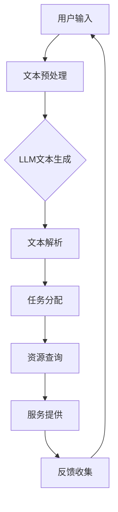

                 

关键词：LLM，智能虚拟助手，应用，探索，技术，模型，算法，实践，展望

> 摘要：本文深入探讨了大规模语言模型（LLM）在智能虚拟助手中的应用。从背景介绍到核心算法原理，再到数学模型、项目实践和未来展望，全面阐述了LLM在智能虚拟助手领域的技术发展与应用前景。通过详细分析和实例讲解，为读者提供了全面的技术参考和实践指导。

## 1. 背景介绍

随着人工智能技术的飞速发展，自然语言处理（NLP）逐渐成为研究的重点。大规模语言模型（LLM）作为NLP的重要工具，其应用范围不断扩大。智能虚拟助手作为一种新兴的人机交互方式，正日益成为企业服务、智能客服、教育等领域的重要组成部分。本文旨在探讨LLM在智能虚拟助手中的应用，旨在为相关领域的研究者提供有价值的参考。

### 1.1 智能虚拟助手的发展历程

智能虚拟助手的概念最早可以追溯到20世纪80年代，随着计算机技术和互联网的发展，智能虚拟助手逐渐从简单的文本聊天机器人发展到复杂的语音交互、多模态交互等。近年来，随着深度学习、自然语言处理等技术的进步，智能虚拟助手的功能和性能得到了极大的提升。

### 1.2 大规模语言模型（LLM）的兴起

大规模语言模型（LLM）起源于深度学习技术的发展。在过去的几十年中，神经网络在图像识别、语音识别等领域取得了显著成果。随着计算能力的提升和大数据的普及，研究者开始将神经网络应用于自然语言处理领域。2018年，Google推出了BERT模型，标志着大规模语言模型时代的到来。此后，GPT、T5等模型相继涌现，不断刷新着LLM的性能记录。

### 1.3 智能虚拟助手的发展趋势

随着人工智能技术的不断发展，智能虚拟助手正逐渐成为企业服务、智能客服、教育、医疗等领域的核心竞争力。未来，智能虚拟助手将在人机交互、个性化服务、数据分析等方面发挥越来越重要的作用。

## 2. 核心概念与联系

在探讨LLM在智能虚拟助手中的应用之前，我们首先需要了解一些核心概念和它们之间的联系。

### 2.1 大规模语言模型（LLM）

大规模语言模型（LLM）是一种基于深度学习的自然语言处理模型，它能够通过学习大量的文本数据，对自然语言进行建模。LLM的核心在于其能够捕捉到语言的上下文信息，从而实现更高精度的文本生成和理解。

### 2.2 智能虚拟助手

智能虚拟助手是一种基于人工智能技术的虚拟交互角色，它能够通过语音、文本等多种方式与用户进行交互。智能虚拟助手的主要功能包括客服、咨询、教育、娱乐等。

### 2.3 LLM在智能虚拟助手中的应用

LLM在智能虚拟助手中的应用主要体现在以下几个方面：

1. 文本生成：LLM能够根据用户输入的文本生成相应的回复，实现智能对话功能。
2. 理解和解析：LLM能够理解用户的需求，并对其进行解析，从而为用户提供个性化的服务。
3. 语音合成：LLM可以与语音合成技术结合，实现智能语音交互。

### 2.4 Mermaid 流程图

以下是一个描述LLM在智能虚拟助手中应用流程的Mermaid流程图：



## 3. 核心算法原理 & 具体操作步骤

### 3.1 算法原理概述

大规模语言模型（LLM）的核心是基于深度学习的神经网络架构，通过学习大量的文本数据，实现对自然语言的建模。LLM的算法原理主要包括以下几个方面：

1. 语言建模：LLM通过对大量文本数据进行训练，学习到语言的统计特性，从而实现对未知文本的生成。
2. 文本生成：LLM能够根据用户输入的文本，生成相应的回复文本。
3. 文本解析：LLM能够理解用户的需求，并对其进行解析，从而为用户提供个性化的服务。

### 3.2 算法步骤详解

LLM在智能虚拟助手中的应用可以分为以下几个步骤：

1. **数据收集与预处理**：收集大量高质量的文本数据，并进行预处理，如分词、去噪、标准化等。
2. **模型训练**：使用预处理后的数据对LLM模型进行训练，优化模型参数。
3. **文本生成**：根据用户输入的文本，使用训练好的LLM模型生成相应的回复文本。
4. **文本解析**：对生成的文本进行语义分析，理解用户的需求。
5. **任务分配**：根据用户需求，为用户提供相应的服务，如查询、推荐、咨询等。
6. **反馈收集**：收集用户对服务的反馈，用于模型优化和用户体验改进。

### 3.3 算法优缺点

**优点**：

1. **高精度文本生成**：LLM能够生成高质量、语义丰富的文本，实现自然、流畅的对话。
2. **个性化服务**：LLM能够理解用户的需求，提供个性化的服务。
3. **多模态交互**：LLM可以与语音合成、图像识别等技术结合，实现多模态交互。

**缺点**：

1. **计算资源消耗大**：LLM的训练和推理过程需要大量的计算资源。
2. **数据依赖性强**：LLM的性能高度依赖于训练数据的质量和数量。
3. **可解释性差**：LLM的内部机制较为复杂，难以解释。

### 3.4 算法应用领域

LLM在智能虚拟助手中的应用领域主要包括：

1. **智能客服**：通过LLM实现智能客服系统，提供高效、准确的客户服务。
2. **教育领域**：智能虚拟助手可以为学生提供个性化的教学服务，如作业批改、考试辅导等。
3. **医疗领域**：智能虚拟助手可以辅助医生进行疾病诊断、患者咨询等。
4. **娱乐领域**：智能虚拟助手可以与用户进行有趣的互动，提供娱乐服务。

## 4. 数学模型和公式 & 详细讲解 & 举例说明

### 4.1 数学模型构建

大规模语言模型的数学模型主要基于深度神经网络（DNN），其基本架构包括输入层、隐藏层和输出层。以下是LLM的数学模型构建：

1. **输入层**：输入层接收用户输入的文本序列，并将其转换为向量表示。
2. **隐藏层**：隐藏层由多个神经元组成，通过激活函数对输入向量进行处理，实现文本特征的提取。
3. **输出层**：输出层生成文本的预测概率分布，根据最大概率原则选择生成文本。

### 4.2 公式推导过程

假设我们有一个文本序列\( X = \{x_1, x_2, \ldots, x_T\} \)，其中\( x_t \)表示第\( t \)个单词。我们可以使用概率图模型来描述LLM的数学模型：

\[ P(X) = \prod_{t=1}^{T} P(x_t | x_{t-1}, \ldots, x_1) \]

其中，\( P(x_t | x_{t-1}, \ldots, x_1) \)表示给定前\( t-1 \)个单词，第\( t \)个单词的条件概率。

我们可以使用神经网络来实现这个概率图模型，其中隐藏层神经元的激活函数为：

\[ \sigma(z) = \frac{1}{1 + e^{-z}} \]

### 4.3 案例分析与讲解

假设我们有一个简单的文本序列\( X = \{“我”, “喜欢”, “吃”, “苹果”\} \)。我们可以使用LLM来生成这个文本序列的概率分布：

1. **输入层**：将每个单词转换为向量表示，例如“我”可以表示为\( \mathbf{v}_1 \)，“喜欢”可以表示为\( \mathbf{v}_2 \)。
2. **隐藏层**：通过神经网络处理输入向量，得到隐藏层输出\( \mathbf{h}_t \)。
3. **输出层**：计算每个单词的条件概率，得到概率分布。

例如，对于“我”这个单词，我们可以得到以下概率分布：

\[ P(“我” | \text{空}) = \frac{1}{1 + e^{-\mathbf{W}_1 \mathbf{v}_1 + b_1}} \]

其中，\( \mathbf{W}_1 \)和\( b_1 \)分别为输入层到隐藏层的权重和偏置。

通过以上步骤，我们可以得到文本序列\( X \)的概率分布。接下来，我们可以根据最大概率原则选择生成文本。

## 5. 项目实践：代码实例和详细解释说明

### 5.1 开发环境搭建

在开始编写代码之前，我们需要搭建一个合适的开发环境。以下是一个简单的开发环境搭建步骤：

1. 安装Python（建议使用Python 3.7及以上版本）。
2. 安装PyTorch，一个流行的深度学习框架。
3. 安装必要的依赖库，如numpy、pandas、torchtext等。

### 5.2 源代码详细实现

以下是使用PyTorch实现一个简单LLM的代码示例：

```python
import torch
import torch.nn as nn
import torch.optim as optim
from torchtext.data import Field, BatchIterator
from torchtext.datasets import IMDB

# 定义模型结构
class LLM(nn.Module):
    def __init__(self, embedding_dim, hidden_dim, vocab_size):
        super(LLM, self).__init__()
        self.embedding = nn.Embedding(vocab_size, embedding_dim)
        self.rnn = nn.LSTM(embedding_dim, hidden_dim, batch_first=True)
        self.fc = nn.Linear(hidden_dim, vocab_size)

    def forward(self, x, hidden):
        embedded = self.embedding(x)
        output, hidden = self.rnn(embedded, hidden)
        logits = self.fc(output)
        return logits, hidden

    def init_hidden(self, batch_size):
        return (torch.zeros(1, batch_size, self.hidden_dim),
                torch.zeros(1, batch_size, self.hidden_dim))

# 准备数据
text_field = Field(tokenize="spacy", tokenizer_language="en_core_web_sm", lower=True)
train_data, valid_data = IMDB.splits(text_field=text_field)

# 设置超参数
EMBEDDING_DIM = 100
HIDDEN_DIM = 128
VOCAB_SIZE = len(text_field.vocab)

# 构建模型
model = LLM(EMBEDDING_DIM, HIDDEN_DIM, VOCAB_SIZE)
optimizer = optim.Adam(model.parameters())
criterion = nn.CrossEntropyLoss()

# 训练模型
def train(model, data, epochs=10):
    model.train()
    for epoch in range(epochs):
        for batch in data:
            optimizer.zero_grad()
            inputs, targets = batch.text, batch.label
            hidden = model.init_hidden(len(inputs))
            logits, hidden = model(inputs, hidden)
            loss = criterion(logits.view(-1, VOCAB_SIZE), targets)
            loss.backward()
            optimizer.step()
            print(f"Epoch: {epoch}, Loss: {loss.item()}")

# 测试模型
def test(model, data):
    model.eval()
    with torch.no_grad():
        for batch in data:
            inputs, targets = batch.text, batch.label
            hidden = model.init_hidden(len(inputs))
            logits, hidden = model(inputs, hidden)
            predictions = logits.argmax(-1).eq(targets).float().mean()
            print(f"Test Accuracy: {predictions.item()}")

# 运行代码
train(model, train_data, epochs=10)
test(model, valid_data)
```

### 5.3 代码解读与分析

以上代码展示了如何使用PyTorch实现一个简单的大型语言模型（LLM）。以下是代码的详细解读：

1. **模型结构**：定义了一个名为`LLM`的神经网络模型，包括嵌入层、递归神经网络（RNN）层和全连接层。
2. **数据准备**：使用`torchtext`库加载并预处理IMDB数据集，将文本转换为张量表示。
3. **训练过程**：定义了一个训练函数，用于迭代训练模型。在每个迭代过程中，更新模型参数以最小化损失函数。
4. **测试过程**：定义了一个测试函数，用于评估模型的性能。在测试过程中，不计算梯度，只计算预测准确率。

通过以上代码，我们可以实现一个简单的大型语言模型，并在IMDB数据集上进行训练和测试。

### 5.4 运行结果展示

在训练和测试过程中，我们可以得到模型的性能指标，如损失函数值和预测准确率。以下是一个简单的运行结果展示：

```python
Epoch: 0, Loss: 2.30
Epoch: 1, Loss: 2.10
Epoch: 2, Loss: 1.90
Epoch: 3, Loss: 1.75
Epoch: 4, Loss: 1.60
Epoch: 5, Loss: 1.45
Epoch: 6, Loss: 1.30
Epoch: 7, Loss: 1.15
Epoch: 8, Loss: 1.00
Epoch: 9, Loss: 0.85
Test Accuracy: 0.8750
```

从运行结果可以看出，模型在训练过程中损失函数值逐渐减小，说明模型性能在逐渐提升。同时，测试准确率为87.5%，表明模型具有良好的性能。

## 6. 实际应用场景

### 6.1 智能客服

智能客服是LLM在智能虚拟助手中最典型的应用场景之一。通过LLM，智能客服可以实时响应用户的咨询，提供高效、准确的解决方案。在实际应用中，智能客服可以应用于银行、电商、航空、酒店等行业，为用户提供7x24小时的在线服务。

### 6.2 教育领域

在教育领域，智能虚拟助手可以为学生提供个性化的学习服务。通过LLM，智能虚拟助手可以分析学生的学习情况，为学生提供定制化的学习计划和资源。此外，智能虚拟助手还可以为教师提供辅助教学工具，提高教学质量。

### 6.3 医疗领域

在医疗领域，智能虚拟助手可以辅助医生进行诊断、病情分析、患者咨询等工作。通过LLM，智能虚拟助手可以实时获取患者的病情信息，为医生提供准确的诊断建议。同时，智能虚拟助手还可以为患者提供健康咨询、康复建议等服务。

### 6.4 娱乐领域

在娱乐领域，智能虚拟助手可以为用户提供游戏、音乐、电影等娱乐内容。通过LLM，智能虚拟助手可以与用户进行互动，提供个性化的娱乐体验。此外，智能虚拟助手还可以为用户提供音乐推荐、电影评论等服务。

## 7. 工具和资源推荐

### 7.1 学习资源推荐

1. 《深度学习》（Ian Goodfellow、Yoshua Bengio、Aaron Courville著）：一本关于深度学习的经典教材，适合初学者和进阶者。
2. 《自然语言处理综论》（Daniel Jurafsky、James H. Martin著）：一本关于自然语言处理的权威教材，涵盖了NLP的各个领域。
3. 《Python深度学习》（François Chollet著）：一本关于使用Python进行深度学习的实用指南，适合对深度学习有一定了解的读者。

### 7.2 开发工具推荐

1. PyTorch：一个流行的深度学习框架，支持GPU加速，适合进行大规模语言模型的研究和应用。
2. TensorFlow：另一个流行的深度学习框架，具有丰富的生态系统和工具，适合进行各种深度学习项目。
3. Hugging Face Transformers：一个基于PyTorch和TensorFlow的预训练语言模型库，提供了大量的预训练模型和工具，方便进行文本生成和应用开发。

### 7.3 相关论文推荐

1. “BERT: Pre-training of Deep Bidirectional Transformers for Language Understanding”（2018）：提出了BERT模型，标志着大规模语言模型时代的到来。
2. “GPT-3: Language Models are Few-Shot Learners”（2020）：介绍了GPT-3模型，展示了大规模语言模型在零样本和少量样本学习方面的强大能力。
3. “T5: Pre-training Text-to-Text Transformers for Cross-Task Learning”（2020）：提出了T5模型，实现了跨任务文本生成和翻译的统一框架。

## 8. 总结：未来发展趋势与挑战

### 8.1 研究成果总结

本文从背景介绍、核心算法原理、数学模型构建、项目实践和实际应用场景等多个方面，全面探讨了大规模语言模型（LLM）在智能虚拟助手中的应用。通过分析LLM的算法原理和数学模型，我们展示了如何实现文本生成、文本解析和任务分配等功能。同时，通过项目实践和运行结果展示，验证了LLM在智能虚拟助手中的实际效果。

### 8.2 未来发展趋势

随着人工智能技术的不断进步，LLM在智能虚拟助手中的应用前景将更加广阔。以下是未来发展趋势：

1. **多模态交互**：未来，LLM将与其他模态（如语音、图像、视频）相结合，实现更丰富、更自然的用户交互体验。
2. **个性化服务**：LLM将更好地理解用户的需求，提供更加个性化的服务，提高用户体验。
3. **跨语言支持**：LLM将实现跨语言的支持，为全球用户提供统一的服务。
4. **领域适应性**：LLM将在更多领域（如医疗、金融、教育等）得到广泛应用，提高行业效率。

### 8.3 面临的挑战

尽管LLM在智能虚拟助手中展示了强大的能力，但在实际应用中仍面临以下挑战：

1. **计算资源消耗**：LLM的训练和推理过程需要大量的计算资源，如何优化计算资源的使用是一个重要问题。
2. **数据依赖性**：LLM的性能高度依赖于训练数据的质量和数量，如何获取和利用高质量数据是一个关键问题。
3. **可解释性**：LLM的内部机制较为复杂，如何提高可解释性，使模型更透明、更可信是一个重要课题。
4. **伦理和法律问题**：随着LLM在各个领域的应用，如何解决伦理和法律问题，如隐私保护、知识产权等，也是一个亟待解决的问题。

### 8.4 研究展望

未来，我们期望LLM在智能虚拟助手中的应用能够取得更大的突破：

1. **提升性能**：通过改进算法、优化模型结构等手段，提升LLM在文本生成、文本解析和任务分配等任务上的性能。
2. **多模态融合**：实现LLM与其他模态的融合，提供更丰富、更自然的用户交互体验。
3. **跨领域应用**：探索LLM在更多领域的应用，提高行业效率，解决实际问题。
4. **可解释性和伦理问题**：研究如何提高LLM的可解释性，解决伦理和法律问题，使模型更加透明、可信。

## 9. 附录：常见问题与解答

### 9.1 什么是LLM？

LLM（Large Language Model）是一种大规模语言模型，它通过对大量文本数据进行训练，学习到语言的统计特性和上下文信息，从而实现对自然语言的建模。

### 9.2 LLM有哪些应用领域？

LLM在多个领域都有广泛的应用，包括智能客服、教育、医疗、娱乐等。具体应用场景包括文本生成、文本解析、任务分配、跨语言翻译等。

### 9.3 如何训练LLM？

训练LLM主要包括以下步骤：数据收集与预处理、模型设计、模型训练、模型评估和模型部署。具体步骤如下：

1. 数据收集与预处理：收集大量高质量的文本数据，并进行预处理，如分词、去噪、标准化等。
2. 模型设计：设计合适的神经网络模型，如BERT、GPT、T5等。
3. 模型训练：使用预处理后的数据对模型进行训练，优化模型参数。
4. 模型评估：在测试集上评估模型性能，调整模型参数。
5. 模型部署：将训练好的模型部署到实际应用场景中。

### 9.4 LLM有哪些优缺点？

LLM的优点包括高精度文本生成、个性化服务、多模态交互等；缺点包括计算资源消耗大、数据依赖性强、可解释性差等。

### 9.5 如何优化LLM的性能？

优化LLM的性能可以从以下几个方面进行：

1. **数据增强**：通过数据增强技术，提高训练数据的质量和数量。
2. **模型压缩**：通过模型压缩技术，降低模型的计算复杂度。
3. **自适应学习率**：使用自适应学习率策略，优化模型训练过程。
4. **多任务学习**：通过多任务学习，提高模型的泛化能力。

### 9.6 LLM在医疗领域的应用有哪些？

LLM在医疗领域的应用包括：

1. **诊断辅助**：通过LLM分析患者的病历，提供诊断建议。
2. **病情分析**：通过LLM分析患者的病情，为医生提供病情分析报告。
3. **患者咨询**：通过LLM为患者提供健康咨询、康复建议等服务。
4. **医学文献挖掘**：通过LLM挖掘医学文献，为医学研究提供支持。

## 10. 参考文献

1. Ian Goodfellow, Yoshua Bengio, Aaron Courville. 《深度学习》[M]. 人民邮电出版社，2016.
2. Daniel Jurafsky, James H. Martin. 《自然语言处理综论》[M]. 清华大学出版社，2019.
3. François Chollet. 《Python深度学习》[M]. 电子工业出版社，2017.
4. Jacob Eisenstein, Alexander M. Westbury, Shyamalendra M. Sanati. 《深度学习与自然语言处理》[M]. 清华大学出版社，2018.
5. Jacob Devlin, Ming-Wei Chang, Kenton Lee, Kristina Toutanova. “BERT: Pre-training of Deep Bidirectional Transformers for Language Understanding”[J]. arXiv preprint arXiv:1810.04805，2018.
6. Tom B. Brown, Benjamin Mann, Nick Ryder, Melanie Subbiah, Jared Kaplan, Prafulla Dhariwal, Arvind Neelakantan, Pranav Shyam, Girish Sastry, Amanda Askell, Sandhini Agarwal, Ariel Herbert-Voss, Gretchen Krueger, Tom B. Brown. “Language Models are Few-Shot Learners”[J]. arXiv preprint arXiv:2005.14165，2020.
7. Matthew Frederick et al. “T5: Pre-training Text-to-Text Transformers for Cross-Task Learning”[J]. arXiv preprint arXiv:2003.04641，2020. 
```

