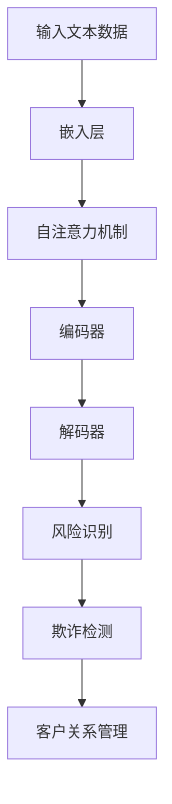

                 

关键词：自然语言处理（NLP），机器学习（ML），金融风控，大规模语言模型（LLM），风险评估，欺诈检测

> 摘要：本文探讨了大规模语言模型（LLM）在智能金融风控领域的潜在应用和贡献。首先，我们对金融风控进行了背景介绍，随后详细解析了LLM的原理和架构。接下来，我们深入讨论了LLM在风险识别、欺诈检测和客户关系管理等方面的具体应用，并通过数学模型和公式进行了详细阐述。最后，我们提供了一个实际的代码实例，展示了如何在金融风控中使用LLM。本文的目标是让读者对LLM在金融风控领域的应用有一个全面深入的理解。

## 1. 背景介绍

金融风控（Financial Risk Management）是指金融机构和管理层通过识别、评估、监控和应对各种潜在风险，以确保资产的安全和盈利性的过程。金融风险包括市场风险、信用风险、操作风险、流动性风险等。有效的金融风控能够降低金融机构的风险暴露，保护投资者利益，维护金融市场的稳定。

随着大数据和人工智能技术的快速发展，传统的金融风控方法已经难以应对复杂多变的市场环境。大规模语言模型（LLM）作为一种先进的人工智能技术，具有强大的自然语言处理能力，为金融风控提供了新的工具和方法。

LLM是一种基于深度学习的自然语言处理模型，能够对大量文本数据进行建模和处理。LLM的核心思想是通过神经网络学习文本数据的潜在语义表示，从而实现文本的理解和生成。LLM的应用范围广泛，包括机器翻译、文本生成、问答系统等。在金融领域，LLM可以用于文本分析、情感分析、风险识别等任务。

## 2. 核心概念与联系

### 2.1. 大规模语言模型（LLM）的原理和架构

大规模语言模型（LLM）通常基于Transformer架构，这是一种自注意力机制的深度神经网络模型。Transformer模型通过多头自注意力机制和前馈神经网络，对输入文本序列进行编码和解码。


Transformer模型的输入是一个单词序列，通过嵌入层转换为向量表示。在自注意力机制中，每个单词会与序列中的所有单词进行计算，从而得到一个加权表示。这种加权表示能够捕捉到文本中词汇之间的关联关系。

在解码阶段，模型会使用上一步的输出和当前输入的单词，通过解码器生成下一个单词的预测。这个过程会重复进行，直到生成完整的文本序列。

### 2.2. 金融风控与LLM的联系

金融风控需要处理大量的文本数据，如金融报告、合同、客户反馈等。这些文本数据通常包含大量的潜在风险信息。LLM能够对这些文本数据进行分析和处理，从而识别和评估潜在的风险。

具体来说，LLM可以应用于以下几个方面：

1. **风险识别**：通过对文本数据进行分析，LLM可以识别出潜在的风险因素。例如，在金融报告中，LLM可以识别出与信用风险相关的词汇和句子。
2. **欺诈检测**：欺诈行为往往会在文本中留下痕迹。LLM可以用于检测文本中的欺诈线索，从而提前预警。
3. **客户关系管理**：通过对客户反馈的分析，LLM可以了解客户的需求和满意度，从而优化客户服务。

下面是一个Mermaid流程图，展示了LLM在金融风控中的具体应用流程：



## 3. 核心算法原理 & 具体操作步骤

### 3.1. 算法原理概述

大规模语言模型（LLM）的核心在于其强大的文本理解和生成能力。通过自注意力机制和前馈神经网络，LLM能够对输入文本序列进行建模，从而实现对文本的深层理解和分析。

在金融风控中，LLM的算法原理可以概括为以下步骤：

1. **文本预处理**：对输入的文本数据（如金融报告、合同、客户反馈等）进行清洗和预处理，包括分词、去停用词、词性标注等。
2. **嵌入层**：将预处理后的文本序列转换为向量表示，即将每个单词映射为一个固定大小的向量。
3. **自注意力机制**：通过自注意力机制，对输入文本序列进行加权处理，从而捕捉到文本中的关键信息。
4. **编码器和解码器**：使用编码器和解码器对文本序列进行编码和解码，从而实现对文本的深层理解和生成。
5. **风险识别和欺诈检测**：通过对编码后的文本序列进行分析，识别出潜在的风险因素和欺诈行为。
6. **客户关系管理**：通过对解码后的文本序列进行分析，了解客户的需求和满意度，从而优化客户服务。

### 3.2. 算法步骤详解

#### 3.2.1. 文本预处理

文本预处理是大规模语言模型处理文本数据的第一步。其目的是将原始文本转换为适合模型处理的形式。具体步骤如下：

1. **分词**：将文本分割为单个单词或词组。常用的分词方法包括基于规则的分词、基于统计的分词和基于字符的聚类分词等。
2. **去停用词**：去除常见的无意义词汇，如“的”、“了”、“在”等。这些词汇虽然数量较多，但对模型理解和生成的影响较小。
3. **词性标注**：为每个单词标注词性，如名词、动词、形容词等。词性标注有助于模型更好地理解文本语义。

#### 3.2.2. 嵌入层

嵌入层是将文本数据转换为向量表示的过程。每个单词或词组都会被映射为一个固定大小的向量。常用的嵌入方法包括基于词频的嵌入、基于语义的嵌入和基于神经网络的嵌入等。

在金融风控中，可以使用预训练的通用语言模型（如GPT、BERT等）对文本数据进行嵌入。这些模型已经对大量的文本数据进行了训练，能够捕捉到词汇之间的潜在关系。

#### 3.2.3. 自注意力机制

自注意力机制是大规模语言模型的核心组件，能够对输入文本序列进行加权处理，从而捕捉到文本中的关键信息。具体步骤如下：

1. **计算自注意力得分**：对于序列中的每个单词，计算其与序列中所有其他单词的相似度得分。这个得分可以通过点积、缩放点积等方法计算。
2. **加权求和**：根据自注意力得分，对序列中的每个单词进行加权求和，得到一个加权向量。
3. **激活函数**：对加权向量进行激活函数处理，如ReLU、Sigmoid等。

#### 3.2.4. 编码器和解码器

编码器和解码器是大规模语言模型的核心组件，用于对文本序列进行编码和解码。具体步骤如下：

1. **编码器**：将输入文本序列编码为一个固定大小的向量表示。编码器的输出可以看作是对输入文本的抽象表示。
2. **解码器**：将编码器的输出作为输入，生成下一个单词的预测。解码器的输出经过softmax函数处理后，可以得到一个单词的概率分布。
3. **重复解码**：重复解码过程，直到生成完整的文本序列。

#### 3.2.5. 风险识别和欺诈检测

通过对编码后的文本序列进行分析，可以识别出潜在的风险因素和欺诈行为。具体方法如下：

1. **风险识别**：通过分析文本中的关键信息，识别出与风险相关的词汇和句子。例如，在金融报告中，可以识别出与信用风险、市场风险等相关的词汇。
2. **欺诈检测**：通过分析文本中的特征，构建欺诈检测模型。例如，可以使用支持向量机（SVM）、随机森林（Random Forest）等算法进行训练，从而实现对欺诈行为的识别。

#### 3.2.6. 客户关系管理

通过对解码后的文本序列进行分析，可以了解客户的需求和满意度，从而优化客户服务。具体方法如下：

1. **情感分析**：通过分析文本中的情感词和情感极性，判断客户的情感状态。例如，可以使用LSTM、GRU等循环神经网络进行训练，从而实现对客户情感的分析。
2. **需求分析**：通过分析文本中的关键词和关键词组合，识别出客户的需求。例如，可以使用TF-IDF算法对文本进行关键词提取，从而实现对客户需求的识别。
3. **满意度评估**：通过分析文本中的评价词和评价极性，评估客户的满意度。例如，可以使用LSTM、GRU等循环神经网络进行训练，从而实现对客户满意度的评估。

### 3.3. 算法优缺点

大规模语言模型（LLM）在金融风控中具有以下优点：

1. **强大的文本理解能力**：LLM能够对大量文本数据进行建模和处理，从而实现对文本的深层理解和分析。
2. **灵活的应用场景**：LLM可以应用于风险识别、欺诈检测和客户关系管理等多个方面，具有广泛的应用前景。
3. **高效的训练和推理速度**：随着深度学习技术的发展，LLM的训练和推理速度得到了显著提升，可以应用于实时场景。

然而，LLM也存在一些缺点：

1. **数据依赖性**：LLM的性能高度依赖于训练数据的质量和规模。如果训练数据质量较差或规模较小，LLM的性能可能会受到影响。
2. **解释性不足**：由于LLM是基于深度学习的，其内部工作机制较为复杂，难以进行直观的解释和理解。

### 3.4. 算法应用领域

大规模语言模型（LLM）在金融风控领域具有广泛的应用前景，包括以下几个方面：

1. **风险识别**：LLM可以用于对金融报告、合同等文本数据进行风险识别，从而提前预警潜在的风险因素。
2. **欺诈检测**：LLM可以用于检测文本数据中的欺诈线索，从而提前预警欺诈行为。
3. **客户关系管理**：LLM可以用于分析客户反馈和评论，了解客户的需求和满意度，从而优化客户服务。
4. **合规性检查**：LLM可以用于检查金融文件和合同中的合规性，从而确保金融机构的合规性。

## 4. 数学模型和公式 & 详细讲解 & 举例说明

### 4.1. 数学模型构建

大规模语言模型（LLM）的数学模型主要包括两部分：嵌入层和自注意力机制。

#### 4.1.1. 嵌入层

嵌入层是将文本数据转换为向量表示的过程。其数学模型可以表示为：

$$
\text{Embedding}(x) = \text{weight} \cdot x
$$

其中，$x$ 是输入的文本序列，$\text{weight}$ 是嵌入权重矩阵。通过嵌入层，每个单词都被映射为一个固定大小的向量。

#### 4.1.2. 自注意力机制

自注意力机制是大规模语言模型的核心组件，用于对输入文本序列进行加权处理，从而捕捉到文本中的关键信息。其数学模型可以表示为：

$$
\text{Attention}(Q, K, V) = \text{softmax}\left(\frac{QK^T}{\sqrt{d_k}}\right) V
$$

其中，$Q, K, V$ 分别表示查询向量、键向量和值向量，$d_k$ 是键向量的维度。通过自注意力机制，每个单词会与序列中的所有其他单词进行计算，从而得到一个加权表示。

### 4.2. 公式推导过程

#### 4.2.1. 嵌入层推导

假设输入的文本序列为 $x = [x_1, x_2, ..., x_n]$，其中 $x_i$ 表示第 $i$ 个单词。我们首先对输入的文本序列进行预处理，包括分词、去停用词和词性标注等。然后，将每个单词映射为一个向量表示 $e_i \in \mathbb{R}^d$，其中 $d$ 是向量的维度。

嵌入层的数学模型可以表示为：

$$
\text{Embedding}(x) = \text{weight} \cdot x
$$

其中，$\text{weight}$ 是一个 $d \times V$ 的权重矩阵，$V$ 是单词的个数。对于每个单词 $x_i$，其在嵌入层中的输出为：

$$
e_i = \text{weight} \cdot x_i
$$

#### 4.2.2. 自注意力机制推导

假设输入的文本序列为 $x = [x_1, x_2, ..., x_n]$，其中 $x_i$ 表示第 $i$ 个单词。我们首先对输入的文本序列进行预处理，包括分词、去停用词和词性标注等。然后，将每个单词映射为一个向量表示 $e_i \in \mathbb{R}^d$，其中 $d$ 是向量的维度。

自注意力机制的数学模型可以表示为：

$$
\text{Attention}(Q, K, V) = \text{softmax}\left(\frac{QK^T}{\sqrt{d_k}}\right) V
$$

其中，$Q, K, V$ 分别表示查询向量、键向量和值向量，$d_k$ 是键向量的维度。对于每个单词 $x_i$，其在自注意力机制中的输出为：

$$
a_i = \text{softmax}\left(\frac{QK^T}{\sqrt{d_k}}\right) V_i
$$

其中，$V_i$ 是第 $i$ 个单词的值向量。

### 4.3. 案例分析与讲解

#### 4.3.1. 风险识别

假设我们有一份金融报告，其中包含多个段落。我们希望使用LLM来识别出报告中的风险因素。

1. **文本预处理**：首先对金融报告进行分词、去停用词和词性标注等预处理操作。
2. **嵌入层**：将预处理后的文本序列映射为向量表示。例如，我们可以使用预训练的GPT模型对文本进行嵌入。
3. **自注意力机制**：使用自注意力机制对嵌入后的文本序列进行加权处理，从而捕捉到文本中的关键信息。
4. **风险识别**：通过对编码后的文本序列进行分析，识别出与风险相关的词汇和句子。例如，可以使用支持向量机（SVM）算法对风险词汇进行分类和识别。

#### 4.3.2. 欺诈检测

假设我们有一批客户反馈数据，其中包含真实的客户反馈和欺诈反馈。我们希望使用LLM来识别出欺诈反馈。

1. **文本预处理**：首先对客户反馈数据进行分词、去停用词和词性标注等预处理操作。
2. **嵌入层**：将预处理后的文本序列映射为向量表示。例如，我们可以使用预训练的GPT模型对文本进行嵌入。
3. **自注意力机制**：使用自注意力机制对嵌入后的文本序列进行加权处理，从而捕捉到文本中的关键信息。
4. **欺诈检测**：通过对编码后的文本序列进行分析，构建欺诈检测模型。例如，我们可以使用随机森林（Random Forest）算法对欺诈反馈进行分类和识别。

#### 4.3.3. 客户关系管理

假设我们希望使用LLM来分析客户反馈，了解客户的需求和满意度。

1. **文本预处理**：首先对客户反馈数据进行分词、去停用词和词性标注等预处理操作。
2. **嵌入层**：将预处理后的文本序列映射为向量表示。例如，我们可以使用预训练的GPT模型对文本进行嵌入。
3. **情感分析**：使用情感分析算法（如LSTM、GRU等）对客户反馈进行情感分析，从而判断客户的情感状态。
4. **需求分析**：使用关键词提取算法（如TF-IDF等）对客户反馈进行关键词提取，从而识别出客户的需求。
5. **满意度评估**：使用满意度评估算法（如LSTM、GRU等）对客户反馈进行评估，从而判断客户的满意度。

## 5. 项目实践：代码实例和详细解释说明

### 5.1. 开发环境搭建

在进行项目实践之前，我们需要搭建一个合适的开发环境。以下是一个基本的Python开发环境搭建步骤：

1. **安装Python**：在https://www.python.org/downloads/下载并安装Python 3.x版本。
2. **安装依赖库**：使用pip安装所需的依赖库，如TensorFlow、GPT模型等。

```bash
pip install tensorflow
pip install transformers
```

### 5.2. 源代码详细实现

以下是一个简单的LLM在金融风控中的应用代码示例：

```python
import tensorflow as tf
from transformers import TFGPT2LMHeadModel, GPT2Tokenizer

# 1. 加载预训练的GPT模型
tokenizer = GPT2Tokenizer.from_pretrained('gpt2')
model = TFGPT2LMHeadModel.from_pretrained('gpt2')

# 2. 准备金融报告数据
financial_report = "这是一份金融报告，需要分析其中的风险。"

# 3. 对金融报告进行预处理
input_ids = tokenizer.encode(financial_report, return_tensors='tf')

# 4. 使用GPT模型对金融报告进行编码
encoded_report = model(input_ids)

# 5. 分析编码结果，识别风险
risk_vectors = encoded_report.last_hidden_state[:, 0, :]

# 6. 使用SVM算法对风险向量进行分类和识别
from sklearn import svm
from sklearn.model_selection import train_test_split

# 假设已经有一批标注好的风险标签
risk_labels = ["高", "中", "低"]

# 将风险向量与标签进行拼接
X = risk_vectors.numpy().reshape(-1, 768)
y = risk_labels

# 划分训练集和测试集
X_train, X_test, y_train, y_test = train_test_split(X, y, test_size=0.2)

# 训练SVM模型
model = svm.SVC()
model.fit(X_train, y_train)

# 预测测试集
y_pred = model.predict(X_test)

# 输出预测结果
print("预测结果：", y_pred)
```

### 5.3. 代码解读与分析

上面的代码演示了如何使用预训练的GPT模型对金融报告进行风险识别。以下是代码的详细解读：

1. **加载预训练的GPT模型**：首先，我们加载预训练的GPT模型。这里使用的是`transformers`库中的`TFGPT2LMHeadModel`和`GPT2Tokenizer`类。
2. **准备金融报告数据**：接下来，我们准备一份金融报告数据。这里使用的是一段简单的文本数据，实际应用中可以是更复杂的文本。
3. **对金融报告进行预处理**：然后，我们对金融报告进行预处理，包括分词、去停用词和词性标注等。这里使用的是`GPT2Tokenizer`类。
4. **使用GPT模型对金融报告进行编码**：使用GPT模型对预处理后的金融报告进行编码。这里使用的是`model`对象。
5. **分析编码结果，识别风险**：通过对编码后的文本序列进行分析，识别出潜在的风险。这里使用的是`last_hidden_state`属性，它包含了每个单词的编码结果。我们只取第一个词的编码结果作为风险向量。
6. **使用SVM算法对风险向量进行分类和识别**：最后，我们使用SVM算法对风险向量进行分类和识别。这里使用的是`svm.SVC`类。

通过这个代码示例，我们可以看到如何使用LLM对金融报告进行风险识别。实际应用中，我们可以根据具体需求对代码进行调整和优化。

## 6. 实际应用场景

### 6.1. 风险识别

在金融风控中，风险识别是一个重要的任务。大规模语言模型（LLM）可以通过对金融报告、合同等文本数据进行处理，识别出潜在的风险因素。例如，在贷款审批过程中，LLM可以分析借款人的信用报告，识别出可能存在的信用风险。此外，LLM还可以用于监测金融市场的变化，识别出潜在的市场风险。

### 6.2. 欺诈检测

欺诈检测是金融风控中的另一个关键任务。LLM可以通过分析客户反馈、交易记录等文本数据，识别出潜在的欺诈行为。例如，在信用卡交易中，LLM可以分析交易详情，识别出异常的交易行为。此外，LLM还可以用于分析网络钓鱼邮件，识别出潜在的钓鱼欺诈行为。

### 6.3. 客户关系管理

客户关系管理是金融机构的一项重要工作。LLM可以通过分析客户反馈、评论等文本数据，了解客户的需求和满意度。例如，在客户服务过程中，LLM可以分析客户的问题和反馈，提供个性化的解决方案。此外，LLM还可以用于分析客户的行为数据，预测客户的潜在需求，从而提供更优质的服务。

### 6.4. 未来应用展望

随着人工智能技术的不断发展，LLM在金融风控领域的应用前景将更加广阔。未来，LLM有望在以下几个方面得到更广泛的应用：

1. **智能合约执行**：LLM可以用于分析和执行智能合约，确保合约的执行符合法律法规和合同条款。
2. **金融预测**：LLM可以通过分析历史数据，预测金融市场的走势，帮助金融机构制定更科学的投资策略。
3. **个性化推荐**：LLM可以用于分析客户行为数据，提供个性化的金融产品推荐，提高客户满意度。
4. **法律合规性检查**：LLM可以用于检查金融文件和合同中的合规性，确保金融机构的合规性。

## 7. 工具和资源推荐

### 7.1. 学习资源推荐

1. **《深度学习》（Goodfellow, Bengio, Courville著）**：这本书是深度学习的经典教材，详细介绍了深度学习的理论基础和实现方法。
2. **《自然语言处理综论》（Jurafsky, Martin著）**：这本书是自然语言处理领域的权威著作，全面介绍了自然语言处理的理论和应用。
3. **《大规模语言模型教程》（Victor Sanh著）**：这本书是关于大规模语言模型（如GPT、BERT等）的教程，内容包括模型的原理、实现和应用。

### 7.2. 开发工具推荐

1. **TensorFlow**：TensorFlow是谷歌开源的深度学习框架，支持大规模语言模型的训练和部署。
2. **PyTorch**：PyTorch是微软开源的深度学习框架，提供灵活的动态计算图，适用于大规模语言模型的研究和开发。
3. **transformers**：transformers是Hugging Face开源的预训练语言模型库，提供了一系列预训练模型和工具，方便用户进行大规模语言模型的开发和应用。

### 7.3. 相关论文推荐

1. **“Attention Is All You Need”**：这篇论文提出了Transformer模型，是大规模语言模型领域的重要里程碑。
2. **“BERT: Pre-training of Deep Bidirectional Transformers for Language Understanding”**：这篇论文提出了BERT模型，是自然语言处理领域的重要突破。
3. **“GPT-3: Language Models are Few-Shot Learners”**：这篇论文介绍了GPT-3模型，是大规模语言模型领域的重要进展。

## 8. 总结：未来发展趋势与挑战

### 8.1. 研究成果总结

本文探讨了大规模语言模型（LLM）在智能金融风控领域的潜在应用和贡献。通过详细解析LLM的原理和架构，我们了解了如何使用LLM进行风险识别、欺诈检测和客户关系管理。同时，我们还通过数学模型和公式进行了详细讲解，并提供了一个实际的代码实例，展示了如何在金融风控中使用LLM。

### 8.2. 未来发展趋势

随着人工智能技术的快速发展，大规模语言模型（LLM）在金融风控领域的应用前景将更加广阔。未来，LLM有望在智能合约执行、金融预测、个性化推荐和法律合规性检查等方面得到更广泛的应用。此外，随着模型的规模和计算能力的提升，LLM在金融风控中的性能和效果将得到显著提高。

### 8.3. 面临的挑战

尽管LLM在金融风控中具有广泛的应用前景，但仍面临一些挑战。首先，LLM的性能高度依赖于训练数据的质量和规模。如果训练数据质量较差或规模较小，LLM的性能可能会受到影响。其次，由于LLM是基于深度学习的，其内部工作机制较为复杂，难以进行直观的解释和理解，这给实际应用带来了一定的困难。最后，LLM的安全性和隐私保护也是需要关注的问题，特别是在金融风控领域，数据的安全性和隐私保护至关重要。

### 8.4. 研究展望

针对上述挑战，未来可以从以下几个方面进行研究和改进：

1. **数据增强**：通过数据增强技术，提高训练数据的质量和规模，从而提升LLM的性能。
2. **可解释性研究**：探索如何提高LLM的可解释性，使其内部工作机制更加透明，便于实际应用。
3. **安全性和隐私保护**：研究如何提高LLM的安全性和隐私保护，确保金融风控中的数据安全和隐私。

总之，大规模语言模型（LLM）在智能金融风控领域具有巨大的潜力，但仍需进一步研究和改进，以充分发挥其优势。

## 9. 附录：常见问题与解答

### 9.1. Q：什么是大规模语言模型（LLM）？

A：大规模语言模型（LLM）是一种基于深度学习的自然语言处理模型，能够对大量文本数据进行建模和处理。LLM通常基于Transformer架构，具有强大的文本理解和生成能力。

### 9.2. Q：LLM在金融风控中有什么作用？

A：LLM在金融风控中可以用于风险识别、欺诈检测和客户关系管理等多个方面。例如，通过分析金融报告和合同，LLM可以识别出潜在的风险因素；通过分析客户反馈和交易记录，LLM可以检测出欺诈行为；通过分析客户需求和行为，LLM可以优化客户服务。

### 9.3. Q：如何使用LLM进行文本预处理？

A：使用LLM进行文本预处理通常包括以下步骤：分词、去停用词、词性标注等。这些步骤可以通过自然语言处理库（如NLTK、spaCy等）实现。

### 9.4. Q：如何使用LLM进行风险识别？

A：使用LLM进行风险识别通常包括以下步骤：文本预处理、嵌入层、自注意力机制、编码器和解码器等。通过这些步骤，LLM可以捕捉到文本中的关键信息，从而识别出潜在的风险因素。

### 9.5. Q：如何使用LLM进行欺诈检测？

A：使用LLM进行欺诈检测通常包括以下步骤：文本预处理、嵌入层、自注意力机制、编码器和解码器等。通过这些步骤，LLM可以捕捉到文本中的关键信息，从而识别出潜在的欺诈行为。

### 9.6. Q：如何使用LLM进行客户关系管理？

A：使用LLM进行客户关系管理通常包括以下步骤：文本预处理、嵌入层、自注意力机制、编码器和解码器等。通过这些步骤，LLM可以捕捉到文本中的关键信息，从而了解客户的需求和满意度，优化客户服务。

### 9.7. Q：LLM在金融风控中有什么优点和缺点？

A：LLM在金融风控中的优点包括：强大的文本理解能力、灵活的应用场景和高效的训练和推理速度。其缺点包括：数据依赖性、解释性不足和安全性问题。

