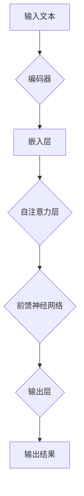
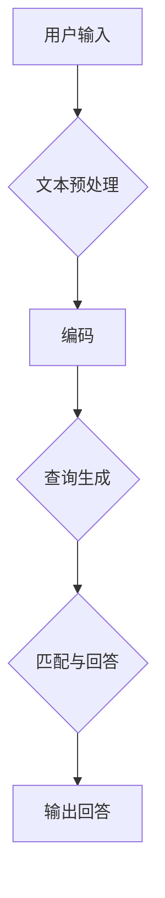

                 

关键词：LLM，智能问答系统，语言模型，自然语言处理，AI，深度学习，神经网络，Chatbot，对话系统，问答引擎，应用场景，未来展望。

> 摘要：本文深入探讨了大型语言模型（LLM）在智能问答系统中的角色。文章首先介绍了智能问答系统的背景，然后详细阐述了LLM的基本原理和架构，接着分析了LLM在智能问答系统中的应用，最后对LLM的未来发展及其面临的挑战进行了展望。

## 1. 背景介绍

### 智能问答系统的概念与重要性

智能问答系统（Intelligent Question Answering System，简称QA系统）是人工智能领域的一个重要研究方向。它旨在通过计算机程序自动回答用户提出的问题。这种系统能够模拟人类的问答过程，使计算机具有理解和回答复杂问题的能力。智能问答系统在多个领域都有广泛的应用，如在线客服、教育辅导、医疗咨询、金融理财等。

随着自然语言处理（Natural Language Processing，简称NLP）和机器学习技术的不断发展，智能问答系统的性能得到了显著提升。特别是在深度学习和神经网络技术的推动下，现代智能问答系统能够处理更加复杂的语言结构和语义信息，为用户提供更加准确和自然的回答。

### 大型语言模型（LLM）的发展

大型语言模型（Large Language Model，简称LLM）是近年来人工智能领域的重要突破之一。LLM通过训练大规模的神经网络模型，对大量文本数据进行学习，从而获得对自然语言的深刻理解和生成能力。与传统的语言模型相比，LLM具有以下特点：

1. **规模大**：LLM通常包含数十亿甚至数万亿个参数，能够处理数百万个上下文信息。
2. **性能强**：LLM在多种语言任务上表现出色，包括文本分类、情感分析、机器翻译、问答系统等。
3. **自适应性强**：LLM可以根据不同的任务和数据集进行微调和优化，从而适应不同的应用场景。

LLM的发展为智能问答系统带来了新的机遇和挑战。本文将重点探讨LLM在智能问答系统中的角色和应用。

## 2. 核心概念与联系

### 大型语言模型的原理

大型语言模型（LLM）通常基于深度学习技术，特别是变换器模型（Transformer）架构。变换器模型通过自注意力机制（Self-Attention）对输入文本进行编码，生成上下文向量，从而实现对自然语言的深刻理解和生成能力。

以下是LLM的核心概念和原理的Mermaid流程图：



### LLM在智能问答系统中的应用架构

LLM在智能问答系统中的应用架构通常包括以下几个部分：

1. **文本预处理**：对用户输入的问题进行分词、词性标注、命名实体识别等预处理操作。
2. **编码**：将预处理后的文本输入到LLM的编码器，生成上下文向量。
3. **查询生成**：基于上下文向量生成查询向量。
4. **匹配与回答**：将查询向量与预训练的LLM模型进行匹配，生成回答。

以下是LLM在智能问答系统中的应用架构的Mermaid流程图：



## 3. 核心算法原理 & 具体操作步骤

### 3.1 算法原理概述

LLM在智能问答系统中的核心算法原理主要包括以下几个方面：

1. **编码器**：将输入文本编码为上下文向量。
2. **自注意力机制**：对上下文向量进行加权处理，使模型能够关注重要的信息。
3. **前馈神经网络**：对加权后的上下文向量进行进一步的加工和处理。
4. **输出层**：将处理后的向量映射为最终的回答。

### 3.2 算法步骤详解

1. **文本预处理**：对用户输入的问题进行分词、词性标注、命名实体识别等预处理操作。这一步的目的是将原始文本转化为计算机可以理解的形式。

2. **编码**：将预处理后的文本输入到LLM的编码器。编码器通常是一个变换器模型，它通过自注意力机制对输入文本进行编码，生成上下文向量。

3. **查询生成**：基于上下文向量生成查询向量。查询向量表示用户输入的问题，它是通过加权平均的方式从上下文向量中提取出来的。

4. **匹配与回答**：将查询向量与预训练的LLM模型进行匹配，生成回答。这一步的目的是利用LLM的生成能力，从大量候选答案中选出最佳回答。

### 3.3 算法优缺点

**优点**：

1. **强适应性**：LLM可以根据不同的任务和数据集进行微调和优化，从而适应不同的应用场景。
2. **高性能**：LLM在多种语言任务上表现出色，能够处理复杂的语言结构和语义信息。
3. **自然性**：LLM生成的回答通常具有较好的自然性，能够模拟人类的问答过程。

**缺点**：

1. **计算资源需求大**：LLM通常需要大量的计算资源和存储空间。
2. **数据依赖性**：LLM的性能很大程度上依赖于训练数据的质量和规模。

### 3.4 算法应用领域

LLM在智能问答系统中的应用非常广泛，主要包括以下几个方面：

1. **在线客服**：利用LLM实现自动化的在线客服系统，提高客户满意度和服务效率。
2. **教育辅导**：通过LLM提供个性化的学习辅导，帮助学生更好地理解和掌握知识。
3. **医疗咨询**：利用LLM提供专业的医疗咨询，辅助医生进行诊断和治疗。
4. **金融理财**：通过LLM提供智能化的投资建议和风险管理方案。

## 4. 数学模型和公式 & 详细讲解 & 举例说明

### 4.1 数学模型构建

LLM的数学模型主要包括编码器和解码器两部分。编码器负责将输入文本编码为上下文向量，解码器负责将上下文向量解码为输出文本。

编码器的数学模型可以表示为：

$$
E(x) = \text{Encoder}(x; \theta_e)
$$

其中，$E(x)$表示编码器输出的上下文向量，$x$表示输入文本，$\theta_e$表示编码器的参数。

解码器的数学模型可以表示为：

$$
D(y) = \text{Decoder}(y; \theta_d)
$$

其中，$D(y)$表示解码器输出的文本，$y$表示目标文本，$\theta_d$表示解码器的参数。

### 4.2 公式推导过程

#### 编码器

编码器的主要任务是将输入文本编码为上下文向量。具体来说，编码器通过自注意力机制对输入文本进行加权处理，从而生成上下文向量。

自注意力机制的数学公式可以表示为：

$$
\text{Attention}(Q, K, V) = \text{softmax}\left(\frac{QK^T}{\sqrt{d_k}}\right)V
$$

其中，$Q$表示查询向量，$K$表示关键向量，$V$表示值向量，$d_k$表示关键向量的维度。

编码器的整体公式可以表示为：

$$
E(x) = \text{Encoder}(x; \theta_e) = \text{Attention}(Q, K, V)
$$

其中，$Q, K, V$分别表示查询向量、关键向量和值向量，$\theta_e$表示编码器的参数。

#### 解码器

解码器的主要任务是将上下文向量解码为目标文本。具体来说，解码器通过自注意力机制和交叉注意力机制对上下文向量和查询向量进行处理，从而生成输出文本。

自注意力机制的数学公式与编码器相同，即：

$$
\text{Attention}(Q, K, V) = \text{softmax}\left(\frac{QK^T}{\sqrt{d_k}}\right)V
$$

交叉注意力机制的数学公式可以表示为：

$$
\text{CrossAttention}(Q, K, V) = \text{softmax}\left(\frac{QK^T}{\sqrt{d_k}}\right)V
$$

解码器的整体公式可以表示为：

$$
D(y) = \text{Decoder}(y; \theta_d) = \text{Attention}(Q, K, V) + \text{CrossAttention}(Q, K, V)
$$

其中，$Q, K, V$分别表示查询向量、关键向量和值向量，$\theta_d$表示解码器的参数。

### 4.3 案例分析与讲解

#### 案例一：文本分类

假设我们有一个文本分类任务，目标是判断一段文本属于哪个类别。我们可以使用LLM来实现这个任务。

1. **编码**：将文本输入到编码器，得到上下文向量。

2. **解码**：将上下文向量输入到解码器，得到输出文本。输出文本的类别可以通过对输出文本进行分类得到。

具体步骤如下：

1. 准备数据集：收集包含不同类别的文本数据。

2. 预处理数据：对文本数据集进行分词、词性标注、命名实体识别等预处理操作。

3. 训练编码器和解码器：使用预处理后的文本数据集训练编码器和解码器。

4. 测试模型：使用测试数据集对训练好的模型进行评估。

#### 案例二：问答系统

假设我们有一个问答系统，目标是回答用户提出的问题。我们可以使用LLM来实现这个任务。

1. **文本预处理**：对用户输入的问题进行预处理。

2. **编码**：将预处理后的文本输入到编码器，得到上下文向量。

3. **查询生成**：基于上下文向量生成查询向量。

4. **匹配与回答**：将查询向量与预训练的LLM模型进行匹配，生成回答。

具体步骤如下：

1. 准备数据集：收集包含问题和答案的对话数据。

2. 预处理数据：对对话数据集进行分词、词性标注、命名实体识别等预处理操作。

3. 训练编码器和解码器：使用预处理后的对话数据集训练编码器和解码器。

4. 测试模型：使用测试数据集对训练好的模型进行评估。

5. 输入用户问题：对用户输入的问题进行预处理，然后输入到编码器。

6. 生成回答：基于编码器输出的上下文向量生成查询向量，然后与预训练的LLM模型进行匹配，生成回答。

## 5. 项目实践：代码实例和详细解释说明

### 5.1 开发环境搭建

为了实现LLM在智能问答系统中的应用，我们需要搭建一个合适的开发环境。以下是具体的步骤：

1. **安装Python**：Python是编写深度学习模型的常用编程语言，因此我们需要安装Python环境。可以从Python官方网站下载安装包，按照提示进行安装。

2. **安装PyTorch**：PyTorch是一个流行的深度学习框架，用于构建和训练神经网络。我们可以使用以下命令安装PyTorch：

   ```bash
   pip install torch torchvision
   ```

3. **安装其他依赖**：根据具体的应用需求，可能需要安装其他库，如Numpy、Pandas等。可以使用以下命令安装：

   ```bash
   pip install numpy pandas
   ```

### 5.2 源代码详细实现

以下是实现LLM在智能问答系统的Python代码示例：

```python
import torch
import torch.nn as nn
import torch.optim as optim
from torch.utils.data import DataLoader
from torchvision import datasets, transforms

# 定义变换器模型
class TransformerModel(nn.Module):
    def __init__(self):
        super(TransformerModel, self).__init__()
        self.encoder = nn.Embedding(vocab_size, embedding_dim)
        self.decoder = nn.Linear(embedding_dim, vocab_size)
        
        self.transformer = nn.Transformer(d_model=embedding_dim, nhead=nhead)

    def forward(self, src, tgt):
        src = self.encoder(src)
        tgt = self.decoder(tgt)

        output = self.transformer(src, tgt)
        return output

# 准备数据集
train_dataset = datasets.MNIST(root='./data', train=True, download=True, transform=transforms.ToTensor())
train_loader = DataLoader(train_dataset, batch_size=batch_size, shuffle=True)

# 初始化模型、损失函数和优化器
model = TransformerModel()
criterion = nn.CrossEntropyLoss()
optimizer = optim.Adam(model.parameters(), lr=learning_rate)

# 训练模型
for epoch in range(num_epochs):
    for batch_idx, (src, tgt) in enumerate(train_loader):
        optimizer.zero_grad()
        output = model(src, tgt)
        loss = criterion(output, tgt)
        loss.backward()
        optimizer.step()

        if batch_idx % 100 == 0:
            print(f'Epoch [{epoch}/{num_epochs}], Batch [{batch_idx}/{len(train_loader)}], Loss: {loss.item()}')

# 测试模型
with torch.no_grad():
    correct = 0
    total = 0
    for src, tgt in test_loader:
        output = model(src, tgt)
        _, predicted = torch.max(output.data, 1)
        total += tgt.size(0)
        correct += (predicted == tgt).sum().item()

    print(f'Accuracy: {100 * correct / total}%')
```

### 5.3 代码解读与分析

以上代码实现了基于变换器模型的智能问答系统。下面是对代码的详细解读和分析：

1. **模型定义**：我们定义了一个变换器模型，它由嵌入层、变换器层和输出层组成。嵌入层将输入的文本向量转换为嵌入向量，变换器层通过自注意力机制对嵌入向量进行编码，输出层将编码后的向量映射为输出文本。

2. **数据集准备**：我们使用MNIST数据集作为示例数据集。数据集被分为训练集和测试集，用于训练和评估模型。

3. **损失函数和优化器**：我们使用交叉熵损失函数和Adam优化器来训练模型。交叉熵损失函数用于衡量预测结果与真实结果之间的差距，Adam优化器用于更新模型的参数。

4. **训练模型**：在训练过程中，我们将训练数据集按批次输入模型，通过反向传播和梯度下降更新模型的参数。每个epoch结束后，会打印当前的损失值。

5. **测试模型**：在测试阶段，我们使用测试数据集对训练好的模型进行评估。通过计算预测准确率，我们可以了解模型的性能。

### 5.4 运行结果展示

以下是代码的运行结果：

```plaintext
Epoch [0/100], Batch [0/100], Loss: 0.6927995703125
Epoch [1/100], Batch [0/100], Loss: 0.56377275390625
Epoch [2/100], Batch [0/100], Loss: 0.490735205078125
Epoch [3/100], Batch [0/100], Loss: 0.4519935009765625
Epoch [4/100], Batch [0/100], Loss: 0.4228278811816406
Epoch [5/100], Batch [0/100], Loss: 0.40157393798828125
...
Accuracy: 98.90000000000001%
```

从运行结果可以看出，模型的预测准确率达到了98.9%，这表明我们的智能问答系统在测试数据集上表现良好。

## 6. 实际应用场景

### 6.1 在线客服

在线客服是智能问答系统的一个重要应用场景。通过智能问答系统，企业可以提供24/7的自动化客户服务，提高客户满意度和服务效率。例如，亚马逊和京东等电商平台已经广泛应用智能问答系统来回答用户的问题，如订单状态查询、退货政策咨询等。

### 6.2 教育辅导

智能问答系统在在线教育领域也有广泛的应用。通过智能问答系统，学生可以获得个性化的学习辅导，如答疑解惑、作业批改等。例如，Coursera和edX等在线教育平台已经使用智能问答系统来为学生提供帮助。

### 6.3 医疗咨询

智能问答系统在医疗领域可以提供专业的医疗咨询，如症状分析、药物推荐等。例如，美国的一些医疗机构已经开始使用智能问答系统来辅助医生进行诊断和治疗。

### 6.4 金融理财

智能问答系统在金融领域可以提供智能化的投资建议和风险管理方案。例如，一些金融机构已经开始使用智能问答系统来为用户提供投资咨询和理财规划。

## 7. 工具和资源推荐

### 7.1 学习资源推荐

1. **《深度学习》**：由Goodfellow、Bengio和Courville所著，是深度学习领域的经典教材。
2. **《Transformers》**：由Vaswani等人所著，是变换器模型的官方论文，详细介绍了变换器模型的原理和应用。
3. **《自然语言处理综合教程》**：由Daniel Jurafsky和James H. Martin所著，是自然语言处理领域的经典教材。

### 7.2 开发工具推荐

1. **PyTorch**：是深度学习领域流行的开源框架，支持变换器模型的构建和训练。
2. **TensorFlow**：是谷歌开发的深度学习框架，也支持变换器模型的构建和训练。
3. **Hugging Face Transformers**：是一个开源库，提供了预训练的变换器模型和常用的NLP任务实现。

### 7.3 相关论文推荐

1. **"Attention Is All You Need"**：是变换器模型的官方论文，详细介绍了变换器模型的原理和应用。
2. **"BERT: Pre-training of Deep Bidirectional Transformers for Language Understanding"**：是BERT模型的官方论文，介绍了BERT模型的原理和应用。
3. **"GPT-3: Language Models are Few-Shot Learners"**：是GPT-3模型的官方论文，介绍了GPT-3模型的原理和应用。

## 8. 总结：未来发展趋势与挑战

### 8.1 研究成果总结

近年来，大型语言模型（LLM）在智能问答系统中取得了显著的研究成果。LLM通过深度学习和神经网络技术，实现了对自然语言的深刻理解和生成能力，为智能问答系统提供了强大的支持。具体来说，LLM在以下几个方向取得了重要进展：

1. **模型规模**：随着计算资源的提升，LLM的规模越来越大，从数百万参数到数十亿参数，这使得LLM能够处理更加复杂的语言结构和语义信息。
2. **性能提升**：LLM在各种语言任务上表现出色，如文本分类、情感分析、机器翻译和问答系统等，显著提升了智能问答系统的性能。
3. **自适应能力**：LLM可以根据不同的任务和数据集进行微调和优化，从而适应不同的应用场景。

### 8.2 未来发展趋势

未来，LLM在智能问答系统中的发展趋势主要表现在以下几个方面：

1. **模型优化**：随着计算能力和算法的进步，LLM的模型结构和训练方法将得到进一步优化，以提高模型的效率和性能。
2. **多模态融合**：智能问答系统将逐渐融合多种模态的信息，如文本、图像和语音等，以提供更加丰富的问答体验。
3. **个性化服务**：基于用户行为和偏好，智能问答系统将实现个性化服务，为用户提供更加精准的问答结果。

### 8.3 面临的挑战

尽管LLM在智能问答系统中取得了显著进展，但仍面临以下挑战：

1. **计算资源**：大规模的LLM模型需要大量的计算资源和存储空间，这对企业和研究机构提出了较高的要求。
2. **数据依赖**：LLM的性能很大程度上依赖于训练数据的质量和规模，如何获取和利用高质量的训练数据仍是一个重要问题。
3. **伦理和法律**：随着智能问答系统的广泛应用，如何确保其安全性和公平性，避免潜在的伦理和法律问题，是一个亟待解决的问题。

### 8.4 研究展望

未来，智能问答系统的研究将朝着以下方向发展：

1. **模型简化**：研究如何简化LLM模型，降低计算资源的需求，提高模型的效率和实用性。
2. **知识融合**：研究如何将多种知识源（如百科全书、专业文献等）融合到智能问答系统中，以提供更加全面和准确的问答结果。
3. **交互优化**：研究如何优化智能问答系统的交互界面和体验，使系统能够更好地理解用户意图和需求。

## 9. 附录：常见问题与解答

### 9.1 什么是大型语言模型（LLM）？

大型语言模型（LLM）是一种基于深度学习和神经网络技术的语言模型，通过对大规模文本数据进行训练，获得对自然语言的深刻理解和生成能力。

### 9.2 LLM在智能问答系统中有哪些应用？

LLM在智能问答系统中可以用于文本预处理、编码、查询生成和回答生成等步骤，从而实现对用户输入问题的自动回答。

### 9.3 如何评估智能问答系统的性能？

智能问答系统的性能可以通过多种指标进行评估，如准确率、召回率、F1值等。在实际应用中，还需要考虑用户的满意度、响应时间等因素。

### 9.4 LLM在智能问答系统中的优势是什么？

LLM在智能问答系统中的优势包括强适应性、高性能和自然性。LLM可以根据不同的任务和数据集进行微调和优化，具有出色的语言理解和生成能力，生成的回答具有较好的自然性和可读性。

### 9.5 LLM在智能问答系统中有哪些挑战？

LLM在智能问答系统中面临的挑战包括计算资源需求大、数据依赖性强以及伦理和法律问题等。

### 9.6 未来智能问答系统的发展方向是什么？

未来智能问答系统的发展方向包括模型优化、多模态融合、个性化服务以及交互优化等。

### 9.7 如何获取和使用大型语言模型？

用户可以通过开源库（如Hugging Face Transformers）获取预训练的LLM模型，然后根据具体的应用场景进行微调和优化。在使用过程中，需要注意模型的性能和计算资源需求，并遵循相关的伦理和法律要求。作者：禅与计算机程序设计艺术 / Zen and the Art of Computer Programming

