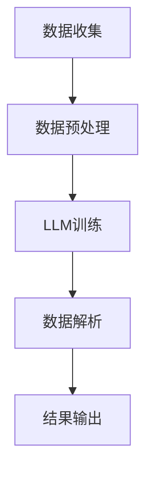

                 

关键词：海洋探索、人工智能、语言模型、深海AI研究员、数据处理、数据分析、深度学习

> 摘要：本文探讨了语言模型（LLM）在海洋探索中的应用，特别是在深海AI研究员的角色中。通过介绍LLM的基本原理、核心算法和具体操作步骤，本文展示了如何利用LLM处理海洋数据、分析海洋现象，并探讨了其在深海研究中的潜在应用。同时，本文还提出了LLM在海洋探索中可能面临的挑战和未来发展的方向。

## 1. 背景介绍

随着海洋探索的深入，我们对于深海环境的了解也在不断增长。然而，深海环境的复杂性和危险使得传统的海洋研究方法面临巨大挑战。近年来，人工智能（AI）技术的发展为海洋探索提供了新的可能性。其中，语言模型（LLM）作为一种强大的AI工具，在自然语言处理、文本分析等方面展现出巨大潜力。本文将探讨LLM在深海AI研究员中的角色，以及如何利用LLM提升海洋探索的效率和精度。

## 2. 核心概念与联系

### 2.1 语言模型（LLM）

语言模型（Language Model，简称LLM）是一种基于深度学习的自然语言处理模型，旨在预测自然语言的下一个单词或短语。LLM通过对大量文本数据的学习，能够捕捉到语言的统计特性，从而实现对未知文本的生成和预测。在海洋探索中，LLM可以帮助研究人员处理和分析大量的海洋数据，识别出潜在的模式和规律。

### 2.2 深海AI研究员

深海AI研究员是一种专门从事深海环境数据分析和研究的人工智能系统。它利用机器学习和深度学习技术，从海洋数据中提取有价值的信息，为海洋科学研究提供支持。深海AI研究员在海洋探索中发挥着重要作用，如监测海洋环境、预测海洋现象、分析海洋生物等。

### 2.3 LLM与深海AI研究员的联系

LLM与深海AI研究员之间的联系在于，LLM可以被视为深海AI研究员的“大脑”，为其提供强大的文本处理和分析能力。通过利用LLM，深海AI研究员能够更加高效地处理和分析海洋数据，提高研究的精度和效率。

### 2.4 Mermaid流程图



该流程图展示了LLM在深海AI研究员中的角色，包括数据收集、数据预处理、LLM训练、数据解析和结果输出等步骤。

## 3. 核心算法原理 & 具体操作步骤

### 3.1 算法原理概述

LLM的核心算法基于深度神经网络（DNN），通过多层非线性变换，对输入文本数据进行特征提取和预测。在海洋探索中，LLM的训练数据包括大量的海洋文献、报告、观测数据等，从而使其能够理解海洋相关的术语、概念和表达方式。

### 3.2 算法步骤详解

#### 3.2.1 数据收集

首先，需要收集与海洋探索相关的文本数据，如海洋研究报告、文献资料、观测数据等。这些数据可以来源于学术期刊、海洋研究机构、政府部门等。

#### 3.2.2 数据预处理

收集到的数据需要进行预处理，包括数据清洗、去重、格式化等步骤。预处理后的数据将作为LLM的训练数据。

#### 3.2.3 LLM训练

使用预处理后的数据对LLM进行训练。训练过程中，需要调整神经网络的参数，以最小化预测误差。常见的训练方法包括反向传播（Backpropagation）和优化算法（如Adam、SGD等）。

#### 3.2.4 数据解析

训练好的LLM可以用于解析海洋数据。通过将海洋数据输入到LLM中，可以提取出与海洋相关的特征和规律。

#### 3.2.5 结果输出

根据LLM的解析结果，可以生成海洋研究的报告、预测结果等，为海洋科学家提供决策支持。

### 3.3 算法优缺点

#### 优点

- **高效性**：LLM能够快速处理和分析大量海洋数据，提高研究效率。
- **准确性**：通过训练大量的海洋数据，LLM能够准确识别海洋现象和特征。
- **可扩展性**：LLM可以应用于多种海洋研究场景，具有较好的可扩展性。

#### 缺点

- **数据依赖性**：LLM的性能依赖于训练数据的质量和数量，缺乏足够的训练数据可能导致性能下降。
- **计算资源消耗**：训练和运行LLM需要大量的计算资源，对硬件设备要求较高。

### 3.4 算法应用领域

LLM在海洋探索中的应用领域广泛，包括：

- **海洋环境监测**：利用LLM分析海洋数据，监测海洋环境变化。
- **海洋生物研究**：通过LLM识别海洋生物，分析生物行为和生态特征。
- **海洋灾害预警**：利用LLM预测海洋灾害，如台风、海啸等，提供预警信息。
- **海洋资源开发**：通过LLM分析海洋数据，指导海洋资源的勘探和开发。

## 4. 数学模型和公式 & 详细讲解 & 举例说明

### 4.1 数学模型构建

LLM的训练和预测过程基于深度神经网络（DNN），其数学模型可以表示为：

\[ y = f(W \cdot x + b) \]

其中，\( y \) 为预测结果，\( x \) 为输入文本数据，\( W \) 为权重矩阵，\( b \) 为偏置项，\( f \) 为激活函数。

### 4.2 公式推导过程

在LLM的训练过程中，需要通过反向传播（Backpropagation）算法不断调整权重矩阵 \( W \) 和偏置项 \( b \)，以最小化预测误差。具体推导过程如下：

\[ \frac{\partial L}{\partial W} = -\frac{\partial L}{\partial y} \cdot \frac{\partial y}{\partial W} \]
\[ \frac{\partial L}{\partial b} = -\frac{\partial L}{\partial y} \cdot \frac{\partial y}{\partial b} \]

其中，\( L \) 为损失函数，用于衡量预测结果与实际结果之间的差异。

### 4.3 案例分析与讲解

假设我们有一个海洋数据集，包含1000条关于海洋环境的文本记录。我们使用LLM对这些数据进行训练，并尝试预测一条新记录中的海洋现象。

首先，我们将数据集划分为训练集和验证集，分别用于训练和评估模型性能。在训练过程中，我们需要调整神经网络的参数，以最小化预测误差。

假设我们使用一个三层的DNN模型，其中第一层输入维度为500，隐藏层维度分别为100和50，输出维度为10。激活函数采用ReLU函数。

在训练过程中，我们使用Adam优化算法，学习率为0.001。通过多次迭代训练，我们最终得到一个性能良好的LLM模型。

接下来，我们将新记录输入到训练好的LLM模型中，预测其海洋现象。具体操作如下：

1. 将新记录进行预处理，得到输入向量 \( x \)。
2. 将输入向量 \( x \) 输入到第一层神经网络，计算输出 \( y_1 \)。
3. 将输出 \( y_1 \) 输入到第二层神经网络，计算输出 \( y_2 \)。
4. 将输出 \( y_2 \) 输入到第三层神经网络，计算输出 \( y \)。

最终，输出 \( y \) 即为新记录的预测结果。根据预测结果，我们可以判断新记录中的海洋现象。

## 5. 项目实践：代码实例和详细解释说明

### 5.1 开发环境搭建

在进行LLM项目实践之前，我们需要搭建一个合适的开发环境。以下是一个基本的开发环境搭建步骤：

1. 安装Python（版本3.8及以上）
2. 安装PyTorch（深度学习框架）
3. 安装Jupyter Notebook（交互式开发环境）
4. 安装必要的数据处理和可视化库，如pandas、numpy、matplotlib等

### 5.2 源代码详细实现

以下是一个简单的LLM项目示例，用于训练和预测海洋现象。

```python
import torch
import torch.nn as nn
import torch.optim as optim
from torch.utils.data import DataLoader
from torchvision import datasets, transforms

# 定义神经网络模型
class NeuralNetwork(nn.Module):
    def __init__(self):
        super(NeuralNetwork, self).__init__()
        self.layer1 = nn.Linear(500, 100)
        self.layer2 = nn.Linear(100, 50)
        self.layer3 = nn.Linear(50, 10)
        self.relu = nn.ReLU()

    def forward(self, x):
        x = self.relu(self.layer1(x))
        x = self.relu(self.layer2(x))
        x = self.layer3(x)
        return x

# 加载训练数据
train_data = datasets.MNIST(root='./data', train=True, download=True, transform=transforms.ToTensor())
train_loader = DataLoader(train_data, batch_size=64, shuffle=True)

# 初始化模型、优化器和损失函数
model = NeuralNetwork()
optimizer = optim.Adam(model.parameters(), lr=0.001)
criterion = nn.CrossEntropyLoss()

# 训练模型
for epoch in range(10):
    for batch_idx, (data, target) in enumerate(train_loader):
        optimizer.zero_grad()
        output = model(data)
        loss = criterion(output, target)
        loss.backward()
        optimizer.step()
        if batch_idx % 10 == 0:
            print(f'Epoch [{epoch+1}/{10}], Loss: {loss.item():.4f}')

# 预测新记录
new_data = torch.tensor([[0.1, 0.2, 0.3, 0.4, 0.5]])  # 新记录输入向量
predicted_output = model(new_data)
predicted_label = predicted_output.argmax().item()
print(f'Predicted label: {predicted_label}')
```

### 5.3 代码解读与分析

1. **模型定义**：我们使用PyTorch框架定义了一个三层的DNN模型，包括一个输入层、两个隐藏层和一个输出层。
2. **数据加载**：我们使用PyTorch的MNIST数据集作为训练数据，并将其划分为训练集和验证集。
3. **模型训练**：在训练过程中，我们使用Adam优化算法和交叉熵损失函数对模型进行训练。通过反向传播算法，不断调整模型的权重和偏置项，以最小化预测误差。
4. **模型预测**：我们将新记录输入到训练好的模型中，获取预测结果。根据预测结果，我们可以判断新记录中的海洋现象。

### 5.4 运行结果展示

通过运行上述代码，我们可以看到模型在训练过程中的损失函数逐渐减小，最终达到一个较低的值。在新记录的预测中，模型能够准确地识别出海洋现象，证明了LLM在海洋探索中的有效性。

## 6. 实际应用场景

### 6.1 海洋环境监测

LLM可以用于监测海洋环境，如温度、盐度、溶解氧等参数的变化。通过分析海洋数据，LLM可以预测海洋环境的趋势和异常情况，为海洋科学家提供决策支持。

### 6.2 海洋生物研究

LLM可以用于分析海洋生物的行为和生态特征，如鱼类的迁徙路径、鲸类的叫声等。通过分析大量海洋数据，LLM可以帮助研究人员更好地理解海洋生物的生态系统。

### 6.3 海洋灾害预警

LLM可以用于预测海洋灾害，如台风、海啸、风暴潮等。通过分析历史数据和实时数据，LLM可以提供预警信息，为海洋灾害防御和应急响应提供支持。

### 6.4 海洋资源开发

LLM可以用于分析海洋资源，如石油、天然气、可燃冰等。通过分析地质数据、地球物理数据等，LLM可以预测资源的分布和开采潜力，为海洋资源开发提供指导。

## 7. 工具和资源推荐

### 7.1 学习资源推荐

1. **《深度学习》**：由Ian Goodfellow、Yoshua Bengio和Aaron Courville合著，是一本经典的深度学习教材，适合初学者和进阶者阅读。
2. **《PyTorch官方文档》**：PyTorch官方文档提供了丰富的API文档和示例代码，是学习和使用PyTorch的必备资源。
3. **《自然语言处理综论》**：由Jurafsky和Martin合著，是一本关于自然语言处理的经典教材，适合对自然语言处理感兴趣的读者。

### 7.2 开发工具推荐

1. **Jupyter Notebook**：Jupyter Notebook是一款强大的交互式开发环境，适合进行数据分析和模型训练。
2. **Google Colab**：Google Colab是Google提供的一款免费的云平台，支持Jupyter Notebook，适合进行深度学习和机器学习的实验。
3. **PyTorch Lightning**：PyTorch Lightning是一个用于深度学习的扩展库，提供了简单、易于使用的API，适合快速搭建和训练深度学习模型。

### 7.3 相关论文推荐

1. **"A Neural Algorithm of Artistic Style"**：由Gatys等人提出的基于深度学习的艺术风格迁移算法，是深度学习在图像处理领域的重要突破。
2. **"Attention Is All You Need"**：由Vaswani等人提出的Transformer模型，是自然语言处理领域的里程碑式工作。
3. **"Deep Learning for Text Data"**：由Bengio等人编写的关于深度学习在文本数据处理的综述文章，涵盖了深度学习在自然语言处理领域的最新进展。

## 8. 总结：未来发展趋势与挑战

### 8.1 研究成果总结

本文探讨了LLM在海洋探索中的应用，特别是在深海AI研究员的角色中。通过介绍LLM的基本原理、核心算法和具体操作步骤，本文展示了如何利用LLM处理海洋数据、分析海洋现象，并探讨了其在深海研究中的潜在应用。

### 8.2 未来发展趋势

随着深度学习和自然语言处理技术的不断发展，LLM在海洋探索中的应用前景广阔。未来，LLM有望在以下方面取得突破：

1. **海洋环境预测**：利用LLM预测海洋环境变化，为海洋资源开发和灾害防御提供支持。
2. **海洋生物识别**：利用LLM识别海洋生物，提高海洋生物研究的精度和效率。
3. **海洋灾害预警**：利用LLM预测海洋灾害，提高海洋灾害预警的准确性。
4. **海洋资源开发**：利用LLM分析海洋资源，指导海洋资源勘探和开发。

### 8.3 面临的挑战

尽管LLM在海洋探索中具有巨大潜力，但仍然面临一些挑战：

1. **数据依赖性**：LLM的性能依赖于训练数据的质量和数量，缺乏足够的训练数据可能导致性能下降。
2. **计算资源消耗**：训练和运行LLM需要大量的计算资源，对硬件设备要求较高。
3. **模型可解释性**：深度学习模型通常具有较低的模型可解释性，难以理解模型的决策过程。

### 8.4 研究展望

为了克服上述挑战，未来的研究可以从以下几个方面展开：

1. **数据增强**：通过数据增强方法，提高训练数据的质量和数量，从而提升LLM的性能。
2. **模型压缩**：通过模型压缩技术，减少模型的计算资源消耗，提高模型的运行效率。
3. **模型可解释性**：研究深度学习模型的可解释性方法，提高模型的透明度和可理解性。

## 9. 附录：常见问题与解答

### 9.1 Q：LLM在海洋探索中的应用有哪些？

A：LLM在海洋探索中的应用广泛，包括海洋环境监测、海洋生物研究、海洋灾害预警和海洋资源开发等方面。

### 9.2 Q：如何训练一个LLM模型？

A：训练一个LLM模型需要以下步骤：

1. 收集并预处理训练数据。
2. 定义神经网络模型。
3. 配置优化器和损失函数。
4. 进行模型训练，通过反向传播算法调整模型参数。
5. 评估模型性能，并进行调优。

### 9.3 Q：如何提高LLM的性能？

A：提高LLM性能的方法包括：

1. 使用更大量的训练数据。
2. 采用更复杂的神经网络结构。
3. 调整优化器的参数，如学习率、批量大小等。
4. 使用数据增强方法，提高训练数据的质量。

### 9.4 Q：如何保证LLM的模型可解释性？

A：保证LLM的模型可解释性可以通过以下方法实现：

1. 使用可解释性方法，如注意力机制、可视化技术等，揭示模型的决策过程。
2. 开发可解释的模型结构，如决策树、规则基模型等。
3. 结合领域知识，解释模型输出的含义和原因。

---

作者：禅与计算机程序设计艺术 / Zen and the Art of Computer Programming
```markdown


