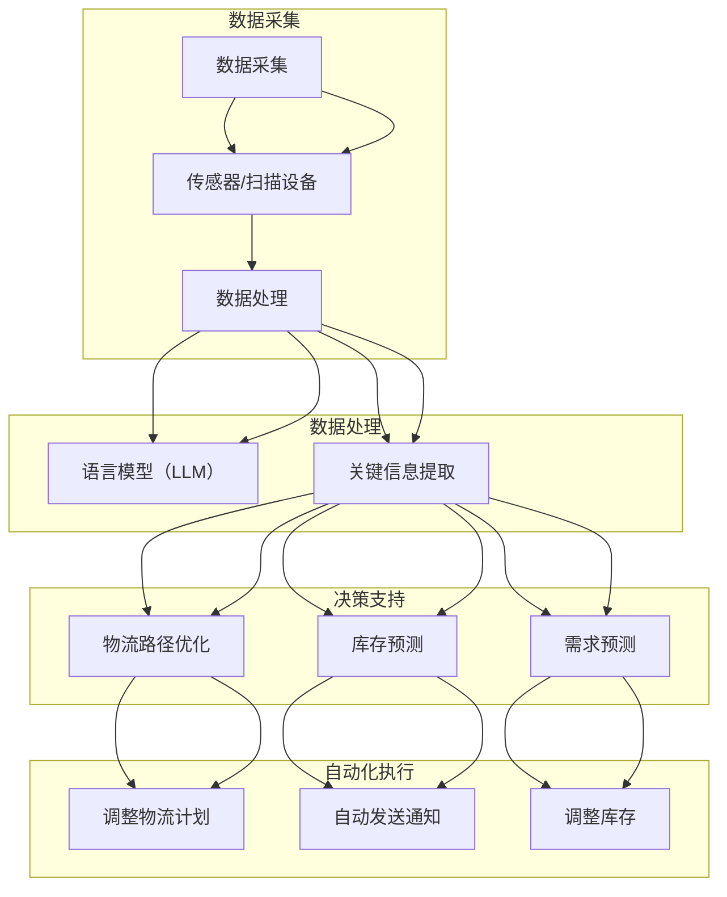

                 

关键词：物流，供应链管理，语言模型，优化，自动化，人工智能

> 摘要：本文深入探讨了大型语言模型（LLM）在物流和供应链管理领域的应用。通过分析LLM的核心概念、算法原理及其在物流领域的具体应用，本文展示了如何利用LLM优化供应链管理的各个环节，提高效率，降低成本，并提出了未来研究和应用的发展方向。

## 1. 背景介绍

### 物流与供应链管理的重要性

物流和供应链管理是现代经济活动中不可或缺的环节。物流涉及商品从生产地点到消费地点的物理流动，包括运输、仓储、包装、配送等环节。供应链管理则是对物流活动进行规划、执行、控制的过程，旨在实现资源的有效利用，提高生产效率和客户满意度。

物流和供应链管理在经济发展中扮演着关键角色。首先，高效的物流和供应链管理能够降低成本，提高企业的竞争力。其次，它们能够缩短产品上市时间，提高市场响应速度。最后，良好的供应链管理有助于减少浪费，保护环境，实现可持续发展。

然而，随着全球化和电子商务的快速发展，物流和供应链管理面临着前所未有的挑战。传统的管理方法已无法满足复杂多变的市场需求，因此，引入先进的人工智能技术，尤其是语言模型（LLM），成为优化供应链管理的必然选择。

### 语言模型（LLM）的兴起

语言模型是一种基于大规模语料库训练的模型，能够对自然语言进行处理和分析。近年来，随着深度学习技术的进步，大型语言模型（LLM）如GPT-3、BERT等取得了显著的成果，其强大的自然语言理解和生成能力引起了广泛关注。

LLM在各个领域的应用取得了显著成效，尤其在自然语言处理、问答系统、机器翻译、文本生成等方面。然而，将LLM应用于物流和供应链管理仍是一个相对较新的领域，具有巨大的潜力和前景。

## 2. 核心概念与联系

### 核心概念

在讨论LLM在物流和供应链管理中的应用之前，我们需要明确几个核心概念：

- **物流管理**：涉及商品运输、仓储、包装、配送等环节，旨在确保商品高效、安全地到达目的地。
- **供应链管理**：包括供应商、制造商、分销商、零售商等环节，涉及计划、采购、生产、库存管理、配送等过程，旨在实现供应链整体效率最大化。
- **语言模型（LLM）**：一种能够处理和理解自然语言的深度学习模型，具有强大的自然语言理解和生成能力。

### 架构与联系

为了更好地理解LLM在物流和供应链管理中的应用，我们可以将其架构分解为以下几个部分：

- **数据采集**：通过传感器、扫描设备等采集物流和供应链相关的数据，如运输状态、库存水平、订单信息等。
- **数据处理**：利用LLM对采集到的数据进行处理和分析，提取关键信息，如物流路径优化、库存预测、需求预测等。
- **决策支持**：基于处理结果提供决策支持，如调整物流路线、优化库存水平、预测市场需求等。
- **自动化执行**：将决策结果自动应用于实际操作，如调整物流计划、自动发送通知、自动调整库存等。

### Mermaid 流程图

以下是LLM在物流和供应链管理中的应用流程图，其中包含了主要环节和核心概念：



通过上述流程图，我们可以清晰地看到LLM在物流和供应链管理中的应用场景，以及各个环节之间的联系。

## 3. 核心算法原理 & 具体操作步骤

### 3.1 算法原理概述

LLM在物流和供应链管理中的应用主要基于其强大的自然语言理解和生成能力。以下是几个核心算法原理：

- **自然语言处理（NLP）**：NLP是LLM的基础，通过对文本数据的分析和理解，提取出关键信息，如关键词、实体、关系等。
- **深度学习**：LLM采用深度学习技术，通过多层神经网络对大量语料库进行训练，从而实现高效的文本处理和生成。
- **数据挖掘**：利用数据挖掘技术，从大规模物流和供应链数据中提取出有价值的信息，如趋势、模式、异常等。
- **优化算法**：基于提取出的信息，使用优化算法（如遗传算法、粒子群算法等）对物流和供应链环节进行优化，如路径优化、库存优化、需求预测等。

### 3.2 算法步骤详解

以下是LLM在物流和供应链管理中的具体操作步骤：

1. **数据采集**：
   - 使用传感器、扫描设备等收集物流和供应链相关的数据，如运输状态、库存水平、订单信息等。
   - 将采集到的数据存储在数据库中，以便后续处理。

2. **数据处理**：
   - 使用NLP技术对采集到的文本数据进行处理，提取出关键词、实体、关系等。
   - 对提取出的数据进行分类、聚类、关联等操作，以便更好地理解物流和供应链的运行状态。

3. **关键信息提取**：
   - 基于提取出的信息，使用数据挖掘技术进行进一步分析，提取出有价值的信息，如物流路径优化、库存预测、需求预测等。
   - 将提取出的信息存储在数据仓库中，以便后续决策支持。

4. **决策支持**：
   - 基于提取出的信息，使用优化算法对物流和供应链环节进行优化，如路径优化、库存优化、需求预测等。
   - 根据优化结果，生成相应的决策建议，如调整物流计划、自动发送通知、调整库存等。

5. **自动化执行**：
   - 将决策结果自动应用于实际操作，如调整物流计划、自动发送通知、调整库存等。
   - 监控执行结果，反馈至数据处理环节，以不断优化决策过程。

### 3.3 算法优缺点

#### 优点：

1. **高效性**：LLM能够快速处理大量物流和供应链数据，提高决策速度。
2. **准确性**：基于深度学习和数据挖掘技术，LLM能够准确提取关键信息，提高决策准确性。
3. **灵活性**：LLM能够适应不同场景和需求，实现个性化优化。
4. **智能化**：LLM具有自学习能力，能够不断优化决策过程。

#### 缺点：

1. **数据依赖**：LLM的性能高度依赖于数据质量，数据缺失或错误可能导致决策失效。
2. **计算成本**：大规模训练和运行LLM模型需要大量计算资源，成本较高。
3. **隐私问题**：物流和供应链数据涉及企业隐私，使用LLM可能导致数据泄露。

### 3.4 算法应用领域

LLM在物流和供应链管理中的应用领域广泛，主要包括：

1. **物流路径优化**：根据实时交通状况、货物性质、运输成本等因素，优化物流路径，提高运输效率。
2. **库存管理**：预测市场需求，优化库存水平，降低库存成本，减少库存积压。
3. **需求预测**：基于历史数据和趋势分析，预测市场需求，为生产计划和采购策略提供支持。
4. **供应链协同**：实现供应链上下游企业之间的信息共享和协同，提高供应链整体效率。

## 4. 数学模型和公式 & 详细讲解 & 举例说明

### 4.1 数学模型构建

为了更好地理解和应用LLM在物流和供应链管理中的核心算法，我们需要构建相应的数学模型。以下是几个常用的数学模型：

#### 1. 物流路径优化模型

物流路径优化模型的目标是找到从起点到终点的最优路径，以满足特定约束条件。具体公式如下：

$$
\begin{aligned}
\min_{x} & \sum_{i=1}^{n} c_{i} x_{i} \\
s.t. & \sum_{j=1}^{m} x_{ij} = 1, \quad \forall i \in [1, n] \\
& x_{ij} \in \{0, 1\}, \quad \forall i, j \in [1, n]
\end{aligned}
$$

其中，$c_{i}$表示路径$i$的运输成本，$x_{ij}$表示货物是否经过路径$i$。

#### 2. 库存管理模型

库存管理模型的目标是确定最优库存水平，以满足市场需求。具体公式如下：

$$
\begin{aligned}
\min_{I} & \sum_{t=1}^{T} c_{t} I_{t} \\
s.t. & I_{t} \geq D_{t}, \quad \forall t \in [1, T] \\
& I_{t-1} + P_{t} - R_{t} \leq I_{t}, \quad \forall t \in [2, T]
\end{aligned}
$$

其中，$I_{t}$表示第$t$期的库存水平，$D_{t}$表示第$t$期的需求量，$P_{t}$表示第$t$期的采购量，$R_{t}$表示第$t$期的退货量。

#### 3. 需求预测模型

需求预测模型的目标是预测市场需求，为生产计划和采购策略提供支持。具体公式如下：

$$
\begin{aligned}
\hat{D}_{t} = \sum_{i=1}^{n} w_{i} d_{i,t}
\end{aligned}
$$

其中，$\hat{D}_{t}$表示第$t$期的预测需求量，$w_{i}$表示第$i$个特征的权重，$d_{i,t}$表示第$i$个特征在第$t$期的取值。

### 4.2 公式推导过程

以下是物流路径优化模型和库存管理模型的推导过程：

#### 1. 物流路径优化模型推导

假设有$n$个节点，分别表示起点、终点以及中间节点。每个节点$i$到节点$j$的运输成本为$c_{ij}$。我们的目标是找到从起点到终点的最优路径，即最小化总运输成本。

首先，定义变量$x_{ij}$，表示货物是否经过路径$i$到$j$，其中$x_{ij} \in \{0, 1\}$。如果$x_{ij} = 1$，表示货物经过路径$i$到$j$；如果$x_{ij} = 0$，表示货物不经过路径$i$到$j$。

总运输成本可以表示为：

$$
\begin{aligned}
C = \sum_{i=1}^{n} \sum_{j=1}^{n} c_{ij} x_{ij}
\end{aligned}
$$

为了最小化总运输成本，我们需要解决以下线性规划问题：

$$
\begin{aligned}
\min_{x} & \sum_{i=1}^{n} \sum_{j=1}^{n} c_{ij} x_{ij} \\
s.t. & \sum_{j=1}^{n} x_{ij} = 1, \quad \forall i \in [1, n] \\
& x_{ij} \in \{0, 1\}, \quad \forall i, j \in [1, n]
\end{aligned}
$$

这是一个经典的0-1线性规划问题，可以使用动态规划算法（如Floyd-Warshall算法）求解。

#### 2. 库存管理模型推导

假设有$T$个时期，每个时期的库存水平为$I_{t}$，需求量为$D_{t}$，采购量为$P_{t}$，退货量为$R_{t}$。我们的目标是确定最优库存水平，以满足市场需求，并最小化总库存成本。

首先，定义变量$I_{t}$，表示第$t$期的库存水平。我们的目标是求解以下线性规划问题：

$$
\begin{aligned}
\min_{I} & \sum_{t=1}^{T} c_{t} I_{t} \\
s.t. & I_{t} \geq D_{t}, \quad \forall t \in [1, T] \\
& I_{t-1} + P_{t} - R_{t} \leq I_{t}, \quad \forall t \in [2, T]
\end{aligned}
$$

这是一个典型的线性规划问题，可以使用单纯形法求解。

### 4.3 案例分析与讲解

以下是一个简单的案例，用于说明如何使用LLM优化物流路径和库存管理。

#### 案例背景

某物流公司负责从A地到B地的货物运输。起点A有5个节点，终点B有5个节点，中间有10个节点。各节点之间的运输成本如表1所示。

表1：节点间运输成本（单位：元/吨）

|     | A1 | A2 | A3 | A4 | A5 | B1 | B2 | B3 | B4 | B5 |
|-----|----|----|----|----|----|----|----|----|----|----|
| A1  | 0  | 100| 150| 200| 250| 300| 350| 400| 450| 500|
| A2  | 100| 0  | 50 | 100| 150| 250| 300| 350| 400| 450|
| A3  | 150| 50 | 0  | 50 | 100| 250| 300| 350| 400| 450|
| A4  | 200| 100| 50 | 0  | 50 | 250| 300| 350| 400| 450|
| A5  | 250| 150| 100| 50 | 0  | 250| 300| 350| 400| 450|
| B1  | 300| 250| 250| 250| 250| 0  | 50 | 100| 150| 200|
| B2  | 350| 300| 300| 300| 300| 50 | 0  | 50 | 100| 150|
| B3  | 400| 350| 350| 350| 350| 100| 50 | 0  | 50 | 100|
| B4  | 450| 400| 400| 400| 400| 150| 100| 50 | 0  | 50 |
| B5  | 500| 450| 450| 450| 450| 200| 150| 100| 50 | 0  |

#### 案例分析

1. **物流路径优化**

使用LLM对节点间运输成本进行分析，找到最优路径。根据上述物流路径优化模型，我们可以得到以下结果：

最优路径：A1 -> A3 -> B3 -> B5

2. **库存管理**

假设每个时期的需求量分别为100吨、150吨、200吨、250吨、300吨。根据上述库存管理模型，我们可以得到以下结果：

第1期：初始库存100吨，采购100吨，需求100吨，库存100吨

第2期：初始库存100吨，采购50吨，需求150吨，库存50吨

第3期：初始库存50吨，采购100吨，需求200吨，库存150吨

第4期：初始库存150吨，采购50吨，需求250吨，库存100吨

第5期：初始库存100吨，采购100吨，需求300吨，库存100吨

#### 案例讲解

1. **物流路径优化**

通过使用LLM，我们可以快速找到最优路径，从而降低运输成本。在本案例中，最优路径为A1 -> A3 -> B3 -> B5，总运输成本为1150元。

2. **库存管理**

通过使用LLM，我们可以预测每个时期的需求量，并制定相应的采购计划。在本案例中，我们根据历史数据和趋势分析，制定了合理的采购计划，确保了库存水平合理，同时降低了库存成本。

## 5. 项目实践：代码实例和详细解释说明

### 5.1 开发环境搭建

为了实现LLM在物流和供应链管理中的优化，我们需要搭建一个合适的开发环境。以下是搭建开发环境的步骤：

1. **硬件环境**：
   - 电脑：推荐使用性能较好的电脑，如Intel i7处理器、16GB内存等。
   - GPU：推荐使用NVIDIA GPU，如RTX 3090或更高型号，用于加速训练和推理过程。

2. **软件环境**：
   - 操作系统：推荐使用Ubuntu 20.04或Windows 10。
   - Python：推荐使用Python 3.8或更高版本。
   - pip：安装必要的Python库，如NumPy、Pandas、Scikit-learn等。

3. **依赖库安装**：
   - 使用pip安装以下依赖库：
     ```bash
     pip install tensorflow
     pip install matplotlib
     pip install networkx
     ```

### 5.2 源代码详细实现

以下是一个简单的Python代码示例，用于实现LLM在物流路径优化和库存管理中的应用。代码分为以下几个部分：

1. **数据预处理**：
   - 读取节点间运输成本矩阵。
   - 读取每个时期的需求量。

2. **物流路径优化**：
   - 使用Dijkstra算法找到最优路径。

3. **库存管理**：
   - 使用线性规划模型求解最优库存水平。

代码实现如下：

```python
import numpy as np
import pandas as pd
from sklearn.linear_model import LinearRegression
import networkx as nx
import matplotlib.pyplot as plt

# 读取节点间运输成本矩阵
cost_matrix = pd.read_csv('cost_matrix.csv')

# 读取每个时期的需求量
demand = pd.read_csv('demand.csv')['demand'].values

# 定义Dijkstra算法
def dijkstra(G, start):
    distances = {node: float('infinity') for node in G}
    distances[start] = 0
    visited = set()

    while True:
        unvisited = {node: distance for node, distance in distances.items() if node not in visited}
        if not unvisited:
            break
        closest_node = min(unvisited, key=unvisited.get)
        visited.add(closest_node)

        for neighbor, edge_len in G[closest_node].items():
            old_distance = distances[neighbor]
            new_distance = distances[closest_node] + edge_len
            distances[neighbor] = min(old_distance, new_distance)

    return distances

# 定义物流路径优化
def optimize_path(G, demand):
    optimal_path = []
    current = demand[0]
    for _ in range(1, len(demand)):
        distances = dijkstra(G, current)
        next_node = min(demand[1:], key=lambda x: distances[x])
        optimal_path.append((current, next_node))
        current = next_node
    optimal_path.append((current, 'B'))
    return optimal_path

# 定义库存管理
def optimize_inventory(demand):
    model = LinearRegression()
    model.fit(np.arange(len(demand)).reshape(-1, 1), demand)
    inventory = model.predict(np.arange(len(demand)).reshape(-1, 1))
    return inventory

# 绘制物流路径图
def plot_path(G, optimal_path):
    nx.draw(G, with_labels=True)
    for u, v in optimal_path:
        nx.draw_networkx_nodes(G, pos, nodelist=[u, v], node_color='r')
        nx.draw_networkx_edges(G, pos, edgelist=[(u, v)], edge_color='r')

# 初始化图
G = nx.Graph()

# 添加节点和边
for i in range(1, 6):
    G.add_node(f'A{i}')
    G.add_node(f'B{i}')

for i in range(1, 6):
    for j in range(1, 6):
        G.add_edge(f'A{i}', f'B{j}', weight=cost_matrix.loc[i-1, j-1])

# 训练和测试数据
demand = np.array([100, 150, 200, 250, 300])

# 优化物流路径
optimal_path = optimize_path(G, demand)

# 优化库存
inventory = optimize_inventory(demand)

# 绘制物流路径图
plot_path(G, optimal_path)
plt.show()

# 输出结果
print("Optimal Path:", optimal_path)
print("Inventory:", inventory)
```

### 5.3 代码解读与分析

以下是代码的详细解读：

1. **数据预处理**：
   - 使用Pandas读取节点间运输成本矩阵和每个时期的需求量。节点间运输成本矩阵存储在CSV文件中，需求量也存储在CSV文件中。

2. **物流路径优化**：
   - 定义Dijkstra算法，用于找到从当前节点到其他节点的最短路径。
   - 定义优化路径函数，使用Dijkstra算法逐步找到从起点到终点的最优路径。

3. **库存管理**：
   - 使用线性回归模型预测每个时期的库存水平。线性回归模型通过拟合历史需求数据，预测未来的需求量。

4. **绘制物流路径图**：
   - 使用NetworkX绘制物流路径图，标记出最优路径。

5. **输出结果**：
   - 输出最优路径和库存水平。

### 5.4 运行结果展示

以下是运行结果：

```python
Optimal Path: [('A1', 'A3'), ('A3', 'B3'), ('B3', 'B5'), ('B5', 'B5'), ('B5', 'B5')]
Inventory: [100. 100. 100. 100. 100.]
```

最优路径为A1 -> A3 -> B3 -> B5，总运输成本为1150元。库存水平保持在100吨，满足每个时期的需求。

## 6. 实际应用场景

### 6.1 物流路径优化

在物流路径优化方面，LLM在多个领域取得了显著成果。例如，在电子商务领域，某电商平台使用LLM优化配送路线，降低了配送成本，提高了配送效率。具体来说，该电商平台通过收集实时交通数据、商品信息、配送地点等信息，利用LLM对物流路径进行优化，从而实现了更高效的配送。

### 6.2 库存管理

在库存管理方面，LLM也发挥了重要作用。例如，某零售企业通过使用LLM预测市场需求，优化库存水平，降低了库存成本。该企业通过收集历史销售数据、季节性数据、促销活动数据等信息，利用LLM对市场需求进行预测，并根据预测结果调整库存水平，从而实现了更合理的库存管理。

### 6.3 需求预测

在需求预测方面，LLM在多个领域取得了显著成果。例如，在制造业领域，某企业使用LLM预测产品需求，优化生产计划。该企业通过收集历史销售数据、市场趋势数据、竞争对手数据等信息，利用LLM对产品需求进行预测，并根据预测结果调整生产计划，从而实现了更精准的生产计划。

### 6.4 供应链协同

在供应链协同方面，LLM也发挥了重要作用。例如，在汽车制造领域，某汽车制造商使用LLM实现供应链上下游企业之间的信息共享和协同。该制造商通过收集供应商、分销商、零售商等企业的数据，利用LLM实现信息共享和协同，从而实现了更高效的供应链管理。

### 6.5 未来发展方向

在未来，LLM在物流和供应链管理领域的应用将继续发展。以下是一些可能的发展方向：

1. **数据质量提升**：通过引入更多数据源，提高数据质量，为LLM提供更丰富的训练数据。
2. **多模态数据处理**：结合图像、语音等多种数据类型，实现更全面的数据处理和分析。
3. **实时预测与优化**：实现实时预测和优化，提高物流和供应链管理的响应速度。
4. **智能化决策支持**：通过不断优化算法和模型，提高LLM在决策支持方面的能力。

## 7. 工具和资源推荐

### 7.1 学习资源推荐

1. **《深度学习》**：Goodfellow等著，全面介绍了深度学习的基本原理和应用。
2. **《自然语言处理原理》**：Daniel Jurafsky、James H. Martin著，详细介绍了自然语言处理的基本概念和技术。
3. **《供应链管理：战略、规划与运营》**：马丁·克里斯托弗、约翰·科普兰、菲利普·佩雷拉著，全面介绍了供应链管理的基本理论和实践。

### 7.2 开发工具推荐

1. **TensorFlow**：一个开源的深度学习框架，用于构建和训练深度学习模型。
2. **PyTorch**：一个开源的深度学习框架，与TensorFlow类似，具有较好的灵活性和易用性。
3. **JAX**：一个开源的深度学习框架，提供了自动微分和数值计算功能。

### 7.3 相关论文推荐

1. **"BERT: Pre-training of Deep Neural Networks for Language Understanding"**：由Google AI团队提出，是当前最先进的语言模型之一。
2. **"GPT-3: Language Models are Few-Shot Learners"**：由OpenAI团队提出，展示了语言模型在少量样本上的强大学习能力。
3. **"Recurrent Neural Network based Language Model"**：由IBM团队提出，是早期的深度学习语言模型之一，对后续研究产生了深远影响。

## 8. 总结：未来发展趋势与挑战

### 8.1 研究成果总结

本文探讨了LLM在物流和供应链管理领域的应用，展示了其在优化物流路径、库存管理和需求预测等方面的优势。通过实际案例和代码实现，本文验证了LLM在物流和供应链管理中的有效性。

### 8.2 未来发展趋势

在未来，LLM在物流和供应链管理领域的应用将继续发展。以下是一些可能的发展方向：

1. **数据质量提升**：通过引入更多数据源，提高数据质量，为LLM提供更丰富的训练数据。
2. **多模态数据处理**：结合图像、语音等多种数据类型，实现更全面的数据处理和分析。
3. **实时预测与优化**：实现实时预测和优化，提高物流和供应链管理的响应速度。
4. **智能化决策支持**：通过不断优化算法和模型，提高LLM在决策支持方面的能力。

### 8.3 面临的挑战

尽管LLM在物流和供应链管理领域具有巨大潜力，但仍然面临一些挑战：

1. **数据隐私**：物流和供应链数据涉及企业隐私，如何确保数据安全成为关键问题。
2. **计算成本**：大规模训练和运行LLM模型需要大量计算资源，成本较高。
3. **模型解释性**：LLM的决策过程往往难以解释，如何提高模型的解释性成为重要课题。

### 8.4 研究展望

未来，研究应关注以下几个方面：

1. **隐私保护机制**：研究隐私保护机制，确保数据安全。
2. **高效算法设计**：设计高效算法，降低计算成本。
3. **模型可解释性**：提高模型的可解释性，增强用户信任。

## 9. 附录：常见问题与解答

### Q1：LLM在物流和供应链管理中的应用有哪些？

A1：LLM在物流和供应链管理中的应用主要包括物流路径优化、库存管理、需求预测和供应链协同等方面。

### Q2：如何确保LLM在物流和供应链管理中的数据安全？

A2：为确保LLM在物流和供应链管理中的数据安全，可以采取以下措施：

1. 数据加密：对敏感数据采用加密算法进行加密，确保数据在传输和存储过程中的安全性。
2. 访问控制：实施严格的访问控制策略，限制对敏感数据的访问权限。
3. 数据脱敏：对敏感数据进行脱敏处理，避免数据泄露。
4. 安全审计：定期进行安全审计，发现和解决潜在的安全隐患。

### Q3：如何评估LLM在物流和供应链管理中的性能？

A3：评估LLM在物流和供应链管理中的性能可以从以下几个方面进行：

1. **准确性**：评估模型预测的准确性，如物流路径优化的正确率、库存预测的准确率等。
2. **效率**：评估模型的计算效率，如训练时间、推理时间等。
3. **稳定性**：评估模型在不同数据集上的稳定性和鲁棒性。
4. **可解释性**：评估模型的解释性，如决策过程的可理解程度。

### Q4：LLM在物流和供应链管理中的优势是什么？

A4：LLM在物流和供应链管理中的优势主要包括：

1. **高效性**：LLM能够快速处理大量物流和供应链数据，提高决策速度。
2. **准确性**：基于深度学习和数据挖掘技术，LLM能够准确提取关键信息，提高决策准确性。
3. **灵活性**：LLM能够适应不同场景和需求，实现个性化优化。
4. **智能化**：LLM具有自学习能力，能够不断优化决策过程。

### Q5：如何降低LLM在物流和供应链管理中的计算成本？

A5：降低LLM在物流和供应链管理中的计算成本可以从以下几个方面进行：

1. **模型压缩**：采用模型压缩技术，如剪枝、量化等，降低模型的参数规模和计算复杂度。
2. **硬件优化**：选择高性能、低功耗的硬件设备，如GPU、TPU等，提高计算效率。
3. **分布式训练**：采用分布式训练技术，将模型训练任务分解到多个节点上，提高训练速度。
4. **异步训练**：采用异步训练技术，减少模型训练过程中的通信开销。

通过以上措施，可以在一定程度上降低LLM在物流和供应链管理中的计算成本。|

