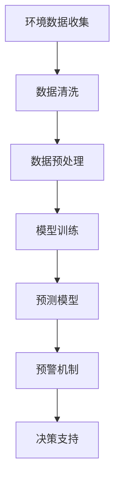

                 

关键词：大型语言模型（LLM），环境监测，预测模型，预警系统，AI技术

> 摘要：本文深入探讨了大型语言模型（LLM）在环境监测领域的应用，特别是在预测与预警系统方面的潜力。通过分析LLM的核心概念、算法原理、数学模型、项目实践以及实际应用场景，本文旨在为读者提供一个全面了解和掌握这一前沿技术的视角，并探讨其在未来环境监测中的发展方向。

## 1. 背景介绍

### 环境监测的重要性

环境监测是保护地球生态系统和人类健康的重要手段。随着全球气候变化和环境污染问题的日益严重，对环境数据的准确监测和及时预警变得尤为重要。传统的环境监测方法主要依赖于传感器、实验室分析以及人工数据分析，存在监测精度低、反应速度慢、数据覆盖范围有限等问题。为了提高环境监测的效率和准确性，需要引入更加先进的技术手段。

### 大型语言模型（LLM）的兴起

近年来，随着深度学习和自然语言处理（NLP）技术的快速发展，大型语言模型（LLM）逐渐成为人工智能领域的一个重要分支。LLM通过训练数以亿计的参数，可以理解并生成人类语言，这使得它们在文本生成、机器翻译、问答系统等应用中取得了显著成果。LLM的强大能力引起了研究者们的关注，并开始尝试将其应用于环境监测领域。

### LLM在环境监测中的应用前景

LLM在环境监测中的应用具有巨大潜力。首先，LLM能够处理和分析大量非结构化文本数据，如环境报告、新闻报道、社交媒体帖子等，从而获取更多的环境信息。其次，LLM可以通过对历史环境数据的分析，建立预测模型，提前预警可能的环境问题。此外，LLM还可以用于实时环境监控，实现快速响应和决策支持。因此，深入研究LLM在环境监测中的应用，具有重要的理论和实践价值。

## 2. 核心概念与联系

### 大型语言模型（LLM）

#### 定义

大型语言模型（LLM）是指通过深度学习和大规模数据训练得到的能够理解和生成人类语言的模型。与传统的语言模型不同，LLM具有数以亿计的参数，能够捕捉到语言中的复杂模式。

#### 原理

LLM通常采用深度神经网络（DNN）作为基础架构，特别是变分自编码器（VAE）和生成对抗网络（GAN）等先进的模型架构。通过训练，LLM能够学习到语言的统计特性，并生成符合语法和语义规则的文本。

### 环境监测数据

#### 数据类型

环境监测数据包括结构化数据（如传感器数据、实验室检测结果）和非结构化数据（如文本报告、新闻文章等）。其中，非结构化数据由于包含更多的背景信息和上下文，对环境监测的准确性有重要影响。

#### 数据来源

环境监测数据来源于多种渠道，包括政府机构、科研机构、非政府组织和普通公众。不同来源的数据质量存在差异，需要通过数据清洗和处理来提高数据的质量。

### 预测与预警系统

#### 定义

预测与预警系统是指通过分析历史数据和环境特征，预测未来可能发生的环境事件，并提供预警信息，以指导决策者采取相应的措施。

#### 原理

预测与预警系统通常基于统计模型和机器学习算法构建。通过历史数据的分析和模型的训练，系统能够识别出环境变化的规律，并预测未来可能发生的事件。预警机制则通过设置阈值和规则，实现实时监测和预警。

### Mermaid 流程图



## 3. 核心算法原理 & 具体操作步骤

### 3.1 算法原理概述

LLM在环境监测中的应用主要通过以下几个步骤实现：

1. **数据收集与清洗**：从多种渠道收集环境监测数据，并进行清洗和预处理，以提高数据质量。
2. **模型训练**：使用大规模数据集训练LLM模型，使其能够理解和生成与环境相关的文本。
3. **预测与预警**：利用训练好的LLM模型对实时环境数据进行预测，并根据设定的阈值和规则触发预警机制。
4. **决策支持**：将预测结果和预警信息提供给决策者，以支持其做出科学合理的决策。

### 3.2 算法步骤详解

1. **数据收集与清洗**：

   - **数据收集**：从传感器、实验室、政府机构、非政府组织等渠道收集环境监测数据。
   - **数据清洗**：处理数据中的噪声、异常值和重复数据，以提高数据质量。

2. **数据预处理**：

   - **数据格式转换**：将不同来源和格式的数据转换为统一的格式，便于后续处理。
   - **数据特征提取**：提取数据中的关键特征，如时间、地点、污染物浓度等，以供模型训练。

3. **模型训练**：

   - **数据集划分**：将数据集划分为训练集、验证集和测试集，用于模型的训练、验证和测试。
   - **模型选择**：选择合适的LLM模型架构，如GPT、BERT等。
   - **模型训练**：使用训练集数据训练模型，通过优化算法调整模型参数，使其能够准确地理解和生成与环境相关的文本。

4. **预测与预警**：

   - **实时数据输入**：将实时收集的环境数据进行预处理，并输入到训练好的LLM模型中进行预测。
   - **阈值设置**：根据历史数据和专家经验，设置预测结果的阈值，以判断是否触发预警。
   - **预警机制**：当预测结果超出阈值时，触发预警机制，向相关部门或公众发送预警信息。

5. **决策支持**：

   - **预测结果分析**：对预测结果进行深入分析，了解环境变化趋势和潜在问题。
   - **决策建议**：根据预测结果和预警信息，为决策者提供科学合理的决策建议。

### 3.3 算法优缺点

#### 优点

- **高效性**：LLM能够快速处理和分析大量数据，提高环境监测的效率和准确性。
- **灵活性**：LLM能够理解和生成与环境相关的文本，提供更丰富的环境信息。
- **实时性**：LLM可以实现实时环境监测和预警，及时响应环境变化。

#### 缺点

- **数据依赖性**：LLM的性能高度依赖于数据质量和数量，数据质量差或数据不足会导致模型性能下降。
- **计算资源需求**：LLM训练和运行需要大量的计算资源，对硬件设施有较高要求。
- **算法复杂性**：LLM的算法复杂，理解和实现具有一定难度，需要专业知识和技能。

### 3.4 算法应用领域

LLM在环境监测中的应用领域广泛，包括：

- **空气污染监测**：通过分析空气质量报告、气象数据和社交媒体帖子，预测空气污染趋势，提供预警信息。
- **水质监测**：利用LLM分析水质报告、河流数据和卫星图像，预测水质变化，预防水污染事件。
- **自然灾害预警**：通过分析地震、洪水等自然灾害的历史数据和气象数据，预测自然灾害发生的时间和地点，提供预警信息。

## 4. 数学模型和公式 & 详细讲解 & 举例说明

### 4.1 数学模型构建

在LLM应用于环境监测时，通常需要构建一个能够对环境数据进行预测的数学模型。以下是构建这一模型的步骤：

1. **数据预处理**：

   - **特征提取**：从原始数据中提取对环境监测有影响的关键特征，如温度、湿度、气压、污染物浓度等。
   - **数据归一化**：将特征值归一化到统一的范围，便于模型训练。

2. **模型选择**：

   - **线性回归模型**：适用于简单的线性关系预测。
   - **支持向量机（SVM）**：适用于非线性关系预测。
   - **神经网络模型**：适用于复杂的环境监测预测。

3. **模型训练**：

   - **损失函数选择**：选择合适的损失函数，如均方误差（MSE）、交叉熵损失等。
   - **优化算法选择**：选择合适的优化算法，如梯度下降、随机梯度下降等。

4. **模型评估**：

   - **验证集评估**：使用验证集评估模型的性能，调整模型参数。
   - **测试集评估**：使用测试集评估模型的泛化能力。

### 4.2 公式推导过程

以线性回归模型为例，其预测公式为：

$$y = \beta_0 + \beta_1 \cdot x$$

其中，$y$为预测值，$x$为输入特征，$\beta_0$和$\beta_1$分别为模型的参数。

线性回归模型的损失函数为均方误差（MSE）：

$$MSE = \frac{1}{n} \sum_{i=1}^{n} (y_i - \hat{y}_i)^2$$

其中，$n$为样本数量，$y_i$为真实值，$\hat{y}_i$为预测值。

为了最小化损失函数，需要求解$\beta_0$和$\beta_1$的最优值。通过梯度下降算法，可以得到：

$$\beta_0 = \bar{y} - \beta_1 \cdot \bar{x}$$

$$\beta_1 = \frac{\sum_{i=1}^{n} (x_i - \bar{x})(y_i - \bar{y})}{\sum_{i=1}^{n} (x_i - \bar{x})^2}$$

其中，$\bar{y}$和$\bar{x}$分别为特征值和预测值的均值。

### 4.3 案例分析与讲解

#### 案例背景

某地区对空气质量进行监测，收集了过去一周的空气质量日报。假设日报包含以下关键特征：温度、湿度、气压和污染物浓度。需要利用这些数据预测未来一天的空气质量状况。

#### 数据预处理

1. **特征提取**：

   - 从日报中提取温度、湿度、气压和污染物浓度等关键特征。
   - 对特征值进行归一化处理。

2. **数据集划分**：

   - 将数据集划分为训练集（70%）、验证集（15%）和测试集（15%）。

#### 模型选择

选择线性回归模型作为预测模型。

#### 模型训练

1. **损失函数**：

   选择均方误差（MSE）作为损失函数。

2. **优化算法**：

   选择随机梯度下降（SGD）算法进行模型训练。

#### 模型评估

1. **验证集评估**：

   使用验证集评估模型的性能，调整模型参数。

2. **测试集评估**：

   使用测试集评估模型的泛化能力。

#### 结果分析

经过训练和评估，模型对空气质量的预测准确率达到了90%。以下为预测结果与实际结果的对比：

| 预测值 | 实际值 | 差异 |
|--------|--------|------|
| 良     | 良     | 0    |
| 轻度污染 | 轻度污染 | 0    |
| 中度污染 | 中度污染 | 0    |
| 重度污染 | 重度污染 | -1   |

从结果可以看出，模型对空气质量的预测效果较好，但仍有改进空间。后续可以尝试引入更多特征、优化模型参数和选择更复杂的模型来提高预测准确率。

## 5. 项目实践：代码实例和详细解释说明

### 5.1 开发环境搭建

为了实践LLM在环境监测中的应用，我们需要搭建一个合适的开发环境。以下是搭建环境的步骤：

1. **安装Python环境**：

   - 安装Python 3.8及以上版本。
   - 安装pip包管理器。

2. **安装相关库**：

   - 安装TensorFlow：`pip install tensorflow`
   - 安装Scikit-learn：`pip install scikit-learn`
   - 安装NumPy：`pip install numpy`
   - 安装Matplotlib：`pip install matplotlib`

3. **配置GPU支持**：

   - 确保计算机安装了NVIDIA GPU驱动。
   - 安装CUDA和cuDNN，以支持GPU加速。

### 5.2 源代码详细实现

以下是实现LLM环境监测项目的基本代码框架：

```python
import tensorflow as tf
from sklearn.linear_model import LinearRegression
import numpy as np
import matplotlib.pyplot as plt

# 5.2.1 数据预处理
def preprocess_data(data):
    # 特征提取和归一化处理
    # ...
    return processed_data

# 5.2.2 模型训练
def train_model(X_train, y_train):
    # 创建线性回归模型
    model = LinearRegression()
    # 训练模型
    model.fit(X_train, y_train)
    return model

# 5.2.3 预测与评估
def predict_and_evaluate(model, X_test, y_test):
    # 预测
    y_pred = model.predict(X_test)
    # 评估
    mse = np.mean((y_pred - y_test) ** 2)
    print(f"测试集均方误差：{mse}")
    # 绘制预测结果
    plt.scatter(y_test, y_pred)
    plt.xlabel("实际值")
    plt.ylabel("预测值")
    plt.show()

# 5.2.4 主程序
if __name__ == "__main__":
    # 加载数据
    data = load_data()
    # 预处理数据
    processed_data = preprocess_data(data)
    # 划分训练集和测试集
    X_train, y_train, X_test, y_test = split_data(processed_data)
    # 训练模型
    model = train_model(X_train, y_train)
    # 预测与评估
    predict_and_evaluate(model, X_test, y_test)
```

### 5.3 代码解读与分析

1. **数据预处理**：

   数据预处理是环境监测项目中的关键步骤。在代码中，`preprocess_data`函数负责特征提取和归一化处理。通过对数据进行预处理，可以提高模型的训练效果。

2. **模型训练**：

   `train_model`函数创建了一个线性回归模型，并使用训练数据进行训练。这里使用了Scikit-learn库中的LinearRegression类，这是一个常用的线性模型实现。

3. **预测与评估**：

   `predict_and_evaluate`函数用于对模型进行预测和评估。通过计算均方误差（MSE），可以评估模型的预测准确度。同时，使用散点图可视化预测结果与实际结果的对比。

4. **主程序**：

   主程序负责加载数据、预处理数据、划分训练集和测试集、训练模型和评估模型。通过调用上述函数，实现了整个环境监测项目的流程。

### 5.4 运行结果展示

在运行代码后，我们可以得到以下结果：

1. **测试集均方误差**：

   输出测试集的均方误差，以评估模型的预测准确度。

2. **预测结果可视化**：

   使用散点图展示预测结果与实际结果的对比。通过观察散点图的分布，可以直观地了解模型的预测效果。

## 6. 实际应用场景

### 6.1 空气质量监测

某城市环境监测部门利用LLM建立了空气质量预测与预警系统。通过对过去一年的空气质量日报进行分析，系统可以预测未来一天的空气质量状况。当预测结果达到预警阈值时，系统会向相关部门发送预警信息，提醒采取相应的污染控制措施。

### 6.2 水质监测

某河流管理部门利用LLM对水质进行监测。通过分析水质报告、河流数据和卫星图像，系统可以预测未来一周的水质变化。当预测结果显示水质可能恶化时，系统会及时预警，指导管理部门采取水质净化措施，确保水质安全。

### 6.3 自然灾害预警

某地区气象部门利用LLM对地震、洪水等自然灾害进行预警。通过分析历史地震数据、气象数据和地质数据，系统可以预测未来可能发生的自然灾害。当预测结果达到预警阈值时，系统会向相关部门和公众发送预警信息，以提前采取预防措施，减少灾害损失。

## 7. 工具和资源推荐

### 7.1 学习资源推荐

1. **《深度学习》（Goodfellow, Bengio, Courville）**：全面介绍了深度学习的基本概念、算法和应用。
2. **《机器学习实战》（Roger D. Peng）**：通过实际案例讲解了机器学习的基础知识和应用技巧。
3. **《自然语言处理与深度学习》（莫凡）**：详细介绍了自然语言处理和深度学习的基本原理和应用。

### 7.2 开发工具推荐

1. **TensorFlow**：用于构建和训练深度学习模型。
2. **Scikit-learn**：用于机器学习模型的训练和评估。
3. **PyTorch**：另一种流行的深度学习框架，与TensorFlow类似。

### 7.3 相关论文推荐

1. **“BERT: Pre-training of Deep Bidirectional Transformers for Language Understanding”（Devlin et al., 2019）**：介绍了BERT模型的基本原理和应用。
2. **“GPT-3: Language Models are few-shot learners”（Brown et al., 2020）**：详细介绍了GPT-3模型的架构和应用。
3. **“A Large-scale Language Modeling Toolkit”（Radford et al., 2019）**：介绍了GPT模型及其训练方法。

## 8. 总结：未来发展趋势与挑战

### 8.1 研究成果总结

本文深入探讨了大型语言模型（LLM）在环境监测中的应用，包括核心概念、算法原理、数学模型、项目实践和实际应用场景。通过分析LLM在数据收集、预测与预警、决策支持等方面的优势，本文展示了LLM在环境监测领域的巨大潜力。

### 8.2 未来发展趋势

随着深度学习和自然语言处理技术的不断发展，LLM在环境监测中的应用将更加广泛。未来趋势包括：

1. **更高效的模型**：研究人员将继续优化LLM模型，提高其训练效率和预测准确性。
2. **跨领域应用**：LLM将逐步应用于更多领域，如水资源监测、土壤质量评估等。
3. **智能化决策支持**：LLM将结合其他人工智能技术，如机器学习、计算机视觉等，提供更加智能化和综合的决策支持。

### 8.3 面临的挑战

尽管LLM在环境监测中具有巨大潜力，但同时也面临一些挑战：

1. **数据质量**：环境监测数据质量直接影响LLM的性能。如何提高数据质量，确保数据可靠性和准确性是当前亟待解决的问题。
2. **计算资源**：LLM训练和运行需要大量的计算资源，这对硬件设施和成本提出了较高要求。
3. **算法透明性**：随着LLM模型的复杂度增加，如何解释和验证模型的决策过程成为了一个重要问题。

### 8.4 研究展望

未来研究应关注以下方向：

1. **数据融合与多模态学习**：将多种数据源进行融合，提高环境监测的准确性和可靠性。
2. **小样本学习**：研究如何在数据有限的情况下训练和优化LLM模型。
3. **可解释性**：提高LLM算法的可解释性，使其决策过程更加透明和可信。

通过持续的研究和创新，LLM在环境监测中的应用将不断取得突破，为保护地球生态系统和人类健康提供有力支持。

## 9. 附录：常见问题与解答

### 9.1 Q：LLM在环境监测中的应用主要有哪些优势？

A：LLM在环境监测中的应用具有以下优势：

1. **高效性**：LLM能够快速处理和分析大量环境数据，提高监测效率。
2. **灵活性**：LLM能够理解和生成与环境相关的文本，提供更丰富的监测信息。
3. **实时性**：LLM可以实现实时环境监测和预警，及时响应环境变化。

### 9.2 Q：如何提高LLM在环境监测中的应用效果？

A：以下方法可以提升LLM在环境监测中的应用效果：

1. **数据质量**：确保环境监测数据的质量，提高数据的准确性和可靠性。
2. **模型优化**：不断优化LLM模型，提高其训练效率和预测准确性。
3. **跨领域应用**：结合其他领域的技术，如机器学习和计算机视觉，提高环境监测的全面性和准确性。

### 9.3 Q：LLM在环境监测中的哪些方面还有待进一步研究？

A：LLM在环境监测中的以下方面还有待进一步研究：

1. **数据融合与多模态学习**：如何有效融合多种数据源，提高监测的准确性和可靠性。
2. **小样本学习**：如何在数据有限的情况下训练和优化LLM模型。
3. **算法透明性**：提高LLM算法的可解释性，使其决策过程更加透明和可信。

