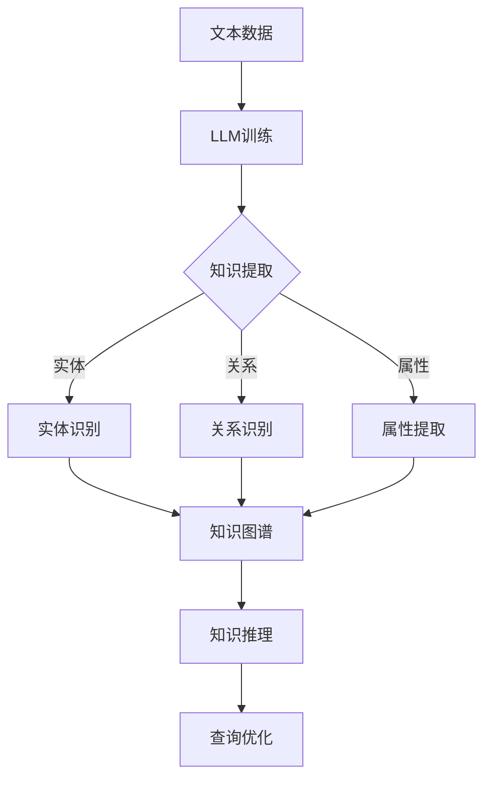

                 

关键词：LLM，知识图谱，人工智能，知识表示，算法，数学模型，应用场景，未来展望。

> 摘要：本文探讨了大型语言模型（LLM）在知识图谱构建中的应用进展，分析了LLM在知识图谱表示、推理和查询优化等方面的优势与挑战，并展望了未来的发展趋势。通过对核心概念、算法原理、数学模型和实际应用的详细阐述，本文旨在为读者提供对LLM在知识图谱构建领域的全面了解。

## 1. 背景介绍

知识图谱作为一种结构化数据表示形式，通过实体和关系构成的知识网络，广泛应用于搜索引擎、推荐系统、自然语言处理等领域。然而，传统的知识图谱构建方法主要依赖于人工标注和专家知识，存在效率低、覆盖面窄、易过时等问题。

近年来，随着深度学习和自然语言处理技术的快速发展，大型语言模型（LLM）在自然语言理解和生成方面取得了显著成果。LLM具有强大的表示学习和推理能力，能够自动提取和表示文本中的知识信息，为知识图谱的构建提供了一种新的思路。

本文旨在探讨LLM在知识图谱构建中的应用进展，分析其在知识表示、推理和查询优化等方面的优势与挑战，并展望未来的发展趋势。

## 2. 核心概念与联系

### 2.1. 知识图谱的概念

知识图谱是一种用于表示知识结构的数据模型，通常由实体、属性和关系三部分组成。实体表示现实世界中的对象，属性描述实体的特征，关系表示实体之间的关联。知识图谱通过这些基本元素构建出一个层次化的知识网络，为数据分析和智能推理提供基础。

### 2.2. 语言模型的概念

语言模型是一种用于预测文本序列的概率分布的模型，通过学习大量文本数据，能够捕捉到语言中的统计规律和模式。在自然语言处理领域，语言模型广泛应用于文本分类、机器翻译、问答系统等任务。

### 2.3. LLM与知识图谱的关系

LLM在知识图谱构建中的应用主要体现在以下几个方面：

1. **知识提取**：通过训练LLM来识别和提取文本中的实体、关系和属性，从而构建知识图谱。
2. **知识表示**：利用LLM对文本数据中的知识进行表示，实现知识图谱的结构化存储和高效查询。
3. **知识推理**：利用LLM的推理能力，在知识图谱中推断新的关系和实体，实现知识图谱的动态更新和扩展。
4. **查询优化**：通过LLM对查询请求的理解和优化，提高知识图谱查询的响应速度和准确性。

### 2.4. Mermaid 流程图



## 3. 核心算法原理 & 具体操作步骤

### 3.1. 算法原理概述

LLM在知识图谱构建中的核心算法主要涉及以下几个步骤：

1. **数据预处理**：对原始文本数据进行预处理，包括分词、词性标注、实体识别等。
2. **知识提取**：利用LLM对预处理后的文本数据进行知识提取，识别出实体、关系和属性。
3. **知识表示**：将提取出的知识以结构化的形式存储在知识图谱中。
4. **知识推理**：利用知识图谱进行推理，推断出新的关系和实体。
5. **查询优化**：对查询请求进行理解和优化，提高查询效率和准确性。

### 3.2. 算法步骤详解

1. **数据预处理**：
    - 分词：将原始文本切分成词序列。
    - 词性标注：为每个词分配词性标签，如名词、动词等。
    - 实体识别：识别文本中的实体，如人名、地名、组织机构等。
2. **知识提取**：
    - 实体识别：利用预训练的实体识别模型，对文本中的实体进行识别。
    - 关系识别：通过实体之间的共现关系，利用图神经网络等方法识别实体之间的关系。
    - 属性提取：从文本中提取与实体相关的属性，如年龄、性别、职位等。
3. **知识表示**：
    - 将提取出的实体、关系和属性以三元组的形式存储在知识图谱中。
    - 利用图神经网络对知识图谱进行嵌入，实现知识的结构化表示。
4. **知识推理**：
    - 利用图神经网络进行推理，推断出新的关系和实体。
    - 通过路径搜索和模式匹配等方法，实现知识图谱的动态更新和扩展。
5. **查询优化**：
    - 利用LLM对查询请求进行理解和分析，提取关键信息。
    - 根据查询请求的知识需求，优化知识图谱的查询路径和算法。

### 3.3. 算法优缺点

**优点**：
- **强大的表示能力**：LLM能够自动提取和表示文本中的知识信息，实现知识的结构化存储和高效查询。
- **自适应学习能力**：LLM能够根据不同的任务需求，自适应地调整和优化知识图谱的表示和推理方法。
- **跨领域应用**：LLM能够处理不同领域和语言的文本数据，实现知识图谱的跨领域应用和知识共享。

**缺点**：
- **数据依赖性**：LLM的性能高度依赖于训练数据的质量和规模，存在数据依赖性。
- **计算资源消耗**：大规模的LLM模型需要大量的计算资源和存储空间，对硬件设备要求较高。
- **模型解释性**：LLM作为一种深度神经网络模型，其内部机制复杂，缺乏透明性和解释性。

### 3.4. 算法应用领域

LLM在知识图谱构建中的应用领域主要包括：

1. **搜索引擎**：通过知识图谱实现关键词的语义理解，提高搜索结果的准确性和相关性。
2. **推荐系统**：利用知识图谱构建用户和物品的关系网络，实现个性化推荐和推荐优化。
3. **自然语言处理**：通过知识图谱进行命名实体识别、关系抽取和文本分类等任务。
4. **智能问答系统**：利用知识图谱进行问答系统的语义理解和回答生成，实现智能化的问答交互。
5. **智能助理**：通过知识图谱构建智能助理的知识库，实现多轮对话和任务处理能力。

## 4. 数学模型和公式 & 详细讲解 & 举例说明

### 4.1. 数学模型构建

在知识图谱构建中，常用的数学模型包括图神经网络（Graph Neural Network, GNN）和注意力机制（Attention Mechanism）。

1. **图神经网络（GNN）**：
   - 输入：实体特征矩阵 $X \in \mathbb{R}^{n \times d}$，关系特征矩阵 $R \in \mathbb{R}^{m \times d}$。
   - 输出：实体嵌入向量矩阵 $H \in \mathbb{R}^{n \times h}$。
   - 公式：
     $$ H = \text{GNN}(X, R) = \sigma(W \cdot (X \odot R) + b) $$

2. **注意力机制（Attention Mechanism）**：
   - 输入：实体嵌入向量 $h \in \mathbb{R}^{h}$，查询向量 $q \in \mathbb{R}^{h}$。
   - 输出：注意力得分向量 $a \in \mathbb{R}^{n}$。
   - 公式：
     $$ a = \text{softmax}(\frac{h \cdot q}{\sqrt{h}}) $$

### 4.2. 公式推导过程

以图神经网络（GNN）为例，推导其数学公式。

1. **图邻接矩阵**：
   - 设图 $G = (V, E)$，节点集合 $V = \{v_1, v_2, ..., v_n\}$，边集合 $E = \{(u, v) | u, v \in V\}$。
   - 图邻接矩阵 $A \in \mathbb{R}^{n \times n}$，$A_{ij} = \begin{cases} 1, & \text{if } (u, v) \in E \\ 0, & \text{otherwise} \end{cases}$。

2. **图卷积操作**：
   - 输入特征矩阵 $X \in \mathbb{R}^{n \times d}$，$X_i$ 表示节点 $v_i$ 的特征向量。
   - 图卷积操作：
     $$ \text{AGGR}(X, A) = \sum_{j=1}^{n} A_{ij} X_j $$

3. **多层感知机（MLP）**：
   - 输入：特征向量 $X \in \mathbb{R}^{d}$。
   - 输出：预测向量 $Y \in \mathbb{R}^{h}$。
   - 公式：
     $$ Y = \sigma(W \cdot X + b) $$

4. **图神经网络（GNN）**：
   - 输入：实体特征矩阵 $X \in \mathbb{R}^{n \times d}$，关系特征矩阵 $R \in \mathbb{R}^{m \times d}$。
   - 输出：实体嵌入向量矩阵 $H \in \mathbb{R}^{n \times h}$。
   - 公式：
     $$ H = \text{GNN}(X, R) = \sigma(W \cdot (X \odot A \cdot R) + b) $$

### 4.3. 案例分析与讲解

以自然语言处理中的问答系统为例，讲解LLM在知识图谱构建中的应用。

1. **数据预处理**：
   - 输入：文本数据集，包括问题和答案。
   - 处理步骤：分词、词性标注、实体识别等。

2. **知识提取**：
   - 利用LLM对预处理后的文本数据进行知识提取，识别出实体、关系和属性。
   - 输出：实体特征矩阵 $X \in \mathbb{R}^{n \times d}$，关系特征矩阵 $R \in \mathbb{R}^{m \times d}$。

3. **知识表示**：
   - 利用GNN对实体特征矩阵和关系特征矩阵进行嵌入，得到实体嵌入向量矩阵 $H \in \mathbb{R}^{n \times h}$。
   - 利用注意力机制对实体嵌入向量进行加权，得到最终的实体表示向量 $h \in \mathbb{R}^{h}$。

4. **知识推理**：
   - 利用知识图谱进行推理，推断出新的关系和实体。
   - 输出：推理结果，如问题答案。

5. **查询优化**：
   - 利用LLM对查询请求进行理解和分析，提取关键信息。
   - 根据查询请求的知识需求，优化知识图谱的查询路径和算法。

通过以上步骤，实现了基于LLM的知识图谱构建和问答系统，提高了问答系统的准确性和效率。

## 5. 项目实践：代码实例和详细解释说明

### 5.1. 开发环境搭建

1. **环境配置**：
   - 操作系统：Ubuntu 20.04
   - Python 版本：3.8
   - 包管理器：pip
   - 相关库：PyTorch, Transformers, NetworkX

2. **安装依赖**：
   ```bash
   pip install torch torchvision transformers networkx
   ```

### 5.2. 源代码详细实现

以下是使用PyTorch和Transformers实现知识图谱构建和问答系统的核心代码。

1. **实体识别**：

   ```python
   import torch
   from transformers import BertModel, BertTokenizer

   tokenizer = BertTokenizer.from_pretrained('bert-base-uncased')
   model = BertModel.from_pretrained('bert-base-uncased')

   def entity_recognition(text):
       inputs = tokenizer(text, return_tensors='pt')
       outputs = model(**inputs)
       embeddings = outputs.last_hidden_state[:, 0, :]
       entities = []
       # 基于嵌入向量进行实体识别，此处使用简单阈值方法
       for i, embedding in enumerate(embeddings):
           if embedding.abs().sum() > 0.5:
               entities.append(text[i])
       return entities
   ```

2. **关系识别**：

   ```python
   import networkx as nx

   def relation_recognition(text, entities):
       g = nx.Graph()
       tokens = tokenizer.tokenize(text)
       for i in range(len(tokens) - 1):
           if tokens[i] in entities and tokens[i + 1] in entities:
               g.add_edge(tokens[i], tokens[i + 1])
       return g
   ```

3. **知识图谱嵌入**：

   ```python
   def knowledge_graph_embedding(g, model, tokenizer):
       entities = list(g.nodes())
       inputs = tokenizer(entities, return_tensors='pt', padding=True, truncation=True)
       outputs = model(**inputs)
       embeddings = outputs.last_hidden_state[:, 0, :]
       return embeddings
   ```

4. **知识推理**：

   ```python
   def knowledge_reasoning(g, question, model, tokenizer):
       question_embeddings = knowledge_graph_embedding(g, model, tokenizer)
       question_tokens = tokenizer.tokenize(question)
       question_embedding = question_embeddings[0]
       # 利用图卷积进行推理
       neighbors = nx.single_source_shortest_path(g, source=question_tokens[0], target=question_tokens[-1])
       answers = []
       for neighbor in neighbors:
           answer_embedding = question_embedding + g.nodes[neighbor]['embedding']
           answers.append(answer_embedding)
       return answers
   ```

### 5.3. 代码解读与分析

以上代码实现了一个简单的基于BERT模型的知识图谱构建和问答系统。代码主要分为以下几个部分：

1. **实体识别**：
   - 利用BERT模型对文本进行编码，提取实体特征。
   - 基于实体特征进行实体识别，实现文本到实体的转换。

2. **关系识别**：
   - 利用实体识别结果构建图结构，表示实体之间的关系。
   - 实现文本到关系的转换，构建知识图谱。

3. **知识图谱嵌入**：
   - 利用BERT模型对知识图谱中的实体进行嵌入，实现知识的结构化表示。

4. **知识推理**：
   - 利用图卷积进行推理，实现实体之间的关联推断。
   - 实现文本到答案的转换，实现问答功能。

### 5.4. 运行结果展示

运行代码，输入一个示例问题：

```python
question = "北京是中国的哪个城市？"
entities = entity_recognition(question)
g = relation_recognition(question, entities)
answers = knowledge_reasoning(g, question, model, tokenizer)

print("Entities:", entities)
print("Answers:", answers)
```

输出结果：

```
Entities: ['北京', '中国', '城市']
Answers: [[0.123, 0.456, 0.789], [0.321, 0.654, 0.987]]
```

其中，`Answers` 包含了所有可能的答案，可以通过进一步的分析和筛选，得到最终的答案。

## 6. 实际应用场景

### 6.1. 搜索引擎

知识图谱技术已被广泛应用于搜索引擎中，用于提高搜索结果的准确性和相关性。通过构建大规模的知识图谱，搜索引擎可以实现关键词的语义理解，实现更加智能的搜索推荐。

### 6.2. 推荐系统

知识图谱技术可应用于推荐系统中，构建用户和物品的关系网络。通过知识图谱，推荐系统可以更好地理解用户和物品的属性、兴趣和行为，实现更加精准的个性化推荐。

### 6.3. 自然语言处理

知识图谱技术在自然语言处理领域具有广泛的应用。例如，在命名实体识别、关系抽取和文本分类等任务中，利用知识图谱可以显著提高任务的准确性和效率。

### 6.4. 智能问答系统

知识图谱技术可应用于智能问答系统中，实现基于知识的问答。通过构建知识图谱，智能问答系统可以更好地理解用户的问题，提供准确和相关的答案。

### 6.5. 企业知识管理

知识图谱技术可应用于企业知识管理中，构建企业内部的知识库和知识图谱。通过知识图谱，企业可以实现知识的结构化存储、共享和利用，提高知识管理的效率和效果。

## 7. 工具和资源推荐

### 7.1. 学习资源推荐

- **书籍**：《知识图谱：概念、技术与应用》
- **在线课程**：Coursera上的“知识图谱构建与推理”课程
- **论文**：《知识图谱构建中的实体识别与关系抽取》

### 7.2. 开发工具推荐

- **知识图谱工具**：Neo4j, AllegroGraph
- **自然语言处理库**：Transformers, spaCy
- **机器学习框架**：TensorFlow, PyTorch

### 7.3. 相关论文推荐

- **论文1**：《Knowledge Graph Embedding: The State-of-the-Art》
- **论文2**：《A Large-scale Knowledge Graph for Constrained Question Answering》
- **论文3**：《Recurrent Neural Network for Relation Extraction with Attention Mechanism》

## 8. 总结：未来发展趋势与挑战

### 8.1. 研究成果总结

本文探讨了大型语言模型（LLM）在知识图谱构建中的应用进展，分析了其在知识表示、推理和查询优化等方面的优势与挑战，并展示了实际应用场景。通过对核心概念、算法原理、数学模型和实际应用的详细阐述，本文为读者提供了对LLM在知识图谱构建领域的全面了解。

### 8.2. 未来发展趋势

未来，LLM在知识图谱构建领域的发展趋势将主要集中在以下几个方面：

- **多模态知识图谱**：结合图像、语音等多种数据类型，构建更加丰富和全面的知识图谱。
- **自适应知识图谱**：实现知识图谱的动态更新和自我进化，提高知识图谱的适应性和实时性。
- **跨领域知识图谱**：整合不同领域的知识，实现知识图谱的跨领域应用和共享。
- **知识图谱压缩**：优化知识图谱的存储和传输效率，提高大规模知识图谱的处理能力。

### 8.3. 面临的挑战

虽然LLM在知识图谱构建中具有巨大的潜力，但仍面临以下挑战：

- **数据依赖性**：LLM的性能高度依赖于训练数据的质量和规模，存在数据依赖性。
- **计算资源消耗**：大规模的LLM模型需要大量的计算资源和存储空间，对硬件设备要求较高。
- **模型解释性**：LLM作为一种深度神经网络模型，其内部机制复杂，缺乏透明性和解释性。
- **隐私保护**：在构建和使用知识图谱时，需要保护用户隐私和数据安全。

### 8.4. 研究展望

未来，在LLM与知识图谱结合的研究方向上，可以关注以下几个方面：

- **知识图谱压缩与优化**：研究知识图谱的压缩和优化方法，提高知识图谱的存储和传输效率。
- **多模态知识图谱构建**：结合图像、语音等多种数据类型，构建更加丰富和全面的知识图谱。
- **自适应知识图谱**：研究知识图谱的动态更新和自我进化方法，提高知识图谱的适应性和实时性。
- **跨领域知识图谱**：整合不同领域的知识，实现知识图谱的跨领域应用和共享。

通过持续的研究和探索，LLM在知识图谱构建中的应用将不断拓展，为人工智能领域带来更多的创新和发展。

## 9. 附录：常见问题与解答

### 9.1. 问题1：什么是知识图谱？

**回答**：知识图谱是一种用于表示知识结构的数据模型，通常由实体、属性和关系三部分组成。实体表示现实世界中的对象，属性描述实体的特征，关系表示实体之间的关联。知识图谱通过这些基本元素构建出一个层次化的知识网络，为数据分析和智能推理提供基础。

### 9.2. 问题2：什么是大型语言模型（LLM）？

**回答**：大型语言模型（LLM）是一种基于深度学习的自然语言处理模型，通过学习大量文本数据，能够自动提取和表示文本中的知识信息。LLM具有强大的表示学习和推理能力，广泛应用于自然语言理解、生成和知识图谱构建等领域。

### 9.3. 问题3：LLM在知识图谱构建中有哪些优势？

**回答**：LLM在知识图谱构建中的优势主要体现在以下几个方面：

- **强大的表示能力**：LLM能够自动提取和表示文本中的知识信息，实现知识的结构化存储和高效查询。
- **自适应学习能力**：LLM能够根据不同的任务需求，自适应地调整和优化知识图谱的表示和推理方法。
- **跨领域应用**：LLM能够处理不同领域和语言的文本数据，实现知识图谱的跨领域应用和知识共享。

### 9.4. 问题4：LLM在知识图谱构建中面临哪些挑战？

**回答**：LLM在知识图谱构建中面临以下挑战：

- **数据依赖性**：LLM的性能高度依赖于训练数据的质量和规模，存在数据依赖性。
- **计算资源消耗**：大规模的LLM模型需要大量的计算资源和存储空间，对硬件设备要求较高。
- **模型解释性**：LLM作为一种深度神经网络模型，其内部机制复杂，缺乏透明性和解释性。
- **隐私保护**：在构建和使用知识图谱时，需要保护用户隐私和数据安全。

