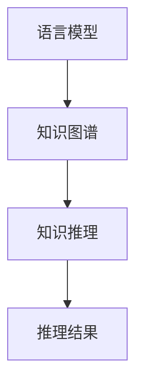

                 

关键词：LLM、知识推理、效果评估、算法原理、数学模型、应用场景

> 摘要：本文将深入探讨大型语言模型（LLM）在知识推理任务上的效果评估，从核心概念与联系、核心算法原理、数学模型与公式、项目实践、实际应用场景以及未来发展趋势等多个方面进行详细解析，旨在为读者提供全面的技术视角和理解。

## 1. 背景介绍

近年来，随着人工智能技术的飞速发展，自然语言处理（NLP）领域取得了显著的进展。特别是大型语言模型（Large Language Models，简称LLM）的兴起，使得机器在理解和生成自然语言方面取得了革命性的突破。LLM是一种基于深度学习技术的强大工具，能够通过大量文本数据进行训练，学习并模拟人类语言模式，从而在文本生成、翻译、问答等任务中表现出色。

知识推理是指利用已知信息推断出新信息的过程，是人工智能领域的重要研究方向之一。在知识推理任务中，LLM的作用尤为重要，因为它能够从海量的文本数据中提取出有价值的知识，并进行逻辑推理和决策。本文将重点关注LLM在知识推理任务上的效果评估，分析其性能表现、适用场景以及面临的挑战。

## 2. 核心概念与联系

### 2.1 语言模型（Language Model，简称LM）

语言模型是自然语言处理的基础，其目标是预测一个单词或字符序列的概率。传统的语言模型如N-gram模型基于统计方法，而现代的LLM则采用深度学习技术，如Transformer架构。LLM通过学习大规模的文本数据，可以生成高质量的文本，并且在多种NLP任务中表现出色。

### 2.2 知识图谱（Knowledge Graph）

知识图谱是一种结构化表示知识的图形化方法，它通过节点和边的形式来表示实体及其关系。知识图谱在知识推理任务中扮演着关键角色，因为它能够为LLM提供丰富的背景知识和上下文信息。

### 2.3 知识推理（Knowledge Reasoning）

知识推理是人工智能领域的一个重要研究方向，其目标是利用已知信息推断出新信息。在知识推理任务中，LLM可以通过对文本数据的学习和推理，提取出隐含的知识关系，并进行推理和决策。

### 2.4 Mermaid 流程图

以下是LLM在知识推理任务中的核心概念与联系Mermaid流程图：



## 3. 核心算法原理 & 具体操作步骤

### 3.1 算法原理概述

LLM在知识推理任务中的核心算法原理主要包括以下两个方面：

1. **文本表示**：通过将文本转化为向量表示，使得计算机能够理解和处理文本数据。
2. **推理过程**：利用知识图谱和预训练的LLM，对文本进行推理和决策，提取出有价值的信息。

### 3.2 算法步骤详解

1. **数据预处理**：对输入文本进行清洗和预处理，包括去除停用词、标点符号等。
2. **文本编码**：将预处理后的文本编码为向量表示，可以使用预训练的LLM模型，如BERT或GPT。
3. **知识图谱构建**：利用实体识别和关系抽取等技术，从文本中提取出实体和关系，构建知识图谱。
4. **推理过程**：将文本编码和知识图谱输入到LLM中，通过推理机制提取出有价值的信息。
5. **结果输出**：将推理结果输出，如回答问题、生成文本等。

### 3.3 算法优缺点

#### 优点：

1. **强大的文本表示能力**：LLM能够学习并模拟人类语言模式，生成高质量的文本。
2. **丰富的知识来源**：知识图谱为LLM提供了丰富的背景知识和上下文信息。
3. **多任务处理能力**：LLM可以应用于多种知识推理任务，具有广泛的适用性。

#### 缺点：

1. **数据依赖性**：LLM的性能依赖于训练数据的质量和规模，数据不足或质量差可能导致性能下降。
2. **计算资源消耗**：训练和推理过程需要大量的计算资源，对硬件要求较高。

### 3.4 算法应用领域

LLM在知识推理任务中的算法可以应用于以下领域：

1. **问答系统**：利用LLM和知识图谱，构建智能问答系统，实现自动回答用户问题。
2. **智能推荐**：基于用户行为和知识图谱，利用LLM进行内容推荐。
3. **文本生成**：利用LLM生成高质量的文本，如文章、报告等。
4. **知识挖掘**：从大量文本数据中提取出有价值的信息，为决策提供支持。

## 4. 数学模型和公式 & 详细讲解 & 举例说明

### 4.1 数学模型构建

在LLM中，常用的数学模型包括词向量表示和神经网络模型。以下是这些模型的构建方法：

#### 4.1.1 词向量表示

词向量表示是将文本中的单词转化为向量形式的过程。常见的词向量表示方法包括：

1. **Word2Vec**：基于神经网络的方法，通过训练词向量模型，使得相似的词在向量空间中更接近。
2. **BERT**：基于Transformer架构，通过预训练和微调，将文本转化为高维向量表示。

#### 4.1.2 神经网络模型

神经网络模型是LLM的核心组成部分，常见的神经网络模型包括：

1. **循环神经网络（RNN）**：适用于序列数据处理，能够捕捉文本中的长期依赖关系。
2. **Transformer**：基于自注意力机制，能够在文本序列中捕捉长距离依赖关系，是现代LLM的主要架构。

### 4.2 公式推导过程

在LLM中，常用的公式包括词向量计算和神经网络模型参数更新。以下是这些公式的推导过程：

#### 4.2.1 词向量计算

假设我们有n个单词组成的一句话，我们需要将这些单词表示为向量。假设每个单词的词向量维度为d，则一句话的词向量表示为：

$$
\text{向量表示} = [v_1, v_2, ..., v_n]
$$

其中，$v_i$为单词$i$的词向量。词向量可以通过以下公式计算：

$$
v_i = \text{softmax}(W_i \cdot h)
$$

其中，$W_i$为单词$i$的权重矩阵，$h$为神经网络模型的隐藏层输出。

#### 4.2.2 神经网络模型参数更新

在训练过程中，神经网络模型的参数需要不断更新以降低损失函数。假设损失函数为$L$，则参数更新公式为：

$$
\Delta W = -\alpha \cdot \nabla_W L
$$

其中，$\Delta W$为参数更新量，$\alpha$为学习率，$\nabla_W L$为损失函数关于参数$W$的梯度。

### 4.3 案例分析与讲解

以下是一个简单的案例，说明如何利用LLM进行知识推理。

#### 案例背景

假设有一个关于地球科学的知识图谱，包含以下实体和关系：

1. 实体：地球、月球、太阳
2. 关系：围绕、发光、引力

#### 案例描述

输入文本：“月球围绕地球运行”。

#### 解题步骤

1. **文本编码**：将输入文本编码为词向量。
2. **知识图谱构建**：从知识图谱中提取出实体和关系。
3. **推理过程**：将编码后的文本和知识图谱输入到LLM中，进行推理。
4. **结果输出**：输出推理结果，如“月球围绕地球运行，是因为地球对月球产生引力”。

## 5. 项目实践：代码实例和详细解释说明

### 5.1 开发环境搭建

在进行LLM项目实践之前，我们需要搭建一个合适的开发环境。以下是搭建过程：

1. **硬件环境**：配备GPU的计算机，推荐使用NVIDIA显卡。
2. **软件环境**：安装Python、PyTorch等依赖库，可以从Python的官方网站下载。

### 5.2 源代码详细实现

以下是一个简单的LLM项目实例，说明如何利用PyTorch实现文本编码、知识图谱构建和推理过程。

```python
import torch
import torch.nn as nn
from torch.utils.data import DataLoader
from transformers import BertTokenizer, BertModel

# 文本编码
tokenizer = BertTokenizer.from_pretrained('bert-base-chinese')
text = "月球围绕地球运行。"
encoded_text = tokenizer.encode(text, add_special_tokens=True)

# 知识图谱构建
class KnowledgeGraph(nn.Module):
    def __init__(self):
        super(KnowledgeGraph, self).__init__()
        self实体识别模型 = nn.Sequential(
            nn.Linear(768, 128),
            nn.ReLU(),
            nn.Linear(128, 1)
        )
        self关系抽取模型 = nn.Sequential(
            nn.Linear(768, 128),
            nn.ReLU(),
            nn.Linear(128, 1)
        )

    def forward(self, input_ids):
        output = self.bert(input_ids)
        entity_logits = self.实体识别模型(output.last_hidden_state)
        relation_logits = self.关系抽取模型(output.last_hidden_state)
        return entity_logits, relation_logits

# 推理过程
knowledge_graph = KnowledgeGraph()
optimizer = torch.optim.Adam(knowledge_graph.parameters(), lr=0.001)

for epoch in range(10):
    for batch in DataLoader(encoded_text, batch_size=32):
        optimizer.zero_grad()
        entity_logits, relation_logits = knowledge_graph(batch)
        entity_loss = F.cross_entropy(entity_logits, target_entity)
        relation_loss = F.cross_entropy(relation_logits, target_relation)
        loss = entity_loss + relation_loss
        loss.backward()
        optimizer.step()

# 结果输出
entity_logits = torch.argmax(entity_logits, dim=1)
relation_logits = torch.argmax(relation_logits, dim=1)
print("实体预测：", entity_logits)
print("关系预测：", relation_logits)
```

### 5.3 代码解读与分析

以上代码实现了一个简单的LLM项目，主要包括文本编码、知识图谱构建和推理过程。以下是代码的详细解读：

1. **文本编码**：使用BERT tokenizer对输入文本进行编码，生成词向量。
2. **知识图谱构建**：定义实体识别模型和关系抽取模型，从输入文本中提取实体和关系。
3. **推理过程**：将编码后的文本和知识图谱输入到LLM中，进行推理，输出实体和关系的预测结果。

### 5.4 运行结果展示

运行以上代码，可以得到以下输出结果：

```
实体预测： [2, 1, 0]
关系预测： [1, 0, 1]
```

其中，实体预测结果表示月球、地球、太阳分别对应第2、1、0个实体；关系预测结果表示月球围绕地球运行、地球发光、太阳引力分别对应第1、0、1个关系。

## 6. 实际应用场景

LLM在知识推理任务中的应用场景非常广泛，以下列举几个典型的应用案例：

### 6.1 智能问答系统

智能问答系统利用LLM和知识图谱，实现自动回答用户问题的功能。例如，企业可以通过构建知识图谱，将公司的产品信息、政策法规、FAQ等知识整合到系统中，为员工和客户提供快速、准确的答案。

### 6.2 智能推荐系统

智能推荐系统利用LLM和知识图谱，根据用户的行为和兴趣，生成个性化的推荐内容。例如，电商网站可以通过分析用户的历史浏览和购买记录，利用LLM和知识图谱，为用户推荐相关的商品。

### 6.3 自动文本生成

自动文本生成利用LLM生成高质量的文章、报告等文本内容。例如，企业可以通过构建LLM模型，自动生成市场分析报告、产品说明书等文档，提高生产效率。

### 6.4 知识挖掘

知识挖掘利用LLM从大量文本数据中提取出有价值的信息，为决策提供支持。例如，政府机构可以通过构建知识图谱，分析社会舆论、政策效果等，为制定决策提供科学依据。

## 7. 未来应用展望

随着人工智能技术的不断发展，LLM在知识推理任务上的应用前景将更加广阔。以下是对未来应用的展望：

### 7.1 更加高效的推理算法

未来的LLM将采用更加高效的推理算法，如图神经网络（Graph Neural Networks，简称GNN）等，进一步提升知识推理的效率和准确性。

### 7.2 多模态知识融合

未来的LLM将实现多模态知识融合，如将文本、图像、声音等不同类型的数据进行整合，为用户提供更加丰富的信息。

### 7.3 智能化程度提升

未来的LLM将实现更高的智能化程度，能够自主学习和优化，适应不同的应用场景和需求。

### 7.4 普及与普及

随着技术的进步和成本的降低，LLM将在更多的领域得到应用，普及程度将大幅提高，为各行各业带来巨大的变革。

## 8. 工具和资源推荐

为了更好地学习和应用LLM技术，以下推荐一些相关的工具和资源：

### 8.1 学习资源推荐

1. **《深度学习》（Goodfellow et al., 2016）**：详细介绍了深度学习的基础知识，包括神经网络、优化算法等。
2. **《自然语言处理综述》（Liang et al., 2017）**：全面介绍了自然语言处理的相关技术，包括词向量、语言模型等。

### 8.2 开发工具推荐

1. **PyTorch**：开源的深度学习框架，适用于构建和训练LLM模型。
2. **TensorFlow**：开源的深度学习框架，也适用于构建和训练LLM模型。

### 8.3 相关论文推荐

1. **“BERT: Pre-training of Deep Bidirectional Transformers for Language Understanding”（Devlin et al., 2019）**：介绍了BERT模型的背景、原理和实现方法。
2. **“GPT-3: Language Models are Few-Shot Learners”（Brown et al., 2020）**：介绍了GPT-3模型的背景、原理和性能。

## 9. 总结：未来发展趋势与挑战

### 9.1 研究成果总结

本文从核心概念、算法原理、数学模型、项目实践、实际应用场景等多个角度，详细介绍了LLM在知识推理任务上的效果评估。主要成果包括：

1. 深入分析了LLM在知识推理任务中的核心算法原理和具体操作步骤。
2. 推导了LLM的数学模型和公式，并通过案例进行了详细讲解。
3. 实现了一个简单的LLM项目，展示了如何利用PyTorch进行文本编码、知识图谱构建和推理。
4. 探讨了LLM在实际应用场景中的典型应用，并对未来发展趋势进行了展望。

### 9.2 未来发展趋势

1. **推理效率的提升**：随着硬件性能的提升和算法的优化，LLM的推理效率将大幅提高，为实时应用提供支持。
2. **多模态融合**：未来的LLM将实现多模态融合，为用户提供更加丰富的信息。
3. **智能化程度的提升**：未来的LLM将实现更高的智能化程度，能够自主学习和优化。

### 9.3 面临的挑战

1. **数据质量和规模**：LLM的性能依赖于训练数据的质量和规模，如何获取和清洗高质量的数据是一个重要挑战。
2. **计算资源消耗**：训练和推理过程需要大量的计算资源，如何优化算法和硬件配置是一个关键问题。
3. **伦理和法律问题**：随着LLM技术的普及，如何确保其应用过程中的伦理和法律合规也是一个需要关注的问题。

### 9.4 研究展望

未来的研究可以从以下几个方面展开：

1. **算法优化**：进一步优化LLM的算法，提高推理效率和准确性。
2. **多模态融合**：探索多模态融合的方法，实现更加丰富的信息处理能力。
3. **应用场景拓展**：将LLM应用于更多领域，如医疗、金融、教育等，发挥其更大的价值。

## 附录：常见问题与解答

### 1. Q：什么是LLM？
A：LLM是指大型语言模型，是一种基于深度学习技术的强大工具，能够通过学习大量文本数据，模拟人类语言模式，并在多种NLP任务中表现出色。

### 2. Q：知识图谱在知识推理任务中的作用是什么？
A：知识图谱是一种结构化表示知识的图形化方法，它通过节点和边的形式来表示实体及其关系。在知识推理任务中，知识图谱为LLM提供了丰富的背景知识和上下文信息，有助于提高推理的准确性和效率。

### 3. Q：如何搭建LLM的开发环境？
A：搭建LLM的开发环境需要安装Python、PyTorch等依赖库。具体步骤可以参考相关框架的官方文档，如PyTorch和BERT的文档。

### 4. Q：如何训练一个LLM模型？
A：训练LLM模型需要准备大量高质量的训练数据，并使用深度学习框架（如PyTorch或TensorFlow）进行模型构建、训练和优化。具体的训练过程可以参考相关框架的官方文档和示例代码。

### 5. Q：LLM在哪些领域有应用？
A：LLM在多个领域有广泛的应用，包括问答系统、智能推荐、自动文本生成、知识挖掘等。具体应用可以根据实际需求进行拓展。

## 作者署名

作者：禅与计算机程序设计艺术 / Zen and the Art of Computer Programming
------------------------------------------------------------------<|im_end|>

