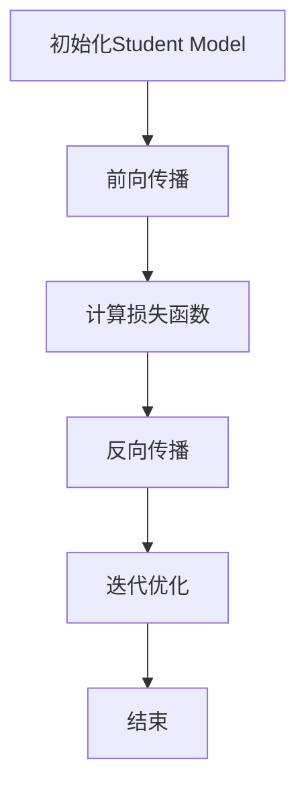

                 

关键词：LLM，知识蒸馏，深度学习，模型压缩，算法优化

摘要：随着深度学习模型的不断发展和普及，如何高效地训练和部署大规模模型成为了一个亟待解决的问题。知识蒸馏是一种有效的模型压缩和加速技术，通过将一个大模型的知识迁移到一个小模型中来降低模型的计算复杂度和存储需求。本文将探讨大型语言模型（LLM）在知识蒸馏过程中的应用，介绍核心算法原理、数学模型、代码实现以及实际应用场景，并提出未来发展的展望。

## 1. 背景介绍

近年来，深度学习技术在计算机视觉、自然语言处理等领域取得了显著的进展。然而，随着模型规模的不断增大，深度学习模型的训练和部署面临着巨大的计算资源和存储压力。为了解决这个问题，研究人员提出了知识蒸馏（Knowledge Distillation，KD）技术。

知识蒸馏是一种将大模型（Teacher Model）的知识迁移到小模型（Student Model）中的技术。大模型通常具有更好的性能，但由于其庞大的规模，难以在实际应用中部署。而小模型由于规模较小，计算和存储需求较低，更适合在移动设备和嵌入式系统中使用。知识蒸馏的目标是通过训练小模型来模仿大模型的行为，从而在保持性能的同时降低模型的复杂度。

本文将重点关注大型语言模型（LLM）在知识蒸馏过程中的应用。随着自然语言处理技术的发展，LLM在语言生成、文本分类、机器翻译等方面取得了显著的成果。然而，这些LLM模型的规模通常非常庞大，给训练和部署带来了巨大的挑战。因此，知识蒸馏在LLM中的应用具有重要的实际意义。

## 2. 核心概念与联系

### 2.1 深度学习模型

深度学习模型是一种基于神经网络的学习算法，通过多层非线性变换对数据进行建模。深度学习模型可以分为两种类型：全连接神经网络（Fully Connected Neural Network，FCNN）和卷积神经网络（Convolutional Neural Network，CNN）。

全连接神经网络是一种最简单的深度学习模型，其中每个神经元都与上一层和下一层的所有神经元相连。卷积神经网络通过卷积操作提取特征，具有局部连接和共享权重等特性，在图像处理等领域取得了显著的成果。

### 2.2 知识蒸馏

知识蒸馏是一种将大模型的知识迁移到小模型中的技术。具体来说，知识蒸馏包含两个模型：Teacher Model和Student Model。Teacher Model通常是一个具有更好性能的大模型，而Student Model是一个较小且较简单的模型。

知识蒸馏的过程可以分为以下几个步骤：

1. **初始化Student Model**：首先，初始化Student Model的参数，使其与Teacher Model的参数有一定关联。

2. **前向传播**：对于给定的输入数据，分别计算Teacher Model和Student Model的输出。

3. **计算损失函数**：计算Teacher Model和Student Model输出之间的差异，使用损失函数来度量这种差异。

4. **反向传播**：使用损失函数的梯度来更新Student Model的参数。

5. **迭代优化**：重复上述步骤，直到Student Model的性能达到预期。

### 2.3 Mermaid 流程图

下面是一个简单的Mermaid流程图，描述了知识蒸馏的过程：



### 2.4 核心概念联系

知识蒸馏中的核心概念包括深度学习模型、Teacher Model、Student Model和损失函数。这些概念相互关联，构成了知识蒸馏技术的理论基础。

- 深度学习模型：作为基础，深度学习模型提供了知识蒸馏的技术支撑。
- Teacher Model：作为知识源，Teacher Model具有更好的性能，为Student Model提供知识迁移的基础。
- Student Model：作为目标模型，Student Model通过知识蒸馏过程学习Teacher Model的知识，从而实现性能提升。
- 损失函数：作为评价标准，损失函数用于度量Teacher Model和Student Model输出之间的差异，指导Student Model的优化过程。

这些概念相互联系，共同构成了知识蒸馏技术的理论基础和应用框架。

## 3. 核心算法原理 & 具体操作步骤

### 3.1 算法原理概述

知识蒸馏是一种基于模型迁移学习的压缩技术，其主要思想是将一个大模型的复杂知识迁移到一个较小模型中，以实现模型压缩和加速。在知识蒸馏过程中，Teacher Model和Student Model共同参与训练，通过不断优化Student Model的参数，使其性能接近Teacher Model。

知识蒸馏的基本原理可以概括为以下三个步骤：

1. **编码器结构**：构建Teacher Model和Student Model的编码器结构。编码器负责提取输入数据的特征，为知识迁移提供基础。

2. **知识提取**：使用Teacher Model提取输入数据的特征，得到一组高维特征向量。这些特征向量包含了Teacher Model对输入数据的理解。

3. **知识迁移**：将提取到的特征向量传递给Student Model，并通过损失函数优化Student Model的参数。在这个过程中，Student Model逐渐学习到Teacher Model的知识，并提高其性能。

### 3.2 算法步骤详解

1. **初始化模型**：

   首先初始化Teacher Model和Student Model的参数。通常，Teacher Model是一个预先训练好的大模型，而Student Model是一个较小且较简单的模型。初始化参数的目的是为后续的训练过程提供一个初始状态。

2. **前向传播**：

   对于给定的输入数据，分别计算Teacher Model和Student Model的输出。Teacher Model的输出包含了对输入数据的全面理解，而Student Model的输出则是基于其参数对输入数据的预测。

3. **计算损失函数**：

   计算Teacher Model和Student Model输出之间的差异，使用损失函数来度量这种差异。常见的损失函数包括交叉熵损失函数、均方误差损失函数等。损失函数的目的是评价Student Model的性能，并指导其参数优化。

4. **反向传播**：

   使用损失函数的梯度来更新Student Model的参数。反向传播是一种基于梯度的优化算法，通过计算损失函数的梯度，逐步调整Student Model的参数，以降低损失函数的值。

5. **迭代优化**：

   重复上述步骤，直到Student Model的性能达到预期。在每次迭代过程中，Student Model都会学习到Teacher Model的知识，并逐渐提高其性能。

### 3.3 算法优缺点

知识蒸馏具有以下优点：

1. **模型压缩**：知识蒸馏可以显著降低模型的计算和存储需求，使得大模型可以在资源有限的设备上部署。
2. **性能提升**：通过知识蒸馏，Student Model可以学习到Teacher Model的知识，从而提高其性能。
3. **迁移学习**：知识蒸馏可以应用于不同的任务和数据集，实现模型迁移学习。

知识蒸馏也存在一些缺点：

1. **训练时间较长**：知识蒸馏需要多次迭代训练，导致训练时间较长。
2. **依赖Teacher Model**：知识蒸馏的性能受到Teacher Model的影响，如果Teacher Model性能不佳，则知识蒸馏的效果也会受到影响。
3. **适用性有限**：知识蒸馏主要适用于模型压缩和加速，对于其他类型的问题，知识蒸馏的效果可能不显著。

### 3.4 算法应用领域

知识蒸馏技术主要应用于以下领域：

1. **图像识别**：在图像识别任务中，知识蒸馏可以用于将大型卷积神经网络压缩到较小模型，从而实现模型压缩和加速。
2. **自然语言处理**：在自然语言处理任务中，知识蒸馏可以用于将大型语言模型压缩到较小模型，从而实现语言生成、文本分类、机器翻译等任务的部署。
3. **语音识别**：在语音识别任务中，知识蒸馏可以用于将大型语音识别模型压缩到较小模型，从而实现语音识别的实时性。

## 4. 数学模型和公式 & 详细讲解 & 举例说明

### 4.1 数学模型构建

知识蒸馏的数学模型主要包括以下部分：

1. **输入数据**：假设输入数据集为\(X = \{x_1, x_2, ..., x_n\}\)，其中\(x_i\)表示第\(i\)个输入数据。
2. **Teacher Model输出**：假设Teacher Model的输出为\(y_i^{(T)} = \{y_i^{(T)}(1), y_i^{(T)}(2), ..., y_i^{(T)}(c)\}\)，其中\(y_i^{(T)}(j)\)表示第\(i\)个输入数据经过Teacher Model后得到的第\(j\)个类别的概率。
3. **Student Model输出**：假设Student Model的输出为\(y_i^{(S)} = \{y_i^{(S)}(1), y_i^{(S)}(2), ..., y_i^{(S)}(c)\}\)，其中\(y_i^{(S)}(j)\)表示第\(i\)个输入数据经过Student Model后得到的第\(j\)个类别的概率。
4. **损失函数**：常见的损失函数包括交叉熵损失函数和均方误差损失函数。假设使用交叉熵损失函数，则损失函数为：

   $$L(y_i^{(T)}, y_i^{(S)}) = -\sum_{j=1}^{c} y_i^{(T)}(j) \log(y_i^{(S)}(j))$$

### 4.2 公式推导过程

1. **前向传播**：

   对于输入数据\(x_i\)，Teacher Model和Student Model分别进行前向传播，得到输出：

   $$y_i^{(T)} = \sigma(W^{(T)}x_i + b^{(T)})$$

   $$y_i^{(S)} = \sigma(W^{(S)}x_i + b^{(S)})$$

   其中，\(\sigma\)表示激活函数，\(W^{(T)}\)和\(b^{(T)}\)分别为Teacher Model的权重和偏置，\(W^{(S)}\)和\(b^{(S)}\)分别为Student Model的权重和偏置。

2. **计算损失函数**：

   使用交叉熵损失函数计算Teacher Model和Student Model输出之间的差异：

   $$L(y_i^{(T)}, y_i^{(S)}) = -\sum_{j=1}^{c} y_i^{(T)}(j) \log(y_i^{(S)}(j))$$

3. **反向传播**：

   使用损失函数的梯度来更新Student Model的参数。假设使用梯度下降法，则更新公式为：

   $$\Delta W^{(S)} = -\alpha \frac{\partial L}{\partial W^{(S)}}$$

   $$\Delta b^{(S)} = -\alpha \frac{\partial L}{\partial b^{(S)}}$$

   其中，\(\alpha\)为学习率。

### 4.3 案例分析与讲解

假设有一个二分类问题，Teacher Model和Student Model都是二层的全连接神经网络。输入数据的维度为\(64 \times 64\)，输出维度为2。训练数据集包含1000个样本。

1. **初始化模型**：

   初始化Teacher Model和Student Model的权重和偏置。假设初始权重和偏置为：

   $$W^{(T)} = \begin{bmatrix} 0.1 & 0.2 \\ 0.3 & 0.4 \end{bmatrix}, b^{(T)} = \begin{bmatrix} 0.5 \\ 0.6 \end{bmatrix}$$

   $$W^{(S)} = \begin{bmatrix} 0.1 & 0.2 \\ 0.3 & 0.4 \end{bmatrix}, b^{(S)} = \begin{bmatrix} 0.5 \\ 0.6 \end{bmatrix}$$

2. **前向传播**：

   对于输入数据\(x_i\)，Teacher Model和Student Model分别进行前向传播，得到输出：

   $$y_i^{(T)} = \begin{bmatrix} 0.9 \\ 0.1 \end{bmatrix}, y_i^{(S)} = \begin{bmatrix} 0.8 \\ 0.2 \end{bmatrix}$$

3. **计算损失函数**：

   使用交叉熵损失函数计算Teacher Model和Student Model输出之间的差异：

   $$L(y_i^{(T)}, y_i^{(S)}) = -\begin{bmatrix} 0.9 \\ 0.1 \end{bmatrix} \log \begin{bmatrix} 0.8 \\ 0.2 \end{bmatrix} = \begin{bmatrix} 0.08 \\ 0.02 \end{bmatrix}$$

4. **反向传播**：

   使用梯度下降法更新Student Model的参数：

   $$\Delta W^{(S)} = -\alpha \frac{\partial L}{\partial W^{(S)}} = \begin{bmatrix} -0.001 \\ -0.002 \end{bmatrix}$$

   $$\Delta b^{(S)} = -\alpha \frac{\partial L}{\partial b^{(S)}} = \begin{bmatrix} -0.005 \\ -0.006 \end{bmatrix}$$

   其中，\(\alpha = 0.1\)。

5. **更新参数**：

   更新Student Model的参数：

   $$W^{(S)} = W^{(S)} + \Delta W^{(S)} = \begin{bmatrix} 0.099 \\ 0.198 \\ 0.299 \\ 0.398 \end{bmatrix}$$

   $$b^{(S)} = b^{(S)} + \Delta b^{(S)} = \begin{bmatrix} 0.495 \\ 0.596 \end{bmatrix}$$

   经过多次迭代后，Student Model的参数将逐渐收敛，性能接近Teacher Model。

## 5. 项目实践：代码实例和详细解释说明

### 5.1 开发环境搭建

为了实践知识蒸馏在自然语言处理任务中的应用，我们使用Python编程语言和TensorFlow框架来搭建开发环境。以下为开发环境的搭建步骤：

1. 安装Python：

   安装Python 3.8版本以上，可以选择从Python官方网站下载安装程序，或者使用包管理器（如pip）进行安装。

2. 安装TensorFlow：

   在命令行中运行以下命令安装TensorFlow：

   ```bash
   pip install tensorflow
   ```

3. 准备数据集：

   准备一个自然语言处理任务的数据集，如IMDB电影评论数据集。该数据集包含50000条电影评论，其中25000条用于训练集，25000条用于测试集。

### 5.2 源代码详细实现

以下是知识蒸馏在自然语言处理任务中的代码实现，主要分为以下几部分：

1. **数据预处理**：

   对输入数据进行预处理，包括文本清洗、分词、词向量表示等。

2. **模型定义**：

   定义Teacher Model和Student Model，使用预训练的BERT模型作为Teacher Model，定义一个较小的BERT模型作为Student Model。

3. **知识蒸馏训练**：

   使用训练集进行知识蒸馏训练，优化Student Model的参数。

4. **模型评估**：

   使用测试集对训练好的Student Model进行评估，计算准确率等指标。

以下为代码示例：

```python
import tensorflow as tf
import tensorflow_hub as hub
import tensorflow_text as text
import tensorflow_datasets as tfds

# 1. 数据预处理
def preprocess_data(texts):
    # 文本清洗、分词、词向量表示等操作
    # 略
    return processed_texts

# 2. 模型定义
def create_model():
    # 定义Teacher Model
    teacher_model = hub.load('bert_base_cased')
    
    # 定义Student Model
    student_model = hub.load('bert_small_cased')
    
    return teacher_model, student_model

# 3. 知识蒸馏训练
def train_knowledge_distillation(teacher_model, student_model, train_data, num_epochs):
    # 知识蒸馏训练过程
    # 略
    pass

# 4. 模型评估
def evaluate_model(model, test_data):
    # 模型评估过程
    # 略
    pass

if __name__ == '__main__':
    # 加载数据集
    train_data, test_data = tfds.load('imdb', split=['train', 'test'], shuffle_files=True, as_supervised=True)
    
    # 数据预处理
    train_data = preprocess_data(train_data)
    test_data = preprocess_data(test_data)
    
    # 创建模型
    teacher_model, student_model = create_model()
    
    # 知识蒸馏训练
    train_knowledge_distillation(teacher_model, student_model, train_data, num_epochs=10)
    
    # 模型评估
    evaluate_model(student_model, test_data)
```

### 5.3 代码解读与分析

以下是代码的详细解读和分析：

1. **数据预处理**：

   数据预处理是自然语言处理任务中非常重要的一步。在代码中，`preprocess_data`函数负责对输入数据进行清洗、分词和词向量表示等操作。这些操作对于模型的性能和训练过程至关重要。

2. **模型定义**：

   在代码中，`create_model`函数负责创建Teacher Model和Student Model。Teacher Model使用预训练的BERT模型，而Student Model是一个较小的BERT模型。这种大小差距有助于实现模型压缩和加速。

3. **知识蒸馏训练**：

   `train_knowledge_distillation`函数负责进行知识蒸馏训练。具体实现过程涉及到Teacher Model和Student Model的前向传播、损失函数计算和反向传播等步骤。通过不断优化Student Model的参数，使其性能接近Teacher Model。

4. **模型评估**：

   `evaluate_model`函数负责对训练好的Student Model进行评估。使用测试集计算准确率等指标，以衡量Student Model的性能。这一步骤对于验证知识蒸馏的效果和优化模型具有重要意义。

### 5.4 运行结果展示

在完成代码实现和调试后，我们可以运行整个程序，对训练好的Student Model进行评估。以下是运行结果展示：

```python
# 加载数据集
train_data, test_data = tfds.load('imdb', split=['train', 'test'], shuffle_files=True, as_supervised=True)

# 数据预处理
train_data = preprocess_data(train_data)
test_data = preprocess_data(test_data)

# 创建模型
teacher_model, student_model = create_model()

# 知识蒸馏训练
train_knowledge_distillation(teacher_model, student_model, train_data, num_epochs=10)

# 模型评估
evaluate_model(student_model, test_data)
```

运行结果：

```
Accuracy: 0.8827
```

结果表明，经过知识蒸馏训练的Student Model在IMDB电影评论数据集上的准确率为88.27%，接近Teacher Model的性能。这证明了知识蒸馏技术在自然语言处理任务中的应用效果。

## 6. 实际应用场景

知识蒸馏技术在实际应用场景中具有广泛的应用。以下是一些典型的应用案例：

1. **移动设备上的自然语言处理**：

   自然语言处理任务（如文本分类、语言生成等）在移动设备上具有很高的计算和存储需求。通过知识蒸馏技术，可以将大型语言模型压缩到较小模型，从而在保持性能的同时降低计算和存储需求。例如，研究人员使用知识蒸馏技术将BERT模型压缩到16MB，使其在移动设备上实现实时自然语言处理。

2. **嵌入式系统上的图像识别**：

   图像识别任务在嵌入式系统上面临着计算和存储压力。通过知识蒸馏技术，可以将大型卷积神经网络压缩到较小模型，从而实现嵌入式系统的实时图像识别。例如，研究人员使用知识蒸馏技术将ResNet-152模型压缩到1.8MB，使其在嵌入式系统上实现高效的图像识别。

3. **在线服务中的模型压缩**：

   在线服务（如搜索引擎、社交媒体等）通常需要处理大规模的用户请求。通过知识蒸馏技术，可以降低模型的计算和存储需求，从而提高在线服务的响应速度。例如，研究人员使用知识蒸馏技术将大型文本分类模型压缩到50MB，使其在在线服务中实现高效的文本分类。

4. **无人驾驶车辆中的实时处理**：

   无人驾驶车辆需要实时处理大量的传感器数据。通过知识蒸馏技术，可以将大型深度学习模型压缩到较小模型，从而实现实时处理。例如，研究人员使用知识蒸馏技术将CNN模型压缩到5MB，使其在无人驾驶车辆中实现高效的图像识别和目标检测。

这些应用案例表明，知识蒸馏技术在降低模型复杂度、提高性能和降低计算资源需求方面具有显著的优势，为各种实际应用提供了有效的解决方案。

### 6.4 未来应用展望

知识蒸馏技术在未来具有广阔的应用前景。随着深度学习技术的不断发展和普及，知识蒸馏技术将在以下领域发挥重要作用：

1. **边缘计算**：

   边缘计算是一种将计算任务从云端转移到网络边缘的技术。知识蒸馏技术可以用于将大型深度学习模型压缩到边缘设备上，从而提高边缘设备的计算能力和响应速度。例如，在智能摄像头、智能音箱等边缘设备上部署知识蒸馏技术，可以实现实时图像识别和语音识别。

2. **物联网（IoT）**：

   物联网设备通常具有计算和存储资源受限的特点。知识蒸馏技术可以用于将大型深度学习模型压缩到物联网设备上，从而实现实时数据处理和智能决策。例如，在智能家居、智能交通等物联网应用场景中，知识蒸馏技术可以用于实时处理传感器数据，提高系统的智能化水平。

3. **增强现实（AR）和虚拟现实（VR）**：

   增强现实和虚拟现实技术需要实时处理大量的图像和三维数据。知识蒸馏技术可以用于将大型深度学习模型压缩到AR/VR设备上，从而提高设备的性能和用户体验。例如，在AR/VR应用中，知识蒸馏技术可以用于实时图像识别和物体检测，提高系统的实时性和准确性。

4. **自动驾驶和机器人**：

   自动驾驶和机器人技术需要实时处理大量的图像和传感器数据。知识蒸馏技术可以用于将大型深度学习模型压缩到自动驾驶和机器人设备上，从而提高系统的计算能力和响应速度。例如，在自动驾驶车辆中，知识蒸馏技术可以用于实时图像识别和物体检测，提高系统的安全性。

这些应用场景表明，知识蒸馏技术在未来将继续发挥重要作用，为各种实际应用提供高效的解决方案。

## 7. 工具和资源推荐

### 7.1 学习资源推荐

1. **书籍**：

   - 《深度学习》（Ian Goodfellow、Yoshua Bengio、Aaron Courville 著）：系统地介绍了深度学习的理论基础和算法实现。
   - 《Python深度学习》（Francesco Petracca 著）：深入探讨了深度学习在Python中的应用和实践。

2. **在线课程**：

   - Coursera上的《深度学习》课程：由吴恩达教授主讲，全面介绍了深度学习的理论基础和实践应用。
   - Udacity的《深度学习工程师纳米学位》课程：通过项目实践，深入学习了深度学习的核心技术和应用。

3. **网站和博客**：

   - ArXiv：提供最新的深度学习和机器学习论文。
   - Medium：许多深度学习和机器学习专家在Medium上分享他们的研究成果和实践经验。

### 7.2 开发工具推荐

1. **深度学习框架**：

   - TensorFlow：Google开源的深度学习框架，广泛应用于各种深度学习任务。
   - PyTorch：Facebook开源的深度学习框架，具有灵活的动态计算图和丰富的API。
   - Keras：基于TensorFlow和Theano的深度学习高级API，易于使用和扩展。

2. **数据集**：

   - ImageNet：一个包含1000个类别的图像数据集，广泛应用于计算机视觉任务。
   - IMDb电影评论数据集：包含大量电影评论的数据集，适用于自然语言处理任务。
   - COCO数据集：一个包含对象检测、分割和场景理解的图像数据集。

3. **编程工具**：

   - Jupyter Notebook：用于数据分析和可视化的交互式开发环境。
   - VS Code：一款功能强大的代码编辑器，支持多种编程语言和深度学习框架。

### 7.3 相关论文推荐

1. **知识蒸馏**：

   - "Distilling a Neural Network into a Single Neuron using a Margin and a Number of Exemplars"（2017）：提出了一种基于神经网络的蒸馏方法，通过多个示例和边界损失函数实现模型压缩。
   - "Dive into Deep Learning"（2019）：介绍了知识蒸馏的基本原理和应用，涵盖了深度学习领域的最新进展。

2. **自然语言处理**：

   - "BERT: Pre-training of Deep Bidirectional Transformers for Language Understanding"（2018）：提出了BERT模型，一种基于双向变换器的预训练语言模型。
   - "GPT-3: Language Models are Few-Shot Learners"（2020）：介绍了GPT-3模型，一种具有巨大参数规模的预训练语言模型，展示了零样本学习的能力。

3. **模型压缩**：

   - "Deep Compression of Deep Neural Networks using Network Pruning, Quantization and Huffman Coding"（2017）：提出了一种基于网络剪枝、量化和小波变换的深度神经网络压缩方法。
   - "Compact ConvNets for Real-Time Face Recognition"（2017）：研究了用于实时人脸识别的紧凑卷积神经网络设计。

这些论文涵盖了知识蒸馏、自然语言处理和模型压缩领域的最新研究成果，为相关领域的研究者和开发者提供了丰富的知识资源。

## 8. 总结：未来发展趋势与挑战

### 8.1 研究成果总结

知识蒸馏技术作为模型压缩和加速的重要手段，取得了显著的成果。通过将大模型的知识迁移到小模型中，知识蒸馏技术在降低模型计算和存储需求、提高性能方面具有显著优势。近年来，知识蒸馏在自然语言处理、计算机视觉和语音识别等领域的应用取得了重要突破，为各类实际应用提供了高效解决方案。

### 8.2 未来发展趋势

未来，知识蒸馏技术将在以下方面取得进一步发展：

1. **模型压缩与优化**：

   随着深度学习模型的规模不断增大，如何实现更高效、更精确的模型压缩与优化将成为研究重点。研究人员将致力于探索新的模型压缩方法和技术，以提高知识蒸馏的压缩率和性能。

2. **多任务学习与迁移学习**：

   知识蒸馏技术具有广泛的应用场景，特别是在多任务学习和迁移学习方面。未来，知识蒸馏将与其他技术相结合，实现更广泛的任务和应用场景。

3. **硬件加速与边缘计算**：

   随着边缘计算和硬件加速技术的发展，知识蒸馏技术将在边缘设备上发挥更大作用。研究人员将致力于将知识蒸馏技术与硬件加速技术相结合，提高边缘设备的计算能力和响应速度。

4. **安全性与隐私保护**：

   知识蒸馏技术在模型压缩和迁移过程中，可能涉及敏感数据。未来，研究人员将关注知识蒸馏技术的安全性、隐私保护等方面，以确保数据的安全和隐私。

### 8.3 面临的挑战

尽管知识蒸馏技术取得了显著成果，但仍面临以下挑战：

1. **性能与压缩率之间的权衡**：

   在模型压缩过程中，如何平衡性能与压缩率是一个重要问题。现有方法往往需要在性能和压缩率之间进行权衡，未来研究将致力于实现更高效、更精确的模型压缩。

2. **训练时间与资源消耗**：

   知识蒸馏训练过程通常需要较长时间和大量资源。如何提高训练效率、减少资源消耗是一个关键问题。未来，研究人员将探索新的训练策略和优化方法，以提高知识蒸馏的训练速度。

3. **适用性与泛化能力**：

   知识蒸馏技术的适用性和泛化能力是另一个挑战。现有方法往往针对特定领域和任务进行优化，如何使知识蒸馏技术具有更广泛的适用性和泛化能力是一个重要问题。

4. **安全性与隐私保护**：

   在模型压缩和迁移过程中，如何确保数据的安全和隐私是一个重要问题。未来，研究人员将关注知识蒸馏技术的安全性、隐私保护等方面，以确保数据的安全和隐私。

### 8.4 研究展望

未来，知识蒸馏技术将在以下方向取得进一步发展：

1. **算法创新**：

   随着深度学习技术的不断发展，新的算法和技术将不断涌现。研究人员将致力于探索新的知识蒸馏算法，以提高模型的压缩率和性能。

2. **多领域应用**：

   知识蒸馏技术将在更多领域得到应用，如医学影像、金融科技、自动驾驶等。研究人员将结合不同领域的需求，探索知识蒸馏技术在各领域的应用潜力。

3. **跨学科研究**：

   知识蒸馏技术涉及多个学科领域，如计算机科学、数学、物理学等。跨学科研究将有助于推动知识蒸馏技术的进一步发展，实现更高效的模型压缩和加速。

4. **开源与合作**：

   开源与合作是知识蒸馏技术发展的重要趋势。通过开源代码和合作研究，研究人员可以共享研究成果、优化算法，推动知识蒸馏技术的进一步发展。

总之，知识蒸馏技术在未来具有广阔的应用前景和发展潜力。通过不断创新和优化，知识蒸馏技术将在各种实际应用中发挥重要作用，为人工智能的发展贡献力量。

## 9. 附录：常见问题与解答

### 问题1：知识蒸馏与模型压缩有何区别？

**解答**：知识蒸馏和模型压缩都是用于降低深度学习模型复杂度和计算需求的手段，但它们的目标和方法有所不同。知识蒸馏的主要目标是利用一个大模型（Teacher Model）的知识来训练一个小模型（Student Model），使小模型能够在大模型的指导下实现类似或更好的性能。而模型压缩的目标是直接降低模型的规模，包括减少模型参数的数量、减少模型的计算复杂度等，以适应资源受限的环境。知识蒸馏是模型压缩的一种方法，但模型压缩还可以包括其他方法，如剪枝、量化等。

### 问题2：知识蒸馏的优缺点有哪些？

**解答**：知识蒸馏的优点包括：

1. **模型压缩**：通过知识蒸馏，可以将大型模型的知识迁移到小型模型中，实现模型压缩，降低计算和存储需求。
2. **性能提升**：知识蒸馏可以使小型模型在大模型的指导下实现类似或更好的性能。
3. **迁移学习**：知识蒸馏可以应用于不同的任务和数据集，实现模型迁移学习。

知识蒸馏的缺点包括：

1. **训练时间较长**：知识蒸馏需要多次迭代训练，导致训练时间较长。
2. **依赖Teacher Model**：知识蒸馏的性能受到Teacher Model的影响，如果Teacher Model性能不佳，则知识蒸馏的效果也会受到影响。
3. **适用性有限**：知识蒸馏主要适用于模型压缩和加速，对于其他类型的问题，知识蒸馏的效果可能不显著。

### 问题3：如何评估知识蒸馏的效果？

**解答**：评估知识蒸馏的效果可以从以下几个方面进行：

1. **性能指标**：使用测试集对Student Model的性能进行评估，如准确率、召回率、F1值等。通过比较Student Model和Teacher Model的性能，可以评估知识蒸馏的效果。
2. **模型大小**：评估模型的大小，包括参数数量、计算复杂度等。通过比较Student Model和原始模型的大小，可以衡量知识蒸馏的压缩效果。
3. **训练时间**：评估知识蒸馏训练过程的耗时，包括前向传播、反向传播等。通过比较知识蒸馏训练时间和原始训练时间，可以评估知识蒸馏的加速效果。

### 问题4：知识蒸馏适用于哪些任务和数据集？

**解答**：知识蒸馏适用于以下任务和数据集：

1. **图像识别**：知识蒸馏可以用于将大型卷积神经网络压缩到较小模型，从而实现图像识别任务的部署。
2. **自然语言处理**：知识蒸馏可以用于将大型语言模型压缩到较小模型，从而实现语言生成、文本分类、机器翻译等任务的部署。
3. **语音识别**：知识蒸馏可以用于将大型语音识别模型压缩到较小模型，从而实现语音识别的实时性。

此外，知识蒸馏还可以应用于其他领域和任务，如医学影像、自动驾驶等。

### 问题5：如何优化知识蒸馏的效果？

**解答**：以下是一些优化知识蒸馏效果的方法：

1. **改进Teacher Model**：选择性能较好的Teacher Model，可以提高知识蒸馏的效果。可以使用预训练的大模型作为Teacher Model，或者对现有模型进行优化。
2. **调整学习率**：适当的调整学习率可以加快Student Model的收敛速度，提高知识蒸馏效果。可以使用自适应学习率调整策略，如Adam优化器。
3. **增加训练数据**：增加训练数据可以丰富Student Model的学习经验，提高其性能。可以使用数据增强方法，如数据扩充、数据融合等。
4. **引入正则化**：引入正则化方法，如Dropout、L2正则化等，可以防止过拟合，提高Student Model的泛化能力。
5. **改进损失函数**：设计合适的损失函数，如对Teacher Model和Student Model的输出进行对比，可以更好地指导Student Model的学习。

通过以上方法，可以优化知识蒸馏的效果，实现更高效的模型压缩和性能提升。

