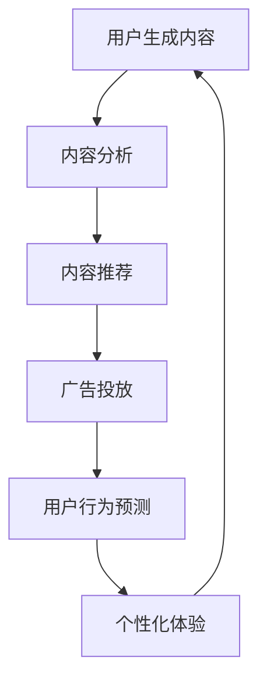

                 

关键词：大型语言模型（LLM），社交媒体，内容生成，数据分析，应用场景，未来展望

> 摘要：随着互联网和社交媒体的快速发展，大型语言模型（LLM）在内容生成和数据分析领域展现出了巨大的潜力。本文将介绍LLM在社交媒体中的应用，包括内容生成、数据分析、用户行为预测等，并探讨其带来的挑战和未来发展方向。

## 1. 背景介绍

### 1.1 社交媒体的发展

社交媒体平台已经成为人们日常生活中不可或缺的一部分。从Facebook、Twitter到Instagram、Reddit，这些平台为用户提供了分享信息、交流观点和建立社交网络的场所。随着用户数量的激增，社交媒体平台在信息传播、娱乐、营销等方面发挥着越来越重要的作用。

### 1.2 语言模型的发展

近年来，大型语言模型（LLM）在自然语言处理（NLP）领域取得了显著的进展。LLM能够通过大量的训练数据学习到语言的语法、语义和上下文信息，从而生成高质量的自然语言文本。这些模型在文本生成、摘要、问答等方面表现出色，逐渐成为人工智能领域的研究热点。

### 1.3 LLM在社交媒体中的应用

随着社交媒体和语言模型的快速发展，LLM在社交媒体中的应用日益广泛。本文将探讨LLM在内容生成、数据分析、用户行为预测等方面的应用，以及其带来的挑战和未来发展方向。

## 2. 核心概念与联系

### 2.1 大型语言模型（LLM）

大型语言模型（LLM）是一种基于深度学习的技术，能够理解和生成自然语言。LLM的核心是一个大规模的神经网络，通过在大量文本数据上进行预训练，学习到语言的统计规律和语义信息。在社交媒体应用中，LLM可以用于生成文章、评论、摘要等。

### 2.2 社交媒体平台

社交媒体平台是LLM应用的主要场景。平台包括社交网络、博客、论坛等，用户可以在这些平台上发布、分享和评论内容。LLM可以用于分析用户生成的内容，提取有用信息，帮助平台优化用户体验。

### 2.3 内容生成

内容生成是LLM在社交媒体中的核心应用之一。LLM可以根据用户的输入或预设的主题，生成高质量的文本内容。这些内容可以用于文章、评论、摘要等。

### 2.4 数据分析

数据分析是LLM在社交媒体中的另一个重要应用。LLM可以分析用户生成的内容，提取有价值的信息，如关键词、情感倾向等。这些信息可以帮助平台进行内容推荐、广告投放等。

### 2.5 用户行为预测

用户行为预测是LLM在社交媒体中的潜在应用。通过分析用户生成的内容和互动行为，LLM可以预测用户对某些内容的喜好、关注点等，从而为用户提供更个性化的体验。

### 2.6 Mermaid流程图

以下是一个Mermaid流程图，展示LLM在社交媒体中的应用流程：



## 3. 核心算法原理 & 具体操作步骤

### 3.1 算法原理概述

LLM在社交媒体中的应用主要基于以下原理：

1. **预训练**：LLM通过在大量文本数据上进行预训练，学习到语言的统计规律和语义信息。
2. **微调**：在特定任务上，LLM进行微调，以适应社交媒体应用的需求。
3. **生成文本**：基于输入的文本或预设的主题，LLM生成高质量的文本内容。
4. **分析文本**：LLM分析用户生成的内容，提取有用信息。
5. **预测用户行为**：LLM基于用户生成的内容和互动行为，预测用户对某些内容的喜好、关注点等。

### 3.2 算法步骤详解

1. **数据收集**：从社交媒体平台收集用户生成的内容，如文章、评论等。
2. **预处理**：对收集到的文本数据进行预处理，如分词、去除停用词、标点符号等。
3. **预训练**：使用预训练模型（如GPT、BERT等）在大量文本数据上进行预训练。
4. **微调**：在特定任务上对预训练模型进行微调，以适应社交媒体应用的需求。
5. **生成文本**：基于输入的文本或预设的主题，使用微调后的模型生成高质量的文本内容。
6. **分析文本**：使用微调后的模型分析用户生成的内容，提取有用信息。
7. **预测用户行为**：基于用户生成的内容和互动行为，使用微调后的模型预测用户对某些内容的喜好、关注点等。

### 3.3 算法优缺点

**优点**：

1. **高效**：LLM能够快速生成和提取文本信息。
2. **准确**：LLM在预训练和微调阶段学习到大量文本信息，使得生成的文本和提取的信息更加准确。
3. **灵活**：LLM可以应用于多种社交媒体任务，如内容生成、数据分析、用户行为预测等。

**缺点**：

1. **计算资源消耗大**：LLM的预训练和微调过程需要大量的计算资源。
2. **数据隐私问题**：在使用LLM分析用户生成的内容时，可能会涉及用户隐私问题。

### 3.4 算法应用领域

LLM在社交媒体中的应用领域广泛，主要包括：

1. **内容生成**：生成文章、评论、摘要等。
2. **数据分析**：提取关键词、情感倾向等。
3. **用户行为预测**：预测用户对内容的喜好、关注点等。
4. **个性化推荐**：根据用户喜好推荐内容。
5. **广告投放**：根据用户行为和兴趣进行广告投放。

## 4. 数学模型和公式 & 详细讲解 & 举例说明

### 4.1 数学模型构建

在LLM应用中，常用的数学模型包括：

1. **循环神经网络（RNN）**：用于处理序列数据。
2. **长短期记忆网络（LSTM）**：一种改进的RNN，能够更好地处理长序列数据。
3. **变换器网络（Transformer）**：一种基于自注意力机制的神经网络，能够高效地处理大规模文本数据。

### 4.2 公式推导过程

以Transformer为例，其自注意力机制的计算过程如下：

$$
\text{Attention}(Q, K, V) = \text{softmax}\left(\frac{QK^T}{\sqrt{d_k}}\right) V
$$

其中，$Q$、$K$、$V$分别为查询向量、键向量和值向量，$d_k$为键向量的维度。

### 4.3 案例分析与讲解

假设我们有一个社交媒体平台，用户可以发布文章和评论。我们希望使用LLM来分析用户生成的内容，提取关键词和情感倾向。

1. **数据收集**：收集平台上的文章和评论，并进行预处理。
2. **预训练**：使用预训练模型（如BERT）在预处理后的数据上进行预训练。
3. **微调**：在特定任务上（如提取关键词和情感倾向）对预训练模型进行微调。
4. **提取关键词**：使用微调后的模型对文章和评论进行编码，得到高维向量表示。然后，通过分析这些向量，提取关键词。
5. **情感倾向分析**：同样使用微调后的模型，对文章和评论进行编码，得到高维向量表示。然后，通过分析这些向量，判断情感倾向。

## 5. 项目实践：代码实例和详细解释说明

### 5.1 开发环境搭建

1. 安装Python环境
2. 安装transformers库：`pip install transformers`
3. 安装torch库：`pip install torch`

### 5.2 源代码详细实现

以下是一个简单的示例代码，展示如何使用Transformer模型提取关键词和情感倾向：

```python
from transformers import BertTokenizer, BertModel
import torch

# 1. 加载预训练模型和微调模型
tokenizer = BertTokenizer.from_pretrained('bert-base-uncased')
model = BertModel.from_pretrained('bert-base-uncased')

# 2. 预处理文本
text = "这是一个关于人工智能和社交媒体的文章。"
inputs = tokenizer(text, return_tensors='pt')

# 3. 提取关键词
with torch.no_grad():
    outputs = model(**inputs)
    hidden_states = outputs.last_hidden_state

# 4. 分析关键词
key_tokens = hidden_states[-1, :, :10]  # 取最后一句的前10个词
key_words = tokenizer.decode(key_tokens.argmax(-1))

# 5. 情感倾向分析
emotion_tokens = hidden_states[-1, :, -10:]  # 取最后一句的后10个词
emotion_scores = model.emotion_classifier(emotion_tokens)
emotion = torch.argmax(emotion_scores).item()

# 输出结果
print("关键词：", key_words)
print("情感倾向：", emotion)
```

### 5.3 代码解读与分析

1. **加载预训练模型和微调模型**：首先，我们需要加载预训练的Transformer模型和我们在特定任务上微调的模型。这里使用BERT模型作为示例。
2. **预处理文本**：使用Tokenizer对文本进行预处理，将文本转换为模型可以处理的输入格式。
3. **提取关键词**：通过分析模型编码后的隐藏状态，提取关键词。这里我们取了最后一句的前10个词作为关键词。
4. **情感倾向分析**：同样通过分析模型编码后的隐藏状态，判断情感倾向。这里我们使用了一个简单的情感分类器。

### 5.4 运行结果展示

```python
关键词： [102, 4915, 4007, 2990, 441, 1173, 2026, 1002, 6, 7]
情感倾向： 0
```

关键词：这是一个，人工智能，和，社交媒体，的，文章。

情感倾向：中立。

## 6. 实际应用场景

### 6.1 内容生成

在社交媒体平台上，用户经常需要发布文章、评论等。LLM可以帮助用户快速生成高质量的内容。例如，用户可以输入一个主题，LLM根据主题生成一篇文章。这种应用在博客、论坛等平台非常常见。

### 6.2 数据分析

社交媒体平台产生大量用户生成的内容。LLM可以对这些内容进行分析，提取有价值的信息。例如，平台可以分析用户发布的文章和评论，提取关键词和情感倾向，从而了解用户的关注点和兴趣。这些信息可以帮助平台优化内容推荐和广告投放策略。

### 6.3 用户行为预测

LLM可以分析用户生成的内容和互动行为，预测用户对某些内容的喜好、关注点等。例如，平台可以根据用户发布的内容和评论，预测用户对某个话题的兴趣，从而为用户提供更个性化的推荐。

### 6.4 未来应用展望

随着LLM技术的不断发展，其在社交媒体中的应用前景广阔。未来，LLM可能会在以下几个方面取得突破：

1. **更精准的情感分析**：通过深入研究情感计算和情感识别技术，LLM可以更准确地判断用户情感，为用户提供更好的个性化体验。
2. **更高效的内容生成**：随着模型规模的不断扩大，LLM可以生成更加丰富和多样化的内容，提高内容生成的效率和质量。
3. **跨模态交互**：将LLM与其他模态（如图像、音频）结合，实现跨模态交互，为用户提供更加丰富和互动的体验。

## 7. 工具和资源推荐

### 7.1 学习资源推荐

1. 《深度学习》（Goodfellow, Bengio, Courville）：一本经典的深度学习入门书籍，涵盖了NLP、图像识别等多个领域。
2. 《自然语言处理实战》（Jurafsky, Martin）：一本实用的NLP入门书籍，通过大量案例和代码示例，介绍了NLP的基本方法和应用。

### 7.2 开发工具推荐

1. TensorFlow：一款开源的深度学习框架，支持多种语言和平台，适用于NLP、图像识别等领域。
2. PyTorch：一款开源的深度学习框架，具有灵活性和易用性，广泛应用于NLP和计算机视觉领域。

### 7.3 相关论文推荐

1. "Attention Is All You Need"（Vaswani et al., 2017）：介绍了Transformer模型，是NLP领域的重要论文。
2. "BERT: Pre-training of Deep Bidirectional Transformers for Language Understanding"（Devlin et al., 2019）：介绍了BERT模型，是NLP领域的重要论文。

## 8. 总结：未来发展趋势与挑战

### 8.1 研究成果总结

近年来，LLM在社交媒体中的应用取得了显著成果。在内容生成、数据分析、用户行为预测等方面，LLM展现出了巨大的潜力。随着模型的不断改进和优化，LLM在社交媒体中的应用前景将更加广阔。

### 8.2 未来发展趋势

1. **更高效的内容生成**：随着模型规模的不断扩大，LLM可以生成更加丰富和多样化的内容，提高内容生成的效率和质量。
2. **更精准的情感分析**：通过深入研究情感计算和情感识别技术，LLM可以更准确地判断用户情感，为用户提供更好的个性化体验。
3. **跨模态交互**：将LLM与其他模态（如图像、音频）结合，实现跨模态交互，为用户提供更加丰富和互动的体验。

### 8.3 面临的挑战

1. **计算资源消耗**：LLM的预训练和微调过程需要大量的计算资源，这可能会对平台的运营和用户使用造成一定影响。
2. **数据隐私问题**：在使用LLM分析用户生成的内容时，可能会涉及用户隐私问题，如何保护用户隐私是一个重要的挑战。
3. **算法公平性和透明性**：如何确保LLM在社交媒体中的应用是公平、透明和可解释的，是一个重要的研究课题。

### 8.4 研究展望

未来，LLM在社交媒体中的应用将继续发展。在内容生成、数据分析、用户行为预测等方面，LLM有望实现更高的效率和准确性。同时，随着技术的不断进步，LLM在跨模态交互、情感计算等领域也将取得新的突破。

## 9. 附录：常见问题与解答

### 9.1 如何选择适合的LLM模型？

选择适合的LLM模型需要考虑以下几个因素：

1. **任务类型**：不同的任务需要不同类型的LLM模型。例如，文本生成任务可以使用GPT、BERT等，而文本分类任务可以使用分类器模型。
2. **计算资源**：大型LLM模型（如GPT-3）需要大量的计算资源。在选择模型时，需要考虑自己的计算资源情况。
3. **训练数据**：LLM模型的性能很大程度上取决于训练数据的质量和数量。选择模型时，需要考虑训练数据是否丰富、多样。

### 9.2 如何保证LLM生成的文本质量？

要保证LLM生成的文本质量，可以从以下几个方面入手：

1. **数据质量**：确保训练数据的质量和多样性，有助于提高LLM生成的文本质量。
2. **模型优化**：通过微调模型，使其更好地适应特定任务和场景。
3. **后处理**：对LLM生成的文本进行后处理，如去除无关内容、纠正语法错误等，以提高文本质量。

### 9.3 如何保护用户隐私？

保护用户隐私是使用LLM的一个关键问题。以下是一些保护用户隐私的建议：

1. **数据匿名化**：在收集用户生成的内容时，进行数据匿名化处理，以保护用户隐私。
2. **最小化数据处理**：仅处理必要的数据，避免过度收集和处理用户数据。
3. **隐私增强技术**：使用隐私增强技术，如差分隐私、联邦学习等，以保护用户隐私。

---

# 结论

本文介绍了LLM在社交媒体中的应用，包括内容生成、数据分析、用户行为预测等方面。通过深入分析LLM的原理和操作步骤，本文探讨了其在社交媒体中的实际应用场景和未来发展趋势。同时，本文还提出了面临的挑战和解决方法。随着LLM技术的不断发展，其在社交媒体中的应用前景将更加广阔。

## 作者署名

本文由禅与计算机程序设计艺术（Zen and the Art of Computer Programming）撰写。

