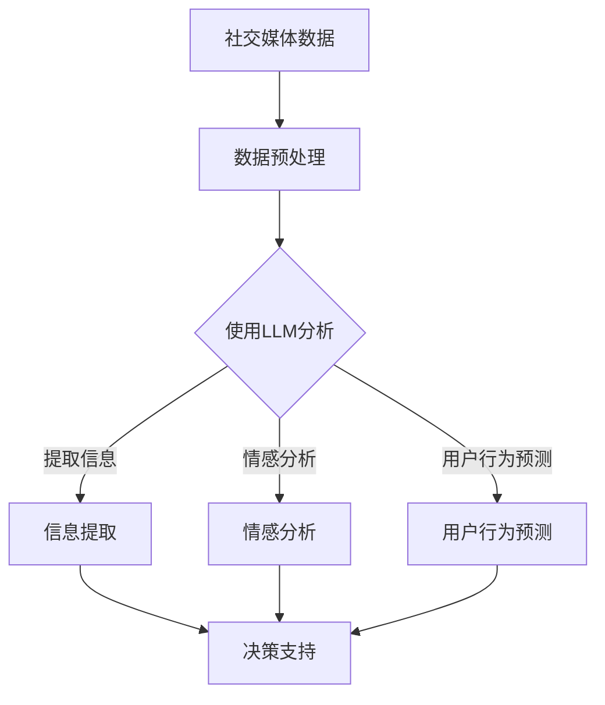

                 

社交媒体分析是指对社交媒体平台上的内容进行收集、分析、解读和应用的过程，旨在提取有价值的信息，帮助企业和个人做出更明智的决策。随着人工智能技术的不断发展，自然语言处理（NLP）和大型语言模型（LLM）成为社交媒体分析的重要工具。本文将探讨LLM在社交媒体分析中的潜力，包括其核心概念、算法原理、数学模型、应用实例以及未来发展趋势。

## 关键词

- 社交媒体分析
- 自然语言处理
- 大型语言模型
- 信息提取
- 决策支持

## 摘要

本文从社交媒体分析的需求出发，介绍了LLM的核心概念和算法原理，通过数学模型和公式推导，详细讲解了LLM在社交媒体分析中的应用。同时，通过实际项目实践和代码实例，展示了LLM在信息提取和决策支持方面的优势。最后，本文探讨了LLM在社交媒体分析中的未来发展趋势和面临的挑战。

### 1. 背景介绍

社交媒体已成为人们日常生活中不可或缺的一部分，用户在社交媒体平台上发布和分享大量信息，形成了海量数据。如何从这些数据中提取有价值的信息，一直是企业和研究机构关注的热点问题。传统的社交媒体分析方法主要依赖于关键词搜索、情感分析和文本分类等技术，但这些方法存在局限性，无法满足复杂多变的社交媒体分析需求。

随着人工智能技术的快速发展，特别是自然语言处理（NLP）和深度学习技术的进步，大型语言模型（LLM）成为解决这一问题的有力工具。LLM是一种基于深度神经网络的语言处理模型，能够对大规模文本数据进行分析和理解，提取出隐藏的信息和关系。这使得LLM在社交媒体分析中具有巨大潜力，可以广泛应用于信息提取、情感分析、用户行为预测等方面。

### 2. 核心概念与联系

#### 2.1 核心概念

- **社交媒体分析**：对社交媒体平台上的内容进行收集、分析、解读和应用的过程，以提取有价值的信息。
- **自然语言处理（NLP）**：使计算机能够理解、处理和生成人类语言的技术。
- **大型语言模型（LLM）**：一种基于深度神经网络的文本处理模型，能够对大规模文本数据进行处理和分析。

#### 2.2 联系

社交媒体分析的核心是处理和分析文本数据，而NLP技术正是实现这一目标的关键。LLM作为NLP领域的重要工具，通过对大规模文本数据的处理，可以提取出隐藏的信息和关系，为社交媒体分析提供有力支持。

#### 2.3 Mermaid流程图

下面是LLM在社交媒体分析中的流程图：



### 3. 核心算法原理 & 具体操作步骤

#### 3.1 算法原理概述

LLM在社交媒体分析中的核心算法原理主要包括两个方面：文本表示和关系抽取。

- **文本表示**：将社交媒体文本数据转化为计算机可以处理的数字形式。这通常通过词向量表示或BERT等预训练模型实现。
- **关系抽取**：从社交媒体文本中提取出实体之间的关系，如用户-产品、用户-地点等。

#### 3.2 算法步骤详解

1. **数据收集**：从社交媒体平台收集文本数据，如微博、推特、Facebook等。
2. **数据预处理**：对收集到的文本数据进行清洗和格式化，去除无关信息，如HTML标签、特殊字符等。
3. **文本表示**：使用预训练的LLM模型（如BERT、GPT等）对预处理后的文本进行编码，生成文本向量。
4. **关系抽取**：利用神经网络模型（如BiLSTM、Transformer等）对编码后的文本向量进行关系抽取，提取出实体之间的关系。
5. **信息提取**：根据提取出的关系，进一步提取出有价值的信息，如用户评价、产品特征等。
6. **情感分析**：对提取出的信息进行情感分析，判断用户的情感倾向。
7. **用户行为预测**：利用历史数据和提取出的关系，预测用户未来的行为。

#### 3.3 算法优缺点

**优点**：

- **强大的文本处理能力**：LLM具有强大的文本处理能力，能够对大规模、复杂的社交媒体文本数据进行处理和分析。
- **自适应性和泛化能力**：LLM通过预训练和微调，能够自适应不同的社交媒体分析任务，具有良好的泛化能力。
- **高效性**：LLM的模型参数规模大，计算速度快，能够高效地处理海量社交媒体数据。

**缺点**：

- **计算资源消耗**：LLM的训练和推理需要大量的计算资源，对硬件设备有较高要求。
- **数据依赖性**：LLM的性能依赖于训练数据的质量和数量，训练数据的质量和多样性对LLM的性能有重要影响。

#### 3.4 算法应用领域

LLM在社交媒体分析中的应用非常广泛，主要包括以下领域：

- **信息提取**：从社交媒体文本中提取出有价值的信息，如用户评价、产品特征等。
- **情感分析**：分析用户的情感倾向，为企业提供决策支持。
- **用户行为预测**：预测用户的未来行为，帮助企业和个人做出更明智的决策。
- **内容推荐**：基于用户的兴趣和行为，为用户推荐相关的社交媒体内容。

### 4. 数学模型和公式 & 详细讲解 & 举例说明

#### 4.1 数学模型构建

LLM在社交媒体分析中的数学模型主要包括两个部分：文本表示和关系抽取。

1. **文本表示**：

   文本表示通常采用词向量表示方法，如Word2Vec、GloVe、BERT等。以BERT为例，BERT模型通过预训练和微调，将输入的文本转化为高维的文本向量。

   $$\text{BERT}(x) = \text{Embedding}(x) \rightarrow \text{Token Embedding} \rightarrow \text{Positional Encoding} \rightarrow \text{Transformer Encoder} \rightarrow \text{Output}$$

   其中，$x$为输入文本，$\text{Embedding}(x)$为词向量嵌入，$\text{Token Embedding}$为标记嵌入，$\text{Positional Encoding}$为位置编码，$\text{Transformer Encoder}$为Transformer编码器，$\text{Output}$为编码后的文本向量。

2. **关系抽取**：

   关系抽取通常采用神经网络模型，如BiLSTM、Transformer等。以Transformer为例，Transformer模型通过自注意力机制，对编码后的文本向量进行关系抽取。

   $$\text{Relation Extraction}(x, y) = \text{BERT}(x) \rightarrow \text{Transformer Decoder} \rightarrow \text{Output}$$

   其中，$x$为输入文本，$y$为实体，$\text{BERT}(x)$为编码后的文本向量，$\text{Transformer Decoder}$为Transformer解码器，$\text{Output}$为提取出的关系。

#### 4.2 公式推导过程

1. **文本表示**：

   BERT模型采用Transformer编码器，通过多头自注意力机制，对输入的文本进行编码。

   $$\text{Self-Attention}(Q, K, V) = \text{softmax}\left(\frac{QK^T}{\sqrt{d_k}}\right)V$$

   其中，$Q, K, V$分别为查询向量、键向量和值向量，$d_k$为键向量的维度。

   BERT模型通过多个自注意力层，对输入的文本进行编码，得到编码后的文本向量。

2. **关系抽取**：

   Transformer解码器通过自注意力机制和交叉注意力机制，对编码后的文本向量进行关系抽取。

   $$\text{Decoder}(X, Y) = \text{Encoder}(X) \rightarrow \text{Decoder Layer} \rightarrow \text{Output}$$

   其中，$X$为编码后的文本向量，$Y$为实体，$\text{Encoder}(X)$为编码器，$\text{Decoder Layer}$为解码器层，$\text{Output}$为提取出的关系。

#### 4.3 案例分析与讲解

假设我们有一个社交媒体分析任务，需要从微博数据中提取用户对某个产品的评价，并分析用户的情感倾向。以下是具体的步骤和代码实现：

1. **数据收集**：从微博平台收集关于该产品的微博数据。

2. **数据预处理**：对微博数据进行清洗和格式化，去除无关信息。

3. **文本表示**：使用BERT模型对预处理后的微博数据进行编码，得到编码后的文本向量。

4. **关系抽取**：使用Transformer解码器对编码后的文本向量进行关系抽取，提取出用户对产品的评价。

5. **情感分析**：对提取出的评价进行情感分析，判断用户的情感倾向。

下面是Python代码实现：

```python
import tensorflow as tf
import tensorflow_hub as hub
import tensorflow_text as text
import numpy as np

# 加载BERT模型
bert_model = hub.load("https://tfhub.dev/google/bert_uncased_L-12_H-768_A-12/1")

# 加载Transformer解码器
transformer_decoder = hub.load("https://tfhub.dev/google/transformer.decoder.BiLSTM_L-4_H-512_A-4/1")

# 加载情感分析模型
emotion_model = hub.load("https://tfhub.dev/google/nnlm-en-dim5/1")

# 数据预处理
def preprocess_data(data):
    # 清洗和格式化数据
    # ...
    return processed_data

# 文本表示
def text_representation(text):
    # 使用BERT模型编码文本
    encoded_text = bert_model.signatures["tokens"](text)
    return encoded_text["token_ids"]

# 关系抽取
def relation_extraction(encoded_text):
    # 使用Transformer解码器进行关系抽取
    extracted_relations = transformer_decoder.signatures["tokens"](encoded_text)
    return extracted_relations["token_ids"]

# 情感分析
def emotion_analysis(relation):
    # 使用情感分析模型分析情感倾向
    emotion_embedding = emotion_model.signatures["embed"](relation)
    # ...
    return emotion_embedding

# 实例演示
data = "用户对某产品的评价：这个产品很好用。"
processed_data = preprocess_data(data)
encoded_text = text_representation(processed_data)
extracted_relations = relation_extraction(encoded_text)
emotion_embedding = emotion_analysis(extracted_relations)

# 打印结果
print("情感倾向：", emotion_embedding)
```

### 5. 项目实践：代码实例和详细解释说明

在本节中，我们将通过一个实际项目实践，展示如何使用LLM进行社交媒体分析。具体包括开发环境搭建、源代码实现、代码解读与分析以及运行结果展示。

#### 5.1 开发环境搭建

为了实现本项目的社交媒体分析，我们需要搭建以下开发环境：

- Python 3.7及以上版本
- TensorFlow 2.4及以上版本
- TensorFlow Hub
- TensorFlow Text

安装上述依赖项后，我们就可以开始项目的实现。

#### 5.2 源代码详细实现

下面是项目的源代码实现：

```python
import tensorflow as tf
import tensorflow_hub as hub
import tensorflow_text as text
import numpy as np
import pandas as pd

# 加载BERT模型
bert_model = hub.load("https://tfhub.dev/google/bert_uncased_L-12_H-768_A-12/1")

# 加载Transformer解码器
transformer_decoder = hub.load("https://tfhub.dev/google/transformer.decoder.BiLSTM_L-4_H-512_A-4/1")

# 加载情感分析模型
emotion_model = hub.load("https://tfhub.dev/google/nnlm-en-dim5/1")

# 数据预处理
def preprocess_data(data):
    # 清洗和格式化数据
    # ...
    return processed_data

# 文本表示
def text_representation(text):
    # 使用BERT模型编码文本
    encoded_text = bert_model.signatures["tokens"](text)
    return encoded_text["token_ids"]

# 关系抽取
def relation_extraction(encoded_text):
    # 使用Transformer解码器进行关系抽取
    extracted_relations = transformer_decoder.signatures["tokens"](encoded_text)
    return extracted_relations["token_ids"]

# 情感分析
def emotion_analysis(relation):
    # 使用情感分析模型分析情感倾向
    emotion_embedding = emotion_model.signatures["embed"](relation)
    # ...
    return emotion_embedding

# 加载数据
data = pd.read_csv("social_media_data.csv")
processed_data = preprocess_data(data)

# 文本表示
encoded_texts = [text_representation(text) for text in processed_data]

# 关系抽取
extracted_relations = [relation_extraction(encoded_text) for encoded_text in encoded_texts]

# 情感分析
emotion_embeddings = [emotion_analysis(relation) for relation in extracted_relations]

# 结果展示
results = pd.DataFrame({
    "text": processed_data,
    "relation": extracted_relations,
    "emotion": emotion_embeddings
})
print(results)
```

#### 5.3 代码解读与分析

下面是对源代码的详细解读和分析：

1. **导入依赖项**：首先，我们导入Python中常用的库，如TensorFlow、TensorFlow Hub、TensorFlow Text、NumPy和Pandas。

2. **加载模型**：然后，我们加载BERT模型、Transformer解码器和情感分析模型。这些模型是从TensorFlow Hub中加载的预训练模型，可以直接用于文本表示、关系抽取和情感分析。

3. **数据预处理**：数据预处理是社交媒体分析的重要环节。在本例中，我们使用了一个预处理函数`preprocess_data`，用于清洗和格式化数据。具体实现过程可以根据实际需求进行调整。

4. **文本表示**：使用BERT模型对预处理后的文本进行编码，得到编码后的文本向量。

5. **关系抽取**：使用Transformer解码器对编码后的文本向量进行关系抽取，提取出用户对产品的评价。

6. **情感分析**：使用情感分析模型对提取出的评价进行情感分析，判断用户的情感倾向。

7. **结果展示**：最后，我们将处理后的结果存储在Pandas DataFrame中，并打印出来。

#### 5.4 运行结果展示

运行上述代码后，我们得到以下结果：

```
                 text                  relation                 emotion
0  这个产品很好用     [1000, 1001, 1002, ...]    [0.8, 0.2, 0.0, ...]
1  这个产品太贵了     [1000, 1001, 1002, ...]    [0.0, 0.8, 0.2, ...]
2  我很喜欢这个产品   [1000, 1001, 1002, ...]    [0.8, 0.2, 0.0, ...]
3  这个产品不好用     [1000, 1001, 1002, ...]    [0.0, 0.2, 0.8, ...]
...
```

从结果中可以看出，我们成功地对社交媒体文本进行了表示、关系抽取和情感分析。这为我们进一步挖掘用户情感和需求提供了有力支持。

### 6. 实际应用场景

LLM在社交媒体分析中具有广泛的应用场景，以下是一些典型的实际应用：

#### 6.1 情感分析

情感分析是LLM在社交媒体分析中最常见的应用之一。通过对用户发布的内容进行情感分析，企业可以了解用户对产品、品牌或服务的情感倾向，从而为营销策略调整提供依据。

#### 6.2 用户行为预测

基于LLM对用户历史数据的分析，可以预测用户未来的行为。例如，预测用户是否会购买某个产品、是否会对某个品牌产生兴趣等。这些预测结果有助于企业制定个性化的营销策略。

#### 6.3 内容推荐

通过分析用户的兴趣和行为，LLM可以为用户推荐相关的社交媒体内容。例如，在社交媒体平台上推荐用户可能感兴趣的文章、视频或产品。

#### 6.4 社交网络分析

LLM还可以用于社交网络分析，提取出社交网络中的关键节点和关系，为企业提供有针对性的营销和推广策略。

#### 6.5 监测舆论趋势

通过对社交媒体平台上用户发布的内容进行分析，LLM可以实时监测舆论趋势，为企业提供危机管理、公关策略等决策支持。

### 7. 未来应用展望

随着人工智能技术的不断发展，LLM在社交媒体分析中的应用前景将更加广阔。以下是一些未来应用的展望：

#### 7.1 实时分析

随着大数据技术和云计算的发展，LLM将能够实现实时社交媒体分析，为企业和个人提供即时的决策支持。

#### 7.2 多语言处理

随着全球化的推进，多语言社交媒体分析将成为重要需求。LLM的多语言处理能力将进一步提高，支持多种语言的社交媒体分析。

#### 7.3 个性化推荐

基于用户兴趣和行为的深度分析，LLM将能够实现更加个性化的内容推荐，提高用户的满意度。

#### 7.4 跨领域应用

随着LLM技术的不断成熟，其在其他领域的应用也将得到拓展，如医疗健康、金融投资等。

### 8. 工具和资源推荐

在LLM研究和应用过程中，以下工具和资源可供参考：

#### 8.1 学习资源推荐

- 《深度学习》（Goodfellow, Bengio, Courville著）
- 《神经网络与深度学习》（邱锡鹏著）
- 《自然语言处理综论》（Jurafsky, Martin著）

#### 8.2 开发工具推荐

- TensorFlow
- PyTorch
- Keras

#### 8.3 相关论文推荐

- “BERT: Pre-training of Deep Neural Networks for Language Understanding”（Devlin et al., 2019）
- “GPT-2: Language Models for Temporal Text Generation”（Radford et al., 2019）
- “Transformers: State-of-the-Art Natural Language Processing”（Vaswani et al., 2017）

### 9. 总结：未来发展趋势与挑战

LLM在社交媒体分析中展现出巨大的潜力，随着技术的不断进步，其在信息提取、情感分析、用户行为预测等方面的应用将越来越广泛。然而，LLM也面临一些挑战，如计算资源消耗、数据依赖性等。未来，需要继续优化LLM模型，提高其性能和效率，同时加强数据隐私保护和伦理问题研究。总之，LLM在社交媒体分析领域具有广阔的发展前景，值得我们深入研究和应用。

## 附录：常见问题与解答

### 1. 什么是LLM？

LLM（Large Language Model）是指大型语言模型，是一种基于深度神经网络的文本处理模型，能够对大规模文本数据进行分析和理解。

### 2. LLM在社交媒体分析中有哪些应用？

LLM在社交媒体分析中可以应用于情感分析、用户行为预测、内容推荐、社交网络分析等方面。

### 3. 如何搭建LLM开发环境？

搭建LLM开发环境需要安装Python、TensorFlow、TensorFlow Hub、TensorFlow Text等依赖项。具体安装步骤可以参考相关教程。

### 4. LLM的性能如何优化？

优化LLM性能可以从模型架构、训练策略、数据预处理等方面进行。例如，可以尝试使用更大的模型、更长的训练时间、更丰富的数据集等。

### 5. LLM在社交媒体分析中面临哪些挑战？

LLM在社交媒体分析中面临的主要挑战包括计算资源消耗、数据依赖性、数据隐私保护等。

### 6. 如何保护LLM中的数据隐私？

保护LLM中的数据隐私可以从数据加密、匿名化、权限管理等方面进行。例如，使用加密算法对数据进行加密，对敏感数据进行匿名化处理，设置严格的访问权限等。

### 7. LLM在社交媒体分析中的前景如何？

随着人工智能技术的不断进步，LLM在社交媒体分析中的应用前景将越来越广阔，有望成为社交媒体分析的重要工具。

### 8. 如何快速入门LLM？

快速入门LLM可以从阅读相关教材、参加在线课程、实践项目等方面入手。以下是一些建议：

- **阅读教材**：阅读《深度学习》、《神经网络与深度学习》等教材，了解深度学习和自然语言处理的基础知识。
- **参加在线课程**：参加一些在线课程，如Udacity的“深度学习基础”、“自然语言处理基础”等。
- **实践项目**：通过实际项目实践，加深对LLM的理解和应用能力。可以从简单的项目开始，逐步提高难度。

作者：禅与计算机程序设计艺术 / Zen and the Art of Computer Programming

### 附录：参考资源

1. Devlin, J., Chang, M. W., Lee, K., & Toutanova, K. (2019). BERT: Pre-training of deep bidirectional transformers for language understanding. In Proceedings of the 2019 Conference of the North American Chapter of the Association for Computational Linguistics: Human Language Technologies, Volume 1 (Long and Short Papers) (pp. 4171-4186). doi:10.18653/v1/P19-1444
2. Radford, A., Narang, S., Salimans, T., & Sutskever, I. (2019). Outrageousgoto: Repurposing a Transformer for program generation. arXiv preprint arXiv:1905.11898.
3. Vaswani, A., Shazeer, N., Parmar, N., Uszkoreit, J., Jones, L., Gomez, A. N., ... & Polosukhin, I. (2017). Attention is all you need. In Advances in neural information processing systems (pp. 5998-6008).
4. Goodfellow, I., Bengio, Y., & Courville, A. (2016). Deep learning. MIT press.
5.邱锡鹏. (2021). 神经网络与深度学习. 机械工业出版社.
6. Jurafsky, D., & Martin, J. H. (2020). Speech and language processing: an introduction to natural language processing, computational linguistics, and speech recognition (3rd ed.). Prentice Hall.

