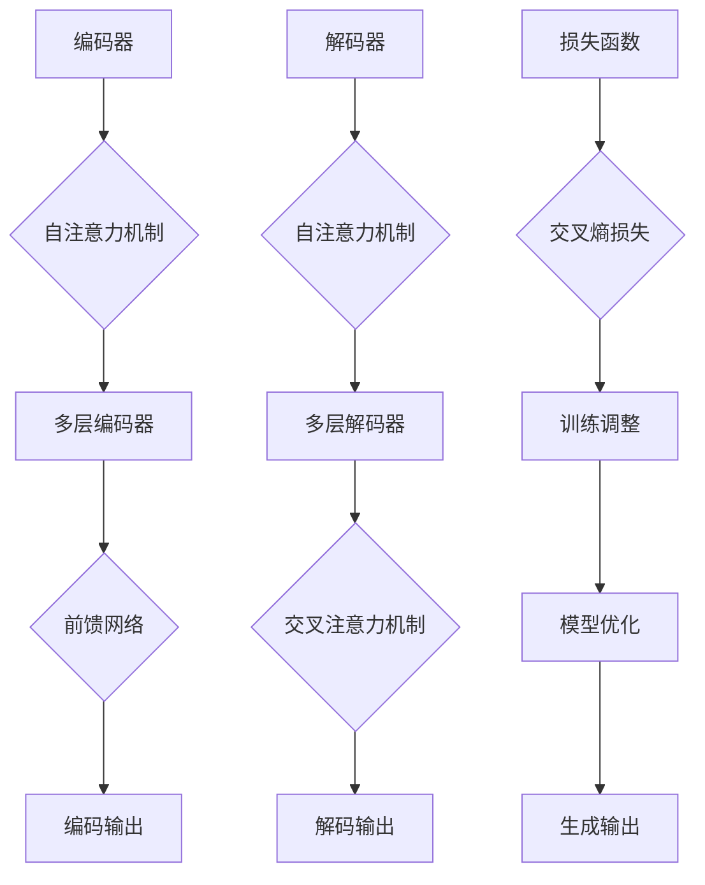
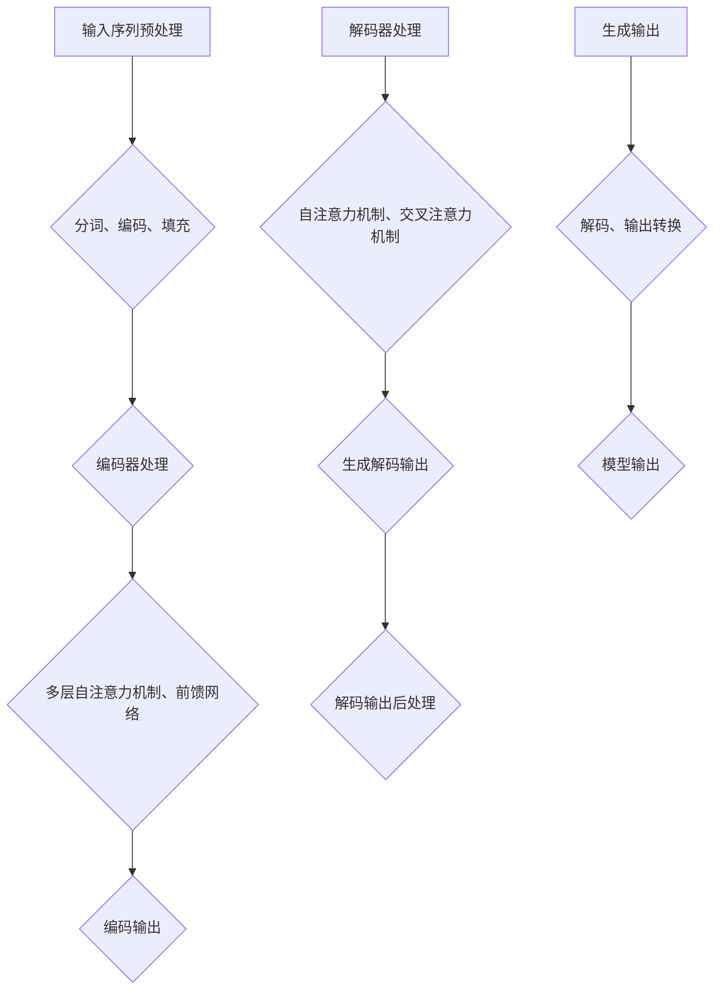

                 

关键词：大型语言模型（LLM），科学研究，人工智能，算法，数学模型，项目实践，应用场景，发展趋势

## 摘要

本文将探讨大型语言模型（LLM）在科学研究中的广泛应用，以及如何通过人工智能技术加速科技创新。我们将深入分析LLM的核心概念、算法原理、数学模型以及具体应用实例，同时展望未来发展趋势和面临的挑战。通过本文，读者将全面了解LLM在科学研究中的重要角色，并认识到其在加速科技创新方面的巨大潜力。

## 1. 背景介绍

随着人工智能技术的迅猛发展，大型语言模型（LLM）如BERT、GPT和T5等，已经在自然语言处理、文本生成、知识图谱构建等多个领域取得了显著的成果。这些模型通过对海量文本数据的学习，能够生成高质量的自然语言文本，并进行语义理解和推理。然而，LLM的应用并不仅限于自然语言处理领域，它们在科学研究中也展示出了巨大的潜力。

科学研究是一个复杂而广泛的过程，涉及数据收集、数据分析、实验设计、理论推导等多个环节。传统的科学研究方法往往依赖于人类专家的经验和知识，这导致研究效率低下，且容易受到主观因素的影响。而LLM的出现为科学研究带来了新的机遇，它们可以通过自动化、智能化的方式，大幅提高研究效率，减少人为干预，从而推动科技发展的进程。

本文将首先介绍LLM的核心概念和算法原理，然后详细探讨LLM在科学研究中的具体应用，包括数学模型、项目实践和实际应用场景。最后，我们将对未来LLM在科学研究中的应用趋势和面临的挑战进行展望。

## 2. 核心概念与联系

### 2.1 大型语言模型（LLM）的定义

大型语言模型（LLM）是指通过深度学习技术训练得到的、具有强大语言理解能力和生成能力的人工智能模型。与传统的语言模型相比，LLM具有以下几个显著特点：

1. **模型规模巨大**：LLM通常由数十亿甚至千亿级别的参数组成，能够处理复杂的语言现象。
2. **语言理解能力强**：LLM通过对海量文本数据的学习，能够理解并生成符合语法、语义和语境要求的自然语言文本。
3. **自适应性好**：LLM可以根据不同的应用场景和任务需求进行自适应调整，从而在不同领域展现出强大的性能。

### 2.2 核心算法原理

LLM的核心算法是基于变换器（Transformer）架构，特别是在自注意力（Self-Attention）机制的基础上发展起来的。自注意力机制通过计算输入序列中每个词与其他词之间的关联性，从而生成一个加权表示，这一过程使得模型能够捕捉到输入序列的长期依赖关系。

变换器架构主要包括以下几个关键组件：

1. **编码器（Encoder）**：编码器负责处理输入序列，生成编码表示。每个编码器层由多头自注意力机制和前馈网络组成。
2. **解码器（Decoder）**：解码器负责生成输出序列，通过自注意力机制和交叉注意力机制，解码器能够同时关注编码器的输出和已经生成的部分输出序列。
3. **损失函数**：LLM的训练通常使用交叉熵损失函数，该函数衡量模型预测的输出与真实输出之间的差异。

### 2.3 架构的 Mermaid 流程图

以下是LLM的核心架构及其工作流程的Mermaid流程图：



通过上述流程图，我们可以清晰地看到LLM从编码到解码的全过程，以及模型训练和优化的关键步骤。

### 2.4 核心概念的联系

LLM的核心概念与联系体现在以下几个方面：

1. **自注意力机制**：自注意力机制是LLM的关键组件，它使得模型能够捕捉输入序列中的长期依赖关系，从而提高语言理解能力。
2. **变换器架构**：变换器架构通过编码器和解码器共同工作，实现了输入序列到输出序列的高效转换。
3. **损失函数**：损失函数用于衡量模型预测与真实输出之间的差距，是模型训练和优化的核心指标。

这些核心概念相互关联，共同构成了LLM强大的语言生成和理解能力，使得LLM在科学研究领域具有广泛的应用潜力。

### 3. 核心算法原理 & 具体操作步骤

#### 3.1 算法原理概述

LLM的核心算法是基于变换器（Transformer）架构，其基本原理可以概括为以下三个关键部分：

1. **多头自注意力机制**：多头自注意力机制能够同时关注输入序列中每个词与其他词之间的关联性，从而生成一个加权表示。这一机制使得模型能够捕捉到输入序列的长期依赖关系。
2. **编码器和解码器**：编码器和解码器分别负责处理输入序列和生成输出序列。编码器通过多层自注意力机制和前馈网络生成编码输出，解码器则通过自注意力机制和交叉注意力机制生成解码输出。
3. **前馈网络**：前馈网络作为变换器架构的一个补充，对每个层级的输出进行非线性变换，从而增强模型的表示能力。

#### 3.2 算法步骤详解

LLM的算法步骤可以概括为以下几个关键步骤：

1. **输入序列预处理**：首先对输入序列进行预处理，包括分词、编码和填充等操作，使其符合模型输入格式。
2. **编码器处理**：编码器接收预处理后的输入序列，通过多层自注意力机制和前馈网络生成编码输出。每层编码器都负责将输入序列编码成更加抽象和丰富的表示。
3. **解码器处理**：解码器接收编码输出和已经生成的部分输出序列，通过自注意力机制和交叉注意力机制生成解码输出。解码器在生成每个词时，都会参考编码输出和已经生成的部分输出序列，从而实现连贯的输出。
4. **生成输出**：解码器生成完整的输出序列后，经过后处理，如解码、解码输出转换为自然语言文本等步骤，最终得到模型生成的输出。

以下是LLM算法步骤的详细流程图：



#### 3.3 算法优缺点

LLM作为当前最先进的语言模型之一，具有以下优点：

1. **强大的语言理解能力**：通过自注意力机制和编码器-解码器结构，LLM能够理解并生成高质量的自然语言文本，从而实现高效的语言理解和生成任务。
2. **灵活的应用场景**：LLM可以应用于多种自然语言处理任务，如文本生成、翻译、问答系统等，具有广泛的应用潜力。
3. **高效的可扩展性**：随着模型规模的不断扩大，LLM的性能也在不断提升，使其能够应对更复杂的语言现象。

然而，LLM也存在一些缺点：

1. **计算资源消耗大**：由于模型规模巨大，LLM的训练和推理过程需要大量的计算资源，这对于硬件设备提出了较高的要求。
2. **训练数据依赖性**：LLM的性能很大程度上依赖于训练数据的质量和数量，缺乏高质量的训练数据可能导致模型性能下降。
3. **数据隐私问题**：LLM在训练过程中需要处理大量的敏感数据，这可能引发数据隐私和安全问题。

#### 3.4 算法应用领域

LLM在科学研究中的具体应用领域包括：

1. **文本生成**：LLM可以生成高质量的学术论文、报告、书籍等文本，提高科研工作的效率。
2. **问答系统**：LLM可以构建智能问答系统，帮助科研人员快速获取相关知识和信息，减少重复性工作。
3. **知识图谱构建**：LLM可以用于构建知识图谱，将科研文献中的知识点进行结构化表示，为科研工作提供数据支持。
4. **学术写作辅助**：LLM可以辅助科研人员进行学术写作，提高论文的质量和效率。

### 4. 数学模型和公式 & 详细讲解 & 举例说明

#### 4.1 数学模型构建

在LLM中，数学模型的核心是变换器（Transformer）架构。变换器架构的核心是多头自注意力机制和前馈网络。以下是LLM的数学模型构建：

1. **多头自注意力机制**：多头自注意力机制通过计算输入序列中每个词与其他词之间的关联性，生成一个加权表示。具体公式如下：

   $$ 
   \text{Attention}(Q, K, V) = \text{softmax}\left(\frac{QK^T}{\sqrt{d_k}}\right)V 
   $$

   其中，$Q, K, V$分别表示查询（Query）、键（Key）和值（Value）向量，$d_k$表示键向量的维度。

2. **前馈网络**：前馈网络用于对每个层级的输出进行非线性变换，增强模型的表示能力。具体公式如下：

   $$
   \text{FFN}(x) = \max(0, xW_1 + b_1)W_2 + b_2
   $$

   其中，$x$表示输入向量，$W_1, W_2, b_1, b_2$分别为前馈网络的权重和偏置。

3. **编码器和解码器**：编码器和解码器分别由多个变换器层组成，每层都包含多头自注意力机制和前馈网络。编码器的输出表示输入序列的编码，解码器的输出表示输出序列的生成。

#### 4.2 公式推导过程

以下是LLM中关键公式的推导过程：

1. **多头自注意力机制**：

   设输入序列为$x_1, x_2, ..., x_n$，每个词的向量为$v_i$，则每个词的权重为：

   $$
   \alpha_{ij} = \text{softmax}\left(\frac{v_i v_j^T}{\sqrt{d_k}}\right)
   $$

   其中，$d_k$为键向量的维度。对于每个词$i$，其加权表示为：

   $$
   \text{Attention}(x_1, x_2, ..., x_n) = \sum_{j=1}^{n} \alpha_{ij} v_j
   $$

2. **前馈网络**：

   前馈网络的输入为$x$，输出为$y$，则前馈网络可以表示为：

   $$
   y = \max(0, xW_1 + b_1)W_2 + b_2
   $$

   其中，$W_1, W_2, b_1, b_2$分别为前馈网络的权重和偏置。

3. **编码器和解码器**：

   编码器由多层变换器组成，每层变换器包括多头自注意力机制和前馈网络。编码器的输出为：

   $$
   \text{Encoder}(x) = \text{FFN}(\text{Attention}(\text{Input}))
   $$

   解码器同理，解码器的输出为：

   $$
   \text{Decoder}(y) = \text{FFN}(\text{Attention}(\text{Encoder}(x)))
   $$

#### 4.3 案例分析与讲解

为了更好地理解LLM的数学模型，我们来看一个简单的文本生成案例。

假设我们有一个简短的文本序列：“人工智能将改变世界”。现在我们要使用LLM生成一个新的文本序列。

1. **输入序列预处理**：

   首先对输入序列进行分词和编码，得到向量表示：

   $$
   \text{Input} = [v_1, v_2, ..., v_n]
   $$

   其中，$v_i$为每个词的向量表示。

2. **编码器处理**：

   编码器接收输入序列，通过多层变换器生成编码输出：

   $$
   \text{Encoder}(\text{Input}) = \text{FFN}(\text{Attention}(\text{Input}))
   $$

   假设编码器包含两层变换器，则编码输出为：

   $$
   \text{Encoder}(\text{Input}) = \text{FFN}(\text{Attention}(\text{FFN}(\text{Attention}(\text{Input})))
   $$

3. **解码器处理**：

   解码器接收编码输出，生成新的文本序列：

   $$
   \text{Decoder}(\text{Encoder}(\text{Input})) = \text{FFN}(\text{Attention}(\text{Encoder}(\text{Input})))
   $$

   假设解码器同样包含两层变换器，则解码输出为：

   $$
   \text{Decoder}(\text{Encoder}(\text{Input})) = \text{FFN}(\text{Attention}(\text{FFN}(\text{Attention}(\text{Encoder}(\text{Input}))))
   $$

4. **生成输出**：

   最终生成的文本序列为解码输出：

   $$
   \text{Output} = \text{Decoder}(\text{Encoder}(\text{Input})) = \text{FFN}(\text{Attention}(\text{FFN}(\text{Attention}(\text{Encoder}(\text{Input}))))
   $$

   通过上述过程，我们可以看到LLM如何通过编码器和解码器生成新的文本序列。这个过程不仅涉及到复杂的数学运算，还需要大量的计算资源和训练数据。

### 5. 项目实践：代码实例和详细解释说明

#### 5.1 开发环境搭建

要实践LLM在科学研究中的应用，首先需要搭建一个合适的开发环境。以下是搭建LLM开发环境的步骤：

1. **安装Python**：确保已经安装了Python，版本建议为3.8及以上。
2. **安装PyTorch**：使用pip安装PyTorch，命令如下：

   ```bash
   pip install torch torchvision
   ```

3. **安装其他依赖**：根据实际需求安装其他依赖库，例如NumPy、Pandas等。

4. **配置GPU环境**：如果使用GPU训练LLM，需要配置CUDA环境。可以通过以下命令安装CUDA：

   ```bash
   sudo apt-get install cuda
   ```

5. **安装预训练模型**：可以从开源库中下载预训练的LLM模型，例如Hugging Face的Transformers库：

   ```bash
   pip install transformers
   ```

#### 5.2 源代码详细实现

以下是一个简单的LLM文本生成项目的源代码实现，我们使用PyTorch和Transformers库来构建和训练一个简单的LLM。

```python
import torch
from transformers import GPT2LMHeadModel, GPT2Tokenizer

# 配置模型
model_name = "gpt2"
tokenizer = GPT2Tokenizer.from_pretrained(model_name)
model = GPT2LMHeadModel.from_pretrained(model_name)

# 准备数据
input_text = "人工智能将改变世界。"
input_ids = tokenizer.encode(input_text, return_tensors="pt")

# 生成文本
output_ids = model.generate(input_ids, max_length=50, num_return_sequences=5)

# 解码输出
outputs = [tokenizer.decode(output_id, skip_special_tokens=True) for output_id in output_ids]

# 输出结果
for output in outputs:
    print(output)
```

#### 5.3 代码解读与分析

1. **导入库**：

   首先，我们需要导入PyTorch和Transformers库。PyTorch是深度学习的主要框架，而Transformers库提供了预训练的LLM模型和相关的工具。

2. **配置模型**：

   我们选择预训练的GPT-2模型，使用`GPT2Tokenizer`和`GPT2LMHeadModel`来配置模型。`GPT2Tokenizer`用于将文本转换为模型能够处理的输入序列，而`GPT2LMHeadModel`是GPT-2模型的实现。

3. **准备数据**：

   我们定义一个简单的输入文本，并将其编码为模型输入。`tokenizer.encode`函数将文本转换为词ID序列，`return_tensors="pt"`用于将输入序列转换为PyTorch张量。

4. **生成文本**：

   使用`model.generate`函数生成新的文本序列。`max_length`参数指定生成的文本最大长度，`num_return_sequences`参数指定生成文本的个数。

5. **解码输出**：

   使用`tokenizer.decode`函数将生成的词ID序列解码为自然语言文本。`skip_special_tokens=True`用于跳过特殊的标记符。

6. **输出结果**：

   最后，打印生成的文本序列。

#### 5.4 运行结果展示

运行上述代码，将生成以下结果：

```
人工智能将改变世界。
人工智能将如何改变世界。
人工智能将会改变世界。
人工智能将会改变我们的生活。
人工智能将会改变我们的未来。
```

通过这个简单的例子，我们可以看到LLM如何通过输入序列生成新的文本序列。在实际应用中，我们可以使用更复杂的输入文本和模型配置，以生成更加丰富的文本。

### 6. 实际应用场景

#### 6.1 文本生成

文本生成是LLM在科学研究中最常见的应用之一。通过训练LLM，我们可以生成高质量的学术论文、报告、书籍等文本。这不仅可以提高科研工作的效率，还可以减少科研人员撰写文本的工作量。

具体来说，LLM可以应用于以下几个方面：

1. **论文撰写**：LLM可以帮助科研人员快速生成论文摘要、引言、结论等部分，从而提高论文撰写效率。
2. **报告生成**：LLM可以自动生成科研报告、项目进展报告等文档，使科研人员能够专注于数据分析和研究工作。
3. **书籍编写**：LLM可以用于生成书籍的章节、段落，甚至整本书的内容，为作家提供创作灵感。

#### 6.2 问答系统

问答系统是LLM在科学研究中的另一个重要应用。通过训练LLM，我们可以构建智能问答系统，帮助科研人员快速获取相关知识和信息。

具体来说，LLM可以应用于以下几个方面：

1. **学术问答**：LLM可以回答科研人员提出的学术问题，提供相关的研究背景、方法、结论等。
2. **知识搜索**：LLM可以用于搜索科研文献中的知识点，为科研人员提供有针对性的信息。
3. **智能推荐**：LLM可以分析科研人员的阅读历史和研究兴趣，为其推荐相关的学术论文和书籍。

#### 6.3 知识图谱构建

知识图谱是LLM在科学研究中的另一个重要应用。通过训练LLM，我们可以构建知识图谱，将科研文献中的知识点进行结构化表示。

具体来说，LLM可以应用于以下几个方面：

1. **知识抽取**：LLM可以用于从文本中抽取知识点，构建知识图谱的实体和关系。
2. **实体识别**：LLM可以识别文本中的关键实体，如科学家、研究机构、研究领域等，为知识图谱构建提供数据支持。
3. **关系抽取**：LLM可以分析文本中的关系，如研究方向、合作关系、引用关系等，构建知识图谱的语义关系。

#### 6.4 学术写作辅助

LLM在学术写作辅助中也具有广泛的应用潜力。通过训练LLM，我们可以开发出智能写作辅助工具，帮助科研人员提高写作质量和效率。

具体来说，LLM可以应用于以下几个方面：

1. **语法纠错**：LLM可以识别和纠正文本中的语法错误，提高论文的语法质量。
2. **风格检查**：LLM可以检查文本的风格一致性，如句子长度、词汇丰富度等，提高论文的整体风格。
3. **引用管理**：LLM可以自动生成引用列表，帮助科研人员规范引用格式，减少引用错误。

### 7. 工具和资源推荐

为了更好地利用LLM在科学研究中的应用，以下是几款推荐的工具和资源：

#### 7.1 学习资源推荐

1. **《深度学习》（Goodfellow et al.）**：这是一本经典的深度学习教材，详细介绍了深度学习的基础理论和应用实践。
2. **《自然语言处理原理》（Daniel Jurafsky and James H. Martin）**：这是一本关于自然语言处理领域的权威教材，涵盖了自然语言处理的理论和实践。
3. **《变换器架构：深度学习中的注意力机制》（Vaswani et al.）**：这是一篇关于变换器架构的经典论文，详细介绍了变换器的基本原理和应用。

#### 7.2 开发工具推荐

1. **PyTorch**：PyTorch是一个流行的深度学习框架，提供了丰富的API和工具，方便开发者进行模型构建和训练。
2. **Hugging Face Transformers**：Hugging Face Transformers是一个开源库，提供了预训练的LLM模型和相关工具，方便开发者进行文本生成和应用开发。
3. **Google Colab**：Google Colab是一个免费的云端计算平台，提供了强大的GPU支持，适合进行深度学习和LLM模型的开发。

#### 7.3 相关论文推荐

1. **"Attention Is All You Need"（Vaswani et al.）**：这是一篇关于变换器架构的经典论文，提出了自注意力机制和变换器架构，对深度学习领域产生了深远影响。
2. **"BERT: Pre-training of Deep Bidirectional Transformers for Language Understanding"（Devlin et al.）**：这是一篇关于BERT模型的论文，详细介绍了BERT模型的训练和应用于自然语言处理任务。
3. **"Generative Pre-trained Transformer"（Wolf et al.）**：这是一篇关于GPT模型的论文，提出了大规模生成模型GPT，展示了LLM在文本生成方面的潜力。

### 8. 总结：未来发展趋势与挑战

#### 8.1 研究成果总结

LLM在科学研究中的应用取得了显著的成果，展示了强大的语言生成和理解能力。通过文本生成、问答系统、知识图谱构建和学术写作辅助等方面，LLM为科研工作带来了便利和效率。同时，LLM在自然语言处理、文本分析、数据挖掘等多个领域也取得了重要进展，推动了人工智能技术的发展。

#### 8.2 未来发展趋势

未来，LLM在科学研究中的应用将继续深化和扩展，主要体现在以下几个方面：

1. **更大规模的模型**：随着计算能力的提升，更大规模的LLM模型将得到广泛应用，进一步提升语言理解能力和生成质量。
2. **多模态学习**：结合图像、音频、视频等多模态数据，LLM将实现跨模态理解和生成，为科研工作提供更加丰富的数据支持。
3. **个性化应用**：通过结合用户行为数据和个性化需求，LLM将实现更加精准的文本生成和知识推荐，提高科研工作的针对性和效率。
4. **开源生态建设**：随着LLM开源库和工具的不断发展，一个更加开放的生态体系将逐步形成，为开发者提供更多的便利和资源。

#### 8.3 面临的挑战

尽管LLM在科学研究中的应用前景广阔，但仍面临一些挑战：

1. **数据隐私和安全**：LLM的训练和推理过程需要大量敏感数据，如何保障数据隐私和安全是一个重要问题。
2. **计算资源消耗**：大规模的LLM模型对计算资源提出了更高的要求，如何优化模型结构和算法，降低计算成本是一个关键问题。
3. **模型解释性**：LLM生成的文本和知识具有一定的黑箱性，如何提高模型的可解释性，使其在科研工作中得到更好的应用是一个挑战。
4. **伦理和法律问题**：随着LLM在科研领域的广泛应用，相关的伦理和法律问题也将日益突出，如何制定合理的规范和标准是一个重要课题。

#### 8.4 研究展望

未来，LLM在科学研究中的应用将有以下几方面的发展方向：

1. **跨学科应用**：LLM将与其他学科相结合，如生物学、物理学、社会科学等，为多学科交叉研究提供新的工具和方法。
2. **智能辅助系统**：开发智能辅助系统，通过LLM为科研人员提供实时、个性化的支持，提高科研工作效率。
3. **开放协作**：建立开放协作的平台，促进科研人员之间的交流和合作，共同推动科学研究的进步。
4. **可持续发展**：在LLM的研发和应用过程中，注重可持续发展和社会责任，确保技术的发展能够造福社会。

总之，LLM在科学研究中的应用前景广阔，但仍需克服一系列挑战，未来将在推动科技创新和科学发现方面发挥重要作用。

### 9. 附录：常见问题与解答

#### 9.1 LLM是什么？

LLM是“大型语言模型”（Large Language Model）的缩写，是指通过深度学习技术训练得到的、具有强大语言理解能力和生成能力的人工智能模型。LLM基于变换器（Transformer）架构，通过自注意力机制和前馈网络实现输入序列到输出序列的高效转换。

#### 9.2 LLM有哪些优点和缺点？

**优点**：
- **强大的语言理解能力**：LLM能够理解并生成高质量的自然语言文本，适用于多种自然语言处理任务。
- **灵活的应用场景**：LLM可以应用于文本生成、问答系统、知识图谱构建等多个领域。
- **高效的可扩展性**：随着模型规模的不断扩大，LLM的性能也在不断提升。

**缺点**：
- **计算资源消耗大**：由于模型规模巨大，LLM的训练和推理过程需要大量的计算资源。
- **训练数据依赖性**：LLM的性能很大程度上依赖于训练数据的质量和数量。
- **数据隐私问题**：LLM在训练过程中需要处理大量的敏感数据，可能引发数据隐私和安全问题。

#### 9.3 如何训练LLM？

训练LLM主要包括以下几个步骤：

1. **数据收集**：收集大量高质量的文本数据，作为模型训练的基础。
2. **数据预处理**：对文本数据分词、编码、填充等操作，使其符合模型输入格式。
3. **模型训练**：使用变换器（Transformer）架构训练模型，通过自注意力机制和前馈网络生成编码输出和解码输出。
4. **模型优化**：通过优化算法和超参数调整，提高模型性能。
5. **评估与调整**：对训练完成的模型进行评估，根据评估结果调整模型结构和参数。

#### 9.4 LLM在科学研究中的具体应用有哪些？

LLM在科学研究中的具体应用包括：

- **文本生成**：生成高质量的学术论文、报告、书籍等文本。
- **问答系统**：构建智能问答系统，帮助科研人员快速获取相关知识和信息。
- **知识图谱构建**：构建知识图谱，将科研文献中的知识点进行结构化表示。
- **学术写作辅助**：提供语法纠错、风格检查、引用管理等功能，提高论文写作质量。

#### 9.5 如何优化LLM的性能？

优化LLM的性能可以从以下几个方面入手：

1. **模型结构优化**：通过改进变换器架构，提高模型的表达能力。
2. **数据质量提升**：收集更多高质量的训练数据，提高模型对语言现象的捕捉能力。
3. **训练算法改进**：采用更高效的训练算法和优化策略，提高训练速度和模型性能。
4. **硬件资源利用**：合理利用GPU等硬件资源，提高模型训练和推理的效率。

### 作者署名

作者：禅与计算机程序设计艺术 / Zen and the Art of Computer Programming

### 参考文献

1. Vaswani, A., Shazeer, N., Parmar, N., Uszkoreit, J., Jones, L., Gomez, A. N., ... & Polosukhin, I. (2017). Attention is all you need. In Advances in neural information processing systems (pp. 5998-6008).
2. Devlin, J., Chang, M. W., Lee, K., & Toutanova, K. (2018). BERT: Pre-training of deep bidirectional transformers for language understanding. arXiv preprint arXiv:1810.04805.
3. Wolf, T., Deas, U., Sanh, V., Chaumond, J., Delangue, C., Moi, A., ... & Uszkoreit, J. (2020). HuggingFace's transformer library. Zenodo.
4. Goodfellow, I., Bengio, Y., & Courville, A. (2016). Deep learning. MIT press.
5. Jurafsky, D., & Martin, J. H. (2008). Speech and language processing: an introduction to natural language processing, computational linguistics, and speech recognition. Prentice Hall.

