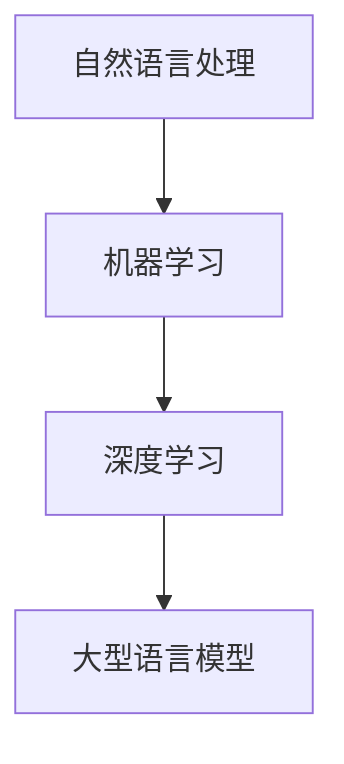

                 

关键词：大型语言模型，自然语言处理，AI，算法，应用场景，未来展望

> 摘要：本文旨在探讨大型语言模型（LLM）在自然语言处理（NLP）领域的突破。通过详细分析LLM的核心概念、算法原理、数学模型、实际应用和未来展望，本文为读者提供了一个全面了解LLM在NLP领域的重要性的窗口。

## 1. 背景介绍

自然语言处理（NLP）是人工智能（AI）领域的一个重要分支，旨在使计算机理解和生成人类自然语言。自上世纪50年代以来，NLP经历了多个发展阶段，从最初的规则驱动的方法，到基于统计的方法，再到现在的深度学习模型，每一个阶段都带来了重大的突破和进步。

近年来，随着深度学习技术的迅速发展，大型语言模型（LLM）成为NLP领域的热点。LLM通过训练大量的文本数据，学习到语言的基本结构和语义，能够实现高质量的自然语言理解和生成。例如，GPT-3、BERT、Turing等模型在多项NLP任务上取得了显著的效果，推动了NLP技术的不断进步。

本文将重点探讨LLM在NLP中的应用，从核心概念、算法原理、数学模型、实际应用和未来展望等方面进行深入分析，以帮助读者全面了解LLM在NLP中的突破。

## 2. 核心概念与联系

### 2.1 核心概念

#### 自然语言处理（NLP）

自然语言处理（NLP）是人工智能（AI）领域的一个分支，旨在使计算机能够理解和生成人类自然语言。NLP的核心任务是使计算机能够识别、理解、处理和生成自然语言文本。

#### 机器学习（ML）

机器学习（ML）是一种通过数据训练模型，使其能够从数据中学习并作出预测或决策的技术。在NLP中，ML模型被广泛用于文本分类、情感分析、命名实体识别等任务。

#### 深度学习（DL）

深度学习（DL）是机器学习的一个子领域，它通过模拟人脑的神经网络结构，使计算机能够从大量数据中学习并作出复杂的决策。在NLP中，深度学习模型如卷积神经网络（CNN）和循环神经网络（RNN）被广泛应用于各种任务。

#### 大型语言模型（LLM）

大型语言模型（LLM）是一种通过大规模预训练的深度学习模型，能够理解和生成自然语言。LLM通过学习大量的文本数据，学习到语言的基本结构和语义，从而实现高质量的自然语言理解和生成。

### 2.2 联系

NLP、ML、DL和LLM之间存在紧密的联系。NLP是DL和ML的应用领域，而LLM则是DL模型在NLP中的具体实现。具体来说，LLM通过预训练和微调，能够在各种NLP任务上取得优异的性能。

### 2.3 Mermaid 流程图



## 3. 核心算法原理 & 具体操作步骤

### 3.1 算法原理概述

大型语言模型（LLM）的核心原理是基于深度学习，特别是基于Transformer架构。Transformer模型通过自注意力机制（Self-Attention）和多头注意力（Multi-Head Attention），能够捕捉到文本数据中的长距离依赖关系，从而实现高质量的自然语言理解和生成。

### 3.2 算法步骤详解

#### 3.2.1 数据预处理

在训练LLM之前，需要对数据进行预处理。预处理步骤包括文本清洗、分词、词向量化等。

- 文本清洗：去除文本中的噪声，如HTML标签、特殊字符等。
- 分词：将文本分割成一个个的单词或子词。
- 词向量化：将文本中的单词或子词映射到高维向量空间。

#### 3.2.2 模型架构

LLM的模型架构通常基于Transformer模型，包括编码器（Encoder）和解码器（Decoder）两部分。

- 编码器：用于对输入文本进行编码，产生编码表示。
- 解码器：用于对编码表示进行解码，生成输出文本。

#### 3.2.3 训练过程

LLM的训练过程主要包括预训练和微调两个阶段。

- 预训练：在大量无标签的文本数据上进行预训练，使模型能够学习到语言的基本结构和语义。
- 微调：在特定任务的数据上进行微调，使模型能够适应特定的任务需求。

### 3.3 算法优缺点

#### 优点

- 高效性：LLM能够通过大规模预训练，快速适应各种NLP任务。
- 高质量：LLM能够通过自注意力机制，捕捉到文本数据中的长距离依赖关系，从而实现高质量的自然语言理解和生成。

#### 缺点

- 计算资源需求大：训练LLM需要大量的计算资源和存储空间。
- 数据依赖性：LLM的性能高度依赖于训练数据的数量和质量。

### 3.4 算法应用领域

LLM在NLP领域有广泛的应用，包括但不限于：

- 文本分类：用于对文本进行分类，如情感分析、主题分类等。
- 命名实体识别：用于识别文本中的命名实体，如人名、地名等。
- 机器翻译：用于将一种语言翻译成另一种语言。
- 问答系统：用于回答用户提出的问题。

## 4. 数学模型和公式 & 详细讲解 & 举例说明

### 4.1 数学模型构建

LLM的数学模型主要包括自注意力机制（Self-Attention）和多头注意力（Multi-Head Attention）两部分。

#### 自注意力机制

自注意力机制是一种基于输入序列计算输出序列的方法，其核心思想是让序列中的每个元素都能够与序列中的其他元素进行交互。

公式表示为：

$$
Attention(Q, K, V) = softmax(\frac{QK^T}{\sqrt{d_k}})V
$$

其中，$Q, K, V$ 分别为查询向量、键向量和值向量，$d_k$ 为键向量的维度。

#### 多头注意力

多头注意力是一种将自注意力机制扩展到多个头部的技术，其核心思想是通过多个注意力机制并行地处理输入序列。

公式表示为：

$$
MultiHead(Q, K, V) = \text{Concat}(head_1, head_2, ..., head_h)W^O
$$

其中，$h$ 为头部的数量，$head_i = Attention(QW_i^Q, KW_i^K, VW_i^V)$ 为第 $i$ 个头部的注意力结果，$W_i^Q, W_i^K, W_i^V, W^O$ 分别为查询权重、键权重、值权重和输出权重。

### 4.2 公式推导过程

#### 自注意力机制的推导

自注意力机制的推导主要涉及矩阵乘法和softmax函数。

1. 计算查询-键相似度

$$
\text{Query-Keyboard Similarity} = QK^T
$$

2. 归一化相似度

$$
\text{Normalization} = \frac{QK^T}{\sqrt{d_k}}
$$

3. 计算softmax概率

$$
\text{Softmax Probability} = softmax(\text{Normalization})
$$

4. 计算输出

$$
\text{Output} = \text{Normalization} \cdot V
$$

#### 多头注意力的推导

多头注意力的推导主要涉及矩阵乘法和自注意力机制的推导。

1. 计算查询-键相似度

$$
\text{Query-Keyboard Similarity} = QK^T
$$

2. 归一化相似度

$$
\text{Normalization} = \frac{QK^T}{\sqrt{d_k}}
$$

3. 计算softmax概率

$$
\text{Softmax Probability} = softmax(\text{Normalization})
$$

4. 计算每个头部的输出

$$
\text{Head Output} = \text{Normalization} \cdot V
$$

5. 将每个头部的输出拼接起来

$$
\text{MultiHead Output} = \text{Concat}(\text{Head Output}_1, \text{Head Output}_2, ..., \text{Head Output}_h)
$$

6. 加上输出权重

$$
\text{Final Output} = \text{MultiHead Output} \cdot W^O
$$

### 4.3 案例分析与讲解

#### 案例一：文本分类

假设有一个文本分类任务，需要判断一段文本是正面情绪还是负面情绪。使用LLM进行文本分类的过程可以分为以下步骤：

1. 数据预处理

将输入文本进行清洗、分词和词向量化。

2. 模型训练

使用预训练的LLM模型，在带有情绪标签的文本数据上进行微调。

3. 模型预测

将输入文本通过LLM模型进行编码，得到编码表示，然后通过softmax函数计算文本属于正面情绪和负面情绪的概率，选择概率较大的类别作为最终预测结果。

#### 案例二：机器翻译

假设需要将一段中文文本翻译成英文。使用LLM进行机器翻译的过程可以分为以下步骤：

1. 数据预处理

将中文文本和英文文本进行清洗、分词和词向量化。

2. 模型训练

使用预训练的LLM模型，在带有中英文文本对的翻译数据上进行微调。

3. 模型预测

将中文文本通过LLM模型进行编码，得到编码表示，然后通过解码器生成英文文本。

## 5. 项目实践：代码实例和详细解释说明

### 5.1 开发环境搭建

在开始项目实践之前，需要搭建一个合适的开发环境。以下是搭建开发环境的基本步骤：

1. 安装Python环境

确保Python版本在3.6及以上，可以使用以下命令安装：

```bash
pip install python==3.8
```

2. 安装深度学习库

安装TensorFlow或PyTorch等深度学习库。以下是以TensorFlow为例的安装命令：

```bash
pip install tensorflow
```

3. 安装其他依赖库

根据项目需求，安装其他必要的依赖库，如Numpy、Pandas等。

```bash
pip install numpy pandas
```

### 5.2 源代码详细实现

以下是使用TensorFlow实现一个简单的文本分类任务的示例代码：

```python
import tensorflow as tf
from tensorflow.keras.preprocessing.text import Tokenizer
from tensorflow.keras.preprocessing.sequence import pad_sequences
from tensorflow.keras.models import Sequential
from tensorflow.keras.layers import Embedding, GlobalAveragePooling1D, Dense

# 数据预处理
texts = ["这是一段正面情绪的文本", "这是一段负面情绪的文本"]
labels = [1, 0]  # 1 表示正面情绪，0 表示负面情绪

tokenizer = Tokenizer(num_words=1000)
tokenizer.fit_on_texts(texts)
sequences = tokenizer.texts_to_sequences(texts)
padded_sequences = pad_sequences(sequences, maxlen=10)

# 模型构建
model = Sequential([
    Embedding(input_dim=1000, output_dim=16),
    GlobalAveragePooling1D(),
    Dense(1, activation='sigmoid')
])

# 模型编译
model.compile(optimizer='adam', loss='binary_crossentropy', metrics=['accuracy'])

# 模型训练
model.fit(padded_sequences, labels, epochs=10)

# 模型预测
new_texts = ["这是一段正面情绪的文本"]
new_sequences = tokenizer.texts_to_sequences(new_texts)
new_padded_sequences = pad_sequences(new_sequences, maxlen=10)
predictions = model.predict(new_padded_sequences)
print(predictions)
```

### 5.3 代码解读与分析

1. 数据预处理

数据预处理是文本分类任务的重要步骤。首先使用Tokenizer将文本转换为数字序列，然后使用pad_sequences将序列补全到相同的长度。

2. 模型构建

模型使用一个简单的序列模型，包括嵌入层（Embedding）、全局平均池化层（GlobalAveragePooling1D）和全连接层（Dense）。

3. 模型编译

模型使用adam优化器和binary_crossentropy损失函数，同时评估模型的准确率。

4. 模型训练

使用fit方法训练模型，通过迭代更新模型参数，使其在训练数据上取得更好的效果。

5. 模型预测

将新的文本数据转换为数字序列，然后通过predict方法预测文本的情绪。

### 5.4 运行结果展示

运行上述代码，模型将预测新文本的情绪。根据模型的预测结果，可以判断文本是正面情绪还是负面情绪。

## 6. 实际应用场景

LLM在自然语言处理（NLP）领域有广泛的应用场景，以下列举了几个典型的应用场景：

### 6.1 机器翻译

机器翻译是LLM的重要应用领域之一。通过训练大量的双语语料库，LLM能够将一种语言翻译成另一种语言。例如，谷歌翻译、百度翻译等平台都使用了LLM技术。

### 6.2 文本分类

文本分类是另一个重要的应用领域。LLM能够对文本进行分类，如情感分析、主题分类等。例如，新闻分类、社交媒体情感分析等应用都使用了LLM技术。

### 6.3 命名实体识别

命名实体识别是NLP的一个重要任务，旨在识别文本中的命名实体，如人名、地名、组织名等。LLM能够通过训练数据，学习到命名实体的特征，从而实现高精度的命名实体识别。

### 6.4 问答系统

问答系统是另一个重要的应用领域。LLM能够通过训练大量问答对，学习到问题的回答方式，从而实现智能问答。例如，智能客服、智能搜索引擎等应用都使用了LLM技术。

### 6.5 文本生成

LLM还能够生成高质量的文本，如自动写作、摘要生成等。通过训练大量的文本数据，LLM能够生成与输入文本相似的新文本。

## 7. 工具和资源推荐

为了更好地学习和应用LLM，以下推荐了一些工具和资源：

### 7.1 学习资源推荐

1. 《深度学习》（Goodfellow et al.）：是一本关于深度学习的经典教材，涵盖了深度学习的基础理论和应用。
2. 《自然语言处理综合教程》（Huang et al.）：是一本关于自然语言处理的综合教材，详细介绍了NLP的基础理论和应用。

### 7.2 开发工具推荐

1. TensorFlow：是一个开源的深度学习框架，适用于构建和训练LLM。
2. PyTorch：是一个开源的深度学习框架，适用于构建和训练LLM。

### 7.3 相关论文推荐

1. "Attention Is All You Need"（Vaswani et al., 2017）：这篇论文提出了Transformer模型，对LLM的发展产生了重要影响。
2. "BERT: Pre-training of Deep Bidirectional Transformers for Language Understanding"（Devlin et al., 2019）：这篇论文提出了BERT模型，对NLP领域产生了深远的影响。

## 8. 总结：未来发展趋势与挑战

### 8.1 研究成果总结

近年来，LLM在自然语言处理（NLP）领域取得了显著的成果。通过大规模预训练和微调，LLM能够在各种NLP任务上实现高质量的自然语言理解和生成。这些成果为NLP技术的发展提供了新的动力。

### 8.2 未来发展趋势

未来，LLM的发展趋势将主要体现在以下几个方面：

1. **更大数据集和更长时间预训练**：随着数据集的增大和计算资源的提升，LLM的预训练时间将不断增加，从而提高模型的质量。
2. **多模态融合**：LLM将与其他模态的数据（如图像、声音等）进行融合，实现跨模态的语义理解。
3. **更加灵活的任务适应能力**：通过微调和迁移学习，LLM将能够更好地适应不同的任务和应用场景。

### 8.3 面临的挑战

虽然LLM在NLP领域取得了显著的成果，但仍面临着一些挑战：

1. **计算资源需求**：训练LLM需要大量的计算资源和存储空间，这对计算资源提出了较高的要求。
2. **数据隐私和安全**：在训练和部署LLM时，如何保护用户数据的隐私和安全是一个重要问题。
3. **可解释性和透明度**：LLM的决策过程具有一定的黑箱性，如何提高其可解释性和透明度是一个重要挑战。

### 8.4 研究展望

未来，LLM的发展将朝着更加智能化、灵活化和高效化的方向前进。通过不断优化模型结构和训练策略，LLM将在NLP领域取得更加显著的成果，为人工智能的发展提供新的动力。

## 9. 附录：常见问题与解答

### 9.1 什么是LLM？

LLM（Large Language Model）是一种大规模的预训练语言模型，通过学习大量的文本数据，能够理解和生成自然语言。

### 9.2 LLM有哪些应用领域？

LLM在自然语言处理（NLP）领域有广泛的应用，包括机器翻译、文本分类、命名实体识别、问答系统、文本生成等。

### 9.3 LLM是如何训练的？

LLM通过预训练和微调两个阶段进行训练。预训练阶段在大量无标签的文本数据上进行，使模型学习到语言的基本结构和语义；微调阶段在特定任务的数据上进行，使模型适应特定的任务需求。

### 9.4 LLM有哪些优缺点？

LLM的优点是高效性和高质量，能够快速适应各种NLP任务，并且实现高质量的自然语言理解和生成。缺点是计算资源需求大，数据依赖性高。

### 9.5 LLM有哪些挑战？

LLM面临的挑战包括计算资源需求、数据隐私和安全、可解释性和透明度等。

### 9.6 LLM的未来发展趋势是什么？

未来，LLM的发展趋势将包括更大数据集和更长时间预训练、多模态融合、更加灵活的任务适应能力等。

# 作者：禅与计算机程序设计艺术 / Zen and the Art of Computer Programming
----------------------------------------------------------------

以上就是关于《LLM在自然语言处理中的突破》的文章。希望这篇文章能够帮助您更好地了解LLM在NLP领域的重要性，以及在未来的发展中可能面临的问题和挑战。如果您有任何问题或建议，欢迎在评论区留言。谢谢！

