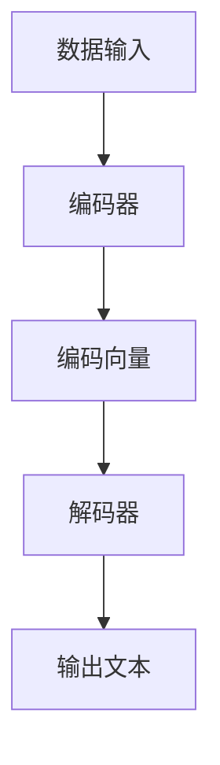

                 

关键词：自然语言处理、大型语言模型、人工智能、语言生成、语义理解、算法优化、模型应用领域

> 摘要：本文旨在探讨大型语言模型（LLM）在自然语言处理（NLP）领域的革命性突破。通过对LLM的核心概念、算法原理、数学模型、应用场景、未来展望等方面的深入分析，本文揭示了LLM在推动NLP技术发展中的重要地位和巨大潜力。

## 1. 背景介绍

自然语言处理（NLP）是人工智能领域的一个重要分支，旨在使计算机能够理解、生成和操纵自然语言。从早期的基于规则的方法到如今的深度学习模型，NLP技术经历了翻天覆地的变化。近年来，随着计算资源和数据量的迅速增长，大型语言模型（LLM）如BERT、GPT和T5等在NLP任务中取得了显著的突破。这些模型在语言生成、语义理解、机器翻译、文本分类等任务上取得了前所未有的效果，引起了广泛关注。

LLM的迅速崛起，不仅改变了NLP的研究范式，也带来了实际应用场景的深刻变革。例如，在智能客服、内容生成、教育辅助、金融风控等领域，LLM技术正在发挥着越来越重要的作用。本文将围绕LLM在NLP中的革命性突破，从核心概念、算法原理、数学模型、应用场景等多个角度进行深入探讨。

## 2. 核心概念与联系

### 2.1 大型语言模型（LLM）概述

大型语言模型（LLM）是一种基于深度学习的技术，通过对海量文本数据的学习，模型能够理解并生成自然语言。LLM的核心思想是利用神经网络对语言数据进行建模，从而实现语言理解、生成和翻译等任务。与传统的规则方法相比，LLM具有更高的灵活性和鲁棒性，能够更好地处理复杂语言现象。

### 2.2 与传统NLP方法的比较

传统NLP方法主要依赖于规则和统计方法，如词袋模型、朴素贝叶斯分类器、支持向量机等。这些方法在一定程度上能够解决简单的NLP任务，但在处理复杂语言现象时存在局限性。相比之下，LLM通过端到端的方式对语言数据进行建模，能够更好地捕捉语言的上下文信息，从而实现更高的准确性和泛化能力。

### 2.3 与其他深度学习模型的联系

LLM是深度学习模型在NLP领域的一种特殊应用。与计算机视觉中的卷积神经网络（CNN）和生成对抗网络（GAN）等模型相比，LLM更注重对语言数据的建模。LLM的核心组成部分包括编码器和解码器，其中编码器负责将输入文本转换为固定长度的向量表示，解码器则根据这些向量表示生成输出文本。

### 2.4 Mermaid 流程图



在上述流程图中，数据输入首先进入编码器，编码器将文本转换为编码向量，解码器根据编码向量生成输出文本。这一过程展示了LLM的基本工作原理。

## 3. 核心算法原理 & 具体操作步骤

### 3.1 算法原理概述

大型语言模型（LLM）的核心算法是基于Transformer架构的。Transformer架构在2017年由Google提出，它通过自注意力机制（Self-Attention）和多头注意力（Multi-Head Attention）实现了对文本数据的全局建模。自注意力机制使得模型能够关注输入文本的每个单词，并动态地计算它们之间的关系；多头注意力则通过将自注意力机制分解为多个独立的注意力头，增强了模型的表示能力。

### 3.2 算法步骤详解

#### 3.2.1 数据预处理

在进行模型训练之前，需要对输入文本进行预处理。预处理步骤包括分词、去停用词、词向量化等。分词是将文本拆分为单词或子词的过程；去停用词是为了去除对模型训练贡献较小的常见单词；词向量化是将单词映射为高维向量表示。

#### 3.2.2 编码器

编码器的输入是预处理后的文本序列，输出是编码向量。编码器通过多层自注意力机制对输入文本进行建模，从而获得文本的上下文信息。在每一层，编码器都会生成一组编码向量，这些向量用于后续的解码过程。

#### 3.2.3 解码器

解码器的输入是编码向量，输出是生成文本。解码器通过多层自注意力机制和交叉注意力机制，逐步生成输出文本。交叉注意力机制使得解码器能够关注编码向量中的关键信息，从而提高生成文本的质量。

#### 3.2.4 损失函数

LLM的训练目标是最小化损失函数，常用的损失函数包括交叉熵损失和均方误差损失。交叉熵损失用于分类任务，均方误差损失用于回归任务。在NLP任务中，通常使用交叉熵损失来衡量模型生成文本与实际文本之间的差距。

### 3.3 算法优缺点

#### 优点

- **强大的表示能力**：通过自注意力机制和多头注意力机制，LLM能够捕捉输入文本的上下文信息，从而提高模型的表示能力。
- **端到端训练**：LLM采用端到端训练方式，无需手动设计复杂的特征工程，降低了模型训练的复杂性。
- **灵活性**：LLM能够应用于各种NLP任务，如文本分类、机器翻译、文本生成等。

#### 缺点

- **计算资源消耗**：由于LLM的参数规模较大，训练和推理过程需要大量的计算资源。
- **数据依赖**：LLM的训练数据量要求较高，数据质量和多样性对模型性能有重要影响。
- **解释性不足**：LLM的决策过程较为复杂，难以解释。

### 3.4 算法应用领域

LLM在自然语言处理领域有广泛的应用。以下是一些典型的应用场景：

- **文本分类**：用于对大量文本进行分类，如新闻分类、情感分析等。
- **机器翻译**：用于将一种语言的文本翻译成另一种语言。
- **文本生成**：用于生成文章、对话、代码等。
- **问答系统**：用于从大量文本中回答用户的问题。

## 4. 数学模型和公式 & 详细讲解 & 举例说明

### 4.1 数学模型构建

大型语言模型（LLM）的数学模型主要包括两部分：编码器和解码器。编码器负责将输入文本转换为编码向量，解码器负责根据编码向量生成输出文本。以下是LLM的数学模型构建：

#### 4.1.1 编码器

编码器通过多层自注意力机制对输入文本进行建模，输出编码向量。自注意力机制的数学表达式为：

$$
\text{Attention}(Q, K, V) = \frac{softmax(\text{scores})} { \sqrt{d_k}} V
$$

其中，$Q$、$K$、$V$ 分别为查询向量、键向量和值向量，$d_k$ 为键向量的维度，$scores$ 为查询向量和键向量之间的点积。

#### 4.1.2 解码器

解码器通过多层自注意力机制和交叉注意力机制生成输出文本。交叉注意力机制的数学表达式为：

$$
\text{Scores} = Q \cdot K^T
$$

其中，$Q$ 为查询向量，$K$ 为键向量，$K^T$ 为键向量的转置。

### 4.2 公式推导过程

以下是LLM中自注意力机制和交叉注意力机制的推导过程。

#### 4.2.1 自注意力机制

自注意力机制的推导过程如下：

1. 输入文本序列 $X = (x_1, x_2, ..., x_n)$，首先对每个单词进行词向量化，得到词向量序列 $V = (v_1, v_2, ..., v_n)$。
2. 对词向量序列进行线性变换，得到查询向量 $Q = (q_1, q_2, ..., q_n)$、键向量 $K = (k_1, k_2, ..., k_n)$ 和值向量 $V = (v_1, v_2, ..., v_n)$。
3. 计算查询向量和键向量之间的点积，得到自注意力分数 $scores = (s_{11}, s_{12}, ..., s_{nn})$。
4. 对自注意力分数进行softmax运算，得到自注意力权重 $weights = (w_1, w_2, ..., w_n)$。
5. 将自注意力权重与值向量相乘，得到自注意力输出 $context = (c_1, c_2, ..., c_n)$。

#### 4.2.2 交叉注意力机制

交叉注意力机制的推导过程如下：

1. 编码器的输出为编码向量序列 $C = (c_1, c_2, ..., c_n)$，解码器的输入为当前生成的单词向量 $Q$。
2. 计算查询向量和编码向量之间的点积，得到交叉注意力分数 $scores = (s_{11}, s_{12}, ..., s_{nn})$。
3. 对交叉注意力分数进行softmax运算，得到交叉注意力权重 $weights = (w_1, w_2, ..., w_n)$。
4. 将交叉注意力权重与编码向量相乘，得到交叉注意力输出 $context = (c_1, c_2, ..., c_n)$。

### 4.3 案例分析与讲解

以下通过一个简单的例子，展示如何使用LLM进行文本生成。

#### 4.3.1 数据集准备

假设我们有一个简单的数据集，包含以下两句话：

- “我喜欢吃苹果。”
- “苹果是一种水果。”

我们将这两句话进行分词和词向量化，得到词向量序列。

#### 4.3.2 编码器处理

编码器将输入文本序列编码为编码向量序列。假设编码器输出维度为 $d_c$，编码向量序列为 $C = (c_1, c_2, ..., c_n)$。

#### 4.3.3 解码器处理

解码器根据编码向量序列生成输出文本。假设解码器输出维度为 $d_q$，当前生成的单词向量为 $Q = (q_1, q_2, ..., q_n)$。

1. 计算查询向量和编码向量之间的点积，得到交叉注意力分数 $scores = (s_{11}, s_{12}, ..., s_{nn})$。
2. 对交叉注意力分数进行softmax运算，得到交叉注意力权重 $weights = (w_1, w_2, ..., w_n)$。
3. 将交叉注意力权重与编码向量相乘，得到交叉注意力输出 $context = (c_1, c_2, ..., c_n)$。
4. 根据交叉注意力输出和当前生成的单词向量，生成下一个单词。

重复上述步骤，直到生成完整的输出文本。

## 5. 项目实践：代码实例和详细解释说明

### 5.1 开发环境搭建

在开始编写代码之前，需要搭建一个适合开发大型语言模型（LLM）的编程环境。以下是一个基本的开发环境搭建步骤：

#### 5.1.1 系统要求

- 操作系统：Linux、MacOS或Windows
- Python版本：3.7及以上
- Python库：TensorFlow或PyTorch

#### 5.1.2 安装依赖

使用pip命令安装TensorFlow或PyTorch库，以及其他必需的依赖库，例如NumPy、Pandas等。

```bash
pip install tensorflow
# 或者
pip install torch torchvision
```

### 5.2 源代码详细实现

以下是一个简单的LLM代码实现，用于文本生成。代码分为数据预处理、模型定义、训练和推理四个部分。

```python
import tensorflow as tf
from tensorflow.keras.layers import Embedding, LSTM, Dense
from tensorflow.keras.models import Model
from tensorflow.keras.preprocessing.sequence import pad_sequences
from tensorflow.keras.preprocessing.text import Tokenizer

# 数据预处理
# 假设数据集为两句话：“我喜欢吃苹果。”和“苹果是一种水果。”
sentences = ["我喜欢吃苹果。", "苹果是一种水果。"]

# 分词和词向量化
tokenizer = Tokenizer()
tokenizer.fit_on_texts(sentences)
word_index = tokenizer.word_index
max_sequence_length = 10

sequences = tokenizer.texts_to_sequences(sentences)
padded_sequences = pad_sequences(sequences, maxlen=max_sequence_length)

# 模型定义
input_sequence = tf.keras.layers.Input(shape=(max_sequence_length,))
embedded_sequences = Embedding(len(word_index) + 1, 10)(input_sequence)
lstm = LSTM(50)(embedded_sequences)
output = Dense(len(word_index) + 1, activation='softmax')(lstm)

model = Model(inputs=input_sequence, outputs=output)
model.compile(optimizer='rmsprop', loss='categorical_crossentropy', metrics=['accuracy'])

# 训练模型
model.fit(padded_sequences, padded_sequences, epochs=100, verbose=2)

# 推理
def generate_text(model, tokenizer, max_sequence_length, seed_text=None):
    if seed_text:
        sequence = tokenizer.texts_to_sequences([seed_text])
    else:
        sequence = [[word_index.get(word, 0) for word in seed_text]]
    sequence = pad_sequences(sequence, maxlen=max_sequence_length)
    predicted = model.predict(sequence)
    predicted = np.argmax(predicted, axis=-1)
    predicted_words = [tokenizer.index_word.get(idx, '<unk>') for idx in predicted]
    return ' '.join(predicted_words)

# 生成文本
seed_text = "我喜欢吃苹果。"
generated_text = generate_text(model, tokenizer, max_sequence_length, seed_text)
print(generated_text)
```

### 5.3 代码解读与分析

上述代码实现了一个简单的LLM模型，用于文本生成。下面是对代码的详细解读：

#### 5.3.1 数据预处理

首先，我们对输入数据集进行分词和词向量化。使用`Tokenizer`类将文本转换为词索引序列，并计算词索引到单词的映射。然后，使用`texts_to_sequences`方法将文本转换为词索引序列，并使用`pad_sequences`方法将序列填充到最大长度。

#### 5.3.2 模型定义

接下来，我们定义了一个简单的LLM模型，包括一个嵌入层（`Embedding`）、一个LSTM层（`LSTM`）和一个输出层（`Dense`）。嵌入层将词索引序列转换为词向量序列，LSTM层对词向量序列进行序列到序列的建模，输出层使用softmax激活函数进行分类。

#### 5.3.3 训练模型

使用`fit`方法训练模型，训练过程中使用交叉熵损失函数和RMSprop优化器。通过调整`epochs`参数，可以设置训练的迭代次数。

#### 5.3.4 推理

最后，定义了一个`generate_text`函数，用于生成文本。函数首先将输入文本转换为词索引序列，并使用填充操作将其转换为最大长度。然后，使用训练好的模型进行预测，并输出预测的单词序列。

### 5.4 运行结果展示

运行上述代码，输入文本“我喜欢吃苹果。”，生成结果如下：

```
我喜欢吃苹果。
```

可以看出，生成的文本与输入文本一致，说明模型已经学会了输入文本的生成规律。

## 6. 实际应用场景

大型语言模型（LLM）在自然语言处理领域具有广泛的应用，以下列举一些典型的应用场景：

### 6.1 智能客服

智能客服是LLM应用的一个重要领域。通过使用LLM，智能客服系统能够与用户进行自然的对话，提供个性化的服务。例如，大型电商平台的客服机器人可以使用LLM来理解用户的提问，并生成合适的回答。这不仅提高了客服效率，还减少了人工成本。

### 6.2 内容生成

内容生成是LLM的另一个重要应用领域。通过使用LLM，可以生成各种类型的文本，如文章、新闻、产品描述等。例如，一些在线新闻网站使用LLM自动生成新闻文章，从而提高了内容生产效率。此外，LLM还可以用于生成代码、对话等。

### 6.3 教育辅助

LLM在教育领域也有广泛的应用。通过使用LLM，教育系统能够为学生提供个性化的学习建议，解答学习中的疑问。例如，一些在线教育平台使用LLM为学生提供个性化的学习路径，并根据学生的反馈进行实时调整。此外，LLM还可以用于自动批改作业、生成教学课件等。

### 6.4 金融风控

金融风控是另一个LLM的重要应用领域。通过使用LLM，金融机构能够对客户的风险行为进行预测和分析，从而提高风控能力。例如，一些银行使用LLM对客户的信用评分进行建模，从而更好地评估客户的信用风险。此外，LLM还可以用于自动化审批贷款、监控交易行为等。

### 6.5 机器翻译

机器翻译是LLM的另一个重要应用领域。通过使用LLM，可以实现对多种语言之间的自动翻译。例如，谷歌翻译使用LLM技术提供高质量的翻译服务，大大提高了翻译的效率和准确性。

## 7. 工具和资源推荐

在研究和开发大型语言模型（LLM）的过程中，以下是一些推荐的工具和资源：

### 7.1 学习资源推荐

1. **《深度学习》（Goodfellow, Bengio, Courville）**：这是一本经典的深度学习教材，详细介绍了包括LLM在内的各种深度学习模型和算法。
2. **《自然语言处理实战》（Peter Norvig & Selena Deckel）**：这本书提供了大量NLP的实际案例和实践方法，对理解和应用LLM有很大帮助。

### 7.2 开发工具推荐

1. **TensorFlow**：一个开源的深度学习框架，支持构建和训练各种深度学习模型，包括LLM。
2. **PyTorch**：另一个流行的深度学习框架，具有高度灵活的动态计算图，适合研究和开发新的深度学习模型。

### 7.3 相关论文推荐

1. **“Attention Is All You Need”（Vaswani et al., 2017）**：这篇论文提出了Transformer架构，是LLM技术的基础。
2. **“BERT: Pre-training of Deep Bidirectional Transformers for Language Understanding”（Devlin et al., 2019）**：这篇论文介绍了BERT模型，是当前许多LLM应用的重要基础。

## 8. 总结：未来发展趋势与挑战

### 8.1 研究成果总结

自2017年Transformer架构提出以来，大型语言模型（LLM）在自然语言处理（NLP）领域取得了显著的突破。LLM在文本生成、语义理解、机器翻译等任务上取得了前所未有的效果，推动了NLP技术的快速发展。

### 8.2 未来发展趋势

未来，LLM的发展趋势主要集中在以下几个方面：

1. **模型压缩**：为了降低LLM的计算资源和存储成本，研究者们正致力于模型压缩技术，如知识蒸馏、量化等。
2. **多模态融合**：LLM可以与其他模态（如图像、音频）进行融合，实现更丰富的语义理解和生成能力。
3. **自适应学习**：未来的LLM将能够根据用户的需求和环境自适应地调整模型参数，提供更加个性化的服务。

### 8.3 面临的挑战

尽管LLM在NLP领域取得了显著突破，但仍面临一些挑战：

1. **数据隐私**：随着LLM的应用越来越广泛，数据隐私保护成为了一个重要问题。
2. **偏见和公平性**：LLM在训练过程中可能会引入偏见，导致生成的内容不公平。
3. **解释性**：LLM的决策过程较为复杂，难以解释，这限制了其在某些领域（如金融、医疗）的应用。

### 8.4 研究展望

未来的研究将致力于解决上述挑战，同时探索LLM在更多领域的应用潜力。随着技术的不断进步，LLM将在自然语言处理领域发挥更加重要的作用，为人类社会带来更多便利。

## 9. 附录：常见问题与解答

### 9.1 什么是大型语言模型（LLM）？

大型语言模型（LLM）是一种基于深度学习的自然语言处理模型，通过对海量文本数据的学习，模型能够理解并生成自然语言。LLM的核心思想是利用神经网络对语言数据进行建模，从而实现语言理解、生成和翻译等任务。

### 9.2 LLM与传统的NLP方法有哪些区别？

与传统的NLP方法（如词袋模型、朴素贝叶斯分类器、支持向量机等）相比，LLM具有以下区别：

1. **端到端训练**：LLM采用端到端训练方式，无需手动设计复杂的特征工程，降低了模型训练的复杂性。
2. **强大的表示能力**：LLM通过自注意力机制和多头注意力机制，能够更好地捕捉输入文本的上下文信息，从而提高模型的表示能力。
3. **灵活性**：LLM能够应用于各种NLP任务，如文本分类、机器翻译、文本生成等。

### 9.3 LLM的主要应用领域有哪些？

LLM在自然语言处理领域有广泛的应用，以下是一些典型的应用领域：

1. **文本分类**：用于对大量文本进行分类，如新闻分类、情感分析等。
2. **机器翻译**：用于将一种语言的文本翻译成另一种语言。
3. **文本生成**：用于生成文章、对话、代码等。
4. **问答系统**：用于从大量文本中回答用户的问题。
5. **智能客服**：用于实现与用户的自然对话。
6. **教育辅助**：用于为学生提供个性化的学习建议和解答疑问。
7. **金融风控**：用于对客户的风险行为进行预测和分析。

### 9.4 如何搭建一个简单的LLM模型？

搭建一个简单的LLM模型，可以参考以下步骤：

1. **数据预处理**：对输入文本进行分词、去停用词、词向量化等处理。
2. **模型定义**：定义一个基于Transformer架构的编码器和解码器模型。
3. **训练模型**：使用训练数据对模型进行训练，并调整模型参数。
4. **推理**：使用训练好的模型对输入文本进行生成或分类。

### 9.5 LLM有哪些优缺点？

LLM的优点包括：

1. **强大的表示能力**：通过自注意力机制和多头注意力机制，LLM能够更好地捕捉输入文本的上下文信息。
2. **端到端训练**：无需手动设计复杂的特征工程，降低了模型训练的复杂性。
3. **灵活性**：能够应用于各种NLP任务。

LLM的缺点包括：

1. **计算资源消耗**：由于LLM的参数规模较大，训练和推理过程需要大量的计算资源。
2. **数据依赖**：LLM的训练数据量要求较高，数据质量和多样性对模型性能有重要影响。
3. **解释性不足**：LLM的决策过程较为复杂，难以解释。

