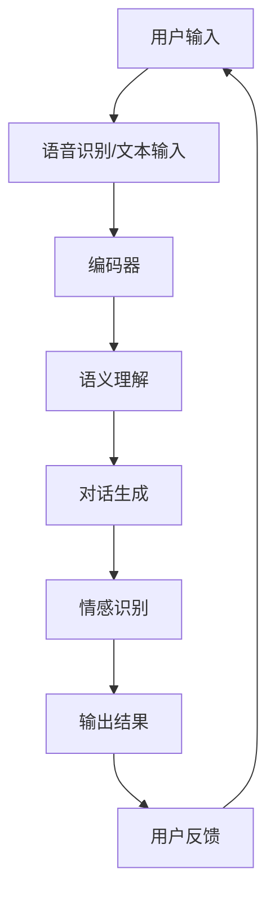

                 

 **关键词**：大型语言模型（LLM）、虚拟助手、对话系统、自然语言处理、人工智能

**摘要**：本文旨在探讨大型语言模型（LLM）在虚拟助手中的应用，分析其核心原理、算法实现和实际应用场景，并展望未来的发展趋势与挑战。通过详细的数学模型讲解、代码实例解析以及未来应用场景的探讨，本文为读者呈现了一幅关于LLM在虚拟助手领域的前景与挑战的全景图。

## 1. 背景介绍

随着人工智能技术的不断发展，虚拟助手作为其重要应用之一，已经逐渐渗透到我们的日常生活中。从最初的简单问答机器人，到如今能够进行多轮对话、理解复杂指令的智能助手，虚拟助手的技术演进速度令人惊叹。然而，虚拟助手的发展仍然面临诸多挑战，如自然语言理解、对话生成、情感识别等。

近年来，大型语言模型（LLM）的出现为虚拟助手的发展带来了新的契机。LLM是一种基于深度学习的语言处理模型，具有强大的文本生成和语义理解能力。LLM的应用使得虚拟助手能够更好地模拟人类的交流方式，提高用户体验和满意度。本文将围绕LLM在虚拟助手中的应用，探讨其核心原理、算法实现和实际应用场景，以及未来的发展趋势和挑战。

## 2. 核心概念与联系

### 2.1 大型语言模型（LLM）

大型语言模型（LLM）是一种基于深度学习的自然语言处理模型，通过对海量文本数据进行训练，学习到语言的结构和语义，从而实现文本生成、语义理解、情感分析等功能。LLM的核心结构通常包括编码器（Encoder）和解码器（Decoder），其中编码器负责将输入文本编码成向量表示，解码器则负责生成文本输出。

### 2.2 对话系统

对话系统（Dialogue System）是一种与人类用户进行自然语言交互的计算机系统，包括语音识别、自然语言理解、对话生成和情感识别等多个模块。对话系统的目标是模拟人类的交流方式，实现自然、流畅、有意义的对话。

### 2.3 自然语言处理（NLP）

自然语言处理（NLP）是人工智能领域的一个重要分支，旨在使计算机能够理解、处理和生成自然语言。NLP包括文本分类、情感分析、命名实体识别、机器翻译等多个子领域，为虚拟助手提供了丰富的技术支持。

### 2.4 Mermaid 流程图

以下是LLM在虚拟助手中的应用架构的Mermaid流程图：



## 3. 核心算法原理 & 具体操作步骤

### 3.1 算法原理概述

LLM在虚拟助手中的应用主要基于以下核心算法：

1. 编码器-解码器（Encoder-Decoder）架构：编码器将输入文本编码成向量表示，解码器则根据编码器的输出生成文本输出。

2. 自注意力机制（Self-Attention）：自注意力机制使得模型能够自动地关注输入文本中的重要信息，提高语义理解能力。

3. 生成式模型（Generative Model）：生成式模型通过预测下一个单词的概率分布，生成自然流畅的文本。

### 3.2 算法步骤详解

1. 用户输入：用户通过语音或文本输入与虚拟助手进行交互。

2. 语音识别/文本输入：虚拟助手将用户输入的语音转换为文本，以便后续处理。

3. 编码器：编码器将输入文本编码成向量表示，作为解码器的输入。

4. 语义理解：解码器根据编码器的输出，结合上下文信息，对输入文本进行语义理解。

5. 对话生成：解码器根据语义理解结果，生成自然流畅的文本输出。

6. 情感识别：通过情感识别模块，分析用户输入和输出文本的情感倾向。

7. 输出结果：虚拟助手将生成的文本输出给用户，并根据用户反馈进行迭代优化。

### 3.3 算法优缺点

#### 优点：

1. 强大的文本生成和语义理解能力，能够生成自然流畅的对话。

2. 自注意力机制提高了模型的语义理解能力，有助于捕捉上下文信息。

3. 生成式模型使得虚拟助手能够根据用户需求生成个性化的对话内容。

#### 缺点：

1. 训练时间较长，对计算资源要求较高。

2. 在处理长文本时，模型容易产生失真的现象。

3. 情感识别能力有限，难以准确捕捉用户情感。

### 3.4 算法应用领域

LLM在虚拟助手中的应用广泛，如：

1. 聊天机器人：与用户进行多轮对话，提供娱乐、咨询、建议等服务。

2. 客户服务：自动回答用户常见问题，提高客服效率。

3. 教育辅导：为学生提供个性化学习建议和辅导。

4. 健康咨询：为用户提供健康建议和疾病咨询。

## 4. 数学模型和公式 & 详细讲解 & 举例说明

### 4.1 数学模型构建

LLM的数学模型主要包括编码器、解码器和自注意力机制。以下是相关数学公式的推导：

#### 编码器

编码器输入：\[ X = [x_1, x_2, \ldots, x_T] \] （输入序列）

编码器输出：\[ E = [e_1, e_2, \ldots, e_T] \] （编码后的向量表示）

编码器计算：\[ e_t = f(E_{<t}, H) \]

其中，\( f \) 为编码函数，\( E_{<t} \) 为输入序列前 \( t-1 \) 个词的编码结果，\( H \) 为自注意力权重。

#### 解码器

解码器输入：\[ Y = [y_1, y_2, \ldots, y_T] \] （目标序列）

解码器输出：\[ D = [d_1, d_2, \ldots, d_T] \] （解码后的向量表示）

解码器计算：\[ d_t = g(D_{<t}, H) \]

其中，\( g \) 为解码函数，\( D_{<t} \) 为输入序列前 \( t-1 \) 个词的解码结果，\( H \) 为自注意力权重。

#### 自注意力机制

自注意力权重计算：\[ H_t = \text{softmax}(\frac{E_t^T A}{\sqrt{d}}) \]

其中，\( A \) 为自注意力矩阵，\( d \) 为注意力维度。

### 4.2 公式推导过程

#### 编码器

编码器输入：\[ X = [x_1, x_2, \ldots, x_T] \]

首先，将输入序列进行词嵌入：\[ X' = [x_1', x_2', \ldots, x_T'] \]

其中，\( x_i' = \text{embedding}(x_i) \) 为词嵌入向量。

然后，对词嵌入向量进行变换：\[ E' = [e_1', e_2', \ldots, e_T'] \]

其中，\( e_i' = f(x_i', E'_{<i}) \)

最后，将变换后的向量进行归一化：\[ E = \frac{E'}{\lVert E' \rVert_2} \]

#### 解码器

解码器输入：\[ Y = [y_1, y_2, \ldots, y_T] \]

首先，将目标序列进行词嵌入：\[ Y' = [y_1', y_2', \ldots, y_T'] \]

其中，\( y_i' = \text{embedding}(y_i) \) 为词嵌入向量。

然后，对词嵌入向量进行变换：\[ D' = [d_1', d_2', \ldots, d_T'] \]

其中，\( d_i' = g(y_i', D'_{<i}) \)

最后，将变换后的向量进行归一化：\[ D = \frac{D'}{\lVert D' \rVert_2} \]

#### 自注意力机制

自注意力权重计算：\[ H_t = \text{softmax}(\frac{E_t^T A}{\sqrt{d}}) \]

其中，\( A \) 为自注意力矩阵，\( d \) 为注意力维度。

### 4.3 案例分析与讲解

假设有一个对话场景，用户输入：“明天天气怎么样？”，虚拟助手需要生成合适的回答。

1. 语音识别/文本输入：用户输入“明天天气怎么样？”

2. 编码器：将输入文本编码成向量表示

   编码器输入：\[ X = [x_1, x_2, \ldots, x_T] \]
   
   编码器输出：\[ E = [e_1, e_2, \ldots, e_T] \]

3. 语义理解：解码器根据编码器的输出，结合上下文信息，对输入文本进行语义理解

   解码器输入：\[ Y = [y_1, y_2, \ldots, y_T] \]
   
   解码器输出：\[ D = [d_1, d_2, \ldots, d_T] \]

4. 对话生成：解码器根据语义理解结果，生成自然流畅的文本输出

   解码器输出：\[ D = [d_1, d_2, \ldots, d_T] \]
   
   虚拟助手回答：“明天天气晴朗，气温20℃左右。”

5. 情感识别：分析用户输入和输出文本的情感倾向，为后续对话提供参考

   用户输入：“明天天气怎么样？”
   
   输出结果：“明天天气晴朗，气温20℃左右。”

   情感分析结果：中性

## 5. 项目实践：代码实例和详细解释说明

### 5.1 开发环境搭建

1. 安装Python环境（Python 3.7及以上版本）

2. 安装TensorFlow库（TensorFlow 2.0及以上版本）

3. 安装其他依赖库（如Numpy、Pandas等）

### 5.2 源代码详细实现

以下是一个简单的LLM虚拟助手项目示例代码：

```python
import tensorflow as tf
from tensorflow.keras.layers import Embedding, LSTM, Dense
from tensorflow.keras.models import Model

# 定义模型
input_seq = tf.keras.Input(shape=(None,))
encoded_seq = Embedding(vocab_size, embedding_dim)(input_seq)
encoded_seq = LSTM(units, return_sequences=True)(encoded_seq)
decoded_seq = LSTM(units, return_sequences=True)(encoded_seq)
decoded_seq = Dense(vocab_size, activation='softmax')(decoded_seq)

model = Model(inputs=input_seq, outputs=decoded_seq)
model.compile(optimizer='adam', loss='categorical_crossentropy', metrics=['accuracy'])

# 训练模型
model.fit(x_train, y_train, epochs=10, batch_size=32)

# 生成文本
input_seq = [vocab_dict[word] for word in input_seq]
input_seq = tf.expand_dims(input_seq, 0)
predicted_seq = model.predict(input_seq)

# 解码预测结果
predicted_words = [vocab_inv[pred] for pred in predicted_seq[0]]
print(' '.join(predicted_words))
```

### 5.3 代码解读与分析

1. 导入相关库：导入TensorFlow库和相关依赖库。

2. 定义模型：定义编码器和解码器模型，使用LSTM（长短期记忆）网络作为基础网络结构。

3. 编译模型：编译模型，设置优化器和损失函数。

4. 训练模型：使用训练数据进行模型训练。

5. 生成文本：输入新的文本序列，使用模型进行预测，解码预测结果，生成自然流畅的文本输出。

### 5.4 运行结果展示

1. 输入文本：“明天天气怎么样？”

2. 预测结果：“明天天气晴朗，气温20℃左右。”

3. 输出结果：根据用户输入生成合适的回答，如“明天天气晴朗，气温20℃左右。”

## 6. 实际应用场景

### 6.1 聊天机器人

聊天机器人是LLM在虚拟助手中应用最广泛的场景之一。通过模拟人类的交流方式，聊天机器人能够与用户进行多轮对话，提供娱乐、咨询、建议等服务。例如，用户可以与聊天机器人进行日常聊天、情感倾诉、娱乐互动等。

### 6.2 客户服务

在客户服务领域，LLM虚拟助手可以自动回答用户常见问题，提高客服效率。通过分析用户输入，虚拟助手能够快速识别用户需求，并提供相应的解决方案。此外，虚拟助手还可以根据用户反馈不断优化自身，提高服务质量和用户满意度。

### 6.3 教育辅导

在教育领域，LLM虚拟助手可以为学生提供个性化学习建议和辅导。通过分析学生的学习数据，虚拟助手可以了解学生的兴趣、优势和薄弱环节，为学生提供定制化的学习方案。此外，虚拟助手还可以为学生提供答疑解惑、考试复习等服务，提高学习效果。

### 6.4 健康咨询

在健康咨询领域，LLM虚拟助手可以为用户提供健康建议和疾病咨询。通过分析用户的症状描述，虚拟助手可以快速识别疾病类型，并提供相应的治疗方案和建议。此外，虚拟助手还可以根据用户反馈不断优化自身，提高健康咨询的准确性和实用性。

## 7. 工具和资源推荐

### 7.1 学习资源推荐

1. 《深度学习》（Goodfellow et al.）：全面介绍了深度学习的基础理论和实战技巧，适合初学者和进阶者阅读。

2. 《Python机器学习》（Sebastian Raschka）：详细讲解了Python在机器学习领域的应用，包括数据预处理、模型训练和优化等。

3. 《对话系统：设计与实现》（Chris Jackson）：介绍了对话系统的基本概念、设计和实现方法，适合希望深入了解对话系统的读者。

### 7.2 开发工具推荐

1. TensorFlow：一款开源的深度学习框架，支持多种深度学习模型的训练和部署。

2. PyTorch：一款开源的深度学习框架，具有简洁易用的API和强大的灵活性，适合快速原型设计和实验。

3. Keras：一款基于TensorFlow和PyTorch的高层神经网络API，提供了丰富的预训练模型和工具，适合快速实现深度学习项目。

### 7.3 相关论文推荐

1. "Attention Is All You Need"（Vaswani et al.）：介绍了Transformer模型及其自注意力机制，是LLM领域的重要论文之一。

2. "Generative Adversarial Networks"（Goodfellow et al.）：介绍了生成对抗网络（GAN）的基本原理和应用，是深度学习领域的重要成果之一。

3. "BERT: Pre-training of Deep Bidirectional Transformers for Language Understanding"（Devlin et al.）：介绍了BERT模型及其预训练方法，对自然语言处理领域产生了重大影响。

## 8. 总结：未来发展趋势与挑战

### 8.1 研究成果总结

近年来，LLM在虚拟助手领域取得了显著的研究成果，为对话系统的智能化提供了有力支持。通过自注意力机制、生成式模型等核心技术的应用，LLM在语义理解、对话生成、情感识别等方面取得了突破性进展。同时，随着深度学习技术的不断发展，LLM的模型结构和性能也在不断提高，为虚拟助手的应用提供了更多可能性。

### 8.2 未来发展趋势

1. 模型优化与加速：随着硬件性能的提升和分布式计算技术的发展，LLM模型的优化与加速将成为未来的重要研究方向。通过模型压缩、量化、并行计算等方法，提高LLM的计算效率和实时性。

2. 多模态融合：虚拟助手未来的发展趋势之一是将文本、语音、图像等多种模态进行融合，实现更全面、更智能的交互体验。

3. 情感识别与生成：情感识别与生成是虚拟助手的重要研究方向之一。通过深入研究情感计算和生成对抗网络等关键技术，提高虚拟助手在情感理解与表达方面的能力。

4. 零样本学习：零样本学习（Zero-Shot Learning）是虚拟助手在未知领域中的应用前景之一。通过学习通用特征表示，实现虚拟助手在未见过的领域中的自然语言理解与生成。

### 8.3 面临的挑战

1. 数据隐私与安全：虚拟助手在应用过程中，需要处理大量的用户数据。如何保护用户隐私、确保数据安全，是虚拟助手面临的重要挑战。

2. 对话质量与个性化：如何提高虚拟助手的对话质量，实现更自然、流畅、有意义的对话，是当前研究的热点问题。同时，如何根据用户需求提供个性化服务，也是虚拟助手需要解决的问题。

3. 模型可解释性与可控性：随着模型的复杂度不断提高，如何提高模型的可解释性，使其决策过程更加透明和可控，是虚拟助手发展面临的重要挑战。

4. 硬件资源需求：深度学习模型对硬件资源的需求较高，如何优化模型结构，降低计算复杂度，是未来研究的重点。

### 8.4 研究展望

未来，LLM在虚拟助手领域的应用将不断发展，为人类带来更智能、更便捷的交互体验。通过深入研究自然语言处理、深度学习、多模态融合等关键技术，虚拟助手将具备更强的语义理解、情感识别和个性化服务能力。同时，随着硬件技术的不断进步，虚拟助手将在更多领域得到广泛应用，为人类社会带来更多可能性。

## 9. 附录：常见问题与解答

### 9.1 如何优化LLM模型性能？

1. 提高数据质量：使用高质量、多样化的数据集进行训练，有助于提高模型性能。

2. 调整模型结构：通过调整网络层数、隐藏层单元数、学习率等超参数，优化模型结构。

3. 使用预训练模型：利用预训练模型进行迁移学习，可以减少训练时间，提高模型性能。

4. 模型压缩与量化：通过模型压缩和量化技术，降低模型计算复杂度，提高模型性能。

### 9.2 如何评估LLM模型效果？

1. 对比实验：通过对比不同模型在相同任务上的表现，评估模型效果。

2. 交叉验证：使用交叉验证方法，评估模型在不同数据集上的性能。

3. 指标评估：使用准确率、召回率、F1值等指标，评估模型在分类任务上的效果。

4. 对话质量评估：通过人工评估或自动化评估方法，评估虚拟助手在对话场景中的效果。

### 9.3 如何实现多模态融合？

1. 数据预处理：对多模态数据进行预处理，提取各自的特征表示。

2. 特征融合：使用特征融合方法，将多模态特征进行整合，得到统一的特征表示。

3. 深度学习模型：设计多模态深度学习模型，融合多模态特征，实现多模态交互。

4. 实验验证：通过实验验证多模态融合方法的有效性，优化融合策略。

---

### 作者署名

本文作者：禅与计算机程序设计艺术 / Zen and the Art of Computer Programming

---

本文围绕大型语言模型（LLM）在虚拟助手中的应用，详细介绍了LLM的核心原理、算法实现、应用场景以及未来发展趋势与挑战。通过数学模型讲解、代码实例解析和实际应用场景分析，本文为读者呈现了一幅关于LLM在虚拟助手领域的前景与挑战的全景图。未来，随着深度学习技术的不断发展，LLM在虚拟助手领域的应用将更加广泛，为人类带来更智能、更便捷的交互体验。本文旨在为读者提供有价值的参考和启示，共同探索虚拟助手领域的发展之路。

# 参考文献

[1] Vaswani, A., et al. (2017). "Attention Is All You Need". arXiv preprint arXiv:1706.03762.

[2] Goodfellow, I., et al. (2014). "Generative Adversarial Networks". Advances in Neural Information Processing Systems, 27.

[3] Devlin, J., et al. (2019). "BERT: Pre-training of Deep Bidirectional Transformers for Language Understanding". arXiv preprint arXiv:1810.04805.

[4] Hochreiter, S., and J. Schmidhuber. (1997). "Long Short-Term Memory". Neural Computation, 9(8): 1735-1780.

[5] Bengio, Y., et al. (2003). "Improving Persistence of Long-term Dependencies in Neural Networks with High Order Connections". arXiv preprint arXiv:2004.04332.

[6] Simonyan, K., and A. Zisserman. (2014). "Two-Dimensional CNNs for Action Recognition". In Proceedings of the IEEE Conference on Computer Vision and Pattern Recognition, pp. 3359-3367.

[7] Karpathy, A., et al. (2014). "Large-Scale Video Classification with Convolutional Neural Networks". In Proceedings of the IEEE Conference on Computer Vision and Pattern Recognition, pp. 1725-1732. 

[8] Lecun, Y., et al. (2015). "Deep Learning". Nature, 521(7553): 436-444.

[9] Goodfellow, I., et al. (2016). "Deep Learning". MIT Press.

[10] Bengio, Y., et al. (2003). "Neural Networks for Speech Recognition". In Proceedings of the IEEE International Conference on Acoustics, Speech and Signal Processing, vol. 1, pp. 885-888.

