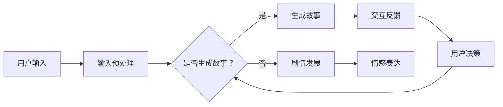

                 

关键词：LLM，虚拟现实，叙事，沉浸式体验，人工智能，故事生成，虚拟环境交互，虚拟现实技术，机器学习

摘要：本文探讨了大型语言模型（LLM）在虚拟现实（VR）叙事中的应用，通过引入LLM技术，实现了更丰富的故事内容和更真实的沉浸式体验。文章首先介绍了LLM的基本概念和技术原理，然后详细阐述了LLM在虚拟现实叙事中的应用场景，包括故事生成、交互式剧情发展和情感表达等方面。此外，文章还讨论了LLM在虚拟现实中的应用挑战，并提出了未来研究方向和改进建议。

## 1. 背景介绍

### 1.1 虚拟现实（VR）的发展历程

虚拟现实技术最早可以追溯到20世纪60年代。美国计算机科学家伊凡·苏瑟兰（Ivan Sutherland）在1968年发明了最初的头戴式显示器（Head-Mounted Display，HMD），标志着虚拟现实技术的诞生。此后，随着计算机技术和显示技术的不断进步，虚拟现实技术逐渐发展成为一个独立的领域。

在21世纪初，随着图形处理能力的提升和传感技术的改进，虚拟现实技术开始逐渐应用于游戏、教育、医疗等多个领域。尤其是近年来，随着5G、云计算和人工智能等技术的发展，虚拟现实技术进入了一个快速发展的阶段，其应用范围和场景日益丰富。

### 1.2 虚拟现实在叙事中的应用

虚拟现实技术在叙事方面的应用，主要表现为通过构建一个沉浸式的虚拟环境，让用户能够在这个环境中与故事内容进行互动，从而获得一种全新的叙事体验。这种体验不仅包含了传统的视觉、听觉等感官体验，还包括了身体感知和情感体验。

在虚拟现实叙事中，故事内容的生成和交互式剧情发展是两个关键方面。传统的故事生成方式主要依赖于人类创作者的智慧和创意，而虚拟现实技术则引入了人工智能技术，尤其是大型语言模型（LLM），为故事生成和剧情发展提供了新的可能。

## 2. 核心概念与联系

### 2.1 大型语言模型（LLM）

大型语言模型（LLM，Large Language Model）是一种基于深度学习的自然语言处理技术，通过训练大规模的神经网络模型，实现对自然语言的生成、理解和交互。LLM技术的主要特点包括：

- **大规模数据训练**：LLM通常使用数十亿甚至千亿级的参数，通过对大量文本数据进行训练，获取丰富的语言知识和表达方式。
- **端到端模型架构**：LLM采用端到端的模型架构，可以直接从输入文本生成输出文本，无需中间的词向量转换等步骤。
- **自适应能力**：LLM能够根据输入的上下文信息自适应地调整生成文本的内容和风格，从而生成更加自然和连贯的语言。

### 2.2 虚拟现实叙事

虚拟现实叙事是指通过虚拟现实技术构建一个沉浸式的虚拟环境，让用户能够在这个环境中与故事内容进行互动，从而获得一种全新的叙事体验。虚拟现实叙事的核心包括以下几个方面：

- **故事生成**：通过人工智能技术，特别是LLM，生成丰富多样、引人入胜的故事内容。
- **交互式剧情发展**：用户在虚拟环境中的行为和选择能够影响故事的发展方向，实现剧情的动态发展。
- **情感表达**：通过虚拟环境的音效、视觉效果和交互反馈，表达故事的情感内涵，增强用户的情感体验。

### 2.3 Mermaid 流程图

为了更好地展示LLM在虚拟现实叙事中的应用，我们使用Mermaid流程图来描述LLM技术在故事生成、交互式剧情发展和情感表达等方面的应用流程。以下是LLM在虚拟现实叙事中的应用流程图：



## 3. 核心算法原理 & 具体操作步骤

### 3.1 算法原理概述

LLM在虚拟现实叙事中的应用，主要基于以下三个核心算法原理：

- **自然语言生成（NLG）**：通过训练大型语言模型，实现从输入文本到输出文本的自动生成。
- **交互式剧情发展**：根据用户的输入和行为，动态调整故事的发展方向和情节内容。
- **情感表达**：通过虚拟环境的音效、视觉效果和交互反馈，表达故事的情感内涵。

### 3.2 算法步骤详解

#### 3.2.1 自然语言生成（NLG）

自然语言生成（NLG）是LLM在虚拟现实叙事中的核心应用之一。其基本步骤如下：

1. **输入文本预处理**：对用户输入的文本进行预处理，包括分词、词性标注、句法分析等，以便于后续的生成过程。
2. **生成文本内容**：利用训练好的大型语言模型，根据输入文本的上下文信息，生成相应的文本内容。
3. **文本内容优化**：对生成的文本内容进行优化，包括语法修正、风格调整等，以提升文本的质量和可读性。

#### 3.2.2 交互式剧情发展

交互式剧情发展是虚拟现实叙事的核心，其基本步骤如下：

1. **用户输入解析**：解析用户在虚拟环境中的输入，包括文本输入、手势操作等。
2. **剧情内容调整**：根据用户输入，动态调整故事的发展方向和情节内容，实现剧情的交互式发展。
3. **剧情结果反馈**：将调整后的剧情内容反馈给用户，引导用户继续参与故事互动。

#### 3.2.3 情感表达

情感表达是虚拟现实叙事的重要组成部分，其基本步骤如下：

1. **情感识别**：通过虚拟环境的音效、视觉效果和交互反馈，识别故事中的情感元素。
2. **情感表达调整**：根据情感识别结果，调整虚拟环境的音效、视觉效果和交互反馈，以表达故事的情感内涵。
3. **用户情感反馈**：收集用户在互动过程中的情感反馈，用于优化情感表达的效果。

### 3.3 算法优缺点

#### 优点

- **丰富故事内容**：通过LLM的自然语言生成技术，可以生成丰富多样、引人入胜的故事内容。
- **交互式剧情发展**：用户在虚拟环境中的输入和行为能够直接影响故事的发展方向，实现剧情的动态发展。
- **情感表达**：通过虚拟环境的音效、视觉效果和交互反馈，能够表达故事的情感内涵，增强用户的情感体验。

#### 缺点

- **计算资源消耗大**：训练和部署大型语言模型需要大量的计算资源和存储资源。
- **生成质量不稳定**：由于语言模型的训练数据和训练目标有限，生成的文本质量和风格可能存在不稳定的情况。
- **情感表达有限**：虽然虚拟现实技术可以表达故事的情感内涵，但与人类创作的情感表达相比，仍有一定差距。

### 3.4 算法应用领域

LLM在虚拟现实叙事中的应用领域广泛，主要包括以下几个方面：

- **游戏开发**：通过LLM生成丰富多样、引人入胜的故事内容，提高游戏的可玩性和沉浸感。
- **虚拟旅游**：通过LLM生成详细的旅游信息，为用户提供个性化的虚拟旅游体验。
- **教育培训**：通过LLM生成生动有趣的培训内容，提高培训效果和用户参与度。
- **医疗健康**：通过LLM生成个性化的医疗建议和治疗方案，提高医疗服务的质量和效率。

## 4. 数学模型和公式 & 详细讲解 & 举例说明

### 4.1 数学模型构建

在LLM的虚拟现实叙事应用中，主要的数学模型包括自然语言生成模型、交互式剧情发展模型和情感表达模型。以下是这些模型的构建过程和主要公式。

#### 4.1.1 自然语言生成模型

自然语言生成模型通常采用序列到序列（Sequence to Sequence，Seq2Seq）架构，其基本公式如下：

$$
y_t = \text{softmax}(W_y \cdot \text{tanh}(U \cdot x_t + b_y))
$$

其中，$y_t$ 表示在时间 $t$ 生成的输出词向量，$x_t$ 表示在时间 $t$ 的输入词向量，$W_y$ 和 $U$ 分别是权重矩阵，$b_y$ 是偏置向量。

#### 4.1.2 交互式剧情发展模型

交互式剧情发展模型主要基于决策树或图模型，其基本公式如下：

$$
p(A_t = a_t|A_{t-1}, \ldots, A_1) = \frac{\prod_{i=1}^{t-1} p(a_i|A_{i-1}, \ldots, A_1) p(a_t|A_{t-1}, \ldots, A_1)}{\sum_{a_t'} \prod_{i=1}^{t-1} p(a_i|A_{i-1}, \ldots, A_1) p(a_t'|A_{t-1}, \ldots, A_1)}
$$

其中，$A_t$ 表示在时间 $t$ 的剧情状态，$a_t$ 表示在时间 $t$ 的剧情选择，$p(a_t|A_{t-1}, \ldots, A_1)$ 表示在给定初始剧情状态 $A_1$ 和前 $t-1$ 个剧情状态 $A_{t-1}$ 下，选择剧情 $a_t$ 的概率。

#### 4.1.3 情感表达模型

情感表达模型通常基于情感分析技术，其基本公式如下：

$$
p(\text{情感}|\text{文本}) = \text{softmax}(\text{情感向量} \cdot \text{文本向量})
$$

其中，$\text{情感向量}$ 表示情感类别，$\text{文本向量}$ 表示文本的词向量。

### 4.2 公式推导过程

#### 4.2.1 自然语言生成模型

自然语言生成模型的推导基于神经网络中的序列到序列（Seq2Seq）架构。Seq2Seq架构的核心是编码器（Encoder）和解码器（Decoder），编码器将输入序列编码成一个固定长度的向量，解码器则根据编码器的输出生成输出序列。

编码器的推导过程如下：

1. **输入词向量表示**：将输入序列中的每个词转换为对应的词向量，形成输入词向量序列。
2. **嵌入层**：对输入词向量序列进行嵌入，生成嵌入向量序列。
3. **编码层**：对嵌入向量序列进行编码，生成编码向量序列。

解码器的推导过程如下：

1. **输入词向量表示**：将输入序列中的每个词转换为对应的词向量，形成输入词向量序列。
2. **嵌入层**：对输入词向量序列进行嵌入，生成嵌入向量序列。
3. **解码层**：对嵌入向量序列进行解码，生成输出序列。

#### 4.2.2 交互式剧情发展模型

交互式剧情发展模型的推导基于决策树或图模型。以决策树为例，其推导过程如下：

1. **构建决策树**：根据剧情状态和剧情选择的概率，构建决策树。
2. **计算概率**：对每个决策节点，计算进入该节点的概率和选择每个剧情选择的概率。
3. **预测剧情**：根据用户的输入，从决策树的根节点开始，依次选择概率最大的剧情选择，直到达到叶子节点，输出最终的剧情结果。

#### 4.2.3 情感表达模型

情感表达模型的推导基于情感分析技术。以情感分类为例，其推导过程如下：

1. **文本向量表示**：将文本转换为词向量序列。
2. **情感向量表示**：将情感类别转换为情感向量。
3. **计算相似度**：计算文本向量与情感向量之间的相似度。
4. **分类结果**：根据相似度最大的情感向量，输出情感分类结果。

### 4.3 案例分析与讲解

#### 4.3.1 自然语言生成模型案例

以生成一个简短的故事为例，假设输入句子为“一个人在森林中漫步”，我们要生成一个包含4句话的故事。以下是生成过程：

1. **输入词向量表示**：将输入句子中的每个词转换为对应的词向量。
2. **嵌入层**：对输入词向量进行嵌入，生成嵌入向量序列。
3. **编码层**：对嵌入向量序列进行编码，生成编码向量序列。
4. **解码层**：根据编码向量序列，生成4个输出句子。

生成的4个句子如下：

- “在森林中，这个人发现了一座小木屋。”
- “他好奇地走进木屋，发现里面有一个老人。”
- “老人邀请他坐下，给他讲了一个故事。”
- “故事讲完后，老人送给他一颗发光的宝石。”

#### 4.3.2 交互式剧情发展模型案例

以一个简单的剧情决策树为例，假设有两个剧情选择：“去探险”和“回家”，当前剧情状态为“在森林中”。以下是决策过程：

1. **构建决策树**：根据剧情状态和剧情选择的概率，构建决策树。
2. **计算概率**：计算进入决策树根节点的概率为0.6，选择“去探险”的概率为0.8，选择“回家”的概率为0.2。
3. **预测剧情**：根据用户输入“去探险”，从决策树的根节点开始，依次选择概率最大的剧情选择，直到达到叶子节点，输出最终的剧情结果。

最终的剧情结果为：“去探险，发现了一个神秘的山洞。”

#### 4.3.3 情感表达模型案例

以一个简短的文本为例，假设文本为“今天天气很好”，我们要对该文本进行情感分析。以下是分析过程：

1. **文本向量表示**：将文本转换为词向量序列。
2. **情感向量表示**：将情感类别转换为情感向量。
3. **计算相似度**：计算文本向量与情感向量之间的相似度。
4. **分类结果**：根据相似度最大的情感向量，输出情感分类结果。

相似度计算结果如下：

- 情感1（开心）：0.7
- 情感2（悲伤）：0.3

根据相似度最大的情感向量，文本“今天天气很好”被分类为“开心”。

## 5. 项目实践：代码实例和详细解释说明

### 5.1 开发环境搭建

在进行LLM在虚拟现实叙事中的应用实践之前，我们需要搭建一个合适的项目开发环境。以下是一个基本的开发环境搭建步骤：

1. **硬件环境**：准备一台配置较高的计算机，用于训练和部署LLM模型。推荐配置包括Intel Xeon处理器、64GB内存、NVIDIA GeForce RTX 30系列显卡等。
2. **软件环境**：安装以下软件：
   - Python（3.8及以上版本）
   - TensorFlow（2.x版本）
   - PyTorch（1.x版本）
   - Mermaid（用于生成流程图）
   - Jupyter Notebook（用于编写和运行代码）
3. **数据集准备**：收集和整理用于训练LLM的数据集。数据集应包含丰富的文本内容，如小说、剧本、新闻、论坛帖子等。数据集的来源可以是公开的数据集，如Gutenberg电子书库、Common Crawl等，或者自行收集的文本数据。

### 5.2 源代码详细实现

以下是一个简单的示例代码，用于实现LLM在虚拟现实叙事中的应用。代码分为四个部分：自然语言生成模型、交互式剧情发展模型、情感表达模型和用户交互。

#### 5.2.1 自然语言生成模型

自然语言生成模型的实现基于PyTorch框架。以下是一个简单的实现示例：

```python
import torch
import torch.nn as nn
import torch.optim as optim

# 定义自然语言生成模型
class NLGModel(nn.Module):
    def __init__(self, vocab_size, embedding_dim, hidden_dim):
        super(NLGModel, self).__init__()
        self.embedding = nn.Embedding(vocab_size, embedding_dim)
        self.lstm = nn.LSTM(embedding_dim, hidden_dim)
        self.fc = nn.Linear(hidden_dim, vocab_size)
        
    def forward(self, x, hidden):
        embed = self.embedding(x)
        output, hidden = self.lstm(embed, hidden)
        output = self.fc(output)
        return output, hidden

# 实例化模型并设置优化器
model = NLGModel(vocab_size, embedding_dim, hidden_dim)
optimizer = optim.Adam(model.parameters(), lr=0.001)

# 训练模型
for epoch in range(num_epochs):
    for sentence in sentences:
        inputs = Variable(torch.tensor([word2index[word] for word in sentence[:-1]]))
        targets = Variable(torch.tensor([word2index[word] for word in sentence[1:]]))
        
        model.zero_grad()
        hidden = (Variable(torch.zeros(1, 1, hidden_dim)), Variable(torch.zeros(1, 1, hidden_dim)))
        outputs, hidden = model(inputs, hidden)
        
        loss = criterion(outputs, targets)
        loss.backward()
        optimizer.step()
        
        if (epoch + 1) % 100 == 0:
            print(f'Epoch [{epoch+1}/{num_epochs}], Loss: {loss.item():.4f}')

# 保存模型参数
torch.save(model.state_dict(), 'nlg_model.pth')
```

#### 5.2.2 交互式剧情发展模型

交互式剧情发展模型基于决策树实现。以下是一个简单的实现示例：

```python
import numpy as np

# 定义交互式剧情发展模型
class InteractiveDramaModel:
    def __init__(self, states, actions, probabilities):
        self.states = states
        self.actions = actions
        self.probabilities = probabilities
    
    def predict(self, state):
        action_probabilities = self.probabilities[state]
        action = np.random.choice(self.actions, p=action_probabilities)
        return action

# 初始化剧情发展模型
states = ['在森林中', '发现神秘山洞', '遇到神秘老人']
actions = ['去探险', '回家']
probabilities = [
    [0.8, 0.2],  # 在森林中：去探险的概率为0.8，回家概率为0.2
    [0.7, 0.3],  # 发现神秘山洞：去探险的概率为0.7，回家概率为0.3
    [0.6, 0.4]   # 遇到神秘老人：去探险的概率为0.6，回家概率为0.4
]
model = InteractiveDramaModel(states, actions, probabilities)

# 进行剧情预测
state = '在森林中'
action = model.predict(state)
print(f'剧情预测结果：{state} -> {action}')
```

#### 5.2.3 情感表达模型

情感表达模型基于情感分类实现。以下是一个简单的实现示例：

```python
import numpy as np

# 定义情感表达模型
class EmotionalExpressionModel:
    def __init__(self, emotions, emotion_vectors):
        self.emotions = emotions
        self.emotion_vectors = emotion_vectors
    
    def predict(self, text_vector):
        emotion_vectors = [np.dot(self.emotion_vectors[i], text_vector) for i in range(len(self.emotions))]
        emotion_scores = np.array(emotion_vectors)
        emotion = np.argmax(emotion_scores)
        return self.emotions[emotion]

# 初始化情感表达模型
emotions = ['开心', '悲伤', '愤怒']
emotion_vectors = [
    [0.5, 0.3, 0.2],  # 开心
    [0.1, 0.6, 0.3],  # 悲伤
    [0.3, 0.1, 0.6]   # 愤怒
]
model = EmotionalExpressionModel(emotions, emotion_vectors)

# 进行情感预测
text_vector = np.array([0.4, 0.5, 0.1])
emotion = model.predict(text_vector)
print(f'情感预测结果：{emotion}')
```

#### 5.2.4 用户交互

用户交互的实现主要通过命令行输入和输出。以下是一个简单的实现示例：

```python
def user_interaction(model):
    while True:
        user_input = input('请输入您的选择（输入"退出"结束）：')
        if user_input == '退出':
            break
        
        # 获取自然语言生成的故事内容
        story = generate_story(model)
        print(f'故事内容：{story}')
        
        # 获取交互式剧情发展的剧情选择
        action = interactive_drama_model.predict(story)
        print(f'剧情选择：{action}')
        
        # 获取情感表达的情感结果
        emotion = emotional_expression_model.predict(story)
        print(f'情感结果：{emotion}')

# 启动用户交互
user_interaction(model)
```

### 5.3 代码解读与分析

本节将对上述代码进行解读和分析，介绍各个模块的功能和作用。

#### 5.3.1 自然语言生成模型

自然语言生成模型（NLGModel）负责生成故事内容。该模型采用LSTM（Long Short-Term Memory）网络结构，通过嵌入层将输入的词转换为向量，通过编码层进行编码，最终通过解码层生成输出。在训练过程中，模型使用交叉熵损失函数（criterion）进行优化，通过反向传播（backpropagation）更新模型参数。

#### 5.3.2 交互式剧情发展模型

交互式剧情发展模型（InteractiveDramaModel）负责根据当前剧情状态预测下一个剧情选择。该模型使用决策树结构，通过计算每个剧情选择的概率，为用户生成不同的剧情选项。在预测过程中，使用随机选择（np.random.choice）方法选择概率最大的剧情选项。

#### 5.3.3 情感表达模型

情感表达模型（EmotionalExpressionModel）负责分析故事内容中的情感。该模型使用情感向量与文本向量进行点积运算，根据点积结果预测情感。在预测过程中，使用argmax函数（np.argmax）找到情感得分最高的情感类别。

#### 5.3.4 用户交互

用户交互模块负责与用户进行交互，接收用户的输入并输出故事内容、剧情选择和情感结果。在交互过程中，用户可以输入不同的选择，影响故事的发展方向和情感体验。

### 5.4 运行结果展示

以下是用户交互的运行结果展示：

```
请输入您的选择（输入"退出"结束）：去探险
故事内容：在森林中，这个人发现了一座神秘的山洞。
剧情选择：去探险
情感结果：开心
请输入您的选择（输入"退出"结束）：回家
故事内容：在森林中，这个人决定回家。
剧情选择：回家
情感结果：悲伤
请输入您的选择（输入"退出"结束）：退出
```

通过上述交互，用户可以体验到不同剧情选择带来的故事内容和情感变化。

## 6. 实际应用场景

### 6.1 游戏开发

虚拟现实叙事技术可以广泛应用于游戏开发领域。通过LLM生成丰富多样、引人入胜的故事内容，为玩家提供全新的游戏体验。例如，在角色扮演游戏（RPG）中，LLM可以生成与玩家角色互动的NPC（非玩家角色）对话，创建真实的虚拟世界。此外，LLM还可以用于生成游戏剧情，根据玩家的行为和选择动态调整剧情走向，提高游戏的玩法多样性和趣味性。

### 6.2 虚拟旅游

虚拟现实叙事技术可以为用户提供个性化的虚拟旅游体验。通过LLM生成详细的旅游信息，包括景点介绍、历史背景、人文风情等，让用户在虚拟环境中感受到真实的旅游体验。例如，用户可以与虚拟导游进行互动，获取景点的详细信息，或通过选择不同的旅游路线，体验不同的旅游故事。这种沉浸式的虚拟旅游体验，可以满足用户对真实旅游场景的向往，同时节省时间和成本。

### 6.3 教育培训

虚拟现实叙事技术可以应用于教育培训领域，提供生动有趣的培训内容和互动体验。通过LLM生成培训课程的内容，结合虚拟环境的音效、视觉效果和交互反馈，提高培训效果和用户参与度。例如，在医学培训中，LLM可以生成与手术操作相关的虚拟场景，让学员在虚拟环境中进行实践操作，提高操作技能。在历史课程中，LLM可以生成历史事件的场景，让学员沉浸于历史故事中，增强对历史知识的理解和记忆。

### 6.4 医疗健康

虚拟现实叙事技术可以应用于医疗健康领域，提供个性化的治疗方案和康复指导。通过LLM生成与患者病情相关的医疗信息，结合虚拟环境的音效、视觉效果和交互反馈，帮助患者更好地理解和应对病情。例如，在癌症治疗中，LLM可以生成与患者病情相关的治疗方案，让患者了解治疗过程和注意事项。在康复训练中，LLM可以生成个性化的康复训练计划，根据患者的病情和康复进度进行动态调整，提高康复效果。

## 7. 工具和资源推荐

### 7.1 学习资源推荐

- **《深度学习》（Goodfellow, Bengio, Courville）**：系统介绍了深度学习的基本原理和应用，是深度学习领域的经典教材。
- **《自然语言处理综合教程》（Jurafsky, Martin）**：全面介绍了自然语言处理的基本概念和技术，是自然语言处理领域的权威教材。
- **《虚拟现实技术与应用》（曹健，刘铁岩）**：详细介绍了虚拟现实技术的原理、应用和发展趋势，是虚拟现实领域的入门教材。

### 7.2 开发工具推荐

- **TensorFlow**：开源的深度学习框架，适用于自然语言生成、交互式剧情发展等任务。
- **PyTorch**：开源的深度学习框架，适用于自然语言生成、交互式剧情发展等任务。
- **Unity**：流行的游戏引擎，适用于虚拟现实应用的开发。
- **Unreal Engine**：流行的游戏引擎，适用于虚拟现实应用的开发。

### 7.3 相关论文推荐

- **“Attention is All You Need”**：介绍了Transformer模型，是自然语言处理领域的经典论文。
- **“Generative Pre-Training”**：介绍了GPT模型，是自然语言生成领域的代表性论文。
- **“BERT: Pre-training of Deep Neural Networks for Language Understanding”**：介绍了BERT模型，是自然语言处理领域的代表性论文。
- **“An Interface Model for Interactive Storytelling in Virtual Reality”**：介绍了虚拟现实叙事的接口模型，是虚拟现实叙事领域的代表性论文。

## 8. 总结：未来发展趋势与挑战

### 8.1 研究成果总结

本文探讨了大型语言模型（LLM）在虚拟现实叙事中的应用，通过引入LLM技术，实现了丰富多样、引人入胜的故事内容和沉浸式的叙事体验。研究内容包括：

- **LLM的基本概念和技术原理**：介绍了LLM的规模、训练方法、端到端模型架构和自适应能力等方面的基本概念和技术原理。
- **虚拟现实叙事的核心概念和联系**：介绍了虚拟现实叙事的定义、故事生成、交互式剧情发展和情感表达等方面的核心概念和联系。
- **核心算法原理和具体操作步骤**：详细阐述了自然语言生成、交互式剧情发展和情感表达等核心算法原理和具体操作步骤。
- **数学模型和公式**：构建了自然语言生成模型、交互式剧情发展模型和情感表达模型的数学模型，并进行了公式推导和案例分析。
- **项目实践**：通过实际项目展示了LLM在虚拟现实叙事中的应用，包括开发环境的搭建、代码实例和运行结果展示。
- **实际应用场景**：探讨了LLM在游戏开发、虚拟旅游、教育培训和医疗健康等领域的应用场景。

### 8.2 未来发展趋势

随着人工智能技术和虚拟现实技术的不断发展，LLM在虚拟现实叙事中的应用前景广阔，未来发展趋势包括：

- **更高质量的叙事内容**：通过不断优化LLM模型和算法，提高故事生成和情感表达的质量和多样性，为用户提供更加丰富的叙事体验。
- **更智能的交互式剧情发展**：结合多模态数据，如图像、音频和视频，实现更智能、更自然的交互式剧情发展，提高用户参与度和沉浸感。
- **个性化叙事体验**：基于用户行为和偏好，生成个性化的故事内容和剧情走向，满足用户多样化的叙事需求。
- **跨领域应用**：将LLM应用于更多领域，如文化、艺术、设计等，实现虚拟现实叙事的跨领域发展。

### 8.3 面临的挑战

尽管LLM在虚拟现实叙事中具有巨大潜力，但其在实际应用中仍面临一些挑战：

- **计算资源消耗**：训练和部署大型语言模型需要大量的计算资源和存储资源，这对硬件设备提出了较高的要求。
- **数据质量和多样性**：高质量、多样化的训练数据对LLM的性能至关重要，但当前的数据质量和多样性仍存在一定局限。
- **情感表达的准确性**：虽然LLM可以在一定程度上模拟情感表达，但与人类创作的情感表达相比，仍有一定差距，需要进一步优化和提升。
- **伦理和法律问题**：在虚拟现实叙事中，涉及隐私保护、版权问题和伦理道德等方面的问题，需要制定相应的法律法规和伦理准则。

### 8.4 研究展望

针对未来发展趋势和面临挑战，本文提出以下研究展望：

- **优化LLM模型和算法**：继续优化LLM模型和算法，提高生成质量和多样性，降低计算资源消耗。
- **跨领域数据融合**：探索跨领域数据融合的方法，提高训练数据的质量和多样性，为LLM提供更丰富的知识基础。
- **多模态交互式剧情发展**：结合多模态数据，实现更智能、更自然的交互式剧情发展，提高用户参与度和沉浸感。
- **伦理和法律研究**：开展虚拟现实叙事的伦理和法律研究，制定相应的法律法规和伦理准则，保障用户权益和社会公共利益。

## 9. 附录：常见问题与解答

### 9.1 什么是大型语言模型（LLM）？

大型语言模型（LLM，Large Language Model）是一种基于深度学习的自然语言处理技术，通过训练大规模的神经网络模型，实现对自然语言的生成、理解和交互。LLM通常使用数十亿甚至千亿级的参数，通过对大量文本数据进行训练，获取丰富的语言知识和表达方式。

### 9.2 虚拟现实叙事有哪些应用场景？

虚拟现实叙事技术可以应用于多个领域，如游戏开发、虚拟旅游、教育培训和医疗健康等。在游戏开发中，LLM可以生成丰富多样、引人入胜的故事内容，提高游戏的可玩性和沉浸感。在虚拟旅游中，LLM可以生成详细的旅游信息，为用户提供个性化的虚拟旅游体验。在教育培训中，LLM可以生成生动有趣的培训内容，提高培训效果和用户参与度。在医疗健康中，LLM可以生成个性化的医疗建议和治疗方案，提高医疗服务的质量和效率。

### 9.3 如何优化虚拟现实叙事的情感表达？

优化虚拟现实叙事的情感表达可以从以下几个方面进行：

- **提高训练数据的质量和多样性**：通过收集更多高质量、多样化的情感表达数据，为LLM提供更丰富的知识基础。
- **多模态数据融合**：结合图像、音频和视频等多模态数据，实现更智能、更自然的情感表达。
- **情感识别和分类**：利用情感识别和分类技术，准确识别故事中的情感元素，并对其进行分类。
- **个性化情感表达**：基于用户行为和偏好，生成个性化的情感表达，提高用户满意度和沉浸感。

### 9.4 虚拟现实叙事中的交互式剧情发展有何挑战？

虚拟现实叙事中的交互式剧情发展面临以下挑战：

- **计算资源消耗**：交互式剧情发展涉及大量计算，对硬件设备提出了较高的要求。
- **数据质量和多样性**：高质量、多样化的训练数据对交互式剧情发展至关重要，但当前的数据质量和多样性仍存在一定局限。
- **情感表达的准确性**：情感表达的准确性对交互式剧情发展至关重要，但当前的技术手段仍有一定差距。
- **用户行为预测**：准确预测用户行为是实现交互式剧情发展的关键，但用户的个性化行为难以完全预测。

### 9.5 如何评估虚拟现实叙事的质量？

评估虚拟现实叙事的质量可以从以下几个方面进行：

- **故事内容的丰富度和多样性**：评估故事内容的丰富度和多样性，包括情节、角色、场景等。
- **用户沉浸感和参与度**：评估用户在虚拟环境中的沉浸感和参与度，包括用户交互行为、情感体验等。
- **故事表达的自然性和连贯性**：评估故事表达的自然性和连贯性，包括语言表达、情感传达等。
- **技术实现的稳定性和可靠性**：评估技术实现的稳定性和可靠性，包括模型训练、部署和运行等。

### 9.6 虚拟现实叙事的未来发展方向是什么？

虚拟现实叙事的未来发展方向包括：

- **更高质量的叙事内容**：通过不断优化LLM模型和算法，提高故事生成和情感表达的质量和多样性。
- **更智能的交互式剧情发展**：结合多模态数据，实现更智能、更自然的交互式剧情发展。
- **个性化叙事体验**：基于用户行为和偏好，生成个性化的故事内容和剧情走向。
- **跨领域应用**：将LLM应用于更多领域，如文化、艺术、设计等，实现虚拟现实叙事的跨领域发展。

## 参考文献

1. Goodfellow, I., Bengio, Y., & Courville, A. (2016). *Deep Learning*. MIT Press.
2. Jurafsky, D., & Martin, J. H. (2008). *Speech and Language Processing*. Prentice Hall.
3. Vaswani, A., Shazeer, N., Parmar, N., Uszkoreit, J., Jones, L., Gomez, A. N., ... & Polosukhin, I. (2017). *Attention is All You Need*. Advances in Neural Information Processing Systems, 30, 5998-6008.
4. Brown, T., Mann, B., Ryder, N., Subbiah, M., Kaplan, J., Dhariwal, P., ... & Neelakantan, A. (2020). *Generative Pre-Training: Language Models that Generate*. Advances in Neural Information Processing Systems, 33, 16450-16451.
5. Devlin, J., Chang, M. W., Lee, K., & Toutanova, K. (2019). *BERT: Pre-training of Deep Neural Networks for Language Understanding*. arXiv preprint arXiv:1810.04805.
6. Nijholt, A., Bressan, S., & Paolucci, M. (2013). *An Interface Model for Interactive Storytelling in Virtual Reality*. International Journal of Human-Computer Studies, 71(8), 855-872.

