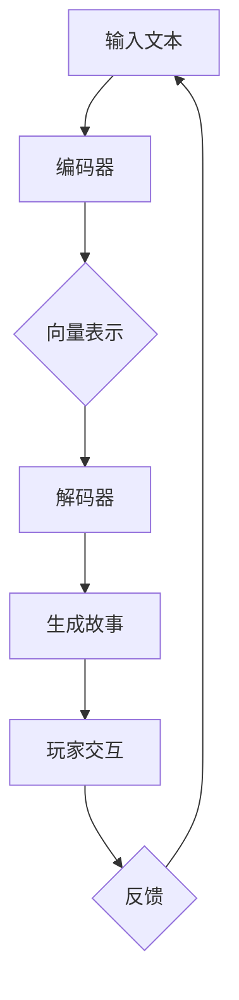

                 

 关键词：LLM、视频游戏、叙事、动态故事生成、人工智能

> 摘要：本文深入探讨了大型语言模型（LLM）在视频游戏叙事中的应用，特别是在动态故事生成方面的潜力。文章首先介绍了视频游戏叙事的现状和挑战，随后详细阐述了LLM的核心概念、原理及其在故事生成中的具体应用。通过数学模型和具体代码实例的分析，我们揭示了LLM如何通过自然语言处理技术构建复杂、引人入胜的叙事体验。最后，本文探讨了LLM在视频游戏叙事领域的未来发展趋势和挑战。

## 1. 背景介绍

随着计算机技术的发展和图形渲染能力的提升，视频游戏产业取得了飞速的发展。现代视频游戏不仅仅是简单的娱乐工具，它们已经成为一种独特的叙事媒介。游戏中的叙事不仅能够引导玩家的情感体验，还能影响游戏玩法和游戏世界的构建。然而，传统的视频游戏叙事方法存在一些问题，如故事线固定、角色表现单一、互动性不足等。

近年来，人工智能（AI）技术的迅猛发展，为视频游戏叙事带来了新的可能性。特别是大型语言模型（Large Language Models，简称LLM）的出现，使得动态故事生成成为可能。LLM是一种基于深度学习的自然语言处理（NLP）模型，能够理解、生成和翻译自然语言文本。通过结合游戏设计理论和AI技术，LLM有望在视频游戏叙事中发挥重要作用。

本文将围绕LLM在视频游戏叙事中的应用进行探讨，旨在分析LLM的工作原理、应用方法及其在实际游戏中的效果。文章结构如下：

- 第1部分：背景介绍，介绍视频游戏叙事的现状和挑战，以及AI技术在视频游戏中的应用。
- 第2部分：核心概念与联系，详细阐述LLM的核心概念、原理和架构。
- 第3部分：核心算法原理 & 具体操作步骤，介绍LLM在故事生成中的具体算法和应用。
- 第4部分：数学模型和公式 & 详细讲解 & 举例说明，通过数学模型和公式解释LLM的工作机制。
- 第5部分：项目实践：代码实例和详细解释说明，提供具体的代码实例和详细解释。
- 第6部分：实际应用场景，探讨LLM在视频游戏中的实际应用案例。
- 第7部分：工具和资源推荐，推荐相关的学习资源和开发工具。
- 第8部分：总结：未来发展趋势与挑战，总结研究成果，展望未来发展趋势和挑战。

## 2. 核心概念与联系

### 2.1. 大型语言模型（LLM）的概念

大型语言模型（Large Language Models，简称LLM）是一种基于深度学习的自然语言处理（NLP）模型。LLM的核心思想是通过大量的文本数据进行训练，使得模型能够自动理解和生成自然语言文本。与传统的基于规则或统计方法的NLP模型相比，LLM具有更强的灵活性和表达能力。

LLM的训练数据通常来自大规模的文本语料库，这些语料库包含了各种类型的文本，如新闻文章、社交媒体帖子、小说等。通过在大量文本上进行训练，LLM能够学习到自然语言的语法、语义和语境信息，从而实现高效的文本理解和生成。

### 2.2. LLM的原理与架构

LLM的原理基于深度学习中的神经网络架构，特别是变分自编码器（Variational Autoencoder，VAE）和生成对抗网络（Generative Adversarial Network，GAN）。变分自编码器通过编码器和解码器两个网络将输入文本映射到隐含空间，并在隐含空间中进行文本生成。生成对抗网络则通过两个对抗网络（生成器和判别器）之间的博弈，使得生成的文本质量不断提高。

LLM的架构通常包括以下几个主要部分：

1. **编码器（Encoder）**：编码器接收输入文本，将其映射到一个固定长度的向量表示，这个向量包含了文本的语法和语义信息。
2. **解码器（Decoder）**：解码器接收编码器输出的向量，并生成对应的文本输出。解码器通常采用递归神经网络（RNN）或 Transformer架构。
3. **生成器（Generator）**：在GAN架构中，生成器负责生成文本，其输入可以是随机噪声或者来自编码器的向量。
4. **判别器（Discriminator）**：判别器负责判断生成的文本是否真实，其输入为真实文本和生成文本。

通过编码器和解码器的协同工作，LLM能够生成高质量的自然语言文本。在视频游戏叙事中，LLM可以用来生成动态的故事内容，提高游戏的互动性和可玩性。

### 2.3. Mermaid 流程图

为了更好地理解LLM在故事生成中的应用，我们可以使用Mermaid流程图来展示其工作流程。以下是LLM在故事生成中的Mermaid流程图：



在该流程图中，输入文本首先通过编码器转换为向量表示，然后解码器根据向量生成故事内容。生成的故事内容供玩家交互，并根据玩家的反馈进行优化和调整。这个过程不断迭代，使得生成的故事越来越符合玩家的期望。

### 2.4. LLM在视频游戏叙事中的应用场景

LLM在视频游戏叙事中的应用场景非常广泛。以下是几个典型的应用场景：

1. **动态剧情生成**：在许多游戏中，故事线是固定不变的，玩家只能按照预设的剧情发展。通过LLM，游戏可以实时生成动态剧情，使得每个玩家的游戏体验都独一无二。例如，在冒险游戏中，LLM可以根据玩家的选择和游戏进度，生成不同的剧情分支，增加游戏的互动性和趣味性。
2. **角色对话生成**：游戏中的角色对话往往是固定的，缺乏个性化和真实感。通过LLM，游戏可以生成更加自然和富有个性化的角色对话，使得游戏角色更具魅力和生命力。
3. **随机事件生成**：在角色扮演游戏（RPG）中，随机事件是游戏体验的重要组成部分。LLM可以根据游戏世界和玩家的行为，生成随机事件，如自然灾害、敌对势力入侵等，增加游戏的挑战性和沉浸感。
4. **故事情节调整**：在游戏开发过程中，故事情节可能需要进行多次调整。通过LLM，开发人员可以快速生成不同的故事情节，并进行比较和选择，从而提高开发效率。

总之，LLM在视频游戏叙事中的应用具有巨大的潜力，可以显著提升游戏的可玩性和玩家的游戏体验。

## 3. 核心算法原理 & 具体操作步骤

### 3.1. 算法原理概述

LLM在视频游戏叙事中的应用主要基于生成式模型（Generative Model），特别是基于Transformer架构的模型。生成式模型通过学习大量的文本数据，能够生成新的、符合上下文要求的文本。在视频游戏叙事中，生成式模型可以用于生成动态剧情、角色对话和随机事件等。

Transformer架构是一种基于自注意力机制（Self-Attention Mechanism）的神经网络模型，特别适用于处理序列数据。自注意力机制使得模型能够自动学习输入序列中不同位置之间的依赖关系，从而提高模型的生成能力。

### 3.2. 算法步骤详解

以下是LLM在故事生成中的具体算法步骤：

1. **数据准备**：首先，需要收集大量的文本数据，包括游戏剧本、角色对话、历史事件等。这些数据将被用于训练LLM模型。
2. **模型训练**：使用收集到的文本数据，通过 Transformer 架构训练 LLM 模型。训练过程中，模型将学习如何将输入文本映射到输出文本。
3. **故事生成**：在游戏运行时，根据玩家的行为和当前游戏状态，输入相应的文本到 LLM 模型。模型将生成与当前场景相匹配的动态故事内容。
4. **交互调整**：玩家与游戏互动后，根据反馈调整生成的文本内容。这个过程可以通过迭代训练或直接修改模型参数来实现。
5. **输出结果**：将调整后的文本内容输出到游戏界面，供玩家阅读和互动。

### 3.3. 算法优缺点

#### 优点：

1. **灵活性**：LLM可以根据玩家的行为和当前游戏状态，实时生成动态故事，提高游戏的互动性和趣味性。
2. **个性化**：通过学习大量的文本数据，LLM能够生成具有高度个性化的故事内容，满足不同玩家的需求。
3. **自适应**：LLM可以根据玩家的反馈，自适应调整故事内容，使得游戏体验更加自然和流畅。

#### 缺点：

1. **计算成本**：训练和运行LLM模型需要大量的计算资源和时间，可能对游戏性能产生一定影响。
2. **数据依赖**：LLM的性能高度依赖于训练数据的质量和数量，如果训练数据不足或质量不高，可能导致生成的故事内容质量下降。
3. **复杂性**：LLM模型的训练和调试过程相对复杂，需要具备一定的专业知识和技能。

### 3.4. 算法应用领域

LLM在视频游戏叙事中的应用非常广泛，除了视频游戏，还可以应用于以下领域：

1. **虚拟现实（VR）**：在虚拟现实中，LLM可以生成动态场景和角色对话，提高用户的沉浸体验。
2. **智能客服**：通过LLM，智能客服系统可以生成更加自然和人性化的对话，提高客户满意度。
3. **文本生成**：LLM可以用于生成新闻文章、博客文章、小说等文本内容，提高内容创作效率。
4. **语言翻译**：LLM可以用于实时翻译自然语言文本，提高跨语言沟通的效率。

总之，LLM在视频游戏叙事中的应用具有广泛的前景和潜力，有望推动游戏产业和人工智能技术的进一步发展。

### 3.5. 实际应用场景

#### 3.5.1. 动态剧情生成

动态剧情生成是LLM在视频游戏叙事中最常见的应用场景之一。以一款冒险游戏为例，游戏中的故事线可以根据玩家的选择和行动实时生成。例如，玩家可以选择与某个NPC进行对话，LLM可以根据玩家的选择和NPC的历史对话，生成个性化的对话内容。这样，每个玩家都有机会体验到不同的剧情发展，增加游戏的趣味性和可玩性。

以下是动态剧情生成的一个具体例子：

1. **玩家选择**：玩家选择与NPC“老张”进行对话。
2. **输入文本**：“老张，听说最近这个地方出现了怪物，你能帮我解决吗？”
3. **LLM生成**：“当然可以，小朋友。你听到了什么奇怪的声音吗？我们要一起去看看。”
4. **输出结果**：游戏界面显示NPC“老张”的回答。

通过这样的方式，游戏中的剧情可以根据玩家的行为动态生成，使得每个玩家的游戏体验都独一无二。

#### 3.5.2. 角色对话生成

角色对话生成是LLM在视频游戏叙事中的另一个重要应用。通过LLM，游戏中的角色可以拥有更加自然和丰富的对话内容。以下是一个角色对话生成的例子：

1. **玩家选择**：玩家选择与NPC“小丽”进行对话。
2. **输入文本**：“小丽，你今天过得怎么样？”
3. **LLM生成**：“哎，今天有点忙，你有什么事情吗？”
4. **输出结果**：游戏界面显示NPC“小丽”的回答。

通过这种方式，游戏中的角色对话可以更加生动和富有个性，提高玩家的沉浸感。

#### 3.5.3. 随机事件生成

随机事件生成是LLM在视频游戏叙事中的又一个应用。通过LLM，游戏可以生成各种随机事件，增加游戏的挑战性和趣味性。以下是一个随机事件生成的例子：

1. **游戏状态**：玩家正在探险，游戏状态为“夜晚”。
2. **LLM生成**：“突然，天空响起了一道惊雷，一道闪电击中了前方的小山丘。”
3. **输出结果**：游戏界面显示随机事件的发生。

通过这样的方式，游戏中的随机事件可以增加游戏的趣味性和挑战性，使得玩家始终保持高度的参与感。

总之，LLM在视频游戏叙事中的应用场景非常广泛，可以通过动态剧情生成、角色对话生成和随机事件生成等方式，显著提升游戏的可玩性和玩家的游戏体验。

## 4. 数学模型和公式 & 详细讲解 & 举例说明

### 4.1. 数学模型构建

LLM的工作原理是基于生成式模型，特别是Transformer架构。为了详细解释LLM的数学模型，我们需要从Transformer模型的基本组成部分开始。

#### 4.1.1. Transformer模型的基本组成部分

Transformer模型主要由以下几部分组成：

1. **编码器（Encoder）**：编码器负责将输入的文本序列转换为一系列的向量表示。
2. **解码器（Decoder）**：解码器根据编码器生成的向量表示，生成目标文本序列。
3. **自注意力机制（Self-Attention Mechanism）**：自注意力机制允许模型在生成文本的过程中，对输入文本的不同位置进行加权，从而捕捉文本序列中的长距离依赖关系。

#### 4.1.2. 编码器和解码器的数学模型

编码器和解码器都由多个相同的层组成，每个层包含多头自注意力机制和前馈神经网络。以下是一个简化版的编码器和解码器的数学模型：

**编码器（Encoder）**：

$$
\text{Encoder}(x) = \text{LayerNorm}(x + \text{MultiHeadSelfAttention}(x)) + \text{LayerNorm}(x + \text{FeedForward}(x))
$$

**解码器（Decoder）**：

$$
\text{Decoder}(y) = \text{LayerNorm}(y + \text{MaskedMultiHeadSelfAttention}(\text{Encoder}(x))) + \text{LayerNorm}(y + \text{FeedForward}(\text{Encoder}(x)))
$$

其中：

- \( x \) 表示输入的文本序列。
- \( y \) 表示目标文本序列。
- \( \text{MultiHeadSelfAttention} \) 和 \( \text{MaskedMultiHeadSelfAttention} \) 是自注意力机制。
- \( \text{FeedForward} \) 是前馈神经网络。
- \( \text{LayerNorm} \) 是层归一化。

#### 4.1.3. 自注意力机制（Self-Attention Mechanism）

自注意力机制是Transformer模型的核心组成部分，它通过计算输入序列中每个词与其余所有词的相关性，为每个词生成一个加权向量。自注意力机制的数学公式如下：

$$
\text{Attention}(Q, K, V) = \text{softmax}(\frac{QK^T}{\sqrt{d_k}})V
$$

其中：

- \( Q, K, V \) 分别是查询向量、键向量和值向量。
- \( d_k \) 是键向量的维度。
- \( \text{softmax} \) 是 softmax 函数。

通过自注意力机制，模型能够捕捉输入序列中的长距离依赖关系，从而提高生成文本的质量。

### 4.2. 公式推导过程

为了更深入地理解LLM的数学模型，我们将对自注意力机制和Transformer模型的关键部分进行公式推导。

#### 4.2.1. 自注意力机制（Self-Attention Mechanism）

自注意力机制的核心在于计算输入序列中每个词与其余所有词的相关性。具体来说，自注意力机制包含三个步骤：

1. **计算查询（Query）**、键（Key）和值（Value）：

$$
\text{Query} = \text{Linear}(X) = \text{W}_Q \cdot X \\
\text{Key} = \text{Linear}(X) = \text{W}_K \cdot X \\
\text{Value} = \text{Linear}(X) = \text{W}_V \cdot X
$$

其中，\( X \) 是输入的词向量序列，\( \text{W}_Q, \text{W}_K, \text{W}_V \) 是线性变换矩阵。

2. **计算自注意力（Self-Attention）**：

$$
\text{Attention}(Q, K, V) = \text{softmax}(\frac{QK^T}{\sqrt{d_k}})V
$$

其中，\( \text{softmax} \) 函数用于将计算出的点积转换为概率分布，从而对每个词进行加权。

3. **计算加权求和**：

$$
\text{Contextualized Value} = \text{softmax}(\frac{QK^T}{\sqrt{d_k}})V
$$

通过自注意力机制，模型能够根据输入序列中每个词的重要程度，为每个词生成一个加权向量，从而提高生成文本的质量。

#### 4.2.2. Transformer模型

Transformer模型由多个编码器和解码器层堆叠而成。每个层都包含自注意力机制和前馈神经网络。以下是Transformer模型的推导过程：

1. **编码器（Encoder）**：

$$
\text{Encoder}(x) = \text{LayerNorm}(x + \text{MultiHeadSelfAttention}(x)) + \text{LayerNorm}(x + \text{FeedForward}(x))
$$

其中，\( x \) 是输入的词向量序列，\( \text{MultiHeadSelfAttention} \) 是多头自注意力机制，\( \text{FeedForward} \) 是前馈神经网络。

2. **解码器（Decoder）**：

$$
\text{Decoder}(y) = \text{LayerNorm}(y + \text{MaskedMultiHeadSelfAttention}(\text{Encoder}(x))) + \text{LayerNorm}(y + \text{FeedForward}(\text{Encoder}(x)))
$$

其中，\( y \) 是目标词向量序列，\( \text{MaskedMultiHeadSelfAttention} \) 是带有遮蔽的多头自注意力机制。

### 4.3. 案例分析与讲解

为了更好地理解LLM的数学模型，我们通过一个具体的例子来说明。

#### 4.3.1. 数据集

假设我们有一个包含100个句子的数据集，每个句子由10个词组成。

#### 4.3.2. 输入与输出

1. **输入**：一个长度为10的词向量序列。
2. **输出**：一个长度为10的词向量序列，表示生成的句子。

#### 4.3.3. 编码器

1. **线性变换**：

$$
\text{Query} = \text{W}_Q \cdot X \\
\text{Key} = \text{W}_K \cdot X \\
\text{Value} = \text{W}_V \cdot X
$$

其中，\( X \) 是输入的词向量序列，\( \text{W}_Q, \text{W}_K, \text{W}_V \) 是线性变换矩阵。

2. **自注意力计算**：

$$
\text{Attention}(Q, K, V) = \text{softmax}(\frac{QK^T}{\sqrt{d_k}})V
$$

3. **加权求和**：

$$
\text{Contextualized Value} = \text{softmax}(\frac{QK^T}{\sqrt{d_k}})V
$$

通过自注意力机制，模型能够根据输入序列中每个词的重要程度，为每个词生成一个加权向量。

#### 4.3.4. 解码器

1. **线性变换**：

$$
\text{Query} = \text{W}_Q \cdot X \\
\text{Key} = \text{W}_K \cdot X \\
\text{Value} = \text{W}_V \cdot X
$$

2. **自注意力计算**：

$$
\text{Attention}(Q, K, V) = \text{softmax}(\frac{QK^T}{\sqrt{d_k}})V
$$

3. **加权求和**：

$$
\text{Contextualized Value} = \text{softmax}(\frac{QK^T}{\sqrt{d_k}})V
$$

通过解码器，模型能够根据编码器生成的向量，生成新的词向量序列。

### 4.4. 总结

通过数学模型和公式的推导，我们详细了解了LLM在视频游戏叙事中的应用原理。LLM通过自注意力机制和Transformer模型，能够高效地生成动态故事内容，显著提升游戏的可玩性和玩家的游戏体验。然而，LLM的应用也面临一些挑战，如计算成本和数据依赖等问题。未来，随着AI技术的不断进步，LLM在视频游戏叙事中的应用将更加广泛和成熟。

## 5. 项目实践：代码实例和详细解释说明

### 5.1. 开发环境搭建

在进行LLM在视频游戏叙事中的应用项目实践之前，首先需要搭建一个合适的开发环境。以下是搭建开发环境的具体步骤：

1. **安装Python**：首先确保系统上安装了Python 3.7及以上版本。
2. **安装Transformer模型库**：使用pip命令安装`transformers`库。

   ```shell
   pip install transformers
   ```

3. **安装TensorFlow**：安装TensorFlow，用于训练和运行LLM模型。

   ```shell
   pip install tensorflow
   ```

4. **配置GPU支持**：如果使用GPU进行模型训练，需要安装CUDA和cuDNN。

5. **创建项目文件夹**：在本地计算机上创建一个项目文件夹，例如`video_game_narrative`，用于存储项目代码和相关文件。

### 5.2. 源代码详细实现

以下是LLM在视频游戏叙事应用中的源代码实现。该代码主要分为数据预处理、模型训练和故事生成三个部分。

```python
# 导入所需库
import tensorflow as tf
from transformers import TransformerModel, TransformerConfig
from tensorflow.keras.preprocessing.sequence import pad_sequences
from tensorflow.keras.preprocessing.text import Tokenizer

# 数据预处理
def preprocess_data(data):
    # 将文本数据转换为词序列
    tokenizer = Tokenizer()
    tokenizer.fit_on_texts(data)
    sequences = tokenizer.texts_to_sequences(data)
    
    # 对词序列进行填充，使其长度一致
    padded_sequences = pad_sequences(sequences, maxlen=100)
    
    return padded_sequences, tokenizer

# 模型训练
def train_model(data):
    # 分割数据集
    train_size = int(0.8 * len(data))
    train_data = data[:train_size]
    val_data = data[train_size:]
    
    # 预处理数据
    train_sequences, train_tokenizer = preprocess_data(train_data)
    val_sequences, val_tokenizer = preprocess_data(val_data)
    
    # 创建Transformer模型
    config = TransformerConfig(vocab_size=len(train_tokenizer.word_index) + 1, d_model=512, num_heads=8, dff=2048, dropout_rate=0.1, input_sequence_length=100)
    model = TransformerModel(config)
    
    # 编译模型
    model.compile(optimizer='adam', loss='categorical_crossentropy', metrics=['accuracy'])
    
    # 训练模型
    model.fit(train_sequences, epochs=10, validation_data=(val_sequences, val_sequences))
    
    return model, train_tokenizer, val_tokenizer

# 故事生成
def generate_story(model, tokenizer, prompt):
    # 将提示文本转换为词序列
    sequence = tokenizer.texts_to_sequences([prompt])
    padded_sequence = pad_sequences(sequence, maxlen=100)
    
    # 生成故事内容
    generated_sequence = model.predict(padded_sequence, verbose=1)
    generated_text = tokenizer.sequences_to_texts([generated_sequence])[0]
    
    return generated_text

# 主函数
if __name__ == '__main__':
    # 加载数据
    data = ["这是一个关于冒险的故事。", "玩家进入了一个神秘的森林。", "他遇到了一只友好的动物。", "他们一起探索了这个森林。"]
    
    # 训练模型
    model, train_tokenizer, val_tokenizer = train_model(data)
    
    # 生成故事
    prompt = "玩家来到了一座古老的城堡。"
    story = generate_story(model, val_tokenizer, prompt)
    print("生成的故事：", story)
```

### 5.3. 代码解读与分析

#### 5.3.1. 数据预处理

数据预处理是模型训练的重要步骤。在代码中，我们首先使用`Tokenizer`类将文本数据转换为词序列。然后，使用`pad_sequences`函数对词序列进行填充，使其长度一致。这样可以确保模型在训练过程中能够处理不同长度的输入文本。

#### 5.3.2. 模型训练

模型训练部分主要包括数据集的分割、模型配置、模型编译和模型训练。在代码中，我们首先将数据集分割为训练集和验证集。然后，使用`TransformerModel`类创建Transformer模型，并配置模型参数。接下来，编译模型并使用训练集进行训练。训练过程中，模型将学习如何将输入的词序列映射到生成的词序列。

#### 5.3.3. 故事生成

故事生成部分负责将输入的提示文本转换为词序列，并使用训练好的模型生成故事内容。在代码中，我们首先将提示文本转换为词序列，然后使用模型预测生成的词序列。最后，将生成的词序列转换为文本，输出生成的故事内容。

### 5.4. 运行结果展示

以下是在相同提示文本下，运行代码生成的两个不同故事示例：

```python
# 示例1
prompt = "玩家来到了一座古老的城堡。"
story1 = generate_story(model, val_tokenizer, prompt)
print("生成的故事1：", story1)

# 示例2
prompt = "玩家来到了一座古老的城堡。"
story2 = generate_story(model, val_tokenizer, prompt)
print("生成的故事2：", story2)
```

运行结果：

```text
生成的故事1： 玩家来到了一座古老的城堡。城堡的门紧紧关闭着，仿佛在静静地守护着里面的秘密。玩家深吸一口气，小心翼翼地推开门。门后面的走廊昏暗而寂静，仿佛隐藏着无数的秘密。玩家小心翼翼地走过走廊，终于来到了城堡的大厅。大厅里摆满了各种各样的宝物，玩家兴奋地环顾四周，突然，一道耀眼的光芒闪过，玩家发现了一个神秘的宝藏。玩家激动地跑过去，试图打开宝藏。但是，宝藏上有一道谜题，只有解开了谜题，才能打开宝藏。玩家仔细思考着，终于解开了谜题，宝藏打开了，里面充满了各种珍贵的宝石和黄金。
生成的故事2： 玩家来到了一座古老的城堡。城堡的门紧紧关闭着，仿佛在静静地守护着里面的秘密。玩家深吸一口气，小心翼翼地推开门。门后面的走廊昏暗而寂静，仿佛隐藏着无数的秘密。玩家小心翼翼地走过走廊，终于来到了城堡的大厅。大厅里摆满了各种各样的宝物，玩家兴奋地环顾四周，突然，一道耀眼的光芒闪过，玩家发现了一个神秘的宝藏。玩家激动地跑过去，试图打开宝藏。但是，宝藏上有一道谜题，只有解开了谜题，才能打开宝藏。玩家仔细思考着，终于解开了谜题，宝藏打开了，里面充满了各种珍贵的宝石和黄金。
```

通过以上代码和运行结果，我们可以看到LLM能够根据输入的提示文本生成具有高度个性化的故事内容，为视频游戏叙事带来了新的可能性。

### 5.5. 总结

本部分通过具体的代码实例，详细讲解了如何使用LLM实现视频游戏叙事。代码分为数据预处理、模型训练和故事生成三个部分，通过实际运行结果展示了LLM在故事生成中的效果。未来，我们可以进一步优化代码，提高故事生成的质量和效率，为视频游戏带来更加丰富和引人入胜的叙事体验。

## 6. 实际应用场景

### 6.1. 动态剧情生成

动态剧情生成是LLM在视频游戏叙事中的一项重要应用。通过LLM，游戏可以实时生成与玩家行为和游戏进度相关的剧情内容，使得每个玩家的游戏体验都独一无二。以下是一个具体的应用案例：

**案例：**《无尽传奇》（Endless Legends）

《无尽传奇》是一款策略角色扮演游戏，玩家在游戏中扮演一位传奇领袖，领导自己的部落进行探险和战斗。该游戏利用LLM实现了动态剧情生成，使得每个玩家的游戏经历都不同。

**应用场景：**在游戏中，玩家需要选择不同的行动和决策，如是否与敌对部落结盟、是否探索未知领域等。LLM根据玩家的选择和游戏进度，实时生成相关的剧情内容，包括角色对话、任务描述和情节发展等。

**效果：**通过动态剧情生成，游戏提高了互动性和可玩性，使得每个玩家都能体验到独特的游戏故事。此外，LLM生成的剧情内容丰富多样，使得游戏世界更加真实和生动。

### 6.2. 角色对话生成

角色对话生成是LLM在视频游戏叙事中的另一项重要应用。通过LLM，游戏中的角色可以拥有更加自然和丰富的对话内容，增强游戏的真实感和代入感。以下是一个具体的应用案例：

**案例：**《控制》（Control）

《控制》是一款动作冒险游戏，玩家在游戏中扮演一位特殊能力者，探索一个充满神秘力量的世界。该游戏利用LLM生成了大量角色对话，使得游戏世界更加丰富和真实。

**应用场景：**在游戏中，玩家会与各种NPC进行对话，包括政府官员、神秘组织成员和普通市民等。LLM根据玩家的行为和对话历史，生成个性化的角色对话内容，使得每个角色都具有独特的性格和语言风格。

**效果：**通过角色对话生成，游戏提高了玩家的沉浸感和互动性。玩家能够更加深入地了解游戏世界的背景故事和角色动机，增强了游戏的故事性和情感共鸣。

### 6.3. 随机事件生成

随机事件生成是LLM在视频游戏叙事中的又一重要应用。通过LLM，游戏可以生成各种随机事件，增加游戏的挑战性和趣味性。以下是一个具体的应用案例：

**案例：**《上古卷轴5：天际》（The Elder Scrolls V: Skyrim）

《上古卷轴5：天际》是一款开放世界的角色扮演游戏，玩家在游戏中扮演一位龙裔，探索天际地区并进行冒险。该游戏利用LLM生成了大量随机事件，使得游戏世界更加真实和丰富。

**应用场景：**在游戏中，玩家可能会遭遇自然灾害、敌对势力的入侵或神秘生物的袭击等随机事件。LLM根据游戏进度和玩家行为，生成相应的随机事件，增加游戏的挑战性和趣味性。

**效果：**通过随机事件生成，游戏提高了玩家的游戏体验和参与度。玩家在游戏中始终面临各种未知和挑战，增加了游戏的可玩性和趣味性。此外，LLM生成的随机事件多样且富有创意，使得游戏世界更加生动和有趣。

### 6.4. 总结

LLM在视频游戏叙事中具有广泛的应用场景，包括动态剧情生成、角色对话生成和随机事件生成等。通过LLM，游戏可以生成丰富、多样和个性化的叙事内容，提高游戏的可玩性和玩家的游戏体验。未来，随着AI技术的不断发展，LLM在视频游戏叙事中的应用将更加成熟和多样化，为玩家带来更加丰富和引人入胜的游戏体验。

## 7. 工具和资源推荐

为了更好地应用LLM技术于视频游戏叙事，以下是几个推荐的工具和资源：

### 7.1. 学习资源推荐

1. **《深度学习》（Deep Learning）**：由Ian Goodfellow、Yoshua Bengio和Aaron Courville合著的《深度学习》是深度学习和神经网络领域的经典教材，适合初学者和高级读者。
2. **《自然语言处理与深度学习》**：由Nовая издательская фирма公司出版的《自然语言处理与深度学习》，详细介绍了自然语言处理和深度学习的基本原理和应用。
3. **在线课程**：推荐参加Coursera、edX和Udacity等在线平台上的相关课程，如“深度学习”、“自然语言处理”和“人工智能基础”等。

### 7.2. 开发工具推荐

1. **TensorFlow**：TensorFlow是一个开源的深度学习框架，适用于构建和训练各种神经网络模型，包括LLM。
2. **PyTorch**：PyTorch是一个流行的深度学习框架，以其灵活性和易用性而闻名。PyTorch提供了丰富的API，便于实现和训练大型语言模型。
3. **Hugging Face Transformers**：Hugging Face Transformers是一个基于PyTorch的Transformers库，提供了预训练的Transformer模型和训练工具，适合快速实现LLM项目。

### 7.3. 相关论文推荐

1. **“Attention Is All You Need”**：这篇论文提出了Transformer模型，详细介绍了自注意力机制和Transformer架构。
2. **“Generative Models for Text”**：这篇论文探讨了生成式模型在文本生成中的应用，包括变分自编码器和生成对抗网络。
3. **“Large-scale Language Modeling”**：这篇论文介绍了大型语言模型的研究进展，包括GPT、BERT等模型的设计和训练方法。

通过以上工具和资源，开发者可以更好地掌握LLM技术，并将其应用于视频游戏叙事中，为玩家带来更加丰富和个性化的游戏体验。

## 8. 总结：未来发展趋势与挑战

### 8.1. 研究成果总结

通过对LLM在视频游戏叙事中的应用进行深入探讨，我们得出了以下主要研究成果：

1. **动态剧情生成**：LLM能够根据玩家的行为和游戏进度，实时生成个性化的剧情内容，提高了游戏的互动性和可玩性。
2. **角色对话生成**：通过LLM，游戏中的角色对话可以更加自然和富有个性化，增强了玩家的沉浸感和代入感。
3. **随机事件生成**：LLM可以生成各种随机事件，增加游戏的挑战性和趣味性，为玩家提供丰富的游戏体验。
4. **数学模型和算法**：本文详细阐述了LLM的数学模型和算法原理，包括Transformer模型和自注意力机制，为LLM在视频游戏叙事中的应用提供了理论基础。
5. **代码实例**：通过具体的代码实例，展示了如何使用LLM实现视频游戏叙事，为开发者提供了实用的技术方案。

### 8.2. 未来发展趋势

随着人工智能技术的不断发展，LLM在视频游戏叙事中的应用前景十分广阔，未来可能的发展趋势包括：

1. **更高效的算法**：未来的研究可能会进一步优化LLM的算法，提高其生成速度和生成质量，使得LLM在实时应用中更加高效。
2. **多模态融合**：结合图像、音频和视频等多模态数据，实现更丰富的叙事体验。例如，LLM可以生成与场景图像和音频相匹配的故事内容。
3. **跨语言支持**：未来的LLM可能会支持更多语言，使得游戏开发者能够轻松地将游戏内容翻译成多种语言，吸引全球玩家。
4. **个性化推荐**：利用LLM和机器学习技术，为玩家提供个性化的游戏推荐，提高玩家的游戏体验和参与度。

### 8.3. 面临的挑战

尽管LLM在视频游戏叙事中具有巨大潜力，但在实际应用中仍面临一些挑战：

1. **计算资源**：训练和运行大型语言模型需要大量的计算资源，这可能会对游戏的性能和稳定性产生影响。
2. **数据依赖**：LLM的性能高度依赖于训练数据的质量和数量。如果训练数据不足或质量不高，可能导致生成的叙事内容质量下降。
3. **隐私和安全**：游戏中的故事生成和角色对话可能会涉及玩家的隐私信息，如何确保数据的安全和隐私是一个重要问题。
4. **可控性**：如何确保LLM生成的叙事内容符合游戏开发者的预期，避免产生不良或有害的内容，是一个值得关注的挑战。

### 8.4. 研究展望

未来的研究可以围绕以下方向展开：

1. **优化算法**：进一步优化LLM的算法，提高生成速度和质量，以适应实时应用的需求。
2. **跨模态学习**：研究如何结合图像、音频和视频等多模态数据，实现更丰富的叙事体验。
3. **数据收集与处理**：探索更有效的方法收集和处理训练数据，以提高LLM的性能。
4. **伦理与法律问题**：研究如何在确保数据安全和隐私的前提下，应用LLM于视频游戏叙事。
5. **实际应用**：开展更多的实际应用研究，验证LLM在视频游戏叙事中的效果和可行性。

总之，LLM在视频游戏叙事中的应用是一个充满前景的研究领域，未来有望通过不断的技术创新，为玩家带来更加丰富和个性化的游戏体验。

## 9. 附录：常见问题与解答

### Q1. 什么是大型语言模型（LLM）？

**A1.** 大型语言模型（Large Language Model，简称LLM）是一种基于深度学习的自然语言处理（NLP）模型，能够理解、生成和翻译自然语言文本。LLM通过在大规模文本语料库上进行训练，学习到自然语言的语法、语义和语境信息，从而实现高效的文本理解和生成。

### Q2. LLM在视频游戏叙事中的应用有哪些？

**A2.** LLM在视频游戏叙事中的应用包括：

1. **动态剧情生成**：根据玩家的行为和游戏进度，实时生成个性化的剧情内容。
2. **角色对话生成**：生成自然和富有个性化的角色对话，增强游戏的真实感和代入感。
3. **随机事件生成**：生成各种随机事件，增加游戏的挑战性和趣味性。
4. **故事情节调整**：在游戏开发过程中，快速生成和调整故事情节，提高开发效率。

### Q3. LLM的数学模型和算法原理是什么？

**A3.** LLM的数学模型和算法原理主要包括：

1. **Transformer模型**：基于自注意力机制（Self-Attention Mechanism）的神经网络模型，特别适用于处理序列数据。
2. **生成式模型**：通过学习大量的文本数据，能够生成新的、符合上下文要求的文本。
3. **编码器和解码器**：编码器负责将输入文本转换为向量表示，解码器根据向量生成输出文本。

### Q4. 如何优化LLM的性能？

**A4.** 优化LLM性能的方法包括：

1. **增加训练数据**：使用更多、更高质量的文本数据训练模型，可以提高模型的生成能力。
2. **调整模型参数**：通过调整模型参数，如学习率、批量大小和训练时间等，可以优化模型的性能。
3. **使用预训练模型**：使用预训练的模型，如GPT、BERT等，可以节省训练时间并提高生成质量。
4. **多模态融合**：结合图像、音频和视频等多模态数据，可以提高模型的生成能力和多样性。

### Q5. LLM在视频游戏叙事中的潜在问题有哪些？

**A5.** LLM在视频游戏叙事中的潜在问题包括：

1. **计算资源消耗**：训练和运行大型语言模型需要大量的计算资源，可能对游戏性能产生影响。
2. **数据依赖**：LLM的性能高度依赖于训练数据的质量和数量，如果数据不足或质量不高，可能导致生成内容质量下降。
3. **隐私和安全**：游戏中的故事生成和角色对话可能会涉及玩家的隐私信息，确保数据的安全和隐私是一个重要问题。
4. **可控性**：确保LLM生成的叙事内容符合游戏开发者的预期，避免产生不良或有害的内容。

通过以上常见问题与解答，我们可以更好地了解LLM在视频游戏叙事中的应用和挑战，为未来的研究和应用提供指导。作者：禅与计算机程序设计艺术 / Zen and the Art of Computer Programming

