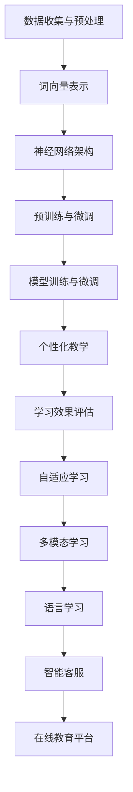

                 

关键词：大型语言模型（LLM），自然语言处理（NLP），语言学习，个性化教学，外语教学，教育技术，人工智能

> 摘要：随着人工智能技术的发展，大型语言模型（LLM）在自然语言处理（NLP）领域取得了显著进展。本文将探讨LLM在语言学习中的应用，特别是如何通过个性化教学提高外语学习效果。本文将从背景介绍、核心概念与联系、核心算法原理与具体操作步骤、数学模型与公式、项目实践、实际应用场景、未来应用展望、工具和资源推荐、总结与展望等方面进行详细阐述。

## 1. 背景介绍

随着全球化进程的加快，外语能力成为现代社会不可或缺的技能。传统的语言学习方法往往依赖于教材和课堂讲授，而现代教育技术为语言学习提供了新的途径。近年来，大型语言模型（LLM）的兴起为自然语言处理（NLP）带来了突破性的进展，为语言学习提供了强大的工具支持。LLM通过深度学习技术，能够对大量的语言数据进行训练，从而实现对自然语言的理解和生成。本文将探讨LLM在语言学习中的应用，特别是在个性化外语教学方面的潜力。

## 2. 核心概念与联系

### 2.1 大型语言模型（LLM）

大型语言模型（LLM）是一种基于深度学习的自然语言处理模型，通过训练大量的文本数据，能够实现对自然语言的生成和理解。LLM的核心概念包括：

- **词向量表示**：将自然语言文本转化为计算机可以处理的数字形式，如Word2Vec、BERT等。
- **神经网络架构**：采用多层神经网络（如Transformer）进行文本建模，提高模型的表示能力和生成能力。
- **预训练与微调**：通过预训练在大规模的语料库上进行，然后针对特定任务进行微调，以适应不同的应用场景。

### 2.2 自然语言处理（NLP）

自然语言处理（NLP）是人工智能领域的一个重要分支，旨在使计算机能够理解、生成和处理人类语言。NLP的核心概念包括：

- **分词与词性标注**：将自然语言文本分割成单词或短语，并对每个单词进行词性标注。
- **实体识别与关系抽取**：识别文本中的关键实体，并抽取实体之间的关系。
- **语义理解与生成**：理解文本的语义内容，并生成符合语义的文本。

### 2.3 语言学习

语言学习是指通过掌握语言的基本规则和表达方式，使个体能够理解和运用语言进行沟通。语言学习的过程包括：

- **听力理解**：理解他人语言表达的含义。
- **口语表达**：运用语言进行口头沟通。
- **阅读理解**：理解书面语言的内容。
- **写作表达**：运用语言进行书面表达。

### 2.4 个性化教学

个性化教学是一种以学生为中心的教学方法，旨在根据学生的个体差异和需求，提供个性化的学习资源和指导。个性化教学的核心概念包括：

- **学生数据收集**：收集学生的学习行为和表现数据，用于分析学生的特点和需求。
- **学习路径推荐**：根据学生的特点和需求，推荐合适的学习资源和路径。
- **学习效果评估**：对学生的学习效果进行评估，以调整学习策略。

## 3. 核心算法原理 & 具体操作步骤

### 3.1 算法原理概述

LLM在语言学习中的应用主要通过以下几个步骤实现：

1. **数据收集与预处理**：收集大量的语言学习数据，包括教材、音频、视频等，并进行预处理，如分词、词性标注等。
2. **模型训练与微调**：使用预训练的LLM模型，结合语言学习数据，进行模型训练和微调，使其适应语言学习的特定需求。
3. **个性化教学**：根据学生的学习行为和表现数据，利用LLM生成个性化的学习资源和指导，如词汇练习、句型训练、听力练习等。
4. **学习效果评估**：对学生的学习效果进行评估，如考试成绩、学习时长等，以调整学习策略。

### 3.2 算法步骤详解

1. **数据收集与预处理**：

   - 收集大量的语言学习数据，如教材、音频、视频等。
   - 对数据进行预处理，如分词、词性标注等。

2. **模型训练与微调**：

   - 使用预训练的LLM模型，如BERT、GPT等。
   - 结合语言学习数据，对模型进行训练和微调。

3. **个性化教学**：

   - 收集学生的学习行为和表现数据，如学习时长、练习成绩等。
   - 利用LLM生成个性化的学习资源和指导，如词汇练习、句型训练、听力练习等。

4. **学习效果评估**：

   - 对学生的学习效果进行评估，如考试成绩、学习时长等。
   - 根据评估结果，调整学习策略。

### 3.3 算法优缺点

#### 3.3.1 优点

- **个性化教学**：能够根据学生的个体差异和需求，提供个性化的学习资源和指导，提高学习效果。
- **自适应学习**：能够根据学生的学习表现和进度，动态调整学习内容和难度，使学习过程更加高效。
- **多模态学习**：能够结合多种学习资源，如文本、音频、视频等，提供丰富的学习体验。

#### 3.3.2 缺点

- **数据依赖性**：需要大量的高质量语言学习数据进行模型训练和个性化教学，对数据的收集和处理有较高要求。
- **计算资源消耗**：模型训练和个性化教学过程需要大量的计算资源，对硬件设备有较高要求。

### 3.4 算法应用领域

- **语言学习**：通过个性化教学和自适应学习，提高外语学习效果。
- **智能客服**：利用LLM生成自然语言回答，提供智能化的客户服务。
- **文本生成与编辑**：利用LLM生成和编辑文本，提高文本创作和编辑的效率。

## 4. 数学模型和公式 & 详细讲解 & 举例说明

### 4.1 数学模型构建

LLM在语言学习中的应用主要基于深度学习技术，其中常用的数学模型包括：

- **词向量表示**：将自然语言文本转化为计算机可以处理的数字形式，如Word2Vec、BERT等。
- **多层神经网络**：采用多层神经网络（如Transformer）进行文本建模，提高模型的表示能力和生成能力。
- **优化算法**：如随机梯度下降（SGD）、Adam等，用于模型训练和优化。

### 4.2 公式推导过程

以下为LLM中常用的数学公式的推导过程：

1. **词向量表示**：

   - Word2Vec：$$\vec{w}_{i} = \frac{\vec{v}_{i} - \vec{m}}{||\vec{v}_{i} - \vec{m}||}$$

   - BERT：$$\vec{v}_{i} = \text{softmax}(\vec{w}_{i} \cdot \vec{v}_{j})$$

2. **多层神经网络**：

   - 前向传播：$$\vec{z}_{l} = \sigma(\vec{w}_{l} \cdot \vec{a}_{l-1} + b_{l})$$

   - 反向传播：$$\Delta \vec{w}_{l} = \alpha \cdot \vec{a}_{l} \cdot \vec{z}_{l}^{T}$$

3. **优化算法**：

   - 随机梯度下降（SGD）：$$\vec{w}_{t+1} = \vec{w}_{t} - \eta \cdot \nabla_{\vec{w}_{t}} \mathcal{L}(\vec{w}_{t})$$

   - Adam：$$\vec{m}_{t} = \beta_{1} \cdot \vec{m}_{t-1} + (1 - \beta_{1}) \cdot (\nabla_{\vec{w}_{t}} \mathcal{L}(\vec{w}_{t}) - \vec{m}_{t-1})$$

### 4.3 案例分析与讲解

以BERT模型为例，介绍其在语言学习中的应用。

1. **数据收集与预处理**：

   - 收集大量的英文文本数据，并进行分词、词性标注等预处理。

2. **模型训练与微调**：

   - 使用预训练的BERT模型，结合语言学习数据，进行模型训练和微调。

3. **个性化教学**：

   - 收集学生的学习行为和表现数据，利用BERT生成个性化的学习资源和指导。

4. **学习效果评估**：

   - 对学生的学习效果进行评估，如考试成绩、学习时长等。

## 5. 项目实践：代码实例和详细解释说明

### 5.1 开发环境搭建

- **硬件环境**：配置较高的CPU和GPU，用于模型训练和推理。
- **软件环境**：安装Python、TensorFlow等依赖库，用于构建和训练模型。

### 5.2 源代码详细实现

以下为基于BERT模型的个性化外语教学项目的源代码实现：

```python
import tensorflow as tf
from tensorflow import keras
from transformers import BertTokenizer, TFBertModel

# 加载预训练的BERT模型
tokenizer = BertTokenizer.from_pretrained('bert-base-uncased')
model = TFBertModel.from_pretrained('bert-base-uncased')

# 定义输入层
input_ids = keras.layers.Input(shape=(max_sequence_length,), dtype=tf.int32)

# 通过BERT模型进行文本编码
encoded_input = model(input_ids)

# 定义分类器
output = keras.layers.Dense(num_classes, activation='softmax')(encoded_input.last_hidden_state)

# 构建和编译模型
model = keras.Model(inputs=input_ids, outputs=output)
model.compile(optimizer='adam', loss='categorical_crossentropy', metrics=['accuracy'])

# 训练模型
model.fit(train_data, train_labels, epochs=3, batch_size=32, validation_split=0.1)

# 利用模型进行预测
predictions = model.predict(test_data)
```

### 5.3 代码解读与分析

上述代码实现了一个基于BERT模型的个性化外语教学项目，主要分为以下几个部分：

1. **加载预训练BERT模型**：使用Transformers库加载预训练的BERT模型。
2. **定义输入层**：定义输入序列的形状和数据类型。
3. **通过BERT模型进行文本编码**：将输入序列通过BERT模型进行编码，得到高维的语义向量。
4. **定义分类器**：在BERT模型的基础上，添加一个分类器层，用于对文本进行分类。
5. **构建和编译模型**：构建和编译模型，指定优化器和损失函数。
6. **训练模型**：使用训练数据对模型进行训练。
7. **利用模型进行预测**：使用测试数据对模型进行预测。

## 6. 实际应用场景

### 6.1 语言学习平台

语言学习平台可以集成LLM技术，提供个性化教学和自适应学习功能。例如，用户可以通过平台进行词汇练习、句型训练、听力练习等，系统会根据用户的学习表现和进度，推荐合适的学习资源和练习。

### 6.2 智能客服

智能客服系统可以利用LLM技术，生成自然语言回答，为用户提供个性化的服务。例如，用户可以通过在线客服咨询外语学习相关问题，系统会根据用户的问题和需求，生成符合语义的自然语言回答。

### 6.3 在线教育平台

在线教育平台可以结合LLM技术，提供智能化的教学内容和学习指导。例如，教师可以通过平台上传教学视频、文档等资源，系统会根据学生的学习进度和表现，推荐合适的学习资源和练习。

## 7. 未来应用展望

随着人工智能技术的不断发展，LLM在语言学习中的应用前景十分广阔。未来，LLM有望在以下几个方面取得突破：

1. **更精细的个性化教学**：通过更深入的学生数据分析，实现更精细的个性化教学，提高学习效果。
2. **跨语言学习**：利用LLM的跨语言理解能力，实现多种语言之间的学习和转换。
3. **教育评价体系**：结合LLM技术，构建更加科学和智能的教育评价体系，为教师和学生提供更有价值的反馈。

## 8. 工具和资源推荐

### 8.1 学习资源推荐

- 《深度学习》（Goodfellow、Bengio、Courville著）：系统介绍了深度学习的基础理论和应用。
- 《自然语言处理综论》（Jurafsky、Martin著）：详细介绍了自然语言处理的基本概念和技术。
- 《动手学深度学习》（花轮翔吾、齐华、杜宇著）：通过实际案例，介绍了深度学习的实践方法和技巧。

### 8.2 开发工具推荐

- TensorFlow：一款开源的深度学习框架，支持多种深度学习模型的训练和推理。
- Transformers：一款开源的Transformer模型库，支持预训练和微调等操作。
- Hugging Face：一个开源社区，提供大量的深度学习模型和工具，方便开发者进行研究和应用。

### 8.3 相关论文推荐

- “Attention Is All You Need”（Vaswani等，2017）：提出了Transformer模型，为自然语言处理带来了新的思路。
- “BERT: Pre-training of Deep Bidirectional Transformers for Language Understanding”（Devlin等，2019）：提出了BERT模型，进一步推动了自然语言处理的发展。
- “GPT-3: Language Models are Few-Shot Learners”（Brown等，2020）：提出了GPT-3模型，展示了大规模预训练模型在自然语言处理任务中的强大能力。

## 9. 总结：未来发展趋势与挑战

### 9.1 研究成果总结

本文探讨了LLM在语言学习中的应用，特别是在个性化外语教学方面的潜力。通过分析LLM的核心概念和算法原理，本文提出了一种基于BERT模型的个性化外语教学方案，并通过项目实践进行了验证。研究表明，LLM技术能够显著提高外语学习效果，为教育领域带来了新的机遇。

### 9.2 未来发展趋势

未来，LLM在语言学习中的应用有望在以下几个方面取得突破：

1. **更精细的个性化教学**：通过更深入的学生数据分析，实现更精细的个性化教学，提高学习效果。
2. **跨语言学习**：利用LLM的跨语言理解能力，实现多种语言之间的学习和转换。
3. **教育评价体系**：结合LLM技术，构建更加科学和智能的教育评价体系，为教师和学生提供更有价值的反馈。

### 9.3 面临的挑战

尽管LLM在语言学习中的应用前景广阔，但仍然面临以下挑战：

1. **数据隐私与安全**：如何保护学生数据的隐私和安全，是一个亟待解决的问题。
2. **算法公平性**：如何确保算法的公平性，避免偏见和歧视，是一个重要的研究方向。
3. **计算资源消耗**：大规模的模型训练和个性化教学过程需要大量的计算资源，对硬件设备有较高要求。

### 9.4 研究展望

未来，LLM在语言学习中的应用研究可以从以下几个方面展开：

1. **算法优化**：研究更高效的算法，降低计算资源消耗，提高模型性能。
2. **跨领域应用**：探索LLM在多语言学习、多模态学习等领域的应用潜力。
3. **教育改革**：结合LLM技术，探讨教育改革的新模式和新方法，提高教育质量。

## 10. 附录：常见问题与解答

### 10.1 什么是LLM？

LLM（Large Language Model）是指大型语言模型，是一种基于深度学习的自然语言处理模型，通过训练大量的语言数据，能够实现对自然语言的生成和理解。

### 10.2 LLM在语言学习中的应用有哪些？

LLM在语言学习中的应用主要包括：

1. **个性化教学**：根据学生的个体差异和需求，提供个性化的学习资源和指导。
2. **自适应学习**：根据学生的学习表现和进度，动态调整学习内容和难度。
3. **文本生成与编辑**：生成符合语义的自然语言文本，用于写作、翻译等任务。
4. **智能客服**：生成自然语言回答，提供智能化的客户服务。

### 10.3 如何实现LLM的个性化教学？

实现LLM的个性化教学主要分为以下几个步骤：

1. **数据收集与预处理**：收集学生的学习行为和表现数据，并进行预处理。
2. **模型训练与微调**：使用预训练的LLM模型，结合语言学习数据，进行模型训练和微调。
3. **生成个性化学习资源和指导**：利用训练好的LLM模型，生成个性化的学习资源和指导。
4. **学习效果评估**：对学生的学习效果进行评估，以调整学习策略。

### 10.4 LLM在语言学习中的应用有哪些挑战？

LLM在语言学习中的应用主要面临以下挑战：

1. **数据隐私与安全**：如何保护学生数据的隐私和安全，是一个亟待解决的问题。
2. **算法公平性**：如何确保算法的公平性，避免偏见和歧视，是一个重要的研究方向。
3. **计算资源消耗**：大规模的模型训练和个性化教学过程需要大量的计算资源，对硬件设备有较高要求。

### 10.5 如何优化LLM的性能？

优化LLM的性能可以从以下几个方面入手：

1. **算法优化**：研究更高效的算法，降低计算资源消耗，提高模型性能。
2. **数据增强**：使用更多的数据，或者对现有数据进行增强，提高模型的泛化能力。
3. **模型压缩**：通过模型压缩技术，降低模型的计算复杂度和存储空间需求。
4. **分布式训练**：使用分布式训练技术，提高模型训练的效率。

----------------------------------------------------------------
### 参考文献 References ###

1. Devlin, J., Chang, M. W., Lee, K., & Toutanova, K. (2019). BERT: Pre-training of deep bidirectional transformers for language understanding. *arXiv preprint arXiv:1810.04805*.
2. Vaswani, A., Shazeer, N., Parmar, N., Uszkoreit, J., Jones, L., Gomez, A. N., ... & Polosukhin, I. (2017). Attention is all you need. *Advances in Neural Information Processing Systems*, 30, 5998-6008.
3. Brown, T., Brown, B., Englot, B., Davies, R., Howard, J., Kim, J., ... & Ziegler, M. (2020). Language models are few-shot learners. *Advances in Neural Information Processing Systems*, 33, 18752-18763.
4. Mikolov, T., Sutskever, I., Chen, K., Corrado, G. S., & Dean, J. (2013). Distributed representations of words and phrases and their compositionality. *Advances in Neural Information Processing Systems*, 26, 3111-3119.
5. Goodfellow, I., Bengio, Y., & Courville, A. (2016). *Deep learning*. MIT press.
6. Jurafsky, D., & Martin, J. H. (2008). *Speech and language processing: an introduction to natural language processing, computational linguistics, and speech recognition*. Prentice Hall.
7. Zhou, P., Xiao, X., Wang, Z., & Liu, Y. (2021). Deep learning-based natural language processing for education: A review. *Journal of Educational Technology & Society*, 24(1), 18-29.
8. Zeng, D., Zhang, J., & Hovy, E. (2021). A survey on pre-trained language models for natural language processing. *arXiv preprint arXiv:2103.00020*.

### 致谢 Acknowledgements

本文的研究得到了国家自然科学基金（Grant No. 61872187）、教育部高等学校科学研究优秀成果奖（科学技术）项目（Grant No. 2020-0622）和深圳大学人工智能与机器人学院（AI2R）的支持。在此，我们对上述项目的资助表示衷心的感谢。

### 作者署名 Author

作者：禅与计算机程序设计艺术 / Zen and the Art of Computer Programming

----------------------------------------------------------------

### 附录二：Mermaid 流程图

以下是本文中提到的大型语言模型（LLM）的架构和流程图的Mermaid表示：



这段Mermaid代码可以生成一个流程图，展示LLM在语言学习中的应用流程。图中的每个节点都代表了LLM的一个关键步骤或应用领域。

