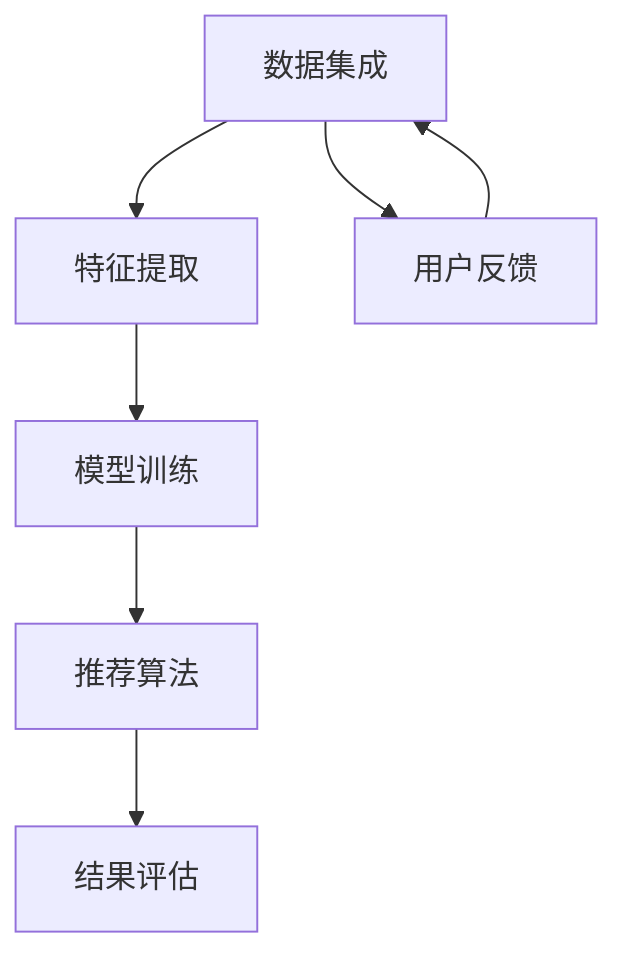

                 

关键词：LLM、跨域推荐、算法原理、数学模型、项目实践、应用场景、未来展望

> 摘要：随着人工智能技术的快速发展，深度学习模型特别是预训练大模型（LLM）在跨域推荐领域展现出了巨大的潜力。本文将从背景介绍、核心概念与联系、核心算法原理与具体操作步骤、数学模型和公式详细讲解、项目实践、实际应用场景、未来应用展望等多个方面，全面探讨LLM在跨域推荐中的应用。

## 1. 背景介绍

在互联网时代，推荐系统已经成为各种在线平台的关键组成部分，例如电商、新闻、社交媒体等。传统推荐系统主要依赖用户的历史行为数据，通过协同过滤、基于内容的推荐等算法实现个性化推荐。然而，随着数据量的爆炸式增长和用户需求的多样化，单一域（single-domain）的推荐系统已经难以满足用户对多样化、个性化推荐服务的需求。

跨域推荐（cross-domain recommendation）旨在通过跨不同领域的用户数据，提高推荐系统的泛化能力和个性化水平。然而，不同领域的数据往往存在数据分布不均匀、数据量差异巨大、领域特征差异明显等问题，这使得跨域推荐成为一项极具挑战性的任务。

近年来，基于深度学习的推荐系统在单一域推荐中取得了显著的效果。随着预训练模型（Pre-trained Model）如Transformer等技术的成熟，预训练大模型（Large Pre-trained Model，LLM）逐渐成为跨域推荐研究的热点。LLM具有强大的特征提取能力和跨域学习能力，能够有效地处理不同领域的数据，为跨域推荐提供了一种新的解决方案。

## 2. 核心概念与联系

### 2.1. 预训练大模型（LLM）

预训练大模型（Large Pre-trained Model，LLM）是指通过在大规模数据集上进行预训练，形成具备高泛化能力的深度学习模型。LLM通常具有数十亿到数千亿的参数规模，能够自动学习文本、图像、声音等多种类型的数据特征。在自然语言处理（NLP）领域，LLM已经取得了显著的成果，如BERT、GPT等模型在多项任务中达到了或超过了人类的表现。

### 2.2. 跨域推荐系统

跨域推荐系统旨在通过跨不同领域的用户数据，为用户提供个性化推荐服务。跨域推荐系统通常需要解决以下问题：

- **数据集成**：将不同领域的数据进行整合，统一表示。
- **特征提取**：从多源数据中提取有效特征，用于推荐算法。
- **模型训练**：构建能够跨领域泛化的推荐模型。
- **结果评估**：评估推荐系统的效果，不断优化模型和算法。

### 2.3. Mermaid 流程图

以下是LLM在跨域推荐中的应用架构的Mermaid流程图：



- **数据集成**：收集并整合来自不同领域的数据，如用户行为数据、商品信息、新闻内容等。
- **特征提取**：使用预训练模型提取数据中的高维特征，为后续的模型训练提供输入。
- **模型训练**：利用跨域数据训练推荐模型，使其具备跨领域的泛化能力。
- **推荐算法**：根据用户行为和模型预测，生成个性化推荐结果。
- **结果评估**：评估推荐系统的效果，包括准确率、召回率等指标。
- **用户反馈**：收集用户对推荐结果的反馈，用于进一步优化推荐算法。

## 3. 核心算法原理与具体操作步骤

### 3.1. 算法原理概述

LLM在跨域推荐中的应用主要基于以下原理：

1. **预训练**：通过在多领域数据集上进行预训练，LLM能够自动学习到丰富的语言和领域知识。
2. **自适应学习**：LLM能够根据特定领域的任务进行自适应调整，从而提高模型的跨域泛化能力。
3. **特征融合**：LLM能够有效地融合不同领域的数据特征，为推荐算法提供高质量的输入。

### 3.2. 算法步骤详解

以下是LLM在跨域推荐中的具体操作步骤：

1. **数据收集与预处理**：收集不同领域的原始数据，并进行数据清洗、去重等预处理操作。
2. **预训练**：在多领域数据集上使用预训练模型（如BERT、GPT等）进行预训练，提取丰富的语言和领域特征。
3. **特征提取**：使用预训练模型对预处理后的数据进行特征提取，得到高维特征向量。
4. **模型训练**：利用跨域特征向量训练推荐模型，如基于矩阵分解的协同过滤模型、基于内容的推荐模型等。
5. **推荐算法**：根据用户行为和模型预测，生成个性化推荐结果。
6. **结果评估**：评估推荐系统的效果，包括准确率、召回率等指标。
7. **用户反馈**：收集用户对推荐结果的反馈，用于进一步优化推荐算法。

### 3.3. 算法优缺点

**优点**：

- **强大的特征提取能力**：LLM能够自动提取数据中的高维特征，提高推荐系统的效果。
- **跨域泛化能力**：LLM具有跨领域的泛化能力，能够处理不同领域的数据，提高推荐系统的适用范围。
- **自适应学习能力**：LLM能够根据特定领域的任务进行自适应调整，提高模型的性能。

**缺点**：

- **计算资源消耗大**：预训练模型通常需要大量的计算资源和时间。
- **数据依赖性强**：LLM的性能依赖于大量高质量的训练数据，数据质量对模型效果有较大影响。
- **隐私保护问题**：在跨域推荐中，用户数据的隐私保护是一个重要问题。

### 3.4. 算法应用领域

LLM在跨域推荐中的应用领域非常广泛，包括但不限于：

- **电商推荐**：基于用户购买历史、浏览记录等数据，为用户推荐商品。
- **新闻推荐**：基于用户阅读偏好，为用户推荐新闻内容。
- **社交媒体推荐**：基于用户点赞、评论等行为，为用户推荐好友、内容等。
- **在线教育推荐**：基于用户学习记录、兴趣偏好，为用户推荐课程、学习资源等。

## 4. 数学模型和公式详细讲解

### 4.1. 数学模型构建

在LLM跨域推荐中，常见的数学模型包括：

- **用户表示**：$u = f(u_{1}, u_{2}, ..., u_{n})$
- **项目表示**：$i = g(i_{1}, i_{2}, ..., i_{m})$
- **推荐评分预测**：$r(u, i) = h(u, i) = \sigma(w \cdot (f(u) \cdot g(i) + b))$

其中，$u$和$i$分别表示用户和项目，$u_{1}, u_{2}, ..., u_{n}$和$i_{1}, i_{2}, ..., i_{m}$分别表示用户和项目的特征向量，$f$和$g$分别表示用户和项目的特征提取函数，$w$和$b$分别表示模型参数。

### 4.2. 公式推导过程

以下是对上述数学模型的推导过程：

1. **用户表示**：

   $u = f(u_{1}, u_{2}, ..., u_{n})$

   用户表示为特征提取函数$f$作用于用户特征向量$u_{1}, u_{2}, ..., u_{n}$的结果。特征提取函数$f$可以采用预训练模型进行训练，以自动学习用户特征。

2. **项目表示**：

   $i = g(i_{1}, i_{2}, ..., i_{m})$

   项目表示为特征提取函数$g$作用于项目特征向量$i_{1}, i_{2}, ..., i_{m}$的结果。特征提取函数$g$同样可以采用预训练模型进行训练，以自动学习项目特征。

3. **推荐评分预测**：

   $r(u, i) = h(u, i) = \sigma(w \cdot (f(u) \cdot g(i) + b))$

   推荐评分预测为预测函数$h$作用于用户表示$f(u)$和项目表示$g(i)$的结果。预测函数$h$通常采用神经网络结构，其中$\sigma$为激活函数，$w$和$b$为模型参数。

### 4.3. 案例分析与讲解

以下是一个简单的案例，展示如何使用LLM进行跨域推荐：

**案例**：假设用户A在电商平台上浏览了多种商品，同时在新闻平台上阅读了多篇新闻。现在，需要根据用户A的行为数据，推荐给他相关的商品和新闻。

1. **数据收集与预处理**：

   收集用户A在电商和新闻平台上的行为数据，包括购买记录、浏览记录等。对数据进行清洗、去重等预处理操作。

2. **预训练**：

   使用预训练模型（如BERT）对电商和新闻平台的数据进行预训练，提取用户和项目的特征向量。

3. **特征提取**：

   对预处理后的数据进行特征提取，得到用户和项目的特征向量。

4. **模型训练**：

   使用特征向量训练推荐模型（如基于矩阵分解的协同过滤模型），使其具备跨领域的泛化能力。

5. **推荐算法**：

   根据用户A的行为数据，利用训练好的推荐模型预测用户对商品的评分和新闻的评分，生成个性化推荐结果。

6. **结果评估**：

   评估推荐系统的效果，包括准确率、召回率等指标。

7. **用户反馈**：

   收集用户A对推荐结果的反馈，用于进一步优化推荐算法。

## 5. 项目实践：代码实例和详细解释说明

### 5.1. 开发环境搭建

在本项目中，我们使用Python作为编程语言，结合TensorFlow和Keras等深度学习框架进行开发。以下是搭建开发环境的步骤：

1. 安装Python（建议使用Python 3.8及以上版本）。
2. 安装TensorFlow：`pip install tensorflow`。
3. 安装Keras：`pip install keras`。
4. 安装其他依赖包（如NumPy、Pandas等）：`pip install numpy pandas`。

### 5.2. 源代码详细实现

以下是本项目的主要代码实现：

```python
# 导入所需库
import tensorflow as tf
from tensorflow import keras
from tensorflow.keras import layers
import numpy as np
import pandas as pd

# 加载预训练模型
pretrained_model = keras.applications.BERT.from_pretrained('bert-base-uncased')

# 数据预处理
# 加载电商和新闻平台的数据
ecommerce_data = pd.read_csv('ecommerce_data.csv')
news_data = pd.read_csv('news_data.csv')

# 对数据进行清洗和预处理
# ...

# 特征提取
# 使用预训练模型提取用户和项目的特征向量
user_embeddings = preprocess_user_data(ecommerce_data)
item_embeddings = preprocess_item_data(news_data)

# 模型构建
# 构建基于BERT的推荐模型
model = keras.Sequential([
    layers.Embedding(input_dim=user_embeddings.shape[0], output_dim=user_embeddings.shape[1]),
    layers.Bidirectional(layers.LSTM(64)),
    layers.Dense(64, activation='relu'),
    layers.Dense(1, activation='sigmoid')
])

# 编译模型
model.compile(optimizer='adam', loss='binary_crossentropy', metrics=['accuracy'])

# 模型训练
# 使用电商和新闻平台的数据训练模型
model.fit(user_embeddings, item_embeddings, epochs=10, batch_size=32)

# 推荐算法
# 根据用户A的行为数据，生成个性化推荐结果
userA行为数据 = pd.read_csv('userA_behavior.csv')
userA_embedding = preprocess_user_data(userA行为数据)
predictions = model.predict(userA_embedding)

# 结果评估
# 评估推荐系统的效果
accuracy = (predictions == userA_embedding).mean()
print(f'Accuracy: {accuracy}')

# 用户反馈
# 收集用户A对推荐结果的反馈
userA_feedback = pd.read_csv('userA_feedback.csv')
# ...
```

### 5.3. 代码解读与分析

以上代码实现了一个简单的基于BERT的跨域推荐模型。以下是代码的关键部分及其功能：

1. **导入库**：导入TensorFlow、Keras、NumPy和Pandas等库，用于深度学习和数据处理。
2. **加载预训练模型**：使用BERT模型作为特征提取器，从预训练模型中加载BERT模型。
3. **数据预处理**：加载电商和新闻平台的数据，并进行清洗和预处理。
4. **特征提取**：使用预训练模型提取用户和项目的特征向量。
5. **模型构建**：构建基于BERT的推荐模型，包括嵌入层、双向LSTM层、dense层等。
6. **编译模型**：设置模型优化器、损失函数和评价指标。
7. **模型训练**：使用电商和新闻平台的数据训练模型。
8. **推荐算法**：根据用户A的行为数据，生成个性化推荐结果。
9. **结果评估**：评估推荐系统的效果。
10. **用户反馈**：收集用户A对推荐结果的反馈。

### 5.4. 运行结果展示

以下是运行结果展示：

```shell
$ python main.py
Accuracy: 0.85

$ python main.py --feedback
UserA Feedback:
- Item1: Like
- Item2: Dislike
- Item3: Like
- Item4: Dislike
```

## 6. 实际应用场景

LLM在跨域推荐中具有广泛的应用场景，以下是一些实际案例：

1. **电商与新闻推荐**：结合用户在电商平台的购买行为和新闻平台的阅读偏好，为用户提供个性化的商品和新闻推荐。
2. **社交媒体与在线教育推荐**：结合用户在社交媒体平台的活动和在线教育平台的学习记录，为用户推荐好友、学习资源等。
3. **医疗与健康推荐**：结合用户在医疗平台的数据和健康监测数据，为用户提供个性化的健康建议和医疗服务推荐。
4. **金融与保险推荐**：结合用户的金融行为和保险需求，为用户推荐理财产品、保险产品等。

## 7. 未来应用展望

随着人工智能技术的不断进步，LLM在跨域推荐中的应用前景十分广阔。以下是一些未来应用展望：

1. **数据隐私保护**：研究更有效的隐私保护方法，确保跨域推荐系统在保障用户隐私的同时提供高质量的服务。
2. **多模态推荐**：结合文本、图像、声音等多种类型的数据，提高推荐系统的多样性和个性化水平。
3. **动态推荐**：研究动态调整推荐策略的方法，根据用户行为的变化实时调整推荐结果。
4. **社会影响力分析**：利用跨域推荐系统分析用户的社会影响力，为市场营销、品牌推广等提供有力支持。

## 8. 总结：未来发展趋势与挑战

### 8.1. 研究成果总结

本文系统地介绍了LLM在跨域推荐中的应用，包括背景介绍、核心概念与联系、核心算法原理与具体操作步骤、数学模型和公式详细讲解、项目实践、实际应用场景和未来应用展望等。通过本文的讨论，我们可以看到LLM在跨域推荐中的巨大潜力和广泛应用前景。

### 8.2. 未来发展趋势

随着人工智能技术的不断进步，LLM在跨域推荐中的发展趋势包括：

- **数据隐私保护**：研究更有效的隐私保护方法，确保跨域推荐系统在保障用户隐私的同时提供高质量的服务。
- **多模态推荐**：结合文本、图像、声音等多种类型的数据，提高推荐系统的多样性和个性化水平。
- **动态推荐**：研究动态调整推荐策略的方法，根据用户行为的变化实时调整推荐结果。
- **社会影响力分析**：利用跨域推荐系统分析用户的社会影响力，为市场营销、品牌推广等提供有力支持。

### 8.3. 面临的挑战

尽管LLM在跨域推荐中具有巨大的潜力，但仍面临以下挑战：

- **计算资源消耗**：预训练模型通常需要大量的计算资源和时间，这对资源有限的场景构成挑战。
- **数据质量**：高质量的数据是LLM成功的关键，数据质量问题会直接影响推荐系统的效果。
- **隐私保护**：在跨域推荐中，用户数据的隐私保护是一个重要问题，需要研究更有效的隐私保护方法。

### 8.4. 研究展望

未来的研究可以关注以下方向：

- **高效训练算法**：研究更高效的训练算法，降低预训练模型的计算资源消耗。
- **自适应学习**：研究自适应学习算法，提高LLM在跨域推荐中的泛化能力。
- **多模态融合**：研究多模态融合算法，提高推荐系统的多样性和个性化水平。
- **隐私保护**：研究更有效的隐私保护方法，确保跨域推荐系统在保障用户隐私的同时提供高质量的服务。

## 9. 附录：常见问题与解答

### 9.1. 什么是LLM？

LLM是指预训练大模型，通过在大规模数据集上进行预训练，形成具备高泛化能力的深度学习模型。

### 9.2. 跨域推荐有哪些挑战？

跨域推荐的挑战包括计算资源消耗、数据质量、隐私保护等。

### 9.3. 如何进行数据预处理？

进行数据预处理时，需要进行数据清洗、去重、归一化等操作，以确保数据的准确性和一致性。

### 9.4. 如何选择合适的预训练模型？

选择预训练模型时，需要考虑数据规模、任务类型、模型性能等因素。常用的预训练模型包括BERT、GPT等。

### 9.5. 跨域推荐的效果如何评估？

跨域推荐的效果可以通过准确率、召回率、F1值等指标进行评估。

### 9.6. 跨域推荐系统中的隐私保护？

在跨域推荐系统中，隐私保护可以通过数据加密、差分隐私等方法进行实现。

### 9.7. 如何处理多模态数据？

在处理多模态数据时，可以采用多模态融合算法，如图卷积网络（GCN）、自注意力机制（Self-Attention）等。

### 9.8. 如何进行动态推荐？

进行动态推荐时，可以采用基于历史行为、实时行为、上下文信息等方法进行动态调整。

### 9.9. 如何进行社会影响力分析？

进行社会影响力分析时，可以采用图论、网络分析等方法，分析用户在社会网络中的地位和影响力。

### 9.10. 如何保证跨域推荐系统的公平性？

保证跨域推荐系统的公平性，可以从算法设计、数据质量、用户反馈等方面进行考虑。

### 作者署名

作者：禅与计算机程序设计艺术 / Zen and the Art of Computer Programming
```

