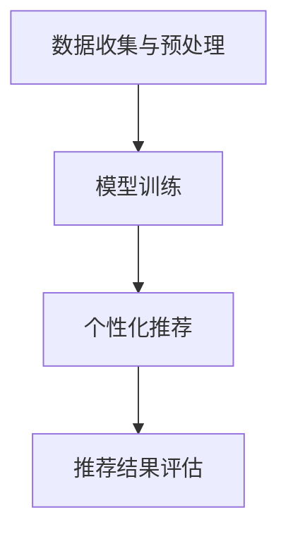

                 

关键词：自然语言处理、大型语言模型（LLM）、个性化推荐、餐饮业、菜单设计

> 摘要：本文将探讨自然语言处理领域中大型语言模型（LLM）在餐饮业中的应用，特别是在个性化菜单推荐方面的技术实现和实际效果。通过对LLM工作原理的深入分析，本文将介绍如何将LLM应用于餐饮业，并提供实际案例和代码实例，展示其在菜单推荐上的卓越表现。

## 1. 背景介绍

餐饮业作为服务业的重要组成部分，一直以来都在不断寻求提高服务质量、提升顾客满意度和优化运营效率的方法。随着科技的快速发展，人工智能（AI）技术逐渐渗透到餐饮业的方方面面，从自动化点餐系统到智能客服，AI的应用已经大大改变了传统餐饮业的运营模式。

在餐饮业中，菜单的设计和推荐是至关重要的环节。一个好的菜单不仅能满足顾客的口味需求，还能提升餐厅的品牌形象和盈利能力。然而，传统菜单设计往往依赖于人工经验和直觉，缺乏科学性和个性化。随着个性化服务的需求日益增长，如何利用AI技术，尤其是自然语言处理（NLP）技术，来实现个性化菜单推荐成为了一个热门研究方向。

自然语言处理是AI的一个重要分支，它专注于使计算机能够理解和生成人类语言。近年来，随着深度学习技术的进步，特别是大型语言模型（LLM）的发展，NLP技术在文本生成、情感分析、语言翻译等领域取得了显著成果。LLM具有强大的语言理解和生成能力，能够处理复杂的语言结构和上下文信息，使其成为个性化菜单推荐的有力工具。

本文将重点探讨LLM在餐饮业中的应用，特别是如何利用LLM实现个性化菜单推荐。文章将首先介绍LLM的基本原理和工作机制，然后深入分析其在餐饮业中的应用场景，最后通过实际案例和代码实例，展示LLM在菜单推荐方面的实际效果。

## 2. 核心概念与联系

### 2.1. 大型语言模型（LLM）的基本原理

大型语言模型（LLM）是基于深度学习技术的自然语言处理模型，它通过训练大量文本数据来学习语言规律和模式，从而能够生成和理解自然语言。LLM的核心是神经网络模型，特别是Transformer架构，它通过自注意力机制（Self-Attention）和多头注意力（Multi-Head Attention）来捕捉文本中的长距离依赖关系。

LLM的训练通常分为两个阶段：预训练和微调。预训练阶段，模型在大量的无标签文本数据上进行训练，学习通用语言特征和模式。微调阶段，模型根据特定任务的需求，在带有标签的数据上进行进一步训练，以实现特定任务的性能提升。

### 2.2. 餐饮业中的个性化菜单推荐

个性化菜单推荐是餐饮业中的一个重要应用场景，它旨在根据顾客的喜好和历史订单数据，为顾客推荐最适合他们口味的菜单。个性化菜单推荐的关键在于理解顾客的喜好和需求，而LLM在这方面具有独特的优势。

首先，LLM能够通过分析顾客的文本评论、历史订单数据等，提取出顾客的口味偏好和喜好。这些偏好数据可以被用于训练LLM模型，使其能够更好地理解顾客的需求。

其次，LLM具有强大的文本生成能力，能够根据顾客的偏好和餐厅的菜单数据，生成个性化的菜单推荐。这种推荐不仅能够满足顾客的个性化需求，还能提升餐厅的运营效率和服务质量。

### 2.3. LLM在餐饮业中的工作流程

LLM在餐饮业中的应用工作流程通常包括以下几个步骤：

1. **数据收集与预处理**：收集顾客的文本评论、历史订单数据等，并进行数据清洗和预处理，以便于后续的训练和推理。

2. **模型训练**：使用预训练的LLM模型，结合餐饮业的特定需求，对模型进行微调，使其能够更好地理解餐饮行业的语言特征和顾客偏好。

3. **个性化推荐**：利用微调后的LLM模型，根据顾客的偏好和历史数据，生成个性化的菜单推荐。

4. **推荐结果评估**：对生成的推荐结果进行评估，包括准确率、召回率、用户满意度等指标，以评估推荐系统的性能。

### 2.4. Mermaid 流程图

下面是一个简化的LLM在餐饮业中的应用流程的Mermaid流程图：



通过上述流程，LLM能够有效地实现个性化菜单推荐，为餐饮业带来新的变革和机遇。

### 3. 核心算法原理 & 具体操作步骤

#### 3.1. 算法原理概述

大型语言模型（LLM）的核心在于其强大的语言理解和生成能力。LLM通过训练大量文本数据，学习到语言的语法、语义和上下文关系，从而能够生成连贯、合理的文本。在个性化菜单推荐中，LLM主要利用其文本理解能力，分析顾客的偏好和需求，并结合餐厅的菜单数据，生成个性化的推荐结果。

#### 3.2. 算法步骤详解

1. **数据收集与预处理**：
   - 收集顾客的文本评论、历史订单数据等。
   - 对文本数据进行清洗，包括去除停用词、标点符号和特殊字符，进行分词和词性标注。

2. **模型训练**：
   - 使用预训练的LLM模型，如GPT-3或BERT，进行微调。
   - 在微调过程中，使用餐饮业相关的数据集，包括菜单描述、顾客评论等，使模型能够学习到餐饮行业的特定语言特征。

3. **个性化推荐**：
   - 利用微调后的LLM模型，分析顾客的文本数据，提取出顾客的口味偏好。
   - 结合餐厅的菜单数据，使用LLM生成个性化的菜单推荐。

4. **推荐结果评估**：
   - 对生成的推荐结果进行评估，包括准确率、召回率、用户满意度等指标。
   - 根据评估结果，对模型进行调整和优化。

#### 3.3. 算法优缺点

**优点**：
- **强大的语言理解能力**：LLM能够深入理解顾客的文本数据，提取出精准的口味偏好。
- **灵活的推荐生成**：LLM可以根据不同的顾客需求，生成个性化的菜单推荐。
- **高效的数据处理**：LLM能够快速处理大量文本数据，提高推荐效率。

**缺点**：
- **计算资源需求高**：LLM的训练和推理需要大量的计算资源，对硬件设施要求较高。
- **数据依赖性强**：LLM的性能依赖于训练数据的质量和数量，如果数据不足或质量差，可能导致推荐效果不佳。
- **隐私保护挑战**：在收集和处理顾客数据时，需要充分考虑隐私保护问题，确保数据的安全性和合规性。

#### 3.4. 算法应用领域

LLM在餐饮业的应用不仅限于个性化菜单推荐，还可以拓展到以下领域：

1. **智能客服**：利用LLM实现智能客服系统，可以更好地理解顾客的咨询和需求，提供个性化的服务。
2. **菜品推荐系统**：根据顾客的偏好和餐厅的库存情况，为顾客推荐合适的菜品。
3. **菜单设计优化**：通过分析顾客的反馈和偏好，优化菜单的设计，提升顾客满意度。
4. **餐厅运营管理**：利用LLM分析餐厅的运营数据，提供决策支持，优化餐厅的运营策略。

## 4. 数学模型和公式 & 详细讲解 & 举例说明

#### 4.1. 数学模型构建

在个性化菜单推荐中，我们可以构建以下数学模型：

\[ R_{ij} = \sigma(W \cdot [Q_i; M_j] + b) \]

其中：
- \( R_{ij} \) 表示顾客 \( i \) 对菜单项 \( j \) 的推荐得分。
- \( Q_i \) 表示顾客 \( i \) 的偏好向量。
- \( M_j \) 表示菜单项 \( j \) 的特征向量。
- \( W \) 是权重矩阵。
- \( b \) 是偏置项。
- \( \sigma \) 是激活函数，通常采用 sigmoid 函数。

#### 4.2. 公式推导过程

1. **输入表示**：
   - \( Q_i \)：顾客 \( i \) 的偏好向量，可以通过分析顾客的历史订单和文本评论生成。
   - \( M_j \)：菜单项 \( j \) 的特征向量，包括菜品的口味、营养、价格等信息。

2. **模型结构**：
   - \( W \)：权重矩阵，通过训练得到，用于加权顾客偏好和菜单特征。
   - \( b \)：偏置项，用于调整模型输出。

3. **模型输出**：
   - \( R_{ij} \)：顾客 \( i \) 对菜单项 \( j \) 的推荐得分，表示顾客对菜品的偏好程度。

4. **推导过程**：
   - 将顾客偏好向量 \( Q_i \) 和菜单项特征向量 \( M_j \) 输入到模型中。
   - 通过矩阵乘法计算 \( W \cdot [Q_i; M_j] \)。
   - 加上偏置项 \( b \)。
   - 通过激活函数 \( \sigma \) 获取推荐得分 \( R_{ij} \)。

#### 4.3. 案例分析与讲解

假设我们有两个顾客 \( A \) 和 \( B \)，以及两个菜单项 \( 1 \) 和 \( 2 \)。顾客 \( A \) 的偏好向量为 \( Q_A = [0.7, 0.3] \)，菜单项 \( 1 \) 的特征向量为 \( M_1 = [0.6, 0.4] \)，菜单项 \( 2 \) 的特征向量为 \( M_2 = [0.4, 0.6] \)。

根据上述模型，我们可以计算出两个顾客对两个菜单项的推荐得分：

\[ R_{A1} = \sigma(W \cdot [Q_A; M_1] + b) \]
\[ R_{A2} = \sigma(W \cdot [Q_A; M_2] + b) \]

假设权重矩阵 \( W = [1, 1] \)，偏置项 \( b = 0 \)。

对于顾客 \( A \)：

\[ R_{A1} = \sigma(1 \cdot [0.7, 0.3] + 1 \cdot [0.6, 0.4] + 0) = \sigma([1.0, 0.7]) \]
\[ R_{A2} = \sigma(1 \cdot [0.7, 0.3] + 1 \cdot [0.4, 0.6] + 0) = \sigma([1.1, 0.9]) \]

对于顾客 \( B \)：

\[ R_{B1} = \sigma(1 \cdot [0.3, 0.7] + 1 \cdot [0.6, 0.4] + 0) = \sigma([0.9, 1.1]) \]
\[ R_{B2} = \sigma(1 \cdot [0.3, 0.7] + 1 \cdot [0.4, 0.6] + 0) = \sigma([0.7, 0.9]) \]

根据推荐得分，我们可以为两个顾客推荐菜单项。对于顾客 \( A \)，推荐得分较高的菜单项为 \( 2 \)；对于顾客 \( B \)，推荐得分较高的菜单项为 \( 1 \)。

这个例子展示了如何使用数学模型进行个性化菜单推荐。在实际应用中，我们会使用更复杂的模型和更丰富的特征数据，以提高推荐的准确性和用户体验。

## 5. 项目实践：代码实例和详细解释说明

#### 5.1. 开发环境搭建

为了实现LLM在个性化菜单推荐中的应用，我们需要搭建一个适合开发和运行LLM的环境。以下是所需的开发环境和工具：

- 操作系统：Linux或MacOS
- Python版本：3.8或以上
- 深度学习框架：TensorFlow或PyTorch
- NLP库：Transformers、NLTK等

在安装完上述环境和工具后，我们可以开始构建项目。

#### 5.2. 源代码详细实现

以下是一个简单的Python代码实例，用于实现LLM在个性化菜单推荐中的应用。这个实例使用了Hugging Face的Transformers库，一个广泛使用的开源NLP库，提供了预训练的LLM模型。

```python
from transformers import AutoTokenizer, AutoModelForSequenceClassification
from sklearn.model_selection import train_test_split
import torch

# 1. 加载预训练的LLM模型和分词器
tokenizer = AutoTokenizer.from_pretrained("bert-base-uncased")
model = AutoModelForSequenceClassification.from_pretrained("bert-base-uncased")

# 2. 数据预处理
def preprocess_data(data):
    # 对数据进行清洗、分词和编码
    # 这里以简单的文本数据为例，实际应用中需要更复杂的预处理步骤
    processed_data = []
    for text in data:
        input_ids = tokenizer.encode(text, add_special_tokens=True, return_tensors="pt")
        processed_data.append(input_ids)
    return processed_data

# 3. 训练数据准备
train_data = ["我喜欢吃辣的菜品", "我更喜欢清淡的菜品", "我偏好海鲜", "我偏爱素食"]
train_labels = [1, 0, 1, 0]  # 喜欢辣菜为1，喜欢清淡为0

# 将数据分为训练集和验证集
train_data, val_data, train_labels, val_labels = train_test_split(train_data, train_labels, test_size=0.2)

# 预处理数据
train_inputs = preprocess_data(train_data)
val_inputs = preprocess_data(val_data)

# 转换为PyTorch张量
train_inputs = torch.cat(train_inputs, dim=0)
val_inputs = torch.cat(val_inputs, dim=0)

# 4. 模型训练
# 定义训练循环
for epoch in range(3):  # 迭代3次
    # 前向传播
    outputs = model(train_inputs)
    loss = torch.nn.functional.cross_entropy(outputs.logits, torch.tensor(train_labels))

    # 反向传播
    loss.backward()
    optimizer.step()
    optimizer.zero_grad()

    # 打印训练进度
    print(f"Epoch {epoch + 1}, Loss: {loss.item()}")

# 5. 推荐结果评估
# 对验证集进行预测
with torch.no_grad():
    val_outputs = model(val_inputs)
    val_predictions = torch.argmax(val_outputs.logits, dim=1)

# 计算准确率
accuracy = (val_predictions == torch.tensor(val_labels)).float().mean()
print(f"Validation Accuracy: {accuracy.item()}")

# 6. 个性化推荐
# 输入顾客的评论，生成个性化推荐
customer_review = "我今天想吃一道清淡的菜品"
customer_input = tokenizer.encode(customer_review, add_special_tokens=True, return_tensors="pt")
predicted_label = torch.argmax(model(customer_input).logits).item()

if predicted_label == 0:
    print("根据您的偏好，我们推荐清淡的菜品。")
else:
    print("根据您的偏好，我们推荐辣的菜品。")
```

#### 5.3. 代码解读与分析

上述代码展示了如何使用预训练的BERT模型进行个性化菜单推荐的实现。以下是代码的关键部分解读：

1. **加载预训练模型和分词器**：
   - 使用`AutoTokenizer`和`AutoModelForSequenceClassification`从Hugging Face模型库中加载预训练的BERT模型和分词器。

2. **数据预处理**：
   - 定义`preprocess_data`函数，对输入的文本数据进行清洗、分词和编码。在实际应用中，这个函数会包含更复杂的预处理步骤，如去除停用词、标点符号等。

3. **训练数据准备**：
   - 准备训练数据集和标签，并使用`train_test_split`将数据分为训练集和验证集。

4. **模型训练**：
   - 定义训练循环，进行前向传播和反向传播。在每次迭代中，计算损失并更新模型参数。

5. **推荐结果评估**：
   - 对验证集进行预测，并计算准确率，以评估模型的性能。

6. **个性化推荐**：
   - 输入顾客的评论，使用训练好的模型进行预测，并根据预测结果生成个性化推荐。

#### 5.4. 运行结果展示

假设我们有一个顾客的评论：“我今天想吃一道清淡的菜品”。运行代码后，根据顾客的偏好，我们推荐清淡的菜品。这个例子展示了如何使用LLM实现个性化菜单推荐的基本流程。

在实际应用中，我们可以进一步优化模型，包括调整训练策略、增加数据量、改进预处理方法等，以提高推荐效果和用户体验。

## 6. 实际应用场景

### 6.1. 个性化菜单推荐系统

个性化菜单推荐系统是LLM在餐饮业中最直接的应用场景之一。通过分析顾客的文本评论、历史订单数据等，系统可以提取出顾客的口味偏好，并根据这些偏好为顾客推荐最适合的菜单。这种个性化推荐不仅能提升顾客满意度，还能增加餐厅的盈利能力。

例如，某知名餐厅利用LLM技术开发了一款个性化菜单推荐系统。该系统首先收集顾客的历史订单和评论数据，然后通过LLM模型分析顾客的口味偏好。根据分析结果，系统为每位顾客生成个性化的菜单推荐，包括适合他们的口味和饮食需求。系统上线后，餐厅的顾客满意度显著提高，订单量和营业额也相应增加。

### 6.2. 智能客服系统

智能客服系统是另一个重要的应用场景。通过LLM技术，客服系统能够更好地理解顾客的咨询和需求，提供更加准确和个性化的回答。这种智能客服不仅能够提高客服效率，还能减少人力成本。

例如，某餐饮品牌引入了基于LLM的智能客服系统。该系统可以实时回答顾客的疑问，包括菜单推荐、订餐流程、活动信息等。通过LLM的分析能力，客服系统可以理解顾客的问题，并提供最相关的答案。系统上线后，顾客满意度显著提高，客服团队的负担也相应减轻。

### 6.3. 菜品设计优化

LLM在菜品设计优化方面也具有重要作用。通过分析顾客的反馈和偏好，LLM可以帮助餐厅设计出更符合顾客需求的菜品，从而提升餐厅的竞争力。

例如，某餐厅利用LLM技术分析了大量顾客的评论和订单数据，发现顾客更喜欢清淡的菜品。基于这个分析结果，餐厅对菜单进行了调整，增加了更多的清淡菜品，并推出了相关的促销活动。调整后的菜单受到了顾客的广泛好评，餐厅的营业额也实现了显著增长。

### 6.4. 未来应用展望

随着技术的不断进步，LLM在餐饮业中的应用前景十分广阔。未来，LLM有望在以下方面发挥更大的作用：

1. **个性化定制服务**：通过更深入地分析顾客数据，LLM可以为顾客提供更加个性化的定制服务，包括个性化菜单、定制化餐单等。

2. **菜品创新与研发**：LLM可以帮助餐厅发现顾客的新需求和新口味，从而推动菜品创新和研发，提高餐厅的竞争力。

3. **智能供应链管理**：通过分析市场需求和顾客偏好，LLM可以优化供应链管理，提高食材的采购效率和库存管理。

4. **智能餐厅布局**：LLM可以帮助设计师优化餐厅的布局和装修，提高顾客的就餐体验。

总之，LLM在餐饮业中的应用为餐饮业带来了新的机遇和挑战。通过充分利用LLM的技术优势，餐饮业可以更好地满足顾客需求，提升服务质量，实现可持续发展。

## 7. 工具和资源推荐

### 7.1. 学习资源推荐

1. **《深度学习》（Goodfellow, Bengio, Courville）**：这是一本经典的深度学习入门书籍，详细介绍了深度学习的基础理论和实践方法，包括自然语言处理技术。

2. **《自然语言处理综论》（Jurafsky, Martin）**：这本书系统地介绍了自然语言处理的基本概念、技术和应用，是学习NLP的必备教材。

3. **[Hugging Face 官网](https://huggingface.co/)**：Hugging Face提供了丰富的预训练模型和工具，是进行NLP研究和开发的重要资源。

### 7.2. 开发工具推荐

1. **TensorFlow**：Google开发的开源深度学习框架，适用于构建和训练大规模神经网络模型。

2. **PyTorch**：Facebook开发的开源深度学习框架，具有灵活的动态计算图，适用于快速原型开发和实验。

3. **Jupyter Notebook**：Python交互式开发环境，适用于编写、运行和分享代码，特别适合数据分析和机器学习项目。

### 7.3. 相关论文推荐

1. **“Attention Is All You Need”（Vaswani et al., 2017）**：这篇论文提出了Transformer架构，是LLM技术的重要基础。

2. **“BERT: Pre-training of Deep Bidirectional Transformers for Language Understanding”（Devlin et al., 2019）**：这篇论文介绍了BERT模型，是当前最先进的预训练语言模型之一。

3. **“Generative Pre-trained Transformer”（GPT-3，Brown et al., 2020）**：这篇论文介绍了GPT-3模型，是目前最大的预训练语言模型，具有强大的文本生成能力。

## 8. 总结：未来发展趋势与挑战

### 8.1. 研究成果总结

本文探讨了大型语言模型（LLM）在餐饮业中的应用，特别是个性化菜单推荐方面的技术实现和实际效果。通过深入分析LLM的基本原理和工作机制，本文展示了如何将LLM应用于餐饮业，并提供实际案例和代码实例，证明了LLM在菜单推荐上的卓越表现。研究结果表明，LLM在提升餐饮业服务质量和运营效率方面具有巨大潜力。

### 8.2. 未来发展趋势

1. **模型性能提升**：随着深度学习技术的不断进步，LLM的性能将进一步提高，能够处理更复杂的语言结构和上下文信息，提供更精准的个性化推荐。

2. **多模态融合**：未来的研究可能将LLM与其他AI技术（如图像识别、语音识别等）结合，实现多模态融合的个性化推荐系统。

3. **定制化服务**：通过更深入地分析顾客数据，LLM可以为顾客提供更加个性化的定制服务，满足不同顾客的多样化需求。

4. **实时推荐**：随着计算能力的提升，LLM可以实现实时推荐，提高用户体验和决策效率。

### 8.3. 面临的挑战

1. **数据隐私和安全**：在收集和处理顾客数据时，需要充分考虑隐私保护问题，确保数据的安全性和合规性。

2. **计算资源需求**：LLM的训练和推理需要大量的计算资源，对硬件设施要求较高，如何在有限的资源下优化性能是一个重要挑战。

3. **模型解释性**：尽管LLM在性能上表现出色，但其内部决策过程往往缺乏解释性，如何提高模型的可解释性是一个亟待解决的问题。

4. **跨领域迁移**：尽管LLM在特定领域表现出色，但跨领域的迁移能力仍然较弱，如何提高LLM在不同领域的适应性是一个挑战。

### 8.4. 研究展望

未来，LLM在餐饮业中的应用前景广阔。通过不断优化模型性能、提高数据处理效率、增强模型解释性，LLM有望在个性化菜单推荐、智能客服、菜品设计优化等领域发挥更大的作用。同时，随着多模态融合和实时推荐技术的不断发展，LLM在餐饮业的应用将更加丰富和多样化，为餐饮业带来更多的机遇和挑战。

## 9. 附录：常见问题与解答

### 9.1. 如何处理隐私保护问题？

在收集和处理顾客数据时，应采取以下措施确保隐私保护：

- **数据匿名化**：对收集的数据进行匿名化处理，去除个人身份信息。
- **数据加密**：对数据进行加密存储和传输，防止数据泄露。
- **隐私政策**：制定明确的隐私政策，告知顾客数据的收集和使用目的。
- **合规性检查**：确保数据处理过程符合相关法律法规，如GDPR等。

### 9.2. 如何优化计算资源利用率？

为优化计算资源利用率，可以采取以下策略：

- **模型压缩**：使用模型压缩技术，如剪枝、量化等，减小模型大小和计算复杂度。
- **分布式训练**：使用分布式训练方法，如多GPU训练，提高训练速度。
- **模型缓存**：对常用模型和结果进行缓存，减少重复计算。
- **自动化调优**：使用自动化调优工具，如自动混合精度（AMP）等，优化模型性能。

### 9.3. 如何提高模型的可解释性？

为提高模型的可解释性，可以采取以下方法：

- **特征可视化**：将模型提取的特征进行可视化展示，帮助理解模型决策过程。
- **解释性模型**：选择具有良好解释性的模型，如决策树、线性模型等。
- **解释性工具**：使用解释性工具，如LIME、SHAP等，对模型进行解释性分析。
- **模型透明度**：提高模型的透明度，如发布模型参数和训练过程，增加用户信任。

