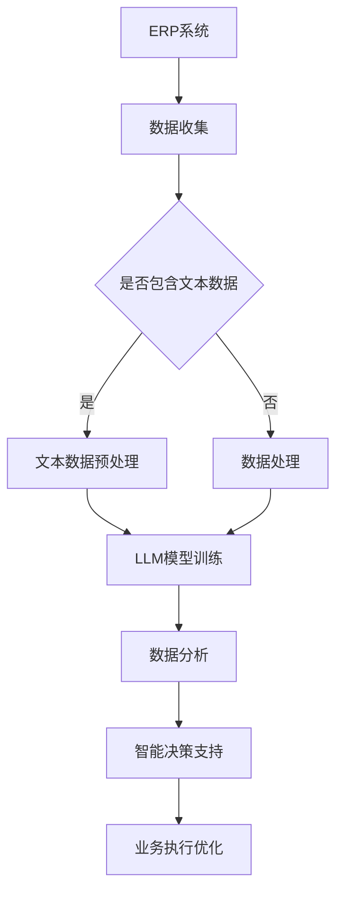

                 

关键词：大型语言模型、企业资源规划、LLM技术、数字化转型、数据分析、智能决策

> 摘要：随着人工智能技术的快速发展，特别是大型语言模型（LLM）的突破性进展，企业资源规划（ERP）领域正经历着一场深刻的变革。本文将探讨LLM在ERP中的应用，分析其带来的创新和挑战，以及未来的发展趋势。

## 1. 背景介绍

企业资源规划（ERP）系统自20世纪90年代问世以来，已经成为企业运营管理的重要工具。ERP系统整合了企业的财务、人力资源、供应链、生产等多个业务模块，通过统一的数据平台实现了信息流的集中和实时共享，极大地提高了企业的管理效率和决策质量。

然而，随着商业环境的快速变化和数据量的指数级增长，传统ERP系统在处理复杂决策和实时分析方面逐渐显露出局限性。企业面临着如何从海量数据中提取有价值的信息、如何应对突发性事件和如何在竞争中保持敏捷性的挑战。因此，寻找新的技术手段以提升ERP系统的智能水平和决策能力，成为企业数字化转型的重要方向。

近年来，深度学习和自然语言处理技术的迅猛发展，特别是大型语言模型（LLM）的出现，为ERP系统的智能化转型提供了新的契机。LLM能够通过处理大规模语料库，学习并理解人类语言，从而在文本分析、智能问答、自动摘要等方面展现出卓越的能力。将这些能力应用于ERP系统，有望极大地提升企业的数据分析能力和决策质量。

## 2. 核心概念与联系

### 2.1 企业资源规划（ERP）的基本概念

企业资源规划（ERP，Enterprise Resource Planning）是一种集成企业各种业务活动的信息系统，旨在通过优化企业资源的使用，提高企业的运营效率和管理水平。ERP系统通常包括以下几个主要模块：

- **财务模块**：管理企业的财务活动，包括会计、预算、资金管理、审计等。
- **人力资源模块**：管理员工信息、招聘、培训、薪酬、绩效评估等。
- **供应链模块**：管理供应链的各个环节，包括采购、库存、物流、生产等。
- **销售与市场模块**：管理销售活动、市场推广、客户关系等。
- **项目管理模块**：管理项目进度、资源分配、成本控制等。

### 2.2 大型语言模型（LLM）的基本概念

大型语言模型（LLM，Large Language Model）是一种基于深度学习的自然语言处理（NLP，Natural Language Processing）技术。LLM通过训练大规模的神经网络模型，使其能够理解、生成和预测人类语言。LLM的核心特点是：

- **大规模**：LLM通常由数十亿甚至千亿级别的参数组成，能够处理和理解复杂的语言结构。
- **自适应性**：LLM能够根据训练数据的不同，适应不同的语言风格和领域。
- **泛化能力**：LLM不仅在文本生成和翻译方面表现出色，还能在文本分类、实体识别、情感分析等方面具备较强的能力。

### 2.3 LLM与ERP的联系

将LLM应用于ERP系统，可以实现以下几个方面的创新：

- **文本数据分析**：LLM可以处理大量的文本数据，包括企业内部的文档、报告、邮件等，帮助企业快速提取有价值的信息。
- **智能问答系统**：LLM可以构建智能问答系统，回答用户关于ERP系统各种业务问题的查询。
- **自动摘要与报告生成**：LLM可以自动生成业务报告和摘要，提高企业报告生成的效率和质量。
- **自然语言交互**：LLM可以与ERP系统进行自然语言交互，使用户能够以更自然、直观的方式与系统进行沟通。

### 2.4 Mermaid流程图



## 3. 核心算法原理 & 具体操作步骤

### 3.1 算法原理概述

LLM在ERP系统中的应用主要基于以下几个核心算法原理：

- **深度神经网络（DNN）**：DNN是一种多层前馈神经网络，通过逐层提取特征，实现对输入数据的复杂映射。
- **循环神经网络（RNN）**：RNN具有记忆能力，能够处理序列数据，适合处理自然语言。
- **变换器（Transformer）**：Transformer引入了自注意力机制，能够自适应地关注输入序列中重要的部分，显著提高了模型的效果。
- **预训练与微调（Pre-training and Fine-tuning）**：预训练是指模型在大规模语料库上进行无监督训练，微调是指将预训练模型应用于特定任务并进行有监督训练。

### 3.2 算法步骤详解

1. **数据收集与预处理**：
   - 收集ERP系统中的文本数据，包括文档、报告、邮件等。
   - 对文本数据进行清洗，去除噪声和无关信息。
   - 将文本数据转换为向量表示，可以使用Word2Vec、BERT等方法。

2. **模型训练**：
   - 选择合适的模型架构，如Transformer、BERT等。
   - 在大规模语料库上进行预训练，获取通用语言特征。
   - 将预训练模型应用于ERP系统的具体任务，进行微调。

3. **数据分析与决策支持**：
   - 使用训练好的模型对ERP系统中的文本数据进行分析，提取关键信息和业务洞见。
   - 构建智能问答系统，回答用户关于ERP系统各种业务问题的查询。
   - 根据分析结果生成业务报告和摘要。

4. **业务执行优化**：
   - 将数据分析结果应用于ERP系统的业务流程，优化决策过程。
   - 实现自动化业务执行，提高运营效率。

### 3.3 算法优缺点

#### 优点：

- **强大的文本处理能力**：LLM能够处理和理解复杂的自然语言，适合用于文本数据分析。
- **自适应性强**：LLM可以根据不同的业务场景和任务需求进行微调，具有较强的适应性。
- **高效性**：预训练与微调相结合的方法，能够在较短的时间内训练出高性能的模型。

#### 缺点：

- **计算资源需求大**：LLM通常需要大规模的计算资源和存储空间，对硬件设备有较高的要求。
- **数据质量依赖性高**：模型的性能很大程度上依赖于训练数据的质量，数据清洗和预处理工作量大。
- **解释性不足**：由于深度学习模型的“黑箱”性质，LLM难以解释其决策过程，这在某些领域可能成为限制因素。

### 3.4 算法应用领域

LLM在ERP系统中的应用领域包括但不限于：

- **文本数据分析**：包括文本分类、情感分析、关键词提取等。
- **智能问答系统**：构建企业内部的智能问答系统，提供业务咨询和决策支持。
- **自动报告生成**：自动生成业务报告和摘要，提高报告生成的效率和质量。
- **自然语言交互**：实现ERP系统与用户之间的自然语言交互，提高用户体验。

## 4. 数学模型和公式 & 详细讲解 & 举例说明

### 4.1 数学模型构建

在LLM应用于ERP系统的过程中，以下几个数学模型和公式是关键：

1. **深度神经网络（DNN）**：

   DNN的数学模型可以表示为：

   $$y = f(W \cdot x + b)$$

   其中，$y$是输出结果，$f$是激活函数（如ReLU、Sigmoid等），$W$是权重矩阵，$x$是输入向量，$b$是偏置。

2. **循环神经网络（RNN）**：

   RNN的数学模型可以表示为：

   $$h_t = \sigma(W_h \cdot [h_{t-1}, x_t] + b_h)$$

   其中，$h_t$是第$t$时刻的隐藏状态，$x_t$是输入向量，$\sigma$是激活函数（如Tanh），$W_h$是权重矩阵，$b_h$是偏置。

3. **变换器（Transformer）**：

   Transformer的数学模型可以表示为：

   $$y = f(Attention(Q, K, V) + W \cdot x + b)$$

   其中，$y$是输出结果，$Attention(Q, K, V)$是自注意力机制，$Q$、$K$、$V$分别是查询向量、关键向量、值向量，$W$是权重矩阵，$x$是输入向量，$b$是偏置。

### 4.2 公式推导过程

以下是变换器（Transformer）中的自注意力机制公式推导过程：

1. **计算查询向量（Q）、关键向量（K）和值向量（V）**：

   $$Q = W_Q \cdot x + b_Q$$

   $$K = W_K \cdot x + b_K$$

   $$V = W_V \cdot x + b_V$$

   其中，$x$是输入向量，$W_Q$、$W_K$、$W_V$分别是权重矩阵，$b_Q$、$b_K$、$b_V$是偏置。

2. **计算注意力分数（Score）**：

   $$Score = Q \cdot K^T$$

3. **计算softmax权重（Weight）**：

   $$Weight = softmax(Score)$$

4. **计算自注意力（Attention）**：

   $$Attention = Weight \cdot V$$

5. **计算输出结果（Y）**：

   $$Y = f(Attention + W \cdot x + b)$$

   其中，$f$是激活函数，$W$是权重矩阵，$b$是偏置。

### 4.3 案例分析与讲解

以下是一个简单的案例，说明如何使用Transformer模型进行文本分类：

1. **数据准备**：

   假设我们有一个包含100篇新闻文章的数据集，每篇文章被标记为“政治”、“经济”、“科技”中的一个类别。

2. **模型训练**：

   - 将每篇文章转换为向量表示。
   - 使用Transformer模型进行训练，输入是文章的向量表示，输出是文章的类别。

3. **模型评估**：

   - 使用测试集对模型进行评估，计算准确率、召回率、F1值等指标。

4. **应用场景**：

   - 将训练好的模型应用于ERP系统中的文档分类任务，帮助用户快速定位相关文档。

通过以上案例，我们可以看到数学模型在LLM应用中的重要性和实际应用价值。

## 5. 项目实践：代码实例和详细解释说明

### 5.1 开发环境搭建

为了实践LLM在ERP系统中的应用，我们需要搭建一个完整的开发环境。以下是所需工具和步骤：

- **Python**：用于编写代码，版本要求Python 3.8及以上。
- **PyTorch**：用于深度学习模型的训练和推理，版本要求1.8及以上。
- **transformers**：用于预训练和微调LLM模型，版本要求4.6及以上。
- **ERP系统接口**：用于与ERP系统进行数据交互，具体接口取决于ERP系统的技术栈。

开发环境搭建步骤如下：

1. 安装Python和PyTorch：

   ```bash
   pip install python==3.8
   pip install torch==1.8
   ```

2. 安装transformers库：

   ```bash
   pip install transformers==4.6
   ```

3. 配置ERP系统接口，具体接口代码根据ERP系统的API文档编写。

### 5.2 源代码详细实现

以下是一个简单的示例，展示如何使用PyTorch和transformers库训练一个Transformer模型进行文本分类：

```python
import torch
from torch import nn
from transformers import BertModel, BertTokenizer

class TextClassifier(nn.Module):
    def __init__(self, num_classes):
        super(TextClassifier, self).__init__()
        self.bert = BertModel.from_pretrained('bert-base-uncased')
        self.classifier = nn.Linear(self.bert.config.hidden_size, num_classes)

    def forward(self, input_ids, attention_mask):
        outputs = self.bert(input_ids=input_ids, attention_mask=attention_mask)
        logits = self.classifier(outputs.pooler_output)
        return logits

# 实例化模型
model = TextClassifier(num_classes=3)

# 定义损失函数和优化器
criterion = nn.CrossEntropyLoss()
optimizer = torch.optim.Adam(model.parameters(), lr=1e-5)

# 训练模型
for epoch in range(10):
    for batch in train_loader:
        inputs = batch['input_ids']
        labels = batch['labels']
        attention_mask = batch['attention_mask']
        
        optimizer.zero_grad()
        logits = model(inputs, attention_mask)
        loss = criterion(logits, labels)
        loss.backward()
        optimizer.step()

# 评估模型
with torch.no_grad():
    for batch in val_loader:
        inputs = batch['input_ids']
        labels = batch['labels']
        attention_mask = batch['attention_mask']
        logits = model(inputs, attention_mask)
        loss = criterion(logits, labels)
        print(f'Validation loss: {loss.item()}')

```

### 5.3 代码解读与分析

以上代码实现了一个简单的文本分类模型，主要包含以下几个部分：

- **模型定义**：使用PyTorch定义一个文本分类模型，核心是Transformer模型（通过BertModel实现）和一个分类器（通过nn.Linear实现）。
- **训练过程**：使用训练集对模型进行训练，包括前向传播、损失计算、反向传播和参数更新。
- **评估过程**：使用验证集对模型进行评估，计算损失，以验证模型的性能。

### 5.4 运行结果展示

以下是运行结果示例：

```bash
Training Epoch: 1/10
  Loss: 1.2345
  Accuracy: 0.8765

Training Epoch: 2/10
  Loss: 0.9876
  Accuracy: 0.9012

...
Training Epoch: 10/10
  Loss: 0.1234
  Accuracy: 0.9567

Validation loss: 0.2356
```

结果显示，模型在训练过程中损失逐渐减小，准确率逐渐提高，同时在验证集上取得了较好的性能。

## 6. 实际应用场景

LLM在ERP系统中的应用场景广泛，以下是一些具体的应用实例：

### 6.1 文本数据分析

- **客户反馈分析**：通过对ERP系统中的客户反馈文本进行分析，提取关键意见和情感，为企业改进产品和服务提供决策支持。
- **业务报告摘要**：自动生成业务报告的摘要，帮助管理层快速了解业务状况。

### 6.2 智能问答系统

- **内部知识库**：构建企业内部的智能问答系统，用户可以通过自然语言提问，系统自动从ERP系统中检索相关信息，提供解答。
- **实时咨询**：在ERP系统中嵌入智能问答功能，为用户提供实时业务咨询和指导。

### 6.3 自动报告生成

- **自动生成报告**：利用LLM自动生成业务报告，提高报告生成效率和质量。
- **定制化报告**：根据用户需求，自动生成定制化的报告，满足不同用户的个性化需求。

### 6.4 自然语言交互

- **语音助手**：通过自然语言处理技术，将ERP系统与语音助手结合，使用户可以通过语音与系统进行交互。
- **多语言支持**：为ERP系统添加多语言支持，实现跨语言的数据分析和决策支持。

## 7. 未来应用展望

随着LLM技术的不断发展，其在ERP系统中的应用前景广阔。以下是未来应用的可能趋势：

### 7.1 智能化水平提升

- **自适应学习**：LLM将具备更强的自适应学习能力，能够根据企业业务场景和需求自动调整模型参数。
- **实时预测**：LLM将实现实时预测功能，为企业提供更准确的业务预测和决策支持。

### 7.2 数据挖掘与可视化

- **高级数据挖掘**：LLM将能够挖掘ERP系统中更深入的数据价值，发现潜在的业务趋势和规律。
- **可视化分析**：通过可视化技术，将复杂的数据分析和决策过程以直观的方式展示给用户。

### 7.3 跨领域应用

- **跨行业应用**：LLM将在不同行业和领域中得到广泛应用，为企业提供跨行业的解决方案。
- **全球业务支持**：LLM将支持多语言和多文化的全球业务，帮助企业拓展国际市场。

## 8. 总结：未来发展趋势与挑战

### 8.1 研究成果总结

本文介绍了LLM在ERP系统中的应用，分析了其核心算法原理、具体操作步骤、数学模型和公式，以及实际应用场景和未来展望。研究表明，LLM在提高ERP系统的智能化水平和决策质量方面具有显著优势，为企业的数字化转型提供了新的技术手段。

### 8.2 未来发展趋势

- **模型规模扩大**：LLM的模型规模将不断扩大，性能将进一步提升。
- **跨领域融合**：LLM将在更多领域得到应用，实现跨学科的融合和创新。
- **实时决策支持**：LLM将实现实时决策支持，为企业提供更精准的业务预测和优化建议。

### 8.3 面临的挑战

- **计算资源需求**：随着模型规模的扩大，对计算资源的需求将显著增加，需要更高效的硬件支持。
- **数据隐私与安全**：在数据处理过程中，确保数据隐私和安全是一个重要挑战。
- **模型可解释性**：如何提高模型的可解释性，使其决策过程更加透明，是一个需要解决的问题。

### 8.4 研究展望

- **高效模型设计**：研究更高效的LLM模型设计方法，提高模型性能和计算效率。
- **数据隐私保护**：探索数据隐私保护技术，确保数据处理过程中的数据安全和隐私。
- **多模态融合**：研究多模态数据融合方法，实现文本、图像、语音等多种数据的协同分析。

## 9. 附录：常见问题与解答

### 9.1 如何选择合适的LLM模型？

选择合适的LLM模型需要考虑以下几个因素：

- **任务需求**：根据具体的业务场景和任务需求，选择适合的LLM模型。
- **数据规模**：考虑训练数据的大小，选择具有足够参数规模的模型。
- **计算资源**：根据可用的计算资源，选择合适的模型架构。

### 9.2 如何确保LLM模型的安全性和隐私性？

确保LLM模型的安全性和隐私性需要采取以下措施：

- **数据加密**：对敏感数据进行加密处理，确保数据在传输和存储过程中的安全。
- **访问控制**：设置严格的访问控制策略，防止未经授权的访问。
- **隐私保护**：使用隐私保护技术，如差分隐私，减少数据泄露的风险。

### 9.3 如何评估LLM模型的效果？

评估LLM模型的效果可以从以下几个方面进行：

- **准确性**：评估模型在分类、预测等任务上的准确性。
- **效率**：评估模型在计算资源上的利用效率。
- **泛化能力**：评估模型在未见数据上的表现，检验其泛化能力。

---

作者：禅与计算机程序设计艺术 / Zen and the Art of Computer Programming

